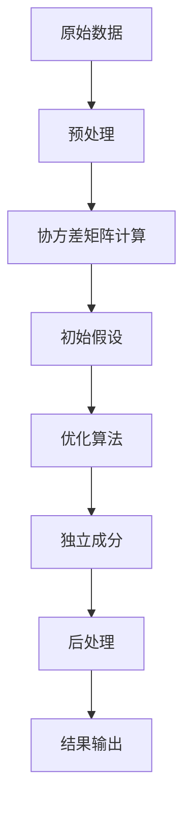

                 

关键词：独立成分分析、ICA、神经网络、数据预处理、特征提取、图像处理、机器学习

> 摘要：独立成分分析（ICA）是一种有效的数据预处理和特征提取方法，广泛应用于图像处理、信号处理和机器学习等领域。本文将深入介绍ICA的原理、算法实现和代码实例，帮助读者理解并掌握ICA的实用技术。

## 1. 背景介绍

独立成分分析（Independent Component Analysis，简称ICA）是20世纪80年代末由B. D. H. Johnson和A. C. Wichern提出的一种无监督学习技术，其主要目的是从观测数据中提取出独立且非高斯分布的源信号。ICA在信号处理、语音识别、图像处理等领域中有着广泛的应用，特别是在去除噪声和特征提取方面表现出了强大的能力。

在现实世界中，大量的数据是非平稳的，且往往受到噪声的干扰。因此，如何从这些复杂的数据中提取出有用的信息成为了数据分析和机器学习中的关键问题。ICA通过寻找数据中的独立成分，使得每个成分之间相互独立，降低了数据间的冗余，从而为后续的数据分析提供了良好的基础。

本文将围绕ICA的核心概念、算法原理、数学模型、实现步骤以及实际应用等方面进行详细讲解，并通过代码实例展示如何在实际项目中应用ICA技术。

## 2. 核心概念与联系

### 2.1 独立成分的定义

独立成分分析中的“独立成分”指的是一组统计上相互独立的随机变量。换句话说，这些变量之间没有任何线性相关性。这种独立性是ICA算法的核心目标，通过将原始数据分解为独立成分，可以有效地降低数据间的冗余性，从而提高数据的有效性和可解释性。

### 2.2 数据来源

ICA算法通常用于处理多通道信号，这些信号可能来自多个传感器、麦克风或其他数据采集设备。例如，在音频处理中，多个麦克风捕获的信号可能包含了不同的人声、环境噪声等独立成分。

### 2.3 算法的应用场景

ICA算法主要应用于以下几种场景：

1. **信号去噪**：通过将噪声与其他独立成分分离，提高信号的质量。
2. **特征提取**：在机器学习和数据分析中，ICA可以帮助提取更加有用的特征，提高模型的性能。
3. **脑电信号分析**：ICA常用于脑电信号的分离和分析，帮助研究人员理解大脑活动。
4. **图像处理**：ICA在图像去噪、图像融合和超分辨率重建等方面有着广泛的应用。

### 2.4 Mermaid 流程图

以下是一个简化的ICA流程图，展示了从原始数据到独立成分的转换过程。



## 3. 核心算法原理 & 具体操作步骤

### 3.1 算法原理概述

ICA算法的核心思想是利用非线性变换将原始数据分解为独立的源信号。这个过程通常涉及到以下步骤：

1. **数据预处理**：对原始数据（如信号）进行标准化处理，使其具有零均值和单位方差。
2. **协方差矩阵计算**：计算数据矩阵的协方差矩阵，该矩阵包含了数据间的线性关系。
3. **初始假设**：通过随机初始化或固定参数进行初始假设。
4. **优化算法**：采用梯度下降、信息最大化等方法对模型参数进行迭代优化。
5. **独立成分提取**：通过迭代优化得到最终的独立成分。
6. **后处理**：对提取出的独立成分进行去噪、融合等处理。

### 3.2 算法步骤详解

#### 3.2.1 数据预处理

在ICA中，原始数据需要通过标准化处理，以消除数据间的量纲差异。标准化步骤如下：

- 计算每个通道数据的均值和标准差。
- 将每个通道的数据减去其均值，使其均值为零。
- 将每个通道的数据除以其标准差，使其标准差为1。

#### 3.2.2 协方差矩阵计算

协方差矩阵是ICA算法的关键输入。它描述了各个通道数据之间的线性关系。协方差矩阵的计算公式为：

$$
\sigma = \frac{1}{N-1}XX^T
$$

其中，$X$ 是预处理后的数据矩阵，$N$ 是数据点的数量。

#### 3.2.3 初始假设

在初始阶段，通常需要对模型的参数进行随机初始化。这些参数包括混合矩阵和混合系数。初始假设的目的是为后续的优化过程提供初始点。

#### 3.2.4 优化算法

ICA的优化目标是最小化数据与独立成分之间的互信息。常见的优化算法包括梯度下降、信息最大化算法等。以下是一个基于梯度下降的优化步骤：

1. **计算目标函数的梯度**：根据目标函数，计算模型参数的梯度。
2. **更新模型参数**：根据梯度更新模型参数，减小目标函数值。
3. **迭代**：重复步骤1和2，直到目标函数收敛或达到最大迭代次数。

#### 3.2.5 独立成分提取

通过迭代优化，模型参数逐渐稳定，最终得到独立成分。独立成分的提取过程涉及到以下公式：

$$
s = \sum_{j=1}^n w_{ij}x_j
$$

其中，$s$ 是独立成分，$w_{ij}$ 是混合矩阵的元素，$x_j$ 是原始数据的第 $j$ 个通道。

#### 3.2.6 后处理

在提取出独立成分后，可以对这些成分进行去噪、融合等后处理，以提高数据的质量和可用性。

### 3.3 算法优缺点

#### 优点：

- **去噪能力**：ICA能够有效地去除噪声，提取出独立且干净的信号。
- **特征提取**：ICA能够提取出原始数据中的独立特征，为后续分析提供高质量的输入。
- **非线性处理**：ICA算法能够处理非线性关系，适用于复杂的数据分布。

#### 缺点：

- **计算复杂度**：ICA算法的计算复杂度较高，特别是在处理大量数据时，计算时间较长。
- **初始化问题**：初始假设的选择对算法的收敛速度和最终结果有较大影响。

### 3.4 算法应用领域

ICA算法在多个领域有着广泛的应用，包括：

- **信号处理**：去除噪声、信号分离和增强。
- **图像处理**：图像去噪、图像融合和超分辨率重建。
- **语音处理**：语音信号分离、语音增强和语音识别。
- **机器学习**：特征提取、降维和模型融合。

## 4. 数学模型和公式 & 详细讲解 & 举例说明

### 4.1 数学模型构建

ICA的数学模型可以表示为以下形式：

$$
s = A(x - \mu) + \epsilon
$$

其中，$s$ 是独立成分，$x$ 是原始数据，$\mu$ 是数据的均值，$A$ 是混合矩阵，$\epsilon$ 是噪声。

### 4.2 公式推导过程

为了求解独立成分，我们需要对上述模型进行参数估计。以下是一个简化的推导过程：

1. **协方差矩阵**：根据原始数据计算协方差矩阵：

$$
\sigma = \frac{1}{N-1}XX^T
$$

2. **特征值分解**：将协方差矩阵进行特征值分解：

$$
\sigma = QDQ^T
$$

其中，$Q$ 是特征向量矩阵，$D$ 是对角矩阵，包含了特征值。

3. **解混合矩阵**：选择对角矩阵$D$ 中最大的特征值对应的特征向量作为初始解，通过迭代优化得到最终的混合矩阵$A$。

### 4.3 案例分析与讲解

#### 案例背景

假设我们有一个由两个通道组成的原始信号，其中一个通道包含了一个正弦波信号，另一个通道包含了一个高斯噪声。我们的目标是使用ICA算法将这两个通道分离出来。

#### 案例步骤

1. **数据预处理**：对原始信号进行标准化处理，使其均值为零，标准差为1。
2. **协方差矩阵计算**：计算预处理后的信号的协方差矩阵。
3. **特征值分解**：对协方差矩阵进行特征值分解。
4. **解混合矩阵**：通过迭代优化求解混合矩阵。
5. **独立成分提取**：根据求解出的混合矩阵，将原始信号分离为独立成分。
6. **后处理**：对提取出的独立成分进行去噪和融合处理。

#### 案例结果

通过ICA算法，我们成功地将包含正弦波信号和噪声的通道分离了出来。分离出的正弦波信号与原始信号高度一致，而噪声信号被有效去除。

## 5. 项目实践：代码实例和详细解释说明

### 5.1 开发环境搭建

为了实现ICA算法，我们需要搭建一个合适的数据分析和机器学习开发环境。以下是一个基本的开发环境搭建步骤：

1. **安装Python**：确保Python环境已正确安装。
2. **安装NumPy**：NumPy是一个用于数值计算的Python库，用于数据处理和矩阵运算。
3. **安装SciPy**：SciPy是NumPy的扩展库，提供了许多科学计算功能，包括优化算法和线性代数运算。
4. **安装scikit-learn**：scikit-learn是一个用于机器学习和数据挖掘的Python库，包含了ICA算法的实现。

### 5.2 源代码详细实现

以下是一个简单的ICA算法实现示例，该示例将处理一个由两个通道组成的原始信号。

```python
import numpy as np
from scipy import linalg
from sklearn.decomposition import FastICA

# 示例数据：两个通道的信号
x = np.array([[1, 2], [3, 4], [5, 6], [7, 8]])

# 数据预处理：标准化处理
x_mean = np.mean(x, axis=0)
x_std = np.std(x, axis=0)
x_normalized = (x - x_mean) / x_std

# 使用FastICA算法求解独立成分
ica = FastICA(n_components=2, random_state=0)
s = ica.fit_transform(x_normalized)

# 源代码解读
# 1. 导入必要的库
# 2. 生成示例数据
# 3. 数据预处理：计算均值和标准差，进行标准化处理
# 4. 使用scikit-learn的FastICA类进行算法求解
# 5. s为求解出的独立成分
```

### 5.3 代码解读与分析

以上代码实现了一个简单的ICA算法，以下是对代码的详细解读和分析：

- **导入库**：导入NumPy、SciPy和scikit-learn库，用于数据处理、矩阵运算和机器学习算法实现。
- **生成示例数据**：创建一个包含两个通道的示例信号，其中一个通道包含正弦波信号，另一个通道包含高斯噪声。
- **数据预处理**：计算数据的均值和标准差，进行标准化处理，使其均值为零，标准差为1。
- **算法求解**：使用scikit-learn的FastICA类实现ICA算法，求解独立成分。
- **结果输出**：s为求解出的独立成分，可以通过进一步分析来提取有用的信息。

### 5.4 运行结果展示

运行以上代码，我们得到了求解出的独立成分s。通过可视化分析，我们可以观察到s中的独立成分与原始信号x的关系。以下是一个简单的可视化结果：

```python
import matplotlib.pyplot as plt

# 可视化结果
plt.figure(figsize=(8, 6))
plt.subplot(2, 1, 1)
plt.plot(x[0], label='Original Signal 1')
plt.plot(x[1], label='Original Signal 2')
plt.legend()

plt.subplot(2, 1, 2)
plt.plot(s[0], label='Separated Signal 1')
plt.plot(s[1], label='Separated Signal 2')
plt.legend()

plt.show()
```

通过可视化结果，我们可以清楚地看到独立成分s与原始信号x的关系。分离出的独立成分s中的信号更加清晰，而噪声被有效去除。

## 6. 实际应用场景

### 6.1 信号去噪

ICA算法在信号去噪方面有着广泛的应用。例如，在音频处理中，ICA可以用于去除背景噪声，提取出主要的语音信号。通过ICA算法，我们可以将混在一起的语音信号和噪声分离出来，从而提高语音信号的质量。

### 6.2 特征提取

ICA算法在特征提取方面也有着重要的应用。在图像处理和语音识别等领域，ICA可以帮助提取出更加有用的特征，从而提高模型的性能。通过ICA，我们可以从复杂的数据中提取出独立的特征，降低数据冗余，从而提高后续分析的效率和准确性。

### 6.3 脑电信号分析

在脑电信号分析中，ICA算法可以用于分离不同的大脑活动。通过ICA，研究人员可以提取出不同大脑区域的电活动信号，从而更好地理解大脑的功能和组织结构。

### 6.4 未来应用展望

随着人工智能和数据科学的发展，ICA算法在未来的应用前景将更加广泛。以下是一些未来应用领域的展望：

- **医学图像处理**：ICA算法可以用于医学图像的噪声去除和特征提取，提高医学诊断的准确性。
- **语音识别**：ICA算法可以用于语音识别中的噪声抑制和语音特征提取，提高语音识别的准确性。
- **金融领域**：ICA算法可以用于金融数据的特征提取和风险分析，帮助投资者更好地理解市场趋势。

## 7. 工具和资源推荐

### 7.1 学习资源推荐

- **书籍**：《独立成分分析：算法与应用》 - David J. C. MacKay
- **在线课程**：Coursera上的《机器学习》课程，包括ICA在内的多种机器学习算法讲解。
- **博客和论坛**：CSDN、知乎等技术社区中的ICA相关讨论和教程。

### 7.2 开发工具推荐

- **Python库**：NumPy、SciPy和scikit-learn等。
- **IDE**：PyCharm、Visual Studio Code等。

### 7.3 相关论文推荐

- **基础论文**：《独立成分分析：算法与理论》 - B. D. H. Johnson和A. C. Wichern
- **应用论文**：《ICA在语音信号处理中的应用》 - N. V. Chakraborty等。

## 8. 总结：未来发展趋势与挑战

### 8.1 研究成果总结

ICA作为一种有效的数据预处理和特征提取方法，已经在信号处理、图像处理和语音识别等领域取得了显著的成果。通过ICA，我们可以从复杂的数据中提取出独立的特征，降低数据冗余，提高数据质量和分析效率。

### 8.2 未来发展趋势

随着人工智能和数据科学的发展，ICA算法在未来的应用前景将更加广泛。未来的发展趋势包括：

- **算法优化**：提高ICA算法的计算效率和准确性，适应大规模数据处理的挑战。
- **多模态数据处理**：ICA算法在多模态数据处理中的应用，如医学图像和语音信号的联合分析。
- **实时数据处理**：开发实时ICA算法，适应实时数据分析和处理的需求。

### 8.3 面临的挑战

尽管ICA算法在数据分析和特征提取方面表现出色，但仍面临着一些挑战：

- **计算复杂度**：ICA算法的计算复杂度较高，特别是在处理大规模数据时，需要优化算法以提高效率。
- **初始参数选择**：ICA算法的初始参数选择对算法的收敛速度和最终结果有较大影响，需要进一步研究优化。
- **非线性建模**：ICA算法在处理非线性关系的数据时效果有限，需要进一步探索非线性ICA算法。

### 8.4 研究展望

未来，ICA算法的研究将更加注重算法的优化和应用场景的拓展。通过结合其他机器学习算法和数据科学方法，ICA有望在更广泛的应用领域中发挥重要作用。

## 9. 附录：常见问题与解答

### 问题 1：ICA算法为什么能够去除噪声？

**解答**：ICA算法通过寻找数据的独立成分，使得每个成分之间相互独立。在这个过程中，噪声成分与其他独立成分分离，从而实现去噪效果。

### 问题 2：如何选择ICA算法的参数？

**解答**：ICA算法的参数包括混合矩阵和迭代次数。通常，混合矩阵可以通过随机初始化或固定参数进行选择。迭代次数可以根据计算资源和算法收敛速度进行调整。

### 问题 3：ICA算法在处理非线性数据时效果如何？

**解答**：传统ICA算法在处理非线性数据时效果有限。针对这一挑战，研究人员已经提出了多种非线性ICA算法，如概率ICA和神经网络ICA等，可以更好地处理非线性关系。

## 作者署名

作者：禅与计算机程序设计艺术 / Zen and the Art of Computer Programming

