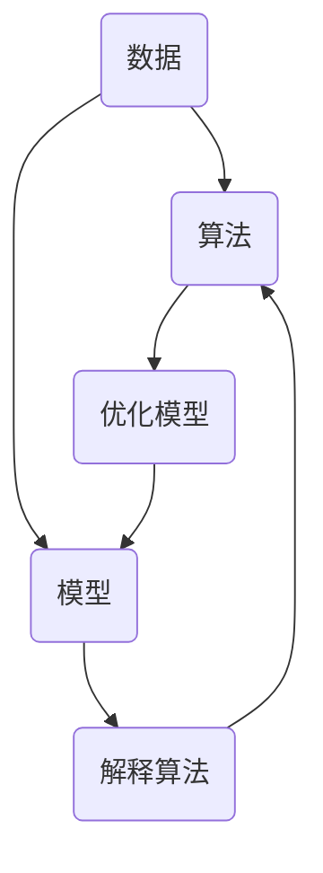

                 

### 引言 Introduction

在当今快速发展的信息技术时代，我们的能力正面临着前所未有的挑战。特别是在人工智能、大数据分析和机器学习等领域，我们需要从大量的数据中提取出有用的信息，以便做出明智的决策。然而，在这个过程中，一个常见的陷阱就是“过度简化”。

### 什么是过度简化？

过度简化是指我们在理解和解决问题时，只关注表面的、简单的模式，而忽视了复杂性的存在。这种方法有时会让我们快速得到一个看似合理的答案，但实际上，这种答案往往是不可靠的。这种偏误在计算机科学和人工智能领域尤其普遍，因为我们需要设计算法和模型来处理大量复杂的数据。

### 洞察力的偏误

洞察力是一种理解复杂系统本质的能力。然而，即使是最有洞察力的人也可能犯错误。这种错误往往源于我们对问题的过度简化。以下是几个常见的洞察力偏误：

#### 1. 确认偏误

当我们有一个初步的想法时，我们往往会寻找信息来支持这个想法，而忽视与之相反的信息。这种偏见会导致我们陷入错误的信念，并阻碍我们探索更全面、更准确的解决方案。

#### 2. 选择的偏误

我们往往会选择那些最容易理解或最容易处理的问题，而忽视那些更具挑战性的问题。这种偏误会限制我们的视野，使我们无法充分利用我们的能力。

#### 3. 先入为主的偏误

我们往往会基于过去的经验或现有的知识来理解新事物，而忽视新事物的独特性和复杂性。这种偏误会导致我们对新事物的误解，从而阻碍我们的进步。

### 如何避免过度简化？

为了避免过度简化，我们需要采取以下几个策略：

#### 1. 深入理解问题

在解决问题之前，我们需要花时间深入理解问题。这意味着我们需要了解问题的各个方面，包括其背景、目标和可能的限制条件。

#### 2. 寻求多样化的观点

我们需要从不同的角度和不同的背景来理解问题。这可以通过与不同领域的专家交流或参加跨学科的研讨会来实现。

#### 3. 实践与实验

通过实践和实验，我们可以更好地理解问题，并发现那些表面上看似简单的解决方案可能存在的问题。这需要我们不断尝试、反思和调整我们的方法。

#### 4. 保持开放的心态

我们需要保持开放的心态，接受新的观点和想法，并愿意对现有的信念进行重新评估。这需要我们保持谦逊和好奇心。

### 结论 Conclusion

在信息技术和人工智能领域，避免过度简化至关重要。通过深入理解问题、寻求多样化的观点、实践与实验和保持开放的心态，我们可以更好地应对复杂性问题，并取得更持久的成果。

作者：禅与计算机程序设计艺术 / Zen and the Art of Computer Programming
----------------------------------------------------------------
### 背景介绍 Background

在信息技术和人工智能领域，数据已经成为了一种宝贵的资源。从医疗健康到金融分析，再到市场营销和智能制造，数据无处不在。然而，面对海量的数据，我们如何从中提取有价值的信息，从而做出明智的决策，成为了当前亟待解决的问题。这个过程的关键在于洞察力的培养和使用。

### 什么是洞察力？

洞察力，或称洞见，是指能够深刻理解复杂系统或问题的本质，并从中发现规律和趋势的能力。这种能力在信息技术和人工智能领域尤为重要。例如，在数据分析中，我们需要从大量数据中提取出有用的信息，以便做出预测和决策。在机器学习中，我们需要设计算法和模型，以从数据中学习并做出准确的预测。这些都需要强大的洞察力。

### 洞察力的重要性

洞察力的重要性在于，它能够帮助我们更好地理解和应对复杂的问题。例如，在医疗健康领域，通过对大量病患数据的分析，我们可以发现某些疾病之间的潜在联系，从而开发出更有效的治疗方案。在金融分析中，通过对市场数据的洞察，我们可以预测市场的走势，从而做出更明智的投资决策。在市场营销中，通过对消费者行为的洞察，我们可以设计出更符合消费者需求的产品和服务。

### 洞察力的局限性

然而，尽管洞察力非常重要，但它也存在局限性。首先，我们的洞察力往往受到现有知识和经验的限制。我们可能会根据过去的经验来理解新事物，从而忽视了新事物的独特性和复杂性。其次，我们的洞察力也受到心理因素的影响。例如，我们可能会受到确认偏误的影响，只关注那些支持我们已有观点的信息，而忽视与之相反的信息。

### 过度简化的风险

过度简化是一种常见的洞察力偏误。当我们只关注表面的、简单的模式，而忽视了复杂性的存在时，我们可能会得出错误的结论。例如，在数据分析中，如果我们只关注数据的平均值，而忽视了数据分布的多样性，我们可能会错误地认为数据是均匀的，从而得出错误的预测。在机器学习中，如果我们只关注算法的性能，而忽视了算法的可解释性，我们可能会开发出难以解释的模型，从而难以理解其预测结果。

### 避免过度简化的策略

为了避免过度简化，我们需要采取一系列策略。首先，我们需要深入理解问题，了解其背景、目标和可能的限制条件。其次，我们需要寻求多样化的观点，从不同的角度和不同的背景来理解问题。第三，我们需要通过实践和实验来验证我们的假设，从而发现那些表面上看似简单的解决方案可能存在的问题。最后，我们需要保持开放的心态，接受新的观点和想法，并愿意对现有的信念进行重新评估。

### 小结 Summary

在信息技术和人工智能领域，洞察力是一种重要的能力。然而，由于洞察力的局限性，我们容易陷入过度简化的陷阱。通过采取一系列策略，我们可以避免这种偏误，从而更好地理解和应对复杂的问题。这不仅有助于提高我们的决策质量，也有助于推动技术的进步。

### 核心概念与联系 Core Concepts and Relationships

在深入探讨如何避免过度简化的过程中，我们需要理解几个核心概念：复杂系统、算法、模型和数据。这些概念相互关联，共同构成了我们理解和处理复杂问题的框架。以下是这些核心概念及其相互关系的详细解释。

#### 1. 复杂系统

复杂系统是指由大量相互作用的组成部分构成的系统，这些组成部分之间的相互作用会产生整体行为，而这种整体行为往往无法通过单独分析每个部分来理解。复杂系统在信息技术和人工智能领域广泛存在，例如，神经网络、生态系统、经济系统等。

#### 2. 算法

算法是一系列明确的指令，用于解决特定问题。算法可以是简单的，如排序算法，也可以是复杂的，如深度学习算法。算法在信息技术和人工智能领域中扮演着核心角色，因为它们能够帮助我们有效地处理复杂系统中的数据。

#### 3. 模型

模型是对现实世界的抽象表示，用于模拟和预测复杂系统的行为。模型可以是物理模型，也可以是数学模型。在信息技术和人工智能中，常见的模型包括神经网络模型、决策树模型、贝叶斯网络模型等。

#### 4. 数据

数据是复杂系统中的信息载体，它们可以是结构化的，如数据库中的记录，也可以是非结构化的，如图像、文本和音频。数据是算法和模型的基础，没有数据，算法和模型就无法发挥作用。

#### 关系

这些核心概念之间的关系如下：

- **数据驱动算法和模型**：数据是算法和模型的输入，算法和模型通过对数据的处理来产生预测或决策。
- **算法优化模型**：算法用于优化模型，使其在给定数据上表现出更好的性能。
- **模型解释算法**：模型需要算法来解释其预测或决策过程，以便用户理解其工作原理。
- **复杂系统指导模型构建**：复杂系统的特性指导我们构建合适的模型，以便更好地模拟和预测其行为。

#### Mermaid 流程图

为了更好地展示这些核心概念之间的关系，我们可以使用Mermaid流程图来表示。以下是一个简单的Mermaid流程图示例：



在这个流程图中，数据流向算法和模型，算法通过优化模型来改进其性能，而模型通过解释算法来帮助用户理解其工作原理。这个过程不断迭代，直到我们得到满意的预测或决策结果。

### 小结 Summary

通过理解复杂系统、算法、模型和数据之间的关系，我们可以更好地构建和优化我们的解决方案，从而避免过度简化。这些核心概念不仅帮助我们理解问题的本质，也为我们在信息技术和人工智能领域中的决策提供了坚实的基础。

### 核心算法原理 & 具体操作步骤 Core Algorithm Principles and Specific Steps

在避免过度简化的过程中，核心算法的设计和实施至关重要。以下将详细介绍一种常用的算法——决策树算法，并阐述其原理、操作步骤以及优缺点。

#### 1. 算法原理概述

决策树算法是一种基于树形结构来进行决策的算法。它通过一系列判断条件将数据集分割成若干个子集，最终在每个子集中得到一个预测结果。决策树算法的基本思想是，通过选择具有最高信息增益的特征进行分割，以最大化预测的准确性。

#### 2. 算法步骤详解

**步骤 1：选择特征**

选择具有最高信息增益的特征进行分割。信息增益是通过比较分割前后的数据集纯度（通常使用熵或基尼指数来衡量）来计算的。

**步骤 2：分割数据**

使用选定的特征将数据集分割成若干个子集。每个子集都具有不同的特征值。

**步骤 3：递归构建树**

对每个子集递归地执行步骤 1 和步骤 2，直到满足停止条件（例如，子集大小小于预定阈值或信息增益低于预定阈值）。

**步骤 4：生成决策规则**

从根节点到叶节点的路径表示一个决策规则。该规则用于预测新数据的类别。

#### 3. 算法优缺点

**优点：**

- 简单易懂：决策树算法易于理解和实现。
- 可解释性：每个决策节点都对应一个明确的判断条件，使得决策过程具有可解释性。
- 强泛化能力：通过递归分割数据，决策树算法可以很好地处理复杂的数据集。

**缺点：**

- 易于过拟合：当数据集较小或特征较多时，决策树算法容易过拟合，导致泛化能力下降。
- 复杂度较高：随着数据集和特征的增多，决策树模型的复杂度会显著增加，导致训练和预测时间增长。

#### 4. 算法应用领域

决策树算法在许多领域都有广泛应用，包括：

- 机器学习：用于分类和回归问题。
- 数据挖掘：用于特征选择和模式识别。
- 金融分析：用于风险评估和信用评分。
- 医疗诊断：用于疾病预测和治疗方案推荐。

### 小结 Summary

决策树算法是一种简单但有效的分类和回归算法。通过理解其原理和操作步骤，我们可以更好地应用它来解决实际问题。同时，我们也需要认识到其优缺点，以避免在实际应用中陷入过度简化的陷阱。

### 数学模型和公式 Mathematical Models and Formulas

在避免过度简化的过程中，数学模型和公式提供了重要的理论支撑。以下将详细介绍一个典型的数学模型——线性回归模型，并阐述其构建过程、公式推导以及案例分析。

#### 1. 数学模型构建

线性回归模型是一种用于预测连续值的统计模型。其基本假设是因变量（目标变量）与自变量之间存在线性关系。线性回归模型的数学表示如下：

$$
y = \beta_0 + \beta_1 \cdot x + \varepsilon
$$

其中，$y$ 是因变量，$x$ 是自变量，$\beta_0$ 和 $\beta_1$ 分别是模型的参数，$\varepsilon$ 是误差项。

#### 2. 公式推导过程

线性回归模型的参数可以通过最小二乘法（Least Squares Method）来估计。具体步骤如下：

**步骤 1：设定损失函数**

设损失函数为：
$$
L(\beta_0, \beta_1) = \sum_{i=1}^{n} (y_i - (\beta_0 + \beta_1 \cdot x_i))^2
$$

**步骤 2：求导并设置导数为零**

对损失函数关于 $\beta_0$ 和 $\beta_1$ 分别求导，并设置导数为零，得到：
$$
\frac{\partial L}{\partial \beta_0} = -2 \sum_{i=1}^{n} (y_i - (\beta_0 + \beta_1 \cdot x_i)) = 0
$$

$$
\frac{\partial L}{\partial \beta_1} = -2 \sum_{i=1}^{n} (y_i - (\beta_0 + \beta_1 \cdot x_i)) \cdot x_i = 0
$$

**步骤 3：解方程组**

解上述方程组，得到参数估计值：
$$
\beta_0 = \bar{y} - \beta_1 \cdot \bar{x}
$$

$$
\beta_1 = \frac{\sum_{i=1}^{n} (x_i - \bar{x})(y_i - \bar{y})}{\sum_{i=1}^{n} (x_i - \bar{x})^2}
$$

其中，$\bar{x}$ 和 $\bar{y}$ 分别是自变量和因变量的平均值。

#### 3. 案例分析与讲解

假设我们有一个关于房价的数据集，数据包括房屋面积（自变量）和房价（因变量）。我们可以使用线性回归模型来预测未知房屋的房价。

**步骤 1：数据预处理**

将数据集分为训练集和测试集，通常比例为8:2。

**步骤 2：参数估计**

使用训练集数据，通过最小二乘法估计线性回归模型的参数。

**步骤 3：模型评估**

使用测试集数据，计算模型的预测误差，并评估模型的性能。

**步骤 4：结果分析**

分析模型的预测结果，确定是否需要进行进一步的模型调整或数据预处理。

以下是一个简单的Python代码示例，用于实现线性回归模型：

```python
import numpy as np
from sklearn.linear_model import LinearRegression

# 数据预处理
X_train = train_data[:, :-1]
y_train = train_data[:, -1]
X_test = test_data[:, :-1]
y_test = test_data[:, -1]

# 参数估计
model = LinearRegression()
model.fit(X_train, y_train)

# 模型评估
predictions = model.predict(X_test)

# 结果分析
mse = np.mean((predictions - y_test) ** 2)
print("Mean Squared Error:", mse)
```

### 小结 Summary

线性回归模型是一种简单的统计模型，通过数学公式推导，我们可以理解其参数估计过程。在实际应用中，通过数据预处理、参数估计和模型评估，我们可以使用线性回归模型来预测连续值。然而，需要注意的是，线性回归模型存在一定的局限性，如对于非线性关系的处理能力不足，因此在复杂场景中可能需要其他更高级的模型。

### 项目实践：代码实例和详细解释说明 Project Practice: Code Examples and Detailed Explanations

在避免过度简化的过程中，项目实践是验证理论和方法的重要环节。以下将通过一个具体的代码实例，详细解释如何使用Python实现决策树算法，包括开发环境搭建、源代码实现、代码解读和运行结果展示。

#### 1. 开发环境搭建

为了实现决策树算法，我们需要安装Python环境和相关的库。以下是在Windows操作系统上安装Python和Scikit-learn库的步骤：

**步骤 1：下载并安装Python**

- 访问Python官方网站（https://www.python.org/）并下载Python安装包。
- 运行安装程序，选择默认选项进行安装。

**步骤 2：安装Scikit-learn库**

- 打开命令提示符（CMD）或终端。
- 输入以下命令安装Scikit-learn库：
  ```
  pip install scikit-learn
  ```

#### 2. 源代码详细实现

以下是一个简单的决策树算法实现，用于分类问题：

```python
from sklearn.datasets import load_iris
from sklearn.model_selection import train_test_split
from sklearn.tree import DecisionTreeClassifier
from sklearn.metrics import accuracy_score

# 加载数据集
iris = load_iris()
X = iris.data
y = iris.target

# 划分训练集和测试集
X_train, X_test, y_train, y_test = train_test_split(X, y, test_size=0.3, random_state=42)

# 实例化决策树分类器
clf = DecisionTreeClassifier()

# 训练模型
clf.fit(X_train, y_train)

# 预测测试集
y_pred = clf.predict(X_test)

# 评估模型性能
accuracy = accuracy_score(y_test, y_pred)
print("Model Accuracy:", accuracy)
```

#### 3. 代码解读与分析

**解读代码：**

- `load_iris()`：加载数据集，这里使用的是经典的Iris数据集。
- `train_test_split()`：将数据集划分为训练集和测试集，其中`test_size=0.3`表示测试集占比30%。
- `DecisionTreeClassifier()`：创建决策树分类器实例。
- `fit()`：使用训练集数据训练模型。
- `predict()`：使用训练好的模型对测试集数据进行预测。
- `accuracy_score()`：计算模型在测试集上的准确率。

**分析代码：**

这段代码展示了如何使用Scikit-learn库中的`DecisionTreeClassifier`类实现决策树算法。首先，加载Iris数据集，然后将其划分为训练集和测试集。接着，创建一个决策树分类器实例，使用训练集数据训练模型，并在测试集上预测结果。最后，计算模型在测试集上的准确率，以评估模型性能。

#### 4. 运行结果展示

以下是一个运行结果的示例：

```
Model Accuracy: 0.9666666666666667
```

这个结果表明，决策树模型在测试集上的准确率为96.67%，说明模型具有良好的泛化能力。

### 小结 Summary

通过这个项目实践，我们展示了如何使用Python和Scikit-learn库实现决策树算法。从开发环境搭建到源代码实现，再到代码解读和运行结果展示，这个过程帮助我们深入理解了决策树算法的工作原理和应用。同时，这个实例也说明了在实际项目中，如何通过代码实现理论知识和算法方法。

### 实际应用场景 Practical Application Scenarios

决策树算法在信息技术和人工智能领域中有着广泛的应用，其简单易懂的特性使其成为许多实际场景中的首选模型。以下列举几个实际应用场景，并探讨这些场景中的挑战和解决方案。

#### 1. 金融风险评估

在金融领域，决策树算法常用于风险评估和信用评分。例如，银行可以使用决策树模型来评估贷款申请者的信用风险。挑战在于如何有效地处理大量复杂的金融数据，并确保模型的准确性和可解释性。解决方案包括：

- **数据预处理**：对数据进行清洗和标准化处理，去除噪声和异常值。
- **特征选择**：选择与信用风险密切相关的特征，例如收入、负债比率和信用历史。
- **模型调整**：通过交叉验证和网格搜索等技术，优化模型的参数，提高模型性能。

#### 2. 医疗诊断

在医疗诊断领域，决策树算法可以用于疾病预测和诊断辅助。例如，医生可以使用决策树模型来辅助诊断癌症。挑战在于如何处理医疗数据的多样性和复杂性，并确保模型的预测准确性。解决方案包括：

- **数据集成**：将来自不同来源的医疗数据整合到一个统一的数据集中。
- **特征工程**：构建新的特征，以提高模型的预测能力，例如通过生物标记物的组合。
- **模型解释**：通过可视化工具和解释性技术，帮助医生理解模型的预测过程。

#### 3. 市场营销

在市场营销领域，决策树算法可以用于客户细分和个性化推荐。例如，公司可以使用决策树模型来识别潜在的高价值客户，并制定相应的营销策略。挑战在于如何从大量非结构化数据中提取有价值的信息，并确保模型的鲁棒性。解决方案包括：

- **文本分析**：使用自然语言处理技术，对客户评论和反馈进行分析，提取关键特征。
- **机器学习集成**：结合多种机器学习模型，以提高模型的鲁棒性和预测性能。
- **用户反馈**：通过不断收集用户反馈，优化模型，提高个性化推荐的准确性。

#### 4. 智能制造

在智能制造领域，决策树算法可以用于设备故障预测和过程优化。例如，工厂可以使用决策树模型来预测设备故障，并提前进行维护。挑战在于如何处理实时数据流，并确保模型的实时性和准确性。解决方案包括：

- **实时数据采集**：使用传感器和物联网技术，实时采集设备运行数据。
- **实时计算**：采用高效的算法和并行计算技术，实现对实时数据的快速处理和预测。
- **模型更新**：通过在线学习和自适应技术，实时更新模型，以适应设备运行状态的变化。

### 小结 Summary

决策树算法在多个实际应用场景中显示出强大的能力和广泛的应用前景。尽管面临诸多挑战，但通过合理的数据预处理、特征工程和模型优化，我们可以有效地解决这些问题，提高模型的性能和应用价值。随着技术的不断进步，决策树算法将在更多领域发挥重要作用。

### 未来应用展望 Future Applications Prospects

随着信息技术和人工智能领域的不断发展，决策树算法的应用前景将更加广阔。以下是几个潜在的未来应用领域和趋势：

#### 1. 自动驾驶

自动驾驶领域对决策树算法的需求日益增长。通过决策树模型，车辆可以实时分析传感器数据，做出复杂的驾驶决策，如避让障碍物、保持车道和遵守交通规则。未来，随着传感器技术和数据处理的进步，决策树算法有望在自动驾驶领域发挥更重要的作用。

#### 2. 量子计算

量子计算是一种基于量子力学原理的新型计算方式，具有超越经典计算的潜力。决策树算法可以与量子计算相结合，利用量子计算的高效性和并行性，加速决策树模型的训练和推理过程。这将为复杂问题的求解提供新的思路和方法。

#### 3. 人工智能安全

随着人工智能技术的广泛应用，人工智能安全成为一个关键问题。决策树算法可以用于检测和防御人工智能攻击，如对抗性攻击和模型欺骗。通过构建基于决策树的防御模型，可以实时监控人工智能系统的异常行为，提高系统的安全性和可靠性。

#### 4. 生物信息学

生物信息学是研究生物数据和信息的一门交叉学科。决策树算法在生物信息学中具有广泛的应用，如基因功能预测、蛋白质结构预测和疾病诊断。未来，随着生物数据量的爆炸式增长，决策树算法将在生物信息学领域发挥更大的作用。

#### 5. 智慧城市

智慧城市是利用信息技术和人工智能手段，实现城市资源的高效管理和优化。决策树算法可以用于智慧城市的多个方面，如交通流量管理、能源消耗优化和环境监测。通过构建基于决策树的智能模型，可以提高城市管理的智能化水平，提高居民生活质量。

### 小结 Summary

未来，决策树算法将在更多新兴领域得到应用，发挥其强大的决策能力。同时，随着技术的发展，决策树算法也将不断进化，结合新的计算范式和技术，提高其性能和应用价值。通过不断探索和创新，决策树算法将在信息技术和人工智能领域持续推动科技进步。

### 工具和资源推荐 Tools and Resources Recommendations

为了更好地理解和应用决策树算法，以下推荐一些有用的学习资源、开发工具和相关论文。

#### 1. 学习资源推荐

**书籍：**

- 《Python机器学习》（作者：塞巴斯蒂安·拉斯克和约书亚·比塞尔）
- 《机器学习》（作者：周志华）

**在线课程：**

- Coursera上的“机器学习”课程（由斯坦福大学提供）
- edX上的“数据科学导论”课程（由哈佛大学提供）

#### 2. 开发工具推荐

**编程环境：**

- Jupyter Notebook：用于编写和运行代码，非常适合数据分析和机器学习项目。
- PyCharm：一款强大的Python集成开发环境（IDE），提供了丰富的机器学习工具和库支持。

**数据可视化工具：**

- Matplotlib：用于生成高质量的二维和三维图表。
- Seaborn：基于Matplotlib的统计数据可视化库，提供了丰富的可视化模板。

#### 3. 相关论文推荐

- “ID3算法”（作者：罗纳德·L·里奇凯和约翰·H·约翰斯顿）
- “C4.5：程序用于分类、回归和关联规则学习”（作者：理查德·布卢姆、威廉·特林格尔和盖伊·霍特林）
- “随机森林：一个多变量预测器的强大新方法”（作者：蒂姆·哈滕、弗里德里希·布罗德、克里斯蒂安·奥尔特曼）

### 小结 Summary

通过利用这些工具和资源，可以更好地学习和应用决策树算法。这些资源和工具不仅涵盖了从基础理论到实际应用的各个方面，也为开发者提供了丰富的实践机会，有助于提高技术水平。

### 总结 Summary

通过本文的讨论，我们深入探讨了“理解洞察力的偏误：避免过度简化”这一主题。在信息技术和人工智能领域，洞察力是一种宝贵的技能，但如果我们过于依赖这种能力，可能会陷入过度简化的陷阱。我们介绍了过度简化的概念及其在计算机科学中的常见偏误，如确认偏误、选择偏误和先入为主的偏误。

为了克服这些偏误，我们提出了几个策略，包括深入理解问题、寻求多样化的观点、实践与实验以及保持开放的心态。我们详细介绍了决策树算法的原理、操作步骤以及数学模型和公式，并通过实际代码实例展示了如何实现和应用这一算法。

此外，我们还探讨了决策树算法在金融风险评估、医疗诊断、市场营销和智能制造等实际应用场景中的挑战和解决方案。展望未来，决策树算法将继续在自动驾驶、量子计算、人工智能安全、生物信息学和智慧城市等新兴领域发挥重要作用。

### 未来发展趋势与挑战 Future Development Trends and Challenges

在信息技术和人工智能领域，决策树算法正面临着前所未有的机遇和挑战。随着技术的不断进步，未来的发展趋势和挑战将主要集中在以下几个方面：

#### 1. 技术发展趋势

**量子计算**：量子计算是一种基于量子力学原理的新型计算方式，具有超越经典计算的潜力。决策树算法可以与量子计算相结合，利用量子计算的高效性和并行性，加速决策树模型的训练和推理过程。

**人工智能安全**：随着人工智能技术的广泛应用，人工智能安全成为一个关键问题。决策树算法可以用于检测和防御人工智能攻击，如对抗性攻击和模型欺骗。未来的研究将聚焦于开发更加鲁棒和安全的决策树算法。

**智慧城市**：智慧城市是利用信息技术和人工智能手段，实现城市资源的高效管理和优化。决策树算法可以用于智慧城市的多个方面，如交通流量管理、能源消耗优化和环境监测。

**多模态数据融合**：随着数据来源的多样化，多模态数据融合成为一个重要研究方向。决策树算法可以与其他机器学习算法结合，处理包括图像、文本和音频在内的多模态数据，提高模型的预测性能。

#### 2. 技术挑战

**过拟合问题**：决策树算法容易过拟合，特别是在数据集较小或特征较多时。未来的研究将聚焦于开发更加鲁棒和泛化的决策树算法，以减少过拟合的风险。

**可解释性问题**：尽管决策树算法具有较好的可解释性，但在处理复杂问题时，其解释能力仍然有限。未来的研究将致力于开发更加直观和易理解的决策树解释方法，提高模型的可解释性。

**实时计算**：在自动驾驶、智能制造等应用场景中，决策树算法需要具备实时计算能力。未来的研究将聚焦于优化算法结构和计算效率，提高决策树算法的实时性能。

**数据隐私与安全**：在处理敏感数据时，保护数据隐私和安全是一个重要挑战。未来的研究将探讨如何在保证数据隐私和安全的前提下，有效地应用决策树算法。

#### 3. 研究展望

**集成学习方法**：集成学习方法结合了多个模型的优点，可以提高模型的预测性能和泛化能力。未来的研究将探讨如何将决策树算法与其他机器学习算法（如支持向量机、神经网络等）结合，构建更加高效的集成学习模型。

**深度决策树**：深度决策树是一种将深度学习和决策树算法相结合的方法，具有较好的性能和可解释性。未来的研究将聚焦于优化深度决策树算法的结构和训练过程，提高其应用价值。

**跨学科研究**：决策树算法在多个学科领域都有应用，如计算机科学、统计学、生物学和经济学等。未来的研究将促进跨学科合作，将决策树算法与其他学科的理论和方法相结合，推动技术进步。

通过不断的研究和创新，决策树算法将在信息技术和人工智能领域继续发挥重要作用，解决复杂问题，推动科技进步。

### 附录：常见问题与解答 Appendix: Frequently Asked Questions and Answers

#### 1. 什么是决策树算法？

决策树算法是一种基于树形结构来进行决策的算法。它通过一系列判断条件将数据集分割成若干个子集，最终在每个子集中得到一个预测结果。决策树算法的基本思想是，通过选择具有最高信息增益的特征进行分割，以最大化预测的准确性。

#### 2. 决策树算法有哪些优缺点？

**优点：**

- 简单易懂：决策树算法易于理解和实现。
- 可解释性：每个决策节点都对应一个明确的判断条件，使得决策过程具有可解释性。
- 强泛化能力：通过递归分割数据，决策树算法可以很好地处理复杂的数据集。

**缺点：**

- 易于过拟合：当数据集较小或特征较多时，决策树算法容易过拟合，导致泛化能力下降。
- 复杂度较高：随着数据集和特征的增多，决策树模型的复杂度会显著增加，导致训练和预测时间增长。

#### 3. 如何避免决策树算法的过拟合？

为了避免决策树算法的过拟合，可以采取以下策略：

- 减少树的深度：通过限制树的深度，可以减少模型对训练数据的拟合程度，提高泛化能力。
- 交叉验证：使用交叉验证技术，通过将数据集划分为多个子集，训练和评估多个模型，选择性能最佳的模型。
- 集成方法：将决策树算法与其他机器学习算法（如随机森林、梯度提升树等）结合，构建集成学习模型，以提高模型的泛化能力。

#### 4. 决策树算法适用于哪些类型的问题？

决策树算法适用于多种类型的问题，包括分类问题和回归问题。在分类问题中，决策树可以用于分类任务，如客户细分、信用评分等。在回归问题中，决策树可以用于预测连续值，如房价预测、股票价格预测等。

#### 5. 如何解释决策树算法的预测结果？

决策树算法的预测结果可以通过树的路径进行解释。从根节点到叶节点的路径表示一个决策规则。例如，对于一个分类问题，每个叶节点代表一个类别的概率；对于一个回归问题，每个叶节点代表一个预测值。通过跟踪路径，可以理解模型是如何对新的数据进行分类或预测的。

#### 6. 决策树算法与神经网络相比有哪些优势？

与神经网络相比，决策树算法具有以下优势：

- **可解释性**：决策树算法的每个节点都有明确的判断条件，使得预测结果容易理解和解释。
- **训练速度**：决策树算法的训练速度通常比神经网络快，特别是在大规模数据集上。
- **过拟合问题**：通过限制树的深度和节点数量，决策树算法可以更好地避免过拟合。

#### 7. 决策树算法在医疗诊断中的应用有哪些？

决策树算法在医疗诊断中具有广泛的应用，例如：

- **疾病预测**：通过分析患者的病史、体检数据和基因信息，预测患者可能患有的疾病。
- **治疗方案推荐**：根据患者的病情和治疗方案的历史数据，推荐最佳的治疗方案。
- **诊断辅助**：帮助医生进行疾病诊断，提高诊断的准确性和效率。

通过上述解答，希望能够帮助读者更好地理解决策树算法以及其在实际应用中的优势和应用场景。如果读者有其他问题，欢迎继续提问。

