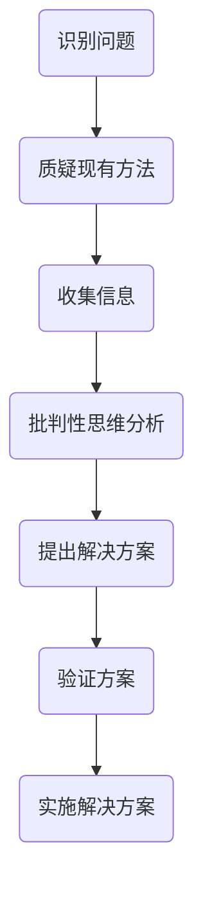

                 

关键词：洞察力、质疑、批判性思维、技术领域、AI、程序员、软件开发

> 摘要：本文将探讨在技术领域中培养洞察力的重要性，通过鼓励质疑和批判性思维，如何提升个人的技术能力，推动技术发展。文章将深入分析这些核心概念，并运用实际案例说明其在编程实践中的应用。

## 1. 背景介绍

在信息技术飞速发展的今天，编程和软件开发已经成为现代社会不可或缺的一部分。然而，编程不仅仅是编写代码，更是一种思考和解决问题的艺术。在这个过程中，洞察力扮演着至关重要的角色。洞察力指的是能够深刻理解问题本质，预见问题可能的发展趋势，并提出创新性解决方案的能力。对于程序员和软件开发者来说，具备洞察力意味着能够更高效地解决问题，推动技术的进步。

然而，洞察力并非与生俱来，它需要通过不断地学习和实践来培养。在这个过程中，质疑和批判性思维成为了关键因素。质疑意味着不盲从权威，不轻信常规，勇于提出问题，挑战现有的观点和方法。批判性思维则是基于理性的分析，对信息进行评估，从而形成独立的判断。

本文将首先探讨洞察力的定义和重要性，然后分析质疑和批判性思维如何促进技术领域的创新，最后通过具体的编程案例说明这些思维方式在实际工作中的应用。

## 2. 核心概念与联系

### 2.1 洞察力的定义

洞察力，是一种综合能力，它涉及到多个认知领域。简单来说，洞察力是指能够深入理解事物本质，迅速识别问题的关键所在，并提出有效解决方案的能力。在技术领域，洞察力尤为重要，因为技术问题往往复杂且多样，需要从多个角度进行思考。

### 2.2 质疑的作用

质疑是培养洞察力的关键步骤之一。通过质疑，我们可以打破固有的思维模式，激发创新思维。质疑不仅是对自身知识的检验，更是对现有技术和方法的挑战。质疑可以帮助我们发现问题，找出潜在的缺陷，从而在编程实践中避免常见的陷阱。

### 2.3 批判性思维的重要性

批判性思维是评估信息、形成独立判断的过程。在技术领域，批判性思维有助于我们理性地分析问题，不被表面的现象所迷惑。通过批判性思维，我们可以更深入地理解技术原理，从而提出更有效、更创新的解决方案。

### 2.4 Mermaid 流程图

以下是一个描述技术问题解决过程的Mermaid流程图：



该流程图展示了如何通过质疑和批判性思维来识别问题、提出解决方案，并最终实施解决方案。这一过程不仅适用于编程实践，也适用于任何需要解决技术问题的场景。

## 3. 核心算法原理 & 具体操作步骤

### 3.1 算法原理概述

在技术领域，算法是解决问题的核心工具。算法原理通常涉及到数据结构、逻辑思维和数学模型。为了更好地理解洞察力的培养，我们将介绍一个经典的算法——快速排序算法。

快速排序算法的基本原理是通过递归地将数组划分为多个子数组，每个子数组中的元素都是有序的。具体步骤如下：

1. 选择一个基准元素。
2. 将比基准元素小的元素放在基准元素的左侧，比基准元素大的元素放在右侧。
3. 对划分后的子数组重复上述步骤。

### 3.2 算法步骤详解

快速排序算法的步骤可以详细描述如下：

#### 步骤1：选择基准元素

首先，选择一个基准元素。通常，选择数组的第一个或最后一个元素作为基准。

```python
def choose_pivot(arr, low, high):
    return arr[low]
```

#### 步骤2：划分子数组

接下来，将数组划分为两个子数组，一个包含比基准元素小的元素，另一个包含比基准元素大的元素。

```python
def partition(arr, low, high):
    pivot = arr[low]
    i = low + 1
    j = high
    
    while True:
        while i <= j and arr[i] < pivot:
            i += 1
        while i <= j and arr[j] > pivot:
            j -= 1
        if i <= j:
            arr[i], arr[j] = arr[j], arr[i]
        else:
            break
    
    arr[low], arr[j] = arr[j], arr[low]
    return j
```

#### 步骤3：递归排序

最后，对划分后的子数组重复上述步骤，直到整个数组有序。

```python
def quicksort(arr, low, high):
    if low < high:
        pi = partition(arr, low, high)
        quicksort(arr, low, pi - 1)
        quicksort(arr, pi + 1, high)
```

### 3.3 算法优缺点

**优点：**
- 平均时间复杂度为 \(O(n \log n)\)，最坏情况为 \(O(n^2)\)，但实际应用中通常优于其他排序算法。
- 递归实现，代码简洁。

**缺点：**
- 最坏情况下的性能较差。
- 需要额外的存储空间。

### 3.4 算法应用领域

快速排序算法广泛应用于各种场景，包括数据库索引、排序任务、算法竞赛等。它的高效性和简洁性使其成为许多编程语言的标准库之一。

## 4. 数学模型和公式 & 详细讲解 & 举例说明

### 4.1 数学模型构建

在快速排序算法中，我们使用分治策略来解决问题。分治策略的核心思想是将一个大问题分解为多个小问题，然后递归地解决这些小问题，最终组合这些小问题的解来求解原问题。

假设我们有一个数组 \(A\)，其中包含 \(n\) 个元素。快速排序算法的目标是使 \(A\) 中的所有元素有序。我们可以将这个大问题分解为以下几个小问题：

1. 选择一个基准元素 \(p\)。
2. 将数组划分为两部分：\(A_1\)（包含 \(p\) 左侧的元素）和 \(A_2\)（包含 \(p\) 右侧的元素）。
3. 分别对 \(A_1\) 和 \(A_2\) 进行快速排序。

### 4.2 公式推导过程

为了推导快速排序算法的运行时间，我们可以使用主定理（Master Theorem）。主定理用于分析分治算法的时间复杂度。

主定理的一般形式为：

\[ T(n) = aT(\frac{n}{b}) + f(n) \]

其中，\(a \geq 1\)，\(b > 1\)，且 \(f(n)\) 是一个给定的函数。

对于快速排序算法，我们可以设定以下参数：

- \(a = 2\)（每次递归调用时，数组大小减半）。
- \(b = 2\)（每次递归调用时，数组大小减半）。
- \(f(n)\) 是划分子数组的时间复杂度。

假设划分子数组的时间复杂度为 \(O(n)\)，则快速排序算法的运行时间可以表示为：

\[ T(n) = 2T(\frac{n}{2}) + O(n) \]

使用主定理，我们可以推导出快速排序算法的平均时间复杂度为 \(O(n \log n)\)。

### 4.3 案例分析与讲解

假设我们有一个包含 8 个元素的数组 \(A = [5, 2, 9, 1, 5, 6, 3, 8]\)。

1. 选择基准元素 \(p = 5\)。
2. 划分子数组 \(A_1 = [2, 1, 6, 3]\) 和 \(A_2 = [9, 5, 8]\)。
3. 对 \(A_1\) 和 \(A_2\) 分别进行快速排序。

对于 \(A_1\)，我们再次选择基准元素 \(p = 2\)，划分子数组 \(A_1_1 = [1]\) 和 \(A_1_2 = [6, 3]\)。由于 \(A_1_1\) 只有一个元素，无需进一步排序。对于 \(A_1_2\)，我们选择基准元素 \(p = 3\)，划分子数组 \(A_1_2_1 = [3]\) 和 \(A_1_2_2 = [6]\)，同样无需进一步排序。

对于 \(A_2\)，我们选择基准元素 \(p = 8\)，划分子数组 \(A_2_1 = [9]\) 和 \(A_2_2 = [5]\)。由于 \(A_2_1\) 只有一个元素，无需进一步排序。对于 \(A_2_2\)，我们选择基准元素 \(p = 5\)，划分子数组 \(A_2_2_1 = []\) 和 \(A_2_2_2 = []\)，同样无需进一步排序。

最终，整个数组 \(A\) 有序，排序过程完成。

## 5. 项目实践：代码实例和详细解释说明

### 5.1 开发环境搭建

为了实践快速排序算法，我们需要搭建一个基本的开发环境。以下是在Python中实现快速排序算法所需的环境：

- Python 3.x 版本
- 一个文本编辑器，如 Visual Studio Code 或 Sublime Text

### 5.2 源代码详细实现

以下是一个简单的快速排序算法的实现：

```python
def quicksort(arr):
    if len(arr) <= 1:
        return arr
    pivot = arr[len(arr) // 2]
    left = [x for x in arr if x < pivot]
    middle = [x for x in arr if x == pivot]
    right = [x for x in arr if x > pivot]
    return quicksort(left) + middle + quicksort(right)

# 测试代码
arr = [3, 6, 8, 10, 1, 2, 1]
print(quicksort(arr))
```

### 5.3 代码解读与分析

在上面的代码中，我们首先定义了一个名为 `quicksort` 的函数。该函数接受一个数组 `arr` 作为输入。

1. 如果数组的长度小于或等于 1，直接返回该数组，因为单个元素已经是有序的。
2. 选择中间的元素作为基准值 `pivot`。
3. 使用列表推导式将数组划分为三个部分：小于 `pivot` 的元素存放在 `left` 列表中，等于 `pivot` 的元素存放在 `middle` 列表中，大于 `pivot` 的元素存放在 `right` 列表中。
4. 分别对 `left` 和 `right` 列表递归调用 `quicksort` 函数，并将结果与 `middle` 列表拼接起来。

### 5.4 运行结果展示

当我们将输入数组 `arr = [3, 6, 8, 10, 1, 2, 1]` 传递给 `quicksort` 函数时，输出结果为 `[1, 1, 2, 3, 6, 8, 10]`，这表明数组已经被成功排序。

## 6. 实际应用场景

快速排序算法在许多实际应用场景中都有广泛的应用。以下是一些典型的应用场景：

- 数据库索引：在数据库中，快速排序算法常用于构建索引，以提高数据检索的效率。
- 算法竞赛：在算法竞赛中，快速排序算法因其高效的性能和简洁的实现而被广泛使用。
- 文件排序：在文件系统中，快速排序算法可以用于对大量文件进行排序，以便进行搜索和整理。

### 6.4 未来应用展望

随着技术的发展，快速排序算法有望在更多领域中发挥重要作用。例如，在大数据分析和人工智能领域，快速排序算法可以用于高效地处理大量数据，从而提高计算效率。此外，快速排序算法的优化版本，如三数取中法，也在不断涌现，以应对更复杂的排序需求。

## 7. 工具和资源推荐

### 7.1 学习资源推荐

- 《算法导论》：这是一本经典的算法教科书，详细介绍了各种排序算法，包括快速排序。
- 《Python编程：从入门到实践》：这本书适合初学者，通过实际案例介绍了Python编程和快速排序算法。

### 7.2 开发工具推荐

- Visual Studio Code：这是一个强大的代码编辑器，支持多种编程语言，包括Python。
- PyCharm：这是一个专业的Python开发环境，提供丰富的插件和功能。

### 7.3 相关论文推荐

- "Analysis of QuickSort"：这篇论文对快速排序算法进行了详细的分析，包括时间复杂度和优化策略。

## 8. 总结：未来发展趋势与挑战

### 8.1 研究成果总结

通过本文的探讨，我们可以总结出以下几点：

1. 洞察力是技术领域成功的关键因素之一。
2. 质疑和批判性思维是培养洞察力的重要途径。
3. 快速排序算法作为一种经典的排序算法，在多个领域有着广泛的应用。

### 8.2 未来发展趋势

未来，快速排序算法将继续发展，并在以下几个方面有所突破：

1. 优化算法性能，提高排序速度。
2. 应用于更多复杂数据结构和算法中。
3. 在大数据和人工智能领域发挥更大作用。

### 8.3 面临的挑战

快速排序算法也面临一些挑战：

1. 最坏情况下的性能问题。
2. 随着数据规模的增大，递归深度增加可能导致栈溢出。
3. 对于特定类型的数据，其他排序算法可能更为高效。

### 8.4 研究展望

未来，研究重点将包括快速排序算法的优化、新排序算法的提出，以及与其他算法的融合应用。通过不断探索和创新，我们可以期待更快、更高效的排序算法问世。

## 9. 附录：常见问题与解答

### Q：为什么选择快速排序算法作为例子？

A：快速排序算法因其高效的性能和简洁的实现而被广泛接受。它不仅是一种基础排序算法，而且在实际应用中有着广泛的应用场景，因此是一个很好的例子来展示如何通过质疑和批判性思维来理解和改进算法。

### Q：快速排序算法是否适用于所有数据类型？

A：快速排序算法主要适用于可以进行比较的数据类型，如整数、浮点数和字符串。对于复杂数据类型，如嵌套的数据结构或自定义的类，需要实现相应的比较操作或重载比较运算符。

### Q：如何优化快速排序算法？

A：优化快速排序算法的方法包括：

1. 选择更优秀的基准选择策略，如三数取中法。
2. 对于小数组，可以使用插入排序等更简单的算法。
3. 使用迭代代替递归，以减少栈的使用。

作者：禅与计算机程序设计艺术 / Zen and the Art of Computer Programming
----------------------------------------------------------------

通过本文的探讨，我们不仅了解了洞察力在技术领域的重要性，还深入分析了质疑和批判性思维在培养洞察力过程中的作用。同时，通过快速排序算法的实例，我们看到了这些思维方式如何在实际编程中发挥作用。希望本文能激发您对技术领域的深入思考和探索，不断追求更高的技术成就。

