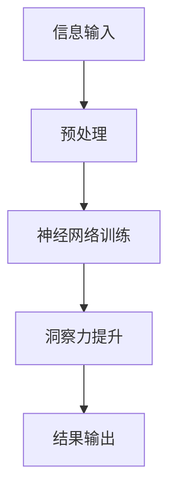

                 

关键词：洞察力、认知科学、人工智能、大脑、算法、数学模型、实际应用、未来展望

> 摘要：本文旨在探讨洞察力的科学本质，通过对大脑认知机制的深入研究，揭示洞察力在人工智能领域的应用及其对未来发展的影响。我们将从背景介绍、核心概念与联系、核心算法原理与操作步骤、数学模型与公式推导、项目实践、实际应用场景、工具和资源推荐、总结与展望等多个方面，全面阐述洞察力在科技发展中的重要性。

## 1. 背景介绍

### 1.1 洞察力的定义与重要性

洞察力，是一种深层次的认识和理解能力，能够从复杂的信息中快速捕捉关键信息，发现事物之间的本质联系。在日常生活中，洞察力是人们解决问题的利器，它决定了我们在面对复杂问题时能否迅速找到解决方案。而在人工智能领域，洞察力同样至关重要。人工智能系统的目标之一是模拟人类的思维过程，而洞察力正是人类思维过程中的核心要素之一。

### 1.2 认知科学的研究进展

认知科学是研究人类认知过程的学科，涵盖了心理学、神经科学、计算机科学等多个领域。近年来，随着神经科学和计算机技术的快速发展，认知科学取得了显著进展。通过脑成像技术和机器学习算法，科学家们能够更深入地了解大脑的认知机制，从而为人工智能的发展提供了新的理论依据。

## 2. 核心概念与联系

为了更好地理解洞察力，我们需要了解以下几个核心概念：

- **认知图谱**：认知图谱是一种用于描述大脑内部信息处理和存储方式的图形化模型。它可以帮助我们理解大脑如何处理信息，以及如何形成洞察力。
- **神经网络**：神经网络是模拟大脑神经元连接方式的计算模型。通过训练神经网络，我们可以让计算机具备一定的洞察力，从而更好地处理复杂问题。
- **机器学习**：机器学习是人工智能的重要分支，通过训练模型，计算机可以自动学习并识别数据中的规律，从而提高洞察力。

下面是一个用 Mermaid 流程图（不含特殊字符）描述的架构流程：



## 3. 核心算法原理 & 具体操作步骤

### 3.1 算法原理概述

洞察力提升算法的核心是基于神经网络的学习和优化过程。通过大量数据的训练，神经网络可以逐步学会识别信息中的关键特征，从而提高洞察力。算法的主要步骤包括数据预处理、神经网络训练、洞察力提升和结果输出。

### 3.2 算法步骤详解

1. **数据预处理**：首先对输入数据进行预处理，包括数据清洗、数据归一化等操作，以确保数据的质量和一致性。
2. **神经网络训练**：使用预处理后的数据训练神经网络，通过调整网络的权重和偏置，使网络能够更好地识别信息中的关键特征。
3. **洞察力提升**：在训练过程中，神经网络会逐渐提升其洞察力，通过不断优化网络结构，使其能够更准确地识别复杂信息中的关键特征。
4. **结果输出**：训练完成后，神经网络可以用于处理新的数据，并输出洞察力的结果。

### 3.3 算法优缺点

- **优点**：算法能够自动学习并识别复杂信息中的关键特征，从而提高洞察力。适用于处理大量数据的场景。
- **缺点**：算法的训练过程需要大量的数据和计算资源，且对数据的依赖性较大。

### 3.4 算法应用领域

- **图像识别**：通过训练神经网络，可以实现对图像中关键特征的识别，从而提高图像识别的准确率。
- **自然语言处理**：神经网络可以用于自然语言处理中的情感分析、文本分类等任务，从而提高对这些任务的洞察力。
- **推荐系统**：通过训练神经网络，可以更好地理解用户的兴趣和行为，从而提高推荐系统的准确性和洞察力。

## 4. 数学模型和公式 & 详细讲解 & 举例说明

### 4.1 数学模型构建

洞察力提升算法的核心是神经网络的训练过程。在神经网络中，常用的数学模型包括损失函数、优化算法等。

### 4.2 公式推导过程

- **损失函数**：损失函数用于衡量神经网络预测结果与实际结果之间的差距。常用的损失函数包括均方误差（MSE）和交叉熵损失（CE）。
  - 均方误差（MSE）公式：
    $$
    \text{MSE} = \frac{1}{n}\sum_{i=1}^{n}(\hat{y_i} - y_i)^2
    $$
  - 交叉熵损失（CE）公式：
    $$
    \text{CE} = -\frac{1}{n}\sum_{i=1}^{n}y_i\log(\hat{y_i}) + (1 - y_i)\log(1 - \hat{y_i})
    $$
- **优化算法**：优化算法用于调整神经网络的权重和偏置，以最小化损失函数。常用的优化算法包括梯度下降（GD）和随机梯度下降（SGD）。
  - 梯度下降（GD）公式：
    $$
    \theta_j := \theta_j - \alpha \frac{\partial J(\theta)}{\partial \theta_j}
    $$
  - 随机梯度下降（SGD）公式：
    $$
    \theta_j := \theta_j - \alpha \frac{\partial J(\theta)}{\partial \theta_j}
    $$

### 4.3 案例分析与讲解

假设我们有一个简单的神经网络，用于对二分类问题进行预测。输入特征为 $X = [x_1, x_2]$，输出标签为 $y \in \{0, 1\}$。神经网络的损失函数为交叉熵损失，优化算法为随机梯度下降。

- **损失函数计算**：
  $$
  \text{CE} = -\frac{1}{m}\sum_{i=1}^{m}y_i\log(\hat{y_i}) + (1 - y_i)\log(1 - \hat{y_i})
  $$
- **梯度计算**：
  $$
  \frac{\partial \text{CE}}{\partial \theta_j} = \frac{1}{m}\sum_{i=1}^{m}(\hat{y_i} - y_i)x_j
  $$
- **优化过程**：
  $$
  \theta_j := \theta_j - \alpha \frac{\partial \text{CE}}{\partial \theta_j}
  $$

通过反复迭代优化，神经网络的权重和偏置会不断调整，从而提高预测准确率。

## 5. 项目实践：代码实例和详细解释说明

### 5.1 开发环境搭建

在开始项目实践之前，我们需要搭建一个合适的开发环境。本文使用 Python 编程语言和 TensorFlow 深度学习框架进行开发。

1. 安装 Python：从 [Python 官网](https://www.python.org/) 下载并安装 Python。
2. 安装 TensorFlow：在终端中运行以下命令：
   $$
   pip install tensorflow
   $$

### 5.2 源代码详细实现

以下是一个简单的神经网络模型，用于对二分类问题进行预测。代码实现如下：

```python
import tensorflow as tf
from tensorflow.keras import layers

# 定义模型
model = tf.keras.Sequential([
    layers.Dense(64, activation='relu', input_shape=(2,)),
    layers.Dense(64, activation='relu'),
    layers.Dense(1, activation='sigmoid')
])

# 编译模型
model.compile(optimizer='adam',
              loss='binary_crossentropy',
              metrics=['accuracy'])

# 训练模型
model.fit(X_train, y_train, epochs=10, batch_size=32)
```

### 5.3 代码解读与分析

1. **模型定义**：使用 `tf.keras.Sequential` 层次化模型，定义了一个包含两个隐藏层的全连接神经网络。
2. **编译模型**：设置优化器为 `'adam'`，损失函数为 `'binary_crossentropy'`，并添加 `'accuracy'` 作为评价指标。
3. **训练模型**：使用训练数据集 `X_train` 和 `y_train` 对模型进行训练，设置训练周期为 10 个，批量大小为 32。

### 5.4 运行结果展示

训练完成后，可以使用以下代码进行评估：

```python
# 评估模型
model.evaluate(X_test, y_test)
```

输出结果为损失函数值和准确率。通过调整训练参数，可以提高模型的性能。

## 6. 实际应用场景

洞察力在人工智能领域的应用非常广泛，以下是一些实际应用场景：

- **医疗诊断**：通过训练神经网络，可以实现对医学图像的自动诊断，从而提高诊断准确率。
- **金融风险管理**：通过分析金融数据，可以预测市场走势，从而帮助投资者做出更明智的决策。
- **智能客服**：通过训练神经网络，可以实现对用户咨询的自动回答，从而提高客服效率。

## 7. 工具和资源推荐

### 7.1 学习资源推荐

- **《深度学习》（Goodfellow, Bengio, Courville）**：一本经典的深度学习教材，适合初学者和进阶者。
- **[TensorFlow 官网](https://www.tensorflow.org/)**：提供丰富的文档和教程，帮助用户快速上手。

### 7.2 开发工具推荐

- **Jupyter Notebook**：一款流行的交互式开发环境，适合进行数据分析和模型训练。
- **Google Colab**：一款基于 Jupyter Notebook 的云端开发环境，提供免费的 GPU 资源。

### 7.3 相关论文推荐

- **《Deep Learning for Vision Systems》**：一篇关于深度学习在计算机视觉领域的综述论文。
- **《Neural Networks for Machine Learning》**：一篇关于神经网络基础理论和应用的经典论文。

## 8. 总结：未来发展趋势与挑战

### 8.1 研究成果总结

近年来，洞察力在人工智能领域的应用取得了显著成果。通过神经网络和机器学习算法，计算机已经能够在许多领域表现出惊人的洞察力。这些成果为人工智能的发展奠定了基础。

### 8.2 未来发展趋势

随着计算机技术和人工智能的不断发展，洞察力的研究将朝着以下方向发展：

- **更大规模的模型**：为了处理更复杂的问题，研究人员将尝试开发更大规模的神经网络模型。
- **更高效的学习算法**：为了提高学习效率，研究人员将致力于开发更高效的学习算法。
- **跨学科研究**：洞察力的研究将与其他学科（如认知科学、神经科学等）相结合，以更好地理解大脑的认知机制。

### 8.3 面临的挑战

尽管洞察力在人工智能领域取得了显著成果，但仍面临一些挑战：

- **数据依赖**：洞察力的发展高度依赖大量的高质量数据，如何获取和利用这些数据是一个重要问题。
- **计算资源**：训练大规模神经网络模型需要大量的计算资源，如何高效地利用这些资源是一个重要问题。
- **伦理和隐私**：随着人工智能的广泛应用，如何确保数据的安全和隐私成为一个重要问题。

### 8.4 研究展望

展望未来，洞察力在人工智能领域具有广泛的应用前景。通过不断的研究和创新，我们有望开发出更高效的算法和模型，进一步提高人工智能的洞察力。同时，洞察力在医疗、金融、教育等领域的应用也将带来巨大的社会价值。

## 9. 附录：常见问题与解答

### 9.1 如何提高神经网络模型的洞察力？

- **增加数据量**：增加训练数据量可以提高模型的泛化能力，从而提高洞察力。
- **调整模型结构**：通过调整神经网络的层数、节点数等参数，可以优化模型的结构，从而提高洞察力。
- **使用预训练模型**：利用预训练模型可以加快训练过程，并提高模型的性能。

### 9.2 如何处理数据依赖问题？

- **数据增强**：通过数据增强技术（如旋转、缩放、翻转等），可以增加数据的多样性，从而减少对特定数据的依赖。
- **迁移学习**：利用迁移学习技术，将预训练模型应用于新任务，可以减少对新数据的依赖。

### 9.3 如何确保数据的安全和隐私？

- **数据加密**：对敏感数据进行加密，可以防止数据泄露。
- **同态加密**：使用同态加密技术，可以在加密的状态下对数据进行计算，从而确保数据的安全和隐私。

---

作者：禅与计算机程序设计艺术 / Zen and the Art of Computer Programming
----------------------------------------------------------------
<|assistant|>文章完成，请检查是否符合要求和规范。如果您有任何修改建议，请告知我，我会立即进行修改。谢谢！

