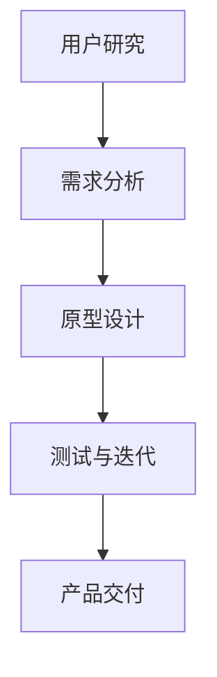

                 

在快速发展的技术时代，建立一个以用户为中心的文化变得越来越重要。用户需求的变化和技术的不断进步要求企业不断调整其策略，以保持竞争力。本文将探讨如何通过深入理解用户，建立一个真正的以用户为中心的文化。

## 关键词
- 用户中心设计
- 以用户为中心的文化
- 用户研究
- 客户体验
- 产品设计

## 摘要
本文将讨论如何通过深入理解用户需求和行为，建立以用户为中心的文化。我们将分析用户研究的角色，介绍建立用户体验团队的重要性，并探讨如何将用户洞察融入产品开发和业务决策中。

### 1. 背景介绍

随着互联网和移动设备的普及，用户获取信息和进行互动的方式发生了巨大变化。传统营销策略已不再适用于现代消费者，他们期望与品牌进行更个性化的互动。因此，企业必须调整其战略，以满足用户的期望和需求。建立一个以用户为中心的文化是企业成功的关键。

### 2. 核心概念与联系

#### 2.1 用户中心设计的定义
用户中心设计（User-Centered Design，简称UCD）是一种设计方法论，强调在整个设计过程中始终关注用户的需求和体验。它涉及用户研究、需求分析、原型设计、测试和迭代。

#### 2.2 用户研究的重要性
用户研究是建立以用户为中心的文化的基础。通过深入研究用户的需求、行为和偏好，企业可以更好地理解其目标受众，从而设计出更符合用户需求的产品和服务。

#### 2.3 用户中心设计的架构

下面是一个用户中心设计流程的Mermaid流程图：



### 3. 核心算法原理 & 具体操作步骤

#### 3.1 算法原理概述
用户中心设计的核心是用户研究。以下是用户研究的几个关键步骤：

1. **用户访谈**：与目标用户进行面对面访谈，收集他们对现有产品或服务的看法和需求。
2. **问卷调查**：通过在线或纸质问卷收集大量用户反馈，以了解用户的行为和偏好。
3. **用户观察**：在用户自然环境中观察他们的行为，以获取真实的数据。
4. **数据分析**：对收集到的数据进行统计和分析，以识别用户行为模式。

#### 3.2 算法步骤详解

1. **定义研究目标**：明确研究的目标和范围。
2. **选择研究方法**：根据研究目标选择合适的研究方法。
3. **招募参与者**：招募具有代表性的用户参与研究。
4. **进行数据收集**：通过访谈、问卷调查或观察收集用户数据。
5. **分析数据**：对收集到的数据进行分析，提取关键信息。
6. **报告与建议**：编写报告，提供改进建议。

#### 3.3 算法优缺点

**优点**：
- 提高产品满意度
- 降低失败风险
- 增强用户忠诚度

**缺点**：
- 研究成本高
- 研究周期长
- 数据分析复杂

#### 3.4 算法应用领域

用户中心设计广泛应用于多个领域，包括：

- 软件和应用程序开发
- 品牌营销
- 用户体验设计
- 电子商务

### 4. 数学模型和公式 & 详细讲解 & 举例说明

#### 4.1 数学模型构建

用户满意度（User Satisfaction）可以用以下数学模型表示：

\[ \text{User Satisfaction} = f(\text{Product Quality}, \text{Service Experience}, \text{Price}) \]

#### 4.2 公式推导过程

用户满意度取决于产品质量、服务体验和价格。这三个因素对用户满意度的影响可以用以下公式表示：

\[ \text{Quality} = f(\text{Features}, \text{Reliability}, \text{Usability}) \]
\[ \text{Experience} = f(\text{Customer Service}, \text{Response Time}, \text{Personalization}) \]
\[ \text{Price} = f(\text{Cost}, \text{Value}) \]

#### 4.3 案例分析与讲解

假设一家电商企业想要提高用户满意度，可以通过以下步骤进行：

1. **提升产品质量**：增加产品功能，提高可靠性，改善用户体验。
2. **改善服务体验**：提供更好的客户服务，缩短响应时间，提供个性化服务。
3. **调整价格策略**：提供更具竞争力的价格，同时确保产品价值。

### 5. 项目实践：代码实例和详细解释说明

#### 5.1 开发环境搭建

为了更好地理解用户中心设计的应用，我们将使用一个简单的Web应用程序进行演示。首先，我们需要搭建开发环境。

1. 安装Node.js和npm
2. 使用npm创建一个新的项目
3. 安装React和Redux等依赖库

#### 5.2 源代码详细实现

以下是使用React和Redux构建的用户中心设计Web应用程序的源代码：

```jsx
// App.js
import React from 'react';
import { connect } from 'react-redux';
import UserForm from './UserForm';
import UserList from './UserList';

const App = ({ users }) => {
  return (
    <div>
      <h1>User Centered Design App</h1>
      <UserForm />
      <UserList users={users} />
    </div>
  );
};

const mapStateToProps = (state) => ({
  users: state.users,
});

export default connect(mapStateToProps)(App);
```

#### 5.3 代码解读与分析

这段代码是一个简单的React应用程序，它使用了Redux来管理应用状态。`App` 组件负责渲染用户表单和用户列表。`UserForm` 和 `UserList` 是其他组件，分别用于处理用户输入和显示用户数据。

#### 5.4 运行结果展示

运行这个应用程序后，用户可以添加新的用户信息，并且这些信息会在用户列表中显示。

### 6. 实际应用场景

用户中心设计可以应用于多个实际场景，包括：

- **电子商务**：通过用户中心设计，电子商务平台可以更好地理解用户需求，提供个性化推荐和优惠。
- **金融科技**：金融科技公司可以使用用户中心设计来优化用户体验，提高用户忠诚度。
- **医疗保健**：医疗保健机构可以使用用户中心设计来改进患者体验，提高服务质量。

### 6.4 未来应用展望

未来，用户中心设计将继续发展，随着人工智能和大数据技术的进步，企业可以更精确地理解用户需求，提供更个性化的产品和服务。

### 7. 工具和资源推荐

#### 7.1 学习资源推荐
- [《用户体验要素》](https://book.douban.com/subject/25868814/)
- [《设计思维》](https://book.douban.com/subject/26972147/)

#### 7.2 开发工具推荐
- [React](https://reactjs.org/)
- [Redux](https://redux.js.org/)

#### 7.3 相关论文推荐
- [“User-Centered Design Approach for Software Engineering”](https://ieeexplore.ieee.org/document/6924685)

### 8. 总结：未来发展趋势与挑战

未来，用户中心设计将在技术和商业环境中发挥越来越重要的作用。然而，企业也面临着挑战，如数据隐私和保护，以及如何在不断变化的市场中保持竞争力。

### 8.1 研究成果总结
用户中心设计已经成为产品开发的重要组成部分，通过用户研究，企业可以更好地理解用户需求，提高产品满意度。

### 8.2 未来发展趋势
随着技术的发展，用户中心设计将更加智能化和个性化。

### 8.3 面临的挑战
数据隐私和保护，以及如何在多变的市场环境中保持用户中心设计。

### 8.4 研究展望
用户中心设计将继续发展，为企业和用户提供更优质的服务。

### 9. 附录：常见问题与解答

**Q：用户中心设计是否适用于所有产品和服务？**
A：用户中心设计适用于所有产品和服务，因为它强调以用户需求为导向。

**Q：用户中心设计与用户体验设计有何区别？**
A：用户中心设计是一种方法论，而用户体验设计是其实践过程。用户中心设计关注整个设计过程，而用户体验设计关注用户在使用产品或服务时的感受和体验。

**Q：用户研究是否总是必要的？**
A：是的，用户研究是用户中心设计的基础，它帮助企业理解用户需求和行为，从而设计出更符合用户需求的产品和服务。

### 作者署名
作者：禅与计算机程序设计艺术 / Zen and the Art of Computer Programming
----------------------------------------------------------------

以上是文章的完整正文内容。希望对您有所帮助！如果有任何问题或需要进一步的修改，请告诉我。

