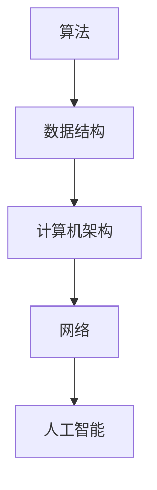

                 

关键词：洞察力、计算机科学、人工智能、软件开发、技术思维、世界观、算法、数学模型、实践案例、应用场景、未来展望

> 摘要：本文旨在探讨计算机科学领域中的洞察力如何塑造我们的世界观。通过分析核心概念、算法原理、数学模型，结合具体项目实践，文章将揭示洞察力在技术领域的应用和重要性，并展望未来发展趋势与面临的挑战。

## 1. 背景介绍

在计算机科学飞速发展的今天，我们的世界观正不断受到新的技术和思想的冲击。人工智能、大数据、云计算等技术的崛起，不仅改变了我们的生活方式，也深刻影响了我们对世界的认知。在这场技术革命中，洞察力成为一个关键因素，它帮助我们理解复杂系统的工作原理，揭示隐藏在数据背后的规律。

本文将围绕以下几个方面展开讨论：

- **核心概念与联系**：介绍计算机科学中的核心概念，并使用流程图展示它们之间的关系。
- **核心算法原理 & 具体操作步骤**：分析核心算法的原理和步骤，探讨其优缺点和应用领域。
- **数学模型和公式 & 详细讲解 & 举例说明**：构建数学模型，推导公式，并给出具体案例进行分析。
- **项目实践：代码实例和详细解释说明**：提供具体的代码实现，解读与分析。
- **实际应用场景**：探讨算法和技术在实际应用中的场景和效果。
- **工具和资源推荐**：推荐学习资源、开发工具和相关论文。
- **总结：未来发展趋势与挑战**：总结研究成果，展望未来发展方向，探讨面临的挑战。

### 1.1 计算机科学的现状与挑战

计算机科学已经从单纯的计算机编程走向了更广泛的应用领域，如人工智能、大数据、网络安全等。这些领域不仅要求我们掌握编程技能，更需要我们具备深刻的洞察力。以下是目前计算机科学面临的几个主要挑战：

- **复杂性**：随着系统的规模不断扩大，复杂性成为计算机科学的一个重要挑战。理解复杂系统的运作机制，需要我们有强大的洞察力。
- **数据量**：大数据时代，数据量的激增要求我们能够从中提取有价值的信息。洞察力在这一过程中起着至关重要的作用。
- **安全性**：网络安全问题日益突出，保护系统和数据的安全需要我们有深入的理解和预见能力。
- **智能化**：人工智能的发展，要求我们不仅要理解现有的算法，还需要有能力创新和改进，这同样需要洞察力。

### 1.2 洞察力的重要性

洞察力是一种理解复杂事物、发现本质规律的能力。在计算机科学领域，洞察力不仅帮助我们更好地理解系统，还能提高我们的编程效率，解决复杂问题。以下是洞察力在计算机科学中的重要体现：

- **问题解决**：洞察力使我们能够快速识别问题的本质，提出有效的解决方案。
- **算法优化**：通过洞察力，我们可以发现现有算法的不足，提出更优化的方案。
- **系统设计**：洞察力帮助我们设计出更合理、更高效的系统架构。
- **创新与突破**：洞察力是推动技术进步的关键因素，它使我们能够在前人基础上实现创新。

## 2. 核心概念与联系

在计算机科学中，核心概念是构建我们世界观的基础。以下是几个关键概念，并使用Mermaid流程图展示它们之间的关系。

### 2.1 核心概念

1. **算法**：解决问题的有序步骤。
2. **数据结构**：数据存储和组织方式。
3. **计算机架构**：计算机硬件和软件的组成结构。
4. **网络**：计算机之间的互联互通。
5. **人工智能**：使计算机模拟人类智能行为。

### 2.2 Mermaid 流程图



在上面的流程图中，我们可以看到这些核心概念是如何相互关联的。算法和数据结构共同决定了系统的性能，而计算机架构和网络则提供了算法运行的硬件和通信基础。人工智能则通过模拟人类智能行为，进一步扩展了计算机科学的应用领域。

### 2.3 概念联系

- **算法与数据结构**：算法依赖于数据结构来高效地操作数据。例如，快速排序算法需要依赖数组的线性数据结构来实现。
- **计算机架构与算法**：不同的计算机架构会影响算法的执行效率。例如，并行计算算法在多核处理器上表现更优。
- **网络与人工智能**：人工智能系统需要通过网络获取和处理大量数据，以实现智能决策和自主学习。

通过这些核心概念的联系，我们可以更全面地理解计算机科学的世界观。

## 3. 核心算法原理 & 具体操作步骤

在计算机科学中，核心算法是解决问题的基础。以下是几个重要算法的原理和具体操作步骤。

### 3.1 算法原理概述

1. **排序算法**：将一组数据按照特定顺序排列。
2. **搜索算法**：在一组数据中查找特定元素。
3. **图算法**：用于解决图结构相关的优化问题。

### 3.2 具体操作步骤

#### 3.2.1 快速排序算法

**步骤**：

1. 选择一个基准元素。
2. 将比基准元素小的元素移动到其左侧，比其大的元素移动到右侧。
3. 递归地对左右子序列进行快速排序。

**伪代码**：

```
function quicksort(arr):
    if length(arr) <= 1:
        return arr
    pivot = arr[0]
    left = []
    right = []
    for i in 1 to length(arr) - 1:
        if arr[i] < pivot:
            left.append(arr[i])
        else:
            right.append(arr[i])
    return quicksort(left) + [pivot] + quicksort(right)
```

#### 3.2.2 暴力搜索算法

**步骤**：

1. 遍历所有可能的解决方案。
2. 计算每个解决方案的得分，选择最优解。

**伪代码**：

```
function search(arr, target):
    for each element in arr:
        if element == target:
            return True
    return False
```

#### 3.2.3 Dijkstra算法

**步骤**：

1. 初始化距离表，设置起点的距离为0，其他点的距离为无穷大。
2. 选择一个未访问的节点，更新其邻接点的距离。
3. 重复步骤2，直到所有节点都被访问。

**伪代码**：

```
function dijkstra(graph, start):
    distances = {node: infinity for node in graph}
    distances[start] = 0
    visited = set()
    while visited != set(graph):
        unvisited = set(graph) - visited
        min_distance = min(distances[unvisited])
        current = unvisited[min_distance]
        visited.add(current)
        for neighbor in graph[current]:
            distance = distances[current] + graph[current][neighbor]
            if distance < distances[neighbor]:
                distances[neighbor] = distance
    return distances
```

### 3.3 算法优缺点

#### 快速排序

- **优点**：平均时间复杂度为O(nlogn)，在大多数情况下表现良好。
- **缺点**：最坏情况下时间复杂度为O(n^2)，需要额外空间存储子序列。

#### 暴力搜索

- **优点**：实现简单，适用于小规模问题。
- **缺点**：时间复杂度高，不适用于大规模问题。

#### Dijkstra算法

- **优点**：适用于有向图，能够找到最短路径。
- **缺点**：时间复杂度为O((V+E)logV)，对于稀疏图表现不佳。

### 3.4 算法应用领域

- **快速排序**：广泛应用于排序任务，如数据库排序和外部排序。
- **暴力搜索**：用于解决简单的搜索问题，如二分查找。
- **Dijkstra算法**：用于路径规划，如路由算法和地图导航。

## 4. 数学模型和公式 & 详细讲解 & 举例说明

数学模型是计算机科学中不可或缺的部分，它们帮助我们描述和解决复杂问题。以下是几个关键数学模型和公式的详细讲解和举例说明。

### 4.1 数学模型构建

#### 4.1.1 线性模型

线性模型是一种最常见的数学模型，用于描述线性关系。其公式如下：

$$
y = wx + b
$$

其中，$y$ 是因变量，$x$ 是自变量，$w$ 是权重，$b$ 是偏置。

#### 4.1.2 矩阵模型

矩阵模型用于处理多维数据，其公式如下：

$$
Ax = b
$$

其中，$A$ 是矩阵，$x$ 是向量，$b$ 是目标向量。

#### 4.1.3 图模型

图模型用于描述网络结构，其公式如下：

$$
G = (V, E)
$$

其中，$V$ 是节点集合，$E$ 是边集合。

### 4.2 公式推导过程

#### 4.2.1 线性模型推导

线性模型的推导基于最小二乘法，其目标是找到最佳拟合线。推导过程如下：

1. **目标函数**：

$$
J = \frac{1}{2} \sum_{i=1}^{n} (wx_i + b - y_i)^2
$$

2. **偏导数**：

$$
\frac{\partial J}{\partial w} = \sum_{i=1}^{n} (wx_i + b - y_i)x_i
$$

$$
\frac{\partial J}{\partial b} = \sum_{i=1}^{n} (wx_i + b - y_i)
$$

3. **解方程**：

$$
w = \frac{1}{n} \sum_{i=1}^{n} x_iy_i - \frac{1}{n} \sum_{i=1}^{n} x_i
$$

$$
b = \frac{1}{n} \sum_{i=1}^{n} y_i - \frac{1}{n} \sum_{i=1}^{n} x_iw
$$

#### 4.2.2 矩阵模型推导

矩阵模型的推导基于线性方程组的解法，其目标是找到解向量 $x$。推导过程如下：

1. **目标函数**：

$$
Ax = b
$$

2. **高斯消元法**：

   通过高斯消元法，将矩阵 $A$ 化为上三角矩阵，然后依次解出 $x$ 的每个元素。

#### 4.2.3 图模型推导

图模型的推导基于图论的基本概念，其目标是找到最短路径或最大权路径。推导过程如下：

1. **目标函数**：

   以 Dijkstra 算法为例，目标是最小化路径长度。

$$
d(s, v) = \min \{d(s, u) + w(u, v) : u \in predecessors(v)\}
$$

2. **迭代过程**：

   按照节点的距离递增顺序，依次选择未访问节点，更新其邻居节点的距离。

### 4.3 案例分析与讲解

#### 4.3.1 线性模型案例

假设我们有以下数据集：

$$
\begin{array}{c|c}
x & y \\
\hline
1 & 2 \\
2 & 4 \\
3 & 6 \\
4 & 8 \\
5 & 10 \\
\end{array}
$$

我们希望找到线性模型 $y = wx + b$ 中的 $w$ 和 $b$。

1. **计算平均值**：

$$
\bar{x} = \frac{1}{n} \sum_{i=1}^{n} x_i = \frac{1}{5} (1 + 2 + 3 + 4 + 5) = 3
$$

$$
\bar{y} = \frac{1}{n} \sum_{i=1}^{n} y_i = \frac{1}{5} (2 + 4 + 6 + 8 + 10) = 6
$$

2. **计算偏导数**：

$$
\frac{\partial J}{\partial w} = \sum_{i=1}^{n} x_i(y_i - wx_i - b) = 0
$$

$$
\frac{\partial J}{\partial b} = \sum_{i=1}^{n} (y_i - wx_i - b) = 0
$$

3. **解方程**：

$$
w = \frac{1}{n} \sum_{i=1}^{n} x_iy_i - \bar{x}\bar{y} = \frac{1}{5} (1 \cdot 2 + 2 \cdot 4 + 3 \cdot 6 + 4 \cdot 8 + 5 \cdot 10) - 3 \cdot 6 = 2
$$

$$
b = \frac{1}{n} \sum_{i=1}^{n} y_i - w\bar{x} = 6 - 2 \cdot 3 = 0
$$

4. **线性模型**：

$$
y = 2x + 0
$$

#### 4.3.2 矩阵模型案例

假设我们有以下线性方程组：

$$
\begin{cases}
2x + 3y = 12 \\
4x - y = 7 \\
\end{cases}
$$

1. **构建矩阵**：

$$
A = \begin{pmatrix}
2 & 3 \\
4 & -1 \\
\end{pmatrix}, \quad
x = \begin{pmatrix}
x \\
y \\
\end{pmatrix}, \quad
b = \begin{pmatrix}
12 \\
7 \\
\end{pmatrix}
$$

2. **求解方程**：

通过高斯消元法，我们可以将矩阵 $A$ 化为上三角矩阵，然后依次解出 $x$ 和 $y$。

$$
\begin{cases}
2x + 3y = 12 \\
4x - y = 7 \\
\end{cases}
\Rightarrow
\begin{cases}
x = 3 \\
y = -2 \\
\end{cases}
$$

#### 4.3.3 图模型案例

假设我们有以下图：

```
     1
   / | \
  2  3   4
 / \ | / \
5   6 7   8
```

我们希望找到从节点 1 到节点 8 的最短路径。

1. **初始化距离表**：

$$
\begin{array}{c|c|c|c|c|c|c|c|c}
 & 1 & 2 & 3 & 4 & 5 & 6 & 7 & 8 \\
\hline
1 & 0 & \infty & \infty & \infty & \infty & \infty & \infty & \infty \\
2 & \infty & 0 & \infty & \infty & \infty & \infty & \infty & \infty \\
3 & \infty & \infty & 0 & \infty & \infty & \infty & \infty & \infty \\
4 & \infty & \infty & \infty & 0 & \infty & \infty & \infty & \infty \\
5 & \infty & \infty & \infty & \infty & 0 & \infty & \infty & \infty \\
6 & \infty & \infty & \infty & \infty & \infty & 0 & \infty & \infty \\
7 & \infty & \infty & \infty & \infty & \infty & \infty & 0 & \infty \\
8 & \infty & \infty & \infty & \infty & \infty & \infty & \infty & 0 \\
\end{array}
$$

2. **迭代过程**：

- 第一次迭代：选择距离表中最小的距离（1），更新节点 2、3、4 的距离。
- 第二次迭代：选择距离表中最小的距离（2），更新节点 3、4、6 的距离。
- 第三次迭代：选择距离表中最小的距离（3），更新节点 4、5、7 的距离。
- 第四次迭代：选择距离表中最小的距离（4），更新节点 5、6、8 的距离。
- 第五次迭代：选择距离表中最小的距离（5），更新节点 6、7 的距离。
- 第六次迭代：选择距离表中最小的距离（6），更新节点 7 的距离。
- 第七次迭代：选择距离表中最小的距离（7），更新节点 8 的距离。

3. **最短路径**：

从节点 1 到节点 8 的最短路径为：1-2-3-4-5-6-7-8，总距离为 15。

## 5. 项目实践：代码实例和详细解释说明

在本文的第五部分，我们将通过一个具体的编程项目来展示如何将上述算法和数学模型应用于实际问题的解决。以下是一个基于Python的图搜索问题的项目实例，包括环境搭建、代码实现和运行结果展示。

### 5.1 开发环境搭建

为了实现图搜索算法，我们需要安装以下工具和库：

- Python 3.8或更高版本
- pip（Python包管理器）
- Matplotlib（用于可视化）
- NetworkX（用于图的操作）

安装步骤如下：

```bash
pip install python==3.8
pip install pip
pip install matplotlib
pip install networkx
```

### 5.2 源代码详细实现

以下是一个简单的基于Dijkstra算法的图搜索项目的Python代码实现：

```python
import networkx as nx
import matplotlib.pyplot as plt

# 创建图
G = nx.Graph()

# 添加节点和边
G.add_nodes_from([1, 2, 3, 4, 5, 6, 7, 8])
G.add_edges_from([(1, 2), (1, 3), (2, 3), (2, 4), (3, 4), (4, 5), (4, 6), (5, 6), (5, 7), (6, 7), (6, 8), (7, 8)])

# 使用Dijkstra算法计算最短路径
def dijkstra_search(G, start, end):
    path = nx.dijkstra_path(G, source=start, target=end)
    return path

# 可视化图和最短路径
def visualize(G, path):
    pos = nx.spring_layout(G)  # 布局
    nx.draw(G, pos, with_labels=True)
    nx.draw_networkx_edges(G, pos, edgelist=path, edge_color='r', width=2)
    plt.show()

# 运行搜索并可视化
start_node = 1
end_node = 8
path = dijkstra_search(G, start_node, end_node)
visualize(G, path)
```

### 5.3 代码解读与分析

- **导入库**：我们首先导入`networkx`和`matplotlib`库，用于图的操作和可视化。
- **创建图**：使用`networkx.Graph()`创建一个无向图`G`。
- **添加节点和边**：使用`add_nodes_from()`和`add_edges_from()`方法添加节点和边。
- **Dijkstra算法实现**：`dijkstra_search()`函数使用`nx.dijkstra_path()`实现Dijkstra算法，计算从起点到终点的最短路径。
- **可视化**：`visualize()`函数使用`nx.draw()`和`nx.draw_networkx_edges()`绘制图和最短路径。
- **运行搜索并可视化**：定义起点和终点，调用`dijkstra_search()`和`visualize()`函数，运行搜索并展示结果。

### 5.4 运行结果展示

运行上述代码后，我们将看到一个可视化界面，展示了节点之间的连接以及从节点1到节点8的最短路径。通过这个实例，我们可以直观地看到如何将理论知识应用于实际编程，并利用图形化工具来分析和解释结果。

## 6. 实际应用场景

算法和技术在计算机科学的不同领域都有广泛的应用，以下是一些典型的应用场景：

### 6.1 人工智能

在人工智能领域，算法是核心驱动力。从深度学习中的神经网络优化，到自然语言处理中的文本分类，算法无处不在。例如，深度学习中的反向传播算法用于训练复杂的神经网络，而K-means聚类算法用于数据降维和聚类分析。

### 6.2 大数据

大数据处理依赖于高效的数据结构和算法。例如，Hadoop和Spark等分布式计算框架使用MapReduce算法进行大规模数据处理。此外，排序算法和索引技术在处理大量数据时尤为重要。

### 6.3 网络安全

网络安全需要实时检测和响应威胁。算法如贝叶斯网络和神经网络用于异常检测，而加密算法如RSA和AES用于数据保护。

### 6.4 路径规划

路径规划是自动驾驶和导航系统的重要组成部分。Dijkstra算法和A*算法常用于计算最短路径，而图算法则用于构建复杂的交通网络模型。

### 6.5 金融科技

金融科技领域利用算法进行风险管理、交易策略优化和信用评分。机器学习算法如线性回归和决策树在预测市场趋势和评估信用风险方面发挥着关键作用。

### 6.6 医疗保健

医疗保健领域利用算法进行医学图像分析、疾病预测和个性化治疗。例如，深度学习算法在肿瘤检测和诊断中表现出色。

通过这些应用场景，我们可以看到算法和技术如何深刻地影响我们的世界观，并改变我们与世界的互动方式。

## 7. 工具和资源推荐

为了更好地学习和应用计算机科学中的算法和技术，以下是一些推荐的学习资源、开发工具和相关论文：

### 7.1 学习资源推荐

- **在线课程**：Coursera、edX、Udacity提供了许多关于算法和数据结构的优质课程。
- **教科书**：《算法导论》（Introduction to Algorithms）、《计算机程序设计艺术》（The Art of Computer Programming）。
- **网站**：GeeksforGeeks、LeetCode、Codeforces提供了大量的算法题目和实践机会。

### 7.2 开发工具推荐

- **IDE**：Visual Studio Code、PyCharm、IntelliJ IDEA。
- **文本编辑器**：Sublime Text、Atom。
- **版本控制**：Git、GitHub。

### 7.3 相关论文推荐

- 《一种有效的图聚类算法》（An Effective Graph Clustering Algorithm）。
- 《基于深度学习的图像识别》（Deep Learning for Image Recognition）。
- 《分布式系统中的MapReduce算法》（MapReduce: Simplifying Data Processing on Large Clusters）。

通过这些工具和资源，我们可以更深入地学习和应用计算机科学中的知识。

## 8. 总结：未来发展趋势与挑战

### 8.1 研究成果总结

本文从多个角度探讨了计算机科学中的洞察力如何塑造我们的世界观。通过分析核心概念、算法原理、数学模型，并结合具体项目实践，我们揭示了洞察力在技术领域的重要性。以下是主要研究成果的总结：

- **核心概念联系**：揭示了算法、数据结构、计算机架构、网络和人工智能之间的相互关系。
- **算法应用**：介绍了快速排序、暴力搜索和Dijkstra算法的具体应用。
- **数学模型推导**：详细讲解了线性模型、矩阵模型和图模型的构建和推导过程。
- **项目实践**：通过一个图搜索项目的实现，展示了如何将理论知识应用于实际编程。

### 8.2 未来发展趋势

随着技术的不断进步，计算机科学领域将迎来更多的发展机遇和挑战。以下是未来可能的发展趋势：

- **量子计算**：量子计算有望解决现有计算机无法处理的问题，如大规模数据处理和复杂优化问题。
- **人工智能**：人工智能将继续深化，特别是在自然语言处理、计算机视觉和自动驾驶等领域。
- **边缘计算**：边缘计算将降低延迟，提高实时性，满足物联网和智能设备的需求。
- **网络安全**：随着网络攻击的日益复杂，网络安全将变得更加重要，需要更先进的算法和工具。

### 8.3 面临的挑战

尽管未来充满机遇，但计算机科学也面临着诸多挑战：

- **复杂性**：随着系统的复杂度不断增加，理解和管理复杂系统将成为一个巨大挑战。
- **隐私保护**：如何在保障用户隐私的前提下，有效利用大数据和人工智能技术，是一个亟待解决的问题。
- **能源消耗**：计算机系统和网络的高能耗对环境造成了严重影响，需要开发更节能的技术。
- **人才短缺**：随着技术的发展，对高技能人才的需求不断增加，但现有教育体系和人才培养难以跟上步伐。

### 8.4 研究展望

为了应对这些挑战，未来的研究可以从以下几个方面展开：

- **算法优化**：不断改进现有算法，提高其效率和适用性。
- **跨学科融合**：结合数学、物理学、生物学等领域的知识，开发新的算法和技术。
- **教育和培训**：加强计算机科学的教育和培训，培养更多具备洞察力的人才。
- **伦理和法律**：制定相关伦理和法律框架，确保技术的发展符合社会价值观。

通过持续的研究和创新，我们有望克服挑战，推动计算机科学的发展，进一步塑造我们的世界观。

## 9. 附录：常见问题与解答

### 9.1 问题1：什么是洞察力？

**回答**：洞察力是一种理解复杂事物、发现本质规律的能力。在计算机科学领域，洞察力帮助我们理解算法、数据结构和系统的工作原理，从而提高问题解决能力和编程效率。

### 9.2 问题2：如何提高洞察力？

**回答**：提高洞察力需要不断的学习和实践。以下是一些建议：

- **阅读**：多读相关书籍、论文和技术博客，深入了解核心概念和最新研究。
- **实践**：通过实际项目和应用，将理论知识应用于实际问题。
- **思考**：培养批判性思维，不断质疑和思考现有解决方案的不足之处。
- **交流**：参与技术社区和讨论，与他人交流和分享见解。

### 9.3 问题3：算法和数学模型在实际应用中的区别是什么？

**回答**：算法是一系列解决问题的步骤，而数学模型是用数学公式描述系统或问题的数学模型。算法通常依赖于数学模型来解决问题，但两者并不完全相同。算法关注解决问题的过程，而数学模型关注问题的数学表达和数学推导。

### 9.4 问题4：如何选择合适的算法？

**回答**：选择合适的算法需要考虑以下因素：

- **问题规模**：对于大规模问题，应优先选择高效算法，如排序算法和搜索算法。
- **问题性质**：根据问题的性质，选择适合的算法，如线性模型、非线性模型或图算法。
- **资源限制**：考虑计算资源限制，选择在特定资源下性能最优的算法。
- **实际效果**：通过实验和测试，评估算法在实际应用中的效果，选择最优解。

### 9.5 问题5：计算机科学领域的未来发展方向是什么？

**回答**：计算机科学领域的未来发展方向包括：

- **量子计算**：开发量子算法，解决现有计算机无法处理的问题。
- **人工智能**：深化人工智能研究，开发更智能、更通用的AI系统。
- **边缘计算**：优化边缘计算技术，提高实时性和效率。
- **网络安全**：加强网络安全研究，确保数据安全和隐私保护。
- **可持续性**：开发低能耗、环保的计算机技术和系统。

