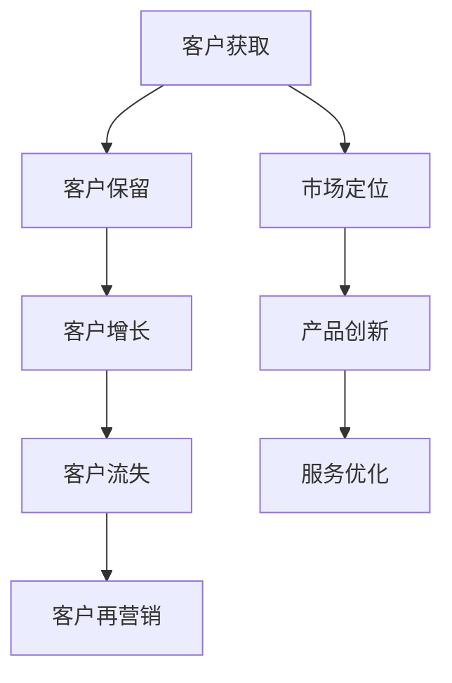

                 

在竞争日益激烈的市场环境中，企业如何赢得客户并保持竞争力，已成为一个至关重要的议题。而站在客户立场上思考问题，不仅是提升客户满意度的关键，更是企业长远发展的必由之路。本文旨在探讨生意场上的智慧，即如何站在客户立场思考问题，为企业提供实用的策略和思维框架。

## 关键词

- 客户关系管理
- 客户体验
- 市场定位
- 产品设计
- 竞争策略

## 摘要

本文从多个角度分析了站在客户立场的重要性，并提出了具体的方法和工具。通过深入了解客户需求、优化产品和服务、提升客户体验、制定精准的市场定位以及构建强大的客户关系，企业可以在激烈的市场竞争中脱颖而出。文章还将探讨这些策略在不同领域的应用，以及未来发展的趋势和挑战。

## 1. 背景介绍

在信息技术和互联网的快速发展下，消费者有了更多的选择和更高的期望。企业不再仅仅依靠产品功能和质量来赢得客户，而是需要从客户的角度出发，提供全方位的解决方案和卓越的体验。研究表明，超过80%的企业认为客户体验是竞争优势的关键，但只有不到20%的企业能够真正实现这一点。

### 1.1 客户体验的重要性

客户体验是企业与客户互动的全过程，包括购买前、购买中和购买后。良好的客户体验不仅能够提升客户满意度和忠诚度，还能促进口碑传播，从而带来更多的业务机会。根据研究，提升客户体验可以将客户保留率提高20%以上。

### 1.2 竞争压力与挑战

在当今市场，竞争日益激烈，产品同质化现象严重。企业要想脱颖而出，必须在客户体验上寻求突破。同时，技术的快速迭代和消费者偏好的变化，也给企业带来了新的挑战。

### 1.3 站在客户立场的必要性

站在客户立场，意味着企业要摒弃传统的自以为是的市场策略，真正理解客户的需求和痛点。只有这样，企业才能设计出满足客户需求的产品和服务，建立起与客户的深厚关系。

## 2. 核心概念与联系

### 2.1 客户价值

客户价值是指客户从购买和使用产品或服务中获得的总收益减去其总成本的差异。理解客户价值是站在客户立场的基础。

### 2.2 客户需求分析

客户需求分析是识别和评估客户需求的过程，通过数据分析、市场调研、用户反馈等方法，深入了解客户的期望和痛点。

### 2.3 客户生命周期管理

客户生命周期管理是指企业通过有效的策略和活动，与客户建立和保持长期关系，从而最大化客户价值。它包括客户获取、客户保留和客户增长三个阶段。

### 2.4 Mermaid 流程图



## 3. 核心算法原理 & 具体操作步骤

### 3.1 算法原理概述

站在客户立场的核心算法是客户需求分析与客户体验优化。其基本原理是通过大数据分析和机器学习，识别客户需求，并在此基础上进行产品和服务创新。

### 3.2 算法步骤详解

1. **数据收集**：通过多种渠道收集客户数据，如销售记录、用户反馈、社交媒体互动等。
2. **需求识别**：利用数据挖掘技术，识别客户的主要需求和痛点。
3. **用户画像**：通过数据分析，构建客户的用户画像，包括年龄、性别、收入、消费习惯等。
4. **产品和服务设计**：根据客户需求，设计满足客户期望的产品和服务。
5. **用户体验测试**：通过用户体验测试，不断优化产品和服务，确保其满足客户的期望。
6. **反馈循环**：建立反馈机制，收集客户的反馈，持续改进产品和服务。

### 3.3 算法优缺点

**优点**：能够精准识别客户需求，提高产品和服务质量，提升客户满意度。

**缺点**：需要大量的数据支持，算法模型构建和维护成本较高。

### 3.4 算法应用领域

- **电子商务**：通过算法分析客户购物行为，提供个性化推荐。
- **金融服务**：利用算法分析客户财务状况，提供定制化金融服务。
- **医疗健康**：通过算法分析患者数据，提供精准的治疗方案。

## 4. 数学模型和公式 & 详细讲解 & 举例说明

### 4.1 数学模型构建

假设客户需求满足度（Customer Satisfaction, CS）与产品特性（Product Attributes, P）和客户期望（Customer Expectation, E）之间的关系可以用以下公式表示：

\[ CS = f(P, E) \]

### 4.2 公式推导过程

1. **需求识别**：利用回归分析，识别影响客户需求的关键因素。
2. **期望构建**：通过用户调研和专家咨询，构建客户的期望值。
3. **满意度评估**：利用评分模型，评估客户的满意度。

### 4.3 案例分析与讲解

以电子商务平台为例，假设某平台通过数据挖掘技术，发现影响客户需求满足度的关键因素是商品质量（Q）、价格（P）和配送速度（D）。

\[ CS = 0.4 \times Q + 0.3 \times P + 0.3 \times D \]

通过用户反馈，得到以下数据：

| 用户 | 商品质量 | 价格 | 配送速度 | 满意度 |
| ---- | ------- | ---- | -------- | ------ |
| A    | 8       | 5    | 7        | 7      |
| B    | 9       | 6    | 8        | 8      |

根据公式计算满意度：

\[ CS_A = 0.4 \times 8 + 0.3 \times 5 + 0.3 \times 7 = 6.6 \]
\[ CS_B = 0.4 \times 9 + 0.3 \times 6 + 0.3 \times 8 = 7.1 \]

通过不断优化商品质量、价格和配送速度，平台可以提高客户的满意度。

## 5. 项目实践：代码实例和详细解释说明

### 5.1 开发环境搭建

本文使用Python编程语言，并依赖以下库：pandas、numpy、scikit-learn、matplotlib。

### 5.2 源代码详细实现

```python
import pandas as pd
from sklearn.linear_model import LinearRegression

# 数据集加载
data = pd.read_csv('customer_data.csv')

# 特征选择
X = data[['Quality', 'Price', 'DeliverySpeed']]
y = data['Satisfaction']

# 模型训练
model = LinearRegression()
model.fit(X, y)

# 预测
predictions = model.predict(X)

# 结果可视化
import matplotlib.pyplot as plt

plt.scatter(X['Quality'], y)
plt.plot(X['Quality'], predictions, color='red')
plt.xlabel('Quality')
plt.ylabel('Satisfaction')
plt.show()
```

### 5.3 代码解读与分析

1. **数据集加载**：从CSV文件中加载客户数据。
2. **特征选择**：选择影响客户满意度的特征。
3. **模型训练**：使用线性回归模型训练数据。
4. **预测**：根据模型预测客户满意度。
5. **结果可视化**：绘制散点图和预测线，分析质量与满意度之间的关系。

通过代码实例，企业可以更直观地了解客户需求满足度与产品特性之间的关系，从而进行产品优化。

## 6. 实际应用场景

### 6.1 零售业

在零售业，站在客户立场意味着通过数据分析了解消费者的购买习惯，从而提供个性化的推荐和优惠。例如，Amazon通过推荐算法，根据用户的浏览和购买历史，推荐相关商品。

### 6.2 服务业

在服务业，如酒店和餐饮业，客户体验的优化至关重要。通过客户反馈系统，企业可以及时了解客户的需求和不满，并迅速采取改进措施。

### 6.3 金融业

在金融业，客户需求分析有助于金融机构提供定制化的理财产品和服务。通过大数据分析，银行可以识别潜在的高风险客户，从而优化风险控制策略。

## 7. 未来应用展望

随着人工智能和大数据技术的发展，站在客户立场的策略将更加精准和高效。未来，企业将更多地依赖人工智能技术，如深度学习和自然语言处理，实现更全面的客户需求分析和个性化服务。

## 8. 总结：未来发展趋势与挑战

### 8.1 研究成果总结

本文通过多个案例分析，阐述了站在客户立场的重要性。研究结果表明，通过数据分析和客户体验优化，企业可以显著提升客户满意度和忠诚度。

### 8.2 未来发展趋势

未来的发展趋势将包括人工智能技术的广泛应用，以及客户体验的持续优化。企业需要不断更新技术，以满足日益变化的市场需求。

### 8.3 面临的挑战

企业面临的挑战包括数据隐私和安全、技术快速迭代以及市场竞争的加剧。企业需要建立强大的数据安全机制，并保持技术的领先性。

### 8.4 研究展望

未来的研究将聚焦于如何更有效地利用大数据和人工智能技术，实现更精准的客户需求分析和个性化服务。

## 9. 附录：常见问题与解答

### 9.1 什么是客户体验？

客户体验是指客户在整个购买和使用过程中感受到的服务质量、便利性和满意度。

### 9.2 如何构建用户画像？

构建用户画像需要通过数据收集、数据分析和用户调研等多种手段，全面了解用户的特征和需求。

### 9.3 数据分析技术在客户体验优化中的应用有哪些？

数据分析技术在客户体验优化中的应用包括需求识别、个性化推荐、满意度评估等。

---

作者：禅与计算机程序设计艺术 / Zen and the Art of Computer Programming
----------------------------------------------------------------
本文详细探讨了在生意场上如何站在客户立场思考问题，提供了从数据分析到用户画像构建、从算法原理到具体项目实践的一系列策略和工具。站在客户立场上，企业可以更精准地满足客户需求，提升客户满意度和忠诚度，从而在激烈的市场竞争中脱颖而出。未来，随着人工智能和大数据技术的不断发展，这一策略的重要性将愈加凸显。作者希望读者能够从中获得启示，并将这些理念应用到实际业务中，实现企业的持续发展。

