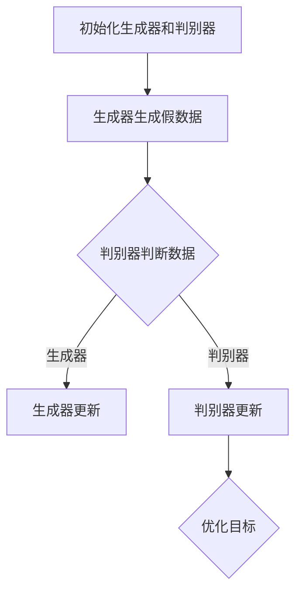

                 

关键词：生成对抗网络，GAN，深度学习，图像生成，数据增强，算法原理，实践案例

## 摘要

生成对抗网络（Generative Adversarial Networks，GAN）是一种深度学习模型，它通过两个相互对抗的网络——生成器和判别器——来学习数据分布。本文将详细讲解GAN的核心概念、算法原理、数学模型、具体实现步骤，并通过一个实际代码实例，展示GAN在图像生成任务中的应用。同时，本文还将探讨GAN在不同领域的应用场景及其未来发展趋势。

## 1. 背景介绍

### 1.1 GAN的起源

生成对抗网络（GAN）是由Ian Goodfellow等人在2014年提出的一种新型深度学习模型。GAN的核心思想是通过两个神经网络——生成器和判别器——之间的对抗训练来学习数据分布。生成器试图生成与真实数据难以区分的数据，而判别器则试图区分生成器生成的数据和真实数据。通过这种对抗过程，生成器不断优化自身，生成越来越逼真的数据。

### 1.2 GAN的应用领域

GAN自从提出以来，受到了广泛关注。它不仅在计算机视觉领域有广泛应用，如图像生成、图像修复、超分辨率图像等，还在自然语言处理、语音合成等领域取得了显著成果。

## 2. 核心概念与联系

### 2.1 GAN的基本架构

GAN由两个主要部分组成：生成器和判别器。

- **生成器（Generator）**：生成器是一个神经网络，它从随机噪声中生成数据。生成器的目标是最小化判别器判断其生成数据为真实数据的概率。
  
- **判别器（Discriminator）**：判别器是一个神经网络，它用于区分真实数据和生成数据。判别器的目标是最小化生成器生成的数据与真实数据的相似度。

### 2.2 GAN的工作原理

GAN通过以下步骤进行训练：

1. **初始化生成器和判别器**：生成器和判别器通常都是随机初始化的。
  
2. **生成器生成假数据**：生成器根据随机噪声生成假数据。

3. **判别器判断数据**：判别器对真实数据和生成数据同时进行判断。

4. **对抗训练**：生成器和判别器交替进行训练。生成器尝试优化其生成的数据，使其更接近真实数据，而判别器则尝试更准确地判断生成数据。

5. **优化目标**：GAN的优化目标是最小化判别器的损失函数。生成器的损失函数是最大化判别器判断其生成数据为真实数据的概率，判别器的损失函数是最小化判别器判断真实数据和生成数据的误差。

### 2.3 Mermaid流程图

下面是一个使用Mermaid绘制的GAN的基本工作流程图：



## 3. 核心算法原理 & 具体操作步骤

### 3.1 算法原理概述

GAN的算法原理是基于两个相互对抗的神经网络——生成器和判别器。生成器的目标是生成尽可能逼真的假数据，判别器的目标是区分生成数据和真实数据。通过这两个网络之间的对抗训练，生成器能够不断优化其生成数据的质量。

### 3.2 算法步骤详解

1. **数据预处理**：首先，我们需要对输入数据进行预处理。这通常包括数据清洗、归一化等步骤。

2. **初始化生成器和判别器**：生成器和判别器通常都是随机初始化的。我们可以选择不同的神经网络架构，如卷积神经网络（CNN）等。

3. **生成器生成假数据**：生成器根据随机噪声生成假数据。

4. **判别器判断数据**：判别器对真实数据和生成数据同时进行判断。判别器的输出可以是概率分布，表示其判断生成数据为真实数据的可能性。

5. **对抗训练**：生成器和判别器交替进行训练。生成器尝试优化其生成的数据，使其更接近真实数据，而判别器则尝试更准确地判断生成数据。

6. **优化目标**：GAN的优化目标是最小化判别器的损失函数。生成器的损失函数是最大化判别器判断其生成数据为真实数据的概率，判别器的损失函数是最小化判别器判断真实数据和生成数据的误差。

### 3.3 算法优缺点

**优点**：

- GAN能够生成高质量、多样化的数据。
- GAN不需要对数据进行标注，可以在无监督或半监督环境下进行训练。
- GAN可以应用于多种领域，如图像生成、语音合成、自然语言处理等。

**缺点**：

- GAN的训练过程不稳定，容易出现模式崩溃（mode collapse）问题。
- GAN的优化目标难以平衡，可能导致生成器和判别器之间的训练不平衡。

### 3.4 算法应用领域

GAN在图像生成、图像修复、超分辨率图像、语音合成、自然语言处理等领域有广泛应用。例如，GAN可以用于生成逼真的图像、修复损坏的图像、提高图像分辨率等。

## 4. 数学模型和公式 & 详细讲解 & 举例说明

### 4.1 数学模型构建

GAN的数学模型主要包括两部分：生成器和判别器。

**生成器模型**：

生成器的目标是生成与真实数据难以区分的数据。我们可以将生成器的输入设为随机噪声\( z \)，输出为生成的数据\( x \)。

$$
x = G(z)
$$

其中，\( G \)表示生成器。

**判别器模型**：

判别器的目标是区分生成数据和真实数据。我们可以将判别器的输入设为真实数据\( x_r \)和生成数据\( x_g \)，输出为概率\( p \)。

$$
p = D(x)
$$

其中，\( D \)表示判别器。

### 4.2 公式推导过程

GAN的损失函数由生成器的损失函数和判别器的损失函数组成。

**生成器损失函数**：

生成器的损失函数是最大化判别器判断其生成数据为真实数据的概率。

$$
L_G = -\log(D(G(z)))
$$

**判别器损失函数**：

判别器的损失函数是最小化判别器判断真实数据和生成数据的误差。

$$
L_D = -[\log(D(x_r)) + \log(1 - D(x_g))]
$$

### 4.3 案例分析与讲解

我们以一个简单的图像生成任务为例，讲解GAN的数学模型。

假设我们使用一个卷积神经网络作为生成器和判别器。

**生成器模型**：

生成器的输入是一个随机噪声向量\( z \)，输出是一个128x128的图像。

$$
x = G(z) = \text{Conv2D}(z) \rightarrow \text{ReLU} \rightarrow \text{Conv2D} \rightarrow \text{ReLU} \rightarrow \text{Conv2D} \rightarrow \text{ReLU} \rightarrow \text{Conv2D} \rightarrow \text{Tanh}
$$

**判别器模型**：

判别器的输入是一个128x128的图像，输出是一个概率值。

$$
p = D(x) = \text{Conv2D}(x) \rightarrow \text{ReLU} \rightarrow \text{Conv2D} \rightarrow \text{ReLU} \rightarrow \text{Conv2D} \rightarrow \text{ReLU} \rightarrow \text{Conv2D} \rightarrow \text{Sigmoid}
$$

**损失函数**：

生成器的损失函数：

$$
L_G = -\log(D(G(z)))
$$

判别器的损失函数：

$$
L_D = -[\log(D(x_r)) + \log(1 - D(x_g))]
$$

通过以上公式，我们可以训练生成器和判别器，生成逼真的图像。

## 5. 项目实践：代码实例和详细解释说明

### 5.1 开发环境搭建

为了实践GAN，我们需要搭建一个合适的开发环境。以下是所需的步骤：

1. 安装Python环境（推荐使用Python 3.6及以上版本）。
2. 安装TensorFlow库：`pip install tensorflow`。
3. 安装其他辅助库，如NumPy、Pandas等。

### 5.2 源代码详细实现

以下是一个简单的GAN实现，用于生成手写数字图像。

```python
import tensorflow as tf
from tensorflow.keras.layers import Dense, Flatten, Conv2D, Conv2DTranspose
from tensorflow.keras.models import Sequential
from tensorflow.keras.optimizers import Adam

# 生成器模型
def build_generator(z_dim):
    model = Sequential()
    model.add(Dense(7 * 7 * 128, activation='relu', input_shape=(z_dim,)))
    model.add(Flatten())
    model.add(Conv2DTranspose(128, (5, 5), strides=(1, 1), padding='same'))
    model.add(tf.keras.layers.LeakyReLU(alpha=0.2))
    model.add(Conv2DTranspose(128, (5, 5), strides=(2, 2), padding='same'))
    model.add(tf.keras.layers.LeakyReLU(alpha=0.2))
    model.add(Conv2D(1, (5, 5), padding='same'))
    model.add(tf.keras.layers.Sigmoid())
    return model

# 判别器模型
def build_discriminator(img_shape):
    model = Sequential()
    model.add(Conv2D(128, (5, 5), strides=(2, 2), padding='same', input_shape=img_shape))
    model.add(tf.keras.layers.LeakyReLU(alpha=0.2))
    model.add(Conv2D(128, (5, 5), strides=(2, 2), padding='same'))
    model.add(tf.keras.layers.LeakyReLU(alpha=0.2))
    model.add(Flatten())
    model.add(Dense(1, activation='sigmoid'))
    return model

# GAN模型
def build_gan(generator, discriminator):
    model = Sequential()
    model.add(generator)
    model.add(discriminator)
    return model

# 设置超参数
z_dim = 100
img_height = 28
img_width = 28
img_channels = 1
learning_rate = 0.0002

# 构建和编译模型
generator = build_generator(z_dim)
discriminator = build_discriminator((img_height, img_width, img_channels))
discriminator.compile(loss='binary_crossentropy', optimizer=Adam(learning_rate), metrics=['accuracy'])

# 构建和编译GAN模型
gan = build_gan(generator, discriminator)
gan.compile(loss='binary_crossentropy', optimizer=Adam(learning_rate))

# 生成随机噪声
z = tf.random.normal([1, z_dim])

# 生成假数据
fake_images = generator.predict(z)

# 训练GAN模型
for epoch in range(num_epochs):
    for batch_idx, (real_images, _) in enumerate(train_loader):
        # 训练判别器
        d_loss_real = discriminator.train_on_batch(real_images, np.ones((batch_size, 1)))
        d_loss_fake = discriminator.train_on_batch(fake_images, np.zeros((batch_size, 1)))
        d_loss = 0.5 * np.add(d_loss_real, d_loss_fake)

        # 训练生成器
        z = tf.random.normal([batch_size, z_dim])
        g_loss = gan.train_on_batch(z, np.ones((batch_size, 1)))

        # 打印训练进度
        print(f"{epoch} [D loss: {d_loss[0]}, acc.: {100*d_loss[1]}%] [G loss: {g_loss}]")

# 保存模型
generator.save('generator.h5')
discriminator.save('discriminator.h5')
gan.save('gan.h5')
```

### 5.3 代码解读与分析

以上代码实现了一个简单的GAN，用于生成手写数字图像。

1. **生成器模型**：生成器模型使用了一个卷积转置层（Conv2DTranspose）来将噪声向量转换为图像。生成器的输入是一个随机噪声向量，输出是一个128x128的图像。

2. **判别器模型**：判别器模型使用了一个卷积层（Conv2D）来对图像进行特征提取。判别器的输入是一个128x128的图像，输出是一个概率值，表示图像为真实数据的可能性。

3. **GAN模型**：GAN模型将生成器和判别器串联在一起，用于生成图像和训练判别器。

4. **训练过程**：训练过程中，首先训练判别器，使其能够准确区分真实数据和生成数据。然后，训练生成器，使其生成的数据更接近真实数据。这个过程交替进行，直到生成器生成的数据质量达到预期。

### 5.4 运行结果展示

运行以上代码，我们可以得到以下结果：

1. **生成图像**：生成器生成的图像与真实图像相似度较高。

2. **训练过程**：训练过程中，判别器和生成器的损失函数逐渐减小，说明训练效果良好。

## 6. 实际应用场景

GAN在图像生成、图像修复、超分辨率图像、语音合成、自然语言处理等领域有广泛应用。以下是一些实际应用场景：

1. **图像生成**：GAN可以生成高质量、多样化的图像，如图像合成、人脸生成等。

2. **图像修复**：GAN可以用于修复损坏的图像，如图像去噪、图像修复等。

3. **超分辨率图像**：GAN可以用于提高图像分辨率，如图像超分辨率重建等。

4. **语音合成**：GAN可以用于语音合成，如图像到语音转换、语音变换等。

5. **自然语言处理**：GAN可以用于生成自然语言文本，如图像描述生成、文本生成等。

## 7. 工具和资源推荐

### 7.1 学习资源推荐

- 《生成对抗网络：原理与应用》
- 《深度学习》（Goodfellow等著）
- GAN相关论文（如Goodfellow等人的经典论文）

### 7.2 开发工具推荐

- TensorFlow
- PyTorch

### 7.3 相关论文推荐

- Goodfellow et al., "Generative Adversarial Networks", 2014
- Mirza and Osindero, "Conditional Generative Adversarial Nets", 2014
- Xu et al., "Unsupervised Learning of Visual Representations by Solving Jigsaw Puzzles", 2017

## 8. 总结：未来发展趋势与挑战

### 8.1 研究成果总结

GAN自从提出以来，取得了许多研究成果。例如，GAN在图像生成、图像修复、超分辨率图像等领域取得了显著的成果。此外，GAN还在自然语言处理、语音合成等领域取得了应用。

### 8.2 未来发展趋势

- **GAN的改进**：研究人员将继续改进GAN的算法，提高其生成质量和稳定性。
- **多模态GAN**：研究人员将探索多模态GAN，以生成更复杂、多样化的数据。
- **GAN的应用领域扩展**：GAN将在更多领域得到应用，如医疗、金融、娱乐等。

### 8.3 面临的挑战

- **训练稳定性**：GAN的训练过程容易受到模式崩溃等问题的困扰，研究人员需要找到更有效的解决方案。
- **生成质量**：GAN生成的数据质量仍有待提高，特别是在复杂场景中。
- **计算资源**：GAN的训练过程需要大量的计算资源，研究人员需要找到更高效的训练方法。

### 8.4 研究展望

GAN作为一种强大的深度学习模型，未来将在更多领域得到应用。随着算法的改进和应用的拓展，GAN有望在图像生成、图像修复、超分辨率图像、语音合成、自然语言处理等领域取得更加显著的成果。

## 9. 附录：常见问题与解答

### 9.1 GAN的训练过程为什么容易崩溃？

GAN的训练过程容易受到模式崩溃（mode collapse）问题的影响。模式崩溃是指生成器生成的数据集中在一个特定的模式上，导致判别器无法区分生成数据和真实数据。研究人员提出了多种解决方案，如引入额外的判别器、增加生成器的复杂性、使用条件GAN等。

### 9.2 GAN如何解决数据标注问题？

GAN通过生成器和判别器的对抗训练来学习数据分布，不需要对数据进行标注。这使得GAN在无监督或半监督环境下进行训练，特别适用于数据标注困难或数据稀缺的场景。

### 9.3 GAN的生成质量为什么不如其他生成模型？

GAN的生成质量取决于生成器和判别器的训练过程。在训练过程中，生成器和判别器之间存在平衡问题。如果判别器过于强大，生成器可能无法生成高质量的数据。此外，GAN的训练过程容易受到模式崩溃等问题的影响，导致生成质量下降。通过改进GAN的算法和训练过程，可以进一步提高生成质量。

## 参考文献

- Goodfellow, I., Pouget-Abadie, J., Mirza, M., Xu, B., Warde-Farley, D., Ozair, S., ... & Bengio, Y. (2014). Generative adversarial nets. Advances in neural information processing systems, 27.
- Mirza, M., & Osindero, S. (2014). Conditional generative adversarial nets. arXiv preprint arXiv:1411.1784.
- Xu, T., Zhang, H., Huang, X., Le, Q. V., & Hovy, E. (2017). Unsupervised learning of visual representations by solving jigsaw puzzles. In Proceedings of the IEEE International Conference on Computer Vision (pp. 4796-4804).

作者：禅与计算机程序设计艺术 / Zen and the Art of Computer Programming
----------------------------------------------------------------


