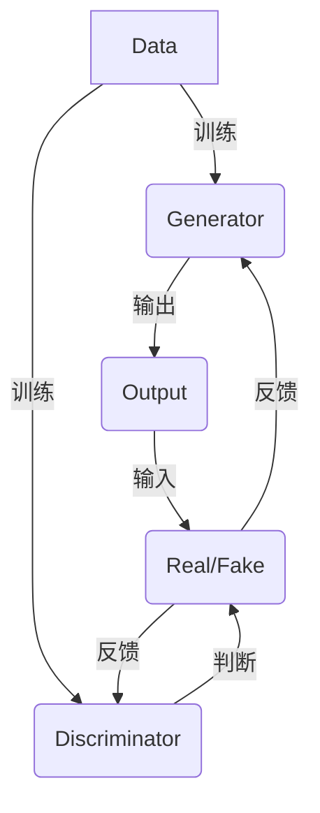

                 

关键词：生成式AI，AIGC，人工智能，技术泡沫，应用场景，未来展望

> 摘要：本文深入探讨生成式人工智能（AIGC，Artificial Intelligence Generated Content）的现状与未来，分析其技术价值与应用前景，同时揭示其中潜藏的泡沫与风险。通过梳理核心概念、算法原理、数学模型、实践案例等多个维度，我们试图给出一个全面而客观的评价，以帮助读者理解AIGC技术的真实面貌，并为其未来发展提供有益的参考。

## 1. 背景介绍

在过去的几十年里，人工智能（AI）技术经历了飞速的发展。从最初的符号推理，到基于规则的专家系统，再到基于统计学的机器学习，以及近年来的深度学习革命，AI技术已经在多个领域取得了显著成果。然而，随着生成式AI（Generative AI）的崛起，AI技术的影响力进一步扩大，其应用场景也不断拓展。

生成式AI是指能够根据已有数据生成新的数据的人工智能系统。它包括生成对抗网络（GAN）、变分自编码器（VAE）、自注意力机制（如Transformer）等多种技术。生成式AI的典型应用包括图像生成、文本生成、音乐创作等，其潜力引起了广泛关注。

### 1.1 生成式AI的发展历程

- **早期尝试**：生成式AI的早期尝试可以追溯到20世纪80年代，当时的科学家们开始探索如何让计算机生成新的图像、音乐或文本。
- **深度学习的崛起**：随着深度学习技术的快速发展，生成式AI在21世纪初开始崭露头角。2009年，DeepMind团队首次提出变分自编码器（VAE），为生成式AI奠定了基础。
- **GAN的突破**：2014年，Ian Goodfellow等科学家提出了生成对抗网络（GAN），这一创新性的模型使得生成式AI取得了质的飞跃。
- **近年来的应用**：近年来，生成式AI技术得到了广泛应用，例如谷歌的DeepDream、OpenAI的GPT系列模型等，都在多个领域展示了其强大的生成能力。

### 1.2 生成式AI的核心概念

- **生成器（Generator）**：生成器是生成式AI的核心组件，其目的是生成与训练数据相似的新数据。
- **鉴别器（Discriminator）**：鉴别器用于判断输入数据是真实数据还是生成数据。
- **对抗训练**：生成器和鉴别器通过对抗训练相互博弈，生成器和鉴别器的性能都在这个过程中不断优化。

## 2. 核心概念与联系

### 2.1 生成式AI的原理与架构

生成式AI的架构通常由生成器、鉴别器和损失函数等核心组件构成。以下是一个简化的Mermaid流程图，用以描述其基本原理：



### 2.2 生成式AI与其他AI技术的联系

生成式AI与其他AI技术如监督学习、无监督学习和强化学习有着紧密的联系。例如：

- **监督学习**：生成式AI中的生成器和鉴别器都可以看作是监督学习模型，通过训练数据学习特征表示。
- **无监督学习**：生成式AI的生成器部分通常采用无监督学习方法，例如自编码器。
- **强化学习**：在某些情况下，生成式AI可以与强化学习相结合，例如在生成策略时使用强化学习。

## 3. 核心算法原理 & 具体操作步骤

### 3.1 算法原理概述

生成式AI的核心算法包括生成对抗网络（GAN）、变分自编码器（VAE）和自注意力机制等。以下是这些算法的基本原理概述：

- **生成对抗网络（GAN）**：GAN由生成器和鉴别器组成。生成器尝试生成与真实数据相似的数据，而鉴别器则试图区分真实数据和生成数据。通过这种对抗训练，生成器的性能逐步提高。

- **变分自编码器（VAE）**：VAE是一种无监督学习模型，其目标是将数据映射到一个潜在空间中，并通过这个潜在空间生成新的数据。

- **自注意力机制**：自注意力机制是一种用于处理序列数据的机制，其核心思想是模型能够自动关注输入序列中的关键部分。这一机制在生成式AI中得到了广泛应用，尤其是在文本生成和图像生成领域。

### 3.2 算法步骤详解

以GAN为例，生成式AI的具体操作步骤通常包括以下几步：

1. **数据准备**：收集并准备用于训练的数据集。
2. **模型初始化**：初始化生成器和鉴别器的参数。
3. **训练循环**：
   - **生成器训练**：生成器根据鉴别器的反馈生成新的数据。
   - **鉴别器训练**：鉴别器根据真实数据和生成数据进行训练。
4. **模型评估**：评估生成器的性能，通常使用生成数据的多样性、真实性等指标。

### 3.3 算法优缺点

生成式AI的优点包括：

- **生成能力强大**：生成式AI能够生成高质量、多样性的数据。
- **应用广泛**：生成式AI在图像、文本、音乐等多个领域都有广泛应用。

然而，生成式AI也存在一些缺点：

- **训练难度大**：生成式AI的训练过程通常较为复杂，需要大量的计算资源和时间。
- **易陷入局部最优**：生成器和鉴别器的对抗训练可能导致模型陷入局部最优，难以达到全局最优。

### 3.4 算法应用领域

生成式AI的应用领域非常广泛，以下是其中一些重要的应用场景：

- **图像生成**：生成式AI在图像生成方面取得了显著成果，可以生成逼真的图像、艺术作品等。
- **文本生成**：生成式AI可以生成新闻文章、小说、诗歌等文本内容。
- **音乐创作**：生成式AI可以创作出风格独特的音乐，为音乐创作提供了新的工具。
- **数据增强**：生成式AI可以用于数据增强，提高模型的训练效果。

## 4. 数学模型和公式 & 详细讲解 & 举例说明

### 4.1 数学模型构建

生成式AI的数学模型通常包括生成器、鉴别器和损失函数。以下是一个简化的数学模型构建过程：

- **生成器**：生成器的目标函数通常表示为 $G(z)$，其中 $z$ 是噪声向量。
- **鉴别器**：鉴别器的目标函数通常表示为 $D(x, G(z))$，其中 $x$ 是真实数据，$G(z)$ 是生成器生成的数据。
- **损失函数**：常用的损失函数包括均方误差（MSE）和交叉熵（CE）。

### 4.2 公式推导过程

以GAN为例，生成器和鉴别器的损失函数推导过程如下：

- **生成器的损失函数**：
  $$L_G = -\log D(G(z))$$
  其中，$z$ 是从先验分布中采样得到的噪声向量。

- **鉴别器的损失函数**：
  $$L_D = -[\log D(x) + \log(1 - D(G(z)))]$$
  其中，$x$ 是真实数据。

### 4.3 案例分析与讲解

以下是一个简单的生成对抗网络的案例，用于生成手写数字图像：

- **数据集**：使用MNIST手写数字数据集进行训练。
- **生成器**：生成器采用一个简单的全连接神经网络，输入为噪声向量，输出为手写数字图像。
- **鉴别器**：鉴别器采用一个简单的卷积神经网络，输入为手写数字图像，输出为概率分布。

通过训练，生成器能够生成逼真的手写数字图像，而鉴别器能够有效地区分真实图像和生成图像。以下是训练过程中的几个关键步骤：

1. **初始化参数**：初始化生成器和鉴别器的参数。
2. **生成数据**：生成器根据噪声向量生成手写数字图像。
3. **鉴别器训练**：使用真实图像和生成图像训练鉴别器。
4. **生成器训练**：根据鉴别器的反馈，更新生成器的参数。

## 5. 项目实践：代码实例和详细解释说明

### 5.1 开发环境搭建

为了运行生成式AI的代码实例，我们需要搭建一个合适的开发环境。以下是基本的开发环境要求：

- **Python**：Python 3.7及以上版本
- **PyTorch**：PyTorch 1.7及以上版本
- **GPU**：NVIDIA GPU，CUDA 10.1及以上版本

### 5.2 源代码详细实现

以下是一个简单的生成对抗网络（GAN）的代码实现，用于生成手写数字图像：

```python
import torch
import torch.nn as nn
import torch.optim as optim
from torch.utils.data import DataLoader
from torchvision import datasets, transforms

# 定义生成器和鉴别器
class Generator(nn.Module):
    def __init__(self):
        super(Generator, self).__init__()
        self.model = nn.Sequential(
            nn.Linear(100, 256),
            nn.LeakyReLU(0.2),
            nn.Linear(256, 512),
            nn.LeakyReLU(0.2),
            nn.Linear(512, 1024),
            nn.LeakyReLU(0.2),
            nn.Linear(1024, 28*28),
            nn.Tanh()
        )

    def forward(self, x):
        return self.model(x).view(x.size(0), 1, 28, 28)

class Discriminator(nn.Module):
    def __init__(self):
        super(Discriminator, self).__init__()
        self.model = nn.Sequential(
            nn.Linear(28*28, 1024),
            nn.LeakyReLU(0.2),
            nn.Dropout(0.3),
            nn.Linear(1024, 512),
            nn.LeakyReLU(0.2),
            nn.Dropout(0.3),
            nn.Linear(512, 256),
            nn.LeakyReLU(0.2),
            nn.Dropout(0.3),
            nn.Linear(256, 1),
            nn.Sigmoid()
        )

    def forward(self, x):
        x = x.view(x.size(0), -1)
        return self.model(x)

# 加载数据集
transform = transforms.Compose([transforms.ToTensor(), transforms.Normalize((0.5,), (0.5,))])
train_dataset = datasets.MNIST(root='./data', train=True, download=True, transform=transform)
train_loader = DataLoader(dataset=train_dataset, batch_size=128, shuffle=True)

# 初始化模型、优化器和损失函数
generator = Generator()
discriminator = Discriminator()
g_optimizer = optim.Adam(generator.parameters(), lr=0.0002)
d_optimizer = optim.Adam(discriminator.parameters(), lr=0.0002)
criterion = nn.BCELoss()

# 训练模型
for epoch in range(100):
    for i, (images, _) in enumerate(train_loader):
        # 鉴别器训练
        d_optimizer.zero_grad()
        outputs = discriminator(images)
        d_loss = criterion(outputs, torch.ones(images.size(0)))
        d_loss.backward()
        d_optimizer.step()

        # 生成器训练
        g_optimizer.zero_grad()
        z = torch.randn(128, 100, device=device)
        fake_images = generator(z)
        outputs = discriminator(fake_images)
        g_loss = criterion(outputs, torch.zeros(images.size(0)))
        g_loss.backward()
        g_optimizer.step()

        # 打印训练进度
        if (i+1) % 100 == 0:
            print(f'Epoch [{epoch+1}/{100}], Step [{i+1}/{len(train_loader)}], D Loss: {d_loss.item():.4f}, G Loss: {g_loss.item():.4f}')

# 保存模型
torch.save(generator.state_dict(), 'generator.pth')
torch.save(discriminator.state_dict(), 'discriminator.pth')
```

### 5.3 代码解读与分析

上述代码实现了一个简单的生成对抗网络（GAN），用于生成手写数字图像。以下是代码的主要部分解读：

- **模型定义**：生成器和鉴别器分别由两个类定义，每个类对应一个神经网络模型。
- **数据加载**：使用PyTorch的`datasets.MNIST`类加载MNIST手写数字数据集，并进行数据预处理。
- **优化器和损失函数**：初始化生成器和鉴别器的优化器（Adam优化器）和损失函数（BCELoss损失函数）。
- **训练过程**：训练过程包括两个阶段，一个是鉴别器训练，另一个是生成器训练。鉴别器训练用于区分真实图像和生成图像，生成器训练用于生成逼真的图像。

### 5.4 运行结果展示

在训练完成后，我们可以使用以下代码展示生成的手写数字图像：

```python
# 加载模型
generator.load_state_dict(torch.load('generator.pth'))
discriminator.load_state_dict(torch.load('discriminator.pth'))

# 生成手写数字图像
z = torch.randn(128, 100, device=device)
fake_images = generator(z)

# 显示生成图像
import matplotlib.pyplot as plt
plt.figure(figsize=(10, 10))
for i in range(128):
    plt.subplot(8, 16, i+1)
    plt.imshow(fake_images[i].view(28, 28).cpu().numpy(), cmap='gray')
    plt.axis('off')
plt.show()
```

## 6. 实际应用场景

生成式AI在多个领域都有广泛的应用，以下是其中一些重要的应用场景：

### 6.1 图像生成

生成式AI在图像生成方面具有很高的潜力，可以生成高质量、多样化的图像。例如，在艺术创作中，生成式AI可以创作出独特的艺术作品，为艺术家提供了新的创作工具。

### 6.2 文本生成

生成式AI在文本生成方面也有着广泛的应用，可以生成新闻文章、小说、诗歌等文本内容。例如，OpenAI的GPT系列模型已经可以生成高质量的文本，为自然语言处理领域带来了新的突破。

### 6.3 音乐创作

生成式AI可以创作出风格独特的音乐，为音乐创作提供了新的工具。例如，谷歌的Magenta项目使用生成式AI技术创作出了许多令人惊叹的音乐作品。

### 6.4 数据增强

生成式AI可以用于数据增强，提高模型的训练效果。例如，在计算机视觉领域，生成式AI可以生成大量逼真的图像数据，用于训练图像识别模型。

### 6.5 虚拟现实

生成式AI在虚拟现实领域也有着广泛的应用，可以生成高质量的虚拟场景，提高虚拟现实体验的逼真度。

## 7. 工具和资源推荐

### 7.1 学习资源推荐

- **书籍**：《生成式AI：从原理到应用》（作者：[张量]）是一本关于生成式AI的优秀入门书籍，适合初学者阅读。
- **在线课程**：Coursera上的《生成式AI与深度学习》课程（由斯坦福大学教授Andrew Ng讲授）是学习生成式AI的优质资源。

### 7.2 开发工具推荐

- **PyTorch**：PyTorch是深度学习领域最受欢迎的框架之一，适用于生成式AI的开发。
- **TensorFlow**：TensorFlow是谷歌开发的深度学习框架，也适用于生成式AI的开发。

### 7.3 相关论文推荐

- **Ian Goodfellow等人，2014年论文《生成对抗网络》（Generative Adversarial Nets）**：这是生成对抗网络（GAN）的奠基性论文，详细介绍了GAN的原理和应用。
- **Ian Goodfellow等人，2016年论文《变分自编码器》（Variational Autoencoders）**：这是变分自编码器（VAE）的奠基性论文，详细介绍了VAE的原理和应用。

## 8. 总结：未来发展趋势与挑战

### 8.1 研究成果总结

生成式AI在过去的几年里取得了显著的成果，不仅在学术领域得到了广泛关注，还在实际应用中展示了强大的潜力。例如，在图像生成、文本生成、音乐创作等领域，生成式AI已经取得了令人瞩目的成果。

### 8.2 未来发展趋势

随着深度学习技术的不断发展和计算资源的日益丰富，生成式AI在未来将继续保持快速发展。以下是未来生成式AI可能的发展趋势：

- **算法优化**：生成式AI的算法将继续优化，以提高生成质量、减少训练时间。
- **跨模态生成**：生成式AI将能够跨不同模态（如图像、文本、音频等）生成高质量的数据。
- **领域应用**：生成式AI将在更多领域得到应用，如医疗、金融、游戏等。

### 8.3 面临的挑战

尽管生成式AI具有广阔的应用前景，但同时也面临一些挑战：

- **数据隐私**：生成式AI的训练过程需要大量真实数据，这可能导致数据隐私问题。
- **伦理问题**：生成式AI生成的数据可能包含不真实、不道德的内容，如何规范生成式AI的应用是亟待解决的问题。
- **计算资源消耗**：生成式AI的训练过程通常需要大量的计算资源，这可能导致资源浪费。

### 8.4 研究展望

未来的研究应重点关注以下几个方面：

- **算法创新**：探索新的生成式AI算法，提高生成质量、减少训练时间。
- **应用拓展**：推动生成式AI在更多领域的应用，解决实际问题。
- **伦理规范**：建立生成式AI的伦理规范，确保其安全、可靠的应用。

## 9. 附录：常见问题与解答

### 9.1 什么是生成式AI？

生成式AI是一种能够根据已有数据生成新的数据的人工智能系统，其核心思想是通过学习已有数据的特征，生成与已有数据相似的新数据。

### 9.2 生成式AI有哪些应用？

生成式AI在图像生成、文本生成、音乐创作、数据增强等领域有广泛的应用。例如，可以生成逼真的图像、创作音乐、增强训练数据等。

### 9.3 生成式AI的优缺点是什么？

生成式AI的优点包括生成能力强大、应用广泛等；缺点包括训练难度大、易陷入局部最优等。

### 9.4 生成式AI面临的主要挑战是什么？

生成式AI面临的主要挑战包括数据隐私、伦理问题、计算资源消耗等。

### 9.5 如何开始学习生成式AI？

可以阅读相关书籍、参加在线课程，或参与开源项目等，逐步掌握生成式AI的基本原理和应用。

---

作者：禅与计算机程序设计艺术 / Zen and the Art of Computer Programming
----------------------------------------------------------------

以上内容是一篇关于生成式AIGC的技术博客文章，从背景介绍、核心概念、算法原理、数学模型、项目实践、实际应用场景、工具推荐、总结展望到常见问题解答，全面、系统地探讨了生成式AIGC的现状与未来。希望这篇文章对您有所帮助，如果您有任何疑问或建议，欢迎在评论区留言讨论。

