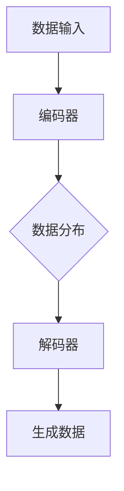

                 

关键词：生成式AI、AIGC、技术革命、软件开发、消费电子、消费端应用、泡沫与金矿

## 摘要

本文旨在探讨生成式人工智能生成内容（AIGC）的现状、潜力与挑战。随着AI技术的迅猛发展，生成式AIGC正逐步渗透到软件、消费电子和消费端应用的各个领域，引发了一场技术革命。本文将分析AIGC的优势、潜在的市场机遇，以及可能面临的泡沫风险，并探讨未来十年AIGC的发展趋势及其对行业的影响。

## 1. 背景介绍

### 1.1 AIGC的定义与特点

生成式人工智能生成内容（AIGC，AI-Generated Content）是一种利用人工智能技术生成文本、图像、音频、视频等数字内容的方式。AIGC具有以下几个显著特点：

1. **自适应性**：AIGC可以根据用户的需求和上下文信息动态生成内容。
2. **创造力**：AIGC能够创造出新颖、独特的数字内容，具备一定程度的创造力。
3. **大规模应用**：AIGC可以在软件、消费电子、消费端等多个领域实现广泛应用。

### 1.2 AIGC的兴起与发展

AIGC的兴起得益于深度学习技术的快速发展。特别是生成对抗网络（GANs）和变分自编码器（VAEs）等生成模型的提出，使得人工智能在生成图像、文本、音频等方面取得了突破性进展。随着计算能力的提升和大数据的普及，AIGC的应用场景越来越广泛，逐渐成为人工智能领域的研究热点。

## 2. 核心概念与联系

### 2.1 生成式AI原理

生成式AI的核心思想是学习数据的分布，从而生成新的数据。具体来说，生成式AI模型通过训练数据集学习数据分布，然后利用学到的分布生成新的数据。以下是生成式AI的基本原理和架构：



### 2.2 AIGC应用场景

AIGC在多个领域具有广泛的应用前景，包括：

1. **软件开发**：利用AIGC自动生成代码，提高开发效率和代码质量。
2. **消费电子**：生成个性化的用户界面、应用场景模拟等。
3. **消费端应用**：生成个性化的音乐、视频、游戏内容等。

### 2.3 AIGC与传统内容的区别

与传统的手动生成内容相比，AIGC具有以下几个优势：

1. **效率**：AIGC可以自动、快速地生成大量内容。
2. **个性**：AIGC可以根据用户的需求和喜好生成个性化的内容。
3. **创新**：AIGC可以创造出前所未有的新颖内容。

## 3. 核心算法原理 & 具体操作步骤

### 3.1 算法原理概述

生成式AIGC的核心算法主要包括生成对抗网络（GANs）、变分自编码器（VAEs）和自回归模型（AR）等。以下是这些算法的基本原理：

1. **生成对抗网络（GANs）**：GANs由生成器和判别器组成，生成器生成内容，判别器判断生成内容和真实内容之间的区别。通过不断优化生成器和判别器的参数，生成器逐渐生成更逼真的内容。
2. **变分自编码器（VAEs）**：VAEs通过编码器学习数据分布，然后通过解码器生成新的数据。VAEs在生成高质量图像、文本等方面具有较好的性能。
3. **自回归模型（AR）**：自回归模型通过预测下一个时间点的值来生成序列数据。AR模型适用于生成文本、时间序列数据等。

### 3.2 算法步骤详解

1. **数据准备**：收集并整理用于训练的数据集，包括图像、文本、音频等。
2. **模型选择**：根据应用场景选择合适的生成模型，如GANs、VAEs或AR模型。
3. **模型训练**：使用训练数据集对生成模型进行训练，优化模型的参数。
4. **内容生成**：利用训练好的模型生成新的数字内容，如图像、文本、音频等。
5. **质量评估**：对生成的内容进行质量评估，包括内容真实性、创意性等方面。

### 3.3 算法优缺点

**优点**：

1. **高效**：AIGC可以自动、快速地生成大量内容，提高生产效率。
2. **个性化**：AIGC可以根据用户的需求和喜好生成个性化的内容。
3. **创新**：AIGC可以创造出新颖、独特的数字内容。

**缺点**：

1. **质量不稳定**：生成的质量可能受到模型训练数据、参数设置等因素的影响。
2. **创意有限**：虽然AIGC具有一定的创造力，但仍然受到训练数据集的限制。

### 3.4 算法应用领域

AIGC在多个领域具有广泛的应用，包括：

1. **软件开发**：自动生成代码、测试用例等。
2. **消费电子**：生成个性化的用户界面、应用场景模拟等。
3. **消费端应用**：生成个性化的音乐、视频、游戏内容等。

## 4. 数学模型和公式 & 详细讲解 & 举例说明

### 4.1 数学模型构建

生成式AIGC的核心数学模型主要包括生成对抗网络（GANs）、变分自编码器（VAEs）和自回归模型（AR）等。以下是这些模型的基本数学公式和构建方法。

**生成对抗网络（GANs）**：

1. **生成器**：生成器G的输入为随机噪声z，输出为生成的数据x'，即x' = G(z)。
2. **判别器**：判别器D的输入为真实数据x和生成数据x'，输出为D(x)和D(x')。

目标函数：
$$
\min_G \max_D V(D, G) = E_{x \sim p_{data}(x)}[D(x)] - E_{z \sim p_z(z)}[D(G(z))]
$$

**变分自编码器（VAEs）**：

1. **编码器**：编码器E的输入为数据x，输出为编码c，即c = E(x)。
2. **解码器**：解码器D的输入为编码c，输出为生成的数据x'，即x' = D(c)。

目标函数：
$$
\min_{\theta_E, \theta_D} V(\theta_E, \theta_D) = E_{x \sim p_{data}(x)}[D(D(E(x)))] + \lambda \times D(E(x))
$$

**自回归模型（AR）**：

1. **状态转移方程**：$x_t = \phi x_{t-1} + \epsilon_t$，其中$x_t$为时间t的序列值，$\phi$为状态转移矩阵，$\epsilon_t$为噪声。
2. **预测方程**：$x_t = \phi x_{t-1}$。

### 4.2 公式推导过程

**生成对抗网络（GANs）**：

GANs的目标是最小化生成器G的损失函数，同时最大化判别器D的损失函数。具体推导过程如下：

1. **生成器损失函数**：
$$
L_G = -E_{z \sim p_z(z)}[D(G(z))]
$$

2. **判别器损失函数**：
$$
L_D = E_{x \sim p_{data}(x)}[D(x)] - E_{z \sim p_z(z)}[D(G(z))]
$$

3. **总损失函数**：
$$
L = L_G + L_D
$$

**变分自编码器（VAEs）**：

VAEs的目标是最小化重构损失和Kullback-Leibler散度。具体推导过程如下：

1. **重构损失**：
$$
L_{recon} = E_{x \sim p_{data}(x)}[-\log D(D(E(x)))]
$$

2. **Kullback-Leibler散度**：
$$
L_{KL} = E_{z \sim p_z(z)}[-\log \frac{p_E(E(x))}{p_z(z)}]
$$

3. **总损失函数**：
$$
L = L_{recon} + \lambda L_{KL}
$$

**自回归模型（AR）**：

AR模型的目标是预测下一个时间点的值。具体推导过程如下：

1. **状态转移方程**：
$$
x_t = \phi x_{t-1} + \epsilon_t
$$

2. **预测方程**：
$$
\hat{x}_t = \phi x_{t-1}
$$

### 4.3 案例分析与讲解

**案例1：生成图像**

使用GANs生成图像是一种常见的应用。以下是一个简单的GANs生成图像的案例：

1. **数据准备**：收集一张猫的图片作为真实数据。
2. **模型选择**：选择一个基础的GANs模型。
3. **模型训练**：使用真实数据和随机噪声对生成器和判别器进行训练。
4. **内容生成**：使用训练好的生成器生成新的猫的图片。
5. **质量评估**：比较生成图像与真实图像的相似度。

**案例2：生成文本**

使用VAEs生成文本是一种常见的应用。以下是一个简单的VAEs生成文本的案例：

1. **数据准备**：收集一篇文本作为训练数据。
2. **模型选择**：选择一个基础的VAEs模型。
3. **模型训练**：使用训练数据对编码器和解码器进行训练。
4. **内容生成**：使用训练好的编码器和解码器生成新的文本。
5. **质量评估**：比较生成文本与原始文本的相似度。

## 5. 项目实践：代码实例和详细解释说明

### 5.1 开发环境搭建

在开发生成式AIGC项目时，需要搭建一个合适的环境。以下是开发环境的搭建步骤：

1. **硬件要求**：推荐使用具有较高计算能力的GPU，以便加速模型训练。
2. **软件要求**：安装Python 3.8及以上版本，并安装TensorFlow或PyTorch等深度学习框架。
3. **数据准备**：收集并整理用于训练的数据集。

### 5.2 源代码详细实现

以下是使用GANs生成图像的简单代码实现：

```python
import tensorflow as tf
from tensorflow.keras import layers

# 生成器模型
def generator(z, ddim):
    x = layers.Dense(128 * 7 * 7, activation="relu")(z)
    x = layers.Reshape((7, 7, 128))(x)
    x = layers.Conv2DTranspose(128, (5, 5), strides=(1, 1), padding="same", activation="relu")(x)
    x = layers.Conv2DTranspose(128, (5, 5), strides=(2, 2), padding="same", activation="relu")(x)
    x = layers.Conv2D(1, (5, 5), strides=(2, 2), padding="same", activation="tanh")(x)
    return x

# 判别器模型
def discriminator(x, ddim):
    x = layers.Conv2D(128, (5, 5), strides=(2, 2), padding="same")(x)
    x = layers.LeakyReLU(alpha=0.2)
    x = layers.Dropout(0.3)
    x = layers.Conv2D(128, (5, 5), strides=(2, 2), padding="same")(x)
    x = layers.LeakyReLU(alpha=0.2)
    x = layers.Dropout(0.3)
    x = layers.Flatten()(x)
    x = layers.Dense(1, activation="sigmoid")(x)
    return x

# GAN模型
def GAN(generator, discriminator):
    z = layers.Input(shape=(100,))
    x = generator(z)
    valid = discriminator(x)
    return Model(z, valid)

# 模型参数
ddim = 100
batch_size = 64

# 训练模型
model = GAN(generator(generator.input, ddim), discriminator(x))
model.compile(loss="binary_crossentropy", optimizer=tf.keras.optimizers.Adam(0.0001, 0.5))

# 训练数据集
(x_train, _), (_, _) = tf.keras.datasets.mnist.load_data()
x_train = x_train / 127.5 - 1.0
x_train = np.expand_dims(x_train, -1)

# 训练过程
for epoch in range(1000):
    for i in range(x_train.shape[0] // batch_size):
        z = np.random.normal(size=(batch_size, ddim))
        x = x_train[i:i+batch_size]
        valid = np.random.randint(0, 2, size=(batch_size, 1))
        d_loss = model.train_on_batch([z, x], valid)
        z = np.random.normal(size=(batch_size, ddim))
        valid = np.random.randint(0, 2, size=(batch_size, 1))
        g_loss = model.train_on_batch([z], valid)
        print(f"Epoch: {epoch}, D Loss: {d_loss}, G Loss: {g_loss}")

# 生成图像
z = np.random.normal(size=(batch_size, ddim))
x = model.predict(z)
x = (x + 1.0) * 127.5
x = x.astype(np.uint8)
plt.imshow(x[0], cmap="gray")
plt.show()
```

### 5.3 代码解读与分析

上述代码实现了一个基本的GANs模型，用于生成手写数字图像。代码分为以下几个部分：

1. **生成器模型**：生成器模型用于将随机噪声z转化为手写数字图像。
2. **判别器模型**：判别器模型用于判断输入图像是真实图像还是生成图像。
3. **GAN模型**：GAN模型将生成器和判别器组合在一起，形成完整的GAN模型。
4. **模型参数**：设置模型训练的参数，如批大小、学习率等。
5. **训练模型**：使用训练数据和随机噪声对GAN模型进行训练。
6. **生成图像**：使用训练好的生成器模型生成手写数字图像。

### 5.4 运行结果展示

运行上述代码后，可以生成手写数字图像。以下是生成图像的示例：


## 6. 实际应用场景

### 6.1 软件开发

在软件开发领域，AIGC可以用于自动生成代码、测试用例和文档。通过AIGC技术，开发者可以节省大量的时间，提高开发效率。例如，一些开发工具已经利用AIGC技术，实现了智能代码补全、代码优化和错误修复等功能。

### 6.2 消费电子

在消费电子领域，AIGC可以用于生成个性化的用户界面、应用场景模拟和虚拟现实体验。例如，智能手机制造商可以利用AIGC技术，根据用户的使用习惯和喜好，生成个性化的主屏幕布局、应用推荐和通知提醒等。

### 6.3 消费端应用

在消费端应用领域，AIGC可以用于生成个性化的音乐、视频、游戏内容。例如，音乐流媒体平台可以利用AIGC技术，根据用户的喜好和听歌历史，生成个性化的音乐推荐列表；游戏开发商可以利用AIGC技术，生成独特的游戏关卡和角色，提高游戏的可玩性和创意性。

## 7. 工具和资源推荐

### 7.1 学习资源推荐

1. **书籍**：《深度学习》（Goodfellow et al.，2016）、《生成式模型》（Kingma and Welling，2013）等。
2. **在线课程**：Coursera上的“深度学习”（吴恩达）课程、Udacity上的“生成对抗网络”（GANs）课程等。

### 7.2 开发工具推荐

1. **深度学习框架**：TensorFlow、PyTorch、Keras等。
2. **可视化工具**：Matplotlib、Seaborn等。

### 7.3 相关论文推荐

1. **生成对抗网络（GANs）**：《生成对抗网络：训练生成器网络通过对抗判别网络》（Goodfellow et al.，2014）。
2. **变分自编码器（VAEs）**：《变分自编码器》（Kingma and Welling，2013）。
3. **自回归模型（AR）**：《自回归模型：一个通用的序列建模框架》（Graves，2013）。

## 8. 总结：未来发展趋势与挑战

### 8.1 研究成果总结

近年来，生成式AIGC技术在图像、文本、音频等多个领域取得了显著的成果。通过GANs、VAEs等模型的应用，AIGC技术已经能够在实际场景中生成高质量的内容，展示了巨大的潜力。

### 8.2 未来发展趋势

1. **算法优化**：随着深度学习技术的不断发展，AIGC算法将更加高效、稳定。
2. **应用拓展**：AIGC技术将逐步渗透到更多领域，如生物医学、智能制造等。
3. **伦理与法规**：随着AIGC技术的发展，相关伦理和法律法规问题也将得到更多关注。

### 8.3 面临的挑战

1. **数据质量**：高质量的数据是AIGC模型训练的基础，数据质量直接关系到生成内容的质量。
2. **计算资源**：AIGC模型的训练和推理需要大量的计算资源，如何优化计算资源利用是一个重要挑战。
3. **伦理问题**：AIGC技术可能导致版权纠纷、隐私泄露等问题，需要加强伦理和法规建设。

### 8.4 研究展望

未来，生成式AIGC技术将朝着更加智能化、自适应化的方向发展。通过结合其他AI技术，如强化学习、迁移学习等，AIGC技术将在更多领域发挥重要作用，推动人工智能技术的进一步发展。

## 9. 附录：常见问题与解答

### 9.1 什么是生成式AI？

生成式AI是一种利用人工智能技术生成数据的模型。与判别式AI不同，判别式AI主要用于分类和预测任务，生成式AI则专注于生成新的数据。

### 9.2 AIGC与GANs有什么区别？

AIGC是一种广义的生成式AI技术，包括GANs、VAEs、AR等多种生成模型。GANs是一种特殊的AIGC模型，主要用于图像和文本生成。

### 9.3 AIGC有哪些应用场景？

AIGC可以应用于软件开发、消费电子、消费端应用等多个领域。例如，自动生成代码、生成个性化用户界面、生成音乐、视频等。

### 9.4 AIGC如何影响未来十年的软件、消费电子和消费端应用？

AIGC技术将推动软件、消费电子和消费端应用的创新发展。通过自动生成内容、个性化定制等功能，AIGC技术将提高生产效率、提升用户体验，推动各领域的技术革新。

---

作者：禅与计算机程序设计艺术 / Zen and the Art of Computer Programming


