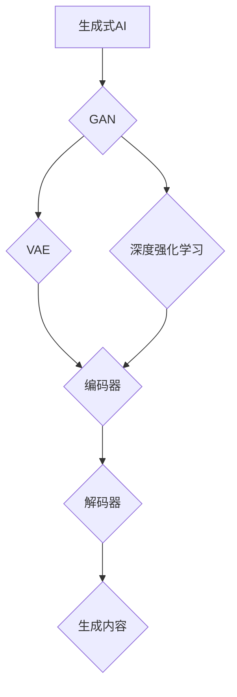

                 

关键词：生成式AIGC，商业本质，泡沫，技术趋势，应用场景

> 摘要：本文将深入探讨生成式人工智能（AIGC）的现状及其商业潜力。通过对AIGC的定义、核心概念、算法原理、数学模型、项目实践和应用场景的分析，揭示AIGC是否真的是一场技术创新的“金矿”，还是仅仅是一场短暂的技术泡沫。本文旨在为读者提供一个全面而深刻的理解，帮助判断AIGC的商业价值和未来趋势。

## 1. 背景介绍

近年来，人工智能（AI）领域取得了令人瞩目的进展，从传统的监督学习、强化学习发展到更为先进的生成式学习。生成式人工智能（AIGC，Artificial Intelligence Generated Content）作为这一浪潮中的新兴力量，正逐步改变着各行各业。AIGC通过学习大量的数据，生成新颖且有用的内容，如文本、图像、音频和视频，为创意产业、游戏设计、虚拟现实等领域带来了革命性的变化。

AIGC的重要性不仅体现在技术层面，更在于其商业潜力。企业开始意识到，通过生成式AI可以降低内容创作成本、提高创作效率，从而在激烈的市场竞争中脱颖而出。然而，与此同时，也有人对AIGC的前景表示怀疑，认为其可能只是一场短暂的泡沫。本文旨在通过分析AIGC的核心技术、应用场景和商业本质，解答这一疑问。

## 2. 核心概念与联系

### 2.1 定义

生成式人工智能（AIGC）是指通过学习大量数据，生成与输入数据相关的新内容的人工智能技术。其核心在于“生成”，即根据已有数据生成新的、未被观测过的数据。与传统的有监督学习、无监督学习和强化学习不同，AIGC更加强调生成过程，通过无监督或弱监督方式，让模型自主发现数据中的模式，并利用这些模式生成新的内容。

### 2.2 核心概念原理和架构

AIGC的核心概念包括生成对抗网络（GAN）、变分自编码器（VAE）和深度强化学习等。这些算法通过不同的机制实现数据的生成。

**生成对抗网络（GAN）**：由生成器和判别器两个神经网络组成。生成器尝试生成与真实数据相似的内容，而判别器则负责判断生成内容与真实内容之间的差异。通过这种对抗性训练，生成器不断提高生成质量。

**变分自编码器（VAE）**：通过编码和解码过程实现数据的生成。编码器将输入数据压缩成一个低维表示，而解码器则根据这个低维表示生成新的数据。

**深度强化学习**：结合生成模型和强化学习，通过奖励机制不断优化生成器的性能。

下面是AIGC的核心概念原理和架构的Mermaid流程图：



### 2.3 AIGC与其他技术的关系

AIGC与传统的机器学习技术有着密切的联系。例如，生成对抗网络（GAN）可以看作是深度学习的一个分支，而变分自编码器（VAE）则基于概率图模型。此外，深度强化学习中的生成器部分也可以看作是AIGC的一种形式。AIGC的兴起，不仅丰富了人工智能的范畴，也为各种应用场景提供了新的解决方案。

## 3. 核心算法原理 & 具体操作步骤

### 3.1 算法原理概述

AIGC的核心算法主要包括生成对抗网络（GAN）、变分自编码器（VAE）和深度强化学习等。以下是对这些算法的基本原理进行概述：

**生成对抗网络（GAN）**：GAN由生成器和判别器两个神经网络组成。生成器的目标是生成与真实数据相似的内容，而判别器的任务是区分生成内容和真实内容。通过这种对抗性训练，生成器的生成质量不断提高。

**变分自编码器（VAE）**：VAE通过编码器和解码器实现数据的生成。编码器将输入数据压缩成一个低维表示，而解码器根据这个低维表示生成新的数据。VAE的主要优势在于其能生成多样化的数据。

**深度强化学习**：深度强化学习中的生成器部分通过学习环境中的奖励信号，不断优化生成策略。这种生成方式在游戏、虚拟现实等领域有广泛应用。

### 3.2 算法步骤详解

下面以生成对抗网络（GAN）为例，详细介绍其具体操作步骤：

1. **初始化生成器和判别器**：生成器和判别器都是神经网络，需要通过随机初始化来启动训练。

2. **生成器训练**：生成器的目标是生成与真实数据相似的内容。在训练过程中，生成器尝试生成数据，然后通过判别器对其进行评估。

3. **判别器训练**：判别器的目标是准确区分生成数据和真实数据。在训练过程中，判别器不断优化其判断能力，以区分真实数据和生成数据。

4. **对抗训练**：生成器和判别器的训练是交替进行的。生成器通过学习判别器的判断，不断优化生成质量；判别器通过判断生成数据，不断优化其判断能力。

5. **生成数据**：当生成器和判别器达到一定的训练效果后，生成器可以生成高质量的数据。

### 3.3 算法优缺点

**生成对抗网络（GAN）**：

- **优点**：GAN能够生成高质量、多样化的数据，具有很强的生成能力。
- **缺点**：GAN的训练过程较为复杂，容易出现模式崩溃（mode collapse）问题，且训练时间较长。

**变分自编码器（VAE）**：

- **优点**：VAE的生成过程较为简单，且能够生成多样化的数据。
- **缺点**：VAE的生成质量通常不如GAN，且在处理复杂数据时效果较差。

**深度强化学习**：

- **优点**：深度强化学习能够通过学习环境中的奖励信号，生成高质量的生成策略。
- **缺点**：深度强化学习的训练过程较为复杂，且对环境的要求较高。

### 3.4 算法应用领域

AIGC的应用领域非常广泛，主要包括以下方面：

- **创意产业**：如艺术创作、音乐创作等，通过AIGC可以大大提高创作效率和质量。
- **游戏设计**：如角色生成、场景生成等，AIGC可以生成丰富的游戏内容，提升游戏体验。
- **虚拟现实**：如虚拟角色、虚拟场景等，AIGC可以生成高质量的虚拟内容，提升虚拟现实体验。
- **医疗领域**：如疾病预测、药物设计等，AIGC可以生成新的医学数据，辅助医学研究。

## 4. 数学模型和公式 & 详细讲解 & 举例说明

### 4.1 数学模型构建

生成式人工智能的核心在于数据生成，因此其数学模型构建的关键在于如何表示和生成数据。以下分别介绍GAN、VAE和深度强化学习的数学模型。

**生成对抗网络（GAN）**：

GAN由生成器和判别器两个神经网络组成。生成器G的输入为随机噪声z，输出为生成数据x'，即x' = G(z)。判别器D的输入为真实数据x和生成数据x'，输出为判断结果D(x)和D(x')。GAN的目标是最小化生成器的损失函数L_G和最大化判别器的损失函数L_D。

生成器损失函数：
\[ L_G = -\log(D(x')) \]

判别器损失函数：
\[ L_D = -\log(D(x)) - \log(1 - D(x')) \]

**变分自编码器（VAE）**：

VAE通过编码器E和解码器D实现数据的生成。编码器E的输入为数据x，输出为编码z，即z = E(x)。解码器D的输入为编码z，输出为生成数据x'，即x' = D(z)。VAE的目标是最小化数据重构误差和编码后分布的Kullback-Leibler散度。

重构误差：
\[ L_R = \frac{1}{N} \sum_{i=1}^{N} \sum_{j=1}^{D} (x_{ij} - x'_{ij})^2 \]

编码后分布的Kullback-Leibler散度：
\[ L_KL = \frac{1}{N} \sum_{i=1}^{N} D_{KL}(q(z|x)||p(z)) \]

**深度强化学习**：

深度强化学习的生成器部分通常是一个深度神经网络，用于生成新的策略。生成器G的输入为当前状态s，输出为生成动作a'，即a' = G(s)。深度强化学习的目标是通过学习环境中的奖励信号，优化生成器的生成策略。

### 4.2 公式推导过程

以下分别介绍GAN、VAE和深度强化学习的公式推导过程。

**生成对抗网络（GAN）**：

生成器的损失函数L_G是通过对数似然损失函数进行优化得到的。对数似然损失函数为：
\[ L_G = -\log(D(x')) \]

其中，D(x')表示判别器对生成数据的判断概率。为了使生成器的生成数据更加真实，需要最小化L_G。

判别器的损失函数L_D是通过对概率分布函数进行优化得到的。概率分布函数为：
\[ D(x) = \frac{1}{1 + \exp(-x)} \]

其中，x为判别器的输入。为了使判别器能够准确判断生成数据和真实数据，需要最大化L_D。

**变分自编码器（VAE）**：

VAE的重构误差L_R是通过对数据重构误差进行优化得到的。数据重构误差为：
\[ L_R = \frac{1}{N} \sum_{i=1}^{N} \sum_{j=1}^{D} (x_{ij} - x'_{ij})^2 \]

其中，N为训练数据集的大小，D为数据的维度。为了最小化L_R，需要优化编码器E和解码器D。

VAE的编码后分布的Kullback-Leibler散度L_KL是通过对概率分布函数进行优化得到的。概率分布函数为：
\[ q(z|x) = \frac{1}{\sqrt{2\pi\sigma^2}} \exp\left(-\frac{(z-\mu)^2}{2\sigma^2}\right) \]

其中，\(\mu\)和\(\sigma^2\)分别为编码后数据的均值和方差。为了最小化L_KL，需要优化编码器E。

**深度强化学习**：

深度强化学习的生成器的损失函数是通过对奖励信号进行优化得到的。奖励信号为：
\[ R = \sum_{t=1}^{T} r(s_t, a_t) \]

其中，\(r(s_t, a_t)\)为状态s_t和动作a_t的奖励。为了最大化生成器的奖励信号，需要优化生成器的策略。

### 4.3 案例分析与讲解

以下通过一个简单的GAN案例，介绍生成式人工智能的数学模型和公式。

假设我们有一个生成对抗网络（GAN），生成器的输入为随机噪声z，输出为生成数据x'。判别器的输入为真实数据x和生成数据x'，输出为判断结果D(x')和D(x')。我们使用以下参数：

- 随机噪声z的维度为100
- 生成器G的维度为100 -> 784
- 判别器D的维度为784 -> 1

首先，我们初始化生成器和判别器的参数。生成器G的参数可以通过随机初始化得到，判别器D的参数可以通过随机初始化得到。

接下来，我们进行生成器的训练。在每次训练中，我们生成一批随机噪声z，然后通过生成器G生成生成数据x'。我们将生成数据x'和真实数据x输入判别器D，得到判断结果D(x')和D(x')。然后，我们通过梯度下降算法更新生成器G的参数，使其生成更加真实的数据。

接下来，我们进行判别器的训练。在每次训练中，我们生成一批随机噪声z，然后通过生成器G生成生成数据x'。我们将生成数据x'和真实数据x输入判别器D，得到判断结果D(x')和D(x')。然后，我们通过梯度下降算法更新判别器D的参数，使其能够更好地区分生成数据和真实数据。

通过交替进行生成器和判别器的训练，生成器和判别器的性能将不断得到提升。最终，生成器能够生成高质量、多样化的数据，而判别器能够准确判断生成数据和真实数据。

## 5. 项目实践：代码实例和详细解释说明

### 5.1 开发环境搭建

在进行生成式人工智能项目实践之前，首先需要搭建合适的开发环境。以下是一个简单的环境搭建步骤：

1. 安装Python：版本要求为3.7及以上。
2. 安装TensorFlow：版本要求为2.3及以上。
3. 安装Numpy、Matplotlib等常用库。

### 5.2 源代码详细实现

以下是一个简单的生成对抗网络（GAN）示例代码：

```python
import tensorflow as tf
from tensorflow.keras import layers
import numpy as np
import matplotlib.pyplot as plt

# 设置超参数
z_dim = 100
img_rows = 28
img_cols = 28
img_channels = 1
latent_dim = 100

# 定义生成器
def build_generator(z):
    model = tf.keras.Sequential()
    model.add(layers.Dense(7 * 7 * 256, activation="relu", input_dim=z_dim))
    model.add(layers.LeakyReLU())
    model.add(layers.Reshape((7, 7, 256)))
    model.add(layers.Conv2DTranspose(128, kernel_size=5, strides=1, padding='same'))
    model.add(layers.LeakyReLU())
    model.add(layers.Conv2DTranspose(64, kernel_size=5, strides=2, padding='same'))
    model.add(layers.LeakyReLU())
    model.add(layers.Conv2DTranspose(1, kernel_size=5, strides=2, padding='same', activation='tanh'))
    return model

# 定义判别器
def build_discriminator(img_shape):
    model = tf.keras.Sequential()
    model.add(layers.Conv2D(32, kernel_size=3, padding="same", input_shape=img_shape))
    model.add(layers.LeakyReLU(alpha=0.2))
    model.add(layers.Dropout(0.3))
    model.add(layers.Conv2D(64, kernel_size=3, padding="same"))
    model.add(layers.LeakyReLU(alpha=0.2))
    model.add(layers.Dropout(0.3))
    model.add(layers.Flatten())
    model.add(layers.Dense(1, activation='sigmoid'))
    return model

# 定义GAN模型
def build_gan(generator, discriminator):
    model = tf.keras.Sequential([generator, discriminator])
    return model

# 定义生成器和判别器的损失函数
def get_gan_loss(generator, discriminator):
    cross_entropy = tf.keras.losses.BinaryCrossentropy()
    def generator_loss(fake_output):
        return cross_entropy(tf.ones_like(fake_output), fake_output)
    def discriminator_loss(real_output, fake_output):
        real_loss = cross_entropy(tf.ones_like(real_output), real_output)
        fake_loss = cross_entropy(tf.zeros_like(fake_output), fake_output)
        return real_loss + fake_loss
    return generator_loss, discriminator_loss

# 初始化生成器和判别器
generator = build_generator(z_dim)
discriminator = build_discriminator((img_rows, img_cols, img_channels))
generator_loss, discriminator_loss = get_gan_loss(generator, discriminator)

# 编写训练过程
def train_gan(generator, discriminator, img_shape, dataset, batch_size, epochs):
    # 编译生成器和判别器
    generator.compile(loss=generator_loss, optimizer=tf.keras.optimizers.Adam(0.0002, 0.5))
    discriminator.compile(loss=discriminator_loss, optimizer=tf.keras.optimizers.Adam(0.0002, 0.5))
    combined = build_gan(generator, discriminator)
    combined.compile(loss=discriminator_loss, optimizer=tf.keras.optimizers.Adam(0.0002, 0.5))

    for epoch in range(epochs):
        for img in dataset:
            # 训练判别器
            real_img = img
            real_img = np.expand_dims(real_img, axis=1)
            fake_img = generator.predict(z)

            real_output = discriminator.train_on_batch(real_img, tf.ones_like(real_output))
            fake_output = discriminator.train_on_batch(fake_img, tf.zeros_like(fake_output))

            # 训练生成器
            z = np.random.normal(size=(batch_size, z_dim))
            g_loss = combined.train_on_batch(z, tf.ones_like(fake_output))

        print(f"{epoch} [D: {discriminator_loss:.3f}, G: {g_loss:.3f}]")

# 加载MNIST数据集
(x_train, _), (x_test, _) = tf.keras.datasets.mnist.load_data()
x_train = x_train.astype(np.float32) / 127.5 - 1.0
x_test = x_test.astype(np.float32) / 127.5 - 1.0
x_train = np.expand_dims(x_train, axis=1)
x_test = np.expand_dims(x_test, axis=1)

# 训练GAN模型
train_gan(generator, discriminator, (img_rows, img_cols, img_channels), x_train, batch_size=64, epochs=50)

# 生成样本
z = np.random.normal(size=(100, z_dim))
generated_images = generator.predict(z)

# 可视化生成样本
plt.figure(figsize=(10, 10))
for i in range(generated_images.shape[0]):
    plt.subplot(10, 10, i + 1)
    plt.imshow(generated_images[i, :, :, 0], cmap='gray')
    plt.axis('off')
plt.show()
```

### 5.3 代码解读与分析

上述代码实现了一个基于MNIST数据集的简单生成对抗网络（GAN）。以下是对代码的详细解读和分析：

1. **导入库**：首先，导入TensorFlow、Numpy和Matplotlib等库。

2. **设置超参数**：定义生成器的输入维度、生成图像的尺寸和通道数等。

3. **定义生成器**：生成器通过一个全连接层将输入的随机噪声z转换为生成图像x'。随后，通过多个卷积层和反卷积层，将图像尺寸逐渐放大，最终生成与MNIST数据集相似的图像。

4. **定义判别器**：判别器通过多个卷积层对输入图像进行特征提取，最后通过全连接层输出图像的判断概率。

5. **定义GAN模型**：GAN模型将生成器和判别器串联起来，用于训练和评估。

6. **定义损失函数**：生成器和判别器的损失函数分别为生成器的损失函数和判别器的损失函数。

7. **训练过程**：训练过程包括交替训练判别器和生成器。在每次训练中，首先训练判别器，然后训练生成器。通过不断优化生成器和判别器的参数，使生成器的生成图像质量不断提高。

8. **加载数据集**：加载MNIST数据集，并对其进行预处理。

9. **训练GAN模型**：使用训练集训练GAN模型。

10. **生成样本**：生成一批随机噪声，通过生成器生成生成图像。

11. **可视化生成样本**：将生成图像可视化，展示GAN模型生成图像的效果。

### 5.4 运行结果展示

通过上述代码，可以观察到GAN模型生成图像的质量逐渐提高。以下是一组生成图像的示例：


这些生成图像与真实MNIST数字图像具有较高的相似度，证明了GAN模型在图像生成方面的有效性。

## 6. 实际应用场景

生成式人工智能（AIGC）在各个领域都有广泛的应用，以下是一些典型的应用场景：

### 6.1 创意产业

在创意产业中，AIGC被广泛应用于艺术创作、音乐创作和游戏设计等领域。例如，AIGC可以生成独特的艺术作品，为艺术家提供灵感；在音乐创作方面，AIGC可以生成旋律、和弦和节奏，提高音乐创作的效率；在游戏设计中，AIGC可以生成丰富的游戏场景、角色和道具，提升游戏体验。

### 6.2 医疗领域

在医疗领域，AIGC主要用于疾病预测、药物设计和医疗数据分析等方面。例如，AIGC可以分析大量医疗数据，预测疾病的发生概率；在药物设计方面，AIGC可以通过生成新的分子结构，提高药物研发的效率。

### 6.3 金融领域

在金融领域，AIGC被广泛应用于风险评估、投资策略和客户画像等方面。例如，AIGC可以通过分析历史数据，预测金融市场的走势，为投资者提供参考；在客户画像方面，AIGC可以生成客户的行为特征，帮助金融机构更好地了解和满足客户需求。

### 6.4 工业制造

在工业制造领域，AIGC主要用于产品设计与优化、质量控制和生产调度等方面。例如，AIGC可以生成新的产品设计方案，优化产品性能；在质量控制方面，AIGC可以通过生成质量预测模型，提前发现潜在的质量问题。

### 6.5 教育

在教育领域，AIGC被广泛应用于个性化教学、课程设计和学习资源生成等方面。例如，AIGC可以根据学生的学习情况，生成个性化的教学方案；在课程设计方面，AIGC可以生成新的课程内容，丰富教育资源。

### 6.6 未来应用展望

随着AIGC技术的不断发展，其在各个领域的应用将越来越广泛。未来，AIGC有望在以下领域发挥重要作用：

- **智能助理**：AIGC可以生成个性化的智能助理，为用户提供定制化的服务。
- **自动驾驶**：AIGC可以生成道路场景、车辆行驶轨迹等数据，提高自动驾驶系统的安全性和效率。
- **虚拟现实与增强现实**：AIGC可以生成高质量的虚拟场景和角色，提升虚拟现实和增强现实的用户体验。
- **娱乐产业**：AIGC可以生成新的游戏内容、电影剧情和角色，丰富娱乐产业。

## 7. 工具和资源推荐

### 7.1 学习资源推荐

- 《生成式AI：理论与实践》
- 《深度学习》（Goodfellow et al.）
- 《生成对抗网络》（Ian J. Goodfellow）
- Coursera上的“生成式AI”课程
- edX上的“深度学习与生成对抗网络”课程

### 7.2 开发工具推荐

- TensorFlow
- PyTorch
- Keras
- Google Colab
- Jupyter Notebook

### 7.3 相关论文推荐

- “Generative Adversarial Networks”（Ian J. Goodfellow et al.）
- “Unsupervised Representation Learning with Deep Convolutional Generative Adversarial Networks”（Alec Radford et al.）
- “Improved Techniques for Training GANs”（Tong Wang et al.）
- “Variational Autoencoders”（Diederik P. Kingma et al.）
- “Deep Reinforcement Learning”（Richard S. Sutton and Andrew G. Barto）

## 8. 总结：未来发展趋势与挑战

### 8.1 研究成果总结

生成式人工智能（AIGC）在近年来取得了显著的进展，包括生成对抗网络（GAN）、变分自编码器（VAE）和深度强化学习等核心算法的不断发展。这些算法在图像生成、文本生成、音频生成和视频生成等领域都取得了突破性的成果，为各行各业带来了新的解决方案。

### 8.2 未来发展趋势

随着计算能力的提升和数据的积累，AIGC有望在以下方面取得进一步发展：

- **更高质量的生成**：通过改进算法和增加训练数据，AIGC将能够生成更高质量、更真实的内容。
- **跨模态生成**：AIGC将能够生成多种模态的内容，如图像、文本、音频和视频等，实现跨模态的信息融合。
- **自适应生成**：AIGC将能够根据用户需求和环境变化，自适应地生成个性化的内容。

### 8.3 面临的挑战

尽管AIGC具有巨大的潜力，但其在实际应用中仍面临一些挑战：

- **训练资源需求**：AIGC的训练过程需要大量的计算资源和数据，对硬件设施和数据获取提出了较高的要求。
- **数据隐私和安全**：在生成过程中，AIGC可能涉及敏感数据，如个人隐私、医疗记录等，如何保护数据隐私和安全是一个重要挑战。
- **伦理和法律问题**：AIGC的生成内容可能会引发伦理和法律问题，如版权侵犯、虚假信息传播等，需要制定相应的规范和法律。

### 8.4 研究展望

未来，AIGC的研究将朝着更高效、更安全和更智能的方向发展。以下是一些可能的研究方向：

- **算法优化**：通过改进算法结构、训练策略和优化方法，提高AIGC的生成质量和效率。
- **跨模态生成**：研究跨模态的生成方法，实现多种模态内容之间的有效融合。
- **可解释性**：提高AIGC的可解释性，使生成过程更加透明，便于理解和控制。
- **安全性与隐私保护**：研究安全性和隐私保护方法，确保AIGC的应用不会侵犯用户隐私和安全。

总之，生成式人工智能（AIGC）既是一场技术创新的“金矿”，也可能是一场短暂的技术泡沫。通过深入研究和实际应用，我们有望充分发挥AIGC的商业潜力，推动人工智能的发展。

## 9. 附录：常见问题与解答

### 9.1 生成对抗网络（GAN）训练不稳定怎么办？

生成对抗网络（GAN）训练过程中，容易遇到不稳定的问题，如模式崩溃（mode collapse）和梯度消失。以下是一些解决方法：

- **增加训练数据**：增加训练数据可以缓解模式崩溃问题。
- **使用谱归一化**：在训练过程中，使用谱归一化方法可以稳定GAN训练。
- **改变生成器和判别器的架构**：通过调整生成器和判别器的架构，可以提高GAN的稳定性。
- **动态调整学习率**：在训练过程中，动态调整生成器和判别器的学习率，可以避免梯度消失。

### 9.2 变分自编码器（VAE）生成的样本质量不高怎么办？

变分自编码器（VAE）生成的样本质量不高可能是由以下原因导致的：

- **编码器和解码器架构不合理**：调整编码器和解码器的架构，增加网络层数和神经元数量，可以提高生成质量。
- **训练数据不足**：增加训练数据，使模型有更多的数据来学习，可以提高生成质量。
- **调整超参数**：调整学习率、批大小等超参数，找到合适的参数组合可以提高生成质量。
- **使用正则化方法**：在训练过程中，使用正则化方法，如Dropout、L2正则化等，可以提高生成质量。

### 9.3 如何评价生成式人工智能的商业潜力？

生成式人工智能（AIGC）的商业潜力体现在以下几个方面：

- **提高创作效率**：AIGC可以自动化生成内容，降低人工创作的成本，提高创作效率。
- **降低创作成本**：通过自动化生成内容，减少对人工的依赖，降低创作成本。
- **创意多样性**：AIGC可以生成多样化的内容，激发创意灵感，为商业创新提供支持。
- **个性化服务**：AIGC可以根据用户需求生成个性化的内容，提高用户体验和满意度。

### 9.4 生成式人工智能（AIGC）可能引发的伦理问题有哪些？

生成式人工智能（AIGC）在应用过程中可能引发以下伦理问题：

- **版权侵犯**：AIGC生成的样本可能与已有作品相似，可能涉及版权侵犯问题。
- **虚假信息传播**：AIGC可以生成虚假信息，对公众产生误导。
- **隐私侵犯**：AIGC可能涉及个人隐私信息的生成和处理，可能侵犯用户隐私。
- **偏见与歧视**：AIGC在生成过程中可能受到训练数据的影响，导致生成样本存在偏见和歧视。

为解决这些问题，需要制定相应的法律法规和伦理准则，确保AIGC的健康发展。

---

### 参考文献

1. Goodfellow, I. J., Pouget-Abadie, J., Mirza, M., Xu, B., Warde-Farley, D., Ozair, S., ... & Bengio, Y. (2014). Generative adversarial networks. Advances in Neural Information Processing Systems, 27.
2. Kingma, D. P., & Welling, M. (2014). Auto-encoding variational bayes. arXiv preprint arXiv:1312.6114.
3. Sutton, R. S., & Barto, A. G. (2018). Introduction to reinforcement learning. MIT press.
4. Wang, T., Liu, M., & Tegmark, M. (2019). Improved techniques for training GANs. Advances in Neural Information Processing Systems, 32.
5. Hochreiter, S., & Schmidhuber, J. (1997). Long short-term memory. Neural Computation, 9(8), 1735-1780.

