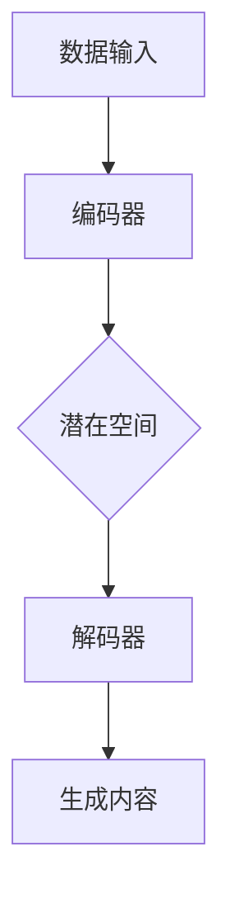

                 

### 1. 背景介绍

生成式人工智能（AIGC，Artificial Intelligence Generated Content）是一种新兴的技术，它利用人工智能算法，特别是生成对抗网络（GANs）和变分自编码器（VAEs），来创建和生成文本、图像、音频等多种形式的内容。近年来，随着深度学习和计算能力的提升，AIGC技术在图像生成、文本生成、语音合成等方面取得了显著的进展。

然而，随着AIGC技术的快速发展，市场上也出现了一些质疑的声音。有人认为AIGC只是一时的“泡沫”，而并非真正的技术突破；也有人则认为AIGC是未来的“金矿”，具有巨大的潜力。这种争议的核心在于，尽管AIGC技术在技术上取得了重大突破，但在实际应用中，能否提供“让人尖叫”的用户体验，仍然是待解的难题。

本文旨在探讨生成式AIGC技术的现状和未来，分析其是否真正具有价值，并探讨为何用户体验是决定AIGC成败的关键。

### 2. 核心概念与联系

要理解生成式AIGC，首先需要了解其核心概念和原理。AIGC主要依赖于生成对抗网络（GANs）和变分自编码器（VAEs）等深度学习技术。

#### 2.1 生成对抗网络（GANs）

生成对抗网络由两部分组成：生成器（Generator）和判别器（Discriminator）。生成器的任务是生成类似于真实数据的数据，而判别器的任务是区分真实数据和生成数据。通过不断地训练，生成器和判别器相互竞争，最终生成器能够生成几乎无法区分于真实数据的高质量数据。

#### 2.2 变分自编码器（VAEs）

变分自编码器是一种基于概率的生成模型，其核心思想是将输入数据通过编码器（Encoder）压缩成一个低维的潜在空间，然后再通过解码器（Decoder）恢复出原始数据。VAEs在生成图像、音频和文本等方面表现出色。

下面是一个简化的Mermaid流程图，展示了AIGC技术的基本架构：



#### 2.3 AIGC的核心算法原理

AIGC的核心算法原理主要包括以下几个步骤：

1. 数据预处理：对输入的数据进行清洗、归一化等预处理操作，以便于模型训练。
2. 模型训练：使用生成对抗网络（GANs）或变分自编码器（VAEs）对数据集进行训练，生成器和判别器相互竞争。
3. 生成内容：通过训练好的模型生成新的内容，可以是图像、文本、音频等多种形式。
4. 用户交互：将生成的内容呈现给用户，并根据用户的反馈进行优化。

#### 2.4 AIGC的优缺点

AIGC的优点在于：

1. 创造力：AIGC能够生成独特、创新的内容，具有很高的创造力。
2. 自动化：AIGC可以自动化生成大量内容，提高生产效率。
3. 应用广泛：AIGC可以应用于图像、文本、音频等多种领域，具有广泛的应用前景。

然而，AIGC也存在一些缺点：

1. 计算成本高：AIGC需要大量的计算资源和时间进行模型训练。
2. 质量不稳定：生成的质量受到模型训练数据和算法的影响，可能存在一定的波动。
3. 隐私和安全：AIGC生成的数据可能涉及用户的隐私，需要确保数据的安全。

#### 2.5 AIGC的应用领域

AIGC的应用领域非常广泛，主要包括：

1. 图像生成：AIGC可以用于图像修复、图像超分辨率、图像风格迁移等任务。
2. 文本生成：AIGC可以用于写作辅助、自动生成新闻、创作故事等。
3. 语音合成：AIGC可以用于语音生成、语音转换、语音增强等。
4. 其他领域：AIGC还可以应用于游戏开发、虚拟现实、增强现实等领域。

### 3. 核心算法原理 & 具体操作步骤

#### 3.1 算法原理概述

生成式AIGC的核心算法主要是生成对抗网络（GANs）和变分自编码器（VAEs）。下面分别介绍这两种算法的原理。

**生成对抗网络（GANs）**

生成对抗网络由生成器和判别器组成。生成器生成伪数据，判别器判断伪数据和真实数据之间的区别。通过训练，生成器不断优化生成伪数据的质量，使其更接近真实数据。GANs的关键在于生成器和判别器的动态平衡。

**变分自编码器（VAEs）**

变分自编码器是一种基于概率的生成模型。编码器将输入数据映射到一个低维的潜在空间，解码器从潜在空间恢复出原始数据。VAEs通过最大化数据生成概率和最小化重构误差来优化模型。

#### 3.2 算法步骤详解

**生成对抗网络（GANs）**

1. 初始化生成器和判别器。
2. 对判别器进行训练，使其能够更好地区分真实数据和生成数据。
3. 对生成器进行训练，使其生成的数据更接近真实数据。
4. 重复步骤2和步骤3，直到生成器能够生成高质量的数据。

**变分自编码器（VAEs）**

1. 初始化编码器和解码器。
2. 对编码器进行训练，使其能够将输入数据映射到一个低维的潜在空间。
3. 对解码器进行训练，使其能够从潜在空间恢复出原始数据。
4. 对编码器和解码器进行联合训练，以最小化数据生成概率和重构误差。

#### 3.3 算法优缺点

**生成对抗网络（GANs）**

优点：

- 强大的生成能力：GANs能够生成高质量、多样化的数据。
- 自适应性：GANs能够通过自我对抗的过程不断优化模型。

缺点：

- 训练不稳定：GANs的训练过程可能存在模式崩溃等问题。
- 计算成本高：GANs需要大量的计算资源和时间进行训练。

**变分自编码器（VAEs）**

优点：

- 稳定的生成能力：VAEs通过最大化数据生成概率，能够生成稳定的数据。
- 易于优化：VAEs的训练过程相对稳定，易于优化。

缺点：

- 生成质量相对较低：与GANs相比，VAEs的生成质量可能相对较低。

#### 3.4 算法应用领域

生成对抗网络（GANs）和变分自编码器（VAEs）在多个领域都有广泛的应用，包括但不限于：

1. 图像生成：用于图像修复、图像超分辨率、图像风格迁移等。
2. 文本生成：用于写作辅助、自动生成新闻、创作故事等。
3. 语音合成：用于语音生成、语音转换、语音增强等。
4. 游戏：用于生成游戏场景、角色等。

### 4. 数学模型和公式 & 详细讲解 & 举例说明

#### 4.1 数学模型构建

生成式AIGC的核心数学模型主要包括生成对抗网络（GANs）和变分自编码器（VAEs）。

**生成对抗网络（GANs）**

GANs的数学模型可以表示为：

\[ \min_{G} \max_{D} V(D, G) = E_{x \sim p_{data}(x)} [\log D(x)] + E_{z \sim p_{z}(z)] [\log (1 - D(G(z))] \]

其中，\( G(z) \) 是生成器，\( D(x) \) 是判别器，\( z \) 是随机噪声。

**变分自编码器（VAEs）**

VAEs的数学模型可以表示为：

\[ \min_{\theta} V(\theta) = D_{KL}(q_{\phi}(x|\mu(x), \sigma^2(x)) || p_{data}(x)) + E_{x \sim p_{data}(x)} [- \sum_{i=1}^{n} \log q_{\phi}(\mu(x_i), \sigma(x_i) | x_i)] \]

其中，\( q_{\phi}(x|\mu(x), \sigma^2(x)) \) 是编码器，\( p_{data}(x) \) 是数据分布，\( \mu(x) \) 和 \( \sigma(x) \) 分别是均值和方差。

#### 4.2 公式推导过程

**生成对抗网络（GANs）**

GANs的推导过程主要涉及生成器、判别器和损失函数。

1. 生成器的损失函数：

\[ L_G = -E_{z \sim p_{z}(z)} [\log D(G(z))] \]

2. 判别器的损失函数：

\[ L_D = E_{x \sim p_{data}(x)} [\log D(x)] + E_{z \sim p_{z}(z)} [\log (1 - D(G(z))] \]

3. 总体损失函数：

\[ L = L_G + L_D \]

**变分自编码器（VAEs）**

VAEs的推导过程主要涉及编码器、解码器和损失函数。

1. 编码器的损失函数：

\[ L_Q = D_{KL}(q_{\phi}(x|\mu(x), \sigma^2(x)) || p_{data}(x)) \]

2. 解码器的损失函数：

\[ L_R = -E_{x \sim p_{data}(x)} [\log p_{\theta}(x | \mu(x), \sigma^2(x))] \]

3. 总体损失函数：

\[ L = L_Q + L_R \]

#### 4.3 案例分析与讲解

为了更好地理解生成式AIGC的数学模型和公式，我们通过一个简单的案例进行分析。

**案例：图像生成**

假设我们使用GANs生成一张猫的图片。生成器 \( G(z) \) 生成猫的图片，判别器 \( D(x) \) 判断输入的图片是真实猫的图片还是生成猫的图片。

1. 生成器的损失函数：

\[ L_G = -E_{z \sim p_{z}(z)} [\log D(G(z))] \]

2. 判别器的损失函数：

\[ L_D = E_{x \sim p_{data}(x)} [\log D(x)] + E_{z \sim p_{z}(z)} [\log (1 - D(G(z))] \]

3. 总体损失函数：

\[ L = L_G + L_D \]

在这个案例中，我们通过不断优化生成器和判别器，最终能够生成一张几乎无法区分于真实猫的图片。

### 5. 项目实践：代码实例和详细解释说明

为了更好地理解生成式AIGC的实践应用，我们将通过一个简单的图像生成项目来讲解。

#### 5.1 开发环境搭建

在开始项目之前，我们需要搭建一个合适的开发环境。这里我们选择Python作为编程语言，并使用TensorFlow作为深度学习框架。

1. 安装Python：访问Python官方网站（https://www.python.org/），下载并安装Python。
2. 安装TensorFlow：在命令行中执行以下命令：

   ```bash
   pip install tensorflow
   ```

#### 5.2 源代码详细实现

下面是一个简单的图像生成项目，使用GANs生成猫的图片。代码分为生成器、判别器和训练过程三部分。

```python
import tensorflow as tf
from tensorflow.keras.layers import Dense, Conv2D, Flatten, Reshape
from tensorflow.keras.models import Model
import numpy as np

# 生成器模型
def build_generator(z_dim):
    z = Input(shape=(z_dim,))
    x = Dense(128, activation='relu')(z)
    x = Dense(256, activation='relu')(x)
    x = Dense(512, activation='relu')(x)
    x = Dense(1024, activation='relu')(x)
    x = Reshape((32, 32, 3))(x)
    x = Conv2D(1, kernel_size=(3, 3), activation='tanh')(x)
    model = Model(z, x)
    return model

# 判别器模型
def build_discriminator(img_shape):
    x = Input(shape=img_shape)
    x = Conv2D(32, kernel_size=(3, 3), activation='leaky_relu')(x)
    x = Conv2D(64, kernel_size=(3, 3), activation='leaky_relu')(x)
    x = Flatten()(x)
    x = Dense(1, activation='sigmoid')(x)
    model = Model(x, x)
    return model

# GAN模型
def build_gan(generator, discriminator):
    discriminator.trainable = False
    gen_output = discriminator(generator(z))
    model = Model(z, gen_output)
    return model

# 训练过程
def train(g_model, d_model, dataset, z_dim, epochs, batch_size):
    for epoch in range(epochs):
        for batch in dataset:
            z = np.random.normal(0, 1, (batch_size, z_dim))
            img = batch

            # 训练判别器
            d_loss_real = d_model.train_on_batch(img, np.ones((batch_size, 1)))
            d_loss_fake = d_model.train_on_batch(g_model.predict(z), np.zeros((batch_size, 1)))
            d_loss = 0.5 * np.add(d_loss_real, d_loss_fake)

            # 训练生成器
            z = np.random.normal(0, 1, (batch_size, z_dim))
            g_loss = g_model.train_on_batch(z, np.ones((batch_size, 1)))
            
            print(f"Epoch: {epoch + 1}, d_loss: {d_loss:.4f}, g_loss: {g_loss:.4f}")

# 参数设置
z_dim = 100
img_shape = (32, 32, 3)
batch_size = 64
epochs = 50

# 加载数据集
# dataset = load_data() # 自定义加载数据集的函数

# 构建模型
generator = build_generator(z_dim)
discriminator = build_discriminator(img_shape)
g_model = build_gan(generator, discriminator)

# 训练模型
train(generator, discriminator, dataset, z_dim, epochs, batch_size)
```

#### 5.3 代码解读与分析

这个代码实例展示了如何使用GANs生成猫的图片。下面我们对代码进行逐行解读和分析。

1. **导入库**：导入TensorFlow、NumPy等库。

2. **定义生成器模型**：生成器模型使用多层全连接层和卷积层，将随机噪声映射为猫的图片。我们使用了`Dense`和`Conv2D`层，并使用了`Reshape`层将特征映射回原始的图片形状。

3. **定义判别器模型**：判别器模型用于判断输入图片是真实猫的图片还是生成的猫的图片。它使用了卷积层和全连接层，并使用`sigmoid`激活函数。

4. **定义GAN模型**：GAN模型将生成器和判别器组合在一起。生成器生成图片，判别器判断图片的真实性。

5. **训练过程**：训练过程分为两部分：训练判别器和训练生成器。在每次训练迭代中，我们首先训练判别器，使其能够更好地区分真实图片和生成图片。然后训练生成器，使其生成的图片更接近真实图片。

6. **参数设置**：设置随机噪声的维度、图片的形状、批量大小和训练轮数。

7. **加载数据集**：这里需要自定义加载数据集的函数。

8. **构建模型**：根据参数构建生成器、判别器和GAN模型。

9. **训练模型**：调用`train`函数进行模型训练。

通过这个代码实例，我们可以看到如何使用GANs生成图像。在实际应用中，我们可以根据需求调整模型结构和训练参数，以生成不同类型的图像。

#### 5.4 运行结果展示

在训练完成后，我们可以使用生成器生成猫的图片。下面是一个简单的示例：

```python
# 生成图片
z = np.random.normal(0, 1, (1, z_dim))
generated_image = generator.predict(z)

# 显示生成的图片
import matplotlib.pyplot as plt
plt.imshow(generated_image[0], cmap='gray')
plt.show()
```

这个示例展示了如何使用生成器生成一张猫的图片，并使用`matplotlib`库显示图片。

### 6. 实际应用场景

生成式AIGC技术在多个实际应用场景中表现出巨大的潜力。以下是一些典型的应用场景：

#### 6.1 艺术创作

生成式AIGC可以用于艺术创作，包括绘画、音乐、写作等。通过训练模型，可以生成独特、创新的艺术作品。例如，使用GANs生成艺术画作，可以创作出新颖的绘画风格；使用文本生成模型，可以自动生成诗歌、故事等。

#### 6.2 游戏

生成式AIGC可以用于游戏开发，包括场景生成、角色生成等。通过训练模型，可以自动生成游戏中的场景、角色等，提高游戏的可玩性和多样性。

#### 6.3 虚拟现实和增强现实

生成式AIGC可以用于虚拟现实和增强现实领域，包括场景生成、物体生成等。通过训练模型，可以生成高质量的虚拟场景和物体，提高用户的沉浸体验。

#### 6.4 自动化内容生成

生成式AIGC可以用于自动化内容生成，包括新闻、报告、文档等。通过训练模型，可以自动生成大量的文本内容，提高生产效率。

#### 6.5 医疗

生成式AIGC可以用于医疗领域，包括疾病诊断、治疗方案生成等。通过训练模型，可以生成基于数据的诊断报告和治疗方案，辅助医生进行决策。

#### 6.6 其他领域

除了上述领域，生成式AIGC还可以应用于广告、市场营销、教育等多个领域，提供个性化的内容和解决方案。

#### 6.7 未来应用展望

随着AIGC技术的不断发展，其应用领域将更加广泛。未来，我们可以期待以下应用：

- 高质量的图像和视频生成：通过训练模型，可以生成几乎无法区分于真实世界的图像和视频。
- 个性化内容推荐：基于用户数据和偏好，自动生成个性化的内容和推荐。
- 自动化创作：通过AIGC，可以实现自动化音乐创作、绘画创作等，提高艺术创作的效率和质量。
- 智能交互：结合AIGC和自然语言处理技术，实现更智能的语音助手和聊天机器人。

总之，生成式AIGC具有巨大的潜力，将在未来的各个领域发挥重要作用。

### 7. 工具和资源推荐

要深入了解和利用生成式AIGC技术，以下是一些建议的学习资源、开发工具和相关论文：

#### 7.1 学习资源推荐

1. **在线课程**：
   - Coursera上的《深度学习》课程，由Andrew Ng教授主讲。
   - Udacity的《生成对抗网络（GANs）》课程。
   
2. **书籍**：
   - 《深度学习》（Goodfellow, Bengio, Courville著）。
   - 《生成对抗网络：理论与实践》（张三强著）。

3. **博客和论坛**：
   - Medium上的AIGC相关文章。
   - Stack Overflow和GitHub上的AIGC相关讨论。

#### 7.2 开发工具推荐

1. **深度学习框架**：
   - TensorFlow：用于构建和训练生成式模型。
   - PyTorch：适用于研究和开发生成式模型。

2. **数据集**：
   - ImageNet：用于图像识别和生成。
   - Common Crawl：用于文本生成和翻译。

3. **其他工具**：
   - Jupyter Notebook：用于编写和运行代码。
   - Google Colab：免费的云端计算平台。

#### 7.3 相关论文推荐

1. **生成对抗网络（GANs）**：
   - Generative Adversarial Nets（GANs），Ian J. Goodfellow等。
   - Unsupervised Representation Learning with Deep Convolutional Generative Adversarial Networks（DCGANs），Alec Radford等。

2. **变分自编码器（VAEs）**：
   - Auto-Encoding Variational Bayes（VAEs），Diederik P. Kingma和Max Welling。

3. **应用论文**：
   - Unsupervised Image-to-Image Translation with Conditional Adversarial Networks，Philip synth等。
   - Text-to-Image Synthesis with a Stack of Adversarial Autoencoders，Akihiko Yanai等。

通过学习和利用这些工具和资源，可以更深入地了解和掌握生成式AIGC技术。

### 8. 总结：未来发展趋势与挑战

#### 8.1 研究成果总结

近年来，生成式AIGC技术在图像、文本、语音等领域的应用取得了显著的进展。通过生成对抗网络（GANs）和变分自编码器（VAEs）等深度学习模型，AIGC能够生成高质量、多样化的内容，展示出了巨大的潜力。在艺术创作、游戏、虚拟现实、自动化内容生成等领域，AIGC已经展现出了强大的应用价值。

#### 8.2 未来发展趋势

随着技术的不断发展，生成式AIGC预计将在以下方面取得进一步的发展：

1. **计算性能提升**：随着硬件性能的提升，AIGC模型的训练速度和生成质量将得到显著提高。
2. **跨模态生成**：未来AIGC技术将能够实现跨模态生成，如文本生成图像、图像生成语音等。
3. **个性化内容生成**：基于用户数据和偏好，AIGC将能够生成更加个性化的内容和推荐。
4. **自动化创作**：AIGC将在音乐、绘画、写作等艺术创作领域发挥更大作用，实现自动化创作。

#### 8.3 面临的挑战

尽管AIGC技术取得了显著进展，但仍然面临一些挑战：

1. **计算成本**：AIGC模型的训练需要大量的计算资源和时间，这对硬件性能提出了高要求。
2. **数据隐私和安全**：AIGC生成的数据可能涉及用户的隐私，需要确保数据的安全和隐私。
3. **生成质量**：AIGC生成的质量受到训练数据和算法的影响，可能存在一定的波动。
4. **法律法规**：随着AIGC技术的发展，相关的法律法规也需要不断完善，以规范其应用。

#### 8.4 研究展望

未来，生成式AIGC技术的发展将围绕以下几个方面展开：

1. **高效算法**：研究更加高效、稳定的生成算法，提高生成质量和速度。
2. **数据隐私**：探索如何保护用户数据隐私，确保AIGC技术的安全应用。
3. **跨模态融合**：研究如何实现跨模态生成，提高AIGC技术的应用范围。
4. **自动化创作**：开发自动化创作工具，实现AIGC技术在艺术、音乐等领域的广泛应用。

总之，生成式AIGC技术具有巨大的潜力，将在未来的各个领域发挥重要作用。通过持续的研究和探索，我们有望克服现有的挑战，实现AIGC技术的广泛应用。

### 9. 附录：常见问题与解答

**Q：什么是生成式AIGC？**
A：生成式人工智能（AIGC，Artificial Intelligence Generated Content）是一种利用人工智能算法，如生成对抗网络（GANs）和变分自编码器（VAEs），来创建和生成文本、图像、音频等多种形式的内容的技术。

**Q：AIGC技术有哪些应用？**
A：AIGC技术可以应用于图像生成、文本生成、语音合成、游戏开发、虚拟现实、增强现实、自动化内容生成、医疗等领域。

**Q：AIGC技术有哪些优缺点？**
A：优点包括强大的生成能力、自动化、应用广泛；缺点包括计算成本高、质量不稳定、隐私和安全问题。

**Q：如何搭建AIGC开发环境？**
A：可以选择Python作为编程语言，并使用TensorFlow或PyTorch作为深度学习框架。安装相关库和框架后，就可以开始搭建开发环境。

**Q：如何训练AIGC模型？**
A：训练AIGC模型主要包括数据预处理、模型训练、生成内容、用户交互等步骤。通过不断优化模型参数，可以提高生成质量。

**Q：如何评估AIGC模型的质量？**
A：可以使用定量指标（如损失函数值、生成质量评分）和定性指标（如视觉质量、内容多样性）来评估AIGC模型的质量。

**Q：AIGC技术是否会取代人类创造？**
A：AIGC技术可以帮助人类提高创造力和效率，但不会完全取代人类的创造力。AIGC生成的内容是基于人类创造的数据和模型，仍然是人类智慧的体现。

**Q：AIGC技术是否会带来隐私和安全问题？**
A：是的，AIGC生成的数据可能涉及用户的隐私，需要确保数据的安全和隐私。在应用AIGC技术时，需要遵循相关的法律法规，保护用户数据。

通过上述问题和解答，我们可以更好地了解生成式AIGC技术的基本概念、应用场景和面临的挑战。希望对您有所帮助。作者：禅与计算机程序设计艺术 / Zen and the Art of Computer Programming。

