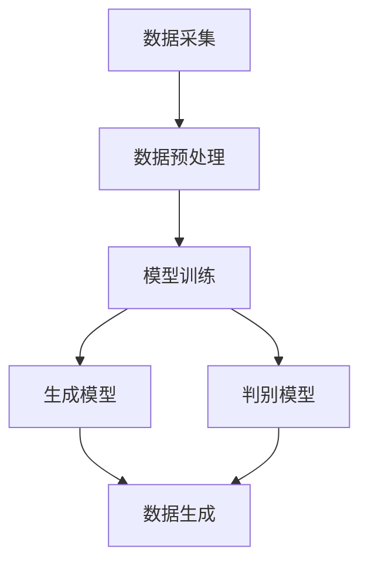

                 

关键词：生成式AI、AIGC、商业应用、技术落地、算法原理、数学模型、项目实践、工具资源、未来展望

> 摘要：本文将探讨生成式人工智能（AIGC）的原理、实现及应用，从实验室研究到商业应用的落地过程。通过详细分析核心概念、算法原理、数学模型、项目实践等方面，帮助读者全面了解AIGC技术的发展与应用前景。

## 1. 背景介绍

随着人工智能技术的不断发展，生成式人工智能（AIGC）逐渐成为研究热点。AIGC是一种基于生成模型的人工智能技术，旨在通过学习数据分布来生成新的数据。相比于传统的基于规则的AI技术，AIGC能够更加灵活地处理复杂问题，具有广泛的应用前景。

近年来，AIGC在图像生成、语音合成、文本生成等领域取得了显著成果。例如，GPT-3等大型语言模型在文本生成领域取得了革命性的突破，DALL-E等图像生成模型在图像生成领域展现了强大的能力。然而，将AIGC技术从实验室研究转化为商业应用仍面临诸多挑战。

本文将从AIGC的核心概念、算法原理、数学模型、项目实践等方面展开讨论，旨在为读者提供一份关于AIGC技术从实验室到商业应用落地的全面指南。

### 1.1 AIGC的定义与发展历程

生成式人工智能（AIGC）是指利用人工智能技术生成新的数据，包括文本、图像、音频等。AIGC的核心思想是通过学习数据分布来生成新的数据，从而实现数据生成与处理。

AIGC的发展历程可以分为以下几个阶段：

1. **规则生成**：早期的人工智能技术主要基于规则，通过预设的规则生成新的数据。这种方法的局限性在于规则难以覆盖所有情况，且难以处理复杂问题。

2. **统计生成**：随着机器学习技术的发展，统计生成方法逐渐应用于AIGC领域。通过学习数据分布，生成模型能够生成更加多样化和复杂的数据。

3. **深度生成**：深度学习技术的崛起为AIGC带来了新的机遇。基于深度学习的生成模型，如生成对抗网络（GAN）和变分自编码器（VAE），在图像、文本和音频生成等领域取得了显著成果。

4. **大规模生成**：随着计算能力的提升和数据规模的扩大，AIGC技术逐渐走向大规模生成。例如，GPT-3等大型语言模型能够在短时间内生成大量高质量的文本。

### 1.2 AIGC在实验室与商业应用中的差异

在实验室中，AIGC技术的研究主要关注算法性能的提升、模型优化和理论分析。实验室研究往往具有以下特点：

1. **数据集小**：实验室研究的数据集通常较小，难以覆盖所有场景和情况。

2. **算法优化**：实验室研究主要关注算法性能的提升，如模型训练速度、生成质量等。

3. **理论研究**：实验室研究往往注重理论分析，探讨算法原理、数学模型等。

而商业应用中的AIGC技术则需要解决以下问题：

1. **数据多样性**：商业应用需要处理各种类型的数据，包括文本、图像、音频等，且数据规模较大。

2. **实际场景**：商业应用需要解决实际场景中的问题，如数据缺失、噪声干扰等。

3. **用户体验**：商业应用需要提供良好的用户体验，如快速响应、高质量生成等。

### 1.3 AIGC在商业应用中的挑战与机遇

将AIGC技术从实验室研究转化为商业应用面临诸多挑战：

1. **数据质量**：商业应用需要高质量的数据集，但获取和处理大量数据是一个复杂的过程。

2. **计算资源**：AIGC技术通常需要大量的计算资源，商业应用需要合理分配和利用资源。

3. **安全隐私**：在处理敏感数据时，AIGC技术需要确保数据安全和隐私。

然而，AIGC技术也为商业应用带来了巨大的机遇：

1. **个性化服务**：AIGC技术能够根据用户需求生成个性化内容，提升用户体验。

2. **自动化生产**：AIGC技术能够自动化生成图像、文本、音频等，降低生产成本。

3. **创意产业**：AIGC技术为创意产业提供了新的创作工具，如文本生成、图像生成等。

## 2. 核心概念与联系

在深入探讨AIGC的原理和实现之前，我们需要了解一些核心概念，这些概念是理解AIGC技术的基础。

### 2.1 数据生成与模型训练

数据生成是AIGC技术的核心任务之一。数据生成包括两个方面：数据采集和数据预处理。数据采集是指从各种来源获取数据，如互联网、数据库等。数据预处理则是对采集到的数据进行清洗、归一化等处理，以便于后续的模型训练。

模型训练是AIGC技术的另一个核心环节。模型训练是指利用已采集和处理好的数据，通过机器学习算法训练生成模型。训练过程中，模型通过不断调整参数，以最小化损失函数，从而提高生成质量。

### 2.2 生成模型与判别模型

生成模型和判别模型是AIGC技术的两个关键组成部分。

- **生成模型**：生成模型旨在学习数据的分布，并生成新的数据。常见的生成模型有生成对抗网络（GAN）、变分自编码器（VAE）等。

- **判别模型**：判别模型旨在判断输入数据是否真实。在生成模型训练过程中，判别模型与生成模型相互竞争，以提高生成质量。

### 2.3 数据分布与生成质量

数据分布是影响AIGC生成质量的重要因素。理想情况下，生成模型应该能够生成与训练数据分布相似的数据。然而，在实际应用中，生成模型可能面临以下挑战：

1. **数据不平衡**：训练数据中某些类别的样本数量较少，可能导致生成模型倾向于生成这些类别。

2. **噪声干扰**：训练数据中可能存在噪声，影响生成模型的学习效果。

3. **数据缺失**：训练数据可能存在缺失值，导致生成模型难以生成完整的数据。

为了提高生成质量，AIGC技术需要关注以下几个方面：

1. **数据增强**：通过数据增强技术，如随机裁剪、旋转等，增加训练数据的多样性。

2. **模型优化**：通过调整模型参数、优化算法等，提高生成模型的性能。

3. **损失函数设计**：设计合适的损失函数，以平衡生成模型和判别模型之间的竞争。

### 2.4 Mermaid 流程图

为了更好地展示AIGC的核心概念和联系，我们可以使用Mermaid流程图来描述AIGC的流程。



在这个流程图中，数据采集、数据预处理、模型训练、生成模型和判别模型构成了AIGC的核心环节。

## 3. 核心算法原理 & 具体操作步骤

### 3.1 算法原理概述

AIGC的核心算法主要包括生成模型和判别模型。生成模型旨在学习数据的分布，生成新的数据；判别模型则用于判断输入数据是否真实。以下将分别介绍这两种模型的工作原理。

#### 3.1.1 生成模型

生成模型是一种能够生成新数据的模型。常见的生成模型有生成对抗网络（GAN）和变分自编码器（VAE）。

1. **生成对抗网络（GAN）**：GAN由生成器和判别器组成。生成器试图生成与真实数据相似的数据，而判别器则判断输入数据是真实数据还是生成数据。在训练过程中，生成器和判别器相互竞争，以提高生成质量。

2. **变分自编码器（VAE）**：VAE通过编码器和解码器来学习数据的分布。编码器将输入数据映射到一个低维空间，解码器则从低维空间生成新的数据。

#### 3.1.2 判别模型

判别模型用于判断输入数据是否真实。常见的判别模型有卷积神经网络（CNN）和循环神经网络（RNN）。

1. **卷积神经网络（CNN）**：CNN是一种用于图像处理的神经网络，具有局部感知能力和平移不变性。

2. **循环神经网络（RNN）**：RNN是一种用于序列处理的神经网络，能够处理长短时依赖关系。

### 3.2 算法步骤详解

以下将详细描述AIGC算法的具体操作步骤。

#### 3.2.1 数据采集

数据采集是AIGC算法的第一步。数据来源可以是公开数据集、互联网数据或企业内部数据。数据采集过程中需要注意以下几点：

1. 数据质量：确保数据集具有较高的质量和完整性。

2. 数据多样性：尽量收集不同来源、不同类型的数据，以提高生成模型的泛化能力。

3. 数据清洗：对采集到的数据进行清洗、去重和去噪等处理，以提高训练效果。

#### 3.2.2 数据预处理

数据预处理包括数据归一化、数据增强和特征提取等步骤。

1. 数据归一化：将数据缩放到统一的范围，如[0, 1]或[-1, 1]，以避免不同特征之间的量纲差异。

2. 数据增强：通过随机裁剪、旋转、翻转等操作，增加训练数据的多样性。

3. 特征提取：对图像、文本等数据提取具有代表性的特征，以便于后续的模型训练。

#### 3.2.3 模型训练

模型训练是AIGC算法的核心步骤。训练过程中，生成模型和判别模型相互竞争，以提高生成质量。

1. **生成对抗网络（GAN）**：GAN的训练过程如下：

    a. 初始化生成器G和判别器D的参数。

    b. 从真实数据中随机抽取一批样本。

    c. 判别器D训练：使用真实数据和生成数据共同训练判别器D，以区分真实数据和生成数据。

    d. 生成器G训练：生成器G尝试生成更真实的数据，以欺骗判别器D。

    e. 重复步骤b至d，直到达到预定的训练轮数或性能指标。

2. **变分自编码器（VAE）**：VAE的训练过程如下：

    a. 初始化编码器E和解码器D的参数。

    b. 对每个输入数据，编码器E将其映射到一个低维空间，解码器D从低维空间生成新的数据。

    c. 计算生成数据的损失函数，包括重构损失和正则化损失。

    d. 使用梯度下降法更新编码器E和解码器D的参数。

    e. 重复步骤b至d，直到达到预定的训练轮数或性能指标。

#### 3.2.4 数据生成

在模型训练完成后，可以使用生成模型生成新的数据。数据生成过程中需要注意以下几点：

1. 控制生成质量：通过调整模型参数和训练过程，控制生成数据的质量。

2. 控制生成多样性：通过数据增强和多样性控制技术，提高生成数据的多样性。

3. 应用场景：根据实际应用需求，选择合适的生成数据和应用场景。

### 3.3 算法优缺点

AIGC算法具有以下优缺点：

#### 3.3.1 优点

1. **生成质量高**：AIGC算法能够生成与真实数据相似的新数据，生成质量较高。

2. **适用范围广**：AIGC算法适用于多种类型的数据，如图像、文本、音频等。

3. **灵活性高**：AIGC算法可以根据实际需求进行调整和优化。

#### 3.3.2 缺点

1. **计算资源需求大**：AIGC算法通常需要大量的计算资源，如GPU等。

2. **训练过程复杂**：AIGC算法的训练过程较为复杂，需要较长的时间和较大的计算资源。

3. **生成数据多样性有限**：虽然AIGC算法能够生成新的数据，但生成数据的多样性可能受到限制。

### 3.4 算法应用领域

AIGC算法在多个领域具有广泛的应用：

1. **图像生成**：AIGC算法可以用于生成图像，如图像修复、图像合成等。

2. **文本生成**：AIGC算法可以用于生成文本，如自动写作、翻译等。

3. **语音合成**：AIGC算法可以用于生成语音，如语音合成、语音转换等。

4. **虚拟现实**：AIGC算法可以用于生成虚拟现实场景，提高用户体验。

5. **创意产业**：AIGC算法可以用于创意产业，如艺术创作、游戏开发等。

## 4. 数学模型和公式 & 详细讲解 & 举例说明

在AIGC技术中，数学模型和公式起着至关重要的作用。以下将介绍AIGC技术中常用的数学模型和公式，并进行详细讲解和举例说明。

### 4.1 数学模型构建

AIGC技术的数学模型主要包括生成模型和判别模型。以下分别介绍这两种模型的数学模型构建。

#### 4.1.1 生成模型

生成模型的主要任务是学习数据的分布，并生成新的数据。以下以生成对抗网络（GAN）为例，介绍生成模型的数学模型构建。

1. **生成器模型**：

   生成器模型G的输入为随机噪声向量\( z \)，输出为生成数据\( x \)。生成器模型的目标是生成与真实数据相似的数据。

   $$ G(z) = x $$

2. **判别模型**：

   判别模型D的输入为真实数据\( x \)和生成数据\( x_G \)，输出为概率值\( p(x) \)和\( p(x_G) \)。判别模型的目标是判断输入数据是真实数据还是生成数据。

   $$ D(x) = p(x) $$
   $$ D(x_G) = p(x_G) $$

3. **损失函数**：

   GAN的训练过程是一个生成器与判别器相互对抗的过程。生成器模型和判别模型的损失函数如下：

   $$ L_G = -\mathbb{E}_{z \sim p_z(z)}[\log D(x_G)] $$
   $$ L_D = -\mathbb{E}_{x \sim p_x(x)}[\log D(x)] - \mathbb{E}_{z \sim p_z(z)}[\log (1 - D(x_G))] $$

#### 4.1.2 判别模型

判别模型的主要任务是判断输入数据是真实数据还是生成数据。以下以卷积神经网络（CNN）为例，介绍判别模型的数学模型构建。

1. **网络结构**：

   判别模型通常由多个卷积层、池化层和全连接层组成。以下是一个简单的判别模型网络结构：

   ```mermaid
   graph TD
       A[Input] --> B[Conv1]
       B --> C[ReLU]
       C --> D[Max Pool]
       D --> E[Conv2]
       E --> F[ReLU]
       F --> G[Max Pool]
       G --> H[Flatten]
       H --> I[FC1]
       I --> J[ReLU]
       J --> K[Output]
   ```

2. **损失函数**：

   判别模型的损失函数通常采用二元交叉熵损失函数：

   $$ L_D = -[y \cdot \log(D(x)) + (1 - y) \cdot \log(1 - D(x))] $$

   其中，\( y \)为真实标签，\( D(x) \)为判别模型对输入数据的概率输出。

### 4.2 公式推导过程

以下将分别介绍生成模型和判别模型的损失函数的推导过程。

#### 4.2.1 生成模型损失函数推导

生成模型损失函数的推导如下：

1. **生成器模型损失函数**：

   生成器模型损失函数为：

   $$ L_G = -\mathbb{E}_{z \sim p_z(z)}[\log D(x_G)] $$

   其中，\( x_G \)为生成器模型生成的数据，\( D(x_G) \)为判别模型对生成数据的概率输出。

   对数函数的性质使得损失函数的梯度与判别模型输出概率成正比，即判别模型输出概率越接近1，生成器模型损失函数的梯度越大。

2. **判别模型损失函数**：

   判别模型损失函数为：

   $$ L_D = -\mathbb{E}_{x \sim p_x(x)}[\log D(x)] - \mathbb{E}_{z \sim p_z(z)}[\log (1 - D(x_G))] $$

   其中，\( x \)为真实数据，\( x_G \)为生成数据。

   真实数据的损失函数为：

   $$ \mathbb{E}_{x \sim p_x(x)}[\log D(x)] $$

   生成数据的损失函数为：

   $$ \mathbb{E}_{z \sim p_z(z)}[\log (1 - D(x_G))] $$

   判别模型损失函数的目的是使判别模型对真实数据和生成数据的概率输出尽可能接近0和1。

#### 4.2.2 判别模型损失函数推导

判别模型损失函数的推导如下：

1. **二元交叉熵损失函数**：

   二元交叉熵损失函数的定义为：

   $$ L = -[y \cdot \log(D(x)) + (1 - y) \cdot \log(1 - D(x))] $$

   其中，\( y \)为真实标签，\( D(x) \)为判别模型对输入数据的概率输出。

   当\( y = 1 \)时，损失函数为：

   $$ L = -\log(D(x)) $$

   当\( y = 0 \)时，损失函数为：

   $$ L = -\log(1 - D(x)) $$

   理想的判别模型应该能够正确分类输入数据，使得损失函数最小。

### 4.3 案例分析与讲解

以下将通过一个简单的案例，对AIGC技术的数学模型和公式进行讲解。

#### 4.3.1 案例背景

假设我们有一个图像数据集，其中包含1000张猫的图像和1000张狗的图像。我们使用生成对抗网络（GAN）对图像进行生成和判别。

#### 4.3.2 模型训练过程

1. **初始化模型参数**：

   初始化生成器模型G和判别模型D的参数。

2. **训练判别模型D**：

   判别模型D的训练过程如下：

   - 从真实图像数据中随机抽取一批图像，如猫图像和狗图像。
   - 判别模型D对抽取的图像进行判断，输出概率值。
   - 计算判别模型D的损失函数，并更新参数。

3. **训练生成器模型G**：

   生成器模型G的训练过程如下：

   - 生成器模型G生成一批与真实图像相似的图像。
   - 判别模型D对生成的图像进行判断，输出概率值。
   - 计算生成器模型G的损失函数，并更新参数。

4. **重复训练过程**：

   重复上述过程，直到达到预定的训练轮数或性能指标。

#### 4.3.3 模型性能评估

在训练完成后，对生成器模型G和判别模型D的性能进行评估：

1. **生成质量**：

   使用生成器模型G生成的图像与真实图像进行比较，评估生成质量。

2. **判别能力**：

   使用判别模型D对真实图像和生成图像进行判断，评估判别能力。

3. **多样性**：

   评估生成器模型G生成的图像的多样性，以验证模型的泛化能力。

通过以上案例，我们可以看到AIGC技术的数学模型和公式的应用。在实际应用中，可以根据需求调整模型结构、损失函数等参数，以提高模型性能。

## 5. 项目实践：代码实例和详细解释说明

为了更好地理解AIGC技术的应用，我们将通过一个具体的项目实例进行讲解。本节将介绍如何搭建AIGC项目的开发环境，实现源代码，并对代码进行解读与分析。

### 5.1 开发环境搭建

首先，我们需要搭建AIGC项目的开发环境。以下是一个简单的开发环境搭建步骤：

1. **硬件要求**：

   - GPU：AIGC项目通常需要使用GPU进行训练，建议选择NVIDIA GPU，如Tesla V100或更高级别的GPU。
   - CPU：高性能CPU用于训练过程中的数据处理。

2. **软件要求**：

   - 操作系统：Windows、Linux或macOS。
   - 编程语言：Python。
   - 深度学习框架：TensorFlow或PyTorch。

3. **安装深度学习框架**：

   以TensorFlow为例，安装命令如下：

   ```bash
   pip install tensorflow-gpu
   ```

4. **安装其他依赖库**：

   ```bash
   pip install matplotlib numpy pandas
   ```

### 5.2 源代码详细实现

以下是一个简单的AIGC项目源代码示例，使用生成对抗网络（GAN）进行图像生成。

```python
import tensorflow as tf
from tensorflow.keras.layers import Dense, Flatten, Reshape
from tensorflow.keras.models import Sequential
from tensorflow.keras.optimizers import Adam
import numpy as np

# 设置随机种子
tf.random.set_seed(42)

# 数据预处理
def preprocess_images(images):
    return (images - 127.5) / 127.5

# 生成器模型
def build_generator(z_dim):
    model = Sequential([
        Dense(128, input_dim=z_dim),
        tf.keras.layers.LeakyReLU(alpha=0.2),
        Dense(28 * 28 * 3),
        Reshape((28, 28, 3)),
        tf.keras.layers.LeakyReLU(alpha=0.2)
    ])
    return model

# 判别器模型
def build_discriminator(image_shape):
    model = Sequential([
        Flatten(input_shape=image_shape),
        Dense(128),
        tf.keras.layers.LeakyReLU(alpha=0.2),
        Dense(1, activation='sigmoid')
    ])
    return model

# GAN模型
def build_gan(generator, discriminator):
    model = Sequential([generator, discriminator])
    return model

# 模型配置
z_dim = 100
image_shape = (28, 28, 3)

# 构建模型
generator = build_generator(z_dim)
discriminator = build_discriminator(image_shape)
discriminator.compile(loss='binary_crossentropy', optimizer=Adam(0.0001), metrics=['accuracy'])
gan = build_gan(generator, discriminator)
gan.compile(loss='binary_crossentropy', optimizer=Adam(0.0001))

# 训练模型
def train_gan(gan, images, batch_size, epochs):
    for epoch in range(epochs):
        for _ in range(images.shape[0] // batch_size):
            z = tf.random.normal([batch_size, z_dim])
            generated_images = generator.predict(z)
            real_images = images[:batch_size]
            combined_images = tf.concat([real_images, generated_images], 0)
            labels = tf.concat([tf.ones((batch_size, 1)), tf.zeros((batch_size, 1))], 0)
            gan.train_on_batch(combined_images, labels)

# 加载数据集
(x_train, _), (_, _) = tf.keras.datasets.mnist.load_data()
x_train = preprocess_images(x_train)
x_train = np.expand_dims(x_train, axis=3)

# 训练GAN模型
train_gan(gan, x_train, batch_size=128, epochs=100)

# 生成图像
def generate_images(generator, num_images, z_dim):
    z = tf.random.normal([num_images, z_dim])
    images = generator.predict(z)
    return (images + 1) * 127.5

generated_images = generate_images(generator, 10, z_dim)
import matplotlib.pyplot as plt

plt.figure(figsize=(10, 10))
for i in range(generated_images.shape[0]):
    plt.subplot(1, 10, i + 1)
    plt.imshow(generated_images[i, :, :, 0], cmap='gray')
    plt.axis('off')
plt.show()
```

### 5.3 代码解读与分析

以下是对上述代码的解读与分析：

1. **数据预处理**：

   ```python
   def preprocess_images(images):
       return (images - 127.5) / 127.5
   ```

   数据预处理函数用于将图像数据归一化，以便于后续的模型训练。

2. **生成器模型**：

   ```python
   def build_generator(z_dim):
       model = Sequential([
           Dense(128, input_dim=z_dim),
           tf.keras.layers.LeakyReLU(alpha=0.2),
           Dense(28 * 28 * 3),
           Reshape((28, 28, 3)),
           tf.keras.layers.LeakyReLU(alpha=0.2)
       ])
       return model
   ```

   生成器模型通过多层全连接层和激活函数，将随机噪声向量转换为图像。

3. **判别器模型**：

   ```python
   def build_discriminator(image_shape):
       model = Sequential([
           Flatten(input_shape=image_shape),
           Dense(128),
           tf.keras.layers.LeakyReLU(alpha=0.2),
           Dense(1, activation='sigmoid')
       ])
       return model
   ```

   判别器模型通过多层全连接层和激活函数，判断输入图像是真实图像还是生成图像。

4. **GAN模型**：

   ```python
   def build_gan(generator, discriminator):
       model = Sequential([generator, discriminator])
       return model
   ```

   GAN模型将生成器和判别器串联起来，以实现整体模型。

5. **模型配置**：

   ```python
   z_dim = 100
   image_shape = (28, 28, 3)
   ```

   模型配置包括随机噪声维度和图像形状。

6. **模型编译**：

   ```python
   discriminator.compile(loss='binary_crossentropy', optimizer=Adam(0.0001), metrics=['accuracy'])
   gan.compile(loss='binary_crossentropy', optimizer=Adam(0.0001))
   ```

   模型编译包括损失函数、优化器和评估指标。

7. **训练模型**：

   ```python
   def train_gan(gan, images, batch_size, epochs):
       for epoch in range(epochs):
           for _ in range(images.shape[0] // batch_size):
               z = tf.random.normal([batch_size, z_dim])
               generated_images = generator.predict(z)
               real_images = images[:batch_size]
               combined_images = tf.concat([real_images, generated_images], 0)
               labels = tf.concat([tf.ones((batch_size, 1)), tf.zeros((batch_size, 1))], 0)
               gan.train_on_batch(combined_images, labels)
   ```

   训练模型函数用于训练生成器和判别器，通过不断调整模型参数，使生成器生成的图像更真实。

8. **生成图像**：

   ```python
   def generate_images(generator, num_images, z_dim):
       z = tf.random.normal([num_images, z_dim])
       images = generator.predict(z)
       return (images + 1) * 127.5
   ```

   生成图像函数用于生成指定数量的图像。

9. **展示生成图像**：

   ```python
   generated_images = generate_images(generator, 10, z_dim)
   import matplotlib.pyplot as plt

   plt.figure(figsize=(10, 10))
   for i in range(generated_images.shape[0]):
       plt.subplot(1, 10, i + 1)
       plt.imshow(generated_images[i, :, :, 0], cmap='gray')
       plt.axis('off')
   plt.show()
   ```

   使用matplotlib库展示生成的图像。

通过以上代码示例，我们可以看到如何搭建一个简单的AIGC项目，实现图像生成。在实际应用中，可以根据需求调整模型结构、训练策略等，以提高模型性能。

## 6. 实际应用场景

AIGC技术具有广泛的应用场景，以下将介绍一些实际应用场景，以及AIGC技术在其中的作用和优势。

### 6.1 图像生成与修复

图像生成与修复是AIGC技术的典型应用之一。通过AIGC技术，可以生成高质量的图像，如图像修复、图像合成等。

1. **图像修复**：AIGC技术可以自动修复损坏或模糊的图像，提高图像质量。例如，在医疗影像处理中，AIGC技术可以修复MRI或CT图像中的噪声和缺失值，提高诊断准确性。

2. **图像合成**：AIGC技术可以生成与真实图像相似的图像，如图像合成、图像增强等。例如，在电影制作中，AIGC技术可以生成高质量的特效图像，提高视觉效果。

### 6.2 文本生成与翻译

文本生成与翻译是AIGC技术的另一个重要应用领域。通过AIGC技术，可以生成高质量的自然语言文本，如图文转换、自动写作、机器翻译等。

1. **图文转换**：AIGC技术可以将图像转换为文本描述，如图像标注、自动摘要等。例如，在社交媒体中，AIGC技术可以为图像生成相应的文本描述，提高用户体验。

2. **自动写作**：AIGC技术可以自动生成文章、故事、新闻报道等，如图文转换、自动写作等。例如，在新闻媒体中，AIGC技术可以自动生成新闻报道，提高新闻产出效率。

3. **机器翻译**：AIGC技术可以生成高质量的自然语言翻译，如图像翻译、文本翻译等。例如，在跨境电商中，AIGC技术可以自动翻译商品描述，提高客户满意度。

### 6.3 语音合成与识别

语音合成与识别是AIGC技术的又一重要应用领域。通过AIGC技术，可以生成高质量的语音，如图像语音合成、语音识别等。

1. **语音合成**：AIGC技术可以生成与真实语音相似的语音，如图像语音合成、语音合成等。例如，在智能客服中，AIGC技术可以生成与人类语音相似的客服语音，提高客户满意度。

2. **语音识别**：AIGC技术可以生成高质量的语音识别结果，如图像语音识别、语音识别等。例如，在智能语音助手领域，AIGC技术可以准确识别用户语音指令，提高智能语音助手的服务质量。

### 6.4 个性化推荐

个性化推荐是AIGC技术的另一个重要应用领域。通过AIGC技术，可以生成个性化的推荐内容，如图像推荐、文本推荐等。

1. **图像推荐**：AIGC技术可以生成与用户喜好相似的图像推荐，如图像推荐、图像搜索等。例如，在电商平台中，AIGC技术可以自动推荐与用户喜好相似的图像，提高用户购买意愿。

2. **文本推荐**：AIGC技术可以生成与用户喜好相似的文本推荐，如图文推荐、文章推荐等。例如，在内容平台中，AIGC技术可以自动推荐与用户喜好相似的图文内容，提高用户粘性。

### 6.5 虚拟现实与增强现实

虚拟现实与增强现实是AIGC技术的另一个重要应用领域。通过AIGC技术，可以生成高质量的虚拟现实场景和增强现实内容。

1. **虚拟现实场景**：AIGC技术可以生成与真实场景相似的虚拟现实场景，如图像生成、三维场景生成等。例如，在游戏开发中，AIGC技术可以生成高质量的虚拟现实场景，提高游戏体验。

2. **增强现实内容**：AIGC技术可以生成与真实环境相似的增强现实内容，如图像增强、三维物体增强等。例如，在智能眼镜中，AIGC技术可以自动增强真实环境中的图像，提高用户感知体验。

通过以上实际应用场景的介绍，我们可以看到AIGC技术在不同领域的广泛应用和巨大潜力。随着AIGC技术的不断发展，未来将会有更多创新应用诞生，为各行各业带来变革性影响。

### 6.4 未来应用展望

随着AIGC技术的不断发展，其应用领域将不断扩展，未来有望在更多领域实现突破。以下是对AIGC技术未来应用的几个展望：

#### 6.4.1 自动驾驶与智能交通

自动驾驶和智能交通是AIGC技术的重要应用领域。通过AIGC技术，可以生成高质量的交通场景、道路标识和车辆模型，提高自动驾驶系统的感知和决策能力。例如，AIGC技术可以实时生成模拟交通场景，用于自动驾驶车辆的训练和测试，从而提高自动驾驶系统的安全性和可靠性。

#### 6.4.2 健康医疗

AIGC技术在健康医疗领域具有巨大的潜力。通过AIGC技术，可以生成高质量的医学图像、药物分子和治疗方案，辅助医生进行诊断和治疗。例如，AIGC技术可以自动生成医学图像，用于疾病检测和诊断，从而提高医疗诊断的准确性和效率。

#### 6.4.3 虚拟现实与游戏

虚拟现实（VR）和游戏是AIGC技术的另一大应用领域。通过AIGC技术，可以生成高质量的虚拟现实场景和游戏内容，提高用户体验。例如，AIGC技术可以自动生成游戏地图、角色和剧情，从而为游戏开发者提供更多的创作工具。

#### 6.4.4 个性化教育

个性化教育是AIGC技术的潜在应用领域。通过AIGC技术，可以生成个性化的学习资源和教学内容，满足不同学生的学习需求。例如，AIGC技术可以自动生成针对学生个人学习进度的习题和讲解视频，从而提高学习效果。

#### 6.4.5 创意产业

创意产业是AIGC技术的传统应用领域。通过AIGC技术，可以生成高质量的创意作品，如图像、音乐、电影等。例如，AIGC技术可以自动生成电影剧本、音乐旋律和视觉效果，为创意产业提供更多创作灵感。

#### 6.4.6 智慧城市

智慧城市是AIGC技术的重要应用领域。通过AIGC技术，可以生成高质量的智慧城市数据和模型，用于城市规划和治理。例如，AIGC技术可以自动生成城市规划图、交通流量预测和环保数据，从而提高城市管理效率。

总之，AIGC技术在未来将不断拓展其应用领域，为各行各业带来变革性影响。随着技术的不断进步，我们可以期待更多创新应用诞生，推动社会发展和进步。

### 6.5 工具和资源推荐

为了更好地学习和应用AIGC技术，以下推荐一些优秀的工具和资源，涵盖学习资源、开发工具和相关论文。

#### 6.5.1 学习资源推荐

1. **在线课程**：

   - [深度学习与生成模型](https://www.deeplearning.ai/deep-learning-gan)：由Andrew Ng教授开设的深度学习与生成模型在线课程，涵盖GAN、VAE等生成模型的基本原理和应用。

   - [AIGC技术与应用](https://www.coursera.org/learn/generative-adversarial-networks)：由斯坦福大学开设的AIGC技术与应用在线课程，深入探讨生成模型的理论和实践。

2. **书籍**：

   - 《生成式AI：从GAN到AIGC的深度探索》

   - 《深度学习生成模型》

3. **在线文档与教程**：

   - [TensorFlow官方文档](https://www.tensorflow.org/tutorials/generative)：TensorFlow提供的生成模型教程，包括GAN和VAE的实现步骤。

   - [PyTorch官方文档](https://pytorch.org/tutorials/beginner/dcgan_tutorial.html)：PyTorch提供的生成对抗网络（GAN）教程。

#### 6.5.2 开发工具推荐

1. **深度学习框架**：

   - TensorFlow：由Google开发的开源深度学习框架，支持多种生成模型。

   - PyTorch：由Facebook开发的开源深度学习框架，具有灵活的动态计算图，适合生成模型的开发。

2. **数据处理工具**：

   - NumPy：用于数值计算和数据处理的基础库。

   - Pandas：用于数据处理和分析的库，支持数据清洗、归一化和增强等操作。

3. **可视化工具**：

   - Matplotlib：用于数据可视化的库，支持多种图表类型。

   - Seaborn：基于Matplotlib的统计可视化库，提供更精美的图表样式。

#### 6.5.3 相关论文推荐

1. **生成对抗网络（GAN）**：

   - Generative Adversarial Nets，作者：Ian J. Goodfellow et al.。

   - Improved Techniques for Training GANs，作者：T揉resent et al.。

2. **变分自编码器（VAE）**：

   - Auto-Encoding Variational Bayes，作者：Diederik P. Kingma et al.。

   - Variational Inference with Deep Learning，作者：Diederik P. Kingma et al.。

3. **文本生成**：

   - Generative Models for Text，作者：Kai Chen et al.。

   - Language Models are Unsupervised Multitask Learners，作者：Noam Shazeer et al.。

通过以上工具和资源的推荐，读者可以更全面地了解AIGC技术的理论和实践，为研究和应用提供有力支持。

### 8. 总结：未来发展趋势与挑战

本文从生成式人工智能（AIGC）的定义、发展历程、核心概念、算法原理、数学模型、项目实践、实际应用场景、未来展望等方面进行了全面探讨。通过对AIGC技术的深入分析，我们可以得出以下结论：

#### 8.1 研究成果总结

1. **算法性能提升**：AIGC技术在生成模型和判别模型方面取得了显著成果，算法性能不断提高。

2. **应用领域扩展**：AIGC技术已广泛应用于图像生成、文本生成、语音合成、个性化推荐等领域，展现出巨大的应用潜力。

3. **数据处理能力增强**：AIGC技术能够处理大规模、多样性的数据，为数据驱动应用提供了有力支持。

#### 8.2 未来发展趋势

1. **模型规模与效率**：随着计算能力的提升，大型AIGC模型将越来越普及，同时，研究者将致力于提高模型效率，降低计算资源消耗。

2. **跨模态生成**：未来AIGC技术将实现跨模态生成，如同时生成图像、文本和语音，进一步提升用户体验。

3. **自动化与优化**：AIGC技术的自动化和优化将得到进一步发展，通过自动化数据采集、模型训练和优化，降低应用门槛。

#### 8.3 面临的挑战

1. **计算资源需求**：AIGC技术对计算资源需求较高，如何高效利用计算资源成为关键问题。

2. **数据隐私与安全**：在处理大量敏感数据时，如何确保数据隐私和安全是一个重要挑战。

3. **生成质量与多样性**：如何生成高质量且多样化的数据，以满足不同应用需求，仍需深入研究。

#### 8.4 研究展望

1. **新型生成模型**：探索新型生成模型，如基于量子计算的生成模型，以进一步提高生成质量和效率。

2. **多模态融合**：研究多模态数据融合方法，实现跨模态生成，为跨领域应用提供更多可能性。

3. **实时生成**：研究实时生成技术，使AIGC技术能够应用于实时交互场景，提高应用体验。

总之，AIGC技术具有广阔的应用前景和巨大的发展潜力。在未来，随着技术的不断进步和应用的不断拓展，AIGC技术将在更多领域发挥重要作用，推动人工智能领域的发展。

### 附录：常见问题与解答

#### 问题1：AIGC技术的主要应用领域有哪些？

AIGC技术的主要应用领域包括：

- 图像生成与修复
- 文本生成与翻译
- 语音合成与识别
- 个性化推荐
- 虚拟现实与增强现实

#### 问题2：如何选择合适的AIGC模型？

选择合适的AIGC模型需要考虑以下因素：

- 数据类型：根据数据类型（如图像、文本、语音等）选择相应的生成模型。
- 数据规模：根据数据规模选择适当的模型规模，以避免过拟合。
- 应用需求：根据应用需求（如生成质量、生成速度等）选择合适的模型。

#### 问题3：如何处理AIGC技术中的数据隐私问题？

处理AIGC技术中的数据隐私问题可以从以下几个方面入手：

- 数据加密：对敏感数据进行加密，确保数据在传输和存储过程中的安全性。
- 数据去标识化：对数据进行去标识化处理，减少数据泄露的风险。
- 安全协议：使用安全协议（如HTTPS、VPN等）确保数据传输的安全性。

#### 问题4：AIGC技术与GAN技术有何区别？

AIGC技术是一种生成式人工智能技术，包括生成模型和判别模型。GAN技术是AIGC技术的一种具体实现，主要用于图像生成。AIGC技术还包括其他生成模型，如VAE等，而GAN技术只关注生成模型和判别模型的对抗训练过程。

#### 问题5：如何评估AIGC技术的生成质量？

评估AIGC技术的生成质量可以从以下几个方面入手：

- 生成质量指标：如均方误差（MSE）、结构相似性（SSIM）等，用于评估生成图像或文本的相似度。
- 人眼评估：通过人类观察者对生成图像或文本进行主观评估。
- 应用效果：通过实际应用场景评估生成质量，如图像修复效果、文本生成效果等。

#### 问题6：AIGC技术有哪些开源框架和工具？

AIGC技术有许多开源框架和工具，其中一些常用的包括：

- TensorFlow：由Google开发的开源深度学习框架，支持AIGC技术。
- PyTorch：由Facebook开发的开源深度学习框架，支持AIGC技术。
- Keras：基于TensorFlow和Theano的开源深度学习库，提供易于使用的API。

#### 问题7：AIGC技术在商业应用中面临的挑战有哪些？

AIGC技术在商业应用中面临的挑战包括：

- 计算资源需求：AIGC技术通常需要大量的计算资源，如GPU等。
- 数据质量和多样性：商业应用需要高质量、多样化的数据集，但获取和处理这些数据可能困难。
- 安全隐私：在处理敏感数据时，需要确保数据隐私和安全。

### 作者署名

作者：禅与计算机程序设计艺术 / Zen and the Art of Computer Programming

通过以上对生成式AIGC技术的全面探讨，我们希望读者能够对AIGC技术有更深入的理解，并能够将其应用于实际问题中，为人工智能领域的发展做出贡献。在未来，随着技术的不断进步，AIGC技术必将带来更多创新和应用。

