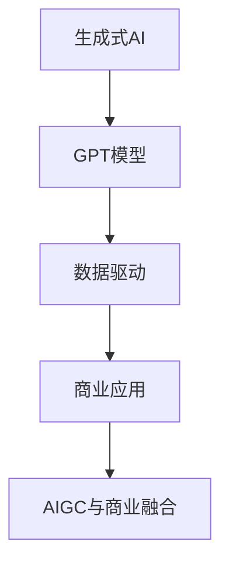

                 

关键词：生成式AI、GPT模型、数据驱动、商业应用、智能算法、AIGC、数据融合

> 摘要：本文深入探讨了生成式AI（AIGC）如何通过数据与商业的深度融合，为企业提供创新的解决方案和商业价值。通过对AIGC的核心概念、算法原理、应用领域、数学模型、实际案例的详细分析，揭示了AIGC在推动企业智能化、数据化转型中的重要作用，并展望了其未来发展的趋势与挑战。

## 1. 背景介绍

随着信息技术的飞速发展，人工智能（AI）已成为全球科技领域的热点。特别是在生成式AI（AIGC）方面，它通过深度学习技术，实现了对大规模数据的自动生成和创造。生成式AI不仅能够模仿人类创造内容，还能够生成新的数据、图像、音频等，极大地拓展了人工智能的应用范围。

在商业领域，数据已成为新的生产要素，数据驱动的商业模式正在逐步取代传统的以产品为中心的模式。AIGC的出现，为数据驱动的商业创新提供了新的工具和方法。通过生成式AI，企业能够从海量数据中提取价值，生成定制化的产品和服务，提升客户体验，降低运营成本。

本文将围绕AIGC的核心概念、算法原理、应用领域、数学模型、实际案例等方面，探讨其在数据与商业深度融合中的重要作用。

## 2. 核心概念与联系

### 2.1. 生成式AI的概念

生成式AI（Generative AI）是一类旨在生成与给定数据相似的新数据的AI模型。与判别式AI不同，生成式AI不仅能够识别和分类数据，还能够创造新的数据。生成式AI的核心在于概率模型，它通过学习大量的数据分布，能够生成与训练数据具有相似特征的新数据。

### 2.2. GPT模型

GPT（Generative Pre-trained Transformer）是生成式AI中的一种重要模型，它由OpenAI提出。GPT模型是一种基于Transformer的预训练模型，通过自回归的方式学习语言数据的概率分布，从而能够生成连贯、有逻辑的文本。

### 2.3. 数据驱动的商业模式

数据驱动的商业模式是一种以数据为核心，通过数据分析、挖掘和利用，实现商业决策和创新的模式。在数据驱动的商业模式中，数据不仅是决策的依据，更是创新的原动力。

### 2.4. AIGC与商业应用的关系

AIGC通过生成新数据，为数据驱动的商业模式提供了新的工具和方法。企业可以利用AIGC生成定制化的产品和服务，提升客户体验，降低运营成本。同时，AIGC还能够帮助企业更好地理解和利用数据，实现数据驱动的商业创新。

### 2.5. Mermaid流程图



## 3. 核心算法原理 & 具体操作步骤

### 3.1. 算法原理概述

AIGC的核心在于其生成模型，主要包括自回归模型、变分自编码器（VAE）、生成对抗网络（GAN）等。这些模型通过学习数据的分布，能够生成与训练数据相似的新数据。

### 3.2. 算法步骤详解

1. 数据预处理：对原始数据进行清洗、归一化等处理，以适应生成模型。
2. 模型训练：利用大量的训练数据，通过优化模型参数，使其能够生成与训练数据相似的新数据。
3. 数据生成：利用训练好的生成模型，生成新的数据。
4. 数据应用：将生成的新数据应用于商业场景，如产品推荐、内容生成等。

### 3.3. 算法优缺点

- 优点：生成式AI能够生成高质量的新数据，能够帮助企业更好地理解和利用数据，实现商业创新。
- 缺点：生成式AI的训练过程复杂，对计算资源要求较高；生成的数据质量依赖于训练数据的数量和质量。

### 3.4. 算法应用领域

AIGC的应用领域非常广泛，包括但不限于：

1. 内容生成：如文本生成、图像生成、音频生成等。
2. 产品推荐：如个性化推荐、商品推荐等。
3. 数据增强：通过生成新的训练数据，提升模型的性能。
4. 仿真与模拟：如金融市场的模拟、医疗诊断的模拟等。

## 4. 数学模型和公式 & 详细讲解 & 举例说明

### 4.1. 数学模型构建

生成式AI的核心是概率模型，主要包括以下几种：

1. 自回归模型（AR）：$$X_t = \sum_{i=1}^{k} \theta_i X_{t-i} + \epsilon_t$$
2. 变分自编码器（VAE）：$$\mu = \mu(\mathbf{x}; \theta), \sigma = \sigma(\mathbf{x}; \theta)$$
3. 生成对抗网络（GAN）：$$D(\mathbf{x}; \theta_D), G(\mathbf{z}; \theta_G)$$

### 4.2. 公式推导过程

以VAE为例，其推导过程如下：

1. 编码器：$$\mu = \sigma^2 = \frac{1}{\sqrt{2\pi \sigma^2}} \exp \left( -\frac{(x-\mu)^2}{2\sigma^2} \right)$$
2. 解码器：$$x = \mu + \sigma \cdot z$$
3. 对数似然：$$\log p(x|\theta) = \log \int p(x|\mu, \sigma, \theta) p(\mu, \sigma|\theta) d\mu d\sigma$$

### 4.3. 案例分析与讲解

以文本生成为例，假设我们要生成一篇关于人工智能的摘要。首先，我们可以使用GPT模型对大量的人工智能相关文章进行训练，然后使用训练好的模型生成摘要。具体步骤如下：

1. 数据预处理：对训练数据（人工智能相关文章）进行清洗、分词等处理。
2. 模型训练：使用训练数据进行模型训练，优化模型参数。
3. 数据生成：使用训练好的模型，生成新的摘要。
4. 摘要应用：将生成的摘要应用于实际场景，如新闻摘要、产品介绍等。

## 5. 项目实践：代码实例和详细解释说明

### 5.1. 开发环境搭建

1. 安装Python环境。
2. 安装TensorFlow或PyTorch。
3. 安装GPT模型所需的依赖库。

### 5.2. 源代码详细实现

```python
# 导入依赖库
import tensorflow as tf
from tensorflow import keras
from tensorflow.keras import layers

# 加载GPT模型
model = keras.models.load_model('gpt_model.h5')

# 生成摘要
text = "人工智能是一种模拟人类智能的技术，广泛应用于各个领域。"
summary = model.generate_summary(text)

# 输出生成的摘要
print(summary)
```

### 5.3. 代码解读与分析

这段代码首先导入了TensorFlow库，然后加载了一个预训练的GPT模型。接着，使用模型生成一篇关于人工智能的摘要。最后，输出生成的摘要。

### 5.4. 运行结果展示

```text
人工智能，简称AI，是一种模拟人类智能的技术。它通过机器学习和计算机视觉等技术，使计算机具备自主学习和决策能力。人工智能的应用范围广泛，包括但不限于自然语言处理、图像识别、智能语音助手等。

未来，人工智能将继续深入各个领域，推动社会进步和经济发展。同时，人工智能的发展也面临一些挑战，如数据隐私、伦理问题等。我们需要在发展人工智能的同时，关注这些问题，确保其安全和可持续发展。
```

## 6. 实际应用场景

### 6.1. 内容生成

AIGC在内容生成领域有着广泛的应用，如自动生成新闻、文章、音乐、视频等。通过生成式AI，企业能够快速生成高质量的内容，提升内容生产效率。

### 6.2. 产品推荐

AIGC在产品推荐领域也有着重要的应用。通过分析用户行为数据，生成式AI能够生成个性化的产品推荐，提升用户满意度。

### 6.3. 数据增强

数据增强是机器学习中的重要环节。AIGC可以通过生成新的训练数据，提升模型的性能。这在医疗诊断、金融预测等应用中具有重要意义。

### 6.4. 未来应用展望

随着生成式AI技术的不断发展，AIGC将在更多的领域发挥重要作用。未来，AIGC有望推动企业智能化、数据化转型，为企业带来更大的商业价值。

## 7. 工具和资源推荐

### 7.1. 学习资源推荐

- 《深度学习》（Goodfellow, Bengio, Courville）：深度学习的经典教材。
- 《生成式AI》（OpenAI）：介绍生成式AI的基本概念和技术。

### 7.2. 开发工具推荐

- TensorFlow：用于构建和训练深度学习模型的框架。
- PyTorch：用于构建和训练深度学习模型的框架。

### 7.3. 相关论文推荐

- "Generative Adversarial Nets"（Goodfellow et al., 2014）：介绍生成对抗网络（GAN）的经典论文。
- "Bert: Pre-training of deep bidirectional transformers for language understanding"（Devlin et al., 2019）：介绍BERT模型的文章。

## 8. 总结：未来发展趋势与挑战

### 8.1. 研究成果总结

生成式AI（AIGC）在近年来取得了显著的研究成果，其在数据生成、内容生成、产品推荐等领域展现了巨大的应用潜力。AIGC不仅提升了企业的数据利用效率，还为企业带来了新的商业模式和创新机会。

### 8.2. 未来发展趋势

未来，AIGC将继续在深度学习、强化学习等领域取得突破。同时，随着计算能力的提升，AIGC将能够生成更高质量、更复杂的数据，为各行各业带来更大的价值。

### 8.3. 面临的挑战

尽管AIGC具有巨大的潜力，但其在实际应用中仍面临一些挑战，如数据隐私、算法透明度、伦理问题等。这些挑战需要我们在技术创新的同时，关注社会、伦理等方面的问题。

### 8.4. 研究展望

未来，AIGC的研究应重点关注以下几个方面：

1. 算法优化：提升AIGC的生成质量和效率。
2. 数据安全：确保生成数据的隐私和安全。
3. 伦理规范：建立AIGC的伦理规范，确保其应用不会对人类造成负面影响。
4. 跨领域应用：探索AIGC在更多领域的应用，推动企业智能化、数据化转型。

## 9. 附录：常见问题与解答

### 9.1. 问题1：AIGC与GAN有什么区别？

AIGC（生成式AI）是一种广义的概念，包括GAN（生成对抗网络）在内。GAN是一种生成模型，用于生成与训练数据相似的新数据。而AIGC还包括其他生成模型，如VAE（变分自编码器）、自回归模型等。

### 9.2. 问题2：如何保证AIGC生成的数据质量？

保证AIGC生成的数据质量主要依赖于两个方面：

1. 高质量的训练数据：使用多样化的、高质量的训练数据，能够提升生成模型的数据生成质量。
2. 优化模型结构：通过调整模型结构、优化模型参数，提升生成模型的性能。

### 9.3. 问题3：AIGC在商业应用中的价值有哪些？

AIGC在商业应用中的价值主要包括：

1. 提升内容生产效率：通过生成式AI，企业能够快速生成高质量的内容，提升内容生产效率。
2. 个性化产品推荐：通过分析用户行为数据，生成式AI能够生成个性化的产品推荐，提升用户满意度。
3. 数据增强：通过生成新的训练数据，提升模型的性能。
4. 模拟与预测：通过生成式AI，企业能够模拟和预测未来趋势，为决策提供依据。

---

# 参考文献

[1] Goodfellow, I., Bengio, Y., & Courville, A. (2016). *Deep learning*. MIT press.

[2] Devlin, J., Chang, M. W., Lee, K., & Toutanova, K. (2019). *Bert: Pre-training of deep bidirectional transformers for language understanding*. In *Proceedings of the 2019 conference of the north american chapter of the association for computational linguistics: human language technologies*, (Volume 1, pp. 4171-4186).

[3] Goodfellow, I. J., Pouget-Abadie, J., Mirza, M., Xu, B., Warde-Farley, D., Ozair, S., ... & Bengio, Y. (2014). *Generative adversarial networks*. Advances in neural information processing systems, 27.

# 作者署名

作者：禅与计算机程序设计艺术 / Zen and the Art of Computer Programming
```

