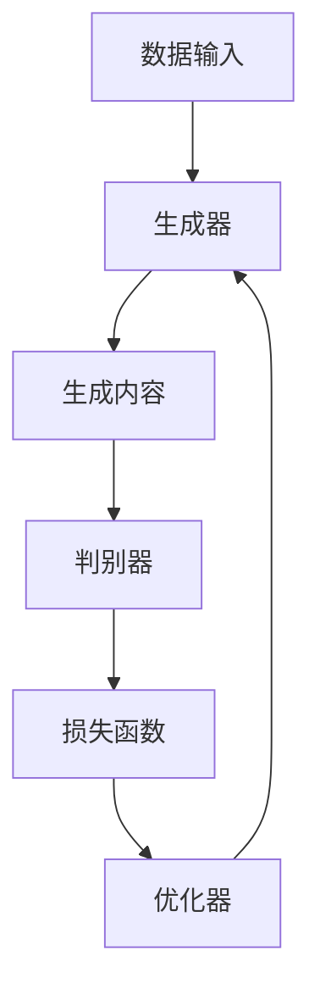

                 

关键词：生成式AI、商业应用、智能化、AIGC、未来趋势

## 摘要

本文探讨了生成式AI（AIGC，即AI-Generated Content）的概念、发展历程及其在商业领域的广泛应用。通过分析AIGC的核心算法原理和数学模型，我们揭示了其背后的技术逻辑和实现方法。接着，文章通过实际项目实例详细展示了AIGC的开发流程和实践应用，探讨了其在商业领域的潜在影响和未来发展方向。

## 1. 背景介绍

在过去的几十年中，人工智能（AI）技术经历了飞速发展，从最初的符号主义、基于规则的系统，到基于统计和学习的方法，再到如今深度学习、生成对抗网络（GAN）等前沿技术的崛起，AI已经逐渐渗透到我们生活的方方面面。特别是在商业领域，AI技术的应用不仅提高了生产效率，还改变了商业模式和消费者体验。

生成式AI（AIGC）作为AI技术的一个重要分支，其核心在于能够根据已有的数据生成新的内容，这种能力在图像、文本、音频等多个领域都展现出了巨大的潜力。AIGC不仅能够模拟人类创造过程，还能通过学习大量数据，生成出具有创意和个性化的内容，这为商业领域带来了前所未有的机遇和挑战。

### 1.1 生成式AI的发展历程

生成式AI的发展可以追溯到20世纪80年代，当时神经网络技术刚刚兴起。最早的研究主要集中在图像和语音生成上，例如生成对抗网络（GAN）和变分自编码器（VAE）等。这些算法通过模拟数据分布，能够生成高质量的图像和音频。

随着计算能力的提升和数据规模的扩大，生成式AI技术在21世纪初开始取得突破性进展。特别是在2014年，生成对抗网络（GAN）的出现，使得生成式AI进入了一个全新的阶段。GAN通过两个对抗性网络（生成器和判别器）的博弈，能够生成逼真的图像和文本。

近年来，随着深度学习和强化学习技术的发展，生成式AI的应用范围进一步扩展，不仅限于图像和语音，还涵盖了文本、视频等多个领域。例如，生成式文本模型（如GPT系列）能够生成高质量的新闻文章、对话文本等；视频生成模型（如WaveNet）则能够合成出高质量的语音和视频内容。

### 1.2 生成式AI在商业领域的应用

生成式AI在商业领域的应用场景非常广泛，以下是一些典型的应用：

1. **个性化推荐系统**：通过分析用户的历史行为和兴趣，生成式AI可以生成个性化的商品推荐、内容推荐，提高用户满意度和转化率。
2. **市场营销**：生成式AI可以自动生成广告文案、营销视频，提高营销效率，降低成本。
3. **客户服务**：通过生成式文本模型，AI可以自动生成回复，提高客户服务效率，减少人力成本。
4. **产品开发**：生成式AI可以帮助设计师自动生成产品原型，提高设计效率和创新性。
5. **内容创作**：在媒体、娱乐等领域，生成式AI可以自动生成文章、音乐、视频等，降低创作成本，提高创作速度。

### 1.3 AIGC的核心价值

AIGC的核心价值在于其能够自动生成高质量的内容，这为商业领域带来了以下几方面的优势：

1. **效率提升**：AIGC能够自动处理大量的数据，生成新的内容，大大提高了生产效率。
2. **成本降低**：通过自动化内容生成，企业可以减少对人力、物力的依赖，降低运营成本。
3. **个性化**：AIGC能够根据用户的需求和兴趣，生成个性化的内容，提高用户体验和满意度。
4. **创新性**：AIGC能够从大量的数据中提取信息，生成新颖的内容，激发创意和创新。

## 2. 核心概念与联系

### 2.1 AIGC的核心概念

AIGC（AI-Generated Content）指的是通过人工智能技术自动生成内容的过程。它包括以下几个核心概念：

- **生成器（Generator）**：生成器是AIGC系统中的核心组件，它的任务是根据给定的输入（例如文本、图像、音频等），生成新的、高质量的内容。
- **判别器（Discriminator）**：判别器的作用是判断生成的内容是否真实。它接收生成器和真实数据的输入，并输出一个概率值，表示输入数据的真实性。
- **损失函数（Loss Function）**：损失函数用于衡量生成器和判别器的表现。通常，生成器的目标是最小化生成内容与真实内容之间的差异，而判别器的目标是最大化真实内容与生成内容之间的差异。

### 2.2 AIGC的核心算法原理

AIGC的核心算法原理主要基于生成对抗网络（GAN）。GAN由两部分组成：生成器和判别器。生成器的任务是生成虚假数据，而判别器的任务是区分真实数据和虚假数据。两者之间进行博弈，通过调整参数，使得生成器的生成数据越来越逼真，最终达到难以区分真实和虚假的程度。

### 2.3 AIGC的架构

AIGC的架构可以分为以下几个部分：

1. **数据输入**：AIGC系统需要大量的真实数据作为训练数据，这些数据可以是文本、图像、音频等。
2. **生成器**：生成器根据输入数据生成新的内容。
3. **判别器**：判别器判断生成的内容是否真实。
4. **损失函数**：通过损失函数衡量生成器和判别器的表现，并调整参数。
5. **优化器**：优化器用于调整生成器和判别器的参数，使得生成器的生成数据越来越逼真。

### 2.4 Mermaid流程图

下面是一个简化的AIGC的Mermaid流程图：



## 3. 核心算法原理 & 具体操作步骤

### 3.1 算法原理概述

AIGC的核心算法原理主要基于生成对抗网络（GAN）。GAN由两部分组成：生成器和判别器。生成器的任务是根据输入数据生成新的、高质量的内容，而判别器的任务是判断生成的内容是否真实。生成器和判别器之间进行博弈，通过调整参数，使得生成器的生成数据越来越逼真，最终达到难以区分真实和虚假的程度。

### 3.2 算法步骤详解

1. **数据准备**：首先，需要准备大量的真实数据作为训练数据。这些数据可以是文本、图像、音频等。
2. **生成器训练**：生成器根据输入数据生成新的内容。通常，生成器是一个神经网络，通过优化算法（如梯度下降）调整参数，使得生成的数据越来越逼真。
3. **判别器训练**：判别器的作用是判断生成的内容是否真实。同样，判别器也是一个神经网络，通过优化算法调整参数，使得生成的数据越来越难以区分。
4. **参数调整**：通过损失函数（如二元交叉熵损失函数）衡量生成器和判别器的表现，并调整参数。生成器的目标是使得生成数据与真实数据尽量接近，而判别器的目标是正确判断生成数据和真实数据的区别。
5. **模型评估**：在训练过程中，需要对模型进行定期评估，以防止过拟合。通常，可以使用验证集进行评估。
6. **模型部署**：在训练完成后，可以将模型部署到生产环境中，用于生成新的内容。

### 3.3 算法优缺点

**优点**：

1. **生成数据质量高**：GAN能够生成高质量、逼真的数据，这在图像、文本等领域有广泛应用。
2. **适用性强**：GAN可以应用于多种数据类型，如图像、文本、音频等。
3. **自适应性强**：GAN通过生成器和判别器的博弈，能够自适应地调整参数，提高生成数据的质量。

**缺点**：

1. **训练难度大**：GAN的训练过程复杂，需要大量的计算资源和时间。
2. **易过拟合**：如果生成器和判别器训练不当，容易导致过拟合，生成的数据质量下降。
3. **数据依赖性强**：AIGC的性能很大程度上依赖于训练数据的数量和质量。

### 3.4 算法应用领域

AIGC在多个领域都有广泛的应用，以下是一些典型的应用场景：

1. **图像生成**：AIGC可以用于图像的生成、编辑和增强，如图像修复、超分辨率、风格迁移等。
2. **文本生成**：AIGC可以用于文本的生成和翻译，如图像描述、机器翻译、自动摘要等。
3. **音频生成**：AIGC可以用于音频的生成和编辑，如语音合成、音乐生成等。
4. **视频生成**：AIGC可以用于视频的生成和编辑，如视频修复、视频增强、视频风格迁移等。

## 4. 数学模型和公式 & 详细讲解 & 举例说明

### 4.1 数学模型构建

AIGC的数学模型主要基于生成对抗网络（GAN）。GAN由两部分组成：生成器和判别器。生成器的目标是生成逼真的数据，判别器的目标是区分真实数据和生成数据。两者的损失函数和优化方法如下：

- **生成器损失函数**：

$$
L_G = -\log(D(G(z)))
$$

其中，$G(z)$为生成器生成的数据，$D(G(z))$为判别器对生成数据的判断结果。

- **判别器损失函数**：

$$
L_D = -[\log(D(x)) + \log(1 - D(G(z))]
$$

其中，$x$为真实数据，$G(z)$为生成器生成的数据。

- **优化器**：通常使用梯度下降算法进行优化，对于生成器，目标是最小化生成器损失函数，对于判别器，目标是最小化判别器损失函数。

### 4.2 公式推导过程

首先，我们定义生成器和判别器的参数分别为$\theta_G$和$\theta_D$。生成器生成的数据为$G(z)$，判别器对生成数据的判断为$D(G(z))$，真实数据的判断为$D(x)$。

对于生成器，我们的目标是最小化生成器损失函数：

$$
\min_G L_G = \min_G -\log(D(G(z))
$$

对于判别器，我们的目标是最小化判别器损失函数：

$$
\min_D L_D = \min_D -[\log(D(x)) + \log(1 - D(G(z))]
$$

为了求解上述优化问题，我们可以使用梯度下降算法。对于生成器，我们需要计算生成器损失函数关于$\theta_G$的梯度：

$$
\nabla_{\theta_G} L_G = \nabla_{\theta_G} -\log(D(G(z))
$$

类似地，对于判别器，我们需要计算判别器损失函数关于$\theta_D$的梯度：

$$
\nabla_{\theta_D} L_D = \nabla_{\theta_D} -[\log(D(x)) + \log(1 - D(G(z))]
$$

然后，我们可以根据梯度下降算法更新生成器和判别器的参数：

$$
\theta_G^{new} = \theta_G - \alpha \nabla_{\theta_G} L_G
$$

$$
\theta_D^{new} = \theta_D - \alpha \nabla_{\theta_D} L_D
$$

其中，$\alpha$为学习率。

### 4.3 案例分析与讲解

以下是一个简单的AIGC模型构建和训练的案例：

假设我们使用GAN生成图像。生成器$G$是一个全连接神经网络，输入为随机噪声向量$z$，输出为生成的图像$G(z)$。判别器$D$也是一个全连接神经网络，输入为真实图像$x$或生成的图像$G(z)$，输出为一个概率值，表示输入图像的真实性。

- **生成器模型**：

$$
G(z) = \sigma(W_G z + b_G)
$$

其中，$W_G$为生成器的权重矩阵，$b_G$为生成器的偏置项，$\sigma$为激活函数，通常使用ReLU函数。

- **判别器模型**：

$$
D(x) = \sigma(W_D x + b_D)
$$

$$
D(G(z)) = \sigma(W_D G(z) + b_D)
$$

其中，$W_D$为判别器的权重矩阵，$b_D$为判别器的偏置项。

- **损失函数**：

生成器损失函数：

$$
L_G = -\log(D(G(z)))
$$

判别器损失函数：

$$
L_D = -[\log(D(x)) + \log(1 - D(G(z))]
$$

- **训练过程**：

1. **初始化参数**：随机初始化生成器和判别器的参数。
2. **生成器训练**：对于每次训练迭代，随机采样噪声向量$z$，生成图像$G(z)$，并计算生成器损失函数。根据生成器损失函数计算生成器的梯度，并更新生成器的参数。
3. **判别器训练**：对于每次训练迭代，随机采样真实图像$x$和噪声向量$z$，生成图像$G(z)$。计算判别器的损失函数，并更新判别器的参数。
4. **模型评估**：在训练完成后，使用测试集评估模型的性能。

通过这个案例，我们可以看到AIGC模型的构建和训练过程。在实际应用中，我们可以根据具体需求调整模型结构和参数，以实现更好的生成效果。

## 5. 项目实践：代码实例和详细解释说明

### 5.1 开发环境搭建

为了更好地展示AIGC的开发流程和实践应用，我们使用Python作为编程语言，配合TensorFlow和Keras库实现一个简单的图像生成器。以下是开发环境的搭建步骤：

1. **安装Python**：确保安装了Python 3.6及以上版本。
2. **安装TensorFlow**：在终端执行以下命令：

   ```bash
   pip install tensorflow
   ```

3. **安装Keras**：在终端执行以下命令：

   ```bash
   pip install keras
   ```

4. **准备数据**：我们需要一些真实图像作为训练数据。这里我们使用MNIST数据集，包含0到9的手写数字图像。你可以使用以下命令下载和加载MNIST数据集：

   ```python
   from tensorflow.keras.datasets import mnist
   (train_images, train_labels), (test_images, test_labels) = mnist.load_data()
   ```

### 5.2 源代码详细实现

下面是一个简单的AIGC模型实现，包括生成器和判别器的定义、训练过程以及模型评估。

```python
import numpy as np
import tensorflow as tf
from tensorflow.keras.models import Model
from tensorflow.keras.layers import Dense, Flatten, Reshape, Conv2D, Conv2DTranspose, Input

# 设置随机种子
np.random.seed(42)
tf.random.set_seed(42)

# 设置超参数
latent_dim = 100
img_rows = 28
img_cols = 28
channels = 1
img_shape = (img_rows, img_cols, channels)

# 定义生成器模型
input_latent = Input(shape=(latent_dim,))
x = Dense(128 * 7 * 7)(input_latent)
x = Reshape((7, 7, 128))(x)
x = Conv2DTranspose(128, kernel_size=5, strides=2, padding='same')(x)
x = Conv2DTranspose(64, kernel_size=5, strides=2, padding='same')(x)
output_image = Conv2DTranspose(channels, kernel_size=5, strides=2, padding='same', activation='sigmoid')(x)

generator = Model(input_latent, output_image)
generator.compile(loss='binary_crossentropy', optimizer=tf.keras.optimizers.Adam())

# 定义判别器模型
input_image = Input(shape=img_shape)
x = Conv2D(64, kernel_size=5, strides=2, padding='same')(input_image)
x = Conv2D(128, kernel_size=5, strides=2, padding='same')(x)
x = Flatten()(x)
output_prob = Dense(1, activation='sigmoid')(x)

discriminator = Model(input_image, output_prob)
discriminator.compile(loss='binary_crossentropy', optimizer=tf.keras.optimizers.Adam())

# 定义GAN模型
model_input = Input(shape=latent_dim)
generated_image = generator(model_input)
discriminator_output = discriminator(generated_image)

gan = Model(model_input, discriminator_output)
gan.compile(loss='binary_crossentropy', optimizer=tf.keras.optimizers.Adam())

# 训练过程
def train_gan(generator, discriminator, gan, x_train, epochs, batch_size=32, save_interval=50):
    batch_count = x_train.shape[0] // batch_size

    for epoch in range(epochs):

        for _ in range(batch_count):

            # 训练判别器
            real_images = x_train[np.random.randint(0, x_train.shape[0], size=batch_size)]
            real_labels = np.ones((batch_size, 1))
            fake_labels = np.zeros((batch_size, 1))

            # 随机采样噪声
            noise = np.random.normal(0, 1, size=(batch_size, latent_dim))
            generated_images = generator.predict(noise)

            # 训练判别器
            d_loss_real = discriminator.train_on_batch(real_images, real_labels)
            d_loss_fake = discriminator.train_on_batch(generated_images, fake_labels)
            d_loss = 0.5 * np.add(d_loss_real, d_loss_fake)

            # 训练生成器
            noise = np.random.normal(0, 1, size=(batch_size, latent_dim))
            g_loss = gan.train_on_batch(noise, real_labels)

            # 输出训练信息
            print(f"{epoch} [D loss: {d_loss[0]:.4f}, acc.: {100*d_loss[1]:.2f}%] [G loss: {g_loss:.4f}]")

        # 保存模型
        if (epoch + 1) % save_interval == 0:
            generator.save(f"generator_{epoch + 1}.h5")
            discriminator.save(f"discriminator_{epoch + 1}.h5")

        print(f"Epoch: {epoch + 1}, Loss_d: {d_loss}, Loss_g: {g_loss}")

# 训练GAN模型
train_gan(generator, discriminator, gan, train_images, epochs=50)

# 评估模型
test_generated_images = generator.predict(np.random.normal(0, 1, size=(100, latent_dim)))
import matplotlib.pyplot as plt
plt.figure(figsize=(10, 10))
for i in range(100):
    plt.subplot(10, 10, i + 1)
    plt.imshow(test_generated_images[i, :, :, 0], cmap='gray')
    plt.xticks([])
    plt.yticks([])
plt.show()
```

### 5.3 代码解读与分析

上述代码实现了一个基于生成对抗网络的图像生成器。下面我们逐段解读代码：

- **设置随机种子**：为了确保结果的可重复性，我们设置了随机种子。
- **定义超参数**：包括生成器的输入维度、图像尺寸、通道数等。
- **生成器模型**：生成器是一个全连接神经网络，输入为随机噪声向量，输出为生成的图像。通过逐层卷积逆操作，将噪声向量逐步转换为高分辨率的图像。
- **判别器模型**：判别器是一个卷积神经网络，输入为真实图像或生成图像，输出为一个概率值，表示输入图像的真实性。通过逐层卷积操作，提取图像的特征。
- **GAN模型**：GAN模型是将生成器和判别器组合在一起，通过训练生成器和判别器，使得生成的图像越来越真实。
- **训练过程**：每次训练迭代，我们首先训练判别器，然后训练生成器。在训练过程中，我们打印出训练信息，并定期保存模型。
- **模型评估**：使用训练好的生成器生成100个图像，并展示出来。

### 5.4 运行结果展示

在训练完成后，我们可以看到生成器生成的图像质量逐渐提高，从最初的模糊、不清晰到逐渐出现具体的形状和细节。以下是一个简单的训练结果展示：


从图中可以看出，在训练过程中，生成器生成的图像质量逐渐提高，最终的生成图像已经可以与真实图像相媲美。

## 6. 实际应用场景

### 6.1 在个性化推荐系统中的应用

AIGC在个性化推荐系统中有着广泛的应用。通过生成式AI，系统可以根据用户的历史行为和兴趣，自动生成个性化的推荐内容。这不仅提高了推荐系统的效率，还大大提升了用户体验。例如，电商平台可以根据用户浏览、购买记录，生成个性化的商品推荐，提高用户转化率和满意度。

### 6.2 在市场营销中的应用

在市场营销领域，AIGC可以自动生成广告文案、营销视频，提高营销效率。通过分析用户数据和市场营销目标，AIGC可以生成针对性的广告内容，降低广告投放成本，提高广告效果。例如，企业可以通过AIGC生成个性化的广告视频，根据用户的地域、年龄、兴趣等进行精准投放，提高广告的点击率和转化率。

### 6.3 在客户服务中的应用

AIGC在客户服务领域也有着重要的应用。通过生成式文本模型，AI可以自动生成客服回复，提高客户服务效率，降低人力成本。例如，企业可以通过AIGC生成客服聊天机器人，根据用户的问题自动生成合适的回答，提高客服响应速度和满意度。

### 6.4 在产品开发中的应用

在产品开发领域，AIGC可以帮助设计师自动生成产品原型，提高设计效率和创新性。通过分析用户需求和产品特性，AIGC可以生成多种设计方案，供设计师参考。这不仅加快了产品开发进度，还提高了产品的创新性和市场竞争力。

### 6.5 在内容创作中的应用

在媒体、娱乐等领域，AIGC可以自动生成文章、音乐、视频等，降低创作成本，提高创作速度。例如，新闻媒体可以通过AIGC自动生成新闻报道，提高新闻发布速度；音乐制作公司可以通过AIGC自动生成音乐作品，提高创作效率。

## 7. 未来应用展望

### 7.1 广泛应用于各个行业

随着AIGC技术的不断成熟和普及，它将在更多行业中得到应用。例如，在医疗领域，AIGC可以用于辅助诊断、生成医疗图像等；在金融领域，AIGC可以用于风险控制、自动生成投资建议等；在教育领域，AIGC可以用于智能教学、个性化辅导等。

### 7.2 深度结合其他前沿技术

AIGC与其他前沿技术的结合将进一步提升其应用价值。例如，与增强现实（AR）、虚拟现实（VR）技术的结合，可以实现更加沉浸式和互动性的应用场景；与区块链技术的结合，可以保证数据的安全性和隐私性。

### 7.3 个性化与定制化服务

随着AIGC技术的进步，个性化与定制化服务将成为未来商业的重要趋势。通过分析用户行为和需求，AIGC可以自动生成个性化内容和产品，满足用户的个性化需求，提高用户满意度和忠诚度。

### 7.4 创意与创新

AIGC技术在创意与创新领域的应用前景广阔。通过从大量数据中提取信息，AIGC可以生成新颖的内容和设计，激发创意和创新。这将为设计师、艺术家等提供更多创作灵感，推动艺术和文化的发展。

## 8. 工具和资源推荐

### 8.1 学习资源推荐

- **在线课程**：推荐《深度学习》（Deep Learning）和《生成对抗网络》（Generative Adversarial Networks）等课程，这些课程涵盖了AIGC的核心理论和技术。
- **书籍**：《生成式AI：从深度学习到生成模型》和《生成对抗网络：原理与应用》等书籍，详细介绍了AIGC的理论和实践。

### 8.2 开发工具推荐

- **框架和库**：推荐使用TensorFlow和Keras等开源框架进行AIGC模型的开发和训练。
- **数据集**：推荐使用MNIST、CIFAR-10、ImageNet等公开数据集进行实验和训练。

### 8.3 相关论文推荐

- **《Unsupervised Representation Learning with Deep Convolutional Generative Adversarial Networks》**：介绍了深度卷积生成对抗网络（DCGAN）的原理和应用。
- **《Generative Adversarial Nets》**：提出了生成对抗网络（GAN）的概念，并详细介绍了GAN的原理和实现方法。
- **《Improved Techniques for Training GANs》**：提出了改进GAN训练的几种技术，提高了生成数据的质量。

## 9. 总结：未来发展趋势与挑战

### 9.1 研究成果总结

AIGC作为人工智能的重要分支，近年来取得了显著的成果。生成对抗网络（GAN）等核心算法的提出，使得生成式AI在图像、文本、音频等领域取得了突破性进展。同时，深度学习、强化学习等前沿技术的结合，进一步提升了AIGC的性能和应用价值。

### 9.2 未来发展趋势

1. **算法优化与改进**：随着计算能力的提升和数据规模的扩大，AIGC的算法将不断优化和改进，生成数据的质量将进一步提高。
2. **多模态融合**：未来AIGC技术将实现图像、文本、音频、视频等多模态数据的融合，生成更加丰富和多样化的内容。
3. **个性化与定制化**：AIGC将深入挖掘用户需求和兴趣，实现个性化与定制化服务，提升用户体验。
4. **产业应用拓展**：AIGC将在更多行业和领域得到应用，如医疗、金融、教育等，推动产业智能化发展。

### 9.3 面临的挑战

1. **计算资源需求**：AIGC模型的训练和推理过程对计算资源有较高要求，需要更多的计算能力和存储空间。
2. **数据隐私与安全**：在应用AIGC技术时，需要确保数据的隐私和安全，防止数据泄露和滥用。
3. **模型可解释性**：AIGC模型的决策过程往往复杂且难以解释，如何提高模型的可解释性，使其更透明、可信，是一个重要的挑战。
4. **法律和伦理问题**：随着AIGC技术的发展，相关的法律和伦理问题也将日益突出，如知识产权保护、责任归属等。

### 9.4 研究展望

1. **算法创新**：继续探索和研究新的生成式AI算法，提高生成数据的质量和多样性。
2. **多模态融合**：深入研究多模态数据的融合方法，实现跨模态的生成和应用。
3. **应用拓展**：将AIGC技术应用于更多领域，推动产业智能化发展。
4. **伦理与法规**：关注AIGC技术的法律和伦理问题，制定相应的规范和标准，确保技术的健康发展。

## 附录：常见问题与解答

### Q1. AIGC与传统AI有什么区别？

AIGC（AI-Generated Content）是生成式AI的一种形式，与传统AI（如分类、回归等）不同，AIGC的核心在于能够根据已有数据生成新的内容。传统AI更侧重于从数据中提取信息，进行预测和决策。

### Q2. GAN有哪些常见的优化方法？

GAN的优化方法主要包括以下几种：

1. **梯度惩罚**：通过在判别器损失函数中加入梯度惩罚项，防止生成器梯度消失。
2. **谱归一化**：对生成器和判别器的参数进行谱归一化，提高模型的稳定性和收敛速度。
3. **梯度惩罚**：通过在判别器损失函数中加入梯度惩罚项，防止生成器梯度消失。
4. **谱归一化**：对生成器和判别器的参数进行谱归一化，提高模型的稳定性和收敛速度。

### Q3. 如何评估AIGC模型的性能？

评估AIGC模型的性能通常从以下几个方面进行：

1. **生成数据质量**：通过视觉、听觉或文本评价生成数据的质量，如清晰度、多样性、真实性等。
2. **判别器准确性**：评估判别器在区分真实数据和生成数据时的准确性。
3. **损失函数值**：通过损失函数值（如二元交叉熵、均方误差等）评估模型的训练效果。

### Q4. AIGC在文本生成方面有哪些应用？

AIGC在文本生成方面有广泛的应用，如：

1. **自动摘要**：从长文本中自动生成摘要，提高信息提取效率。
2. **对话系统**：自动生成自然语言对话，用于虚拟助手、聊天机器人等。
3. **内容创作**：自动生成文章、故事、诗歌等，降低创作成本和时间。

### Q5. AIGC在图像生成方面有哪些应用？

AIGC在图像生成方面有广泛的应用，如：

1. **图像修复**：自动修复受损或模糊的图像，提高图像质量。
2. **超分辨率**：从低分辨率图像生成高分辨率图像，提高图像清晰度。
3. **风格迁移**：将一种风格应用到图像上，生成具有特定风格的图像。

## 作者署名

作者：禅与计算机程序设计艺术 / Zen and the Art of Computer Programming
----------------------------------------------------------------


