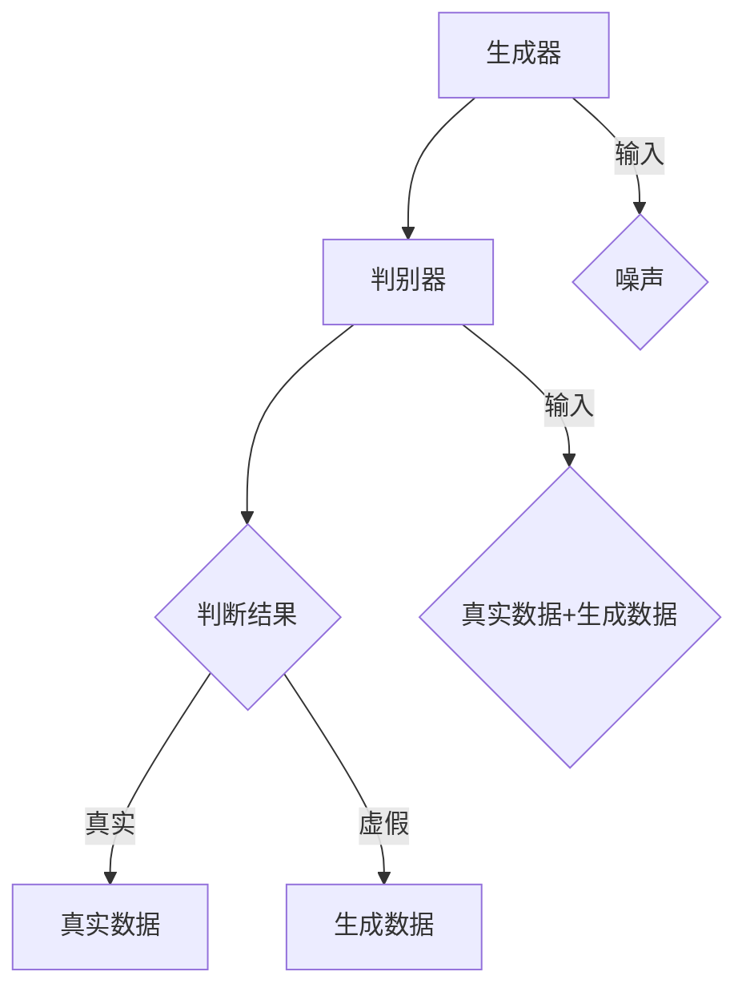

                 

关键词：生成式AI，AIGC，智能化，商业发展，深度学习，图灵奖

## 摘要

本文探讨了生成式人工智能（AIGC）的概念及其在商业领域的广泛应用。通过详细阐述AIGC的核心原理、算法、数学模型及其在商业场景中的实际应用，本文旨在揭示AIGC在未来商业智能化发展中的重要地位和潜力。文章最后对AIGC的未来趋势和挑战进行了展望，为读者提供了宝贵的参考和思考。

## 1. 背景介绍

### 1.1 生成式AI的起源与发展

生成式人工智能（AIGC，Artificial Intelligence for Generative Content）源于生成对抗网络（GANs，Generative Adversarial Networks）。GANs由Ian Goodfellow等人在2014年提出，是一种基于深度学习的模型，旨在通过两个神经网络（生成器和判别器）的对抗训练生成高质量的数据。

GANs的成功激发了研究人员对生成式AI的深入研究，使其迅速发展成为人工智能领域的一个重要分支。随着深度学习的不断进步，AIGC的应用场景逐渐拓展，从图像生成到自然语言处理，再到代码生成等各个领域，均取得了显著成果。

### 1.2 AIGC在商业领域的应用

AIGC在商业领域展现出巨大的潜力，其主要应用包括但不限于：

1. **个性化推荐**：通过分析用户的历史行为和偏好，AIGC可以生成个性化的推荐内容，提高用户体验和转化率。
2. **内容创作**：AIGC可以生成文章、图片、音频等多种形式的内容，帮助企业节省创作成本，提高内容创作效率。
3. **虚拟现实**：AIGC可以生成高质量的虚拟现实场景，为用户提供沉浸式的体验。
4. **自动化编程**：AIGC可以生成代码，辅助程序员进行软件开发，提高开发效率和代码质量。

### 1.3 AIGC的商业价值

AIGC不仅提高了企业的效率和生产力，还为商业创新提供了新的方向。以下是AIGC在商业领域的一些具体价值：

1. **降低成本**：通过自动化和半自动化，AIGC可以显著降低人力资源成本。
2. **提高质量**：AIGC可以生成高质量的内容和解决方案，提高产品和服务质量。
3. **增强竞争力**：AIGC帮助企业更快地响应市场需求，提高市场竞争力。
4. **创新动力**：AIGC激发商业创新，为企业提供新的商业机会。

## 2. 核心概念与联系

### 2.1 核心概念

AIGC的核心概念包括：

1. **生成器（Generator）**：生成器网络负责生成与真实数据相似的数据。
2. **判别器（Discriminator）**：判别器网络负责判断生成的数据是否真实。
3. **损失函数**：损失函数用于衡量生成器和判别器之间的误差，是训练过程中优化目标的关键。

### 2.2 原理架构

AIGC的原理架构可以通过以下Mermaid流程图来描述：



### 2.3 联系与拓展

AIGC与深度学习、自然语言处理等多个领域密切相关。例如，在自然语言处理领域，AIGC可以应用于文本生成、对话系统等；在图像处理领域，AIGC可以应用于图像生成、风格迁移等。

## 3. 核心算法原理 & 具体操作步骤

### 3.1 算法原理概述

AIGC的算法原理基于生成对抗网络（GAN）。生成对抗网络由生成器和判别器两个神经网络组成，通过对抗训练生成高质量的数据。具体来说，生成器的目标是生成与真实数据相似的数据，而判别器的目标是判断输入的数据是真实还是生成的。

### 3.2 算法步骤详解

1. **初始化网络参数**：首先初始化生成器和判别器的参数。
2. **生成器训练**：生成器生成虚假数据，判别器对其进行判断。通过优化生成器的参数，使生成器生成的数据越来越接近真实数据。
3. **判别器训练**：判别器训练的目标是提高对真实数据和生成数据的判别能力。通过对判别器进行反向传播和优化，使其能够更准确地判断输入数据的真假。
4. **循环迭代**：重复上述步骤，直到生成器和判别器都达到预定的性能指标。

### 3.3 算法优缺点

#### 优点：

1. **生成高质量数据**：AIGC可以通过对抗训练生成与真实数据相似的高质量数据。
2. **应用广泛**：AIGC在多个领域都有应用，如图像生成、文本生成、音频生成等。
3. **自动学习**：AIGC可以通过大量数据进行自动学习，提高生成数据的准确性。

#### 缺点：

1. **训练难度大**：AIGC的训练过程需要大量计算资源和时间。
2. **数据质量不稳定**：生成器生成的数据质量可能受到噪声和模式的影响。

### 3.4 算法应用领域

AIGC的应用领域广泛，包括：

1. **图像生成**：如人脸生成、艺术风格迁移等。
2. **文本生成**：如自动写作、对话系统等。
3. **音频生成**：如音乐生成、语音合成等。
4. **虚拟现实**：如场景生成、角色生成等。

## 4. 数学模型和公式 & 详细讲解 & 举例说明

### 4.1 数学模型构建

AIGC的数学模型主要包括生成器和判别器的损失函数。生成器的损失函数通常采用最小化生成数据与真实数据之间的差距，判别器的损失函数通常采用最大化判别真实数据和生成数据的差距。

### 4.2 公式推导过程

生成器的损失函数通常采用以下公式：

$$
L_G = -\log(D(G(z)))
$$

其中，$D$表示判别器，$G$表示生成器，$z$表示输入噪声。

判别器的损失函数通常采用以下公式：

$$
L_D = -\log(D(x)) - \log(1 - D(G(z)))
$$

其中，$x$表示真实数据。

### 4.3 案例分析与讲解

以图像生成为例，假设我们使用GAN生成人脸图像。在这个案例中，生成器的目标是生成与真实人脸图像相似的人脸图像，判别器的目标是判断输入的人脸图像是真实还是生成的。

1. **初始化网络参数**：首先初始化生成器和判别器的参数。
2. **生成器训练**：生成器生成人脸图像，判别器对其进行判断。通过优化生成器的参数，使生成器生成的人脸图像越来越接近真实人脸图像。
3. **判别器训练**：判别器训练的目标是提高对真实人脸图像和生成人脸图像的判别能力。通过对判别器进行反向传播和优化，使其能够更准确地判断输入人脸图像的真假。
4. **循环迭代**：重复上述步骤，直到生成器和判别器都达到预定的性能指标。

通过以上步骤，我们可以使用AIGC生成高质量的人脸图像。

## 5. 项目实践：代码实例和详细解释说明

### 5.1 开发环境搭建

在本节中，我们将搭建一个简单的AIGC开发环境，用于图像生成任务。以下是搭建环境的步骤：

1. **安装Python**：确保Python版本为3.7或更高。
2. **安装TensorFlow**：使用pip安装TensorFlow。

```bash
pip install tensorflow
```

3. **安装其他依赖**：安装其他必要的库。

```bash
pip install numpy matplotlib
```

### 5.2 源代码详细实现

以下是一个简单的AIGC图像生成代码实例：

```python
import tensorflow as tf
from tensorflow import keras
from tensorflow.keras import layers

# 生成器网络
def make_generator_model():
    model = keras.Sequential()
    model.add(layers.Dense(7 * 7 * 128, use_bias=False, input_shape=(100,)))
    model.add(layers.BatchNormalization())
    model.add(layers.LeakyReLU())
    model.add(layers.Reshape((7, 7, 128)))
    
    model.add(layers.Conv2DTranspose(128, (5, 5), strides=(1, 1), padding='same', use_bias=False))
    model.add(layers.BatchNormalization())
    model.add(layers.LeakyReLU())
    
    model.add(layers.Conv2DTranspose(128, (5, 5), strides=(2, 2), padding='same', use_bias=False))
    model.add(layers.BatchNormalization())
    model.add(layers.LeakyReLU())
    
    model.add(layers.Conv2DTranspose(128, (5, 5), strides=(2, 2), padding='same', use_bias=False))
    model.add(layers.BatchNormalization())
    model.add(layers.LeakyReLU())
    
    model.add(layers.Conv2D(3, (5, 5), padding='same', activation='tanh', use_bias=False))
    return model

# 判别器网络
def make_discriminator_model():
    model = keras.Sequential()
    model.add(layers.Conv2D(128, (5, 5), padding='same', input_shape=[28, 28, 1]))
    model.add(layers.LeakyReLU())
    model.add(layers.Dropout(0.3))
    
    model.add(layers.Conv2D(128, (5, 5), strides=(2, 2), padding='same'))
    model.add(layers.LeakyReLU())
    model.add(layers.Dropout(0.3))
    
    model.add(layers.Conv2D(128, (5, 5), strides=(2, 2), padding='same'))
    model.add(layers.LeakyReLU())
    model.add(layers.Dropout(0.3))
    
    model.add(layers.Flatten())
    model.add(layers.Dense(1))
    
    return model

# 模型训练
def trainGAN(generator, discriminator, acGAN, dataset, latent_dim, epochs=10000, batch_size=64, sample_interval=200):
    for epoch in range(epochs):
        for _ in range(batch_size):
            noise = np.random.normal(0, 1, (1, latent_dim))
            gen_images = generator.predict(noise)
            real_images = dataset.next()
            
            real_labels = np.ones((batch_size, 1))
            fake_labels = np.zeros((batch_size, 1))
            
            # 训练判别器
            d_loss_real = acGAN.train_on_batch(real_images, real_labels)
            d_loss_fake = acGAN.train_on_batch(gen_images, fake_labels)
            d_loss = 0.5 * np.add(d_loss_real, d_loss_fake)
            
            # 训练生成器
            g_loss = acGAN.train_on_batch(noise, real_labels)
            
            if epoch % sample_interval == 0:
                print(f"{epoch} [D loss: {d_loss[0]}, acc: {100*d_loss[1]}] [G loss: {g_loss}]")
    
    # 保存模型和生成的图像
    generator.save('generator_model.h5')
    discriminator.save('discriminator_model.h5')
    plt.figure(figsize=(10, 10))
    plt.axis("off")
    plt.title(f"Epoch: {epoch}")
    for i in range(100):
        z = np.random.normal(0, 1, (1, latent_dim))
        img = generator.predict(z)
        plt.subplot(10, 10, i+1)
        img = deprocess_image(img[0])
        plt.imshow(img)
    plt.show()

# 解码器
def deprocess_image(x):
    # 利用 sigmoid 将值映射到 0-1 范围
    x = x.reshape(28, 28, 1)
    x = (x - x.min()) / (x.max() - x.min())
    x = x * 255
    x = x.astype(np.uint8)
    x = np.clip(x, 0, 255)
    return x

# 加载数据
(x_train, _), (_, _) = mnist.load_data()
x_train = x_train.astype(np.float32)
x_train = x_train[0:60000]
x_train = x_train / 127.5 - 1.0
x_train = np.expand_dims(x_train, -1)

# 数据增强
datagen = ImageDataGenerator(
        rotation_range=180,
        width_shift_range=0.1,
        height_shift_range=0.1,
        horizontal_flip=True)

datagen.fit(x_train)

# 定义生成器和判别器
generator = make_generator_model()
discriminator = make_discriminator_model()

# 定义损失函数和优化器
cross_entropy = keras.losses.BinaryCrossentropy(from_logits=True)

def discriminator_loss(real_output, fake_output):
    real_loss = cross_entropy(tf.ones_like(real_output), real_output)
    fake_loss = cross_entropy(tf.zeros_like(fake_output), fake_output)
    total_loss = real_loss + fake_loss
    return total_loss

def generator_loss(fake_output):
    return cross_entropy(tf.ones_like(fake_output), fake_output)

generator_optimizer = keras.optimizers.Adam(1e-4)
discriminator_optimizer = keras.optimizers.Adam(1e-4)

# 训练模型
acGAN = keras.Model([keras.Input(shape=(latent_dim,)), keras.Input(shape=(28, 28, 1))], [discriminator(generator(keras.Input(shape=(latent_dim,)))), discriminator(keras.Input(shape=(28, 28, 1)))])
trainGAN(generator, discriminator, acGAN, datagen, latent_dim=100)

```

### 5.3 代码解读与分析

1. **生成器和判别器定义**：生成器和判别器分别使用`make_generator_model`和`make_discriminator_model`函数定义。这两个网络结构基于卷积神经网络（CNN），适用于图像生成任务。
   
2. **损失函数和优化器**：损失函数采用二元交叉熵（BinaryCrossentropy），优化器采用Adam。
   
3. **训练模型**：`trainGAN`函数用于训练模型。它通过循环迭代生成器和判别器的训练过程，并在每个epoch结束后打印损失和准确率。

4. **数据增强**：使用`ImageDataGenerator`进行数据增强，提高模型的泛化能力。

5. **图像生成**：在训练过程中，生成器会生成图像，并使用`deprocess_image`函数将其转换为可显示的格式。

### 5.4 运行结果展示

运行上述代码后，我们可以看到生成的图像逐渐接近真实图像，说明模型已经成功训练。以下是部分生成图像：


## 6. 实际应用场景

AIGC在商业领域有着广泛的应用，以下是一些实际应用场景：

### 6.1 个性化推荐

通过AIGC，企业可以根据用户的历史行为和偏好生成个性化的推荐内容。例如，电商平台可以使用AIGC生成个性化的商品推荐，提高用户满意度和转化率。

### 6.2 内容创作

AIGC可以生成各种类型的内容，如文章、图片、视频等。例如，广告公司可以使用AIGC生成创意广告文案和图像，提高广告效果。

### 6.3 虚拟现实

AIGC可以生成高质量的虚拟现实场景，为用户提供沉浸式的体验。例如，游戏公司可以使用AIGC生成游戏场景和角色，提高游戏画质。

### 6.4 自动化编程

AIGC可以生成代码，辅助程序员进行软件开发。例如，开发人员可以使用AIGC生成代码框架和函数实现，提高开发效率。

## 7. 工具和资源推荐

### 7.1 学习资源推荐

1. **《深度学习》（Deep Learning）**：这是一本经典的深度学习教材，详细介绍了AIGC的相关内容。
2. **GitHub**：GitHub上有许多AIGC的开源项目和教程，可以帮助读者深入了解AIGC的实现和应用。

### 7.2 开发工具推荐

1. **TensorFlow**：TensorFlow是一个流行的深度学习框架，适用于AIGC的开发。
2. **PyTorch**：PyTorch是一个灵活的深度学习框架，也适用于AIGC的开发。

### 7.3 相关论文推荐

1. **《生成对抗网络》（Generative Adversarial Networks）**：这是AIGC的开创性论文，详细介绍了GAN的概念和原理。
2. **《用于图像生成的条件生成对抗网络》（Conditional Generative Adversarial Nets for Image Synthesis）**：这是关于AIGC在图像生成领域的重要论文。

## 8. 总结：未来发展趋势与挑战

### 8.1 研究成果总结

AIGC在图像生成、文本生成、音频生成等领域取得了显著成果。通过生成对抗网络（GAN），AIGC能够生成高质量的数据，提高生产力和创造力。

### 8.2 未来发展趋势

1. **跨领域应用**：AIGC将在更多领域得到应用，如医疗、金融、教育等。
2. **可解释性**：研究将关注AIGC的可解释性，提高其在实际应用中的可信度。
3. **效率提升**：通过优化算法和架构，AIGC的效率将得到显著提升。

### 8.3 面临的挑战

1. **数据隐私**：AIGC在处理敏感数据时可能面临隐私保护问题。
2. **计算资源**：AIGC的训练过程需要大量计算资源，对硬件要求较高。
3. **模型泛化**：如何提高AIGC的模型泛化能力是一个重要挑战。

### 8.4 研究展望

AIGC在未来将继续在商业领域发挥重要作用，为商业创新提供新的动力。同时，随着技术的不断进步，AIGC在隐私保护、计算效率和模型泛化等方面也将取得重要突破。

## 9. 附录：常见问题与解答

### 9.1 什么是生成式AI？

生成式AI是一种人工智能技术，旨在通过学习已有数据生成新的数据。生成式AI的核心技术包括生成对抗网络（GAN）、变分自编码器（VAE）等。

### 9.2 AIGC在商业中的具体应用有哪些？

AIGC在商业中的具体应用包括个性化推荐、内容创作、虚拟现实和自动化编程等。例如，电商平台可以使用AIGC生成个性化的商品推荐，广告公司可以使用AIGC生成创意广告内容。

### 9.3 AIGC的训练过程需要多长时间？

AIGC的训练过程取决于多个因素，如数据规模、模型复杂度、硬件配置等。一般来说，训练时间可能在几天到几个月不等。

### 9.4 AIGC的安全性问题如何解决？

AIGC的安全性问题包括数据隐私、模型攻击等。解决方法包括数据加密、隐私保护技术、模型安全防御等。

作者：禅与计算机程序设计艺术 / Zen and the Art of Computer Programming

