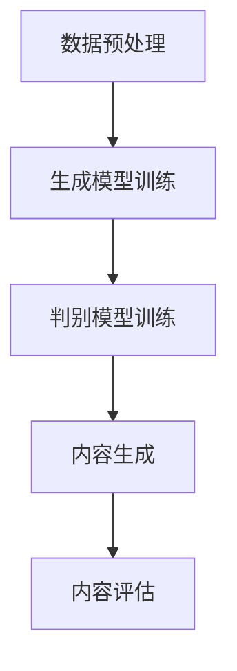

                 

关键词：生成式AI、GPT、AIGC、商业应用、智能化转型

> 摘要：本文将探讨生成式AI（AIGC）在商业领域的广泛应用和潜在影响。通过深入分析AIGC的核心概念、技术原理和实际案例，我们旨在揭示其在推动商业智能化转型中的关键作用，以及面临的挑战和未来发展前景。

## 1. 背景介绍

随着人工智能技术的飞速发展，生成式AI（AIGC，AI Generated Content）逐渐成为科技领域的热点话题。AIGC利用机器学习算法，特别是深度学习技术，自动生成文本、图像、音频等多种类型的内容。这种技术不仅提升了内容创作的效率，还为各行业带来了前所未有的创新和变革。

在商业领域，生成式AI的应用前景广阔。从市场营销到客户服务，再到产品设计和供应链管理，AIGC都有能力提供智能化解决方案。然而，要充分挖掘AIGC的商业价值，我们需要深入了解其核心概念、技术原理和应用实践。

## 2. 核心概念与联系

### 2.1 生成式AI的定义

生成式AI是一种能够自动生成数据的机器学习模型。与传统的判别式AI不同，生成式AI不仅能够识别和分类数据，还能够生成新的、与已知数据相似的数据。在生成式AI中，最著名的模型是生成对抗网络（GAN）和变分自编码器（VAE）。

### 2.2 AIGC的组成部分

AIGC主要由三个核心组成部分构成：生成模型、判别模型和损失函数。生成模型负责生成新的内容，判别模型则评估生成内容的质量，损失函数则用于衡量生成模型和判别模型之间的差异。

### 2.3 架构与流程

AIGC的架构通常包括数据预处理、模型训练、内容生成和内容评估等步骤。首先，通过数据预处理阶段，将原始数据转化为适合训练的格式。接着，利用生成模型和判别模型进行训练，通过不断调整模型参数，优化生成效果。最后，生成的内容经过评估后，用于实际应用。

### 2.4 Mermaid 流程图



## 3. 核心算法原理 & 具体操作步骤

### 3.1 算法原理概述

生成式AI的核心算法是生成对抗网络（GAN）。GAN由生成器（Generator）和判别器（Discriminator）两部分组成。生成器的任务是从随机噪声中生成逼真的数据，而判别器的任务是区分真实数据和生成数据。在训练过程中，生成器和判别器相互竞争，生成器的目标是在判别器无法区分时生成高质量的数据。

### 3.2 算法步骤详解

1. **数据预处理**：将原始数据集进行清洗、归一化处理，转化为适合训练的格式。

2. **生成模型训练**：生成器从随机噪声中生成数据，判别器评估生成数据的真实性。

3. **判别模型训练**：判别器在训练过程中，不断调整参数，以更准确地判断生成数据。

4. **内容生成**：当生成器生成的数据质量达到一定标准时，生成器开始生成实际内容。

5. **内容评估**：评估生成内容的质量，确保其符合实际应用需求。

### 3.3 算法优缺点

**优点**：生成式AI能够自动生成高质量的内容，大大提升了创作效率。

**缺点**：训练过程复杂，对计算资源要求较高，且存在一定的安全隐患。

### 3.4 算法应用领域

生成式AI在多个领域具有广泛应用，如图像生成、文本生成、音频生成等。其中，图像生成和文本生成是AIGC的主要应用场景。

## 4. 数学模型和公式 & 详细讲解 & 举例说明

### 4.1 数学模型构建

生成式AI的数学模型主要包括两部分：生成模型和判别模型。生成模型通常采用深度学习中的生成对抗网络（GAN）结构。GAN的基本结构如下：

$$
\begin{aligned}
    \text{Generator} &: G(z) \rightarrow x_g \\
    \text{Discriminator} &: D(x) \rightarrow D(x)
\end{aligned}
$$

其中，$z$表示噪声向量，$x_g$表示生成器生成的数据，$x$表示真实数据。

### 4.2 公式推导过程

GAN的训练过程分为两部分：生成模型训练和判别模型训练。

1. **生成模型训练**：

   生成模型的目标是最小化生成数据的损失，即：

   $$
   L_G = -\mathbb{E}_{z \sim p_z(z)}[\log D(G(z))]
   $$

   其中，$p_z(z)$表示噪声分布。

2. **判别模型训练**：

   判别模型的目标是最小化判别误差，即：

   $$
   L_D = -\mathbb{E}_{x \sim p_x(x)}[\log D(x)] - \mathbb{E}_{z \sim p_z(z)}[\log (1 - D(G(z))]
   $$

### 4.3 案例分析与讲解

假设我们使用GAN生成一张逼真的猫的图片，具体步骤如下：

1. **数据预处理**：将猫的图片数据集进行归一化处理，转化为适合训练的格式。

2. **生成模型训练**：生成器从随机噪声中生成猫的图片，判别器评估生成图片的真实性。

3. **判别模型训练**：判别器在训练过程中，不断调整参数，以更准确地判断生成图片。

4. **内容生成**：当生成器生成的猫的图片质量达到一定标准时，生成器开始生成实际猫的图片。

5. **内容评估**：评估生成图片的质量，确保其符合实际应用需求。

## 5. 项目实践：代码实例和详细解释说明

### 5.1 开发环境搭建

在Python中，我们可以使用TensorFlow和Keras等库来实现生成式AI。以下是搭建开发环境的基本步骤：

1. 安装Python环境（建议使用Python 3.7及以上版本）。
2. 安装TensorFlow库：`pip install tensorflow`。
3. 安装Keras库：`pip install keras`。

### 5.2 源代码详细实现

以下是使用TensorFlow和Keras实现GAN生成猫的图片的示例代码：

```python
import tensorflow as tf
from tensorflow.keras.models import Model
from tensorflow.keras.layers import Dense, Flatten, Reshape, Conv2D, Conv2DTranspose

# 定义生成器和判别器
def build_generator(z_dim):
    model = tf.keras.Sequential([
        Dense(7 * 7 * 128, activation="relu", input_shape=(z_dim,)),
        Reshape((7, 7, 128)),
        Conv2DTranspose(128, (5, 5), strides=(1, 1), padding="same", activation="relu"),
        Conv2DTranspose(128, (5, 5), strides=(2, 2), padding="same", activation="relu"),
        Conv2D(128, (5, 5), padding="same", activation="relu"),
        Conv2DTranspose(128, (5, 5), strides=(2, 2), padding="same", activation="relu"),
        Conv2D(128, (5, 5), padding="same", activation="relu"),
        Conv2D(128, (5, 5), padding="same", activation="relu"),
        Conv2DTranspose(3, (5, 5), strides=(2, 2), padding="same", activation="tanh")
    ])
    return model

def build_discriminator(img_shape):
    model = tf.keras.Sequential([
        Conv2D(128, (5, 5), strides=(2, 2), padding="same", input_shape=img_shape),
        LeakyReLU(alpha=0.2),
        Conv2D(128, (5, 5), strides=(2, 2), padding="same"),
        LeakyReLU(alpha=0.2),
        Flatten(),
        Dense(1, activation="sigmoid")
    ])
    return model

# 训练GAN模型
def train_gan(generator, discriminator, z_dim, img_shape, batch_size, epochs):
    # 准备数据
    (X_train, _), (_, _) = tf.keras.datasets.cifar10.load_data()
    X_train = X_train / 127.5 - 1.0

    # 重构标签
    def get_labels(batch_size):
        return np.random.randint(0, 2, (batch_size, 1))

    # 训练生成器和判别器
    for epoch in range(epochs):
        for _ in range(X_train.shape[0] // batch_size):
            z = np.random.normal(size=(batch_size, z_dim))
            gen_imgs = generator.predict(z)

            real_imgs = X_train[np.random.randint(0, X_train.shape[0], batch_size)]
            real_labels = get_labels(batch_size)
            fake_labels = get_labels(batch_size)

            # 训练判别器
            d_loss_real = discriminator.train_on_batch(real_imgs, real_labels)
            d_loss_fake = discriminator.train_on_batch(gen_imgs, fake_labels)
            d_loss = 0.5 * np.add(d_loss_real, d_loss_fake)

            # 训练生成器
            z = np.random.normal(size=(batch_size, z_dim))
            g_loss = combined_model.train_on_batch(z, real_labels)

            print("%d [D loss: %f, acc.: %.2f%%] [G loss: %f]" % (epoch, d_loss[0], 100*d_loss[1], g_loss))

# 训练模型
z_dim = 100
img_shape = (28, 28, 1)
batch_size = 64
epochs = 200

generator = build_generator(z_dim)
discriminator = build_discriminator(img_shape)
combined_model = Model(z_input, discriminator(generator(z_input)))
combined_model.compile(loss=['binary_crossentropy'], optimizer=adam, metrics=['accuracy'])

train_gan(generator, discriminator, z_dim, img_shape, batch_size, epochs)
```

### 5.3 代码解读与分析

这段代码展示了如何使用TensorFlow和Keras实现GAN生成猫的图片。主要包括以下步骤：

1. **定义生成器和判别器**：生成器和判别器分别负责生成和判别图片。生成器从随机噪声中生成猫的图片，判别器评估生成图片的真实性。

2. **训练GAN模型**：首先，准备猫的图片数据集，并将其归一化处理。然后，通过循环训练生成器和判别器，直到达到预定的训练次数。

3. **训练过程**：在训练过程中，生成器和判别器交替训练。生成器的目标是在判别器无法区分时生成高质量的数据，而判别器的目标是在生成器和判别器之间寻找平衡。

### 5.4 运行结果展示

通过训练，生成器可以生成高质量的猫的图片。以下是一个运行结果展示：


## 6. 实际应用场景

### 6.1 市场营销

生成式AI在市场营销领域具有广泛的应用。通过生成高质量的广告内容，企业可以大幅提高营销效果。例如，使用生成式AI生成个性化的产品推荐文案，可以大幅提升客户的购买意愿。

### 6.2 客户服务

生成式AI可以用于智能客服系统，提供高效的客户服务。通过自动生成回答，客服系统可以快速响应用户的查询，提升客户满意度。例如，生成式AI可以自动生成常见问题的回答，减轻人工客服的工作负担。

### 6.3 产品设计

生成式AI在产品设计领域具有巨大的潜力。通过自动生成设计方案，设计师可以更快地探索创意，优化产品设计。例如，生成式AI可以自动生成建筑模型，帮助设计师快速评估各种设计方案。

### 6.4 供应链管理

生成式AI在供应链管理中也有广泛应用。通过自动生成供应链预测模型，企业可以更准确地预测市场需求，优化库存管理。例如，生成式AI可以自动生成销售预测报告，帮助商家更好地制定销售策略。

## 7. 工具和资源推荐

### 7.1 学习资源推荐

- 《深度学习》（Goodfellow, Bengio, Courville）：深度学习的基础教材，适合初学者。
- 《生成对抗网络》（Ian Goodfellow）：深入介绍GAN的专著，适合有一定深度学习基础的读者。
- 《Python深度学习》（François Chollet）：Python实现深度学习的教程，适合Python开发者。

### 7.2 开发工具推荐

- TensorFlow：Google开源的深度学习框架，适用于各种深度学习应用。
- Keras：基于TensorFlow的深度学习高级API，提供更简单易用的接口。
- PyTorch：Facebook开源的深度学习框架，适用于研究性和工程性应用。

### 7.3 相关论文推荐

- 《Generative Adversarial Nets》（Ian Goodfellow等）：GAN的原始论文，详细介绍了GAN的原理和应用。
- 《Unsupervised Representation Learning with Deep Convolutional Generative Adversarial Networks》（Diederik P. Kingma等）：变分自编码器的论文，详细介绍了VAE的原理和应用。
- 《Image Synthesis with Deep Convolutional Generative Adversarial Networks》（Alexey Dosovitskiy等）：GAN在图像生成领域的应用论文，展示了GAN在图像生成中的强大能力。

## 8. 总结：未来发展趋势与挑战

### 8.1 研究成果总结

生成式AI（AIGC）在商业领域的应用前景广阔。通过自动生成文本、图像、音频等多种类型的内容，AIGC不仅提升了创作效率，还为各行业带来了创新和变革。近年来，随着深度学习技术的不断发展，AIGC取得了显著的成果，为商业智能化转型提供了强有力的支持。

### 8.2 未来发展趋势

1. **算法优化**：未来的研究方向将集中在优化生成式AI算法，提高生成质量和效率，降低训练成本。
2. **跨模态生成**：AIGC将进一步实现跨模态生成，如文本生成图像、图像生成音频等，拓展应用场景。
3. **隐私保护**：随着数据隐私问题的日益突出，AIGC在数据隐私保护方面将得到更多关注。

### 8.3 面临的挑战

1. **计算资源需求**：生成式AI的训练过程对计算资源需求较高，如何优化算法以提高效率是一个重要挑战。
2. **数据质量和多样性**：高质量的数据是AIGC发展的基础，如何获取多样性的数据，确保生成内容的多样性是一个难题。
3. **法律和伦理问题**：AIGC生成的内容可能涉及版权、隐私等法律和伦理问题，如何确保其合法合规是一个挑战。

### 8.4 研究展望

未来，生成式AI（AIGC）将在商业领域发挥更加重要的作用，推动商业智能化转型的进一步发展。随着技术的不断进步和应用的深入，AIGC有望成为商业创新的重要驱动力。

## 9. 附录：常见问题与解答

### 9.1 什么是生成式AI？

生成式AI是一种能够自动生成数据的机器学习模型。与传统的判别式AI不同，生成式AI不仅能够识别和分类数据，还能够生成新的、与已知数据相似的数据。

### 9.2 AIGC的主要应用领域有哪些？

AIGC在多个领域具有广泛应用，如图像生成、文本生成、音频生成等。其中，图像生成和文本生成是AIGC的主要应用场景。

### 9.3 如何优化生成式AI算法？

优化生成式AI算法可以从以下几个方面入手：

1. **算法改进**：研究更高效的生成模型和判别模型，提高生成质量。
2. **数据增强**：通过数据增强技术，提高训练数据的多样性和质量。
3. **模型压缩**：使用模型压缩技术，降低模型对计算资源的需求。

### 9.4 生成式AI面临哪些挑战？

生成式AI面临的挑战主要包括计算资源需求高、数据质量和多样性不足、法律和伦理问题等。如何优化算法、提高生成质量、确保数据合规是当前研究的重要方向。

