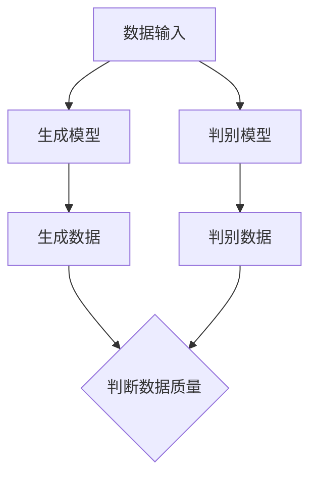

                 

关键词：生成式AI、未来趋势、发展路径、算法原理、应用场景、挑战与展望

> 摘要：生成式人工智能作为近年来人工智能领域的热门研究方向，正逐步改变着各行各业的运作方式。本文旨在探讨生成式AI的核心概念、算法原理、应用场景、面临的挑战以及未来发展趋势，为读者提供一幅全面的生成式AI发展蓝图。

## 1. 背景介绍

随着大数据和计算能力的不断提升，人工智能技术在过去几十年里取得了飞速发展。从早期的符号推理到深度学习，再到自然语言处理和计算机视觉，人工智能的应用场景越来越广泛。生成式人工智能（Generative AI）作为人工智能的一个重要分支，近年来受到了广泛关注。

生成式AI旨在生成新的数据或内容，以模拟真实世界的现象。它可以生成图片、音频、视频、文本等多种形式的内容，为各个领域带来了新的可能性。从艺术创作、游戏开发到医疗诊断、自动驾驶，生成式AI都有着广泛的应用前景。

### 1.1 生成式AI的定义与核心概念

生成式AI的核心概念是通过学习已有数据，生成新的、类似的数据。它通常使用生成模型（Generator）和判别模型（Discriminator）来共同工作。生成模型负责生成新的数据，而判别模型负责判断生成数据的质量。

生成模型和判别模型之间通过对抗训练（Adversarial Training）进行训练，生成模型不断优化以生成更真实的数据，而判别模型则不断优化以区分真实数据和生成数据。这种对抗过程使得生成模型能够逐渐生成高质量的数据。

### 1.2 生成式AI的发展历程

生成式AI的发展历程可以分为三个阶段：

1. **概率生成模型**：以马尔可夫模型和隐马尔可夫模型为代表的概率生成模型，通过学习数据的概率分布来生成新的数据。
2. **变分自编码器（VAE）**：变分自编码器通过引入变分推断方法，解决了概率生成模型的一些问题，如生成数据多样性和鲁棒性。
3. **生成对抗网络（GAN）**：生成对抗网络通过生成模型和判别模型的对抗训练，实现了高质量的生成数据。

## 2. 核心概念与联系

在深入探讨生成式AI的核心算法原理之前，我们首先需要了解其核心概念和架构。以下是一个简化的Mermaid流程图，展示了生成式AI的基本架构和核心流程：



### 2.1 数据输入

生成式AI的数据输入可以是各种形式，如图像、音频、文本等。输入数据的质量和多样性直接影响到生成模型的效果。

### 2.2 生成模型

生成模型是生成式AI的核心组件，它通过学习输入数据的特征，生成新的数据。常见的生成模型包括：

1. **变分自编码器（VAE）**：VAE通过引入变分推断，解决了传统生成模型在生成数据多样性和鲁棒性方面的问题。
2. **生成对抗网络（GAN）**：GAN通过生成模型和判别模型的对抗训练，实现了高质量的生成数据。

### 2.3 判别模型

判别模型用于判断生成数据的质量。在GAN中，判别模型通常是一个二分类模型，它的任务是区分真实数据和生成数据。

### 2.4 生成数据

生成模型生成新的数据，这些数据可以用于各种应用场景，如图像生成、文本生成等。

### 2.5 判断数据质量

判别模型对生成数据的质量进行评估，并将其反馈给生成模型。通过这种反馈机制，生成模型可以不断优化，生成更高质量的数据。

## 3. 核心算法原理 & 具体操作步骤

### 3.1 算法原理概述

生成式AI的核心算法原理主要包括生成模型和判别模型的训练过程。以下是一个简化的算法原理概述：

1. **生成模型**：生成模型通过学习输入数据的特征，生成新的数据。它通常是一个概率模型，如变分自编码器（VAE）或生成对抗网络（GAN）。
2. **判别模型**：判别模型用于判断生成数据的质量。它通常是一个二分类模型，如神经网络。

### 3.2 算法步骤详解

1. **数据预处理**：对输入数据集进行清洗、归一化等预处理操作。
2. **初始化模型**：初始化生成模型和判别模型的参数。
3. **生成模型训练**：通过最小化生成模型的损失函数，优化生成模型的参数。
4. **判别模型训练**：通过最小化判别模型的损失函数，优化判别模型的参数。
5. **对抗训练**：生成模型和判别模型交替进行训练，以实现对抗训练。
6. **生成数据**：使用生成模型生成新的数据。

### 3.3 算法优缺点

**优点**：

1. **生成数据质量高**：生成对抗网络（GAN）能够生成高质量的生成数据。
2. **数据多样性**：变分自编码器（VAE）能够生成多样性的数据。

**缺点**：

1. **训练难度大**：生成式AI的训练过程相对复杂，需要大量的数据和计算资源。
2. **模型不稳定**：在某些情况下，生成式AI的模型可能会出现不稳定的情况，导致生成数据质量下降。

### 3.4 算法应用领域

生成式AI在多个领域都有着广泛的应用，包括：

1. **图像生成**：用于生成艺术作品、修复损坏的图像等。
2. **文本生成**：用于生成文章、诗歌等。
3. **音频生成**：用于生成音乐、语音等。

## 4. 数学模型和公式 & 详细讲解 & 举例说明

### 4.1 数学模型构建

生成式AI的数学模型主要包括生成模型和判别模型的构建。以下是一个简化的数学模型构建：

1. **生成模型**：假设输入数据为 \(X\)，生成模型的目标是生成新的数据 \(X'\)。

$$
X' = G(X; \theta_G)
$$

其中，\(G\) 是生成模型，\(\theta_G\) 是生成模型的参数。

2. **判别模型**：假设输入数据为 \(X\)，判别模型的目标是判断输入数据 \(X'\) 的质量。

$$
Y = D(X'; \theta_D)
$$

其中，\(D\) 是判别模型，\(\theta_D\) 是判别模型的参数。

### 4.2 公式推导过程

生成式AI的公式推导过程主要包括生成模型和判别模型的损失函数构建。

1. **生成模型损失函数**：

$$
L_G = \mathbb{E}_{X \sim p_{data}(X)}[-\log D(G(X))]
$$

其中，\(p_{data}(X)\) 是输入数据的概率分布，\(D(G(X))\) 是判别模型对生成数据的判断结果。

2. **判别模型损失函数**：

$$
L_D = \mathbb{E}_{X \sim p_{data}(X)}[-\log D(X)] + \mathbb{E}_{X' \sim G(X)}[-\log (1 - D(X'))]
$$

其中，\(D(X)\) 是判别模型对输入数据的判断结果，\(D(X')\) 是判别模型对生成数据的判断结果。

### 4.3 案例分析与讲解

以下是一个简单的案例，展示了生成式AI在图像生成方面的应用。

假设我们有一个包含1000张猫的图像数据集。我们使用生成对抗网络（GAN）来生成新的猫的图像。

1. **数据预处理**：将图像数据集归一化到 \([-1, 1]\) 范围内。
2. **初始化模型**：初始化生成模型和判别模型的参数。
3. **生成模型训练**：通过最小化生成模型的损失函数，优化生成模型的参数。
4. **判别模型训练**：通过最小化判别模型的损失函数，优化判别模型的参数。
5. **对抗训练**：生成模型和判别模型交替进行训练。
6. **生成数据**：使用生成模型生成新的猫的图像。

在训练过程中，生成模型和判别模型会不断优化，直到生成模型能够生成高质量的猫的图像。

## 5. 项目实践：代码实例和详细解释说明

### 5.1 开发环境搭建

在开始编写代码之前，我们需要搭建一个适合生成式AI的开发环境。以下是一个简单的开发环境搭建步骤：

1. **安装Python**：确保Python环境已经安装。
2. **安装TensorFlow**：TensorFlow是一个流行的深度学习框架，支持生成式AI。
3. **安装其他依赖**：根据项目需求，安装其他必要的依赖库。

### 5.2 源代码详细实现

以下是一个简单的生成对抗网络（GAN）的代码实例：

```python
import tensorflow as tf
from tensorflow.keras.layers import Dense, Flatten, Reshape
from tensorflow.keras.models import Sequential
from tensorflow.keras.optimizers import Adam

# 生成模型
def build_generator():
    model = Sequential()
    model.add(Dense(128, input_shape=(100,), activation='relu'))
    model.add(Dense(256, activation='relu'))
    model.add(Dense(512, activation='relu'))
    model.add(Flatten())
    model.add(Reshape((28, 28, 1)))
    model.add(tf.keras.layers.Conv2D(1, kernel_size=(5, 5), activation='tanh'))
    return model

# 判别模型
def build_discriminator():
    model = Sequential()
    model.add(tf.keras.layers.Conv2D(32, kernel_size=(3, 3), strides=(2, 2), padding='same', input_shape=(28, 28, 1), activation='relu'))
    model.add(tf.keras.layers.Conv2D(64, kernel_size=(3, 3), strides=(2, 2), padding='same', activation='relu'))
    model.add(Flatten())
    model.add(Dense(1, activation='sigmoid'))
    return model

# GAN模型
def build_gan(generator, discriminator):
    model = Sequential()
    model.add(generator)
    model.add(discriminator)
    return model

# 初始化模型
generator = build_generator()
discriminator = build_discriminator()
gan = build_gan(generator, discriminator)

# 定义优化器
generator_optimizer = Adam(learning_rate=0.0002)
discriminator_optimizer = Adam(learning_rate=0.0002)

# 编写训练循环
for epoch in range(epochs):
    for image in dataset:
        with tf.GradientTape() as gen_tape, tf.GradientTape() as disc_tape:
            # 生成数据
            noise = tf.random.normal([batch_size, noise_dim])
            generated_images = generator(noise, training=True)

            # 训练判别模型
            real_labels = tf.ones([batch_size, 1])
            fake_labels = tf.zeros([batch_size, 1])
            disc_loss_real = discriminator(image, training=True)
            disc_loss_fake = discriminator(generated_images, training=True)
            disc_loss = tf.reduce_mean(tf.nn.sigmoid_cross_entropy_with_logits(logits=disc_loss_real, labels=real_labels)) + tf.reduce_mean(tf.nn.sigmoid_cross_entropy_with_logits(logits=disc_loss_fake, labels=fake_labels))

            # 训练生成模型
            gen_labels = tf.ones([batch_size, 1])
            gen_loss = tf.reduce_mean(tf.nn.sigmoid_cross_entropy_with_logits(logits=discriminator(generated_images, training=True), labels=gen_labels))

        # 计算梯度
        gradients_of_generator = gen_tape.gradient(gen_loss, generator.trainable_variables)
        gradients_of_discriminator = disc_tape.gradient(disc_loss, discriminator.trainable_variables)

        # 更新模型参数
        generator_optimizer.apply_gradients(zip(gradients_of_generator, generator.trainable_variables))
        discriminator_optimizer.apply_gradients(zip(gradients_of_discriminator, discriminator.trainable_variables))

    # 打印训练进度
    print(f"Epoch {epoch + 1}/{epochs}, Discriminator Loss: {disc_loss.numpy()}, Generator Loss: {gen_loss.numpy()}")

# 生成图像
noise = tf.random.normal([1, noise_dim])
generated_image = generator(noise, training=False)
generated_image = generated_image.numpy().reshape((28, 28, 1))
plt.imshow(generated_image)
plt.show()
```

### 5.3 代码解读与分析

1. **模型构建**：代码首先定义了生成模型、判别模型和GAN模型的构建方法。生成模型使用了一个简单的全连接神经网络，判别模型使用了一个简单的卷积神经网络。
2. **优化器**：代码使用了Adam优化器，这是一种常用的优化器，适用于深度学习模型。
3. **训练循环**：代码在一个训练循环中交替训练生成模型和判别模型。在每个训练步骤中，生成模型生成一批随机噪声，并将其转换为图像。然后，判别模型对真实图像和生成图像进行分类，并计算损失函数。通过反向传播，优化模型参数。
4. **生成图像**：最后，代码使用生成模型生成一张新的图像，并将其显示出来。

## 6. 实际应用场景

生成式AI在多个领域都有着广泛的应用，以下是一些常见的实际应用场景：

1. **图像生成**：生成式AI可以用于生成新的图像，如图像修复、图像风格迁移等。例如，谷歌的StyleGAN可以生成高质量的人脸图像。
2. **文本生成**：生成式AI可以用于生成新的文本，如文章、诗歌等。例如，OpenAI的GPT-3可以生成高质量的文本。
3. **音频生成**：生成式AI可以用于生成新的音频，如音乐、语音等。例如，谷歌的MusicGen可以生成高质量的音乐。
4. **虚拟现实**：生成式AI可以用于生成虚拟现实场景，如游戏、电影等。
5. **医疗诊断**：生成式AI可以用于生成新的医学图像，帮助医生进行疾病诊断。

## 7. 未来应用展望

随着技术的不断发展，生成式AI将在未来有更广泛的应用。以下是一些未来应用展望：

1. **自动驾驶**：生成式AI可以用于生成自动驾驶系统的道路场景，提高自动驾驶系统的安全性。
2. **医疗领域**：生成式AI可以用于生成医学图像，帮助医生进行疾病诊断和治疗方案制定。
3. **艺术创作**：生成式AI可以用于生成新的艺术作品，如绘画、音乐等，为艺术家提供新的创作灵感。
4. **游戏开发**：生成式AI可以用于生成新的游戏场景、角色等，提高游戏的可玩性和多样性。
5. **教育领域**：生成式AI可以用于生成个性化的教学方案，帮助学生更好地学习。

## 8. 工具和资源推荐

### 8.1 学习资源推荐

1. **《深度学习》（Goodfellow, Bengio, Courville）**：这是一本经典的深度学习教材，涵盖了生成式AI的相关内容。
2. **《生成对抗网络》（Goodfellow, Pouget-Abadie, Mirza, Xu, Warde-Farley, Ozair, Courville, Bengio）**：这是GAN的原始论文，是了解GAN的绝佳资源。

### 8.2 开发工具推荐

1. **TensorFlow**：这是一个流行的深度学习框架，支持生成式AI。
2. **PyTorch**：这是一个灵活的深度学习框架，支持生成式AI。

### 8.3 相关论文推荐

1. **《生成对抗网络》（Goodfellow, Pouget-Abadie, Mirza, Xu, Warde-Farley, Ozair, Courville, Bengio）**：这是GAN的原始论文，是了解GAN的绝佳资源。
2. **《变分自编码器》（Kingma, Welling）**：这是VAE的原始论文，是了解VAE的绝佳资源。

## 9. 总结：未来发展趋势与挑战

### 9.1 研究成果总结

生成式AI作为人工智能的一个重要分支，近年来取得了显著的研究成果。从早期的概率生成模型到生成对抗网络（GAN）和变分自编码器（VAE），生成式AI在生成数据质量、数据多样性等方面取得了很大的进展。同时，生成式AI在图像生成、文本生成、音频生成等实际应用场景中取得了显著的效果。

### 9.2 未来发展趋势

1. **模型优化**：未来的研究将致力于优化生成式AI的模型结构，提高生成数据的质量和多样性。
2. **应用拓展**：生成式AI将在更多领域得到应用，如医疗诊断、自动驾驶、艺术创作等。
3. **数据隐私保护**：随着生成式AI的应用场景越来越广泛，数据隐私保护将成为一个重要问题。

### 9.3 面临的挑战

1. **训练难度**：生成式AI的训练过程相对复杂，需要大量的数据和计算资源。
2. **数据隐私**：生成式AI在生成数据时，可能会泄露训练数据中的隐私信息。
3. **伦理问题**：生成式AI生成的数据可能会被用于不道德的用途，如虚假新闻、恶意攻击等。

### 9.4 研究展望

生成式AI在未来将继续发展，有望在更多领域取得突破。同时，随着技术的不断发展，生成式AI将面临新的挑战和机遇。研究者们需要不断创新，解决现有问题，推动生成式AI的发展。

## 10. 附录：常见问题与解答

### 10.1 生成式AI是什么？

生成式AI是一种人工智能技术，旨在生成新的数据或内容，以模拟真实世界的现象。它通过学习已有数据，生成新的、类似的数据。

### 10.2 生成式AI有哪些应用场景？

生成式AI在多个领域都有着广泛的应用，包括图像生成、文本生成、音频生成、虚拟现实、医疗诊断等。

### 10.3 生成式AI的核心算法是什么？

生成式AI的核心算法包括生成对抗网络（GAN）和变分自编码器（VAE）。GAN通过生成模型和判别模型的对抗训练实现高质量的数据生成，而VAE通过变分推断实现数据的多样性和鲁棒性。

### 10.4 生成式AI的训练过程如何进行？

生成式AI的训练过程通常包括数据预处理、模型初始化、生成模型训练、判别模型训练、对抗训练等步骤。通过这些步骤，生成模型和判别模型不断优化，以实现高质量的数据生成。

### 10.5 生成式AI有哪些优点和缺点？

生成式AI的优点包括生成数据质量高、数据多样性等，缺点包括训练难度大、模型不稳定等。

### 10.6 生成式AI在医疗诊断中有哪些应用？

生成式AI在医疗诊断中可以用于生成医学图像、辅助医生进行疾病诊断和治疗方案制定等。

### 10.7 生成式AI在艺术创作中有哪些应用？

生成式AI在艺术创作中可以用于生成新的艺术作品、音乐等，为艺术家提供新的创作灵感。

### 10.8 生成式AI在自动驾驶中有哪些应用？

生成式AI在自动驾驶中可以用于生成道路场景、辅助自动驾驶系统进行决策等。

### 10.9 生成式AI有哪些未来发展趋势？

生成式AI的未来发展趋势包括模型优化、应用拓展、数据隐私保护等。

### 10.10 生成式AI有哪些面临的挑战？

生成式AI面临的挑战包括训练难度、数据隐私、伦理问题等。

### 10.11 生成式AI有哪些工具和资源推荐？

生成式AI的工具和资源推荐包括TensorFlow、PyTorch等深度学习框架，以及《深度学习》、《生成对抗网络》等教材和论文。作者：禅与计算机程序设计艺术 / Zen and the Art of Computer Programming。

