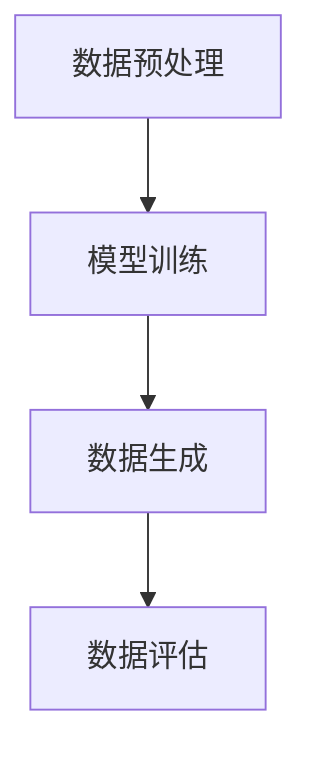

                 

关键词：生成式AI、技术发展、机遇、挑战、人工智能

摘要：生成式人工智能（Generative AI）作为近年来快速崛起的一个领域，已经在多个行业和领域中展现出了巨大的潜力。本文将深入探讨生成式AI的发展背景、核心概念、算法原理、数学模型、应用场景、工具资源以及未来趋势和挑战，旨在帮助读者全面了解和应对这一技术变革所带来的机遇与挑战。

## 1. 背景介绍

### 1.1 生成式AI的兴起

生成式人工智能的概念起源于20世纪50年代的图灵测试，其目的是通过模拟人类思维过程来生成文本、图像、音频等多种形式的内容。随着计算能力的提升和数据量的爆炸式增长，生成式AI技术得到了快速发展。特别是在深度学习技术的推动下，生成式AI在自然语言处理、计算机视觉等领域取得了显著成果。

### 1.2 应用场景的广泛性

生成式AI在图像生成、文本生成、音频生成等方面都有着广泛的应用。例如，在图像生成方面，生成式AI可以用于艺术创作、游戏开发、图像修复等领域；在文本生成方面，生成式AI可以用于自动写作、新闻生成、对话系统等领域；在音频生成方面，生成式AI可以用于音乐创作、语音合成等领域。

## 2. 核心概念与联系

### 2.1 生成式AI的核心概念

生成式AI的核心概念包括生成模型、条件生成模型和对抗生成模型。生成模型是一种概率模型，用于生成新的数据样本；条件生成模型在生成模型的基础上加入了条件信息，可以生成更加符合条件的数据样本；对抗生成模型则通过生成模型和判别模型的对抗训练来生成更加真实的数据样本。

### 2.2 生成式AI的架构

生成式AI的架构通常包括以下几个部分：

- 数据预处理：对输入数据进行清洗、归一化等处理。
- 模型训练：使用生成模型、条件生成模型或对抗生成模型进行训练。
- 数据生成：使用训练好的模型生成新的数据样本。
- 数据评估：对生成的数据进行质量评估和性能测试。

### 2.3 生成式AI的Mermaid流程图



## 3. 核心算法原理 & 具体操作步骤

### 3.1 算法原理概述

生成式AI的核心算法主要包括生成对抗网络（GAN）、变分自编码器（VAE）和递归神经网络（RNN）等。其中，GAN是一种通过生成模型和判别模型对抗训练来生成数据的算法；VAE是一种基于概率模型的自编码器，可以用于生成新的数据样本；RNN是一种可以处理序列数据的神经网络，可以用于生成文本、音频等序列数据。

### 3.2 算法步骤详解

- 数据预处理：对输入数据进行清洗、归一化等处理，使其符合模型训练的要求。
- 模型选择：根据应用场景选择合适的生成模型、条件生成模型或对抗生成模型。
- 模型训练：使用生成模型和判别模型进行对抗训练，或者使用变分自编码器进行模型训练。
- 数据生成：使用训练好的模型生成新的数据样本。
- 数据评估：对生成的数据进行质量评估和性能测试，以验证模型的效果。

### 3.3 算法优缺点

- GAN的优点：可以生成高质量的数据样本，且生成样本具有多样性；缺点：训练过程不稳定，容易出现模式崩溃等问题。
- VAE的优点：可以生成高质量的数据样本，且生成样本具有多样性；缺点：生成样本的质量和多样性受到编码器和解码器的影响。
- RNN的优点：可以处理序列数据，生成连续的文本、音频等序列数据；缺点：训练过程复杂，且在长序列处理方面存在梯度消失或梯度爆炸的问题。

### 3.4 算法应用领域

- 图像生成：GAN、VAE等算法可以用于图像生成，包括艺术创作、图像修复、图像风格转换等领域。
- 文本生成：RNN、序列生成模型等算法可以用于文本生成，包括自动写作、新闻生成、对话系统等领域。
- 音频生成：GAN、VAE等算法可以用于音频生成，包括音乐创作、语音合成、音频修复等领域。

## 4. 数学模型和公式 & 详细讲解 & 举例说明

### 4.1 数学模型构建

生成式AI的数学模型主要包括生成模型、条件生成模型和对抗生成模型。以下是这些模型的数学表示：

- 生成模型：\( G(z) \)
- 条件生成模型：\( G(z|x) \)
- 对抗生成模型：\( D(x), G(z) \)

### 4.2 公式推导过程

- 生成模型的推导：
$$
\begin{aligned}
\log(D(G(z))) &= \log(1-D(G(z))) \\
&\approx -\log(D(G(z))) \\
\end{aligned}
$$

- 条件生成模型的推导：
$$
\begin{aligned}
\log(D(G(z|x))) &= \log(1-D(G(z|x))) \\
&\approx -\log(D(G(z|x))) \\
\end{aligned}
$$

- 对抗生成模型的推导：
$$
\begin{aligned}
\log(D(x)) &= \log(D(G(z))) \\
\log(D(G(z))) &= \log(1-D(G(z))) \\
\end{aligned}
$$

### 4.3 案例分析与讲解

以GAN为例，假设我们有一个生成模型\( G(z) \)和一个判别模型\( D(x) \)。我们希望通过训练使得\( G(z) \)生成的数据能够尽可能地逼近真实数据，而\( D(x) \)能够正确地区分真实数据和生成数据。

- 初始状态：
$$
D(x) \text{对真实数据的判断准确度} = 0.5
$$
$$
D(G(z)) \text{对生成数据的判断准确度} = 0.5
$$

- 训练过程：
1. 随机生成一批噪声向量\( z \)，通过生成模型\( G(z) \)生成一批生成数据。
2. 将真实数据和生成数据输入到判别模型\( D(x) \)，更新判别模型的权重。
3. 更新生成模型的权重，使得生成数据能够更好地欺骗判别模型。

- 最终状态：
$$
D(x) \text{对真实数据的判断准确度} \approx 1
$$
$$
D(G(z)) \text{对生成数据的判断准确度} \approx 0
$$

## 5. 项目实践：代码实例和详细解释说明

### 5.1 开发环境搭建

- 安装Python环境（Python 3.6及以上版本）
- 安装TensorFlow库（TensorFlow 2.0及以上版本）
- 安装相关依赖库，如NumPy、Pandas等

### 5.2 源代码详细实现

以下是使用TensorFlow实现GAN的一个简单示例：

```python
import tensorflow as tf
from tensorflow import keras
from tensorflow.keras import layers

# 生成模型
def generate_model():
    model = keras.Sequential([
        layers.Dense(128, activation='relu', input_shape=(100,)),
        layers.Dense(128, activation='relu'),
        layers.Dense(784, activation='tanh')
    ])
    return model

# 判别模型
def critic_model():
    model = keras.Sequential([
        layers.Dense(128, activation='relu', input_shape=(784,)),
        layers.Dense(128, activation='relu'),
        layers.Dense(1, activation='sigmoid')
    ])
    return model

# GAN模型
def gan_model():
    generator = generate_model()
    critic = critic_model()

    model = keras.Sequential([
        generator,
        critic
    ])

    return model

# 损失函数
def loss_function(real_data, generated_data):
    real_loss = keras.losses.binary_crossentropy(real_data, tf.ones_like(real_data))
    generated_loss = keras.losses.binary_crossentropy(generated_data, tf.zeros_like(generated_data))

    return real_loss + generated_loss

# 模型编译
generator = generate_model()
critic = critic_model()
gan_model = gan_model()

generator.compile(loss='binary_crossentropy', optimizer=keras.optimizers.Adam(0.0001))
critic.compile(loss='binary_crossentropy', optimizer=keras.optimizers.Adam(0.0001))
gan_model.compile(loss='binary_crossentropy', optimizer=keras.optimizers.Adam(0.0001))

# 训练GAN模型
def train_gan(dataset, epochs, batch_size):
    for epoch in range(epochs):
        for batch in dataset:
            noise = tf.random.normal([batch_size, 100])

            with tf.GradientTape() as gen_tape, tf.GradientTape() as crit_tape:
                generated_images = generator(noise, training=True)

                real_loss = loss_function(batch, tf.ones_like(batch))
                generated_loss = loss_function(generated_images, tf.zeros_like(generated_images))

                total_loss = real_loss + generated_loss

            grads_generator = gen_tape.gradient(total_loss, generator.trainable_variables)
            grads_critic = crit_tape.gradient(total_loss, critic.trainable_variables)

            generator.optimizer.apply_gradients(zip(grads_generator, generator.trainable_variables))
            critic.optimizer.apply_gradients(zip(grads_critic, critic.trainable_variables))

            print(f"Epoch {epoch + 1}, Loss: {total_loss.numpy()}")

# 加载和预处理数据
import numpy as np
import matplotlib.pyplot as plt

# 假设已经加载并预处理好了MNIST数据集
(x_train, _), (_, _) = keras.datasets.mnist.load_data()
x_train = x_train.astype('float32') / 255.0
x_train = np.expand_dims(x_train, axis=3)

# 训练模型
train_gan(x_train, epochs=50, batch_size=64)

# 生成图像
def generate_images(generator, n_images):
    noise = tf.random.normal([n_images, 100])
    generated_images = generator(noise, training=False)

    plt.figure(figsize=(10, 10))
    for i in range(n_images):
        plt.subplot(1, n_images, i + 1)
        plt.imshow(generated_images[i, :, :, 0], cmap='gray')
        plt.axis('off')
    plt.show()

generate_images(generator, 10)
```

### 5.3 代码解读与分析

- 代码首先定义了生成模型、判别模型和GAN模型，并编译了这些模型。
- 接下来定义了损失函数，用于计算生成模型和判别模型的损失。
- 然后定义了训练GAN模型的过程，包括前向传播、损失计算和反向传播。
- 加载和预处理MNIST数据集，并使用训练集训练GAN模型。
- 最后生成一批图像，展示生成模型的训练效果。

### 5.4 运行结果展示

运行上述代码后，将生成一批由生成模型生成的图像。这些图像将展示生成模型在训练过程中逐渐提高生成图像质量的过程。

## 6. 实际应用场景

### 6.1 图像生成

生成式AI在图像生成领域有广泛的应用。例如，GAN可以用于生成逼真的图像、艺术作品和游戏角色等。此外，生成式AI还可以用于图像修复、图像增强和图像风格转换等领域。

### 6.2 文本生成

生成式AI在文本生成领域也有很大的潜力。例如，RNN和变分自编码器可以用于自动写作、新闻生成和对话系统等领域。这些技术可以生成高质量、多样化的文本内容，有助于提高内容创作效率和丰富性。

### 6.3 音频生成

生成式AI在音频生成领域也有广泛的应用。例如，GAN和变分自编码器可以用于音乐创作、语音合成和音频修复等领域。这些技术可以生成高质量、多样化的音频内容，有助于提高内容创作效率和丰富性。

### 6.4 未来应用展望

随着生成式AI技术的不断进步，预计它将在更多领域得到应用。例如，在医疗领域，生成式AI可以用于生成医学图像、辅助疾病诊断和治疗；在金融领域，生成式AI可以用于生成金融数据、预测市场走势等；在工业领域，生成式AI可以用于生成产品设计、优化生产流程等。

## 7. 工具和资源推荐

### 7.1 学习资源推荐

- 《生成式AI：核心技术与应用》
- 《深度学习》（Goodfellow, Bengio, Courville著）
- 《生成对抗网络：理论与实践》（Mordvintsev, Olah, Carter著）

### 7.2 开发工具推荐

- TensorFlow
- PyTorch
- Keras

### 7.3 相关论文推荐

- Generative Adversarial Networks (GANs)（Goodfellow et al., 2014）
- Variational Autoencoders (VAEs)（Kingma and Welling, 2013）
- Unsupervised Representation Learning with Deep Convolutional Generative Adversarial Networks (DCGANs)（Radford et al., 2015）

## 8. 总结：未来发展趋势与挑战

### 8.1 研究成果总结

生成式AI在图像生成、文本生成、音频生成等领域取得了显著成果，为多个行业和领域带来了新的机遇。同时，生成式AI的理论研究和算法创新也在不断推进，为未来的发展奠定了基础。

### 8.2 未来发展趋势

- 生成式AI将在更多领域得到应用，如医疗、金融、工业等。
- 算法创新和优化将继续推动生成式AI的发展，提高生成数据的质量和多样性。
- 生成式AI与其他人工智能技术的融合，如强化学习、迁移学习等，将进一步提升其应用价值。

### 8.3 面临的挑战

- 生成式AI的训练过程复杂，需要大量的计算资源和时间。
- 生成式AI的生成数据存在一定的随机性和不可预测性，需要进一步研究和优化。
- 生成式AI的伦理和安全问题，如数据隐私保护、模型可解释性等，需要引起重视。

### 8.4 研究展望

- 未来研究应重点关注生成式AI的算法创新和优化，提高生成数据的质量和多样性。
- 研究应关注生成式AI与其他人工智能技术的融合，探索新的应用场景和解决方案。
- 研究应关注生成式AI的伦理和安全问题，确保其健康发展。

## 9. 附录：常见问题与解答

### 9.1 什么是生成式AI？

生成式AI是一种人工智能技术，旨在生成新的数据样本，如图像、文本、音频等。它通过学习大量已有数据来预测和生成新的数据样本。

### 9.2 生成式AI的核心算法有哪些？

生成式AI的核心算法包括生成对抗网络（GAN）、变分自编码器（VAE）和递归神经网络（RNN）等。

### 9.3 生成式AI的应用场景有哪些？

生成式AI的应用场景包括图像生成、文本生成、音频生成、医学图像生成、金融数据生成等。

### 9.4 生成式AI的优缺点是什么？

生成式AI的优点包括可以生成高质量、多样化的数据样本；缺点包括训练过程复杂、生成数据存在一定的随机性和不可预测性等。

### 9.5 生成式AI的发展趋势是什么？

生成式AI的发展趋势包括在更多领域得到应用、算法创新和优化、与其他人工智能技术的融合等。作者：禅与计算机程序设计艺术 / Zen and the Art of Computer Programming
------------------------------------------------------------------------

