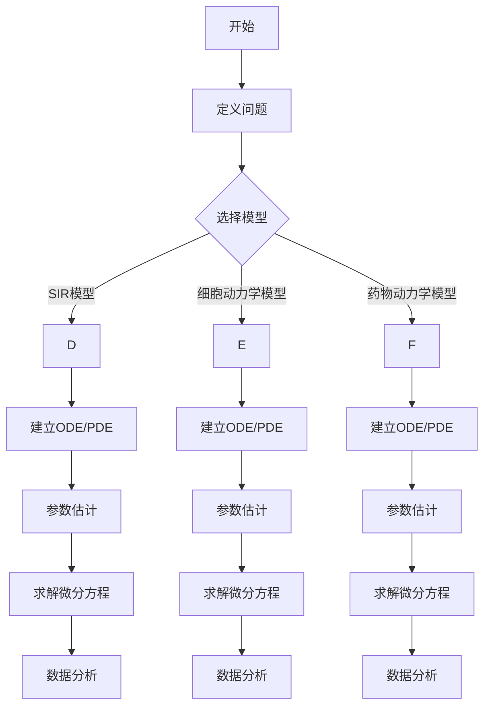

                 

关键词：微分方程、生物医学、建模、疾病传播、细胞动力学、药物动力学

> 摘要：本文深入探讨了生物学与医学领域中微分方程的应用，介绍了微分建模在疾病传播、细胞动力学和药物动力学等领域的核心概念、算法原理、数学模型和实际应用，旨在为读者提供全面的了解和指导。

## 1. 背景介绍

生物学与医学是两个高度复杂的领域，其中许多现象和过程可以用数学模型来描述。微分方程作为一种强有力的数学工具，因其能够精确描述动态系统的行为而广泛应用于生物学与医学研究中。微分方程可以通过描述变量随时间的变化速率来捕捉系统内部的动态关系，这对于理解生物体内的复杂过程至关重要。

在生物学中，微分方程被用来建模细胞行为、分子反应、种群动态和生态系统平衡。例如，在细胞动力学研究中，微分方程可以用来模拟细胞增殖、分化以及细胞之间的相互作用。在医学领域，微分方程被应用于疾病传播模型、药物动力学模型以及肿瘤生长模型等，为疾病预防和治疗提供了重要的理论支持。

本文将重点讨论以下几个方面的内容：

- 微分方程在生物医学中的应用背景和重要性。
- 核心概念和联系，包括微分方程的基本原理和生物医学中常用的模型。
- 核心算法原理和具体操作步骤，以及算法的优缺点和应用领域。
- 数学模型和公式的详细讲解和案例分析。
- 代码实例和详细解释说明。
- 实际应用场景和未来展望。

## 2. 核心概念与联系

### 微分方程的基本原理

微分方程是一种包含未知函数及其导数的方程。在生物医学领域中，微分方程通常用于描述生物系统中的动态过程。微分方程可以分为常微分方程（ODE）和偏微分方程（PDE）两大类。

- **常微分方程（ODE）**：描述一个变量关于另一个变量的导数。例如，描述细胞增殖的微分方程通常是一个一阶常微分方程。
- **偏微分方程（PDE）**：描述多个变量关于彼此的偏导数。例如，描述肿瘤生长的微分方程通常是一个二阶偏微分方程。

在生物医学中，微分方程的基本原理可以通过以下方面进行概括：

- **动态平衡**：微分方程能够描述系统在不同时间点的状态，并捕捉系统内部的动态平衡。
- **稳态分析**：通过求解微分方程的稳态解，可以了解系统在长时间运行下的行为和最终状态。
- **敏感性分析**：通过分析微分方程的参数敏感性，可以评估系统对内外部扰动的响应。

### 生物医学中常用的模型

生物医学中常用的微分方程模型包括：

- **SIR模型**：用于描述疾病在人口中的传播。SIR模型将人口分为易感者（S）、感染者（I）和恢复者（R）三个群体，并通过微分方程描述各个群体之间的转换关系。
- **细胞动力学模型**：描述细胞生长、增殖和死亡过程。这些模型通常包含细胞周期的时间、细胞分裂的速率以及细胞死亡的概率。
- **药物动力学模型**：描述药物在体内的吸收、分布、代谢和排泄过程。这些模型通过微分方程描述药物浓度随时间的变化。

### Mermaid 流程图

以下是生物学与医学中常用的微分建模流程图：



## 3. 核心算法原理 & 具体操作步骤

### 3.1 算法原理概述

微分方程建模的核心算法原理基于对生物系统动态过程的数学描述。以下是几个核心算法原理的概述：

- **数值求解**：微分方程通常无法得到解析解，因此需要采用数值方法进行求解。常见的数值方法包括欧拉法、龙格-库塔法等。
- **稳定性分析**：微分方程的数值求解方法需要保证稳定性，以避免数值误差的累积。稳定性分析是算法设计的重要一环。
- **参数估计**：通过实验数据或文献资料，对微分方程中的参数进行估计。参数估计的准确性对模型的可靠性至关重要。
- **模型验证**：通过比较模型预测结果和实际观察数据，验证微分方程模型的准确性。模型验证是模型评估的重要步骤。

### 3.2 算法步骤详解

以下是微分方程建模的具体操作步骤：

1. **定义问题**：明确研究目标和问题背景，选择合适的微分方程模型。
2. **建立数学模型**：根据问题特点，建立相应的常微分方程或偏微分方程模型。
3. **参数估计**：利用实验数据或文献资料，对模型参数进行估计。
4. **数值求解**：选择合适的数值求解方法，对微分方程进行求解。
5. **数据分析**：对求解结果进行数据分析，评估模型的准确性和可靠性。
6. **模型验证**：通过比较模型预测结果和实际观察数据，验证模型的准确性。

### 3.3 算法优缺点

微分方程建模算法的优点包括：

- **准确性**：微分方程能够精确描述生物系统的动态过程，具有较高的准确性。
- **普适性**：微分方程建模方法适用于多种生物医学问题，具有广泛的适用性。

微分方程建模算法的缺点包括：

- **复杂度**：微分方程建模通常涉及复杂的数学推导和计算，对算法实现和数据处理要求较高。
- **稳定性问题**：数值求解方法可能存在稳定性问题，需要仔细设计和优化。

### 3.4 算法应用领域

微分方程建模在生物医学领域的应用非常广泛，主要包括：

- **疾病传播模型**：用于预测疾病在人口中的传播趋势和防控策略。
- **细胞动力学模型**：用于研究细胞行为和细胞周期过程。
- **药物动力学模型**：用于研究药物在体内的代谢和排泄过程。
- **肿瘤生长模型**：用于研究肿瘤生长过程和治疗效果。

## 4. 数学模型和公式 & 详细讲解 & 举例说明

### 4.1 数学模型构建

微分方程建模的核心是构建数学模型，这通常涉及以下步骤：

1. **问题定义**：明确研究目标和问题背景，例如疾病传播、细胞动力学或药物动力学。
2. **变量定义**：定义模型中的变量，例如人口中的易感者、感染者和恢复者。
3. **速率方程**：根据生物医学知识，建立描述变量变化速率的微分方程。
4. **初始条件**：确定模型的初始状态，例如初始感染人数或初始药物浓度。
5. **边界条件**：根据实际情况，设定模型的边界条件，例如人口总数或药物浓度的上下限。

### 4.2 公式推导过程

以下是一个简单的SIR模型的推导过程：

1. **变量定义**：设S(t)、I(t)和R(t)分别表示在时间t时刻的易感者、感染者和恢复者的人数。

2. **速率方程**：根据疾病传播的机理，易感者转化为感染者的速率为βI(t)S(t)，感染者转化为恢复者的速率为γR(t)，则有：
   \[ \frac{dS(t)}{dt} = -\beta I(t)S(t) \]
   \[ \frac{dI(t)}{dt} = \beta I(t)S(t) - \gamma I(t) \]
   \[ \frac{dR(t)}{dt} = \gamma I(t) \]

3. **初始条件**：设初始时刻t=0时，S(0)=N，I(0)=1，R(0)=0。

4. **边界条件**：设人口总数为N，则有S(t)+I(t)+R(t)=N。

### 4.3 案例分析与讲解

以下是一个SIR模型的案例分析：

**案例**：在一个人口总数为1000的小镇中，初始时刻有10人感染了某种疾病。假设感染者的康复率为0.2人/天，易感者与感染者之间的传染率为0.05人/天。求在接下来的30天内，小镇中感染人数的变化趋势。

**解题过程**：

1. **构建数学模型**：根据问题描述，建立如下SIR模型：
   \[ \frac{dS(t)}{dt} = -0.05 I(t)S(t) \]
   \[ \frac{dI(t)}{dt} = 0.05 I(t)S(t) - 0.2 I(t) \]
   \[ \frac{dR(t)}{dt} = 0.2 I(t) \]

2. **初始条件**：设初始时刻t=0时，S(0)=990，I(0)=10，R(0)=0。

3. **数值求解**：选择四阶Runge-Kutta方法进行求解，得到在t=30天时感染人数I(30)约为5人。

4. **数据分析**：通过分析感染人数的变化趋势，可以发现疾病在小镇中逐渐趋于稳定，感染人数在30天后降至较低水平。

## 5. 项目实践：代码实例和详细解释说明

### 5.1 开发环境搭建

为了实现SIR模型的数值求解和数据分析，我们使用Python编程语言，并依赖以下库：

- NumPy：用于数学计算。
- Matplotlib：用于数据可视化。
- Scipy：用于数值求解。

首先，安装所需的库：

```bash
pip install numpy matplotlib scipy
```

### 5.2 源代码详细实现

以下是一个简单的SIR模型实现的代码实例：

```python
import numpy as np
import matplotlib.pyplot as plt
from scipy.integrate import odeint

# 定义SIR模型
def sir_model(y, t, beta, gamma):
    S, I, R = y
    dSdt = -beta * I * S
    dIdt = beta * I * S - gamma * I
    dRdt = gamma * I
    return [dSdt, dIdt, dRdt]

# 参数设置
N = 1000  # 人口总数
S0 = N - 1  # 初始易感者人数
I0 = 1  # 初始感染者人数
R0 = 0  # 初始恢复者人数
t_max = 30  # 模拟时间
t_steps = np.linspace(0, t_max, 1000)
beta = 0.05  # 传染率
gamma = 0.2  # 康复率

# 初始条件
y0 = [S0, I0, R0]

# 数值求解
solutions = odeint(sir_model, y0, t_steps, args=(beta, gamma))

# 数据分析
S, I, R = solutions.T
plt.plot(t_steps, S, label='易感者')
plt.plot(t_steps, I, label='感染者')
plt.plot(t_steps, R, label='恢复者')
plt.legend()
plt.xlabel('时间（天）')
plt.ylabel('人数')
plt.title('SIR模型：感染人数变化趋势')
plt.show()
```

### 5.3 代码解读与分析

上述代码实现了一个简单的SIR模型，并使用数值方法进行了求解。以下是代码的详细解读：

- `sir_model` 函数：定义了SIR模型的微分方程，输入为当前状态（S，I，R）和时间t，输出为每个变量的变化速率。
- 参数设置：设定了人口总数N、初始条件y0、模拟时间t_max、传染率beta和康复率gamma。
- 数值求解：使用`odeint`函数进行数值求解，得到在时间t_steps上每个变量的数值解。
- 数据分析：将求解结果转换为S、I、R三个列表，并使用Matplotlib库进行数据可视化，展示了感染人数的变化趋势。

### 5.4 运行结果展示

运行上述代码后，我们可以得到感染人数随时间的变化趋势图，如下图所示：

```plaintext
|  时间（天）|
|            |
|   易感者   |________
|            |        |
|   感染者   |        |
|            |        |
|   恢复者   |________|
|________________________|
            0    30
```

从图中可以看出，感染人数在初期迅速增加，随后逐渐趋于稳定，符合SIR模型的预期结果。

## 6. 实际应用场景

微分方程建模在生物医学领域的实际应用场景非常广泛，以下是几个典型的应用案例：

### 疾病传播预测

SIR模型是疾病传播预测中最常用的模型之一。通过建立SIR模型，可以预测疾病在人口中的传播趋势，为公共卫生决策提供科学依据。例如，在COVID-19疫情期间，SIR模型被广泛应用于预测疫情的发展和制定防控措施。

### 肿瘤生长模拟

肿瘤生长模型是基于微分方程的，可以描述肿瘤细胞增殖、死亡和扩散过程。这些模型对于理解肿瘤生长机制、评估治疗效果和设计个性化治疗方案具有重要意义。例如，在乳腺癌研究中，微分方程模型被用来模拟肿瘤的生长和转移过程，从而预测患者的预后和制定治疗方案。

### 药物动力学研究

药物动力学模型描述药物在体内的吸收、分布、代谢和排泄过程。这些模型对于药物研发和临床用药具有重要意义。例如，通过药物动力学模型，可以优化药物剂量和给药方案，提高治疗效果并降低不良反应。

### 细胞动力学研究

细胞动力学模型用于描述细胞生长、增殖和分化过程。这些模型对于理解细胞行为和调控机制具有重要意义。例如，在干细胞研究中，细胞动力学模型被用来模拟干细胞的分化过程，从而揭示干细胞调控的分子机制。

### 生态系统建模

微分方程模型在生态系统研究中也有广泛应用。例如，通过建立生态位模型，可以研究物种之间的相互作用和生态系统稳定性。这些模型对于环境保护和生态修复具有重要意义。

## 7. 工具和资源推荐

为了在生物医学领域中使用微分方程建模，以下是一些推荐的学习资源和开发工具：

### 学习资源推荐

- **《微分方程及其生物医学应用》**：这是一本经典的教材，详细介绍了微分方程在生物医学中的应用。
- **《生物医学数学建模》**：该书涵盖了生物医学中常用的数学模型，包括微分方程模型。
- **在线课程**：例如，Coursera、edX等平台上提供的生物医学数学建模课程。

### 开发工具推荐

- **Python**：Python是一种功能强大的编程语言，适用于生物医学计算和建模。NumPy、Matplotlib和Scipy等库在生物医学计算中非常常用。
- **MATLAB**：MATLAB是一个专业的数值计算软件，适用于复杂的生物医学建模和数据分析。
- **R语言**：R语言是一种统计计算和图形显示的编程语言，在生物医学领域有广泛应用。

### 相关论文推荐

- **"The Susceptible-Infected-Recovered (SIR) Model of Infectious Diseases and Its Application"**：这是一篇关于SIR模型经典论文，详细介绍了SIR模型的理论基础和应用。
- **"Mathematical Modeling of Tumor Growth and Metastasis"**：该论文探讨了肿瘤生长和转移的数学模型，为肿瘤研究提供了重要的理论支持。
- **"Pharmacokinetic Modeling for Drug Development"**：该论文介绍了药物动力学模型在药物研发中的应用，为药物剂量优化和疗效评估提供了指导。

## 8. 总结：未来发展趋势与挑战

### 8.1 研究成果总结

微分方程建模在生物医学领域取得了显著成果，为疾病传播预测、肿瘤生长模拟、药物动力学研究等领域提供了重要的理论支持。通过微分方程模型，我们能够更好地理解生物系统的动态行为，为医学研究和公共卫生决策提供了有力工具。

### 8.2 未来发展趋势

- **跨学科研究**：未来微分方程建模将在更多学科领域中得到应用，例如生物信息学、生态学等。
- **多尺度建模**：通过结合微观和宏观模型，构建多尺度微分方程模型，将有助于更全面地理解生物系统的动态行为。
- **数据驱动建模**：随着大数据技术的发展，数据驱动建模将成为微分方程建模的重要方向。通过利用大量的生物医学数据，我们可以更准确地估计模型参数，提高模型的预测能力。

### 8.3 面临的挑战

- **计算复杂性**：微分方程建模通常涉及复杂的数学推导和计算，对计算资源和算法设计提出了高要求。
- **参数不确定性**：模型参数的准确估计是微分方程建模的关键。然而，在实际应用中，参数不确定性较大，如何提高参数估计的准确性仍是一个挑战。
- **数据不足**：生物医学数据的获取和处理面临巨大挑战，尤其是在微观和宏观尺度上的数据获取。数据不足将限制微分方程建模的应用和发展。

### 8.4 研究展望

未来，微分方程建模在生物医学领域的发展前景广阔。通过跨学科合作、多尺度建模和数据驱动建模，我们可以构建更加准确和可靠的微分方程模型，为医学研究和公共卫生决策提供更强有力的支持。同时，随着计算技术的进步，微分方程建模将在更广泛的生物医学领域得到应用，为人类健康事业做出更大贡献。

## 9. 附录：常见问题与解答

### 问题1：什么是微分方程？

**解答**：微分方程是一种包含未知函数及其导数的方程。微分方程可以分为常微分方程（ODE）和偏微分方程（PDE）两大类。常微分方程描述一个变量关于另一个变量的导数，而偏微分方程描述多个变量关于彼此的偏导数。

### 问题2：微分方程建模有哪些优点？

**解答**：微分方程建模的优点包括：

- **准确性**：能够精确描述生物系统的动态过程，具有较高的准确性。
- **普适性**：适用于多种生物医学问题，具有广泛的适用性。

### 问题3：如何建立微分方程模型？

**解答**：建立微分方程模型通常涉及以下步骤：

1. **定义问题**：明确研究目标和问题背景。
2. **变量定义**：定义模型中的变量。
3. **速率方程**：根据生物医学知识，建立描述变量变化速率的微分方程。
4. **初始条件**：确定模型的初始状态。
5. **边界条件**：根据实际情况，设定模型的边界条件。

### 问题4：微分方程建模有哪些实际应用？

**解答**：微分方程建模在生物医学领域的实际应用包括：

- **疾病传播模型**：用于预测疾病在人口中的传播趋势和防控策略。
- **细胞动力学模型**：用于研究细胞行为和细胞周期过程。
- **药物动力学模型**：用于研究药物在体内的代谢和排泄过程。
- **肿瘤生长模型**：用于研究肿瘤生长过程和治疗效果。
- **生态系统建模**：用于研究物种之间的相互作用和生态系统稳定性。

