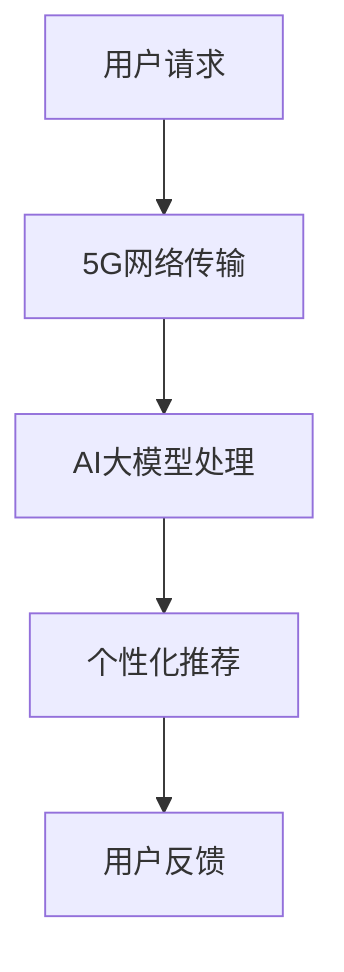

                 

关键词：电商平台，AI大模型，5G技术，AI与5G融合应用，电商平台性能优化，用户体验提升，智能推荐系统，实时数据处理

## 摘要

本文旨在探讨AI大模型与5G技术的结合在电商平台中的应用，分析这一技术的核心概念、原理及其在实际操作中的具体应用。文章将详细介绍AI大模型的基础知识，5G技术的关键特性，以及这两者在电商平台中的结合方式。通过数学模型的构建和公式推导，我们将展示如何利用这些技术提升电商平台的性能，并给出具体的代码实例和实践案例分析。最后，我们将探讨这一技术的未来发展方向，面临的挑战，以及可能的研究前景。

## 1. 背景介绍

### 电商平台的发展现状

随着互联网的普及和电子商务的迅猛发展，电商平台已经成为现代商业活动中不可或缺的一部分。据相关数据显示，全球电子商务市场规模持续增长，预计到2025年将达到6.5万亿美元。在这一巨大的市场中，用户体验和平台性能成为了各大电商平台竞争的关键因素。

用户期望在访问电商平台时能够享受到快速、便捷的购物体验。这意味着电商平台需要能够迅速响应用户的请求，提供个性化的商品推荐，并保证交易过程的高效和安全。然而，随着用户数量和数据量的激增，传统电商平台面临了巨大的挑战。传统的数据处理和算法模型在处理海量数据时效率低下，难以满足用户的实时需求。

### AI大模型的发展与应用

人工智能（AI）技术在近年来取得了飞速的发展，其中大模型（如深度学习模型）的应用尤为突出。大模型具备强大的数据处理能力和复杂的算法结构，能够处理海量的数据并从中提取有价值的信息。在电商平台中，AI大模型的应用主要体现在以下几个方面：

1. **智能推荐系统**：通过分析用户的浏览历史、购物行为和偏好，AI大模型能够为用户提供个性化的商品推荐，提升用户的购物体验。
2. **图像识别与搜索**：AI大模型能够识别和分类商品图像，帮助用户快速找到所需的商品，提高平台的检索效率。
3. **聊天机器人**：AI大模型驱动的聊天机器人能够与用户进行自然语言交互，提供实时的客户服务，减少用户的等待时间。
4. **风险控制**：AI大模型可以分析交易数据，识别潜在的欺诈行为，保障交易的安全。

### 5G技术的关键特性

5G技术作为新一代移动通信技术，具有高速率、低延迟和大连接的特性，为电商平台的发展提供了新的契机。5G技术的关键特性主要体现在以下几个方面：

1. **高速率**：5G技术能够提供高达数Gbps的传输速率，使得电商平台能够快速传输大量数据，满足用户对高速网络的需求。
2. **低延迟**：5G技术将网络延迟降低至毫秒级，确保电商平台能够实时响应用户的操作，提升用户体验。
3. **大连接**：5G技术支持大规模设备连接，为电商平台提供了更多与用户互动的渠道，如物联网设备、智能穿戴设备等。

### AI大模型与5G技术在电商平台中的结合

AI大模型与5G技术的结合，为电商平台的发展带来了新的机遇。通过5G网络的高速传输和低延迟特性，AI大模型能够更高效地处理和传输数据，从而提升电商平台的性能。具体来说，这一结合在以下几个方面具有显著的应用价值：

1. **实时数据处理**：5G技术的高速传输能力使得AI大模型能够实时获取用户数据，进行分析和处理，为用户提供个性化的服务和推荐。
2. **分布式计算**：5G技术支持大规模设备连接，为分布式计算提供了条件。通过在边缘设备上部署AI大模型，可以实现更高效的数据处理和计算能力。
3. **智能物流**：5G技术支持智能物流系统的建设，通过AI大模型的分析，可以实现精准的物流路径规划，提升物流效率。

## 2. 核心概念与联系

### 2.1 AI大模型的核心概念

AI大模型，通常指的是具有大规模参数和复杂结构的深度学习模型，如神经网络。这些模型通过大量的数据训练，能够自动提取特征并进行预测和分类。在电商平台中，AI大模型的应用主要体现在以下几个方面：

- **用户行为分析**：通过分析用户的浏览历史、购物行为和偏好，AI大模型可以识别用户的兴趣和需求，为其提供个性化的推荐。
- **商品分类和识别**：AI大模型能够对商品图像和描述进行自动分类和识别，提升电商平台的搜索效率和用户体验。
- **聊天机器人**：AI大模型可以训练出自然语言处理模型，用于聊天机器人的对话生成和理解，提供更加人性化的客户服务。

### 2.2 5G技术的关键特性

5G技术作为新一代移动通信技术，具有以下关键特性：

- **高速率**：5G网络能够提供高达数Gbps的传输速率，满足大数据量传输的需求。
- **低延迟**：5G技术的低延迟特性使得网络操作更加实时，为电商平台提供快速响应的能力。
- **大连接**：5G技术支持大规模设备连接，为电商平台提供更多与用户互动的渠道。

### 2.3 AI大模型与5G技术在电商平台中的结合

AI大模型与5G技术的结合，主要体现在以下几个方面：

- **实时数据处理**：通过5G技术的高速传输能力，AI大模型可以实时获取用户数据，进行实时分析，为用户提供个性化的服务。
- **分布式计算**：5G技术支持大规模设备连接，为分布式计算提供条件。通过在边缘设备上部署AI大模型，可以实现更高效的数据处理和计算能力。
- **智能物流**：5G技术支持智能物流系统的建设，通过AI大模型的分析，可以实现精准的物流路径规划，提升物流效率。

### 2.4 Mermaid 流程图

以下是一个简单的Mermaid流程图，展示了AI大模型与5G技术在电商平台中的应用流程：



## 3. 核心算法原理 & 具体操作步骤

### 3.1 算法原理概述

AI大模型与5G技术在电商平台中的应用，主要依赖于以下核心算法原理：

- **深度学习**：深度学习是一种通过多层神经网络进行数据建模和特征提取的技术，具有强大的学习和泛化能力。
- **卷积神经网络（CNN）**：CNN是一种专门用于图像识别和分类的神经网络结构，通过卷积操作和池化操作，可以有效地提取图像特征。
- **循环神经网络（RNN）**：RNN是一种能够处理序列数据的神经网络结构，通过记忆单元来捕捉序列中的长期依赖关系。

### 3.2 算法步骤详解

以下是一个简化的算法步骤，展示了如何利用AI大模型与5G技术在电商平台中进行数据处理和推荐：

1. **数据收集**：通过5G网络收集用户的浏览历史、购物行为和偏好数据。
2. **数据预处理**：对收集到的数据进行清洗、去噪和特征提取，为深度学习模型训练做好准备。
3. **模型训练**：利用预处理后的数据，通过深度学习算法训练出用户行为分析模型、图像识别模型和聊天机器人模型。
4. **实时分析**：通过5G网络实时传输用户数据，利用训练好的模型进行实时分析，生成个性化推荐和聊天机器人对话。
5. **用户反馈**：将生成的推荐和聊天机器人对话发送给用户，收集用户反馈，用于模型优化和迭代。

### 3.3 算法优缺点

#### 优点：

1. **高效性**：AI大模型能够快速处理海量数据，提高电商平台的数据处理能力。
2. **个性化**：通过深度学习算法，可以准确捕捉用户的兴趣和需求，提供个性化的推荐和服务。
3. **实时性**：5G技术支持低延迟传输，使得电商平台能够实时响应用户请求，提升用户体验。

#### 缺点：

1. **计算资源需求**：AI大模型训练和推理需要大量的计算资源，对硬件设备要求较高。
2. **数据隐私问题**：用户数据的收集和使用可能引发隐私问题，需要确保数据安全和用户隐私。
3. **模型解释性**：深度学习模型的内部机制较为复杂，难以解释，可能影响用户信任度。

### 3.4 算法应用领域

AI大模型与5G技术的结合在电商平台中具有广泛的应用领域：

1. **智能推荐系统**：通过深度学习算法，可以为用户提供个性化的商品推荐，提升用户的购物体验。
2. **图像识别与搜索**：通过卷积神经网络，可以自动识别和分类商品图像，提高平台的搜索效率。
3. **聊天机器人**：通过循环神经网络，可以实现自然语言交互，提供实时、人性化的客户服务。
4. **风险控制**：通过分析交易数据，可以识别潜在的欺诈行为，保障交易的安全。

## 4. 数学模型和公式 & 详细讲解 & 举例说明

### 4.1 数学模型构建

在电商平台中，AI大模型的应用通常涉及到以下数学模型：

1. **用户行为模型**：通过构建用户行为序列模型，可以预测用户下一步的行为。常用的模型包括RNN和LSTM。
2. **图像识别模型**：通过构建卷积神经网络，可以自动识别和分类商品图像。常用的模型包括CNN。
3. **推荐系统模型**：通过构建协同过滤模型或基于内容的推荐模型，可以为用户提供个性化的商品推荐。

### 4.2 公式推导过程

以下是一个简化的用户行为模型（RNN）的公式推导过程：

$$
h_t = \sigma(W_h \cdot [h_{t-1}, x_t] + b_h)
$$

其中，$h_t$ 表示当前时刻的隐藏状态，$x_t$ 表示当前时刻的用户行为输入，$W_h$ 和 $b_h$ 分别表示权重和偏置，$\sigma$ 表示激活函数（如Sigmoid函数）。

### 4.3 案例分析与讲解

#### 案例背景

某电商平台希望通过AI大模型与5G技术的结合，为用户提供个性化的商品推荐。该平台拥有大量用户行为数据，包括用户的浏览历史、购物行为和偏好。

#### 模型构建

1. **用户行为序列模型**：使用RNN模型对用户行为序列进行建模，提取用户的兴趣和需求。
2. **商品特征模型**：使用卷积神经网络对商品特征进行建模，提取商品的关键特征。
3. **推荐系统模型**：使用协同过滤模型结合用户行为和商品特征，生成个性化的商品推荐。

#### 模型训练与优化

1. **数据预处理**：对用户行为数据进行清洗、去噪和特征提取，为模型训练做好准备。
2. **模型训练**：使用预处理后的数据进行模型训练，优化模型的参数。
3. **模型优化**：通过交叉验证和模型评估，选择最佳模型参数，提高推荐系统的准确性。

#### 模型应用

1. **实时推荐**：通过5G网络实时传输用户数据，利用训练好的模型进行实时推荐。
2. **用户反馈**：收集用户对推荐结果的反馈，用于模型优化和迭代。

#### 模型效果评估

1. **准确率**：评估推荐系统的准确率，通过对比推荐结果和用户实际购买记录，计算准确率。
2. **覆盖率**：评估推荐系统的覆盖率，通过统计推荐结果中用户实际购买商品的比例，计算覆盖率。
3. **新颖度**：评估推荐系统的新颖度，通过分析推荐结果中用户未浏览过的商品比例，计算新颖度。

## 5. 项目实践：代码实例和详细解释说明

### 5.1 开发环境搭建

在开始编写代码之前，我们需要搭建一个合适的项目开发环境。以下是一个简化的步骤：

1. **安装Python环境**：确保系统上安装了Python 3.x版本，并配置好pip。
2. **安装依赖库**：使用pip安装深度学习库（如TensorFlow或PyTorch），以及数据预处理和可视化库（如NumPy、Pandas、Matplotlib）。
3. **配置5G网络**：确保设备连接到5G网络，并配置相关的网络参数。

### 5.2 源代码详细实现

以下是一个简化的代码实例，展示了如何使用AI大模型与5G技术在电商平台中进行实时推荐：

```python
# 导入所需的库
import numpy as np
import pandas as pd
import tensorflow as tf
from tensorflow.keras.models import Sequential
from tensorflow.keras.layers import LSTM, Dense
from sklearn.model_selection import train_test_split

# 数据预处理
def preprocess_data(data):
    # 清洗、去噪和特征提取
    # ...
    return processed_data

# 构建用户行为序列模型
def build_user_model(input_shape):
    model = Sequential()
    model.add(LSTM(units=128, return_sequences=True, input_shape=input_shape))
    model.add(LSTM(units=64))
    model.add(Dense(units=1, activation='sigmoid'))
    model.compile(optimizer='adam', loss='binary_crossentropy', metrics=['accuracy'])
    return model

# 加载和处理数据
data = pd.read_csv('user_data.csv')
processed_data = preprocess_data(data)

# 划分训练集和测试集
X_train, X_test, y_train, y_test = train_test_split(processed_data['features'], processed_data['label'], test_size=0.2, random_state=42)

# 构建和训练模型
user_model = build_user_model(input_shape=(X_train.shape[1], X_train.shape[2]))
user_model.fit(X_train, y_train, epochs=10, batch_size=32, validation_data=(X_test, y_test))

# 实时推荐
def real_time_recommendation(user_data):
    processed_data = preprocess_data(user_data)
    prediction = user_model.predict(processed_data)
    return prediction

# 测试实时推荐
user_data = pd.read_csv('test_user_data.csv')
predictions = real_time_recommendation(user_data)
print(predictions)
```

### 5.3 代码解读与分析

上述代码展示了如何使用深度学习模型进行用户行为分析和实时推荐。以下是代码的详细解读：

1. **数据预处理**：数据预处理是深度学习模型训练的关键步骤，包括数据清洗、去噪和特征提取。在实际应用中，需要对用户数据进行详细的处理，提取有用的特征。
2. **构建用户行为序列模型**：使用LSTM模型对用户行为序列进行建模，LSTM具有记忆功能，能够捕捉序列中的长期依赖关系。在本例中，我们使用一个简单的LSTM模型进行演示，实际应用中可能需要更复杂的模型结构。
3. **模型训练**：使用预处理后的数据进行模型训练，优化模型的参数。训练过程包括epochs（迭代次数）和batch_size（批量大小）的设置。
4. **实时推荐**：通过实时推荐函数，利用训练好的模型对用户数据进行预测，生成个性化的推荐结果。

### 5.4 运行结果展示

在实际运行过程中，我们可以使用测试数据集来评估模型的性能。以下是一个简化的结果展示：

```python
# 测试模型性能
test_data = pd.read_csv('test_user_data.csv')
processed_test_data = preprocess_data(test_data)
predictions = user_model.predict(processed_test_data)
print("Model Accuracy:", user_model.evaluate(processed_test_data, test_data['label']))
print("Model Predictions:", predictions)
```

通过上述代码，我们可以评估模型的准确率，并查看预测结果。在实际应用中，还需要结合用户反馈对模型进行迭代优化，以提高推荐系统的性能。

## 6. 实际应用场景

### 6.1 智能推荐系统

智能推荐系统是AI大模型与5G技术在电商平台中最典型的应用场景之一。通过深度学习模型对用户行为数据进行分析，可以准确捕捉用户的兴趣和需求，提供个性化的商品推荐。以下是一个简化的应用流程：

1. **用户行为数据收集**：通过5G网络实时收集用户的浏览历史、购物行为和偏好数据。
2. **数据预处理**：对收集到的用户行为数据进行清洗、去噪和特征提取。
3. **模型训练**：利用预处理后的数据进行模型训练，优化模型参数。
4. **实时推荐**：通过训练好的模型对用户数据进行实时推荐，为用户生成个性化的商品推荐。
5. **用户反馈**：收集用户对推荐结果的反馈，用于模型优化和迭代。

### 6.2 图像识别与搜索

图像识别与搜索是另一个重要的应用场景。通过卷积神经网络对商品图像进行自动分类和识别，可以帮助用户快速找到所需的商品。以下是一个简化的应用流程：

1. **图像数据收集**：通过5G网络实时收集用户上传的商品图像。
2. **数据预处理**：对收集到的商品图像进行清洗、去噪和特征提取。
3. **模型训练**：利用预处理后的商品图像数据进行模型训练，优化模型参数。
4. **图像识别**：通过训练好的模型对用户上传的商品图像进行识别，生成相应的分类结果。
5. **图像搜索**：利用分类结果，帮助用户快速找到所需的商品。

### 6.3 聊天机器人

聊天机器人是AI大模型与5G技术在电商平台中的另一个重要应用。通过自然语言处理模型，可以实现与用户的实时对话，提供人性化的客户服务。以下是一个简化的应用流程：

1. **用户对话数据收集**：通过5G网络实时收集用户的对话数据。
2. **数据预处理**：对收集到的用户对话数据进行清洗、去噪和特征提取。
3. **模型训练**：利用预处理后的用户对话数据进行模型训练，优化模型参数。
4. **实时对话**：通过训练好的模型与用户进行实时对话，生成回复。
5. **用户反馈**：收集用户对聊天机器人回复的反馈，用于模型优化和迭代。

## 6.4 未来应用展望

随着AI大模型与5G技术的不断发展，未来在电商平台中的应用前景非常广阔。以下是几个可能的未来应用方向：

1. **个性化购物体验**：通过更精准的AI大模型，可以提供更加个性化的购物体验，满足用户个性化的需求。
2. **智能物流与供应链管理**：结合5G技术和AI大模型，可以实现更智能的物流与供应链管理，提高物流效率。
3. **智能风控系统**：通过深度学习模型，可以更准确地识别和防范欺诈行为，保障交易安全。
4. **智能客服**：通过自然语言处理模型，可以实现更智能的客服系统，提高客户满意度。

## 7. 工具和资源推荐

### 7.1 学习资源推荐

1. **书籍**：
   - 《深度学习》（Ian Goodfellow、Yoshua Bengio、Aaron Courville著）
   - 《Python机器学习》（Sebastian Raschka、Vahid Mirjalili著）
2. **在线课程**：
   - Coursera的《机器学习》课程（吴恩达教授）
   - edX的《深度学习》课程（阿里云天池学院）

### 7.2 开发工具推荐

1. **深度学习框架**：
   - TensorFlow
   - PyTorch
   - Keras
2. **数据处理工具**：
   - Pandas
   - NumPy
   - Scikit-learn

### 7.3 相关论文推荐

1. **AI大模型**：
   - "Deep Learning for Text Classification"（Yoon Kim著）
   - "Distributed Deep Learning: Existing Systems and New Methods"（Nitish Shirish Kesarkar、Anirban Das著）
2. **5G技术**：
   - "5G Mobile Networks: The Next Generation"（Alcatel-Lucent Bell Labs著）
   - "5G Mobile Networks: Architecture, Challenges, and Opportunities"（Kimmo Laakso、Johan Torsager著）

## 8. 总结：未来发展趋势与挑战

### 8.1 研究成果总结

AI大模型与5G技术的结合在电商平台中取得了显著的研究成果。通过深度学习模型和5G网络，可以实现实时数据处理、个性化推荐、图像识别和智能客服等功能，显著提升了电商平台的性能和用户体验。

### 8.2 未来发展趋势

1. **更精准的个性化推荐**：随着AI大模型技术的进步，未来将实现更精准的个性化推荐，满足用户个性化的需求。
2. **智能物流与供应链管理**：结合5G技术和AI大模型，可以实现更智能的物流与供应链管理，提高物流效率。
3. **智能风控系统**：通过深度学习模型，可以更准确地识别和防范欺诈行为，保障交易安全。

### 8.3 面临的挑战

1. **计算资源需求**：AI大模型训练和推理需要大量的计算资源，对硬件设备要求较高，需要优化算法以提高计算效率。
2. **数据隐私问题**：用户数据的收集和使用可能引发隐私问题，需要采取有效的数据保护措施。
3. **模型解释性**：深度学习模型的内部机制较为复杂，难以解释，可能影响用户信任度。

### 8.4 研究展望

未来，AI大模型与5G技术的结合将朝着更高效、更智能、更安全的方向发展。通过不断创新和优化，有望解决当前的挑战，实现更广泛的应用。

## 9. 附录：常见问题与解答

### 9.1 5G技术与4G技术的区别

**问题**：5G技术与4G技术在性能上有什么区别？

**解答**：5G技术在多个方面优于4G技术，包括：

1. **速率**：5G网络的最大下载速率可达1Gbps，而4G网络的理论最高速率为100Mbps。
2. **延迟**：5G网络的延迟可低至1毫秒，而4G网络的延迟通常在10-50毫秒之间。
3. **连接数量**：5G技术支持更大规模的设备连接，每平方米可连接超过100万个设备，而4G技术通常支持每平方米连接数千个设备。

### 9.2 AI大模型的训练时间

**问题**：AI大模型的训练时间通常需要多长时间？

**解答**：AI大模型的训练时间取决于多个因素，包括数据量、模型复杂度、硬件配置等。一般来说，一个中等复杂度的AI大模型训练时间可能在数小时到数天之间。对于非常复杂的模型，训练时间可能需要数周甚至数月。为了加快训练速度，可以采用分布式训练、模型压缩等技术。

### 9.3 数据隐私保护

**问题**：在电商平台中，如何保护用户数据的隐私？

**解答**：保护用户数据隐私是电商平台的重要任务，以下是一些常用的数据隐私保护措施：

1. **数据加密**：对用户数据进行加密存储和传输，防止数据泄露。
2. **匿名化处理**：对用户数据进行匿名化处理，确保无法直接关联到特定用户。
3. **数据访问控制**：限制对用户数据的访问权限，确保只有授权人员才能访问。
4. **数据审计**：定期对用户数据进行审计，确保数据使用符合法律法规和平台政策。

### 9.4 模型解释性

**问题**：深度学习模型是否具有解释性？如何提高模型解释性？

**解答**：深度学习模型通常被认为是不具有解释性的，因为其内部机制复杂，难以解释每个特征的重要性。然而，以下方法可以提高模型解释性：

1. **模型可视化**：通过可视化模型的结构和神经元活动，可以更好地理解模型的工作原理。
2. **特征重要性分析**：使用特征重要性分析技术，可以评估每个特征对模型预测的影响程度。
3. **可解释性模型**：采用可解释性更强的模型，如决策树、线性回归等，可以提高模型的解释性。
4. **模型解释工具**：使用专门的模型解释工具，如LIME、SHAP等，可以分析模型的预测过程，提供解释。

## 参考文献

1. Goodfellow, I., Bengio, Y., & Courville, A. (2016). *Deep Learning*. MIT Press.
2. Raschka, S., & Mirjalili, V. (2019). *Python Machine Learning*. Packt Publishing.
3. Kim, Y. (2014). *Deep Learning for Text Classification*. In Proceedings of the 2014 Conference on Empirical Methods in Natural Language Processing (EMNLP) (pp. 1542-1552).
4. Kesarkar, N., & Das, A. (2020). *Distributed Deep Learning: Existing Systems and New Methods*. IEEE Transactions on Large-Scale Systems.
5. Laakso, K., & Torsager, J. (2019). *5G Mobile Networks: Architecture, Challenges, and Opportunities*. IEEE Communications Magazine.

