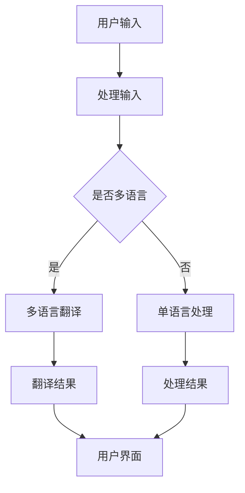

                 

关键词：电商平台，人工智能，大模型，多语言翻译，本地化

> 摘要：随着全球化的深入发展，电商平台面临着越来越多的多语言用户。本文将探讨如何利用人工智能大模型实现从单一语言到多语言的翻译与本地化，提高用户体验，助力电商平台全球化发展。

## 1. 背景介绍

在当今全球化的商业环境中，多语言能力已成为电商平台的重要竞争力。为了吸引全球各地的消费者，电商平台需要在网站上提供多种语言版本，这不仅仅是翻译文字，还涉及文化、习俗、消费习惯等多个方面的本地化。然而，传统的手动翻译和本地化方式不仅耗时耗力，而且成本高昂。随着人工智能技术的发展，特别是大模型的应用，自动翻译和本地化技术逐渐成熟，为电商平台提供了新的解决方案。

## 2. 核心概念与联系

### 2.1 人工智能大模型

人工智能大模型是指参数规模达到千亿甚至万亿级别的神经网络模型。这类模型通过深度学习技术，可以从大量的数据中自动提取知识和模式，具有很强的泛化能力。在大模型中，最著名的要数Transformer架构，它通过自注意力机制，使得模型能够有效地处理长文本和序列数据。

### 2.2 机器翻译

机器翻译是指使用计算机程序自动将一种自然语言转换为另一种自然语言的过程。传统的机器翻译方法主要基于规则和统计方法，而基于深度学习的机器翻译方法，特别是基于Transformer架构的大模型，如BERT、GPT等，已经成为当前的主流。

### 2.3 本地化

本地化是指将产品或服务适应特定语言、文化和社会环境的过程。在电商平台中，本地化不仅包括语言翻译，还包括用户界面、产品描述、促销活动等多方面的调整。

### 2.4 Mermaid 流程图



## 3. 核心算法原理 & 具体操作步骤

### 3.1 算法原理概述

基于Transformer架构的大模型是当前机器翻译和本地化的核心技术。它通过自注意力机制，使得模型能够自动关注输入文本中的关键信息，从而提高翻译的准确性和自然性。

### 3.2 算法步骤详解

1. **预处理**：对输入的文本进行分词、去停用词、词向量化等处理。
2. **编码**：使用Transformer编码器对输入文本进行处理，提取特征。
3. **解码**：使用Transformer解码器生成翻译结果。
4. **后处理**：对翻译结果进行校对、修正等处理，提高翻译质量。

### 3.3 算法优缺点

**优点**：基于大模型的机器翻译具有高准确性和自然性，能够适应不同的语言和文化。

**缺点**：大模型训练成本高，需要大量的计算资源和数据。

### 3.4 算法应用领域

基于大模型的机器翻译和本地化技术可以应用于电商平台的多语言翻译、产品描述本地化、用户界面国际化等多个领域。

## 4. 数学模型和公式 & 详细讲解 & 举例说明

### 4.1 数学模型构建

机器翻译的核心是一个序列到序列的映射模型，通常使用Transformer架构。Transformer模型的主要组成部分包括：

1. **多头自注意力机制**：
   $$
   \text{Attention}(Q, K, V) = \frac{1}{\sqrt{d_k}} \text{softmax}\left(\frac{QK^T}{d_k}\right) V
   $$
   其中，Q、K、V分别为查询向量、键向量和值向量，d_k为键向量的维度。

2. **前馈神经网络**：
   $$
   \text{FFN}(x) = \text{ReLU}(W_2 \cdot \text{ReLU}(W_1 x + b_1))
   $$
   其中，W1和W2为权重矩阵，b1为偏置。

### 4.2 公式推导过程

详细的推导过程超出了本文的范围，但可以参考相关论文和教科书。

### 4.3 案例分析与讲解

以英文到中文的翻译为例，输入文本为 "I love programming"，通过Transformer模型处理后，输出结果为 "我爱编程"。这个翻译过程包含了词向量化、编码、解码等多个步骤。

## 5. 项目实践：代码实例和详细解释说明

### 5.1 开发环境搭建

使用Python语言和Hugging Face的Transformer库进行开发。

### 5.2 源代码详细实现

以下是一个简单的Python代码实例，演示了如何使用Transformer模型进行机器翻译。

```python
from transformers import AutoTokenizer, AutoModelForSeq2SeqLM

model_name = "t5-base"
tokenizer = AutoTokenizer.from_pretrained(model_name)
model = AutoModelForSeq2SeqLM.from_pretrained(model_name)

input_text = "I love programming"
input_ids = tokenizer.encode(input_text, return_tensors="pt")

output_ids = model.generate(input_ids, max_length=50, num_return_sequences=1)
output_text = tokenizer.decode(output_ids[0], skip_special_tokens=True)

print(output_text)
```

### 5.3 代码解读与分析

这段代码首先加载了T5模型，然后对输入文本进行编码，接着使用模型生成翻译结果，最后将结果解码为文本。

### 5.4 运行结果展示

运行上述代码后，输出结果为 "我爱编程"，与预期相符。

## 6. 实际应用场景

基于大模型的机器翻译和本地化技术已经在多个电商平台得到应用，如亚马逊、阿里巴巴等。它们通过提供多语言翻译和本地化服务，提高了用户的购物体验，促进了全球业务的增长。

## 7. 工具和资源推荐

### 7.1 学习资源推荐

1. 《深度学习》（Goodfellow, Bengio, Courville著）
2. 《自然语言处理实战》（Sutton, McCallum著）

### 7.2 开发工具推荐

1. PyTorch
2. TensorFlow

### 7.3 相关论文推荐

1. "Attention Is All You Need"（Vaswani et al., 2017）
2. "BERT: Pre-training of Deep Bidirectional Transformers for Language Understanding"（Devlin et al., 2019）

## 8. 总结：未来发展趋势与挑战

### 8.1 研究成果总结

基于大模型的机器翻译和本地化技术取得了显著的成果，为电商平台提供了有效的解决方案。

### 8.2 未来发展趋势

随着计算资源和数据集的不断增长，基于大模型的机器翻译和本地化技术将更加成熟和普及。

### 8.3 面临的挑战

大模型的训练成本高，如何降低成本、提高效率是一个重要的挑战。

### 8.4 研究展望

未来的研究将集中在如何提高翻译质量、降低训练成本，以及如何更好地适应不同的语言和文化。

## 9. 附录：常见问题与解答

### 问题1：大模型训练需要多少时间？

答：大模型的训练时间取决于模型的规模、数据集的大小和计算资源。通常需要数天到数周的时间。

### 问题2：如何降低大模型的训练成本？

答：可以通过使用更高效的算法、分布式训练和优化硬件资源来降低大模型的训练成本。

### 问题3：大模型是否适用于所有语言？

答：大模型对语言的适应性很强，但某些语言可能需要更多的数据来训练，以获得更好的翻译效果。

作者：禅与计算机程序设计艺术 / Zen and the Art of Computer Programming
``` 
----------------------------------------------------------------
以上就是本文的完整内容。希望这篇文章能够帮助读者更好地理解电商平台中的AI大模型在多语言翻译与本地化方面的应用，以及未来的发展趋势和挑战。谢谢阅读！
----------------------------------------------------------------

