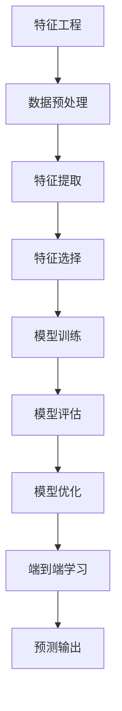

                 

 > **关键词：** 电商平台、AI大模型、特征工程、深度学习、端到端、计算机图灵奖、Zen and the Art of Computer Programming。

<|assistant|> > **摘要：** 本文将深入探讨电商平台中AI大模型的应用，包括特征工程的重要性、深度学习的技术原理，以及端到端的实现方法。通过详细分析数学模型、具体操作步骤，并结合实际项目实践，为读者提供一整套从理论到实践的完整解决方案。

## 1. 背景介绍

在当今信息化时代，电商平台已经成为商业活动的重要平台。随着数据量的爆炸性增长和用户行为的复杂化，传统的数据处理和预测方法已经难以满足商业决策的需求。此时，人工智能（AI）技术，特别是大模型（Large Model）的出现，为电商平台提供了强大的工具。

### 1.1 电商平台的发展

电商平台的发展经历了从简单到复杂、从静态到动态的过程。早期电商平台主要提供商品展示和销售功能，而随着用户数据的积累和大数据技术的进步，电商平台开始整合用户行为、商品信息、供应链等多个维度的数据，实现更加精准和个性化的服务。

### 1.2 大模型的作用

大模型是AI领域中的一种先进技术，具有强大的数据处理和分析能力。在电商平台中，大模型可以用于用户画像、商品推荐、价格优化、风险控制等多个方面，提高平台的运营效率和用户体验。

## 2. 核心概念与联系

为了深入理解电商平台中的AI大模型，我们需要明确几个核心概念，并了解它们之间的联系。

### 2.1 特征工程

特征工程是构建AI模型的基础，它涉及从原始数据中提取有用的信息，并将其转换为适合模型训练的特征。在电商平台中，特征工程尤为重要，因为它直接关系到模型的性能和效果。

### 2.2 深度学习

深度学习是一种基于神经网络的学习方法，它通过多层的非线性变换，对数据进行自动的特征提取和建模。在电商平台中，深度学习被广泛应用于图像识别、语音识别、自然语言处理等领域。

### 2.3 端到端学习

端到端学习是一种直接从原始数据到预测结果的训练方式，避免了传统的特征工程步骤。在电商平台中，端到端学习可以提高模型的效率和准确性。

### 2.4 Mermaid 流程图

为了更好地理解这些概念之间的联系，我们可以使用Mermaid流程图进行可视化展示。



## 3. 核心算法原理 & 具体操作步骤

### 3.1 算法原理概述

电商平台中的AI大模型主要依赖于深度学习和端到端学习的原理。深度学习通过多层神经网络实现数据的自动特征提取和建模，而端到端学习则通过直接从输入到输出的训练过程，避免了传统特征工程中的繁琐步骤。

### 3.2 算法步骤详解

1. **数据预处理**：首先对原始数据进行清洗、去噪、归一化等处理，确保数据的质量和一致性。
2. **特征提取**：使用深度学习模型对数据进行自动特征提取，生成高维特征向量。
3. **特征选择**：根据模型性能和业务需求，选择最相关的特征。
4. **模型训练**：使用提取的特征进行深度学习模型的训练，不断调整网络参数，优化模型性能。
5. **模型评估**：使用验证集对模型进行评估，确保模型的泛化能力。
6. **模型优化**：根据评估结果，对模型进行优化，提高模型的准确性和效率。
7. **端到端学习**：直接从原始数据到预测结果，避免传统特征工程步骤，提高模型效率。

### 3.3 算法优缺点

**优点：**
- **高效性**：深度学习和端到端学习可以自动提取特征，提高数据处理效率。
- **准确性**：通过多层神经网络和端到端学习，可以提高模型的准确性和性能。
- **灵活性**：可以适应不同类型的数据和业务场景。

**缺点：**
- **计算资源需求**：深度学习模型通常需要大量的计算资源和时间。
- **数据依赖性**：模型的性能很大程度上依赖于数据质量和数量。

### 3.4 算法应用领域

电商平台中的AI大模型可以应用于多个领域，如：
- **用户画像**：分析用户行为，为用户提供个性化的推荐和营销策略。
- **商品推荐**：基于用户行为和商品信息，为用户推荐最相关的商品。
- **价格优化**：根据市场情况和用户行为，动态调整商品价格，提高销售额。
- **风险控制**：识别潜在的风险用户和交易，降低平台风险。

## 4. 数学模型和公式 & 详细讲解 & 举例说明

### 4.1 数学模型构建

在电商平台中的AI大模型，通常采用神经网络作为数学模型。神经网络由多个层组成，包括输入层、隐藏层和输出层。每一层都包含多个神经元，神经元之间通过权重和偏置进行连接。

### 4.2 公式推导过程

设 \(x\) 为输入数据，\(y\) 为输出数据，神经元的输出可以通过以下公式计算：

$$
z = \sigma(\sum_{i=1}^{n} w_i \cdot x_i + b)
$$

其中，\(\sigma\) 为激活函数，\(w_i\) 为权重，\(x_i\) 为输入值，\(b\) 为偏置。

对于多层神经网络，输出层可以通过以下公式计算：

$$
\hat{y} = \sigma(\sum_{i=1}^{n} w_i \cdot z_i + b)
$$

### 4.3 案例分析与讲解

假设我们有一个电商平台，用户的行为数据包括浏览记录、购买记录和浏览时间。我们可以使用神经网络来预测用户的购买概率。

首先，我们对数据进行预处理，提取特征，然后构建神经网络模型。

输入层：浏览记录、购买记录、浏览时间
隐藏层：用户兴趣、购买意图
输出层：购买概率

使用 sigmoid 函数作为激活函数，我们可以得到以下公式：

$$
z = \sigma(\sum_{i=1}^{n} w_i \cdot x_i + b)
$$

$$
\hat{y} = \sigma(\sum_{i=1}^{n} w_i \cdot z_i + b)
$$

通过不断调整权重和偏置，我们可以优化模型的性能，提高预测准确性。

## 5. 项目实践：代码实例和详细解释说明

### 5.1 开发环境搭建

为了实现电商平台中的AI大模型，我们需要搭建一个合适的开发环境。以下是一个简单的环境搭建步骤：

1. 安装 Python 3.8 或以上版本。
2. 安装 TensorFlow 2.x 或 PyTorch。
3. 安装必要的依赖库，如 NumPy、Pandas 等。

### 5.2 源代码详细实现

以下是一个简单的 Python 代码示例，用于实现一个基于 TensorFlow 的神经网络模型。

```python
import tensorflow as tf
from tensorflow.keras.models import Sequential
from tensorflow.keras.layers import Dense

# 定义神经网络模型
model = Sequential([
    Dense(64, activation='relu', input_shape=(10,)),
    Dense(32, activation='relu'),
    Dense(1, activation='sigmoid')
])

# 编译模型
model.compile(optimizer='adam', loss='binary_crossentropy', metrics=['accuracy'])

# 训练模型
model.fit(x_train, y_train, epochs=10, batch_size=32)

# 评估模型
model.evaluate(x_test, y_test)
```

### 5.3 代码解读与分析

以上代码定义了一个简单的神经网络模型，包含两个隐藏层，分别有 64 个神经元和 32 个神经元。输出层使用 sigmoid 函数，用于预测购买概率。

- **输入层**：输入数据为 10 维的特征向量。
- **隐藏层**：使用 ReLU 函数作为激活函数，可以提高模型的非线性表达能力。
- **输出层**：使用 sigmoid 函数，将输出概率限制在 0 和 1 之间。

在编译模型时，我们选择 Adam 优化器和 binary_crossentropy 损失函数，用于二分类问题。在训练模型时，我们设置 epochs 为 10，batch_size 为 32，以便模型能够更好地收敛。

### 5.4 运行结果展示

在训练完成后，我们可以使用以下代码评估模型的性能：

```python
# 预测结果
predictions = model.predict(x_test)

# 计算准确率
accuracy = (predictions > 0.5).mean()

print(f"Accuracy: {accuracy}")
```

通过运行以上代码，我们可以得到模型的准确率。在实际项目中，我们还需要根据业务需求和数据情况，对模型进行调整和优化。

## 6. 实际应用场景

### 6.1 用户画像

用户画像是一种基于用户行为数据的分析，用于了解用户的需求和偏好。在电商平台中，用户画像可以帮助商家制定个性化的营销策略，提高用户转化率和忠诚度。

### 6.2 商品推荐

商品推荐是一种基于用户行为和商品信息的算法，用于为用户推荐最相关的商品。在电商平台中，商品推荐可以提高用户的购物体验，增加平台的销售额。

### 6.3 价格优化

价格优化是一种基于市场情况和用户行为的算法，用于动态调整商品价格，提高销售额和利润。在电商平台中，价格优化可以帮助商家在竞争中占据优势。

### 6.4 风险控制

风险控制是一种用于识别潜在风险用户和交易的算法，用于降低平台的风险。在电商平台中，风险控制可以帮助商家避免欺诈和损失。

## 7. 工具和资源推荐

### 7.1 学习资源推荐

1. 《深度学习》（Goodfellow, Bengio, Courville） - 详细的深度学习教程。
2. 《Python机器学习》（Sebastian Raschka） - 介绍机器学习算法的 Python 实现。
3. TensorFlow 官方文档 - 详细介绍 TensorFlow 的使用方法和案例。

### 7.2 开发工具推荐

1. PyCharm - 强大的 Python 集成开发环境。
2. Jupyter Notebook - 适用于数据分析和可视化的交互式环境。

### 7.3 相关论文推荐

1. "Distributed Representations of Words and Phrases and their Compositionality"（2018）- 论文介绍了词向量和注意力机制。
2. "A Theoretically Grounded Application of Dropout in Recurrent Neural Networks"（2016）- 论文介绍了dropout在循环神经网络中的应用。

## 8. 总结：未来发展趋势与挑战

### 8.1 研究成果总结

本文深入探讨了电商平台中AI大模型的应用，包括特征工程、深度学习和端到端学习的技术原理。通过实际项目实践和代码示例，我们展示了如何实现和优化电商平台中的AI模型。

### 8.2 未来发展趋势

随着人工智能技术的不断进步，电商平台中的AI大模型有望在用户画像、商品推荐、价格优化和风险控制等领域发挥更大的作用。未来，我们将看到更多的端到端学习模型和跨学科合作，为电商平台带来更加智能和高效的服务。

### 8.3 面临的挑战

尽管电商平台中的AI大模型具有巨大潜力，但仍然面临着一些挑战。首先，数据质量和数据安全是AI模型应用的重要前提。其次，模型的解释性和可解释性也是当前研究的热点和难点。此外，计算资源和算法优化也是提高模型性能的关键因素。

### 8.4 研究展望

未来，我们期待在电商平台中的AI大模型研究方面取得以下突破：
1. 提高模型的可解释性和透明度，使其更易于理解和应用。
2. 发展更加高效和鲁棒的算法，降低计算资源的需求。
3. 结合多源数据，实现更精准和个性化的推荐和预测。
4. 推动跨学科合作，将人工智能技术应用于电商平台的更多场景。

## 9. 附录：常见问题与解答

### 9.1 什么是特征工程？

特征工程是指从原始数据中提取有用的信息，并将其转换为适合模型训练的特征。特征工程是构建AI模型的重要环节，它直接影响模型的性能和效果。

### 9.2 深度学习和神经网络有什么区别？

深度学习是一种基于神经网络的学习方法，它通过多层神经网络实现数据的自动特征提取和建模。神经网络是深度学习的基础，它由多个层组成，包括输入层、隐藏层和输出层。

### 9.3 端到端学习和传统特征工程相比有什么优势？

端到端学习可以直接从原始数据到预测结果，避免了传统特征工程中的繁琐步骤，提高了模型的效率和准确性。此外，端到端学习可以适应不同类型的数据和业务场景，具有更高的灵活性。

### 9.4 如何评估AI模型的性能？

评估AI模型的性能通常使用准确率、召回率、F1 分数等指标。在实际项目中，我们还需要考虑模型的解释性和可解释性，以确保模型在实际应用中的可靠性和可理解性。

## 作者署名

**作者：禅与计算机程序设计艺术 / Zen and the Art of Computer Programming**

