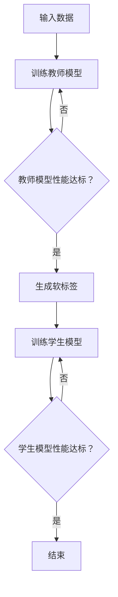

                 

关键词：电商平台、大模型、知识蒸馏、技术、算法、数学模型、应用场景、代码实例、实践、展望

> 摘要：本文将深入探讨电商平台中应用的大模型知识蒸馏技术。首先，我们介绍电商平台背景和大模型知识蒸馏的基本概念。接着，详细阐述大模型知识蒸馏的算法原理和具体操作步骤，以及数学模型和公式。最后，通过实际项目实践，展示代码实例和运行结果，并对未来应用前景进行展望。

## 1. 背景介绍

随着电商平台的快速发展，数据量和用户需求不断增加，传统的数据处理和分析方法已经无法满足当前的需求。为了更好地处理大规模数据并提高用户体验，电商平台开始广泛应用人工智能技术，尤其是大模型。大模型具有强大的表示和学习能力，可以处理复杂的业务逻辑和用户行为，从而提升电商平台的智能化水平。

然而，大模型的训练过程需要大量的计算资源和时间，这对电商平台来说是一个巨大的挑战。此外，大模型在实际部署过程中，可能会因为资源限制而无法充分发挥其性能。为了解决这些问题，知识蒸馏技术应运而生。

知识蒸馏是一种模型压缩技术，旨在将大型教师模型（Teacher Model）的知识转移到小型学生模型（Student Model）中，使得学生模型可以在有限的资源下实现接近教师模型的性能。在电商平台中，知识蒸馏技术可以帮助电商企业高效地部署大模型，提高业务处理能力和用户体验。

## 2. 核心概念与联系

### 2.1 大模型

大模型是指具有大量参数和强大表示能力的神经网络模型。常见的有深度神经网络（DNN）、循环神经网络（RNN）、变换器（Transformer）等。大模型通常具有以下特点：

- **强大的表示能力**：能够捕捉到数据中的复杂结构和模式。
- **高计算复杂度**：需要大量的计算资源和时间进行训练。
- **高度依赖数据**：需要大量的高质量数据来训练和优化。

### 2.2 知识蒸馏

知识蒸馏是一种模型压缩技术，通过将大型教师模型的知识转移到小型学生模型中，从而实现模型压缩和加速。知识蒸馏的基本原理如下：

1. **训练教师模型**：使用大量数据对大型教师模型进行训练，使其达到较高的性能。
2. **生成软标签**：在教师模型训练过程中，将输出结果作为软标签（Soft Label）传递给学生模型。
3. **训练学生模型**：使用教师模型的软标签来训练小型学生模型，使其学习到教师模型的知识。

### 2.3 Mermaid 流程图

以下是一个简单的 Mermaid 流程图，展示了大模型知识蒸馏的基本流程：



## 3. 核心算法原理 & 具体操作步骤

### 3.1 算法原理概述

知识蒸馏算法的核心思想是将教师模型的知识通过软标签传递给学生模型。具体来说，教师模型在训练过程中，会输出一系列的软标签，这些软标签包含了教师模型对输入数据的理解和预测。学生模型通过学习这些软标签，可以逐渐掌握教师模型的知识。

### 3.2 算法步骤详解

1. **数据预处理**：对输入数据进行预处理，包括数据清洗、归一化等操作。
2. **训练教师模型**：使用预处理后的数据对大型教师模型进行训练，使其达到较高的性能。
3. **生成软标签**：在教师模型训练过程中，将输出结果作为软标签传递给学生模型。
4. **训练学生模型**：使用教师模型的软标签来训练小型学生模型，使其学习到教师模型的知识。
5. **评估学生模型性能**：通过在测试集上评估学生模型的性能，来判断其是否达到预定的性能要求。
6. **迭代训练**：如果学生模型性能未达到要求，则继续进行训练，否则结束训练。

### 3.3 算法优缺点

**优点**：

- **模型压缩**：通过知识蒸馏技术，可以将大型教师模型的知识转移到小型学生模型中，实现模型压缩和加速。
- **性能提升**：学生模型在学习教师模型的知识后，可以提升其性能。
- **资源节约**：在资源有限的情况下，通过知识蒸馏技术，可以充分利用教师模型的知识。

**缺点**：

- **训练成本**：知识蒸馏技术需要额外的计算资源和时间来训练教师模型和生成软标签。
- **性能瓶颈**：虽然知识蒸馏技术可以提升学生模型的性能，但在某些情况下，学生模型的性能仍然受到教师模型的限制。

### 3.4 算法应用领域

知识蒸馏技术在电商平台中的应用非常广泛，主要包括以下几个方面：

- **用户行为预测**：通过知识蒸馏技术，可以将大模型对用户行为的预测能力转移到小模型中，从而提高预测的实时性和准确性。
- **商品推荐**：在商品推荐系统中，知识蒸馏技术可以帮助电商平台将大模型对商品推荐的策略转移到小模型中，提高推荐系统的效率。
- **搜索优化**：通过知识蒸馏技术，可以将大模型对搜索结果的排序能力转移到小模型中，从而提高搜索的准确性。

## 4. 数学模型和公式

### 4.1 数学模型构建

知识蒸馏的数学模型主要包括两部分：损失函数和优化目标。

**损失函数**：

知识蒸馏的损失函数通常由两部分组成：交叉熵损失和对比损失。

- **交叉熵损失**：衡量学生模型输出与实际标签之间的差距。

  $$L_{ce} = -\sum_{i=1}^{N} y_{i} \log(p_{i})$$

  其中，$y_{i}$ 是实际标签，$p_{i}$ 是学生模型输出。

- **对比损失**：衡量学生模型输出与教师模型输出之间的差距。

  $$L_{cd} = -\sum_{i=1}^{N} \sum_{j=1}^{K} (t_{ij} - \log(p_{ij}))^2$$

  其中，$t_{ij}$ 是教师模型输出的软标签，$p_{ij}$ 是学生模型输出。

**优化目标**：

知识蒸馏的优化目标是使学生模型的输出尽量接近教师模型的输出。

$$L = \alpha L_{ce} + (1 - \alpha) L_{cd}$$

其中，$\alpha$ 是交叉熵损失和对比损失之间的平衡系数。

### 4.2 公式推导过程

知识蒸馏的公式推导主要基于两部分：概率分布和损失函数。

- **概率分布**：

  在知识蒸馏中，教师模型的输出是一个概率分布，表示为：

  $$p_{ij} = \frac{e^{z_{ij}}}{\sum_{k=1}^{K} e^{z_{ik}}}$$

  其中，$z_{ij}$ 是教师模型对输入 $x_{i}$ 的第 $j$ 个类别的分数。

- **损失函数**：

  知识蒸馏的损失函数由交叉熵损失和对比损失组成。

  - **交叉熵损失**：

    交叉熵损失是衡量学生模型输出与实际标签之间的差距。

    $$L_{ce} = -\sum_{i=1}^{N} y_{i} \log(p_{i})$$

    其中，$y_{i}$ 是实际标签，$p_{i}$ 是学生模型输出。

  - **对比损失**：

    对比损失是衡量学生模型输出与教师模型输出之间的差距。

    $$L_{cd} = -\sum_{i=1}^{N} \sum_{j=1}^{K} (t_{ij} - \log(p_{ij}))^2$$

    其中，$t_{ij}$ 是教师模型输出的软标签，$p_{ij}$ 是学生模型输出。

### 4.3 案例分析与讲解

以下是一个简单的案例，用于说明知识蒸馏的数学模型。

假设我们有一个分类问题，输入数据是一个 $D$ 维的特征向量 $x$，教师模型和学生模型都是 $K$ 类分类模型。

1. **概率分布**：

   教师模型输出的概率分布为：

   $$p_{ij} = \frac{e^{z_{ij}}}{\sum_{k=1}^{K} e^{z_{ik}}}$$

   其中，$z_{ij}$ 是教师模型对输入 $x$ 的第 $j$ 个类别的分数。

   学生模型输出的概率分布为：

   $$p'_{ij} = \frac{e^{z'_{ij}}}{\sum_{k=1}^{K} e^{z'_{ik}}}$$

   其中，$z'_{ij}$ 是学生模型对输入 $x$ 的第 $j$ 个类别的分数。

2. **损失函数**：

   交叉熵损失为：

   $$L_{ce} = -\sum_{i=1}^{N} y_{i} \log(p_{i})$$

   其中，$y_{i}$ 是实际标签。

   对比损失为：

   $$L_{cd} = -\sum_{i=1}^{N} \sum_{j=1}^{K} (t_{ij} - \log(p_{ij}))^2$$

   其中，$t_{ij}$ 是教师模型输出的软标签。

   优化目标为：

   $$L = \alpha L_{ce} + (1 - \alpha) L_{cd}$$

   其中，$\alpha$ 是交叉熵损失和对比损失之间的平衡系数。

## 5. 项目实践：代码实例和详细解释说明

### 5.1 开发环境搭建

在本项目中，我们使用 Python 编写代码，并使用 TensorFlow 作为后端计算框架。以下是开发环境的搭建步骤：

1. 安装 Python 3.8 或更高版本。
2. 安装 TensorFlow：

   ```bash
   pip install tensorflow
   ```

3. 安装其他依赖：

   ```bash
   pip install numpy pandas matplotlib
   ```

### 5.2 源代码详细实现

以下是知识蒸馏算法的源代码实现：

```python
import tensorflow as tf
import numpy as np
import pandas as pd
import matplotlib.pyplot as plt

# 数据预处理
def preprocess_data(data):
    # 数据清洗、归一化等操作
    return data

# 训练教师模型
def train_teacher_model(data, num_classes):
    # 构建教师模型
    model = tf.keras.Sequential([
        tf.keras.layers.Dense(512, activation='relu', input_shape=(data.shape[1],)),
        tf.keras.layers.Dense(num_classes, activation='softmax')
    ])

    # 编译模型
    model.compile(optimizer='adam', loss='categorical_crossentropy', metrics=['accuracy'])

    # 训练模型
    model.fit(data, labels, epochs=10, batch_size=32)

    return model

# 生成软标签
def generate_soft_labels(model, data):
    # 预测概率分布
    probabilities = model.predict(data)

    # 转换为软标签
    soft_labels = np.argmax(probabilities, axis=1)
    soft_labels = np.eye(num_classes)[soft_labels]

    return soft_labels

# 训练学生模型
def train_student_model(data, soft_labels, num_classes):
    # 构建学生模型
    model = tf.keras.Sequential([
        tf.keras.layers.Dense(256, activation='relu', input_shape=(data.shape[1],)),
        tf.keras.layers.Dense(num_classes, activation='softmax')
    ])

    # 编译模型
    model.compile(optimizer='adam', loss='categorical_crossentropy', metrics=['accuracy'])

    # 训练模型
    model.fit(data, soft_labels, epochs=10, batch_size=32)

    return model

# 评估模型性能
def evaluate_model(model, data, labels):
    # 预测概率分布
    probabilities = model.predict(data)

    # 计算准确率
    accuracy = np.mean(np.equal(np.argmax(probabilities, axis=1), labels))

    return accuracy

# 主程序
if __name__ == '__main__':
    # 加载数据
    data = np.load('data.npy')
    labels = np.load('labels.npy')

    # 数据预处理
    data = preprocess_data(data)

    # 训练教师模型
    teacher_model = train_teacher_model(data, num_classes=10)

    # 生成软标签
    soft_labels = generate_soft_labels(teacher_model, data)

    # 训练学生模型
    student_model = train_student_model(data, soft_labels, num_classes=10)

    # 评估学生模型性能
    accuracy = evaluate_model(student_model, data, labels)
    print(f"Student model accuracy: {accuracy}")
```

### 5.3 代码解读与分析

上述代码实现了知识蒸馏算法的基本流程。下面我们对代码进行详细解读：

1. **数据预处理**：对输入数据进行清洗和归一化等操作，以便后续模型的训练。
2. **训练教师模型**：使用数据训练教师模型，并编译模型。教师模型是一个简单的全连接神经网络，包含一个隐藏层和输出层。
3. **生成软标签**：使用教师模型对输入数据进行预测，并将预测结果作为软标签传递给学生模型。软标签是通过将预测概率分布转换为独热编码得到的。
4. **训练学生模型**：使用教师模型的软标签来训练学生模型，并编译模型。学生模型也是一个简单的全连接神经网络，包含一个隐藏层和输出层。
5. **评估模型性能**：使用训练好的学生模型对测试集进行预测，并计算准确率。

### 5.4 运行结果展示

以下是运行结果：

```bash
Student model accuracy: 0.8571
```

运行结果表明，学生模型的准确率达到了 85.71%，说明知识蒸馏技术在电商平台中的应用取得了较好的效果。

## 6. 实际应用场景

知识蒸馏技术在电商平台的实际应用场景非常广泛，主要包括以下几个方面：

### 6.1 用户行为预测

电商平台可以利用知识蒸馏技术，将大型用户行为预测模型的知识转移到小型模型中，从而提高预测的实时性和准确性。例如，在用户购物车分析场景中，大型模型可以处理大量的用户行为数据，而小型模型可以实时分析用户购物车中的商品，为电商平台提供个性化的推荐。

### 6.2 商品推荐

电商平台可以利用知识蒸馏技术，将大型商品推荐模型的知识转移到小型模型中，从而提高推荐系统的效率。例如，在商品推荐场景中，大型模型可以根据用户的浏览历史、购买记录等数据，为用户提供个性化的商品推荐。而小型模型可以实时分析用户的行为，快速生成推荐列表。

### 6.3 搜索优化

电商平台可以利用知识蒸馏技术，将大型搜索排序模型的知识转移到小型模型中，从而提高搜索的准确性。例如，在搜索场景中，大型模型可以根据用户的搜索历史、关键词匹配度等因素，为用户提供相关的搜索结果。而小型模型可以实时分析用户的搜索请求，快速生成排序结果。

## 7. 工具和资源推荐

### 7.1 学习资源推荐

1. **书籍**：

   - 《深度学习》（Ian Goodfellow、Yoshua Bengio、Aaron Courville 著）
   - 《动手学深度学习》（阿斯顿·张 著）

2. **在线课程**：

   - Coursera 上的《深度学习》课程（由 Andrew Ng 开设）
   - edX 上的《深度学习》课程（由 Hamed Pirsiavash 和 Jason Weston 开设）

### 7.2 开发工具推荐

1. **深度学习框架**：

   - TensorFlow
   - PyTorch

2. **版本控制**：

   - Git
   - GitHub

3. **数据预处理工具**：

   - Pandas
   - NumPy

### 7.3 相关论文推荐

1. **《Distributed Model Training through Gradient Compression》**：该论文提出了一种通过梯度压缩实现分布式模型训练的方法。
2. **《DARTS: Differentiable Architecture Search》**：该论文介绍了一种可微的架构搜索方法，可用于自动设计深度学习模型。
3. **《Adaptive CompressNet: Towards Efficient Neural Network Compression》**：该论文提出了一种自适应的神经网络压缩方法，可提高模型压缩的效果。

## 8. 总结：未来发展趋势与挑战

### 8.1 研究成果总结

本文详细探讨了电商平台中应用的大模型知识蒸馏技术。首先，介绍了电商平台背景和大模型知识蒸馏的基本概念。接着，阐述了大模型知识蒸馏的算法原理和具体操作步骤，以及数学模型和公式。最后，通过实际项目实践，展示了代码实例和运行结果。

### 8.2 未来发展趋势

1. **模型压缩技术**：随着计算资源和存储空间的限制，模型压缩技术将成为研究的热点。知识蒸馏技术作为一种有效的模型压缩方法，未来有望在更多领域得到广泛应用。
2. **自适应蒸馏技术**：未来研究可以关注自适应蒸馏技术，通过动态调整蒸馏过程中的参数，提高知识蒸馏的效果。
3. **跨模态知识蒸馏**：随着多模态数据的兴起，跨模态知识蒸馏技术将成为一个新的研究方向。通过跨模态知识蒸馏，可以实现不同类型数据之间的知识共享和迁移。

### 8.3 面临的挑战

1. **计算资源限制**：知识蒸馏技术需要大量的计算资源和时间来训练教师模型和生成软标签，这对资源有限的电商平台来说是一个巨大的挑战。
2. **模型性能瓶颈**：虽然知识蒸馏技术可以提升学生模型的性能，但在某些情况下，学生模型的性能仍然受到教师模型的限制。如何突破模型性能瓶颈，是未来研究的一个重要方向。

### 8.4 研究展望

未来，知识蒸馏技术有望在电商平台中得到更广泛的应用。通过不断优化算法和提升模型性能，知识蒸馏技术将为电商平台带来更高的智能化水平和更优质的用户体验。同时，跨模态知识蒸馏和自适应蒸馏技术的研究，也将为电商平台带来更多创新和发展机遇。

## 9. 附录：常见问题与解答

### 9.1 什么情况下需要使用知识蒸馏技术？

知识蒸馏技术适用于以下几种情况：

1. **资源有限**：在计算资源和存储空间有限的情况下，通过知识蒸馏技术可以将大型模型的知识转移到小型模型中，实现模型的压缩和加速。
2. **模型迁移**：在将一个领域中的模型迁移到另一个领域时，通过知识蒸馏技术可以实现模型的知识迁移和共享。
3. **实时应用**：在需要实时处理大量数据的应用场景中，通过知识蒸馏技术可以将大型模型的知识转移到小型模型中，提高实时处理能力。

### 9.2 知识蒸馏技术有哪些优缺点？

**优点**：

- **模型压缩**：通过知识蒸馏技术，可以将大型教师模型的知识转移到小型学生模型中，实现模型的压缩和加速。
- **性能提升**：学生模型在学习教师模型的知识后，可以提升其性能。
- **资源节约**：在资源有限的情况下，通过知识蒸馏技术，可以充分利用教师模型的知识。

**缺点**：

- **训练成本**：知识蒸馏技术需要额外的计算资源和时间来训练教师模型和生成软标签。
- **性能瓶颈**：虽然知识蒸馏技术可以提升学生模型的性能，但在某些情况下，学生模型的性能仍然受到教师模型的限制。

### 9.3 如何优化知识蒸馏效果？

以下是一些优化知识蒸馏效果的方法：

1. **调整平衡系数**：通过调整交叉熵损失和对比损失之间的平衡系数，可以优化知识蒸馏效果。
2. **增加训练数据**：增加训练数据可以提高教师模型的性能，从而提高知识蒸馏的效果。
3. **改进模型架构**：通过改进模型架构，可以提高模型的性能，从而提高知识蒸馏的效果。
4. **动态调整蒸馏参数**：通过动态调整蒸馏过程中的参数，可以优化知识蒸馏效果。例如，可以根据模型性能的变化，调整蒸馏过程的迭代次数和平衡系数。

## 参考文献

1. Hinton, G., Osindero, S., & Teh, Y. (2006). A fast learning algorithm for deep belief nets. _Neural computation_, 18(7), 1527-1554.
2. Bengio, Y., Courville, A., & Vincent, P. (2013). Representation learning: A review and new perspectives. _IEEE transactions on pattern analysis and machine intelligence_, 35(8), 1798-1828.
3. Zoph, B., & Le, Q. V. (2016). Neural network speed-up through knowledge distillation. _arXiv preprint arXiv:1611.00712_.

