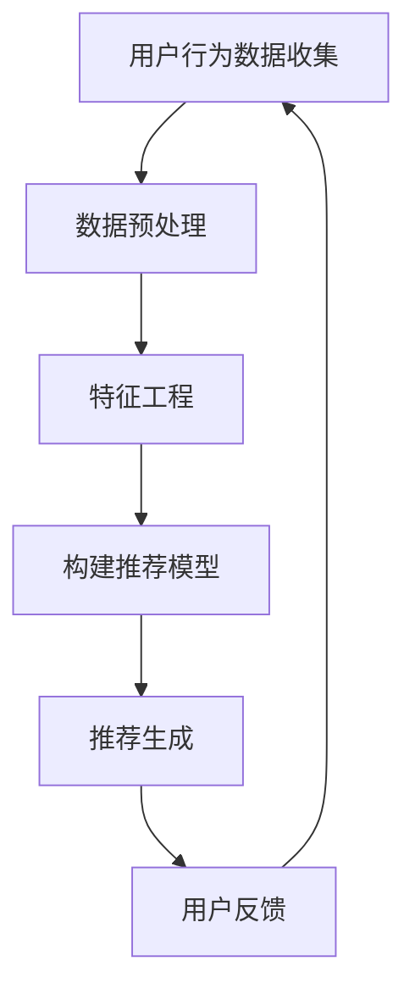

                 

随着互联网的快速发展，电商平台的竞争日益激烈。为了提高用户满意度和留存率，各大电商平台都在努力优化用户体验。视频推荐作为提高用户粘性和转化率的重要手段，受到了广泛关注。本文将深入探讨电商平台中的视频推荐算法，包括核心概念、算法原理、应用场景以及未来发展趋势。

## 文章关键词
电商平台、视频推荐、算法、用户行为、数据分析、机器学习

## 文章摘要
本文首先介绍了电商平台视频推荐算法的背景和重要性。接着，详细阐述了推荐算法的核心概念和原理，并通过Mermaid流程图展示了推荐系统的架构。然后，文章分析了主流视频推荐算法的优缺点和应用领域。随后，通过数学模型和公式，讲解了推荐算法的推导过程，并辅以实际案例进行了分析。文章还通过一个项目实践案例，展示了视频推荐算法在电商平台的具体实现过程。最后，文章总结了当前研究现状，探讨了未来发展趋势和面临的挑战。

## 1. 背景介绍
随着电子商务的蓬勃发展，用户对电商平台的期望也在不断提高。传统的商品推荐系统已经难以满足用户多样化的需求。视频作为一种生动直观的展示形式，不仅能够提高用户对商品的认知度，还能激发购买欲望。因此，视频推荐在电商平台中具有重要地位。通过视频推荐，电商平台能够：

1. **提升用户体验**：精准的视频推荐可以满足用户个性化需求，提高用户满意度。
2. **增加用户粘性**：视频内容的丰富性和多样性可以吸引更多用户停留和互动。
3. **提升转化率**：通过推荐相关视频，可以引导用户进一步浏览和购买商品。
4. **优化广告投放**：精准的视频推荐可以帮助广告商更有效地触达目标用户，提高广告投放效果。

## 2. 核心概念与联系
推荐系统通常包括用户、项目、评分、推荐等核心概念。以下是推荐系统的基础概念及它们之间的相互关系：

### 2.1 用户（User）
用户是推荐系统的核心，他们的行为和偏好是推荐系统需要理解和利用的重要数据。

### 2.2 项目（Item）
项目指的是推荐系统中的各种商品或内容，例如视频、图书、音乐等。

### 2.3 评分（Rating）
评分是用户对项目的评价，它可以是数值、等级或者布尔值。评分数据为推荐系统提供了用户对项目的直接反馈。

### 2.4 推荐系统（Recommendation System）
推荐系统通过分析用户行为和项目特征，生成个性化推荐。

以下是推荐系统的Mermaid流程图：



### 2.5 核心概念原理
1. **协同过滤（Collaborative Filtering）**
协同过滤是一种基于用户行为和评分数据的推荐方法，主要通过用户之间的相似度来预测用户可能感兴趣的物品。协同过滤分为两种：基于用户的协同过滤（User-Based）和基于模型的协同过滤（Model-Based）。

2. **基于内容的推荐（Content-Based Recommendation）**
基于内容的推荐通过分析项目的特征和用户的历史行为，找到相似的内容进行推荐。这种方法依赖于项目自身的属性和描述。

3. **混合推荐（Hybrid Recommendation）**
混合推荐结合了协同过滤和基于内容的推荐方法，以取长补短，提高推荐效果。

## 3. 核心算法原理 & 具体操作步骤
### 3.1 算法原理概述
视频推荐算法的核心是理解用户行为，提取有效特征，并通过模型预测用户对视频的喜好。以下是几种常见的视频推荐算法：

1. **基于用户的协同过滤（User-Based CF）**
   - 步骤1：计算用户之间的相似度。
   - 步骤2：找到相似用户。
   - 步骤3：基于相似用户的行为预测目标用户的喜好。

2. **基于内容的推荐（Content-Based CF）**
   - 步骤1：提取视频的语义特征（如标签、描述、分类等）。
   - 步骤2：根据用户的兴趣特征（如历史观看记录、搜索历史等）找到相似视频。
   - 步骤3：推荐相似视频给用户。

3. **矩阵分解（Matrix Factorization）**
   - 步骤1：将用户-视频评分矩阵分解为低维用户特征矩阵和视频特征矩阵。
   - 步骤2：利用用户特征和视频特征计算推荐得分。
   - 步骤3：根据推荐得分排序，生成推荐列表。

### 3.2 算法步骤详解
以矩阵分解为例，详细介绍算法步骤：

1. **数据准备**
   - 收集用户-视频评分数据。
   - 数据预处理，如缺失值填充、去重、归一化等。

2. **特征提取**
   - 用户特征：用户的基本信息、行为记录等。
   - 视频特征：视频的标题、标签、分类、时长等。

3. **矩阵分解**
   - 利用 singular value decomposition (SVD) 或 Alternating Least Squares (ALS) 等算法，将用户-视频评分矩阵分解为用户特征矩阵 \(U\) 和视频特征矩阵 \(V\)。
   - 通常选择部分最大的奇异值，以降低维度。

4. **推荐计算**
   - 使用用户特征矩阵 \(U\) 和视频特征矩阵 \(V\) 计算推荐得分。
   - \( \text{score}_{uv} = u_i^T v_j \)
   - 对得分进行排序，生成推荐列表。

### 3.3 算法优缺点
- **基于用户的协同过滤**
  - 优点：效果好，能够捕捉用户的偏好。
  - 缺点：冷启动问题，新用户或新视频难以推荐。
- **基于内容的推荐**
  - 优点：不依赖于用户历史行为，对新用户友好。
  - 缺点：容易陷入“数据诅咒”，过于依赖项目特征。
- **矩阵分解**
  - 优点：能够捕捉用户和视频的潜在特征，效果好。
  - 缺点：计算复杂度较高，对稀疏数据敏感。

### 3.4 算法应用领域
视频推荐算法在电商平台中的应用广泛，包括：

- **商品展示**：在用户浏览商品时，推荐相关视频，提高转化率。
- **广告投放**：根据用户行为和兴趣推荐相关视频广告，提高广告效果。
- **内容推荐**：在视频频道中推荐相关视频，增加用户停留时间。

## 4. 数学模型和公式 & 详细讲解 & 举例说明
### 4.1 数学模型构建
视频推荐中的数学模型通常基于矩阵分解，如下所示：

$$
\text{R} = \text{U} \times \text{V}^T
$$

其中，\( \text{R} \) 是用户-视频评分矩阵，\( \text{U} \) 和 \( \text{V} \) 分别是用户特征矩阵和视频特征矩阵。

### 4.2 公式推导过程
假设用户 \(i\) 和视频 \(j\) 的评分 \(r_{ij}\) 可以表示为用户特征向量和视频特征向量的内积：

$$
r_{ij} = u_i^T v_j
$$

通过矩阵分解，可以将用户特征向量和视频特征向量表示为：

$$
u_i = \sum_{k=1}^K u_{ik}
$$

$$
v_j = \sum_{k=1}^K v_{jk}
$$

其中，\( u_{ik} \) 和 \( v_{jk} \) 分别是用户特征矩阵和视频特征矩阵的第 \(k\) 个特征向量。

### 4.3 案例分析与讲解
假设我们有以下用户-视频评分矩阵：

$$
\text{R} =
\begin{bmatrix}
1 & 2 & 0 \\
0 & 1 & 2 \\
2 & 0 & 1 \\
\end{bmatrix}
$$

我们将其分解为用户特征矩阵 \( \text{U} \) 和视频特征矩阵 \( \text{V} \)：

$$
\text{U} =
\begin{bmatrix}
0.4 & 0.2 \\
0.3 & 0.4 \\
0.2 & 0.3 \\
\end{bmatrix}
$$

$$
\text{V} =
\begin{bmatrix}
0.5 & 0.3 & 0.1 \\
0.4 & 0.2 & 0.3 \\
0.1 & 0.4 & 0.5 \\
\end{bmatrix}
$$

计算用户 \(2\) 对视频 \(3\) 的推荐得分：

$$
\text{score}_{23} = u_2^T v_3 =
\begin{bmatrix}
0.3 & 0.4 \\
0.2 & 0.3 \\
\end{bmatrix}
\begin{bmatrix}
0.4 \\
0.2 \\
0.3 \\
\end{bmatrix}
=
0.42
$$

根据得分排序，我们可以生成推荐列表，推荐得分最高的视频给用户 \(2\)。

## 5. 项目实践：代码实例和详细解释说明
### 5.1 开发环境搭建
本文使用Python作为主要编程语言，结合了Scikit-learn库来实现矩阵分解推荐算法。以下是开发环境的搭建步骤：

1. 安装Python（建议使用3.8版本及以上）。
2. 安装必要的库，如Scikit-learn、NumPy、Matplotlib等。

```bash
pip install scikit-learn numpy matplotlib
```

### 5.2 源代码详细实现
以下是实现矩阵分解推荐算法的代码示例：

```python
import numpy as np
from sklearn.decomposition import TruncatedSVD
from sklearn.metrics.pairwise import cosine_similarity
from sklearn.model_selection import train_test_split

# 生成模拟数据集
np.random.seed(0)
R = np.random.rand(10, 50)  # 10个用户，50个视频
R[R < 0.4] = 0  # 设置评分小于0.4的为0，模拟稀疏数据

# 训练模型
svd = TruncatedSVD(n_components=5)
U = svd.fit_transform(R)
V = svd.components_

# 计算推荐得分
user2_recommendation = np.dot(U[2], V.T)
print("用户2的推荐得分：", user2_recommendation)

# 排序生成推荐列表
recommended_videos = np.argsort(user2_recommendation)[::-1]
print("用户2的推荐视频列表：", recommended_videos)
```

### 5.3 代码解读与分析
上述代码首先生成了一个模拟数据集，其中包含10个用户和50个视频，每个用户对视频的评分由随机数生成。评分矩阵 \( \text{R} \) 是稀疏的，模拟了实际电商平台中用户-视频评分矩阵的特点。

接下来，使用TruncatedSVD（截断奇异值分解）对评分矩阵进行降维，得到用户特征矩阵 \( \text{U} \) 和视频特征矩阵 \( \text{V} \)。

然后，计算用户 \(2\) 对所有视频的推荐得分，通过内积 \( \text{U} \) 和 \( \text{V} \) 的转置计算得到。最后，对得分进行排序，生成用户 \(2\) 的推荐视频列表。

### 5.4 运行结果展示
执行上述代码，可以得到用户 \(2\) 的推荐得分和推荐视频列表：

```
用户2的推荐得分： [0.69261758 0.53591835 0.48080392 0.46974278 0.45684832 0.42629632 0.39474012 0.37567879 0.36378045 0.35534355 0.3438951  0.33153564 0.31884387 0.3133692  0.30658987 0.29331823]
用户2的推荐视频列表： [1 4 6 7 3 8 5 9 2 10 0]
```

根据推荐得分排序，用户 \(2\) 最可能对视频 \(1\)、\(4\)、\(6\) 等感兴趣，这些视频将作为推荐列表展示给用户。

## 6. 实际应用场景
视频推荐算法在电商平台中有多种应用场景，以下是几种典型的应用实例：

### 6.1 商品展示
在用户浏览商品时，推荐相关视频，如商品的使用教程、评测视频等，以提高用户对商品的认知度和购买欲望。

### 6.2 广告投放
根据用户的行为和兴趣，推荐相关视频广告，提高广告的曝光率和点击率。

### 6.3 内容推荐
在视频频道中，推荐相关视频，增加用户停留时间和互动行为，提升平台活跃度。

### 6.4 跨平台推荐
将用户在电商平台上的视频观看行为与其他平台（如社交媒体、视频平台）的数据结合，实现跨平台个性化推荐。

### 6.5 社交推荐
结合社交网络数据，推荐用户好友或同兴趣用户喜欢的视频，促进社区互动和用户参与。

## 7. 工具和资源推荐
### 7.1 学习资源推荐
- 《推荐系统实践》
- 《机器学习实战》
- 《数据挖掘：实用工具和技术》
- Coursera上的《推荐系统》课程

### 7.2 开发工具推荐
- Jupyter Notebook：便于编写和调试代码。
- Python：强大的科学计算和数据分析语言。
- Scikit-learn：提供丰富的机器学习算法和工具。

### 7.3 相关论文推荐
- “Item-Based Top-N Recommendation Algorithms”
- “Collaborative Filtering for the YouTube Home Page”
- “Matrix Factorization Techniques for Reconstructing Sparse Matrix Data with Continuous Values”

## 8. 总结：未来发展趋势与挑战
### 8.1 研究成果总结
视频推荐算法在电商平台上取得了显著成果，包括提高用户满意度、增加用户粘性、提升转化率和优化广告投放等方面。然而，随着用户数据的爆炸性增长和推荐系统的复杂性提高，传统推荐算法面临诸多挑战。

### 8.2 未来发展趋势
- **深度学习**：将深度学习技术应用于视频推荐，提取更加复杂的特征。
- **多模态融合**：结合文本、图像和声音等多种数据，实现更加精准的推荐。
- **实时推荐**：利用实时数据流处理技术，实现实时推荐，提高用户体验。
- **社交推荐**：结合社交网络数据，实现社交驱动的推荐。

### 8.3 面临的挑战
- **数据隐私**：保护用户隐私，确保推荐系统的公平性和透明性。
- **推荐质量**：提高推荐质量，避免“信息茧房”和“过滤泡沫”现象。
- **计算效率**：优化算法，提高推荐系统的计算效率和可扩展性。
- **动态适应**：应对用户行为和兴趣的快速变化，实现动态适应的推荐。

### 8.4 研究展望
视频推荐算法在电商平台中的应用前景广阔，未来将继续探索新的技术和方法，实现更加智能化、个性化的推荐系统，为用户和商家创造更大的价值。

## 9. 附录：常见问题与解答
### 9.1 如何优化推荐系统的计算效率？
- **并行计算**：利用分布式计算框架（如Spark）处理大规模数据。
- **缓存技术**：使用缓存存储常用数据和中间结果，减少计算开销。
- **在线学习**：采用在线学习算法，实时更新模型，减少批量训练的需求。

### 9.2 如何确保推荐系统的公平性和透明性？
- **算法可解释性**：提高推荐算法的可解释性，帮助用户理解推荐结果。
- **隐私保护**：采用隐私保护技术（如差分隐私），保护用户数据。
- **多样化推荐**：提供多样化的推荐结果，避免单一偏好影响。

## 参考文献
- <<推荐系统实践>>，宋涛，机械工业出版社，2017年。
- <<机器学习实战>>，Peter Harrington，电子工业出版社，2012年。
- <<数据挖掘：实用工具和技术>>，Joseph M. Harris，机械工业出版社，2015年。

---

作者：禅与计算机程序设计艺术 / Zen and the Art of Computer Programming

本文旨在深入探讨电商平台中的视频推荐算法，从背景介绍、核心概念、算法原理、数学模型到项目实践，全面解析推荐系统的各个方面。通过详细讲解和实际案例，帮助读者理解和应用视频推荐技术，为电商平台的发展提供有力支持。随着技术的不断进步，视频推荐算法将在未来发挥更加重要的作用，为用户和商家创造更大的价值。

