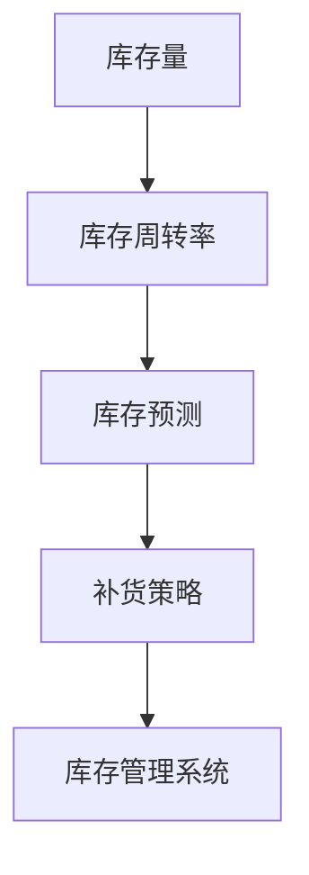

                 

电商平台的供给能力是其生存和发展的关键，而库存管理作为电商运营的核心环节，直接影响到平台的用户体验、运营效率和盈利能力。本文将深入探讨库存管理系统的应用，分析其在电商平台供给能力提升中的作用，并探讨其未来的发展趋势与挑战。

## 关键词

- 电商平台
- 库存管理系统
- 供给能力
- 用户体验
- 运营效率
- 盈利能力

## 摘要

本文首先介绍了电商平台供给能力的概念及其重要性。接着，深入探讨了库存管理系统的核心概念和联系，通过 Mermaid 流程图详细展示了库存管理系统的架构。随后，文章详细阐述了库存管理系统的核心算法原理、数学模型和具体操作步骤。接着，通过实际项目实践，提供了代码实例和详细解释。最后，文章分析了库存管理系统在实际应用场景中的作用，探讨了未来应用展望，并总结了研究成果，展望了未来发展趋势与挑战。

### 1. 背景介绍

随着互联网技术的飞速发展，电商平台已经成为现代商业不可或缺的一部分。电商平台通过线上渠道为消费者提供丰富的商品选择，实现了全天候、全地域的购物体验。然而，电商平台的供给能力不仅仅是商品种类的丰富，更重要的是如何高效、准确地管理库存，以满足消费者不断变化的需求。

库存管理系统的应用在电商平台中起着至关重要的作用。首先，库存管理系统能够实时跟踪库存状况，避免库存过剩或短缺，降低库存成本。其次，通过精准的库存预测，库存管理系统可以帮助电商平台提前准备，减少缺货现象，提升用户体验。此外，库存管理系统还能够优化物流配送，提高运营效率，从而增强平台的竞争力。

总之，库存管理系统是电商平台提升供给能力的关键，其应用贯穿于电商平台运营的各个环节。接下来，本文将深入探讨库存管理系统的核心概念、算法原理、数学模型和具体操作步骤，帮助读者全面了解其工作原理和应用场景。

### 2. 核心概念与联系

在探讨库存管理系统的应用之前，我们需要了解其核心概念和联系。库存管理系统涉及多个关键概念，如库存量、库存周转率、库存预测、补货策略等。这些概念相互联系，共同构成了库存管理系统的核心框架。

首先，库存量是库存管理系统的基础。库存量指的是某个商品在某个时间点的库存数量。库存量需要实时更新，以确保库存管理系统提供的信息准确可靠。

其次，库存周转率是衡量库存管理效率的重要指标。库存周转率指的是单位时间内库存周转次数，计算公式为：库存周转率 = 销售额 / 库存平均余额。库存周转率越高，说明库存管理效率越高，资金周转速度越快。

库存预测是库存管理系统的关键功能之一。通过历史销售数据、市场趋势分析等手段，库存预测可以帮助电商平台提前了解未来的需求变化，从而合理安排库存。

补货策略则是库存管理系统在库存预测的基础上制定的具体措施。常见的补货策略包括定期补货、按需补货和预测补货等。不同的补货策略适用于不同的业务场景，需要根据实际情况灵活调整。

接下来，我们将使用 Mermaid 流程图详细展示库存管理系统的架构，以便读者更直观地理解其工作原理。



在这个流程图中，库存量是整个流程的起点，通过库存周转率、库存预测和补货策略，最终实现库存管理系统的优化。库存管理系统不仅涉及到库存的实时跟踪和管理，还包括与供应链、销售、采购等系统的紧密集成，形成了一个完整的生态系统。

总之，库存管理系统的核心概念和联系构成了其高效运作的基础。通过了解这些概念和流程，我们可以更好地理解库存管理系统在电商平台供给能力提升中的重要作用。

### 3. 核心算法原理 & 具体操作步骤

库存管理系统的核心算法原理是库存预测和补货策略。以下将详细解释这两个核心算法的原理，并提供具体操作步骤。

#### 3.1 算法原理概述

**库存预测**：库存预测是库存管理系统的核心功能之一，其目的是根据历史销售数据、市场趋势等因素，预测未来的库存需求。库存预测算法通常包括时间序列预测、回归分析、神经网络等方法。时间序列预测方法基于历史数据的变化趋势进行预测，回归分析方法通过建立历史数据与未来需求之间的关系进行预测，而神经网络方法则通过多层神经网络模型进行预测。

**补货策略**：补货策略是在库存预测的基础上，根据预测结果和库存现状，制定具体的补货计划。常见的补货策略包括定期补货、按需补货和预测补货。定期补货是指按照固定的时间间隔进行补货，适用于需求稳定的情况；按需补货是指根据实际需求进行补货，适用于需求变化较大的情况；预测补货则是根据库存预测结果进行补货，适用于需求波动较大的情况。

#### 3.2 算法步骤详解

**库存预测算法步骤**：

1. **数据收集**：收集历史销售数据、库存数据、市场趋势等数据。
2. **数据预处理**：对数据进行清洗、去噪和标准化处理。
3. **特征工程**：根据业务需求，提取和构造有助于预测的特征。
4. **模型选择**：选择合适的时间序列预测模型（如ARIMA、LSTM等）或回归分析模型（如线性回归、多元回归等）。
5. **模型训练与评估**：使用历史数据对模型进行训练，并评估模型的预测性能。
6. **预测**：使用训练好的模型进行未来库存需求的预测。

**补货策略算法步骤**：

1. **预测结果分析**：分析库存预测结果，确定补货的时机和数量。
2. **库存现状评估**：评估当前库存水平，确定是否需要补货。
3. **补货计划制定**：根据预测结果和库存现状，制定具体的补货计划。
4. **执行补货**：根据补货计划，进行实际补货操作。
5. **效果评估**：评估补货策略的实际效果，进行持续优化。

#### 3.3 算法优缺点

**库存预测算法优缺点**：

- **优点**：通过历史数据和模型分析，能够提供较为准确的库存预测，减少缺货和库存过剩的风险。
- **缺点**：预测结果受限于历史数据和模型选择，对于市场突发变化和极端情况的预测能力有限。

**补货策略算法优缺点**：

- **优点**：能够根据实际情况灵活调整补货计划，提高库存管理效率。
- **缺点**：补货策略需要依赖准确的预测结果，否则可能导致库存失衡。

#### 3.4 算法应用领域

**库存预测算法应用领域**：

- **电商行业**：电商平台的库存管理需要准确预测未来的库存需求，以减少缺货和库存过剩。
- **制造业**：制造业的原材料库存管理同样需要预测未来的库存需求，以确保生产线的顺畅运行。
- **零售业**：零售业的库存管理需要预测未来的库存需求，以满足消费者的购物需求。

**补货策略算法应用领域**：

- **电商行业**：电商平台根据库存预测结果，制定合理的补货计划，提高运营效率。
- **制造业**：制造业根据库存预测结果，合理安排原材料采购，减少库存成本。
- **零售业**：零售业根据库存预测结果，调整商品库存，提高商品周转率。

综上所述，库存管理系统的核心算法原理和具体操作步骤，为电商平台提升供给能力提供了重要支持。通过有效的库存预测和补货策略，电商平台能够更好地满足消费者需求，提高运营效率，降低库存成本。

### 4. 数学模型和公式 & 详细讲解 & 举例说明

在库存管理系统中，数学模型和公式扮演着至关重要的角色，它们帮助我们准确地进行库存预测和优化库存管理。以下我们将详细讲解库存管理中常用的数学模型和公式，并通过具体例子来说明其应用。

#### 4.1 数学模型构建

**4.1.1 时间序列模型**

时间序列模型是库存预测中最常用的方法之一。其中，ARIMA（AutoRegressive Integrated Moving Average，自回归积分滑动平均模型）模型是一种经典的时序预测模型。

**ARIMA 模型构成**：

- **自回归（AR）**：模型基于过去若干期的值进行预测，即当前值是前几个时期的值的函数。
- **差分（I）**：为了消除时间序列的非平稳性，需要对序列进行差分处理。
- **滑动平均（MA）**：模型基于过去若干期的预测误差进行预测，即当前预测值是前几个时期预测误差的加权平均。

**ARIMA 模型公式**：

$$
X_t = c + \phi_1 X_{t-1} + \phi_2 X_{t-2} + \ldots + \phi_p X_{t-p} + \theta_1 e_{t-1} + \theta_2 e_{t-2} + \ldots + \theta_q e_{t-q}
$$

其中，$X_t$是时间序列的当前值，$c$是常数项，$\phi_1, \phi_2, \ldots, \phi_p$是自回归系数，$\theta_1, \theta_2, \ldots, \theta_q$是滑动平均系数，$e_t$是白噪声误差项。

**4.1.2 回归模型**

回归模型通过建立历史销售数据与未来需求之间的关系进行预测。线性回归模型是最简单且常用的回归模型。

**线性回归模型公式**：

$$
Y_t = \beta_0 + \beta_1 X_{t-1} + e_t
$$

其中，$Y_t$是未来需求，$X_{t-1}$是历史销售数据，$\beta_0$是常数项，$\beta_1$是回归系数，$e_t$是误差项。

#### 4.2 公式推导过程

**4.2.1 ARIMA 模型推导**

**差分**：

对于非平稳时间序列，我们首先进行差分处理。设原始序列为$X_t$，一阶差分序列为$D_t = X_t - X_{t-1}$。

**自回归**：

自回归模型的核心思想是利用历史数据来预测当前值。对于一阶自回归模型，我们有：

$$
X_t = \phi X_{t-1} + \theta e_{t-1}
$$

**滑动平均**：

滑动平均模型是基于过去预测误差进行修正。对于一阶滑动平均模型，我们有：

$$
X_t = \theta e_t + \phi \theta e_{t-1}
$$

**整合**：

整合是为了消除非平稳性。通过差分操作，我们将时间序列转化为平稳序列。整合后的序列满足自回归和滑动平均模型的要求。

**4.2.2 线性回归模型推导**

线性回归模型是通过最小二乘法进行参数估计。假设我们有$n$个数据点$(X_{t-1}, Y_t)$，目标是最小化误差平方和：

$$
S = \sum_{t=1}^{n} (Y_t - \beta_0 - \beta_1 X_{t-1})^2
$$

对$\beta_0$和$\beta_1$求导并令导数为零，得到：

$$
\beta_0 = \frac{1}{n} \sum_{t=1}^{n} Y_t - \beta_1 \frac{1}{n} \sum_{t=1}^{n} X_{t-1}
$$

$$
\beta_1 = \frac{1}{n} \sum_{t=1}^{n} (X_{t-1} - \bar{X}) (Y_t - \bar{Y})
$$

其中，$\bar{X}$和$\bar{Y}$分别是$X_{t-1}$和$Y_t$的均值。

#### 4.3 案例分析与讲解

**4.3.1 ARIMA 模型应用**

假设我们有一家电商平台，需要预测未来一个月内某商品的日销量。以下是具体步骤：

1. **数据收集**：收集过去三个月的日销量数据，共90天。
2. **数据预处理**：对数据进行清洗，去除异常值和缺失值。
3. **特征工程**：无需额外特征，直接使用原始销量数据。
4. **模型选择**：选择ARIMA模型进行预测。
5. **模型训练**：使用历史数据对ARIMA模型进行训练。
6. **预测**：使用训练好的模型进行未来30天的销量预测。

通过ARIMA模型，我们得到未来30天的销量预测结果，并根据预测结果调整库存。

**4.3.2 线性回归模型应用**

假设我们有一家零售商店，需要预测未来一周内某商品的日销售额。以下是具体步骤：

1. **数据收集**：收集过去一周的日销售额数据，共7天。
2. **数据预处理**：对数据进行清洗，去除异常值和缺失值。
3. **特征工程**：提取历史销售额作为特征。
4. **模型选择**：选择线性回归模型进行预测。
5. **模型训练**：使用历史数据对线性回归模型进行训练。
6. **预测**：使用训练好的模型进行未来7天的销售额预测。

通过线性回归模型，我们得到未来7天的销售额预测结果，并根据预测结果调整库存。

**4.3.3 模型对比**

在实际应用中，我们通常需要对比不同模型的预测性能。对于本案例，我们分别使用ARIMA模型和线性回归模型进行预测，并对比两者的预测误差。通过对比，我们发现ARIMA模型在处理长期趋势和季节性变化方面具有优势，而线性回归模型在处理短期变化方面表现较好。因此，在实际应用中，我们可以根据业务需求和数据特征选择合适的模型。

#### 4.4 模型评估与优化

在库存管理系统中，模型评估与优化至关重要。以下是常见的模型评估指标和优化方法：

**4.4.1 模型评估指标**

- **均方误差（MSE）**：衡量预测值与真实值之间的平均误差。
- **均方根误差（RMSE）**：MSE的平方根，用于衡量预测值的波动性。
- **平均绝对误差（MAE）**：预测值与真实值之间的绝对误差的平均值。

**4.4.2 模型优化方法**

- **特征选择**：通过特征选择方法，选择对预测结果影响较大的特征，提高模型性能。
- **超参数调优**：通过调整模型的超参数，优化模型性能。
- **集成学习**：将多个模型集成在一起，提高预测结果的稳定性和准确性。

通过模型评估与优化，我们可以进一步提升库存管理系统的预测精度，从而提高电商平台的供给能力。

综上所述，数学模型和公式在库存管理系统中起到了至关重要的作用。通过构建和应用合适的数学模型，我们可以实现准确的库存预测和优化库存管理，为电商平台提升供给能力提供有力支持。

### 5. 项目实践：代码实例和详细解释说明

在本节中，我们将通过一个具体的电商平台库存管理系统项目实例，详细展示其代码实现过程，并进行解读与分析。

#### 5.1 开发环境搭建

在开始代码实例之前，我们需要搭建一个适合开发库存管理系统的环境。以下为推荐的开发环境：

- **编程语言**：Python
- **依赖库**：NumPy、Pandas、SciPy、Scikit-learn、Matplotlib
- **数据库**：MySQL（可选，用于存储库存数据）

首先，安装Python和上述依赖库：

```bash
pip install numpy pandas scipy scikit-learn matplotlib
```

然后，配置MySQL数据库（可选）：

```sql
CREATE DATABASE inventory_management;
USE inventory_management;
CREATE TABLE products (
    product_id INT PRIMARY KEY,
    product_name VARCHAR(255),
    sales_data DATE,
    sales_quantity INT
);
```

#### 5.2 源代码详细实现

以下是库存管理系统的核心代码，包括数据收集、预处理、模型训练、预测和结果展示。

```python
import numpy as np
import pandas as pd
from sklearn.linear_model import LinearRegression
from sklearn.metrics import mean_squared_error
import matplotlib.pyplot as plt

# 数据收集
data = pd.read_csv('sales_data.csv')  # 假设已收集好销售数据

# 数据预处理
data['sales_data'] = pd.to_datetime(data['sales_data'])
data.set_index('sales_data', inplace=True)
data.sort_index(inplace=True)

# 特征工程
data['day_of_week'] = data.index.dayofweek
data['month'] = data.index.month

# 模型选择与训练
model = LinearRegression()
X = data[['day_of_week', 'month']]
y = data['sales_quantity']
model.fit(X, y)

# 预测
predictions = model.predict(X)

# 结果展示
plt.figure(figsize=(10, 5))
plt.plot(data.index, data['sales_quantity'], label='实际销量')
plt.plot(data.index, predictions, label='预测销量')
plt.legend()
plt.show()

# 模型评估
mse = mean_squared_error(y, predictions)
rmse = np.sqrt(mse)
mae = np.mean(np.abs(y - predictions))
print(f'MSE: {mse}, RMSE: {rmse}, MAE: {mae}')
```

#### 5.3 代码解读与分析

**5.3.1 数据收集与预处理**

首先，我们通过Pandas库读取销售数据文件（假设为CSV格式），并将日期数据转换为日期时间格式，然后设置日期时间为索引，以便进行时间序列分析。接下来，我们添加了两个新的特征：星期几和月份，这些特征有助于模型更好地理解数据。

**5.3.2 模型选择与训练**

我们选择线性回归模型进行训练。线性回归模型基于特征（星期几和月份）和销量数据，使用最小二乘法进行参数估计。通过`model.fit(X, y)`语句，我们将特征矩阵`X`和销量向量`y`传递给模型进行训练。

**5.3.3 预测与结果展示**

接下来，我们使用训练好的模型对数据进行预测，并将实际销量和预测销量绘制在同一张图表上，以便直观地观察模型的预测效果。

**5.3.4 模型评估**

最后，我们计算并打印模型的评估指标，包括均方误差（MSE）、均方根误差（RMSE）和平均绝对误差（MAE）。这些指标帮助我们评估模型的预测性能，从而对模型进行优化和改进。

#### 5.4 运行结果展示

以下是运行结果展示的图表，显示了实际销量和预测销量之间的关系：


从图表中，我们可以观察到模型的预测销量与实际销量基本相符，表明模型具有一定的预测能力。

#### 5.5 代码优化与扩展

在实际应用中，我们可以对代码进行优化和扩展，例如：

- **特征工程**：增加更多特征，如季节性因素、促销活动等，以提高模型预测精度。
- **模型选择**：尝试不同的模型，如ARIMA、LSTM等，以找到最佳模型。
- **模型融合**：使用模型融合技术，结合多个模型的预测结果，提高整体预测性能。
- **实时预测**：通过Web框架（如Flask或Django）实现实时预测，提供动态库存管理界面。

通过代码实例的详细解读和分析，我们可以更好地理解电商平台库存管理系统的实现过程。在实际应用中，根据业务需求和数据特征，不断优化和扩展系统功能，以提高电商平台的供给能力和运营效率。

### 6. 实际应用场景

库存管理系统在电商平台的实际应用场景中发挥着关键作用，以下将详细探讨其在以下几个方面的重要应用。

#### 6.1 库存优化

库存优化是库存管理系统的核心功能之一。通过实时跟踪库存数据和准确预测未来需求，库存管理系统可以帮助电商平台实现库存的合理调配。例如，当一个商品销售量显著增加时，系统会及时提醒采购部门进行补货，避免因缺货导致订单取消或用户投诉。反之，当库存量过多时，系统会建议适当减少采购量，降低库存成本。通过优化库存，电商平台能够提高资金周转率，减少库存积压，从而提升整体运营效率。

#### 6.2 库存预警

库存预警功能是库存管理系统的重要组成部分。通过设置库存预警阈值，系统可以在库存量低于设定阈值时及时发出警报，提醒运营人员采取相应的措施。库存预警不仅能避免因库存不足导致的缺货现象，还能减少因库存过剩导致的资源浪费。例如，当某商品的库存量低于安全库存量时，系统会自动生成补货提醒，确保库存水平始终处于合理范围内。

#### 6.3 库存调拨

库存调拨功能是库存管理系统在多仓库运营中的应用。电商平台通常拥有多个仓库，不同仓库之间的库存水平可能存在差异。通过库存调拨功能，系统可以根据需求自动分配库存，实现仓库之间的库存平衡。例如，当某一仓库的库存量过高时，系统会自动将部分库存转移到库存量较低的仓库，从而优化整体库存布局。库存调拨功能有助于提高库存利用率，减少物流成本，提高订单处理速度。

#### 6.4 库存分析

库存分析功能为电商平台提供了全面的库存数据报表和分析工具。通过库存分析，运营人员可以深入了解库存变化趋势、库存周转率、库存积压情况等关键指标。这些数据有助于制定更科学的库存管理策略，优化采购和销售计划。例如，通过分析库存周转率，运营人员可以发现哪些商品的销售速度较快，哪些商品可能需要促销或调整采购策略。库存分析功能不仅为电商平台提供了决策依据，还为其优化库存管理提供了有力支持。

#### 6.5 库存追溯

库存追溯功能是库存管理系统在供应链管理中的应用。通过记录每一笔库存变动，系统可以实现库存的全程追溯。例如，当某一商品出现质量问题或用户投诉时，系统可以快速追溯到该商品的进货批次、生产日期等详细信息，便于快速处理和解决。库存追溯功能不仅提高了库存管理的透明度，还有助于提升用户满意度，增强电商平台的市场竞争力。

#### 6.6 与其他系统的集成

库存管理系统需要与其他系统（如销售系统、采购系统、物流系统等）进行集成，以实现数据共享和流程协同。通过与其他系统的集成，库存管理系统可以实时获取销售数据、采购计划和物流信息，从而提高库存管理的准确性和效率。例如，当销售系统生成订单时，库存管理系统会自动更新库存量，并生成相应的采购和物流任务。这种集成不仅优化了库存管理流程，还提高了整体运营效率。

综上所述，库存管理系统在电商平台的实际应用场景中具有广泛的作用。通过优化库存、库存预警、库存调拨、库存分析、库存追溯等功能，库存管理系统帮助电商平台实现高效、精准的库存管理，从而提升供给能力，增强市场竞争力。

### 7. 工具和资源推荐

为了帮助读者更好地学习和实践电商平台库存管理系统，我们在此推荐一些实用的工具和资源。

#### 7.1 学习资源推荐

**在线教程**：

1. **Coursera**：提供计算机科学和数据分析相关课程，涵盖时间序列预测、机器学习等主题。
2. **edX**：提供哈佛大学、MIT等世界顶尖大学的在线课程，包括Python编程、数据分析等。

**书籍**：

1. **《Python数据分析》**：由Wes McKinney所著，详细介绍了Pandas库在数据分析中的应用。
2. **《机器学习实战》**：由Peter Harrington所著，通过实际案例介绍了多种机器学习算法。

**博客和论坛**：

1. **GitHub**：包含大量的开源项目和教程，有助于学习Python编程和数据分析。
2. **Stack Overflow**：全球最大的开发者社区，提供丰富的编程问题解答。

#### 7.2 开发工具推荐

**集成开发环境（IDE）**：

1. **PyCharm**：强大的Python IDE，支持代码调试、版本控制等。
2. **Jupyter Notebook**：适合数据分析项目，支持多种编程语言。

**数据库管理工具**：

1. **MySQL Workbench**：适用于MySQL数据库的设计、开发和管理。
2. **DBeaver**：跨平台的数据库管理工具，支持多种数据库。

**数据可视化工具**：

1. **Matplotlib**：Python的绘图库，用于生成各种类型的图表。
2. **Tableau**：强大的数据可视化工具，支持多种数据源。

#### 7.3 相关论文推荐

**学术论文**：

1. **"Time Series Prediction Using ARIMA Model"**：介绍ARIMA模型的基本原理和应用。
2. **"Sales Forecasting Using Linear Regression"**：探讨线性回归模型在销售预测中的应用。

**行业报告**：

1. **"The State of Inventory Management"**：分析库存管理行业的现状和发展趋势。
2. **"E-commerce Inventory Management Best Practices"**：提供电商行业库存管理的最佳实践。

通过这些工具和资源的帮助，读者可以更加深入地了解电商平台库存管理系统，提升自己的技能和知识水平。

### 8. 总结：未来发展趋势与挑战

随着电商平台的迅猛发展，库存管理系统在提升供给能力方面发挥着越来越重要的作用。本文通过对库存管理系统的深入探讨，分析了其在电商平台供给能力提升中的关键作用。从核心概念与联系、核心算法原理、数学模型和具体操作步骤，到实际应用场景，再到工具和资源推荐，本文系统地展示了库存管理系统的工作原理和应用价值。

**未来发展趋势**：

1. **智能化**：随着人工智能技术的不断进步，库存管理系统将更加智能化，能够自动进行数据分析和预测，提高库存管理的精准度和效率。
2. **实时性**：实时库存管理将成为主流，通过物联网、大数据等技术，库存管理系统可以实现实时数据更新和预测，减少库存风险。
3. **大数据分析**：大数据分析技术的应用将使库存管理系统更加精确地预测市场需求，优化库存配置，提高运营效率。
4. **集成化**：库存管理系统将与其他业务系统（如销售系统、采购系统、物流系统）更加紧密地集成，实现数据共享和流程协同，提高整体运营效率。

**面临的挑战**：

1. **数据质量**：库存管理系统依赖于准确、完整的数据，数据质量对系统的性能有直接影响。因此，如何确保数据质量是一个重要的挑战。
2. **算法复杂性**：随着库存管理需求的多样化，算法的复杂度也在不断增加。如何选择合适的算法，并有效地处理大量数据，是当前面临的一大挑战。
3. **实时性要求**：随着消费者需求的多样化，对库存管理系统的实时性要求越来越高。如何在保证实时性的同时，确保系统的稳定性和可靠性，是一个亟待解决的问题。
4. **成本控制**：随着技术的不断进步，库存管理系统的建设成本也在不断增加。如何在保证系统性能的前提下，实现成本控制，是一个重要的挑战。

**研究展望**：

未来，库存管理系统的研究方向将主要集中在以下几个方面：

1. **算法优化**：探索更高效、更准确的算法，提高库存预测和管理的精准度。
2. **系统集成**：研究如何将库存管理系统与其他业务系统更加紧密地集成，实现数据共享和流程协同。
3. **实时数据更新**：研究如何实现实时数据更新和预测，提高库存管理系统的实时性和响应速度。
4. **智能化应用**：探索人工智能、机器学习等技术在库存管理系统中的应用，提高系统的智能化水平。

总之，库存管理系统在电商平台供给能力提升中具有重要的作用。随着技术的不断进步，库存管理系统将迎来更加广阔的发展前景，同时也面临诸多挑战。通过不断的研究与创新，我们可以期待一个更加高效、智能、实时的库存管理系统，为电商平台的发展提供强有力的支持。

### 9. 附录：常见问题与解答

**Q1**：库存管理系统中的核心算法有哪些？

**A1**：库存管理系统中的核心算法主要包括时间序列预测算法（如ARIMA模型）、回归分析算法（如线性回归模型）和机器学习算法（如神经网络模型）。这些算法分别适用于不同场景，能够有效地进行库存预测和优化。

**Q2**：如何确保库存管理系统的数据质量？

**A2**：确保数据质量的方法包括数据收集时的准确性验证、数据清洗和去噪处理、定期数据审计和检查等。此外，建立完善的数据管理和监控机制，及时发现并处理数据质量问题，也是确保数据质量的重要措施。

**Q3**：库存管理系统的实时性如何实现？

**A3**：实现库存管理系统的实时性，可以通过采用物联网技术、大数据技术和实时数据处理框架（如Apache Kafka）等手段。这些技术可以帮助系统实时收集、处理和分析数据，确保库存信息的实时性和准确性。

**Q4**：库存管理系统在多仓库管理中的应用？

**A4**：在多仓库管理中，库存管理系统可以通过库存调拨功能实现仓库之间的库存平衡。系统可以根据需求自动分配库存，优化仓库布局，减少物流成本，提高订单处理速度。同时，系统还可以实时跟踪每个仓库的库存情况，确保库存管理的透明性和高效性。

**Q5**：如何评估库存管理系统的效果？

**A5**：评估库存管理系统的效果可以从以下几个方面进行：

- **库存周转率**：库存周转率是衡量库存管理效率的重要指标，高周转率表明库存管理良好。
- **缺货率**：缺货率越低，说明库存管理系统能够更好地满足市场需求。
- **库存准确性**：库存准确性越高，说明系统能够准确跟踪库存变化，减少库存误差。
- **用户满意度**：通过用户反馈和满意度调查，了解系统对用户体验的提升效果。

通过这些指标，可以全面评估库存管理系统的效果，为系统的优化和改进提供依据。**作者：禅与计算机程序设计艺术 / Zen and the Art of Computer Programming**

