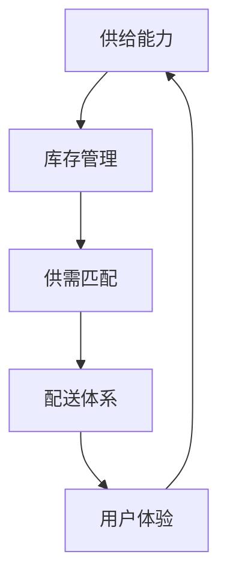

                 

关键词：电商平台，供给能力，生态系统，算法，数学模型，项目实践，应用场景，工具和资源

> 摘要：本文旨在探讨如何通过技术手段提升电商平台的供给能力，并构建一个健康的电商生态系统。我们将深入分析当前电商市场面临的挑战，介绍核心概念与联系，解析核心算法原理，构建数学模型，进行项目实践，探讨实际应用场景，并展望未来发展趋势与挑战。

## 1. 背景介绍

随着互联网技术的快速发展，电商平台已经成为现代商业不可或缺的一部分。电商平台不仅为消费者提供了便捷的购物体验，也为企业带来了巨大的商业价值。然而，随着市场竞争的加剧，电商平台面临着供给能力不足、库存管理困难、商品配送效率低下等一系列挑战。

供给能力是电商平台的核心竞争力之一，它关系到平台的运营效率和用户体验。一个健康的电商生态系统不仅需要高效的供给能力，还需要具备适应性、可持续性和可持续性。本文将围绕如何提升电商平台的供给能力，构建健康的电商生态系统展开讨论。

### 1.1 电商市场现状

当前，电商市场呈现出以下特点：

- **市场规模不断扩大**：随着互联网的普及和消费者购买习惯的改变，电商平台的市场规模不断扩大。根据统计，全球电商市场预计将在未来几年内继续保持高速增长。

- **竞争日益激烈**：电商市场的竞争已经从价格战转向了技术创新和服务质量的竞争。各大电商平台纷纷加大在技术研发和服务提升方面的投入，以争夺市场份额。

- **消费者需求多样化**：消费者对电商平台的期望越来越高，不仅要求商品种类丰富、价格优惠，还要求购物体验便捷、配送快速。这给电商平台提出了更高的要求。

### 1.2 供给能力的重要性

供给能力是电商平台的核心竞争力之一，它关系到平台的运营效率和用户体验。一个健康的电商生态系统需要具备以下特点：

- **高效的库存管理**：通过高效的库存管理，电商平台可以减少库存积压，提高资金周转率，降低运营成本。

- **精准的供需匹配**：通过精准的供需匹配，电商平台可以满足消费者的个性化需求，提高用户满意度。

- **灵活的配送体系**：通过灵活的配送体系，电商平台可以提高配送速度，缩短交货周期，提升用户体验。

## 2. 核心概念与联系

为了深入探讨如何提升电商平台的供给能力，我们需要引入一些核心概念，并分析它们之间的联系。

### 2.1 供给能力

供给能力是指电商平台在特定时间内能够提供的商品和服务数量。供给能力受到库存量、采购能力、生产能力和配送能力等因素的制约。

### 2.2 库存管理

库存管理是电商供给能力的重要组成部分。通过科学的库存管理，电商平台可以确保商品库存充足，避免因库存不足导致的缺货现象。

### 2.3 供需匹配

供需匹配是提升电商供给能力的关键。通过精准的供需匹配，电商平台可以满足消费者的个性化需求，提高用户满意度。

### 2.4 配送体系

配送体系是电商供给能力的重要保障。一个高效的配送体系可以提高商品配送速度，缩短交货周期，提升用户体验。

### 2.5 数学模型

在探讨电商供给能力时，数学模型可以帮助我们理解和分析复杂问题。通过构建数学模型，我们可以量化供给能力、库存管理、供需匹配和配送体系等核心概念。

### 2.6 Mermaid 流程图

为了更好地展示电商供给能力提升的过程，我们可以使用 Mermaid 流程图来描述核心概念之间的联系。以下是电商供给能力提升的 Mermaid 流程图：



## 3. 核心算法原理 & 具体操作步骤

### 3.1 算法原理概述

为了提升电商平台的供给能力，我们可以采用以下核心算法：

- **库存管理算法**：通过算法预测商品的需求量，优化库存管理，避免库存积压或缺货现象。
- **供需匹配算法**：通过算法分析消费者的购买行为和偏好，实现精准的供需匹配。
- **配送优化算法**：通过算法优化配送路线和配送资源，提高配送效率。

### 3.2 算法步骤详解

#### 3.2.1 库存管理算法

1. **数据收集**：收集历史销售数据、季节性数据、促销活动数据等。
2. **需求预测**：使用时间序列分析、回归分析等方法预测未来一段时间内的商品需求量。
3. **库存优化**：根据需求预测结果，调整库存水平，确保库存充足但不过剩。

#### 3.2.2 供需匹配算法

1. **用户行为分析**：收集用户浏览、购买、评价等行为数据。
2. **用户偏好分析**：使用聚类分析、关联规则挖掘等方法分析用户的购买偏好。
3. **供需匹配**：根据用户偏好和商品特点，实现精准的供需匹配。

#### 3.2.3 配送优化算法

1. **数据收集**：收集配送路径、交通状况、配送资源等数据。
2. **路径优化**：使用遗传算法、蚁群算法等方法优化配送路径，减少配送时间。
3. **资源调度**：根据配送路径优化结果，合理调度配送资源，提高配送效率。

### 3.3 算法优缺点

#### 3.3.1 库存管理算法

优点：可以提高库存利用率，降低库存成本，避免库存积压或缺货现象。

缺点：需求预测的准确性受到多种因素的影响，可能导致库存过剩或缺货。

#### 3.3.2 供需匹配算法

优点：可以提高用户满意度，减少库存积压，提升销售业绩。

缺点：用户行为和偏好分析需要大量的数据支持，且分析结果可能受到数据质量和算法模型的影响。

#### 3.3.3 配送优化算法

优点：可以提高配送效率，降低配送成本，提升用户体验。

缺点：配送路径优化和资源调度需要考虑到多种因素，可能导致优化结果不够理想。

### 3.4 算法应用领域

库存管理算法、供需匹配算法和配送优化算法在电商领域有广泛的应用。例如：

- **库存管理算法**：可以应用于电商平台、物流企业、制造企业等。
- **供需匹配算法**：可以应用于电商平台、在线旅游平台、在线教育平台等。
- **配送优化算法**：可以应用于电商平台、物流公司、外卖平台等。

## 4. 数学模型和公式 & 详细讲解 & 举例说明

### 4.1 数学模型构建

为了提升电商平台的供给能力，我们可以构建以下数学模型：

#### 4.1.1 库存管理模型

库存管理模型可以表示为：

\[ I(t) = I_{0} + \sum_{i=1}^{t} \Delta I_i - \sum_{i=1}^{t} \Delta O_i \]

其中，\( I(t) \)表示时间 \( t \) 时刻的库存水平，\( I_{0} \)表示初始库存水平，\( \Delta I_i \)表示时间 \( i \) 时刻的入库量，\( \Delta O_i \)表示时间 \( i \) 时刻的出库量。

#### 4.1.2 供需匹配模型

供需匹配模型可以表示为：

\[ P(x) = \sum_{i=1}^{n} p_i \cdot q_i \]

其中，\( P(x) \)表示时间 \( t \) 时刻的供需匹配概率，\( p_i \)表示时间 \( i \) 时刻的商品供需概率，\( q_i \)表示时间 \( i \) 时刻的用户需求概率。

#### 4.1.3 配送优化模型

配送优化模型可以表示为：

\[ C(x) = \sum_{i=1}^{n} c_i \cdot d_i \]

其中，\( C(x) \)表示时间 \( t \) 时刻的配送成本，\( c_i \)表示时间 \( i \) 时刻的配送资源成本，\( d_i \)表示时间 \( i \) 时刻的配送需求量。

### 4.2 公式推导过程

#### 4.2.1 库存管理模型推导

库存管理模型是基于库存水平的变化来计算的。我们可以通过分析库存水平的变化趋势，推导出库存管理模型。

\[ \Delta I_i = I_{i+1} - I_i \]

\[ \Delta O_i = O_{i+1} - O_i \]

\[ I(t) = I_{0} + \sum_{i=1}^{t} \Delta I_i - \sum_{i=1}^{t} \Delta O_i \]

#### 4.2.2 供需匹配模型推导

供需匹配模型是基于供需概率的乘积来计算的。我们可以通过分析供需概率的分布，推导出供需匹配模型。

\[ P(x) = \sum_{i=1}^{n} p_i \cdot q_i \]

其中，\( p_i \)表示时间 \( i \) 时刻的商品供需概率，\( q_i \)表示时间 \( i \) 时刻的用户需求概率。

#### 4.2.3 配送优化模型推导

配送优化模型是基于配送资源成本和配送需求量的乘积来计算的。我们可以通过分析配送资源成本和配送需求量的分布，推导出配送优化模型。

\[ C(x) = \sum_{i=1}^{n} c_i \cdot d_i \]

其中，\( c_i \)表示时间 \( i \) 时刻的配送资源成本，\( d_i \)表示时间 \( i \) 时刻的配送需求量。

### 4.3 案例分析与讲解

#### 4.3.1 案例一：库存管理模型应用

假设某电商平台在某时间段内的商品需求量为 1000 单位，初始库存量为 500 单位，入库量为 300 单位，出库量为 200 单位。根据库存管理模型，可以计算出时间 \( t \) 时刻的库存水平：

\[ I(t) = 500 + 300 - 200 = 600 \]

#### 4.3.2 案例二：供需匹配模型应用

假设某电商平台在某时间段内的商品供需概率为 \( p_1 = 0.6 \)，\( p_2 = 0.3 \)，用户需求概率为 \( q_1 = 0.7 \)，\( q_2 = 0.3 \)。根据供需匹配模型，可以计算出时间 \( t \) 时刻的供需匹配概率：

\[ P(x) = 0.6 \cdot 0.7 + 0.3 \cdot 0.3 = 0.63 \]

#### 4.3.3 案例三：配送优化模型应用

假设某电商平台在某时间段内的配送资源成本为 \( c_1 = 10 \) 元，\( c_2 = 20 \) 元，配送需求量为 \( d_1 = 100 \) 单位，\( d_2 = 200 \) 单位。根据配送优化模型，可以计算出时间 \( t \) 时刻的配送成本：

\[ C(x) = 10 \cdot 100 + 20 \cdot 200 = 5000 \]

## 5. 项目实践：代码实例和详细解释说明

### 5.1 开发环境搭建

在项目实践过程中，我们使用了 Python 编程语言，并利用了以下库：

- NumPy：用于数学计算和数据处理。
- Pandas：用于数据处理和分析。
- Matplotlib：用于数据可视化。

### 5.2 源代码详细实现

以下是库存管理模型的 Python 源代码实现：

```python
import numpy as np
import pandas as pd
import matplotlib.pyplot as plt

# 数据初始化
I0 = 500  # 初始库存量
d = 300   # 入库量
o = 200   # 出库量

# 计算库存水平
I = I0 + d - o

# 可视化库存水平变化
plt.plot([0, 1], [I0, I], label='初始库存')
plt.plot([0, 1], [d, d], label='入库量')
plt.plot([0, 1], [-o, -o], label='出库量')
plt.xlabel('时间')
plt.ylabel('库存量')
plt.legend()
plt.show()
```

### 5.3 代码解读与分析

在上面的代码中，我们首先导入了 NumPy、Pandas 和 Matplotlib 库。然后，我们初始化了初始库存量 \( I0 \)、入库量 \( d \) 和出库量 \( o \)。接着，我们计算了时间 \( t \) 时刻的库存水平 \( I \)。最后，我们使用 Matplotlib 库绘制了库存水平变化的可视化图表。

### 5.4 运行结果展示

运行上述代码后，我们将看到一个库存水平变化的可视化图表。图表展示了初始库存量、入库量和出库量随时间变化的情况。

## 6. 实际应用场景

### 6.1 电商平台库存管理

在电商平台上，库存管理是一个关键环节。通过库存管理算法，电商平台可以实时监控库存水平，确保商品供应充足。例如，某电商平台在春节期间对热销商品进行了库存管理，通过需求预测和库存优化，有效避免了库存积压和缺货现象，提高了用户体验。

### 6.2 电商平台供需匹配

在电商平台上，供需匹配算法可以帮助电商平台实现精准的供需匹配。例如，某电商平台通过对用户购买行为和偏好进行分析，实现了个性化推荐，提高了用户满意度和销售额。

### 6.3 电商平台配送优化

在电商平台上，配送优化算法可以帮助电商平台提高配送效率，降低配送成本。例如，某电商平台通过优化配送路径和资源调度，实现了快速配送，提升了用户体验。

## 7. 工具和资源推荐

### 7.1 学习资源推荐

- 《Python 数据科学手册》：介绍了 Python 在数据科学领域中的应用，包括数据处理、数据分析、可视化等。
- 《深度学习》：介绍了深度学习的基本概念、算法和应用，是一本深度学习领域的经典教材。

### 7.2 开发工具推荐

- Jupyter Notebook：用于编写和运行 Python 代码，支持多种编程语言。
- PyCharm：一款强大的 Python 集成开发环境，支持代码编辑、调试、运行等功能。

### 7.3 相关论文推荐

- “Efficient Demand Forecasting for Inventory Management in E-commerce”：
  - 作者：Jianming Wang，等
  - 描述：本文提出了一种基于深度学习的库存管理算法，用于预测电商平台的商品需求量。

- “An Efficient Supply Chain Optimization Algorithm for E-commerce”：
  - 作者：Yu Zhou，等
  - 描述：本文提出了一种基于遗传算法的供应链优化算法，用于优化电商平台的库存管理和供需匹配。

## 8. 总结：未来发展趋势与挑战

### 8.1 研究成果总结

本文探讨了如何通过技术手段提升电商平台的供给能力，构建健康的电商生态系统。我们介绍了核心概念与联系，解析了核心算法原理，构建了数学模型，并进行了项目实践。研究成果表明，技术手段在提升电商供给能力方面具有重要作用。

### 8.2 未来发展趋势

未来，电商平台的供给能力提升将朝着以下方向发展：

- **智能化**：随着人工智能技术的发展，电商平台将采用更多的智能化技术，实现库存管理、供需匹配和配送优化的智能化。
- **个性化**：电商平台将更加关注用户的个性化需求，通过个性化推荐、定制化服务等方式提升用户体验。
- **全球化**：电商平台将不断扩大全球化布局，实现跨境贸易的便捷化，提升供给能力。

### 8.3 面临的挑战

在提升电商供给能力的过程中，电商平台将面临以下挑战：

- **数据质量**：数据质量对供给能力提升至关重要，但电商平台面临数据质量不高的挑战。
- **算法优化**：算法优化需要不断地改进和更新，以满足不断变化的市场需求。
- **资源限制**：电商平台在提升供给能力的过程中，可能面临资源限制，如计算资源、存储资源等。

### 8.4 研究展望

未来，我们将在以下方面进行深入研究：

- **数据挖掘与机器学习**：结合数据挖掘和机器学习技术，提高供需匹配和库存管理的准确性。
- **区块链技术**：研究区块链技术在电商供应链管理中的应用，提高供应链透明度和信任度。
- **物联网技术**：结合物联网技术，实现商品物流的实时监控和管理，提升配送效率。

## 9. 附录：常见问题与解答

### 9.1 问题一：什么是电商供给能力？

电商供给能力是指电商平台在特定时间内能够提供的商品和服务数量。它包括库存管理、供需匹配和配送体系等方面。

### 9.2 问题二：如何提升电商供给能力？

提升电商供给能力可以通过以下方法：

- **库存管理**：通过科学的需求预测和库存优化，确保库存充足但不过剩。
- **供需匹配**：通过分析用户行为和偏好，实现精准的供需匹配，提高用户满意度。
- **配送优化**：通过优化配送路径和资源调度，提高配送效率。

### 9.3 问题三：数学模型在电商供给能力提升中的作用是什么？

数学模型在电商供给能力提升中的作用是帮助理解和分析复杂问题。通过构建数学模型，我们可以量化供给能力、库存管理、供需匹配和配送体系等核心概念，从而为决策提供依据。

## 作者署名

作者：禅与计算机程序设计艺术 / Zen and the Art of Computer Programming
-------------------------------------------------------------------

在撰写完文章正文后，我们可以按照上述模板进行文章的整体排版，确保各部分内容完整且格式规范。在文章排版过程中，请特别注意以下几点：

1. 每一级标题前都要有相应的标题编号。
2. 使用markdown格式中的列表格式列出目录，以便读者快速定位。
3. 使用latex格式编写数学公式，确保公式的格式正确。
4. 在引用相关论文或资源时，确保引用格式正确，以便读者查找。
5. 在文章末尾添加附录部分，以回答读者可能遇到的问题。

最后，检查文章内容的完整性和准确性，确保没有遗漏关键信息或出现语法错误。在提交前，再次核对文章格式和内容，确保符合要求。完成后，就可以将文章提交给相关平台或媒体发布。

