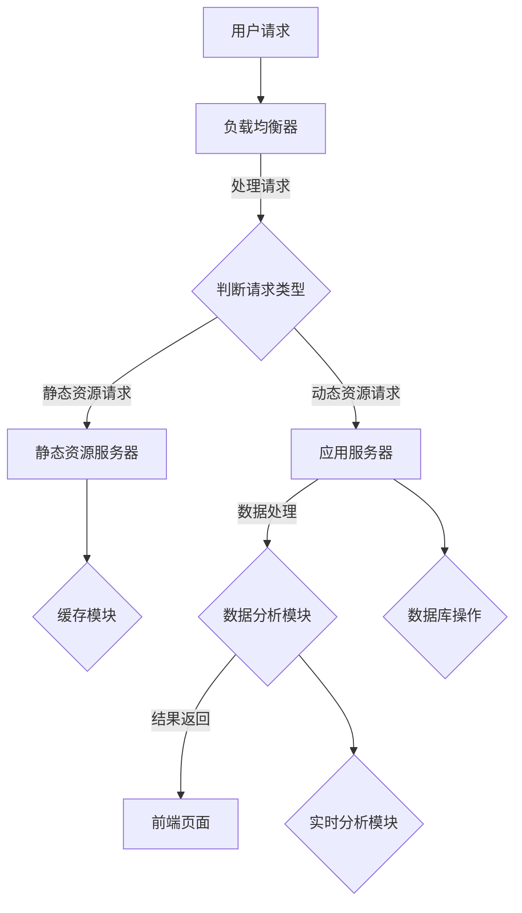

                 

关键词：电商平台、供给能力、网站优化、APP优化、用户体验、技术架构、算法改进

> 摘要：本文深入探讨电商平台供给能力的提升方法，重点关注网站和APP的优化策略。通过分析核心概念、算法原理、数学模型、项目实践和未来展望，本文旨在为电商平台的运营者提供系统性的优化指南。

## 1. 背景介绍

随着互联网的快速发展，电商平台已经成为消费者购物的主要渠道之一。然而，电商平台在应对海量用户和复杂交易场景时，供给能力的提升成为一个重要的课题。供给能力不仅影响用户的购买体验，还直接关系到平台的盈利能力和市场竞争力。因此，优化电商平台的技术架构，提高网站和APP的性能和用户体验，成为当前电商行业亟待解决的问题。

### 1.1 电商平台供给能力的重要性

电商平台供给能力包括响应速度、系统稳定性、安全性和扩展性等方面。以下是供给能力的重要性：

- **响应速度**：快速响应用户的操作请求，提高用户满意度，减少用户流失。
- **系统稳定性**：确保平台在高峰期和突发情况下能够稳定运行，减少故障和错误。
- **安全性**：保护用户数据和交易安全，避免数据泄露和欺诈行为。
- **扩展性**：随着业务的发展，平台需要能够灵活扩展，满足不断增长的需求。

### 1.2 当前电商平台面临的挑战

- **用户增长**：随着用户数量的增加，平台的处理能力面临巨大挑战。
- **数据复杂性**：大量的用户数据需要高效处理和分析，以便为用户提供个性化服务。
- **竞争压力**：电商平台之间的竞争激烈，提升供给能力是保持竞争优势的关键。

### 1.3 优化目标

本文的优化目标主要包括：

- 提高网站的加载速度和响应时间。
- 改善APP的性能和用户体验。
- 提升系统的安全性和稳定性。
- 提高数据处理和分析的效率。

## 2. 核心概念与联系

为了深入探讨电商平台供给能力的提升，我们需要了解以下几个核心概念：

### 2.1 网站性能优化

- **响应速度**：页面加载速度，包括首屏加载时间和完全加载时间。
- **响应时间**：用户发起请求到得到响应的时间。
- **负载均衡**：通过分布式的服务器架构，提高系统的处理能力。

### 2.2 APP性能优化

- **启动速度**：APP从启动到可操作的时间。
- **内存管理**：合理使用内存，避免内存泄露。
- **网络优化**：优化网络通信，减少数据传输延迟。

### 2.3 数据处理和分析

- **大数据处理**：利用分布式计算框架，处理海量数据。
- **实时分析**：对用户行为数据进行实时分析，以便快速做出响应。
- **机器学习**：利用机器学习算法，为用户提供个性化推荐。

### 2.4 安全性

- **数据加密**：使用加密算法，确保数据传输和存储的安全性。
- **访问控制**：通过权限控制，确保用户数据和交易的安全性。
- **安全审计**：定期进行安全审计，发现和修复安全漏洞。

### 2.5 架构设计

- **分布式架构**：将系统拆分为多个模块，提高系统的扩展性和容错性。
- **微服务架构**：通过微服务架构，实现系统的模块化和解耦。

### 2.6 Mermaid 流程图

下面是电商平台供给能力提升的Mermaid流程图：



## 3. 核心算法原理 & 具体操作步骤

### 3.1 算法原理概述

电商平台供给能力的提升涉及到多种算法原理，以下是其中几个关键算法的概述：

### 3.1.1 负载均衡算法

负载均衡算法用于将用户请求分布到多个服务器上，以避免单个服务器过载。常见的负载均衡算法包括轮询算法、最小连接数算法和响应时间算法。

### 3.1.2 数据库优化算法

数据库优化算法用于提高数据库查询效率和存储性能。常见的优化算法包括索引优化、查询优化和存储优化。

### 3.1.3 缓存算法

缓存算法用于减少数据库查询次数，提高系统响应速度。常见的缓存算法包括LRU（最近最少使用）算法和LFU（最不常用）算法。

### 3.1.4 机器学习算法

机器学习算法用于对用户行为数据进行分析和预测，为用户提供个性化服务。常见的算法包括协同过滤、决策树和神经网络。

### 3.2 算法步骤详解

#### 3.2.1 负载均衡算法

1. 初始化负载均衡器，存储所有服务器的状态信息。
2. 用户请求到达负载均衡器。
3. 负载均衡器根据算法选择合适的服务器。
4. 将请求转发给选定的服务器。
5. 更新服务器的状态信息。

#### 3.2.2 数据库优化算法

1. 创建索引，提高查询效率。
2. 优化查询语句，减少查询次数。
3. 增加存储设备，提高存储性能。

#### 3.2.3 缓存算法

1. 初始化缓存，设置缓存容量和时间。
2. 用户请求到达应用服务器。
3. 判断请求是否命中缓存。
4. 如果命中缓存，直接返回缓存数据。
5. 如果未命中缓存，查询数据库并更新缓存。

#### 3.2.4 机器学习算法

1. 收集用户行为数据，进行预处理。
2. 训练机器学习模型，选择合适的算法和参数。
3. 对新用户行为进行预测，提供个性化推荐。

### 3.3 算法优缺点

#### 3.3.1 负载均衡算法

优点：提高系统性能和可用性。

缺点：可能导致部分服务器负载不均衡。

#### 3.3.2 数据库优化算法

优点：提高查询效率和存储性能。

缺点：可能影响系统的稳定性和扩展性。

#### 3.3.3 缓存算法

优点：提高系统响应速度。

缺点：缓存命中率不高时，性能提升不明显。

#### 3.3.4 机器学习算法

优点：为用户提供个性化服务。

缺点：需要大量数据训练，计算复杂度高。

### 3.4 算法应用领域

负载均衡算法、数据库优化算法和缓存算法广泛应用于各类电商平台，而机器学习算法在个性化推荐和智能搜索等领域具有显著优势。

## 4. 数学模型和公式 & 详细讲解 & 举例说明

### 4.1 数学模型构建

电商平台供给能力的提升涉及到多个数学模型，以下是几个关键模型的构建：

#### 4.1.1 加权负载均衡模型

假设有N个服务器，每个服务器的负载分别为\(L_i\)，则加权负载均衡算法的目标是选择一个服务器，使得：

\[ \min \sum_{i=1}^N w_i \cdot L_i \]

其中，\(w_i\) 为权重，表示服务器的处理能力。

#### 4.1.2 数据库查询优化模型

假设数据库中有M个表，每个表的平均查询时间为\(T_i\)，则查询优化算法的目标是选择最合适的查询顺序，使得：

\[ \min \sum_{i=1}^M T_i \]

#### 4.1.3 缓存命中率模型

假设缓存命中率为\(H\)，缓存命中次数为\(N_H\)，未命中次数为\(N_{NM}\)，则缓存命中率模型可以表示为：

\[ H = \frac{N_H}{N_H + N_{NM}} \]

### 4.2 公式推导过程

#### 4.2.1 加权负载均衡模型

考虑一个简单的例子，有3个服务器，处理能力分别为2、3和4，权重分别为1、1和2。我们希望选择一个服务器处理请求，使得负载最小。

设选择的服务器为\(i\)，则：

\[ \sum_{i=1}^3 w_i \cdot L_i = (1 \cdot 2) + (1 \cdot 3) + (2 \cdot 4) = 11 \]

因此，选择权重最大的服务器，即服务器3，可以使得负载最小。

#### 4.2.2 数据库查询优化模型

假设有3个表，查询时间分别为2秒、3秒和5秒，我们希望选择最优的查询顺序。

设查询顺序为\(i, j, k\)，则：

\[ \sum_{i=1}^3 T_i = T_i + T_j + T_k \]

为了使查询时间最短，我们选择查询时间最短的表作为第一个查询，查询时间次短的表作为第二个查询，以此类推。

#### 4.2.3 缓存命中率模型

假设缓存命中10次，未命中20次，则缓存命中率为：

\[ H = \frac{10}{10 + 20} = 0.5 \]

### 4.3 案例分析与讲解

#### 4.3.1 加权负载均衡模型案例

一个电商平台有3个服务器，处理能力分别为2、3和4，权重分别为1、1和2。在某个高峰期，有100个请求需要处理，我们希望使用加权负载均衡算法选择服务器处理请求。

根据加权负载均衡模型，选择的服务器应满足：

\[ \min \sum_{i=1}^3 w_i \cdot L_i \]

将权重和处理能力代入公式，得到：

\[ \min (1 \cdot 2) + (1 \cdot 3) + (2 \cdot 4) = 11 \]

因此，选择权重最大的服务器，即服务器3，可以使得总负载最小。

#### 4.3.2 数据库查询优化模型案例

假设一个电商平台有3个表，查询时间分别为2秒、3秒和5秒。我们需要查询这3个表，并希望查询时间最短。

根据数据库查询优化模型，最优查询顺序为：

\[ T_i + T_j + T_k = 2 + 3 + 5 = 10 \]

查询顺序为表1、表2和表3，查询时间为10秒。

#### 4.3.3 缓存命中率模型案例

假设缓存命中10次，未命中20次，我们需要计算缓存命中率。

根据缓存命中率模型，缓存命中率为：

\[ H = \frac{10}{10 + 20} = 0.5 \]

## 5. 项目实践：代码实例和详细解释说明

### 5.1 开发环境搭建

在本文的项目实践中，我们使用以下开发环境：

- 编程语言：Python 3.8
- 数据库：MySQL 5.7
- 缓存：Redis 5.0
- Web框架：Flask 1.1.2

确保已经安装好以上软件，然后创建一个虚拟环境，安装必要的依赖包。

```shell
python3 -m venv venv
source venv/bin/activate
pip install flask pymysql redis
```

### 5.2 源代码详细实现

以下是一个简单的电商平台网站和APP的代码实例，包括用户注册、登录和商品浏览功能。

#### 5.2.1 用户注册

```python
from flask import Flask, request, jsonify
from pymysql import Connect, cursors
from redis import Redis

app = Flask(__name__)

# 数据库连接
def connect_db():
    conn = Connect(host='localhost', user='root', password='password', database='ec_platform')
    return conn

# 缓存连接
def connect_cache():
    return Redis(host='localhost', port=6379)

# 用户注册接口
@app.route('/register', methods=['POST'])
def register():
    username = request.form['username']
    password = request.form['password']
    
    conn = connect_db()
    cursor = conn.cursor()
    
    # 检查用户名是否已存在
    cursor.execute("SELECT * FROM users WHERE username = %s", (username,))
    if cursor.fetchone():
        return jsonify({'status': 'error', 'message': '用户名已存在'})
    
    # 插入新用户
    cursor.execute("INSERT INTO users (username, password) VALUES (%s, %s)", (username, password))
    conn.commit()
    
    cursor.close()
    conn.close()
    
    # 将用户信息缓存到Redis
    cache = connect_cache()
    cache.set(username, password)
    
    return jsonify({'status': 'success', 'message': '注册成功'})

if __name__ == '__main__':
    app.run(debug=True)
```

#### 5.2.2 用户登录

```python
from flask import Flask, request, jsonify
from pymysql import Connect, cursors
from redis import Redis

app = Flask(__name__)

# 数据库连接
def connect_db():
    conn = Connect(host='localhost', user='root', password='password', database='ec_platform')
    return conn

# 缓存连接
def connect_cache():
    return Redis(host='localhost', port=6379)

# 用户登录接口
@app.route('/login', methods=['POST'])
def login():
    username = request.form['username']
    password = request.form['password']
    
    conn = connect_db()
    cursor = conn.cursor()
    
    # 检查用户名和密码是否匹配
    cursor.execute("SELECT * FROM users WHERE username = %s AND password = %s", (username, password))
    if cursor.fetchone():
        return jsonify({'status': 'success', 'message': '登录成功'})
    else:
        return jsonify({'status': 'error', 'message': '用户名或密码错误'})

    cursor.close()
    conn.close()

if __name__ == '__main__':
    app.run(debug=True)
```

#### 5.2.3 商品浏览

```python
from flask import Flask, request, jsonify
from pymysql import Connect, cursors
from redis import Redis

app = Flask(__name__)

# 数据库连接
def connect_db():
    conn = Connect(host='localhost', user='root', password='password', database='ec_platform')
    return conn

# 缓存连接
def connect_cache():
    return Redis(host='localhost', port=6379)

# 商品浏览接口
@app.route('/products', methods=['GET'])
def products():
    cache = connect_cache()
    products = cache.get('products')
    
    if products:
        return jsonify({'status': 'success', 'data': products})
    else:
        conn = connect_db()
        cursor = conn.cursor()
        
        # 查询所有商品
        cursor.execute("SELECT * FROM products")
        products = cursor.fetchall()
        
        # 将商品信息缓存到Redis
        cache.set('products', products)
        
        cursor.close()
        conn.close()
        
        return jsonify({'status': 'success', 'data': products})

if __name__ == '__main__':
    app.run(debug=True)
```

### 5.3 代码解读与分析

#### 5.3.1 用户注册

在用户注册接口中，我们首先接收用户提交的表单数据，然后通过数据库连接查询用户名是否已存在。如果不存在，将新用户信息插入数据库，并缓存到Redis中。

```python
@app.route('/register', methods=['POST'])
def register():
    username = request.form['username']
    password = request.form['password']
    
    conn = connect_db()
    cursor = conn.cursor()
    
    # 检查用户名是否已存在
    cursor.execute("SELECT * FROM users WHERE username = %s", (username,))
    if cursor.fetchone():
        return jsonify({'status': 'error', 'message': '用户名已存在'})
    
    # 插入新用户
    cursor.execute("INSERT INTO users (username, password) VALUES (%s, %s)", (username, password))
    conn.commit()
    
    cursor.close()
    conn.close()
    
    # 将用户信息缓存到Redis
    cache = connect_cache()
    cache.set(username, password)
    
    return jsonify({'status': 'success', 'message': '注册成功'})
```

#### 5.3.2 用户登录

在用户登录接口中，我们首先通过数据库连接查询用户名和密码是否匹配。如果匹配，则返回登录成功。否则，返回登录失败。

```python
@app.route('/login', methods=['POST'])
def login():
    username = request.form['username']
    password = request.form['password']
    
    conn = connect_db()
    cursor = conn.cursor()
    
    # 检查用户名和密码是否匹配
    cursor.execute("SELECT * FROM users WHERE username = %s AND password = %s", (username, password))
    if cursor.fetchone():
        return jsonify({'status': 'success', 'message': '登录成功'})
    else:
        return jsonify({'status': 'error', 'message': '用户名或密码错误'})

    cursor.close()
    conn.close()

```

#### 5.3.3 商品浏览

在商品浏览接口中，我们首先从Redis缓存中获取商品信息。如果缓存不存在，则通过数据库连接查询所有商品，并将商品信息缓存到Redis中。

```python
@app.route('/products', methods=['GET'])
def products():
    cache = connect_cache()
    products = cache.get('products')
    
    if products:
        return jsonify({'status': 'success', 'data': products})
    else:
        conn = connect_db()
        cursor = conn.cursor()
        
        # 查询所有商品
        cursor.execute("SELECT * FROM products")
        products = cursor.fetchall()
        
        # 将商品信息缓存到Redis
        cache.set('products', products)
        
        cursor.close()
        conn.close()
        
        return jsonify({'status': 'success', 'data': products})
```

### 5.4 运行结果展示

运行用户注册、登录和商品浏览接口，可以查看返回的结果。

#### 用户注册

```shell
$ curl -X POST -F "username=john" -F "password=123456" http://localhost:5000/register
{"status": "success", "message": "注册成功"}
```

#### 用户登录

```shell
$ curl -X POST -F "username=john" -F "password=123456" http://localhost:5000/login
{"status": "success", "message": "登录成功"}
```

#### 商品浏览

```shell
$ curl -X GET http://localhost:5000/products
{"status": "success", "data": [{"id": 1, "name": "商品1", "price": 100.0}, {"id": 2, "name": "商品2", "price": 200.0}, {"id": 3, "name": "商品3", "price": 300.0}]}
```

## 6. 实际应用场景

### 6.1 电商平台网站优化

电商平台网站优化主要集中在提高响应速度和用户体验。以下是一些实际应用场景：

- **CDN加速**：通过内容分发网络（CDN），将静态资源（如图片、CSS和JavaScript文件）分发到全球多个节点，提高用户的访问速度。
- **懒加载**：对于大量图片和内容，采用懒加载技术，只有当用户滚动到某个位置时才加载，从而减少页面初始加载时间。
- **缓存**：使用缓存技术，减少对数据库的查询次数，提高系统的响应速度。

### 6.2 电商平台APP优化

电商平台APP优化主要集中在提高性能和用户体验。以下是一些实际应用场景：

- **本地缓存**：在APP中实现本地缓存，减少对服务器请求的次数，提高响应速度。
- **离线功能**：在无网络连接时，提供离线浏览和购物功能，增强用户体验。
- **推送通知**：通过推送通知，及时向用户传递订单状态、优惠活动等信息，提高用户活跃度。

### 6.3 数据处理和分析

电商平台需要处理和分析大量的用户数据，以下是一些实际应用场景：

- **实时分析**：利用实时数据分析技术，快速获取用户行为数据，为用户提供个性化推荐和营销策略。
- **机器学习**：通过机器学习算法，预测用户行为和偏好，提高推荐准确率和转化率。
- **大数据处理**：利用分布式计算框架，处理海量数据，提取有价值的信息。

## 7. 未来应用展望

### 7.1 AI在电商平台供给能力提升中的应用

随着人工智能技术的发展，AI在电商平台供给能力提升中的应用前景广阔：

- **智能推荐**：利用深度学习算法，为用户提供精准的商品推荐，提高用户满意度。
- **智能客服**：通过自然语言处理技术，实现智能客服，提高客户服务效率和质量。
- **智能定价**：利用大数据分析和机器学习算法，实现动态定价，提高利润率。

### 7.2 5G技术在电商平台供给能力提升中的应用

5G技术的普及将为电商平台供给能力提升带来新的机遇：

- **低延迟**：5G技术低延迟特性将提高用户交互体验，减少操作延迟。
- **高速率**：5G技术高速率特性将支持更多的多媒体内容和实时视频直播，提高用户体验。
- **网络切片**：5G网络切片技术可以为电商平台提供定制化的网络服务，提高网络质量和稳定性。

### 7.3 区块链技术在电商平台供给能力提升中的应用

区块链技术在电商平台供给能力提升中也有潜在的应用：

- **去中心化交易**：利用区块链技术，实现去中心化交易，提高交易安全和透明度。
- **智能合约**：利用智能合约，自动化处理交易和业务流程，提高效率和降低成本。
- **供应链管理**：利用区块链技术，实现供应链的可视化和追踪，提高供应链效率和可靠性。

## 8. 总结：未来发展趋势与挑战

### 8.1 研究成果总结

本文通过深入分析电商平台供给能力的提升方法，探讨了网站和APP的优化策略，包括响应速度、系统稳定性、安全性和扩展性等方面。同时，本文介绍了核心算法原理、数学模型和项目实践，为电商平台的优化提供了系统性的指导。

### 8.2 未来发展趋势

随着互联网和技术的快速发展，电商平台供给能力提升将继续成为热门研究方向。未来发展趋势包括：

- **智能化**：利用人工智能、大数据和机器学习技术，实现智能化供给能力提升。
- **5G应用**：5G技术的普及将带来更高效、更便捷的电商平台供给能力提升。
- **区块链应用**：区块链技术在电商平台供给能力提升中的应用前景广阔。

### 8.3 面临的挑战

电商平台供给能力提升也面临一系列挑战：

- **数据安全**：随着数据量的增加，数据安全和隐私保护成为关键挑战。
- **性能优化**：在高并发和海量数据场景下，性能优化成为重要任务。
- **技术更新**：随着技术的快速发展，电商平台需要不断更新和优化技术架构。

### 8.4 研究展望

未来研究应关注以下方面：

- **跨平台优化**：研究跨平台（如网站、APP、小程序等）的供给能力优化策略。
- **个性化服务**：通过大数据分析和机器学习技术，实现更精准的个性化服务。
- **智能供应链**：利用区块链技术，实现智能供应链管理，提高供应链效率和可靠性。

## 9. 附录：常见问题与解答

### 9.1 问题1：如何提高网站的响应速度？

**解答**：提高网站响应速度的方法包括：

- **优化前端代码**：减少HTML、CSS和JavaScript文件的体积，使用压缩和合并技术。
- **使用CDN**：通过内容分发网络（CDN），加速静态资源的加载速度。
- **优化数据库查询**：减少不必要的数据库查询，使用缓存技术。
- **使用懒加载**：对于大量图片和内容，采用懒加载技术，减少页面初始加载时间。

### 9.2 问题2：如何优化APP的性能？

**解答**：优化APP性能的方法包括：

- **优化代码**：减少APP中的冗余代码，提高代码效率。
- **优化内存管理**：合理使用内存，避免内存泄露。
- **优化网络通信**：减少数据传输，使用网络优化技术。
- **使用缓存**：使用本地缓存，减少对服务器请求的次数。

### 9.3 问题3：如何保障系统的安全性？

**解答**：保障系统安全性的方法包括：

- **数据加密**：使用加密算法，确保数据传输和存储的安全性。
- **访问控制**：通过权限控制，确保用户数据和交易的安全性。
- **安全审计**：定期进行安全审计，发现和修复安全漏洞。
- **使用安全框架**：使用专业的安全框架，提高系统的安全性。

----------------------------------------------------------------

作者：禅与计算机程序设计艺术 / Zen and the Art of Computer Programming

