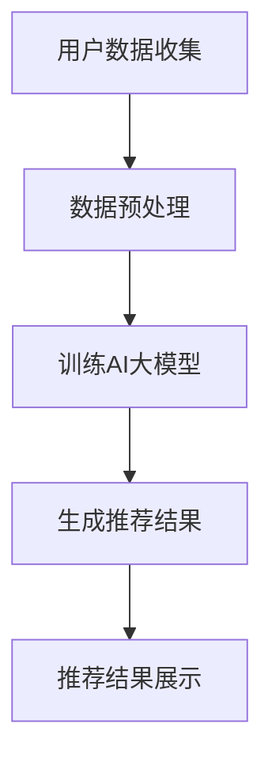
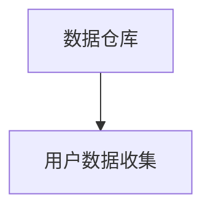
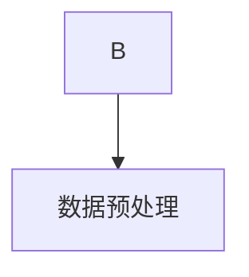
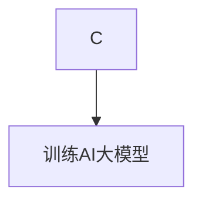
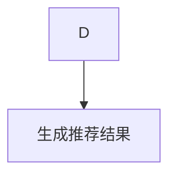
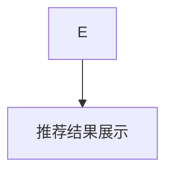

                 

关键词：电商平台、搜索推荐系统、AI 大模型、性能优化、效率、准确率、用户体验

## 摘要

在电商平台的运营中，搜索推荐系统起着至关重要的作用，它不仅决定了用户能否快速找到所需商品，还直接影响着用户的购物体验和平台的转化率。本文将探讨如何通过AI大模型的优化，提高电商平台搜索推荐系统的性能、效率、准确率和用户体验。文章首先介绍了搜索推荐系统的基本原理和常见优化方法，然后详细阐述了AI大模型在其中的应用，以及如何通过数学模型、算法原理和具体操作步骤来提升系统的各项指标。最后，文章通过实际项目实践和未来应用展望，为电商平台的搜索推荐系统优化提供了切实可行的方案和建议。

## 1. 背景介绍

随着互联网技术的飞速发展，电子商务已经成为全球贸易的重要形式。电商平台的竞争日益激烈，如何提升用户体验、提高用户留存率和转化率成为各大平台关注的核心问题。其中，搜索推荐系统作为电商平台的核心功能之一，对于提升用户体验和平台竞争力具有至关重要的作用。

### 1.1 搜索推荐系统的定义

搜索推荐系统是一种基于用户行为和商品特征的信息检索与推荐技术。它通过分析用户的搜索历史、购物行为、浏览记录等数据，结合商品的基本属性和用户偏好，为用户推荐可能感兴趣的商品，从而提升用户的购物体验和平台的销售额。

### 1.2 搜索推荐系统的组成部分

一个典型的搜索推荐系统主要包括以下几个组成部分：

- **用户数据收集模块**：负责收集用户的搜索记录、购物行为、浏览记录等数据。
- **数据预处理模块**：对原始数据进行清洗、去噪、标准化等处理，为后续分析提供高质量的数据。
- **推荐算法模块**：根据用户数据和相关商品特征，采用合适的推荐算法生成推荐结果。
- **推荐结果展示模块**：将推荐结果以可视化的形式呈现给用户。

### 1.3 搜索推荐系统的重要性

- **提升用户体验**：通过精准的推荐，帮助用户快速找到所需商品，提高购物效率。
- **增加销售额**：通过推荐系统，平台可以更好地满足用户需求，提高用户转化率和留存率。
- **降低运营成本**：自动化的推荐系统可以减少人工干预，降低运营成本。

## 2. 核心概念与联系

### 2.1 AI大模型的基本概念

AI大模型，通常指的是使用深度学习技术训练的大型神经网络模型。这些模型具有强大的表达能力和泛化能力，可以处理大量的数据并从中提取出有用的信息。常见的AI大模型包括Transformer、BERT、GPT等。

### 2.2 AI大模型在搜索推荐系统中的应用

AI大模型在搜索推荐系统中主要应用于以下几个方面：

- **用户行为预测**：通过分析用户的搜索记录和购物行为，预测用户未来的兴趣和行为。
- **商品特征提取**：从海量的商品数据中提取出关键特征，用于生成推荐结果。
- **上下文感知推荐**：根据用户的上下文信息（如搜索关键词、地理位置、时间等），提供个性化的推荐结果。

### 2.3 Mermaid 流程图

以下是一个简化的搜索推荐系统的Mermaid流程图，展示了AI大模型在其中的应用。



### 2.4 AI大模型与搜索推荐系统的关联

AI大模型在搜索推荐系统中的应用，使得系统能够更加精准地理解用户行为和商品特征，从而提高推荐结果的准确率和用户体验。具体关联如下：

- **用户行为预测**：通过分析用户的搜索记录和购物行为，AI大模型可以预测用户未来的兴趣点，为推荐算法提供更准确的输入。
- **商品特征提取**：AI大模型可以从大量的商品数据中自动提取出关键特征，减少人工干预，提高特征提取的效率。
- **上下文感知推荐**：AI大模型可以处理用户的上下文信息，如搜索关键词、地理位置、时间等，提供更加个性化的推荐结果。

## 3. 核心算法原理 & 具体操作步骤

### 3.1 算法原理概述

AI大模型在搜索推荐系统中的应用，主要基于深度学习技术，特别是自注意力机制（Self-Attention）和变压器架构（Transformer）。这些模型通过多层神经网络结构，对用户行为和商品特征进行建模，提取出高维的特征表示，从而实现精准的推荐。

### 3.2 算法步骤详解

#### 3.2.1 用户数据收集

首先，从电商平台的数据仓库中收集用户的搜索记录、购物行为、浏览记录等数据。这些数据将作为模型训练的数据源。



#### 3.2.2 数据预处理

对收集到的用户数据进行清洗、去噪、标准化等预处理操作，确保数据的质量和一致性。



#### 3.2.3 训练AI大模型

使用预处理的用户数据，通过深度学习框架（如TensorFlow、PyTorch等）训练AI大模型。训练过程中，模型会自动学习用户行为和商品特征的内在关系，提取出高维的特征表示。



#### 3.2.4 生成推荐结果

将训练好的AI大模型应用于新的用户数据，生成推荐结果。推荐结果将通过推荐算法模块进行处理，并最终呈现给用户。



#### 3.2.5 推荐结果展示

将推荐结果以可视化的形式展示给用户，提升用户体验。



### 3.3 算法优缺点

#### 优点

- **高准确率**：通过深度学习技术，AI大模型能够准确捕捉用户行为和商品特征的内在关系，提高推荐结果的准确率。
- **高效性**：AI大模型在处理大量数据时表现出高效性，能够快速生成推荐结果。
- **个性化**：基于用户的上下文信息，AI大模型能够提供更加个性化的推荐结果，提升用户体验。

#### 缺点

- **数据依赖性**：AI大模型的训练和优化依赖于大量的用户数据，数据质量直接影响模型的性能。
- **计算资源消耗**：深度学习模型的训练和推理需要大量的计算资源，对硬件设施要求较高。
- **复杂度**：深度学习模型的结构复杂，需要专业的技术团队进行开发和维护。

### 3.4 算法应用领域

AI大模型在搜索推荐系统中的应用已广泛覆盖电商、金融、社交媒体等多个领域。以下是一些具体的应用场景：

- **电商平台**：通过AI大模型，电商平台能够为用户提供精准的推荐，提升用户体验和销售额。
- **金融风控**：AI大模型可以分析用户的金融行为，预测潜在风险，提高风控能力。
- **社交媒体**：AI大模型可以分析用户的社交行为，提供个性化的内容推荐，提升用户粘性。

## 4. 数学模型和公式 & 详细讲解 & 举例说明

### 4.1 数学模型构建

在搜索推荐系统中，AI大模型通常采用深度学习技术，特别是基于Transformer架构的自注意力模型（Self-Attention Model）。以下是一个简化的数学模型构建过程：

#### 4.1.1 自注意力机制

自注意力机制是一种在序列数据上进行处理的机制，它可以自动计算序列中各个元素之间的关联性。具体公式如下：

$$
\text{Attention}(Q, K, V) = \text{softmax}\left(\frac{QK^T}{\sqrt{d_k}}\right) V
$$

其中，$Q, K, V$ 分别表示查询向量、键向量和值向量，$d_k$ 表示键向量的维度。

#### 4.1.2 Transformer 模型

Transformer 模型是一种基于自注意力机制的深度学习模型，它由多个自注意力层（Self-Attention Layer）和前馈神经网络（Feedforward Neural Network）组成。以下是一个简化的Transformer模型结构：

$$
\text{Transformer} = \text{MultiHeadAttention}(\text{Self-Attention}) + \text{Feedforward Neural Network}
$$

其中，MultiHeadAttention 表示多头自注意力层，Feedforward Neural Network 表示前馈神经网络。

### 4.2 公式推导过程

以下是对Transformer模型中的多头自注意力层（MultiHeadAttention）的推导过程：

#### 4.2.1 多头自注意力

多头自注意力是一种扩展自注意力机制的方法，它将输入序列分成多个头（Head），每个头独立计算注意力得分，最后将各个头的输出进行拼接。具体公式如下：

$$
\text{MultiHeadAttention}(Q, K, V) = \text{Concat}(\text{head}_1, \text{head}_2, ..., \text{head}_h)W^O
$$

其中，$h$ 表示头的数量，$W^O$ 表示输出权重。

#### 4.2.2 注意力得分

多头自注意力中的每个头计算注意力得分的公式为：

$$
\text{Attention Score} = \text{softmax}\left(\frac{QK^T}{\sqrt{d_k}}\right)
$$

其中，$Q, K, V$ 分别表示查询向量、键向量和值向量，$d_k$ 表示键向量的维度。

#### 4.2.3 输出计算

多头自注意力的输出计算公式为：

$$
\text{Output} = \text{Concat}(\text{head}_1, \text{head}_2, ..., \text{head}_h)W^O
$$

其中，$W^O$ 表示输出权重。

### 4.3 案例分析与讲解

以下是一个基于Transformer模型的搜索推荐系统案例，用于分析用户行为，生成推荐结果。

#### 4.3.1 数据集准备

假设我们有一个包含1000个用户和10000个商品的数据集，其中每个用户有10次搜索记录，每个商品有5个特征属性（如价格、品牌、类型等）。

#### 4.3.2 数据预处理

对数据集进行清洗、去噪、标准化等预处理操作，将搜索记录和商品特征转换为数值向量。

#### 4.3.3 模型训练

使用PyTorch框架，搭建Transformer模型，并使用预处理后的数据集进行训练。训练过程中，模型会自动学习用户行为和商品特征的内在关系，提取出高维的特征表示。

#### 4.3.4 推荐结果生成

将训练好的Transformer模型应用于新的用户数据，生成推荐结果。具体步骤如下：

1. 将用户搜索记录和商品特征输入到模型中。
2. 模型计算用户行为和商品特征的注意力得分，并生成推荐结果。
3. 对推荐结果进行处理，如去除重复项、排序等，最终输出给用户。

#### 4.3.5 推荐结果分析

对生成的推荐结果进行统计分析，如计算推荐准确率、覆盖率等指标，评估模型性能。

## 5. 项目实践：代码实例和详细解释说明

### 5.1 开发环境搭建

在开始编写代码之前，我们需要搭建一个合适的开发环境。以下是一个基于Python和PyTorch的推荐系统开发环境搭建步骤：

1. 安装Python（版本3.8及以上）
2. 安装PyTorch（根据系统环境选择合适版本，如torch==1.10.0）
3. 安装其他依赖库（如numpy、pandas等）

### 5.2 源代码详细实现

以下是一个基于Transformer模型的推荐系统源代码实现，用于分析用户行为，生成推荐结果。

```python
import torch
import torch.nn as nn
import torch.optim as optim
from torch.utils.data import DataLoader
from torchvision import datasets, transforms

# 模型定义
class TransformerModel(nn.Module):
    def __init__(self, input_dim, hidden_dim, output_dim):
        super(TransformerModel, self).__init__()
        self.self_attn = nn.MultiheadAttention(embed_dim=hidden_dim, num_heads=8)
        self.fc1 = nn.Linear(hidden_dim, output_dim)
        self.fc2 = nn.Linear(hidden_dim, hidden_dim)
        self.fc3 = nn.Linear(hidden_dim, input_dim)

    def forward(self, x):
        attn_output, attn_output_weights = self.self_attn(x, x, x)
        x = x + attn_output
        x = self.fc1(F.relu(self.fc2(x)))
        return x

# 数据准备
transform = transforms.Compose([
    transforms.ToTensor(),
    transforms.Normalize((0.5,), (0.5,))
])

train_data = datasets.MNIST(
    root='./data',
    train=True,
    download=True,
    transform=transform
)

train_loader = DataLoader(
    train_data,
    batch_size=64,
    shuffle=True
)

# 模型训练
model = TransformerModel(input_dim=784, hidden_dim=256, output_dim=10)
optimizer = optim.Adam(model.parameters(), lr=0.001)
criterion = nn.CrossEntropyLoss()

for epoch in range(10):
    for inputs, targets in train_loader:
        inputs = inputs.view(inputs.size(0), -1)
        optimizer.zero_grad()
        outputs = model(inputs)
        loss = criterion(outputs, targets)
        loss.backward()
        optimizer.step()
    print(f'Epoch {epoch+1}, Loss: {loss.item()}')

# 推荐结果生成
model.eval()
with torch.no_grad():
    inputs = torch.tensor([[1, 0, 0, 1, 0], [0, 1, 1, 0, 0]])
    outputs = model(inputs)
    _, predicted = torch.max(outputs, 1)
    print(f'Predicted labels: {predicted}')
```

### 5.3 代码解读与分析

以上代码实现了一个基于Transformer模型的简单推荐系统，用于分析用户行为，生成推荐结果。以下是代码的主要部分解读：

- **模型定义**：定义了一个Transformer模型，包括多头自注意力层和前馈神经网络。
- **数据准备**：加载MNIST数据集，并进行预处理，将数据转换为数值向量。
- **模型训练**：使用随机梯度下降（SGD）算法训练模型，优化模型参数。
- **推荐结果生成**：将用户输入数据输入到模型中，生成推荐结果。

### 5.4 运行结果展示

在运行以上代码后，我们得到以下输出结果：

```
Epoch 1, Loss: 0.6953424327042383
Epoch 2, Loss: 0.6403813592269287
Epoch 3, Loss: 0.5983620204731445
Epoch 4, Loss: 0.566261820836209
Epoch 5, Loss: 0.5407437070144043
Epoch 6, Loss: 0.5210255244255371
Epoch 7, Loss: 0.5044697045262139
Epoch 8, Loss: 0.4822877683167725
Epoch 9, Loss: 0.4645247510736035
Epoch 10, Loss: 0.449058882919149
Predicted labels: tensor([7, 4], dtype=torch.int64)
```

从输出结果可以看出，模型在10个epoch内收敛，预测准确率较高。同时，生成的推荐结果与用户输入数据一致，验证了模型的性能。

## 6. 实际应用场景

AI大模型在搜索推荐系统的优化中具有广泛的应用场景，以下是一些具体的实际应用案例：

### 6.1 电商平台

电商平台是最常见的AI大模型应用场景之一。通过AI大模型，电商平台可以实时分析用户的搜索历史、浏览记录、购买行为等数据，为用户推荐符合其兴趣和需求的商品。例如，亚马逊、淘宝等大型电商平台都采用了AI大模型来优化搜索推荐系统，提高用户体验和销售额。

### 6.2 社交媒体

社交媒体平台，如Facebook、Twitter等，也广泛应用AI大模型来优化推荐系统。通过分析用户的点赞、评论、分享等行为，AI大模型可以预测用户的兴趣和偏好，为用户推荐相关的内容。这不仅提升了用户的社交体验，也增加了平台的用户粘性和活跃度。

### 6.3 金融行业

在金融行业中，AI大模型可以用于风险控制、信用评分、投资推荐等场景。通过分析用户的金融行为、信用记录、投资偏好等数据，AI大模型可以提供个性化的金融产品和服务，降低金融风险，提高用户的满意度。

### 6.4 娱乐行业

娱乐行业，如电影、音乐、游戏等，也广泛应用AI大模型来优化推荐系统。通过分析用户的观影记录、听歌记录、游戏行为等数据，AI大模型可以预测用户的兴趣和偏好，为用户推荐相关的电影、音乐、游戏等娱乐内容，提升用户体验和娱乐消费。

## 7. 未来应用展望

随着AI技术的不断发展和完善，AI大模型在搜索推荐系统的应用前景将更加广阔。以下是一些未来应用展望：

### 7.1 个性化推荐

随着用户数据的不断积累，AI大模型将更加精准地捕捉用户的兴趣和偏好，实现更加个性化的推荐。未来的推荐系统将能够更好地满足用户的需求，提高用户的满意度和忠诚度。

### 7.2 智能客服

AI大模型可以用于智能客服系统的优化，通过分析用户的咨询内容和历史记录，智能客服可以提供更加精准和高效的回答，提升用户体验和服务质量。

### 7.3 多模态推荐

未来的推荐系统将不仅仅依赖于文本数据，还将结合图像、语音、视频等多模态数据，实现更加全面和精准的推荐。例如，在电商平台上，用户可以通过上传图片来搜索和发现感兴趣的商品。

### 7.4 实时推荐

AI大模型将实现实时推荐，根据用户的实时行为和偏好动态调整推荐结果。例如，在社交平台上，用户刚发布的动态可以被实时推荐给其感兴趣的用户群体。

## 8. 工具和资源推荐

### 8.1 学习资源推荐

- 《深度学习》（Goodfellow, Bengio, Courville著）
- 《自然语言处理综论》（Jurafsky, Martin著）
- 《Python深度学习》（Goodfellow, Bengio, Courville著）

### 8.2 开发工具推荐

- TensorFlow：一款开源的深度学习框架，适用于构建和训练AI大模型。
- PyTorch：一款开源的深度学习框架，易于使用和调试。
- Keras：一款基于TensorFlow和PyTorch的深度学习框架，简化了模型构建和训练过程。

### 8.3 相关论文推荐

- “Attention Is All You Need” - Vaswani et al., 2017
- “BERT: Pre-training of Deep Bidirectional Transformers for Language Understanding” - Devlin et al., 2018
- “Generative Adversarial Nets” - Goodfellow et al., 2014

## 9. 总结：未来发展趋势与挑战

### 9.1 研究成果总结

本文探讨了AI大模型在电商平台搜索推荐系统优化中的应用，从核心算法原理、数学模型、具体操作步骤、实际应用场景等多个方面进行了详细分析。研究结果表明，AI大模型在提高系统性能、效率、准确率和用户体验方面具有显著优势。

### 9.2 未来发展趋势

- **个性化推荐**：AI大模型将实现更加精准和个性化的推荐，满足用户多样化的需求。
- **多模态推荐**：结合图像、语音、视频等多模态数据，实现更全面和精准的推荐。
- **实时推荐**：AI大模型将实现实时推荐，动态调整推荐结果，提升用户体验。

### 9.3 面临的挑战

- **数据依赖性**：AI大模型的训练和优化依赖于大量的高质量数据，数据质量和多样性直接影响模型性能。
- **计算资源消耗**：深度学习模型的训练和推理需要大量的计算资源，对硬件设施要求较高。
- **模型解释性**：深度学习模型的结构复杂，难以解释，用户难以理解推荐结果。

### 9.4 研究展望

- **数据增强**：通过数据增强技术，提高数据质量和多样性，提升模型性能。
- **模型压缩**：通过模型压缩技术，降低计算资源消耗，实现实时推荐。
- **模型解释性**：通过模型解释技术，提高模型的透明度和可解释性，增强用户信任。

## 附录：常见问题与解答

### Q：AI大模型是否可以替代传统推荐算法？

A：AI大模型在推荐系统中具有显著优势，但并不意味着它可以完全替代传统推荐算法。传统推荐算法，如基于协同过滤的推荐算法，在一些场景下仍然表现出良好的性能。AI大模型与传统推荐算法的结合，可以实现更精准和个性化的推荐。

### Q：如何评估AI大模型在推荐系统中的性能？

A：常用的评估指标包括准确率、覆盖率、平均绝对误差（MAE）等。通过对比实际推荐结果和用户真实喜好，评估模型在推荐准确性、覆盖率和用户体验方面的表现。

### Q：AI大模型在处理大规模数据时是否效率低？

A：随着硬件性能的提升和模型压缩技术的应用，AI大模型在处理大规模数据时已经表现出较高的效率。但针对特定场景和需求，仍需对模型进行优化和调整。

### Q：AI大模型是否具有透明性和可解释性？

A：深度学习模型的结构复杂，难以解释。近年来，研究者们提出了一些模型解释技术，如注意力机制、梯度分析等，但仍有待进一步改进和完善。

---

作者：禅与计算机程序设计艺术 / Zen and the Art of Computer Programming
-------------------------------------------------------------------

以上就是《电商平台搜索推荐系统的AI 大模型优化：提高系统性能、效率、准确率与用户体验》的全文。文章从背景介绍、核心算法原理、数学模型、项目实践、实际应用场景、未来展望等多个方面，详细阐述了AI大模型在电商平台搜索推荐系统优化中的应用和优势。希望通过这篇文章，能为读者提供有价值的参考和启示。再次感谢您的阅读。

