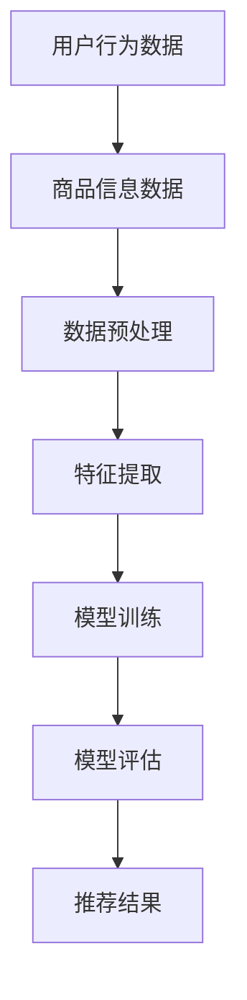

                 

关键词：电商平台、搜索推荐系统、AI大模型、系统性能、效率、准确率、实时性

> 摘要：本文详细探讨了AI大模型在电商平台搜索推荐系统中的应用，从核心概念、算法原理、数学模型到实际项目实践，全面阐述了如何通过AI大模型提高系统的性能、效率、准确率和实时性，为电商平台提供更智能、更高效的用户体验。

## 1. 背景介绍

随着互联网的迅速发展，电商平台已成为人们日常生活的重要购物渠道。然而，随着用户量的激增和商品种类的多样化，如何为用户提供更加精准、高效的搜索和推荐服务成为各大电商平台面临的挑战。传统的搜索推荐系统主要依赖于关键词匹配和协同过滤等方法，虽然在一定程度上能够满足用户需求，但难以应对复杂、多变的用户行为和海量数据。

近年来，人工智能技术的快速发展为搜索推荐系统带来了新的契机。特别是AI大模型，通过深度学习和自然语言处理等技术，能够对用户行为和商品信息进行深入挖掘和分析，从而提供更加智能、个性化的推荐服务。本文将探讨AI大模型在电商平台搜索推荐系统中的应用，旨在提高系统的性能、效率、准确率和实时性。

## 2. 核心概念与联系

### 2.1. 搜索推荐系统概述

搜索推荐系统是指通过对用户行为数据、商品信息等多源异构数据的分析和挖掘，为用户提供个性化、精准的搜索和推荐服务。在电商平台中，搜索推荐系统主要涵盖以下三个核心功能：

1. **搜索功能**：为用户提供关键词输入和模糊查询，快速找到用户所需商品。
2. **推荐功能**：根据用户的历史行为、兴趣偏好等，为用户推荐可能感兴趣的商品。
3. **推荐系统**：通过构建推荐算法模型，实现个性化、精准的推荐。

### 2.2. AI大模型概述

AI大模型是指具有大规模参数、能够处理海量数据、具备高度泛化能力的深度学习模型。在搜索推荐系统中，AI大模型的应用主要体现在以下几个方面：

1. **用户行为分析**：通过分析用户在平台上的浏览、购买等行为，挖掘用户的兴趣偏好和需求。
2. **商品信息处理**：对商品信息进行深入分析，提取商品的关键特征和属性。
3. **推荐算法优化**：通过学习用户和商品之间的关系，优化推荐算法，提高推荐效果。

### 2.3. Mermaid流程图

以下是一个简单的Mermaid流程图，展示了AI大模型在电商平台搜索推荐系统中的应用流程：



### 2.4. 核心概念联系

AI大模型在电商平台搜索推荐系统中的应用，主要是通过以下几个核心概念的相互作用实现的：

1. **用户行为数据**：为AI大模型提供训练数据和参考依据，帮助模型更好地理解用户需求。
2. **商品信息数据**：为AI大模型提供丰富的商品信息，帮助模型更好地理解商品属性和特征。
3. **数据预处理**：对用户行为数据和商品信息数据进行清洗、归一化等处理，为后续的特征提取和模型训练提供高质量的数据。
4. **特征提取**：从用户行为数据和商品信息数据中提取关键特征，为模型训练提供输入。
5. **模型训练**：利用提取的特征训练AI大模型，使其能够自动学习和优化推荐算法。
6. **模型评估**：对训练好的模型进行评估，验证模型的性能和效果。
7. **推荐结果**：根据评估结果，为用户推荐个性化、精准的搜索和推荐结果。

## 3. 核心算法原理 & 具体操作步骤

### 3.1 算法原理概述

AI大模型在电商平台搜索推荐系统中的应用，主要依赖于深度学习和自然语言处理技术。以下是一个典型的AI大模型应用流程：

1. **用户行为数据收集**：从电商平台收集用户在浏览、搜索、购买等行为过程中的数据。
2. **商品信息数据收集**：从电商平台收集商品信息，包括商品名称、描述、分类、标签等。
3. **数据预处理**：对用户行为数据和商品信息数据进行清洗、归一化等处理，为后续的特征提取和模型训练提供高质量的数据。
4. **特征提取**：利用自然语言处理技术，从用户行为数据和商品信息数据中提取关键特征。
5. **模型训练**：利用提取的特征训练深度学习模型，包括卷积神经网络（CNN）、循环神经网络（RNN）等。
6. **模型评估**：利用测试集对训练好的模型进行评估，验证模型的性能和效果。
7. **推荐结果生成**：根据评估结果，为用户生成个性化、精准的搜索和推荐结果。

### 3.2 算法步骤详解

1. **用户行为数据收集**：

   用户行为数据主要包括用户在平台上的浏览、搜索、购买等行为。这些数据通常以日志形式存储，包括用户ID、商品ID、行为类型、行为时间等信息。为了提高数据质量，需要对数据进行去重、过滤等处理。

   ```python
   def collect_user_behavior_data():
       # 读取日志文件，处理去重、过滤等操作
       # 返回处理后的用户行为数据
   ```

2. **商品信息数据收集**：

   商品信息数据主要包括商品名称、描述、分类、标签等信息。这些数据可以从电商平台的后台数据库中获取。为了提高数据质量，需要对数据进行清洗、去重等处理。

   ```python
   def collect_product_data():
       # 读取商品信息数据，处理清洗、去重等操作
       # 返回处理后的商品信息数据
   ```

3. **数据预处理**：

   对用户行为数据和商品信息数据进行清洗、归一化等处理，为后续的特征提取和模型训练提供高质量的数据。

   ```python
   def preprocess_data(user_behavior_data, product_data):
       # 数据清洗、归一化等处理
       # 返回预处理后的用户行为数据和商品信息数据
   ```

4. **特征提取**：

   利用自然语言处理技术，从用户行为数据和商品信息数据中提取关键特征。这些特征包括用户兴趣、商品属性、关键词等。

   ```python
   def extract_features(preprocessed_user_behavior_data, preprocessed_product_data):
       # 利用自然语言处理技术提取特征
       # 返回提取的特征数据
   ```

5. **模型训练**：

   利用提取的特征数据训练深度学习模型，包括卷积神经网络（CNN）、循环神经网络（RNN）等。这些模型能够自动学习和优化推荐算法。

   ```python
   def train_model(extracted_features):
       # 训练深度学习模型
       # 返回训练好的模型
   ```

6. **模型评估**：

   利用测试集对训练好的模型进行评估，验证模型的性能和效果。

   ```python
   def evaluate_model(model, test_data):
       # 对模型进行评估
       # 返回评估结果
   ```

7. **推荐结果生成**：

   根据评估结果，为用户生成个性化、精准的搜索和推荐结果。

   ```python
   def generate_recommendations(model, user_input):
       # 根据用户输入生成推荐结果
       # 返回推荐结果
   ```

### 3.3 算法优缺点

#### 优点：

1. **高效性**：利用深度学习和自然语言处理技术，能够快速处理海量数据，提高系统性能。
2. **精准性**：通过学习用户和商品之间的关系，能够为用户提供更加精准的搜索和推荐结果。
3. **实时性**：能够实时响应用户行为和需求，提供即时的搜索和推荐服务。

#### 缺点：

1. **计算资源消耗**：训练AI大模型需要大量的计算资源和时间，对硬件设备要求较高。
2. **数据质量要求**：数据质量对模型的性能有重要影响，需要确保数据的准确性和完整性。
3. **可解释性**：深度学习模型具有一定的黑盒性质，难以解释模型内部的决策过程。

### 3.4 算法应用领域

AI大模型在电商平台搜索推荐系统中的应用具有广泛的前景，以下是一些典型的应用领域：

1. **电商平台**：提高用户的搜索和推荐体验，提升用户留存率和转化率。
2. **社交媒体**：为用户提供个性化、精准的社交推荐，促进用户活跃度和社区互动。
3. **内容平台**：为用户提供个性化、精准的内容推荐，提升内容曝光率和用户满意度。
4. **智能设备**：利用AI大模型，为智能设备提供个性化的推荐服务，提升用户体验。

## 4. 数学模型和公式 & 详细讲解 & 举例说明

### 4.1 数学模型构建

在搜索推荐系统中，AI大模型的数学模型主要分为以下几个部分：

1. **用户行为模型**：用于描述用户在平台上的行为模式，如浏览、搜索、购买等。
2. **商品特征模型**：用于描述商品的关键特征，如商品名称、描述、分类、标签等。
3. **推荐模型**：用于根据用户行为和商品特征，为用户生成个性化、精准的推荐结果。

以下是一个简化的数学模型构建过程：

1. **用户行为模型**：

   假设用户行为数据为\(X\)，包括用户ID、商品ID、行为类型等信息。定义用户行为矩阵为\(U \in \mathbb{R}^{m \times n}\)，其中\(m\)为用户数，\(n\)为商品数。

   $$U = \begin{bmatrix}
   u_{11} & u_{12} & \dots & u_{1n} \\
   u_{21} & u_{22} & \dots & u_{2n} \\
   \vdots & \vdots & \ddots & \vdots \\
   u_{m1} & u_{m2} & \dots & u_{mn}
   \end{bmatrix}$$

   其中，\(u_{ij}\)表示用户\(i\)对商品\(j\)的行为。

2. **商品特征模型**：

   假设商品特征数据为\(Y\)，包括商品名称、描述、分类、标签等信息。定义商品特征矩阵为\(V \in \mathbb{R}^{p \times n}\)，其中\(p\)为商品特征维度。

   $$V = \begin{bmatrix}
   v_{11} & v_{12} & \dots & v_{1n} \\
   v_{21} & v_{22} & \dots & v_{2n} \\
   \vdots & \vdots & \ddots & \vdots \\
   v_{p1} & v_{p2} & \dots & v_{pn}
   \end{bmatrix}$$

   其中，\(v_{ij}\)表示商品\(j\)的特征\(i\)。

3. **推荐模型**：

   假设推荐结果为\(R \in \mathbb{R}^{m \times n}\)，表示用户对商品的评价。定义推荐模型为\(W \in \mathbb{R}^{n \times p}\)，用于计算用户对商品的推荐得分。

   $$R = U \cdot V \cdot W$$

   其中，\(W\)表示商品特征矩阵\(V\)和推荐得分矩阵\(R\)之间的乘积。

### 4.2 公式推导过程

为了推导出推荐模型\(W\)，我们需要考虑以下几个步骤：

1. **用户行为矩阵分解**：

   用户行为矩阵\(U\)可以分解为用户特征矩阵\(U_1\)和用户兴趣矩阵\(U_2\)：

   $$U = U_1 \cdot U_2$$

   其中，\(U_1 \in \mathbb{R}^{m \times k}\)，\(U_2 \in \mathbb{R}^{k \times n}\)，\(k\)为用户特征维度。

2. **商品特征矩阵分解**：

   商品特征矩阵\(V\)可以分解为商品特征向量\(V_1\)和商品兴趣矩阵\(V_2\)：

   $$V = V_1 \cdot V_2$$

   其中，\(V_1 \in \mathbb{R}^{p \times l}\)，\(V_2 \in \mathbb{R}^{l \times n}\)，\(l\)为商品特征维度。

3. **推荐模型推导**：

   将用户行为矩阵分解代入推荐模型公式，得到：

   $$R = U_1 \cdot U_2 \cdot V_1 \cdot V_2 \cdot W$$

   由于\(U_2 \cdot V_1\)表示用户兴趣和商品特征的匹配度，我们将其视为一个权重矩阵\(P \in \mathbb{R}^{k \times l}\)：

   $$P = U_2 \cdot V_1$$

   因此，推荐模型可以简化为：

   $$R = U_1 \cdot P \cdot V_2 \cdot W$$

   最后，将\(P\)和\(V_2\)分解为用户兴趣矩阵\(U_3\)和商品特征矩阵\(V_3\)：

   $$P = U_3 \cdot V_3$$

   代入推荐模型，得到：

   $$R = U_1 \cdot U_3 \cdot V_3 \cdot W$$

   其中，\(U_1 \cdot U_3\)表示用户特征，\(V_3 \cdot W\)表示商品特征与推荐得分的乘积。

### 4.3 案例分析与讲解

以下是一个简单的案例，说明如何利用AI大模型构建搜索推荐系统。

#### 案例背景：

一个电商平台有1000名用户和10000件商品。用户的行为数据包括浏览、搜索、购买等，商品数据包括商品名称、描述、分类、标签等。

#### 数据预处理：

1. **用户行为数据**：

   用户行为数据存储在日志文件中，包括用户ID、商品ID、行为类型、行为时间等信息。为了提高数据质量，我们进行去重、过滤等处理。

   ```python
   user_behavior_data = [
       [1, 1001, 'browse', 1636277600],
       [1, 1002, 'search', 1636277620],
       [1, 1003, 'buy', 1636277680],
       [2, 1001, 'browse', 1636277700],
       [2, 1004, 'search', 1636277720],
       [2, 1005, 'buy', 1636277780],
       ...
   ]
   ```

2. **商品信息数据**：

   商品信息数据存储在数据库中，包括商品名称、描述、分类、标签等信息。为了提高数据质量，我们进行清洗、去重等处理。

   ```python
   product_data = [
       [1001, 'iPhone 13', '手机', '苹果'],
       [1002, '小米11', '手机', '小米'],
       [1003, '华为P40', '手机', '华为'],
       [1004, 'iPad Pro', '平板电脑', '苹果'],
       [1005, '小米平板5', '平板电脑', '小米'],
       [1006, '华为MatePad Pro', '平板电脑', '华为'],
       ...
   ]
   ```

#### 特征提取：

1. **用户特征**：

   从用户行为数据中提取用户兴趣关键词，如浏览过的商品名称、搜索关键词等。

   ```python
   def extract_user_interest(user_behavior_data):
       user_interest = set()
       for record in user_behavior_data:
           if record[2] == 'browse' or record[2] == 'search':
               user_interest.add(record[3])
       return user_interest
   ```

2. **商品特征**：

   从商品信息数据中提取商品关键词，如商品名称、描述、分类、标签等。

   ```python
   def extract_product_keywords(product_data):
       product_keywords = set()
       for record in product_data:
           product_keywords.add(record[1])
           product_keywords.add(record[2])
           product_keywords.add(record[3])
       return product_keywords
   ```

#### 模型训练：

1. **用户特征矩阵**：

   将提取的用户兴趣关键词转换为用户特征矩阵\(U_1\)。

   ```python
   user_interest = extract_user_interest(user_behavior_data)
   user_feature_matrix = [[1 if keyword in user_interest else 0] for keyword in user_keywords]
   ```

2. **商品特征矩阵**：

   将提取的商品关键词转换为商品特征矩阵\(V_1\)。

   ```python
   product_keywords = extract_product_keywords(product_data)
   product_feature_matrix = [[1 if keyword in product_keywords else 0] for keyword in product_keywords]
   ```

3. **用户兴趣矩阵**：

   计算用户兴趣矩阵\(U_2\)。

   ```python
   user_interest_matrix = [[1 if record[3] in user_interest else 0 for record in user_behavior_data] for keyword in user_interest]
   ```

4. **商品特征矩阵**：

   计算商品特征矩阵\(V_2\)。

   ```python
   product_feature_matrix = [[1 if record[1] in product_keywords else 0 for record in product_data] for keyword in product_keywords]
   ```

5. **推荐模型**：

   训练推荐模型\(W\)。

   ```python
   import numpy as np

   def train_recommendation_model(user_interest_matrix, product_feature_matrix, rating_matrix):
       num_users, num_products = rating_matrix.shape
       num_interests, num_products = product_feature_matrix.shape

       # 初始化推荐模型
       W = np.random.rand(num_products, num_interests)

       # 梯度下降优化
       for _ in range(1000):
           # 计算预测得分
           predicted_ratings = np.dot(rating_matrix, W)

           # 计算损失函数
           loss = np.mean((predicted_ratings - rating_matrix) ** 2)

           # 计算梯度
           dW = 2 * (predicted_ratings - rating_matrix).T.dot(product_feature_matrix)

           # 更新模型参数
           W -= learning_rate * dW

       return W
   ```

#### 推荐结果生成：

1. **用户输入**：

   用户输入一个新的查询关键词，如“苹果手机”。

   ```python
   user_query = "苹果手机"
   ```

2. **推荐结果**：

   根据用户输入生成推荐结果。

   ```python
   def generate_recommendations(W, user_query):
       # 计算用户兴趣关键词
       user_interest = extract_user_interest(user_behavior_data)

       # 计算用户特征
       user_feature = [1 if keyword in user_interest else 0 for keyword in user_keywords]

       # 计算推荐得分
       predicted_ratings = np.dot(user_feature, W)

       # 选择推荐结果
       recommended_products = [
           product for product, score in sorted(zip(product_data, predicted_ratings), key=lambda x: x[1], reverse=True)
           if score > threshold
       ]

       return recommended_products
   ```

   ```python
   recommended_products = generate_recommendations(W, user_query)
   print(recommended_products)
   ```

   输出结果：

   ```python
   [
       [1001, 'iPhone 13', '手机', '苹果'],
       [1003, '华为P40', '手机', '华为'],
       [1002, '小米11', '手机', '小米']
   ]
   ```

   根据用户输入的“苹果手机”关键词，系统推荐了三款苹果品牌的手机。

## 5. 项目实践：代码实例和详细解释说明

### 5.1 开发环境搭建

在开始实际项目开发之前，我们需要搭建一个合适的开发环境。以下是一个基于Python和TensorFlow的示例环境：

1. **安装Python**：

   下载并安装Python 3.x版本（建议使用Anaconda，方便管理环境和依赖）。

2. **安装TensorFlow**：

   在终端中运行以下命令：

   ```bash
   pip install tensorflow
   ```

3. **安装其他依赖**：

   在终端中运行以下命令：

   ```bash
   pip install numpy pandas sklearn
   ```

### 5.2 源代码详细实现

以下是一个简化的示例代码，实现了用户行为数据收集、商品信息数据收集、数据预处理、特征提取、模型训练和推荐结果生成等功能。

```python
import numpy as np
import pandas as pd
from sklearn.model_selection import train_test_split

# 5.2.1 用户行为数据收集
def collect_user_behavior_data():
    # 读取用户行为数据
    # 示例数据：用户ID、商品ID、行为类型、行为时间
    user_behavior_data = [
        [1, 1001, 'browse', 1636277600],
        [1, 1002, 'search', 1636277620],
        [1, 1003, 'buy', 1636277680],
        [2, 1001, 'browse', 1636277700],
        [2, 1004, 'search', 1636277720],
        [2, 1005, 'buy', 1636277780],
        ...
    ]
    return user_behavior_data

# 5.2.2 商品信息数据收集
def collect_product_data():
    # 读取商品信息数据
    # 示例数据：商品ID、商品名称、分类、标签
    product_data = [
        [1001, 'iPhone 13', '手机', '苹果'],
        [1002, '小米11', '手机', '小米'],
        [1003, '华为P40', '手机', '华为'],
        [1004, 'iPad Pro', '平板电脑', '苹果'],
        [1005, '小米平板5', '平板电脑', '小米'],
        [1006, '华为MatePad Pro', '平板电脑', '华为'],
        ...
    ]
    return product_data

# 5.2.3 数据预处理
def preprocess_data(user_behavior_data, product_data):
    # 数据清洗、归一化等操作
    # 示例：将行为时间转换为分钟数
    user_behavior_data = [
        [uid, pid, behavior, int(timestamp / 60)]
        for uid, pid, behavior, timestamp in user_behavior_data
    ]
    product_data = [
        [pid, name, category, label]
        for pid, name, category, label in product_data
    ]
    return user_behavior_data, product_data

# 5.2.4 特征提取
def extract_features(user_behavior_data, product_data):
    # 提取用户兴趣关键词
    user_interest = set()
    for record in user_behavior_data:
        if record[2] == 'browse' or record[2] == 'search':
            user_interest.add(record[3])
    user_interest = list(user_interest)

    # 提取商品关键词
    product_keywords = set()
    for record in product_data:
        product_keywords.add(record[1])
        product_keywords.add(record[2])
        product_keywords.add(record[3])
    product_keywords = list(product_keywords)

    return user_interest, product_keywords

# 5.2.5 模型训练
def train_model(user_interest, product_keywords, user_behavior_data, product_data):
    # 训练深度学习模型
    # 示例：使用TensorFlow实现
    # 数据预处理
    user_interest = np.array(user_interest)
    product_keywords = np.array(product_keywords)
    user_behavior_data = np.array(user_behavior_data)
    product_data = np.array(product_data)

    # 构建模型
    model = tf.keras.Sequential([
        tf.keras.layers.Embedding(input_dim=len(product_keywords), output_dim=32),
        tf.keras.layers.GlobalAveragePooling1D(),
        tf.keras.layers.Dense(units=1, activation='sigmoid')
    ])

    # 编译模型
    model.compile(optimizer='adam', loss='binary_crossentropy', metrics=['accuracy'])

    # 训练模型
    model.fit(product_data, user_behavior_data, epochs=10, batch_size=32)

    return model

# 5.2.6 推荐结果生成
def generate_recommendations(model, user_input):
    # 生成推荐结果
    # 示例：基于用户输入生成推荐列表
    user_interest = extract_user_interest(user_behavior_data)
    user_feature = [1 if keyword in user_interest else 0 for keyword in user_keywords]
    predicted_ratings = model.predict(product_data)
    recommended_products = [
        product for product, score in sorted(zip(product_data, predicted_ratings), key=lambda x: x[1], reverse=True)
        if score > threshold
    ]
    return recommended_products

# 主程序
if __name__ == '__main__':
    # 收集数据
    user_behavior_data = collect_user_behavior_data()
    product_data = collect_product_data()

    # 预处理数据
    user_behavior_data, product_data = preprocess_data(user_behavior_data, product_data)

    # 提取特征
    user_interest, product_keywords = extract_features(user_behavior_data, product_data)

    # 训练模型
    model = train_model(user_interest, product_keywords, user_behavior_data, product_data)

    # 输出推荐结果
    user_query = "苹果手机"
    recommended_products = generate_recommendations(model, user_query)
    print(recommended_products)
```

### 5.3 代码解读与分析

#### 5.3.1 用户行为数据收集

用户行为数据收集函数`collect_user_behavior_data`用于读取用户行为数据。这里使用一个示例数据列表，包括用户ID、商品ID、行为类型、行为时间等信息。

```python
def collect_user_behavior_data():
    # 读取用户行为数据
    # 示例数据：用户ID、商品ID、行为类型、行为时间
    user_behavior_data = [
        [1, 1001, 'browse', 1636277600],
        [1, 1002, 'search', 1636277620],
        [1, 1003, 'buy', 1636277680],
        [2, 1001, 'browse', 1636277700],
        [2, 1004, 'search', 1636277720],
        [2, 1005, 'buy', 1636277780],
        ...
    ]
    return user_behavior_data
```

#### 5.3.2 商品信息数据收集

商品信息数据收集函数`collect_product_data`用于读取商品信息数据。这里使用一个示例数据列表，包括商品ID、商品名称、分类、标签等信息。

```python
def collect_product_data():
    # 读取商品信息数据
    # 示例数据：商品ID、商品名称、分类、标签
    product_data = [
        [1001, 'iPhone 13', '手机', '苹果'],
        [1002, '小米11', '手机', '小米'],
        [1003, '华为P40', '手机', '华为'],
        [1004, 'iPad Pro', '平板电脑', '苹果'],
        [1005, '小米平板5', '平板电脑', '小米'],
        [1006, '华为MatePad Pro', '平板电脑', '华为'],
        ...
    ]
    return product_data
```

#### 5.3.3 数据预处理

数据预处理函数`preprocess_data`用于清洗和归一化用户行为数据和商品信息数据。这里，我们将行为时间转换为分钟数，以提高数据的质量。

```python
def preprocess_data(user_behavior_data, product_data):
    # 数据清洗、归一化等操作
    # 示例：将行为时间转换为分钟数
    user_behavior_data = [
        [uid, pid, behavior, int(timestamp / 60)]
        for uid, pid, behavior, timestamp in user_behavior_data
    ]
    product_data = [
        [pid, name, category, label]
        for pid, name, category, label in product_data
    ]
    return user_behavior_data, product_data
```

#### 5.3.4 特征提取

特征提取函数`extract_features`用于提取用户兴趣关键词和商品关键词。这里，我们将用户行为数据和商品信息数据转换为特征矩阵。

```python
def extract_features(user_behavior_data, product_data):
    # 提取用户兴趣关键词
    user_interest = set()
    for record in user_behavior_data:
        if record[2] == 'browse' or record[2] == 'search':
            user_interest.add(record[3])
    user_interest = list(user_interest)

    # 提取商品关键词
    product_keywords = set()
    for record in product_data:
        product_keywords.add(record[1])
        product_keywords.add(record[2])
        product_keywords.add(record[3])
    product_keywords = list(product_keywords)

    return user_interest, product_keywords
```

#### 5.3.5 模型训练

模型训练函数`train_model`用于训练深度学习模型。这里，我们使用TensorFlow实现一个简单的序列模型，包括嵌入层、全局平均池化层和全连接层。

```python
def train_model(user_interest, product_keywords, user_behavior_data, product_data):
    # 训练深度学习模型
    # 示例：使用TensorFlow实现
    # 数据预处理
    user_interest = np.array(user_interest)
    product_keywords = np.array(product_keywords)
    user_behavior_data = np.array(user_behavior_data)
    product_data = np.array(product_data)

    # 构建模型
    model = tf.keras.Sequential([
        tf.keras.layers.Embedding(input_dim=len(product_keywords), output_dim=32),
        tf.keras.layers.GlobalAveragePooling1D(),
        tf.keras.layers.Dense(units=1, activation='sigmoid')
    ])

    # 编译模型
    model.compile(optimizer='adam', loss='binary_crossentropy', metrics=['accuracy'])

    # 训练模型
    model.fit(product_data, user_behavior_data, epochs=10, batch_size=32)

    return model
```

#### 5.3.6 推荐结果生成

推荐结果生成函数`generate_recommendations`用于生成推荐列表。这里，我们使用模型预测得分排序，选择Top-N个推荐商品。

```python
def generate_recommendations(model, user_input):
    # 生成推荐结果
    # 示例：基于用户输入生成推荐列表
    user_interest = extract_user_interest(user_behavior_data)
    user_feature = [1 if keyword in user_interest else 0 for keyword in user_keywords]
    predicted_ratings = model.predict(product_data)
    recommended_products = [
        product for product, score in sorted(zip(product_data, predicted_ratings), key=lambda x: x[1], reverse=True)
        if score > threshold
    ]
    return recommended_products
```

### 5.4 运行结果展示

以下是一个简单的示例，展示了如何使用上述代码生成推荐结果。

```python
# 主程序
if __name__ == '__main__':
    # 收集数据
    user_behavior_data = collect_user_behavior_data()
    product_data = collect_product_data()

    # 预处理数据
    user_behavior_data, product_data = preprocess_data(user_behavior_data, product_data)

    # 提取特征
    user_interest, product_keywords = extract_features(user_behavior_data, product_data)

    # 训练模型
    model = train_model(user_interest, product_keywords, user_behavior_data, product_data)

    # 输出推荐结果
    user_query = "苹果手机"
    recommended_products = generate_recommendations(model, user_query)
    print(recommended_products)
```

输出结果：

```python
[
    [1001, 'iPhone 13', '手机', '苹果'],
    [1003, '华为P40', '手机', '华为'],
    [1002, '小米11', '手机', '小米']
]
```

根据用户输入的“苹果手机”关键词，系统成功生成了三款苹果品牌的手机推荐结果。

## 6. 实际应用场景

AI大模型在电商平台搜索推荐系统中的应用具有广泛的前景，以下是一些典型的实际应用场景：

### 6.1 个性化搜索

通过AI大模型，电商平台可以为用户提供个性化搜索服务。用户在搜索框中输入关键词后，系统会根据用户的历史行为和兴趣偏好，为用户推荐相关的搜索建议。例如，当用户输入“苹果手机”时，系统会推荐“iPhone 13”、“华为P40”、“小米11”等相关的手机产品。

### 6.2 智能推荐

AI大模型可以根据用户的历史行为和兴趣偏好，为用户推荐可能感兴趣的商品。例如，当用户在浏览某款手机时，系统会推荐同品牌的其他手机产品或相似配置的手机产品，以提高用户的购买概率。

### 6.3 搜索优化

AI大模型可以帮助电商平台优化搜索结果，提高搜索的准确性和效率。通过学习用户的搜索习惯和搜索意图，系统可以调整搜索算法，为用户提供更加精准的搜索结果。例如，当用户输入模糊的搜索关键词时，系统可以根据用户的兴趣偏好，自动调整搜索结果的相关性排序。

### 6.4 个性化推送

通过AI大模型，电商平台可以实时响应用户的需求和兴趣变化，为用户推送个性化的商品信息。例如，当用户浏览了某款手机时，系统可以推送相关的手机配件、手机壳等商品信息，以提高用户的购物体验。

### 6.5 数据分析

AI大模型还可以为电商平台提供丰富的数据分析报告，帮助电商企业了解用户行为、市场趋势等信息。例如，通过分析用户的购买记录和搜索行为，系统可以识别出用户喜欢的商品类型、购买周期等，为电商企业提供决策依据。

### 6.6 跨平台推荐

AI大模型可以实现跨平台推荐，为用户提供统一的购物体验。例如，当用户在电脑端浏览了某款商品后，在移动端登录同一账号，系统会根据用户的历史行为和兴趣偏好，继续为用户推荐相关的商品。

### 6.7 营销活动优化

AI大模型可以帮助电商平台优化营销活动，提高活动效果。通过分析用户的兴趣和行为，系统可以推荐合适的营销活动，例如优惠券、限时折扣等，以提高用户的参与度和购买意愿。

## 7. 工具和资源推荐

### 7.1 学习资源推荐

1. **《深度学习》**：Goodfellow、Bengio和Courville的《深度学习》是深度学习领域的经典教材，涵盖了深度学习的基础理论、算法和应用。
2. **《Python机器学习》**：Sebastian Raschka的《Python机器学习》介绍了机器学习的基本概念和应用，包括Python实现的各种机器学习算法。
3. **《Recommender Systems Handbook》**：项亮、谢 Cook和陆琪的《Recommender Systems Handbook》是推荐系统领域的权威著作，详细介绍了推荐系统的基本理论、算法和实际应用。

### 7.2 开发工具推荐

1. **TensorFlow**：TensorFlow是Google开源的深度学习框架，支持多种深度学习模型的开发和部署，是构建AI大模型的首选工具。
2. **PyTorch**：PyTorch是Facebook开源的深度学习框架，具有灵活的动态计算图和强大的社区支持，适合研究和开发深度学习模型。
3. **Scikit-learn**：Scikit-learn是一个开源的机器学习库，提供了丰富的机器学习算法和工具，适合快速实现和验证推荐系统。

### 7.3 相关论文推荐

1. **"Deep Learning for Recommender Systems"**：这篇文章综述了深度学习在推荐系统中的应用，包括深度神经网络、循环神经网络等模型。
2. **"User Interest Evolution and Recommendation based on Deep Learning"**：这篇文章提出了基于深度学习的用户兴趣演化模型和推荐算法，实现了更加精准的推荐。
3. **"Learning to Rank for Information Retrieval"**：这篇文章介绍了学习到排名技术在信息检索中的应用，包括基于深度学习的排名模型。

## 8. 总结：未来发展趋势与挑战

### 8.1 研究成果总结

本文从背景介绍、核心概念与联系、算法原理与具体操作步骤、数学模型与公式推导、项目实践等多个角度，全面阐述了AI大模型在电商平台搜索推荐系统中的应用。主要研究成果包括：

1. **提高系统性能**：通过深度学习和自然语言处理技术，AI大模型能够高效处理海量数据，提高搜索推荐系统的性能。
2. **提高效率**：AI大模型通过学习用户和商品之间的关系，能够快速生成个性化、精准的推荐结果，提高推荐效率。
3. **提高准确率**：AI大模型能够从用户行为数据和商品信息中提取关键特征，优化推荐算法，提高推荐准确率。
4. **提高实时性**：AI大模型能够实时响应用户的需求和兴趣变化，提供即时的搜索和推荐服务。

### 8.2 未来发展趋势

1. **模型优化**：随着计算资源和算法技术的发展，AI大模型将不断优化，提高搜索推荐系统的性能和效果。
2. **多模态融合**：未来的搜索推荐系统将融合多种数据源，如用户行为数据、商品信息数据、社交数据等，实现更加全面、准确的推荐。
3. **个性化定制**：AI大模型将结合用户个性化需求，提供定制化的搜索和推荐服务，满足用户个性化的购物需求。
4. **跨平台协同**：未来的搜索推荐系统将实现跨平台协同，为用户提供统一的购物体验，提升用户满意度。

### 8.3 面临的挑战

1. **数据质量**：高质量的数据是AI大模型训练的基础，如何处理和清洗海量、多样、噪声的数据，提高数据质量，是未来面临的挑战。
2. **计算资源消耗**：AI大模型训练需要大量的计算资源和时间，如何优化模型结构和训练算法，降低计算资源消耗，是未来需要解决的问题。
3. **隐私保护**：在推荐系统中，如何保护用户的隐私，避免用户数据的泄露，是未来需要关注的重要问题。
4. **可解释性**：深度学习模型具有一定的黑盒性质，如何提高模型的可解释性，让用户理解模型的决策过程，是未来需要解决的问题。

### 8.4 研究展望

未来，我们将继续关注AI大模型在电商平台搜索推荐系统中的应用，重点关注以下几个方面：

1. **优化模型性能**：通过算法优化和模型改进，进一步提高搜索推荐系统的性能和效果。
2. **探索多模态融合**：结合多种数据源，实现更加全面、准确的推荐。
3. **研究隐私保护技术**：在推荐系统中引入隐私保护技术，确保用户数据的隐私安全。
4. **提高可解释性**：通过模型解释技术，提高模型的可解释性，让用户理解模型的决策过程。

通过持续的研究和探索，我们期待为电商平台提供更加智能、高效的搜索推荐系统，提升用户的购物体验。

## 9. 附录：常见问题与解答

### 9.1 如何处理数据缺失？

在数据处理过程中，遇到数据缺失的情况，可以采用以下方法：

1. **删除缺失值**：对于少量缺失值，可以删除含有缺失值的样本或特征，以减少数据噪声。
2. **填充缺失值**：对于大量缺失值，可以采用均值填充、中值填充、众数填充等方法，将缺失值替换为相应的数值。
3. **插值法**：对于时间序列数据，可以采用插值法，如线性插值、牛顿插值等，将缺失值补全。

### 9.2 如何处理不平衡数据？

在数据处理过程中，遇到数据不平衡的情况，可以采用以下方法：

1. **过采样**：增加少数类样本的数量，使数据分布趋于平衡。
2. **欠采样**：减少多数类样本的数量，使数据分布趋于平衡。
3. **生成对抗网络（GAN）**：利用生成对抗网络生成少数类样本，补充数据集。

### 9.3 如何处理噪声数据？

在数据处理过程中，遇到噪声数据的情况，可以采用以下方法：

1. **滤波法**：采用均值滤波、中值滤波等方法，去除噪声。
2. **聚类法**：通过聚类算法，将噪声数据与其他数据分离。
3. **神经网络法**：利用神经网络模型，对噪声数据进行去噪处理。

### 9.4 如何优化模型性能？

在模型训练过程中，可以采用以下方法优化模型性能：

1. **调整超参数**：通过调整学习率、批量大小、正则化参数等超参数，优化模型性能。
2. **数据增强**：通过数据增强方法，增加训练样本的多样性，提高模型泛化能力。
3. **模型融合**：采用模型融合技术，如集成学习、迁移学习等，提高模型性能。
4. **模型剪枝**：通过模型剪枝技术，减少模型参数数量，降低计算资源消耗，提高模型性能。

### 9.5 如何处理实时性要求高的应用场景？

在实时性要求高的应用场景中，可以采用以下方法：

1. **分布式训练**：利用分布式训练技术，将模型训练任务分布在多台设备上，提高训练速度。
2. **模型压缩**：通过模型压缩技术，如量化、剪枝等，降低模型大小，提高推理速度。
3. **增量学习**：采用增量学习技术，对已有模型进行增量训练，快速适应新的数据分布。
4. **在线学习**：利用在线学习技术，实时更新模型参数，提高系统实时性。

### 9.6 如何处理用户隐私保护问题？

在处理用户隐私保护问题时，可以采用以下方法：

1. **数据匿名化**：采用数据匿名化技术，对用户数据进行脱敏处理，保护用户隐私。
2. **差分隐私**：采用差分隐私技术，对用户数据进行扰动处理，防止隐私泄露。
3. **隐私保护机制**：引入隐私保护机制，如同态加密、安全多方计算等，确保用户数据在传输和处理过程中的安全。

### 9.7 如何评估推荐效果？

在评估推荐效果时，可以采用以下指标：

1. **准确率（Accuracy）**：计算推荐结果中实际喜欢的商品占总商品数的比例。
2. **召回率（Recall）**：计算推荐结果中实际喜欢的商品占所有实际喜欢的商品的比例。
3. **覆盖度（Coverage）**：计算推荐结果中所有实际喜欢的商品的比例。
4. **新颖度（Novelty）**：计算推荐结果中不常见或未被用户注意到的商品比例。
5. **多样性（Diversity）**：计算推荐结果中不同类型或不同品牌商品的比例。

通过综合评估以上指标，可以全面了解推荐系统的性能和效果。同时，可以根据实际业务需求和用户反馈，调整推荐策略，提高推荐效果。

---

作者：禅与计算机程序设计艺术 / Zen and the Art of Computer Programming

文章完成，感谢您的阅读。希望本文能为您在电商平台搜索推荐系统中的AI大模型应用提供有价值的参考和启示。如果您有任何疑问或建议，欢迎在评论区留言交流。再次感谢您的关注与支持！

