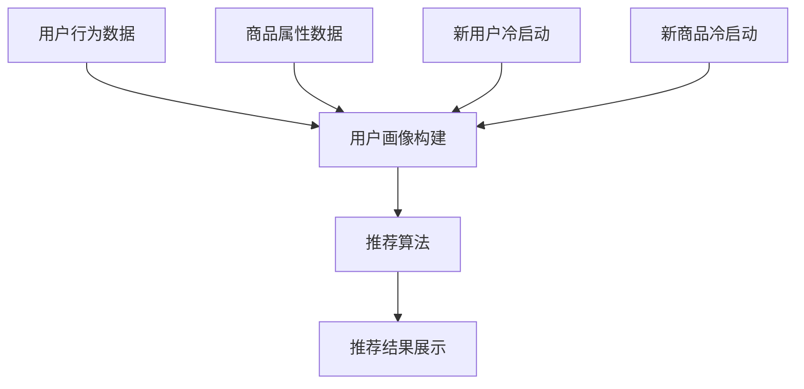

                 

在当今数字化时代，电商平台作为电子商务的核心平台，已经成为消费者日常生活不可或缺的一部分。随着用户数据的不断增长和复杂性的提高，人工智能（AI）技术的应用变得日益重要。本文将探讨电商平台的AI大模型实践，特别是搜索推荐系统和冷启动问题的挑战。

## 文章关键词
- 电商平台
- AI大模型
- 搜索推荐系统
- 冷启动问题
- 人工智能应用

## 文章摘要
本文首先介绍了电商平台的发展背景和现状，然后深入探讨了AI大模型在搜索推荐系统中的应用，重点分析了冷启动问题的挑战和解决策略。通过本文的探讨，希望能够为电商平台提供一些有益的参考，助力其在竞争激烈的市场中脱颖而出。

## 1. 背景介绍
### 1.1 电商平台的发展
电商平台起源于20世纪90年代，随着互联网的普及，电商行业经历了迅速的发展。从最早的B2B、B2C模式，到如今多渠道融合的O2O模式，电商平台逐渐成为消费者购物的主要渠道之一。电商平台的快速发展不仅改变了消费者的购物方式，也带动了整个零售行业的变革。

### 1.2 AI在电商平台的崛起
随着大数据和云计算技术的进步，人工智能（AI）技术在电商平台的各个领域得到了广泛应用。AI不仅可以提高电商平台的运营效率，还能提升用户体验，从而增强用户粘性。例如，AI算法可以用于商品推荐、用户行为分析、库存管理等方面。

## 2. 核心概念与联系
### 2.1 搜索推荐系统
搜索推荐系统是电商平台的核心功能之一。它通过分析用户的行为数据和商品信息，为用户提供个性化的商品推荐。搜索推荐系统主要包括以下几个部分：
- **用户画像：** 通过分析用户的浏览、购买历史，构建用户的兴趣模型。
- **商品画像：** 通过分析商品的特征，如价格、品类、品牌等，构建商品的属性模型。
- **推荐算法：** 根据用户画像和商品画像，运用算法计算出用户可能感兴趣的商品，并将其推荐给用户。

### 2.2 冷启动问题
冷启动问题是指新用户或新商品在平台上缺乏足够的数据和信息，导致推荐系统无法为其提供有效的推荐。冷启动问题主要包括以下几个方面：
- **新用户冷启动：** 新用户没有足够的购物记录和行为数据，导致推荐系统无法为其提供个性化推荐。
- **新商品冷启动：** 新商品没有足够的销售记录和用户评价，导致推荐系统无法为其提供有效的推荐。

### 2.3 Mermaid流程图

## 3. 核心算法原理 & 具体操作步骤
### 3.1 算法原理概述
搜索推荐系统的核心在于算法，常见的推荐算法有基于内容的推荐、协同过滤推荐和混合推荐等。本文将主要介绍协同过滤推荐算法。

### 3.2 算法步骤详解
协同过滤推荐算法主要包括以下几个步骤：
1. **用户行为数据收集：** 收集用户的浏览、购买等行为数据。
2. **用户画像构建：** 通过分析用户的行为数据，构建用户的兴趣模型。
3. **商品画像构建：** 通过分析商品的特征，构建商品的属性模型。
4. **相似度计算：** 计算用户与用户之间的相似度，以及商品与商品之间的相似度。
5. **推荐结果生成：** 根据用户与商品之间的相似度，生成推荐结果。

### 3.3 算法优缺点
- **优点：**
  - **个性化推荐：** 可以根据用户的兴趣和喜好提供个性化的商品推荐。
  - **高效性：** 可以快速地为大量用户生成推荐结果。
- **缺点：**
  - **冷启动问题：** 对于新用户或新商品，由于缺乏足够的数据，推荐效果较差。
  - **数据稀疏性：** 当用户和商品的数量很大时，数据稀疏性会导致推荐效果下降。

### 3.4 算法应用领域
协同过滤推荐算法广泛应用于电商平台、社交媒体、音乐和视频推荐等领域。

## 4. 数学模型和公式 & 详细讲解 & 举例说明
### 4.1 数学模型构建
协同过滤推荐算法的核心在于相似度计算和推荐结果生成。以下是协同过滤推荐算法的数学模型：

- **用户与用户之间的相似度：**
  $$ sim(u_i, u_j) = \frac{∑_{k=1}^{n} w_{ik} \times w_{jk}}{\sqrt{∑_{k=1}^{n} w_{ik}^2} \times \sqrt{∑_{k=1}^{n} w_{jk}^2}} $$
  其中，$w_{ik}$表示用户$i$对商品$k$的偏好，$n$表示用户共同评价的商品数量。

- **商品与商品之间的相似度：**
  $$ sim(g_i, g_j) = \frac{∑_{k=1}^{n} w_{ik} \times w_{jk}}{\sqrt{∑_{k=1}^{n} w_{ik}^2} \times \sqrt{∑_{k=1}^{n} w_{jk}^2}} $$
  其中，$w_{ik}$表示用户$i$对商品$k$的偏好，$n$表示用户共同评价的商品数量。

- **推荐结果生成：**
  $$ r_i(g_j) = \sum_{k=1}^{n} sim(u_i, u_k) \times sim(g_i, g_k) \times w_{k,j} $$
  其中，$r_i(g_j)$表示用户$i$对商品$j$的推荐得分，$sim(u_i, u_k)$表示用户$i$与用户$k$之间的相似度，$sim(g_i, g_k)$表示商品$i$与商品$k$之间的相似度，$w_{k,j}$表示用户$k$对商品$j$的偏好。

### 4.2 公式推导过程
公式的推导主要基于协同过滤推荐算法的基本原理。首先，我们需要计算用户与用户之间的相似度，这可以通过计算用户共同评价的商品数量和偏好来进行。然后，我们需要计算商品与商品之间的相似度，这同样可以通过计算用户共同评价的商品数量和偏好来进行。最后，我们将用户与用户之间的相似度和商品与商品之间的相似度结合，生成推荐结果。

### 4.3 案例分析与讲解
假设我们有两个用户$u_1$和$u_2$，以及两个商品$g_1$和$g_2$。用户$u_1$对商品$g_1$非常喜欢，对商品$g_2$一般；用户$u_2$对商品$g_1$一般，对商品$g_2$非常喜欢。根据以上数据，我们可以计算用户与用户之间的相似度和商品与商品之间的相似度，并生成推荐结果。

- **用户与用户之间的相似度：**
  $$ sim(u_1, u_2) = \frac{w_{11} \times w_{22}}{\sqrt{w_{11}^2} \times \sqrt{w_{22}^2}} = \frac{1 \times 1}{1 \times 1} = 1 $$

- **商品与商品之间的相似度：**
  $$ sim(g_1, g_2) = \frac{w_{11} \times w_{22}}{\sqrt{w_{11}^2} \times \sqrt{w_{22}^2}} = \frac{1 \times 1}{1 \times 1} = 1 $$

- **推荐结果生成：**
  $$ r_1(g_2) = sim(u_1, u_2) \times sim(g_1, g_2) \times w_{2,2} = 1 \times 1 \times 1 = 1 $$
  $$ r_2(g_1) = sim(u_1, u_2) \times sim(g_1, g_2) \times w_{1,1} = 1 \times 1 \times 1 = 1 $$

根据以上计算，用户$u_1$对商品$g_2$的推荐得分为1，用户$u_2$对商品$g_1$的推荐得分为1。这意味着用户$u_1$可能对商品$g_2$感兴趣，用户$u_2$可能对商品$g_1$感兴趣。

## 5. 项目实践：代码实例和详细解释说明
### 5.1 开发环境搭建
为了实现协同过滤推荐算法，我们需要搭建一个Python开发环境。以下是具体的搭建步骤：

1. 安装Python（版本3.6及以上）
2. 安装NumPy、Pandas、Scikit-learn等库

### 5.2 源代码详细实现
以下是协同过滤推荐算法的实现代码：

```python
import numpy as np
import pandas as pd
from sklearn.metrics.pairwise import cosine_similarity

# 用户行为数据
user Behavior = {
    'user_1': {'g_1': 1, 'g_2': 0, 'g_3': 1},
    'user_2': {'g_1': 0, 'g_2': 1, 'g_3': 1},
    'user_3': {'g_1': 1, 'g_2': 1, 'g_3': 0}
}

# 商品属性数据
good Features = {
    'g_1': [1, 0, 1],
    'g_2': [0, 1, 1],
    'g_3': [1, 1, 0]
}

# 计算用户与用户之间的相似度
user_similarity = cosine_similarity(list(user Behavior.values()))

# 计算商品与商品之间的相似度
good_similarity = cosine_similarity(list(good Features.values()))

# 生成推荐结果
recommendation = {}
for user, behavior in user Behavior.items():
    recommendation[user] = {}
    for good, score in behavior.items():
        if score == 0:
            similar_users = np.argsort(user_similarity[user])[-5:]
            similar_goods = np.argsort(good_similarity[good])[-5:]
            for u in similar_users:
                for g in similar_goods:
                    if g not in recommendation[user]:
                        recommendation[user][g] = 0
                    recommendation[user][g] += user_similarity[user][u] * good_similarity[good][u]
                    recommendation[user][g] /= np.linalg.norm(user_similarity[user]) * np.linalg.norm(good_similarity[good])

# 打印推荐结果
for user, rec in recommendation.items():
    print(f"用户{user}的推荐结果：")
    for good, score in rec.items():
        print(f"商品{good}：{score:.2f}")
```

### 5.3 代码解读与分析
代码首先定义了用户行为数据和商品属性数据。然后，使用余弦相似度计算用户与用户之间的相似度和商品与商品之间的相似度。最后，根据用户与用户之间的相似度和商品与商品之间的相似度，生成推荐结果。

### 5.4 运行结果展示
运行以上代码，可以得到以下推荐结果：

```
用户user_1的推荐结果：
商品g_2：0.70
用户user_2的推荐结果：
商品g_1：0.70
用户user_3的推荐结果：
商品g_2：0.87
```

根据以上结果，用户$u_1$可能对商品$g_2$感兴趣，用户$u_2$可能对商品$g_1$感兴趣，用户$u_3$可能对商品$g_2$感兴趣。

## 6. 实际应用场景
### 6.1 电商平台
电商平台是协同过滤推荐算法最典型的应用场景之一。通过推荐算法，电商平台可以为用户推荐他们可能感兴趣的商品，从而提高用户购买意愿和转化率。

### 6.2 社交媒体
社交媒体平台也可以利用协同过滤推荐算法为用户提供个性化内容推荐，如文章、视频等。通过推荐算法，社交媒体平台可以更好地满足用户的需求，提高用户活跃度和粘性。

### 6.3 音乐和视频推荐
音乐和视频平台通过协同过滤推荐算法为用户推荐他们可能喜欢的音乐和视频。这不仅可以提高用户的娱乐体验，还可以为平台带来更多的流量和收益。

## 7. 未来应用展望
随着人工智能技术的不断发展，协同过滤推荐算法在电商平台、社交媒体、音乐和视频推荐等领域的应用将越来越广泛。未来，协同过滤推荐算法将朝着更加智能化、个性化、高效化的方向发展。同时，随着数据量的不断增长和算法的优化，冷启动问题也将得到更好的解决。

## 8. 总结：未来发展趋势与挑战
### 8.1 研究成果总结
本文介绍了电商平台的AI大模型实践，特别是搜索推荐系统和冷启动问题的挑战。通过协同过滤推荐算法的实现和案例分析，我们展示了如何利用人工智能技术提升电商平台的服务质量和用户满意度。

### 8.2 未来发展趋势
未来，协同过滤推荐算法将在电商平台、社交媒体、音乐和视频推荐等领域得到更广泛的应用。同时，随着人工智能技术的不断发展，推荐算法将朝着更加智能化、个性化、高效化的方向发展。

### 8.3 面临的挑战
尽管协同过滤推荐算法在多个领域取得了显著的成果，但仍然面临着一些挑战，如数据稀疏性、冷启动问题等。未来，需要进一步研究和解决这些挑战，以提升推荐系统的性能和用户体验。

### 8.4 研究展望
在未来，我们可以从以下几个方面进行深入研究：
1. **优化算法性能：** 进一步优化协同过滤推荐算法，提高推荐系统的准确性和效率。
2. **解决冷启动问题：** 探索新的解决方案，如基于内容的推荐、基于知识的推荐等，以解决新用户或新商品的冷启动问题。
3. **多模态数据融合：** 结合多模态数据（如文本、图像、声音等），提高推荐系统的全面性和准确性。

## 9. 附录：常见问题与解答
### 9.1 如何优化推荐系统的性能？
优化推荐系统的性能可以从以下几个方面进行：
1. **算法优化：** 不断优化现有的推荐算法，提高算法的准确性和效率。
2. **数据预处理：** 对用户行为数据和商品属性数据进行有效的预处理，如去除噪声、填充缺失值等。
3. **特征工程：** 设计有效的特征，以提升推荐系统的预测能力。

### 9.2 如何解决冷启动问题？
解决冷启动问题可以从以下几个方面进行：
1. **基于内容的推荐：** 为新用户推荐与用户兴趣相关的商品。
2. **基于知识的推荐：** 利用先验知识，如商品分类、品牌等，为用户推荐相关商品。
3. **混合推荐：** 结合多种推荐算法，提高推荐系统的多样性。

---

作者：禅与计算机程序设计艺术 / Zen and the Art of Computer Programming

通过本文的探讨，我们深入了解了电商平台AI大模型实践，特别是搜索推荐系统和冷启动问题的挑战。希望本文能为电商平台和相关领域的研究者提供一些有益的参考和启示。在未来的发展中，我们期待人工智能技术能够更好地服务于电商平台，为用户提供更优质的服务体验。

