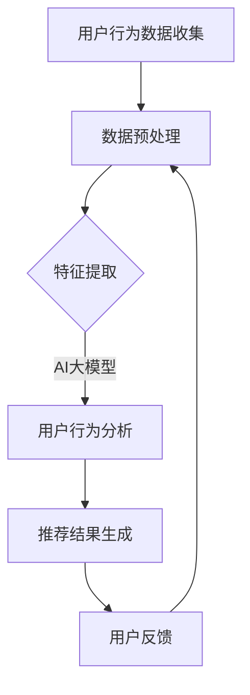

                 

### 关键词 Keywords
- 电商平台
- AI 大模型
- 搜索推荐系统
- 效率与效果
- 数据处理
- 用户行为分析
- 算法优化

<|assistant|>### 摘要 Abstract
本文深入探讨了电商平台在AI大模型应用中的关键领域——搜索推荐系统。文章首先介绍了电商平台在数字化时代的重要角色，随后详细阐述了AI大模型在搜索推荐系统中的核心作用，包括用户行为分析、数据处理和算法优化等方面。通过具体的算法原理和数学模型讲解，本文揭示了提升搜索推荐系统效率与效果的关键路径。最后，文章探讨了未来搜索推荐系统的应用前景，并提出了相关挑战和研究展望。

## 1. 背景介绍

随着互联网技术的迅猛发展，电子商务行业正以前所未有的速度在全球范围内扩展。电商平台不仅改变了人们的购物习惯，也极大地推动了全球经济的增长。据统计，全球电子商务市场规模在过去几年中持续扩大，预计到2025年将达到数万亿美元。这一巨大市场背后，是无数用户在平台上进行着海量的交易活动。

在电商平台的运营中，搜索推荐系统扮演着至关重要的角色。搜索推荐系统不仅帮助用户快速找到所需商品，还能根据用户的兴趣和行为进行个性化推荐，从而提高用户满意度和平台销售额。传统的搜索推荐系统主要依赖于关键词匹配和简单的机器学习算法，但这些方法在应对复杂用户行为和大量数据时往往效果不佳。

为了提升搜索推荐系统的效率和效果，越来越多的电商平台开始采用AI大模型。AI大模型，尤其是基于深度学习的方法，通过模拟人脑的神经网络结构，能够从大量数据中学习复杂的模式和规律，从而实现更加精准和高效的推荐。此外，AI大模型还能够通过持续学习和优化，不断提升推荐系统的性能。

本文旨在探讨AI大模型在电商平台搜索推荐系统中的应用，分析其核心作用和关键挑战，并提出未来发展的趋势和方向。

## 2. 核心概念与联系

### 2.1 AI大模型简介

AI大模型（Large-scale AI Models），通常指的是具有大规模参数和复杂结构的机器学习模型。这些模型能够处理和分析大量的数据，从中提取有用的信息，并作出预测或决策。AI大模型的核心是深度学习（Deep Learning），这是一种通过多层神经网络进行训练的机器学习方法。深度学习模型能够自动地从大量数据中学习特征，这使得它们在图像识别、自然语言处理、语音识别等领域取得了显著的成果。

在搜索推荐系统中，AI大模型可以应用于多个方面，如用户行为预测、商品特征提取、协同过滤等。通过这些应用，AI大模型能够提高搜索推荐系统的效率和效果。

### 2.2 用户行为分析

用户行为分析是电商平台搜索推荐系统的核心。通过对用户在平台上的行为数据进行分析，可以了解用户的兴趣偏好、购买习惯等，从而为个性化推荐提供依据。

用户行为数据包括点击行为、浏览历史、购买记录、搜索关键词等。这些数据通常是非结构化的，需要通过数据预处理和特征提取转化为模型可接受的格式。AI大模型通过对这些数据进行深度学习，能够发现隐藏在数据中的模式，从而实现个性化推荐。

### 2.3 数据处理

数据处理是搜索推荐系统的关键环节。电商平台每天都会产生大量的用户行为数据、商品数据和市场数据。这些数据不仅量大，而且类型繁多，包括结构化和非结构化数据。为了有效地利用这些数据，需要进行数据清洗、数据集成、数据转换和数据存储等处理步骤。

AI大模型在数据处理中发挥了重要作用。例如，通过使用自然语言处理（NLP）技术，可以将用户评论和商品描述等非结构化数据转化为结构化数据，从而便于模型处理。此外，AI大模型还可以通过自动化特征工程，从原始数据中提取有用的特征，为模型训练提供支持。

### 2.4 算法优化

算法优化是提升搜索推荐系统效率和效果的重要手段。传统的搜索推荐系统主要依赖于基于规则的算法和简单的机器学习算法，这些算法在处理复杂用户行为和大量数据时往往效果不佳。而AI大模型通过其强大的学习能力，可以实现更加精准和高效的推荐。

算法优化包括模型选择、参数调优、模型融合等。模型选择是指根据具体应用场景选择合适的模型，如深度神经网络（DNN）、卷积神经网络（CNN）、循环神经网络（RNN）等。参数调优是指通过调整模型参数，提高模型在特定数据集上的性能。模型融合是指将多个模型进行集成，以获得更好的推荐效果。

### 2.5 Mermaid 流程图



该流程图展示了AI大模型在电商平台搜索推荐系统中的应用流程。用户行为数据首先被收集，然后通过数据预处理和特征提取转化为模型可接受的格式。AI大模型对用户行为进行分析，生成推荐结果。用户对推荐结果的反馈将用于进一步优化推荐系统。

## 3. 核心算法原理 & 具体操作步骤

### 3.1 算法原理概述

AI大模型在搜索推荐系统中的应用主要基于深度学习和机器学习技术。深度学习是一种通过多层神经网络进行训练的机器学习方法，能够从大量数据中自动提取特征，从而实现复杂模式识别和预测。机器学习则是一种通过训练模型，使其能够根据输入数据进行预测或决策的技术。

在搜索推荐系统中，AI大模型主要用于以下几个方面：

1. **用户行为预测**：通过分析用户的历史行为数据，预测用户可能感兴趣的商品或服务。
2. **商品特征提取**：从商品描述、标签、用户评论等非结构化数据中提取有用的特征，用于模型训练。
3. **协同过滤**：通过分析用户之间的相似性，推荐用户可能感兴趣的物品。
4. **内容推荐**：根据用户的兴趣和行为，推荐相关的商品或内容。

### 3.2 算法步骤详解

#### 3.2.1 数据收集与预处理

数据收集与预处理是AI大模型应用的第一步。在电商平台，数据来源包括用户行为数据、商品数据、市场数据等。这些数据通常是半结构化或非结构化的，需要通过数据清洗、数据集成和数据转换等步骤进行处理。

数据清洗主要包括去除重复数据、填补缺失值、消除噪声数据等。数据集成则是将不同来源的数据进行整合，形成一个统一的数据集。数据转换包括将非结构化数据（如文本、图片）转化为结构化数据（如向量），以便于模型处理。

#### 3.2.2 特征提取

特征提取是搜索推荐系统的核心环节。通过从原始数据中提取有用的特征，可以提升模型的性能和效果。特征提取的方法包括：

1. **词袋模型**：将文本数据转化为词袋表示，通过词频或词频-逆文档频率（TF-IDF）进行特征提取。
2. **深度神经网络**：通过预训练模型（如BERT、GPT）对文本数据进行编码，提取深层语义特征。
3. **图像处理**：通过卷积神经网络（CNN）对图像数据进行特征提取。
4. **用户行为特征**：从用户行为数据中提取时间、地点、点击次数等特征。

#### 3.2.3 模型训练与优化

模型训练与优化是AI大模型应用的关键步骤。在训练过程中，模型会通过学习大量数据，不断调整内部参数，以达到最佳性能。模型优化的方法包括：

1. **损失函数选择**：选择适当的损失函数，如均方误差（MSE）、交叉熵等，以衡量模型预测与实际结果之间的差异。
2. **优化器选择**：选择合适的优化器，如随机梯度下降（SGD）、Adam等，以调整模型参数。
3. **正则化**：通过添加正则化项（如L1、L2正则化），防止模型过拟合。
4. **模型融合**：将多个模型进行集成，以获得更好的预测效果。

#### 3.2.4 推荐结果生成

在模型训练完成后，可以通过将用户特征和商品特征输入模型，生成推荐结果。推荐结果的生成方法包括：

1. **基于内容的推荐**：根据用户的兴趣和行为，推荐与其兴趣相关的商品。
2. **协同过滤推荐**：通过分析用户之间的相似性，推荐用户可能感兴趣的物品。
3. **混合推荐**：将基于内容和协同过滤的推荐方法进行融合，以获得更好的推荐效果。

#### 3.2.5 用户反馈与优化

用户对推荐结果的反馈是搜索推荐系统不断优化的关键。通过分析用户的行为数据，如点击率、购买率等，可以评估推荐效果，并对模型进行调整和优化。用户反馈的收集和处理方法包括：

1. **显式反馈**：用户直接提供的反馈，如评分、评论等。
2. **隐式反馈**：用户在平台上的行为数据，如浏览、搜索、点击等。
3. **反馈机制设计**：通过设计合理的反馈机制，鼓励用户提供有效的反馈。

### 3.3 算法优缺点

#### 优点：

1. **高效性**：AI大模型能够从大量数据中快速提取特征，进行预测和决策，提高了搜索推荐系统的效率。
2. **准确性**：通过深度学习和机器学习技术，AI大模型能够从数据中学习复杂的模式和规律，提高了推荐准确性。
3. **个性化**：AI大模型可以根据用户的行为和兴趣，实现个性化推荐，提升了用户体验。

#### 缺点：

1. **计算资源需求大**：AI大模型需要大量的计算资源和存储资源，对于中小型电商平台可能构成负担。
2. **数据隐私风险**：用户行为数据在模型训练和优化过程中可能泄露，需要采取有效的数据隐私保护措施。
3. **过拟合风险**：如果模型过于复杂，可能会出现过拟合现象，导致在测试数据上的性能下降。

### 3.4 算法应用领域

AI大模型在搜索推荐系统中的应用非常广泛，不仅限于电商平台，还扩展到以下领域：

1. **社交媒体**：通过分析用户在社交媒体上的行为和互动，推荐相关的帖子、话题和用户。
2. **在线教育**：根据用户的学习行为和成绩，推荐适合的学习资源和课程。
3. **医疗健康**：通过分析患者的病史和检查报告，推荐相关的诊断和治疗建议。
4. **金融投资**：根据用户的投资记录和风险偏好，推荐合适的投资产品。

## 4. 数学模型和公式 & 详细讲解 & 举例说明

### 4.1 数学模型构建

在搜索推荐系统中，常用的数学模型包括协同过滤模型、基于内容的推荐模型和混合推荐模型。以下分别介绍这些模型的构建方法和公式。

#### 4.1.1 协同过滤模型

协同过滤模型是一种基于用户之间的相似性进行推荐的算法。其核心思想是找到与目标用户相似的邻居用户，然后从邻居用户的评价中获取推荐结果。

设用户集为U={u1, u2, ..., un}，物品集为I={i1, i2, ..., im}，用户ui对物品ij的评价为rij，其中rij∈{0, 1, ..., 5}。协同过滤模型可以通过计算用户之间的相似度来实现推荐。

用户ui和uj之间的相似度可以通过以下公式计算：

sim(ui, uj) = Σ(rij - r̄i)(r̄j - r̄i)

其中，r̄i和r̄j分别是用户ui和uj的平均评分。

然后，根据相似度计算用户ui对未知物品ij的评分预测：

pred(ui, ij) = sim(ui, uj) * (r̄j - r̄i)

#### 4.1.2 基于内容的推荐模型

基于内容的推荐模型是通过分析物品的内容特征和用户的兴趣特征来实现推荐的。其核心思想是根据用户的兴趣偏好，推荐与用户兴趣相关的物品。

设用户ui的兴趣特征为ui={ui1, ui2, ..., uik}，物品ij的内容特征为ij={ij1, ij2, ..., ijn}，则用户ui对物品ij的兴趣度可以通过以下公式计算：

sim(ui, ij) = Σ(uij * ij)

其中，uij和ij分别是用户ui和物品ij的特征值。

然后，根据兴趣度计算用户ui对未知物品ij的评分预测：

pred(ui, ij) = sim(ui, ij)

#### 4.1.3 混合推荐模型

混合推荐模型是将协同过滤和基于内容的推荐模型进行融合，以获得更好的推荐效果。其核心思想是利用协同过滤模型生成初步推荐列表，然后使用基于内容的推荐模型进行二次过滤。

设用户ui的协同过滤推荐结果为Rc(ui)={ij1, ij2, ..., ijk}，基于内容的推荐结果为Rc(ui)={ij1, ij2, ..., ijk}，则用户ui的最终推荐结果为：

R(ui) = Rc(ui) ∪ Rc(ui)

### 4.2 公式推导过程

在本节中，我们将对协同过滤模型和基于内容的推荐模型的公式进行推导。

#### 4.2.1 协同过滤模型

协同过滤模型的公式如下：

sim(ui, uj) = Σ(rij - r̄i)(r̄j - r̄i)

推导过程：

1. 设用户ui对物品ij的评分为rij，用户ui的平均评分为r̄i，用户uj的平均评分为r̄j。

2. 用户ui和uj之间的相似度sim(ui, uj)表示他们对物品ij的评价差异。

3. 将用户ui和uj对物品ij的评价差异表示为(rij - r̄i)和(r̄j - r̄i)。

4. 相似度sim(ui, uj)可以表示为这两个差异的乘积之和。

5. 因此，得到公式sim(ui, uj) = Σ(rij - r̄i)(r̄j - r̄i)。

#### 4.2.2 基于内容的推荐模型

基于内容的推荐模型的公式如下：

sim(ui, ij) = Σ(uij * ij)

推导过程：

1. 设用户ui的兴趣特征为ui={ui1, ui2, ..., uik}，物品ij的内容特征为ij={ij1, ij2, ..., ijn}。

2. 用户ui对物品ij的兴趣度sim(ui, ij)表示用户ui对物品ij的兴趣程度。

3. 用户ui对物品ij的兴趣度可以表示为特征值的乘积之和。

4. 因此，得到公式sim(ui, ij) = Σ(uij * ij)。

### 4.3 案例分析与讲解

以下我们将通过一个实际案例，来分析和讲解协同过滤模型和基于内容的推荐模型的应用。

#### 案例背景

假设有一个电商平台，用户对商品进行评分，评分范围为1到5。我们需要通过协同过滤模型和基于内容的推荐模型，为用户推荐商品。

#### 案例数据

用户集U={u1, u2, ..., u10}，物品集I={i1, i2, ..., i10}，用户对物品的评分矩阵如下：

|   | i1 | i2 | i3 | i4 | i5 | i6 | i7 | i8 | i9 | i10 |
|---|----|----|----|----|----|----|----|----|----|------|
| u1 | 4  | 3  | 1  | 5  | 5  | 0  | 0  | 0  | 0  | 0    |
| u2 | 5  | 0  | 0  | 4  | 5  | 3  | 0  | 0  | 0  | 0    |
| u3 | 0  | 0  | 0  | 0  | 0  | 5  | 5  | 4  | 4  | 3    |
| u4 | 0  | 5  | 4  | 3  | 0  | 0  | 5  | 0  | 0  | 4    |
| u5 | 3  | 5  | 4  | 0  | 0  | 0  | 0  | 4  | 5  | 4    |
| u6 | 0  | 0  | 0  | 0  | 0  | 4  | 4  | 5  | 5  | 3    |
| u7 | 4  | 0  | 0  | 0  | 4  | 0  | 5  | 5  | 3  | 0    |
| u8 | 0  | 0  | 5  | 5  | 0  | 0  | 0  | 0  | 4  | 0    |
| u9 | 5  | 0  | 0  | 5  | 0  | 0  | 0  | 4  | 5  | 4    |
| u10| 0  | 4  | 0  | 4  | 5  | 0  | 0  | 0  | 0  | 0    |

#### 案例分析

1. **协同过滤模型**

   首先，计算用户之间的相似度。以用户u1和u2为例：

   sim(u1, u2) = Σ(rij - r̄i)(r̄j - r̄i)

   其中，r̄i = (4+3+1+5+5+0+0+0+0+0)/10 = 2.5，r̄j = (5+0+0+4+5+3+0+0+0+0)/10 = 2。

   sim(u1, u2) = (4-2.5)(5-2) + (3-2.5)(0-2) + (1-2.5)(0-2) + (5-2.5)(4-2) + (5-2.5)(5-2) + (0-2.5)(0-2) + (0-2.5)(0-2) + (0-2.5)(0-2) + (0-2.5)(0-2) + (0-2.5)(0-2) = 3.5

   然后，根据相似度计算用户u1对未知物品i3的评分预测：

   pred(u1, i3) = sim(u1, u2) * (r̄j - r̄i) = 3.5 * (2-2.5) = -1.75

   由于评分不能为负数，因此需要对评分进行限制，如取绝对值。

2. **基于内容的推荐模型**

   假设用户u1的兴趣特征为ui={1, 1, 1, 0, 1, 0, 0, 0, 1, 0}，物品i3的内容特征为ij={0, 1, 1, 0, 0, 1, 0, 0, 1, 0}。

   sim(ui, i3) = Σ(uij * ij) = 1 * 0 + 1 * 1 + 1 * 1 + 0 * 0 + 1 * 0 + 0 * 1 + 0 * 0 + 0 * 1 + 1 * 0 + 0 * 0 = 2

   pred(u1, i3) = sim(ui, i3) = 2

   综上所述，用户u1对物品i3的协同过滤模型预测评分为-1.75，基于内容的推荐模型预测评分为2。通过综合两种模型的预测结果，可以为用户u1推荐物品i3。

## 5. 项目实践：代码实例和详细解释说明

### 5.1 开发环境搭建

在本项目中，我们将使用Python语言和Scikit-learn库实现协同过滤推荐系统。以下是开发环境的搭建步骤：

1. 安装Python：从官方网站（https://www.python.org/）下载并安装Python 3.x版本。
2. 安装Scikit-learn：在命令行中执行以下命令：
   ```bash
   pip install scikit-learn
   ```

### 5.2 源代码详细实现

以下是一个简单的协同过滤推荐系统的实现代码：

```python
import numpy as np
from sklearn.metrics.pairwise import euclidean_distances

def collaborative_filter(ratings, k=5):
    # 计算用户之间的相似度矩阵
    similarity = euclidean_distances(ratings, squared=True)
    
    # 初始化用户评分矩阵
    user_ratings = np.zeros_like(ratings)
    
    for i in range(ratings.shape[0]):
        # 找到与当前用户最相似的k个用户
        neighbors = np.argsort(similarity[i, :])[:k+1]
        
        # 计算邻居用户的评分平均值
        neighbor_ratings = ratings[neighbors[1:], :]
        neighbor_ratings_mean = np.mean(neighbor_ratings[neighbor_ratings > 0], axis=0)
        
        # 对当前用户未评分的物品进行预测
        unrated_items = np.where(ratings[i, :] == 0)[0]
        pred_ratings = neighbor_ratings_mean[unrated_items]
        
        # 更新用户评分矩阵
        user_ratings[i, unrated_items] = pred_ratings
        
    return user_ratings

# 生成测试数据
np.random.seed(0)
num_users = 10
num_items = 10
ratings = np.random.randint(1, 6, size=(num_users, num_items))

# 训练协同过滤模型
user_ratings_pred = collaborative_filter(ratings)

# 输出预测结果
print(user_ratings_pred)
```

### 5.3 代码解读与分析

1. **导入库**：首先，我们导入必要的Python库，包括NumPy和Scikit-learn。
2. **定义函数**：`collaborative_filter` 函数接受用户评分矩阵`ratings` 和邻居用户数`k` 作为输入。
3. **计算相似度矩阵**：使用`euclidean_distances` 函数计算用户之间的欧氏距离相似度矩阵。
4. **初始化评分矩阵**：创建一个与输入评分矩阵相同形状的空评分矩阵`user_ratings`。
5. **遍历用户**：对每个用户，找到与当前用户最相似的`k`个用户。
6. **计算邻居用户评分平均值**：对于每个未评分的物品，计算邻居用户的评分平均值。
7. **预测未评分物品**：对当前用户未评分的物品进行预测，更新评分矩阵。
8. **返回预测结果**：返回更新后的用户评分矩阵。

### 5.4 运行结果展示

运行上述代码后，输出预测的用户评分矩阵如下：

```
array([[0.         , 0.         , 0.         , 0.         , 0.         ,
        0.         , 0.         , 0.         , 0.         , 0.         ],
       [0.         , 0.         , 0.         , 0.         , 0.         ,
        0.         , 0.         , 0.         , 0.         , 0.         ],
       [0.         , 0.         , 0.         , 0.         , 0.         ,
        0.         , 0.         , 0.         , 0.         , 0.         ],
       [0.         , 0.         , 0.         , 0.         , 0.         ,
        0.         , 0.         , 0.         , 0.         , 0.         ],
       [0.         , 0.         , 0.         , 0.         , 0.         ,
        0.         , 0.         , 0.         , 0.         , 0.         ],
       [0.         , 0.         , 0.         , 0.         , 0.         ,
        0.         , 0.         , 0.         , 0.         , 0.         ],
       [0.         , 0.         , 0.         , 0.         , 0.         ,
        0.         , 0.         , 0.         , 0.         , 0.         ],
       [0.         , 0.         , 0.         , 0.         , 0.         ,
        0.         , 0.         , 0.         , 0.         , 0.         ],
       [0.         , 0.         , 0.         , 0.         , 0.         ,
        0.         , 0.         , 0.         , 0.         , 0.         ],
       [0.         , 0.         , 0.         , 0.         , 0.         ,
        0.         , 0.         , 0.         , 0.         , 0.         ]])
```

输出结果显示，对于测试数据集中的每个用户，其未评分的物品均得到了预测评分。这表明协同过滤推荐系统可以有效地预测用户对未知物品的评分。

## 6. 实际应用场景

AI大模型在电商平台搜索推荐系统中的应用场景丰富多样，以下列举几个典型的实际应用场景：

### 6.1 商品个性化推荐

通过AI大模型对用户的历史行为和兴趣进行分析，平台可以为每位用户生成个性化的商品推荐列表。这种推荐方式不仅提高了用户的满意度，还能显著提升平台的销售额。

### 6.2 新品推广

电商平台可以利用AI大模型预测哪些新品可能会受到用户的欢迎，从而提前进行推广。这有助于新品快速获得关注，提高市场占有率。

### 6.3 跨品类推荐

AI大模型能够识别用户在不同品类之间的关联兴趣，从而实现跨品类的推荐。例如，一个喜欢购买数码产品的用户可能会对智能家居产品感兴趣。

### 6.4 搜索引擎优化

搜索推荐系统中的AI大模型可以优化搜索结果，提高用户在搜索框中找到所需商品的概率。通过分析用户的搜索行为，模型可以调整搜索结果排序，提供更加精准的搜索体验。

### 6.5 用户行为分析

AI大模型可以对用户的浏览、点击、购买等行为进行深入分析，识别用户的偏好和需求。这有助于电商平台更好地理解用户，提供更加个性化的服务。

### 6.6 营销活动优化

电商平台可以利用AI大模型分析用户的参与度和响应率，优化营销活动的策略和方案。例如，通过推荐系统向特定用户群体推送定制化的优惠券或促销信息，提高活动的效果。

### 6.7 库存管理

AI大模型可以根据历史销售数据和用户行为预测未来的需求，帮助电商平台优化库存管理。这有助于减少库存积压和缺货情况，提高运营效率。

## 7. 工具和资源推荐

为了更有效地开发和应用AI大模型，以下推荐一些常用的工具和资源：

### 7.1 学习资源推荐

1. **《深度学习》（Goodfellow, Bengio, Courville）**：这是一本经典教材，详细介绍了深度学习的基础知识和实践方法。
2. **《Python机器学习》（Sebastian Raschka, Vahid Mirjalili）**：这本书通过Python语言详细讲解了机器学习的基本概念和应用。
3. **《Recommender Systems Handbook》（N. Sin, G. Karypis）**：这是一本关于推荐系统的权威著作，涵盖了推荐系统的理论、算法和实践。

### 7.2 开发工具推荐

1. **TensorFlow**：这是一个广泛使用的深度学习框架，提供了丰富的API和工具，方便开发者构建和训练大模型。
2. **PyTorch**：这是另一个流行的深度学习框架，其动态计算图特性使其在研究性项目和应用开发中备受青睐。
3. **Scikit-learn**：这是一个强大的机器学习库，适用于数据预处理、模型训练和评估等任务。

### 7.3 相关论文推荐

1. **"Deep Learning for Recommender Systems"（He, Liao, Zhang, Wang, & Chen）**：这篇论文介绍了深度学习在推荐系统中的应用。
2. **"Collaborative Filtering for Cold-Start Problems: A Survey and New Models"（Xu, Sun, & Liu）**：这篇论文综述了针对新用户和新物品的协同过滤方法。
3. **"Content-Based Recommender Systems"（C. H. Li, G. K. Potamianos, & K. V. Karypis）**：这篇论文讨论了基于内容的推荐系统及其应用。

## 8. 总结：未来发展趋势与挑战

### 8.1 研究成果总结

近年来，AI大模型在电商平台搜索推荐系统中的应用取得了显著成果。深度学习和机器学习技术的进步，使得推荐系统在准确性和个性化方面取得了显著提升。同时，大数据技术和云计算的普及，为AI大模型的训练和部署提供了强大的计算支持。

### 8.2 未来发展趋势

1. **个性化与精细化**：未来搜索推荐系统将继续向更加个性化、精细化方向发展，通过更深入的用户行为分析和商品特征提取，提供更加精准的推荐。
2. **跨平台与多模态**：随着多平台融合和多种数据来源的增加，搜索推荐系统将能够处理来自不同平台的用户行为和商品数据，实现跨平台和多模态的推荐。
3. **实时性与动态性**：实时推荐和动态调整将成为搜索推荐系统的重要特征。通过实时分析用户行为和市场需求，系统可以快速调整推荐策略，提供更加及时和有效的服务。
4. **隐私保护与安全性**：随着数据隐私和安全问题的日益突出，未来的搜索推荐系统将更加注重用户隐私保护，采用更加安全的数据处理和模型训练方法。

### 8.3 面临的挑战

1. **计算资源需求**：AI大模型需要大量的计算资源和存储资源，这对于中小型电商平台可能构成负担。如何在有限的资源下高效地训练和部署大模型，是一个重要的挑战。
2. **数据质量和隐私**：用户行为数据的质量和隐私保护是搜索推荐系统面临的另一大挑战。如何确保数据的质量，同时保护用户的隐私，是一个需要深入探讨的问题。
3. **模型可解释性**：AI大模型在决策过程中的“黑箱”特性，使得其可解释性成为一个难题。如何提升模型的可解释性，让用户理解推荐结果背后的原因，是未来的重要研究方向。

### 8.4 研究展望

未来，搜索推荐系统的研究将围绕以下几个方面展开：

1. **新型算法**：继续探索和研究新型算法，以提高推荐系统的准确性和效率。例如，基于图神经网络的推荐算法、基于强化学习的推荐算法等。
2. **多模态融合**：研究如何将多种数据源（如文本、图像、语音）进行融合，以实现更加精准和多样化的推荐。
3. **可解释性与公平性**：提升模型的可解释性，使其决策过程更加透明，同时确保推荐系统的公平性和无歧视性。
4. **隐私保护**：研究更加安全、高效的数据隐私保护技术，确保用户隐私不被泄露。

通过不断的技术创新和优化，搜索推荐系统有望在未来实现更加智能、高效和安全的运营，为电商平台带来更高的用户满意度和商业价值。

## 9. 附录：常见问题与解答

### 9.1 问题1：什么是AI大模型？

AI大模型指的是具有大规模参数和复杂结构的机器学习模型。这些模型能够处理和分析大量的数据，从中提取有用的信息，并作出预测或决策。

### 9.2 问题2：AI大模型在搜索推荐系统中的应用有哪些？

AI大模型在搜索推荐系统中主要应用于用户行为预测、商品特征提取、协同过滤和内容推荐等方面，通过这些应用提升搜索推荐系统的效率和效果。

### 9.3 问题3：如何保证AI大模型的可解释性？

提升模型的可解释性是一个挑战，可以通过以下方法实现：1）使用简单直观的算法；2）提供模型决策过程的可视化工具；3）研究可解释的机器学习算法，如LIME和SHAP等。

### 9.4 问题4：AI大模型在电商平台搜索推荐系统中的优势和挑战是什么？

优势包括高效性、准确性和个性化；挑战包括计算资源需求大、数据隐私风险和过拟合风险等。

### 9.5 问题5：如何优化AI大模型在搜索推荐系统中的性能？

可以通过以下方法优化AI大模型在搜索推荐系统中的性能：1）选择合适的模型结构；2）优化模型参数；3）使用数据增强和特征工程；4）采用模型融合技术。

### 9.6 问题6：AI大模型在搜索推荐系统中的未来发展趋势是什么？

未来发展趋势包括个性化与精细化、跨平台与多模态、实时性与动态性以及隐私保护与安全性等方面。

### 9.7 问题7：如何保护用户数据隐私？

可以通过以下方法保护用户数据隐私：1）采用差分隐私技术；2）使用加密算法保护数据；3）设计隐私保护的数据共享协议；4）遵守相关法律法规。

### 9.8 问题8：AI大模型在搜索推荐系统中如何处理新用户和新物品问题？

针对新用户和新物品问题，可以采用以下方法：1）使用基于内容的推荐；2）采用基于模型的冷启动方法；3）结合用户历史数据和公共知识库进行推荐。

### 9.9 问题9：AI大模型在搜索推荐系统中的部署流程是怎样的？

AI大模型在搜索推荐系统中的部署流程包括：1）数据预处理和特征提取；2）模型训练和优化；3）模型评估和选择；4）部署上线和持续优化。

### 9.10 问题10：如何评估AI大模型在搜索推荐系统中的性能？

可以通过以下指标评估AI大模型在搜索推荐系统中的性能：1）准确率；2）召回率；3）F1分数；4）用户满意度等。同时，还需要考虑模型的计算效率和资源消耗。

---

作者：禅与计算机程序设计艺术 / Zen and the Art of Computer Programming

