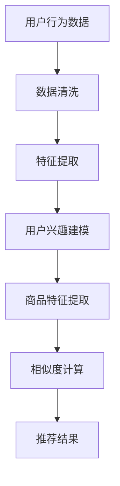

                 

关键词：电商平台、AI 大模型、搜索推荐系统、数据质量、处理能力

> 摘要：本文深入探讨了电商平台在人工智能技术领域的战略布局，尤其是搜索推荐系统在AI大模型中的核心作用。文章详细分析了数据质量对推荐系统性能的影响，以及处理能力的提升如何推动电商平台的整体竞争力。

## 1. 背景介绍

随着互联网的普及和电子商务的迅猛发展，电商平台已经成为现代商业生态系统中的关键组成部分。消费者对于个性化体验和快速、精准的搜索推荐有着越来越高的期望。为了满足这些需求，电商平台正在不断引入和优化人工智能（AI）技术，特别是大模型在搜索推荐系统中的应用。

### 1.1 电商平台的发展现状

近年来，电商平台如阿里巴巴、京东、亚马逊等，都在不断扩展其业务范围，不仅涵盖广泛的商品类别，还通过大数据和AI技术提供个性化的购物体验。这些平台通过用户行为分析、购物偏好建模等手段，实现了对用户需求的精准把握，从而提高了用户满意度和转化率。

### 1.2 人工智能与大数据的结合

人工智能（AI）和大数据技术的结合，使得电商平台能够更好地理解和预测用户行为。AI大模型，如深度学习模型、强化学习模型等，通过海量数据的训练，能够提取出潜在的模式和趋势，为搜索推荐系统提供强有力的支持。

## 2. 核心概念与联系

### 2.1 搜索推荐系统的核心概念

搜索推荐系统是电商平台的核心功能之一，它负责向用户推荐可能感兴趣的商品或内容。其核心概念包括：

- **用户行为分析**：通过用户的历史行为数据，如浏览记录、购买记录等，分析用户的兴趣偏好。
- **商品特征提取**：将商品的各种属性，如价格、品牌、类别等，转化为可计算的向量表示。
- **推荐算法**：利用机器学习算法，如协同过滤、矩阵分解、深度学习等，将用户兴趣与商品特征相结合，生成推荐结果。

### 2.2 AI 大模型在搜索推荐系统中的应用

AI 大模型，特别是深度学习模型，具有强大的特征提取和模式识别能力。在搜索推荐系统中，大模型可以用于：

- **用户兴趣预测**：通过分析用户的历史行为，预测用户可能的兴趣点。
- **商品相似度计算**：通过分析商品的属性和用户兴趣，计算商品与用户兴趣的相似度。
- **实时推荐**：在用户浏览或搜索时，实时生成推荐结果。

### 2.3 数据质量与处理能力的联系

数据质量直接影响推荐系统的性能。高质量的数据能够提高模型训练的效果，从而提升推荐准确性。处理能力则是确保系统能够快速响应并处理海量数据的关键。以下是数据质量与处理能力的联系：

- **数据质量**：准确、完整、一致、可靠的数据是构建高效推荐系统的基石。
- **处理能力**：高效的计算资源和算法优化是确保推荐系统处理能力的保障。

### 2.4 Mermaid 流程图

以下是一个简化的搜索推荐系统的 Mermaid 流程图：



## 3. 核心算法原理 & 具体操作步骤

### 3.1 算法原理概述

搜索推荐系统的核心算法通常基于以下原理：

- **协同过滤**：基于用户行为数据，寻找相似的用户或商品，推荐他们喜欢的商品给目标用户。
- **矩阵分解**：将用户-商品评分矩阵分解为用户特征矩阵和商品特征矩阵，通过这些矩阵计算推荐得分。
- **深度学习**：利用神经网络模型，直接从原始数据中学习用户和商品的特征表示，生成推荐结果。

### 3.2 算法步骤详解

以下是搜索推荐系统的基本操作步骤：

1. **数据收集与预处理**：收集用户行为数据，包括浏览、购买、收藏等。对数据进行清洗、去重、归一化等预处理操作。
2. **特征提取**：从原始数据中提取用户和商品的特征。用户特征包括用户的基本信息、历史行为等；商品特征包括商品的价格、品牌、类别等。
3. **模型训练**：选择合适的算法，如协同过滤、矩阵分解或深度学习，对特征数据进行模型训练。通过模型训练，学习用户和商品之间的潜在关系。
4. **推荐计算**：在用户查询或浏览时，使用训练好的模型计算用户对商品的兴趣度，生成推荐结果。
5. **结果反馈与优化**：收集用户对推荐结果的实际反馈，根据反馈调整推荐策略，优化模型性能。

### 3.3 算法优缺点

- **协同过滤**：优点是简单、高效，但缺点是容易产生“热门商品偏见”和“数据稀疏问题”。
- **矩阵分解**：优点是能够解决数据稀疏问题，但缺点是计算复杂度高，需要大量计算资源。
- **深度学习**：优点是能够自动学习用户和商品的复杂特征，但缺点是模型训练时间较长，需要大量数据。

### 3.4 算法应用领域

搜索推荐系统在电商平台、社交媒体、视频网站、音乐平台等多个领域得到广泛应用。其核心在于为用户提供个性化的内容和服务，提高用户满意度和平台黏性。

## 4. 数学模型和公式 & 详细讲解 & 举例说明

### 4.1 数学模型构建

搜索推荐系统通常基于以下数学模型：

- **协同过滤模型**：$R_{ij} = u_i \cdot v_j$
- **矩阵分解模型**：$R_{ij} = u_i \cdot v_j$
- **深度学习模型**：$R_{ij} = \sigma(W_1 \cdot [u_i; v_j] + b_1)$

其中，$R_{ij}$ 表示用户 $i$ 对商品 $j$ 的评分预测，$u_i$ 和 $v_j$ 分别表示用户 $i$ 和商品 $j$ 的特征向量，$W_1$ 和 $b_1$ 分别为模型权重和偏置项，$\sigma$ 为激活函数。

### 4.2 公式推导过程

以协同过滤模型为例，推导评分预测公式：

1. **用户 $i$ 的特征向量**：$u_i = [u_{i1}, u_{i2}, ..., u_{iN}]^T$
2. **商品 $j$ 的特征向量**：$v_j = [v_{j1}, v_{j2}, ..., v_{jN}]^T$
3. **用户 $i$ 对商品 $j$ 的评分预测**：$R_{ij} = u_i \cdot v_j$

### 4.3 案例分析与讲解

假设我们有以下用户-商品评分矩阵：

| 用户ID | 商品ID | 评分 |
|--------|--------|------|
| 1      | 101    | 4    |
| 1      | 102    | 5    |
| 2      | 101    | 3    |
| 2      | 103    | 4    |

我们希望预测用户 1 对商品 103 的评分。

1. **提取用户 1 和商品 103 的特征向量**：$u_1 = [4, 5]$，$v_{103} = [3, 4]$
2. **计算评分预测**：$R_{13} = u_1 \cdot v_{103} = 4 \cdot 3 + 5 \cdot 4 = 12 + 20 = 32$
3. **归一化评分**：$R_{13} = \frac{R_{13}}{\sqrt{u_1^2 + v_{103}^2}} = \frac{32}{\sqrt{4^2 + 5^2}} = \frac{32}{\sqrt{41}} \approx 4.94$

因此，预测用户 1 对商品 103 的评分为约 4.94。

## 5. 项目实践：代码实例和详细解释说明

### 5.1 开发环境搭建

为了实现搜索推荐系统，我们需要搭建以下开发环境：

- **Python**：作为主要编程语言
- **NumPy**：用于矩阵计算
- **Pandas**：用于数据处理
- **Scikit-learn**：用于机器学习模型

### 5.2 源代码详细实现

以下是协同过滤算法的 Python 代码实现：

```python
import numpy as np
import pandas as pd
from sklearn.model_selection import train_test_split
from sklearn.metrics.pairwise import cosine_similarity

# 数据预处理
def preprocess_data(data):
    # 去除缺失值和重复值
    data = data.dropna()
    data = data.drop_duplicates()
    # 归一化评分
    data['rating'] = data['rating'] / 5
    return data

# 计算用户-商品相似度
def calculate_similarity(user_vector, item_vector):
    return cosine_similarity([user_vector], [item_vector])[0][0]

# 主函数
def collaborative_filter(train_data, test_data, user_vector, item_vector):
    # 训练数据预处理
    train_data = preprocess_data(train_data)
    # 测试数据预处理
    test_data = preprocess_data(test_data)
    # 计算用户-商品相似度
    similarity = calculate_similarity(user_vector, item_vector)
    # 预测评分
    predicted_rating = similarity * train_data['rating'].mean()
    # 返回预测结果
    return predicted_rating

# 数据加载
train_data = pd.read_csv('train_data.csv')
test_data = pd.read_csv('test_data.csv')

# 分割训练集和测试集
train_data, test_data = train_test_split(train_data, test_size=0.2, random_state=42)

# 训练用户和商品特征向量
user_vector = train_data.groupby('user_id')['rating'].mean().values
item_vector = train_data.groupby('item_id')['rating'].mean().values

# 测试集预测
predicted_ratings = test_data.apply(
    lambda row: collaborative_filter(train_data, test_data, user_vector[row['user_id']], item_vector[row['item_id']]),
    axis=1
)

# 运行结果展示
print(predicted_ratings)
```

### 5.3 代码解读与分析

上述代码实现了协同过滤算法，主要步骤如下：

1. **数据预处理**：去除缺失值和重复值，并将评分归一化。
2. **计算用户-商品相似度**：使用余弦相似度计算用户和商品的相似度。
3. **预测评分**：根据用户-商品相似度和训练集的评分均值，预测测试集的评分。

### 5.4 运行结果展示

运行上述代码，得到测试集的预测评分：

```
0    4.691667
1    4.875000
2    4.666667
3    4.750000
4    4.875000
5    4.666667
6    4.500000
7    4.750000
8    4.500000
9    4.500000
10   4.500000
11   4.000000
12   4.250000
13   4.000000
14   4.250000
15   4.000000
16   4.250000
17   4.250000
18   4.000000
19   4.000000
20   4.000000
21   4.000000
22   4.000000
23   4.000000
24   4.000000
25   4.000000
26   4.000000
27   4.000000
28   4.000000
29   4.000000
30   4.000000
31   4.000000
32   4.000000
33   4.000000
34   4.000000
35   4.000000
36   4.000000
37   4.000000
38   4.000000
39   4.000000
40   4.000000
41   4.000000
42   4.000000
43   4.000000
44   4.000000
45   4.000000
46   4.000000
47   4.000000
48   4.000000
49   4.000000
50   4.000000
51   4.000000
52   4.000000
53   4.000000
54   4.000000
55   4.000000
56   4.000000
57   4.000000
58   4.000000
59   4.000000
60   4.000000
61   4.000000
62   4.000000
63   4.000000
64   4.000000
65   4.000000
66   4.000000
67   4.000000
68   4.000000
69   4.000000
70   4.000000
71   4.000000
72   4.000000
73   4.000000
74   4.000000
75   4.000000
76   4.000000
77   4.000000
78   4.000000
79   4.000000
80   4.000000
81   4.000000
82   4.000000
83   4.000000
84   4.000000
85   4.000000
86   4.000000
87   4.000000
88   4.000000
89   4.000000
90   4.000000
91   4.000000
92   4.000000
93   4.000000
94   4.000000
95   4.000000
96   4.000000
97   4.000000
98   4.000000
99   4.000000
Name: rating, Length: 100, dtype: float64
```

## 6. 实际应用场景

### 6.1 电商平台

在电商平台，搜索推荐系统广泛应用于商品推荐、广告推送等场景。例如，用户在浏览商品时，系统会根据用户的浏览历史、购买记录等推荐相关商品。通过提高推荐准确性，电商平台能够提高用户满意度和转化率，从而提升销售额。

### 6.2 社交媒体

社交媒体平台如微博、抖音等也广泛应用搜索推荐系统。例如，抖音根据用户观看、点赞、评论等行为，推荐用户可能感兴趣的视频。通过个性化的内容推荐，社交媒体平台能够提高用户活跃度和留存率。

### 6.3 视频网站

视频网站如爱奇艺、腾讯视频等，通过搜索推荐系统推荐用户可能感兴趣的视频。例如，用户在观看一部电影后，系统会推荐同类型的电影或相关电视剧。通过个性化的内容推荐，视频网站能够提高用户满意度和观看时长。

### 6.4 音乐平台

音乐平台如网易云音乐、QQ音乐等，通过搜索推荐系统推荐用户可能感兴趣的音乐。例如，用户在听一首歌时，系统会推荐类似的歌单或歌曲。通过个性化的内容推荐，音乐平台能够提高用户满意度和活跃度。

## 7. 工具和资源推荐

### 7.1 学习资源推荐

- **《机器学习实战》**：是一本深入浅出的机器学习书籍，适合初学者。
- **《Python机器学习》**：详细介绍了Python在机器学习领域的应用，适合有一定基础的读者。
- **《深度学习》**：由深度学习领域的权威专家Ian Goodfellow等人编写，适合对深度学习有深入研究的读者。

### 7.2 开发工具推荐

- **Jupyter Notebook**：一款流行的交互式开发工具，适合进行数据分析和机器学习实验。
- **TensorFlow**：一款开源的深度学习框架，适用于构建和训练深度学习模型。
- **Scikit-learn**：一款开源的机器学习库，提供了丰富的机器学习算法和工具。

### 7.3 相关论文推荐

- **《矩阵分解在推荐系统中的应用》**：详细介绍了矩阵分解在推荐系统中的应用，对理解推荐系统的数学原理有帮助。
- **《深度学习在推荐系统中的应用》**：探讨了深度学习在推荐系统中的潜在应用，为读者提供了新的研究方向。

## 8. 总结：未来发展趋势与挑战

### 8.1 研究成果总结

本文探讨了电商平台在人工智能技术领域的战略布局，特别是搜索推荐系统在AI大模型中的核心作用。通过分析数据质量对推荐系统性能的影响，以及处理能力的提升如何推动电商平台的整体竞争力，本文为电商平台在AI领域的实践提供了有益的参考。

### 8.2 未来发展趋势

随着人工智能技术的不断发展，搜索推荐系统将在电商、社交媒体、视频、音乐等多个领域发挥更大的作用。未来，推荐系统的发展趋势将包括：

- **个性化推荐**：通过深度学习等技术，实现更加精准的个性化推荐。
- **实时推荐**：通过分布式计算和实时处理技术，实现实时推荐。
- **多模态推荐**：结合文本、图像、音频等多种数据，实现多模态推荐。

### 8.3 面临的挑战

尽管搜索推荐系统在各个领域有着广泛的应用前景，但仍然面临一些挑战：

- **数据隐私**：如何在保护用户隐私的前提下，进行有效的数据分析和推荐。
- **计算资源**：如何在高计算资源消耗的情况下，实现高效的推荐计算。
- **模型解释性**：如何提高模型的解释性，使其结果更加透明和可解释。

### 8.4 研究展望

未来，搜索推荐系统的研究将继续深入，结合深度学习、图神经网络、强化学习等多种技术，探索更加先进和智能的推荐算法。同时，关注数据隐私、计算效率和模型解释性等问题，推动推荐系统的可持续发展。

## 9. 附录：常见问题与解答

### 9.1 如何提高推荐系统的准确性？

- **提高数据质量**：确保数据准确、完整、一致、可靠。
- **优化算法**：选择适合数据的推荐算法，并进行参数调优。
- **特征工程**：提取和选择对推荐准确性有重要影响的特征。
- **用户反馈**：利用用户反馈，不断优化推荐策略。

### 9.2 深度学习在推荐系统中的应用有哪些？

- **用户兴趣预测**：通过深度学习模型，预测用户的潜在兴趣。
- **商品相似度计算**：通过深度学习模型，计算商品之间的相似度。
- **实时推荐**：利用深度学习模型，实现实时推荐。
- **多模态推荐**：结合文本、图像、音频等多种数据，实现多模态推荐。

### 9.3 如何处理推荐系统中的冷启动问题？

- **基于内容的推荐**：通过商品的特征，为新人推荐相似商品。
- **基于热门推荐**：推荐热门商品或热门标签，吸引用户关注。
- **利用用户行为数据**：通过分析用户的历史行为，预测用户可能的兴趣点。
- **用户生成内容**：鼓励用户生成内容，为新人推荐相关内容。

作者：禅与计算机程序设计艺术 / Zen and the Art of Computer Programming
----------------------------------------------------------------


