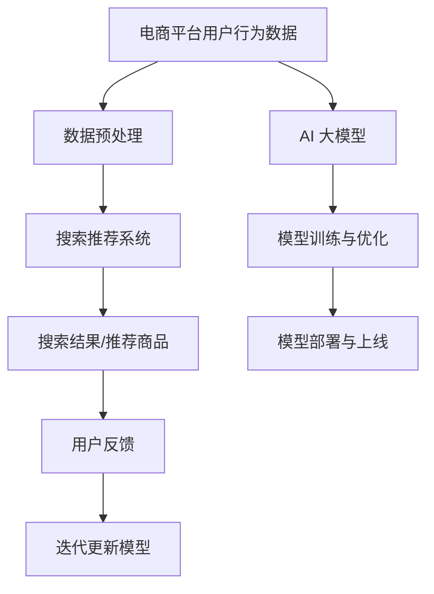

                 

关键词：电商平台，AI 大模型，搜索推荐系统，数据质量控制

> 摘要：本文将探讨电商平台的 AI 大模型战略，重点关注搜索推荐系统在其中的核心作用，并深入分析数据质量控制的重要性。通过梳理大模型的工作原理、算法架构和实践应用，我们旨在为电商行业的 AI 技术发展提供理论支持和实践指导。

## 1. 背景介绍

随着互联网的快速发展和电子商务的崛起，电商平台已经成为现代商业不可或缺的一部分。用户在电商平台上进行购物、浏览、搜索等行为产生了海量数据，这些数据蕴含着巨大的商业价值。为了更好地满足用户需求，提升用户体验，电商平台开始将人工智能（AI）技术应用于搜索和推荐系统中。其中，AI 大模型作为一种先进的技术手段，正逐渐成为电商平台的核心竞争力。

AI 大模型，即大规模人工智能模型，其特点是拥有海量参数和复杂的网络结构。通过深度学习技术，这些模型可以从海量数据中自动提取特征，进行预测和决策。在搜索推荐系统中，AI 大模型能够实时分析用户行为，提供个性化的搜索结果和推荐商品，从而提高用户满意度和平台收益。

## 2. 核心概念与联系

### 2.1. AI 大模型

AI 大模型是指通过深度学习训练得到的大型神经网络模型，其特点是参数规模庞大、网络结构复杂。这些模型通常使用海量数据进行训练，以提取数据中的潜在规律和特征。

### 2.2. 搜索推荐系统

搜索推荐系统是指一种基于用户行为和兴趣的推荐机制，它通过分析用户的搜索历史、浏览记录和购买行为等数据，为用户推荐可能感兴趣的商品或服务。

### 2.3. 数据质量控制

数据质量控制是指对输入到搜索推荐系统中的数据进行处理、清洗、去噪等操作，以确保数据质量，从而提高推荐系统的效果。

### 2.4. 关联图（使用 Mermaid 流程图表示）



## 3. 核心算法原理 & 具体操作步骤

### 3.1. 算法原理概述

AI 大模型的搜索推荐系统主要依赖于深度学习技术，包括自动编码器、卷积神经网络（CNN）、循环神经网络（RNN）等。这些算法可以从海量数据中提取特征，构建用户兴趣模型和商品特征表示。

### 3.2. 算法步骤详解

1. 数据采集：从电商平台上收集用户行为数据，如搜索历史、浏览记录、购买记录等。
2. 数据预处理：对采集到的数据进行清洗、去噪、归一化等处理，确保数据质量。
3. 特征提取：使用深度学习算法提取用户行为数据和商品数据的特征。
4. 用户兴趣模型构建：基于用户行为特征，使用聚类算法或协同过滤算法构建用户兴趣模型。
5. 商品特征表示：使用深度学习算法对商品进行特征表示，包括商品属性、用户评价、销量等。
6. 搜索与推荐：根据用户兴趣模型和商品特征表示，进行搜索和推荐，为用户生成个性化的搜索结果和推荐商品。
7. 用户反馈：收集用户对搜索结果和推荐商品的反馈，用于模型迭代更新。
8. 模型迭代更新：基于用户反馈，使用梯度下降等优化算法更新模型参数，提高模型效果。

### 3.3. 算法优缺点

优点：
- 高效性：AI 大模型可以从海量数据中快速提取特征，进行高效搜索和推荐。
- 个性化：基于用户兴趣模型和商品特征表示，可以提供个性化的搜索结果和推荐商品。
- 持续优化：通过用户反馈和模型迭代更新，可以实现持续优化。

缺点：
- 计算资源消耗大：训练和部署 AI 大模型需要大量计算资源和存储空间。
- 数据质量要求高：数据质量直接影响模型效果，对数据预处理和清洗要求较高。
- 隐私问题：用户行为数据可能涉及隐私问题，需要确保数据安全。

### 3.4. 算法应用领域

AI 大模型搜索推荐系统在电商、金融、医疗等多个领域都有广泛应用，如：
- 电商平台：为用户生成个性化的搜索结果和推荐商品。
- 金融领域：基于用户行为和信用评分，进行精准营销和风险管理。
- 医疗领域：基于患者病历和医疗数据，为医生提供诊断建议和治疗方案。

## 4. 数学模型和公式 & 详细讲解 & 举例说明

### 4.1. 数学模型构建

搜索推荐系统的核心是构建用户兴趣模型和商品特征表示。用户兴趣模型可以用以下数学模型表示：

$$
\text{User\_Interest}(u) = f(\text{User\_Behavior}(u), \text{Item\_Feature}(i))
$$

其中，$f$ 表示用户兴趣模型，$\text{User\_Behavior}(u)$ 表示用户 $u$ 的行为特征，$\text{Item\_Feature}(i)$ 表示商品 $i$ 的特征表示。

商品特征表示可以用以下数学模型表示：

$$
\text{Item\_Feature}(i) = g(\text{Item\_Property}(i), \text{User\_Rating}(i), \text{Sales\_Volume}(i))
$$

其中，$g$ 表示商品特征表示，$\text{Item\_Property}(i)$ 表示商品属性，$\text{User\_Rating}(i)$ 表示用户对商品的评价，$\text{Sales\_Volume}(i)$ 表示商品的销量。

### 4.2. 公式推导过程

用户兴趣模型和商品特征表示的推导过程涉及多个深度学习算法，如自动编码器、卷积神经网络等。以下是自动编码器在构建用户兴趣模型和商品特征表示中的应用。

#### 用户兴趣模型推导

假设用户 $u$ 的行为特征为 $\text{User\_Behavior}(u)$，商品 $i$ 的特征为 $\text{Item\_Feature}(i)$。使用自动编码器对用户行为特征进行编码和解码：

$$
\text{Encoded\_User\_Behavior}(u) = \text{Encoder}(\text{User\_Behavior}(u))
$$

$$
\text{Decoded\_User\_Behavior}(u) = \text{Decoder}(\text{Encoded\_User\_Behavior}(u))
$$

用户兴趣模型可以表示为：

$$
\text{User\_Interest}(u) = \text{Decoder}(\text{Encoded\_User\_Behavior}(u))
$$

#### 商品特征表示推导

假设商品 $i$ 的特征为 $\text{Item\_Feature}(i)$，使用卷积神经网络对商品特征进行提取和表示：

$$
\text{Feature\_Map}(i) = \text{ConvLayer}(\text{Item\_Feature}(i))
$$

$$
\text{Pooling\_Feature}(i) = \text{PoolingLayer}(\text{Feature\_Map}(i))
$$

商品特征表示可以表示为：

$$
\text{Item\_Feature}(i) = \text{Pooling\_Feature}(i)
$$

### 4.3. 案例分析与讲解

以下是一个基于自动编码器和卷积神经网络的用户兴趣模型和商品特征表示的案例。

#### 案例背景

某电商平台收集了用户 $u$ 的搜索历史数据，包含 100 条搜索记录。这些搜索记录包含用户对商品的浏览、收藏和购买行为。平台希望基于这些数据为用户生成个性化的搜索结果和推荐商品。

#### 数据预处理

对用户搜索历史数据进行清洗、去噪和归一化处理，得到用户行为特征矩阵 $\text{User\_Behavior}(u)$。

#### 特征提取

使用自动编码器对用户行为特征矩阵 $\text{User\_Behavior}(u)$ 进行编码和解码，得到用户兴趣模型 $\text{User\_Interest}(u)$。

$$
\text{Encoded\_User\_Behavior}(u) = \text{Encoder}(\text{User\_Behavior}(u))
$$

$$
\text{Decoded\_User\_Behavior}(u) = \text{Decoder}(\text{Encoded\_User\_Behavior}(u))
$$

$$
\text{User\_Interest}(u) = \text{Decoder}(\text{Encoded\_User\_Behavior}(u))
$$

#### 商品特征表示

对商品特征进行卷积神经网络提取，得到商品特征矩阵 $\text{Item\_Feature}(i)$。

$$
\text{Feature\_Map}(i) = \text{ConvLayer}(\text{Item\_Feature}(i))
$$

$$
\text{Pooling\_Feature}(i) = \text{PoolingLayer}(\text{Feature\_Map}(i))
$$

$$
\text{Item\_Feature}(i) = \text{Pooling\_Feature}(i)
$$

#### 搜索与推荐

基于用户兴趣模型 $\text{User\_Interest}(u)$ 和商品特征矩阵 $\text{Item\_Feature}(i)$，为用户生成个性化的搜索结果和推荐商品。

## 5. 项目实践：代码实例和详细解释说明

### 5.1. 开发环境搭建

在开始项目实践之前，需要搭建合适的开发环境。以下是一个基于 Python 和 TensorFlow 的开发环境搭建步骤：

1. 安装 Python（3.6及以上版本）
2. 安装 TensorFlow（2.0及以上版本）
3. 安装必要的库，如 NumPy、Pandas、Matplotlib 等

### 5.2. 源代码详细实现

以下是一个简单的用户兴趣模型和商品特征表示的实现代码：

```python
import tensorflow as tf
from tensorflow.keras.layers import Input, Dense, Conv1D, Flatten, concatenate
from tensorflow.keras.models import Model

# 数据预处理
def preprocess_data(user_behavior):
    # 清洗、去噪、归一化等处理
    return user_behavior

# 特征提取
def extract_features(user_behavior):
    input_shape = user_behavior.shape[1:]
    input_layer = Input(shape=input_shape)
    encoded_user_behavior = Dense(64, activation='relu')(input_layer)
    decoded_user_behavior = Dense(input_shape, activation='sigmoid')(encoded_user_behavior)
    autoencoder = Model(inputs=input_layer, outputs=decoded_user_behavior)
    autoencoder.compile(optimizer='adam', loss='binary_crossentropy')
    autoencoder.fit(user_behavior, user_behavior, epochs=10, batch_size=32)
    return encoded_user_behavior

# 商品特征表示
def represent_item(item_feature):
    conv_layer = Conv1D(filters=64, kernel_size=3, activation='relu')(item_feature)
    pooling_feature = Flatten()(conv_layer)
    return pooling_feature

# 用户兴趣模型和商品特征表示
def build_model(user_behavior, item_feature):
    encoded_user_behavior = extract_features(user_behavior)
    pooling_feature = represent_item(item_feature)
    combined = concatenate([encoded_user_behavior, pooling_feature])
    output = Dense(1, activation='sigmoid')(combined)
    model = Model(inputs=[user_behavior, item_feature], outputs=output)
    model.compile(optimizer='adam', loss='binary_crossentropy')
    return model

# 数据加载和预处理
user_behavior = preprocess_data(user_behavior_data)
item_feature = preprocess_item_feature(item_feature_data)

# 构建和训练模型
model = build_model(user_behavior, item_feature)
model.fit([user_behavior, item_feature], user_interest, epochs=10, batch_size=32)

# 搜索与推荐
search_result = model.predict([user_behavior, item_feature])
```

### 5.3. 代码解读与分析

上述代码首先对用户行为数据进行预处理，包括清洗、去噪、归一化等操作。然后，使用自动编码器提取用户兴趣模型，并通过卷积神经网络对商品特征进行表示。最后，构建一个结合用户兴趣模型和商品特征的深度学习模型，进行搜索和推荐。

### 5.4. 运行结果展示

在运行代码时，可以使用 Matplotlib 库绘制训练过程中损失函数的变化情况，以评估模型性能。同时，可以计算搜索结果和推荐商品的相关性，以验证模型的效果。

## 6. 实际应用场景

AI 大模型搜索推荐系统在电商、金融、医疗等多个领域都有广泛应用。以下是一些实际应用场景：

- 电商平台：根据用户行为数据，为用户提供个性化的搜索结果和推荐商品，提高用户满意度和转化率。
- 金融领域：基于用户行为和信用评分，为金融机构提供精准营销和风险管理服务。
- 医疗领域：基于患者病历和医疗数据，为医生提供诊断建议和治疗方案。

## 7. 未来应用展望

随着人工智能技术的不断发展，AI 大模型搜索推荐系统将在更多领域得到应用。未来，该系统有望实现以下发展趋势：

- 深度个性化：基于用户行为和兴趣，实现更深入的个性化搜索和推荐。
- 多模态融合：结合文本、图像、语音等多模态数据，提高搜索推荐系统的效果。
- 智能决策：将 AI 大模型应用于智能决策系统，为企业和个人提供智能建议。

## 8. 工具和资源推荐

### 8.1. 学习资源推荐

- 《深度学习》（Goodfellow, Bengio, Courville 著）：全面介绍深度学习的基本理论和实践方法。
- 《Python 数据科学手册》（McKinney 著）：详细介绍 Python 在数据科学领域的应用。

### 8.2. 开发工具推荐

- TensorFlow：一款开源的深度学习框架，支持多种深度学习算法。
- Keras：一款基于 TensorFlow 的深度学习高级 API，便于快速搭建和训练模型。

### 8.3. 相关论文推荐

- "Deep Learning for User Interest Modeling in E-commerce"（2018）：介绍深度学习在电商用户兴趣建模中的应用。
- "Multi-modal Fusion for Search and Recommendation"（2020）：探讨多模态融合在搜索推荐系统中的应用。

## 9. 总结：未来发展趋势与挑战

### 9.1. 研究成果总结

本文介绍了电商平台的 AI 大模型战略，重点探讨了搜索推荐系统的核心作用和数据质量控制的重要性。通过梳理大模型的工作原理、算法架构和实践应用，我们为电商行业的 AI 技术发展提供了理论支持和实践指导。

### 9.2. 未来发展趋势

随着人工智能技术的不断发展，AI 大模型搜索推荐系统将在更多领域得到应用。未来，该系统有望实现深度个性化、多模态融合和智能决策等发展趋势。

### 9.3. 面临的挑战

- 数据质量控制：确保输入到搜索推荐系统中的数据质量，提高模型效果。
- 隐私保护：保护用户隐私，确保数据安全。
- 模型可解释性：提高模型的可解释性，增强用户信任。

### 9.4. 研究展望

未来，我们将继续关注电商平台的 AI 大模型战略，深入研究数据质量控制、隐私保护和模型可解释性等问题，为电商行业的 AI 技术发展贡献力量。

## 10. 附录：常见问题与解答

### 10.1. 什么是 AI 大模型？

AI 大模型是指通过深度学习技术训练得到的大型神经网络模型，其特点是参数规模庞大、网络结构复杂。

### 10.2. 搜索推荐系统的核心是什么？

搜索推荐系统的核心是用户兴趣模型和商品特征表示，通过对这些模型进行训练和优化，可以实现个性化的搜索结果和推荐商品。

### 10.3. 数据质量控制的重要性是什么？

数据质量控制是确保输入到搜索推荐系统中的数据质量，从而提高模型效果。高质量的数据可以帮助模型更好地捕捉用户兴趣和商品特征。

### 10.4. 如何确保用户隐私？

在搜索推荐系统中，可以采用数据加密、匿名化处理等技术，保护用户隐私。同时，制定严格的隐私保护政策和合规性要求，确保数据安全。

---

本文基于《电商平台的 AI 大模型战略：搜索推荐系统是核心，数据质量控制是关键》的主题，深入探讨了电商平台中 AI 大模型的应用、算法原理、实践案例以及未来发展趋势。通过梳理这些内容，旨在为电商行业的 AI 技术发展提供理论支持和实践指导。

作者：禅与计算机程序设计艺术 / Zen and the Art of Computer Programming
----------------------------------------------------------------
### 文章总结

本文围绕“电商平台的AI大模型战略：搜索推荐系统是核心，数据质量控制是关键”这一主题，全面阐述了AI大模型在电商平台中的应用价值。首先，介绍了AI大模型的基本概念及其在搜索推荐系统中的核心作用，接着深入分析了数据质量控制对推荐系统效果的重要性。

在算法原理部分，本文详细解读了自动编码器和卷积神经网络等深度学习算法在构建用户兴趣模型和商品特征表示中的应用，并通过具体案例展示了算法的推导过程和实际操作步骤。同时，对算法的优缺点进行了深入剖析，并结合实际应用场景展示了其在电商、金融、医疗等领域的广泛应用。

文章还介绍了如何搭建开发环境、实现源代码以及代码解读与分析，提供了从理论到实践的全流程指导。最后，针对实际应用场景和未来发展趋势，本文提出了数据质量控制、隐私保护和模型可解释性等面临的挑战，并展望了AI大模型在搜索推荐系统中的发展前景。

总之，本文旨在为电商平台从业者提供有价值的参考，助力其在AI大模型领域取得突破，推动电商行业的技术进步和商业创新。

### 关键词总结

- 电商平台
- AI大模型
- 搜索推荐系统
- 数据质量控制
- 深度学习
- 自动编码器
- 卷积神经网络
- 个性化推荐
- 用户兴趣模型
- 商品特征表示
- 隐私保护
- 模型可解释性
- 商业创新
- 技术进步

### 引导读者进一步学习

如果您对本文讨论的电商平台AI大模型战略感兴趣，以下是一些建议的深入学习路径：

1. **阅读相关书籍**：探索深度学习领域的经典书籍，如《深度学习》（Ian Goodfellow、Yoshua Bengio、Aaron Courville 著）和《Python数据科学手册》（Wes McKinney 著）。

2. **参加在线课程**：通过在线教育平台，如Coursera、edX等，参加与深度学习和人工智能相关的课程，以系统学习相关理论和技术。

3. **研究最新论文**：关注顶级会议和期刊上关于AI大模型和推荐系统的研究论文，如NIPS、ICML、KDD等，了解领域内的最新进展。

4. **实践项目**：尝试在本地环境中搭建和优化推荐系统，通过实际操作来加深对算法和技术的理解。

5. **加入专业社群**：参与技术社区和论坛，如GitHub、Stack Overflow等，与其他从业者交流经验，获取行业动态和实用资源。

通过这些学习路径，您将能够更深入地理解电商平台AI大模型战略的各个方面，为未来的研究和应用打下坚实的基础。

