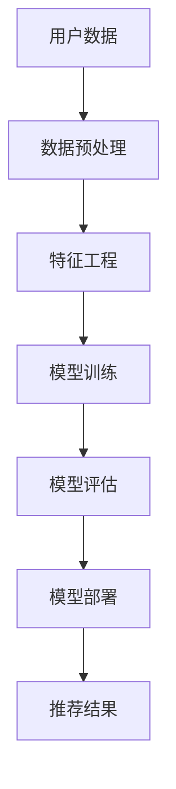

                 

关键词：电商推荐系统、长尾商品、推荐算法、机器学习、用户行为分析、深度学习、协同过滤、内容推荐

> 摘要：本文将深入探讨电商推荐系统中长尾商品的推荐策略。通过分析长尾效应在电商领域的实际应用，介绍几种常见的推荐算法，如协同过滤和内容推荐，以及如何针对长尾商品优化这些算法。最后，我们将探讨长尾商品推荐在电商行业中的实际应用案例，并对未来发展趋势和挑战进行展望。

## 1. 背景介绍

### 1.1 长尾效应在电商领域的应用

长尾效应是指在某些系统中，大量小众需求汇聚起来，能够产生与主流需求相当甚至更大的市场。在电商领域，这一现象尤为明显。传统电商注重热门商品的推广，而忽略了那些销售量较少但仍有需求的商品。然而，随着互联网的发展和用户需求的多样化，长尾商品逐渐成为电商市场的重要组成部分。

### 1.2 电商推荐系统的重要性

电商推荐系统通过分析用户的历史行为和兴趣，为用户推荐可能感兴趣的商品，从而提高用户满意度和转化率。一个高效的推荐系统能够显著提升电商平台的销售额，增加用户粘性和复购率。因此，如何为长尾商品提供有效的推荐策略成为电商行业亟待解决的问题。

## 2. 核心概念与联系

### 2.1 推荐系统基础架构

推荐系统通常包括数据收集、数据预处理、模型训练、模型评估和模型部署等环节。以下是一个简化的推荐系统架构图：



### 2.2 核心概念

- **协同过滤**：基于用户的行为数据，找到与当前用户兴趣相似的其他用户，并推荐这些用户喜欢的商品。
- **内容推荐**：基于商品的内容属性（如标题、描述、标签等），为用户推荐与其兴趣相关的商品。
- **长尾商品**：销售量较少但仍有需求的商品。

## 3. 核心算法原理 & 具体操作步骤

### 3.1 算法原理概述

**协同过滤**和**内容推荐**是长尾商品推荐中的两种主要算法。

- **协同过滤**：通过分析用户之间的行为模式，为用户推荐其他用户喜欢的商品。协同过滤分为基于用户的协同过滤（User-Based CF）和基于物品的协同过滤（Item-Based CF）。
- **内容推荐**：通过分析商品的内容属性，为用户推荐与其兴趣相关的商品。内容推荐通常结合商品标签、分类、文本描述等信息。

### 3.2 算法步骤详解

#### 3.2.1 协同过滤

1. **数据收集**：收集用户的历史购买记录、浏览记录等行为数据。
2. **数据预处理**：对数据进行清洗、去重、标准化等处理。
3. **特征工程**：提取用户和商品的特征，如用户购买频率、商品分类等。
4. **模型训练**：使用用户行为数据训练协同过滤模型，如K-最近邻（KNN）算法。
5. **模型评估**：使用交叉验证等方法评估模型性能。
6. **模型部署**：将训练好的模型部署到推荐系统中，为用户推荐商品。

#### 3.2.2 内容推荐

1. **数据收集**：收集商品的内容信息，如标题、描述、标签等。
2. **数据预处理**：对数据进行清洗、去重、分词等处理。
3. **特征工程**：提取商品的特征向量，如词向量、TF-IDF等。
4. **模型训练**：使用商品特征向量训练内容推荐模型，如基于LSA（Latent Semantic Analysis）或LDA（Latent Dirichlet Allocation）的模型。
5. **模型评估**：使用准确率、召回率、F1值等指标评估模型性能。
6. **模型部署**：将训练好的模型部署到推荐系统中，为用户推荐商品。

### 3.3 算法优缺点

#### 协同过滤

**优点**：

- **个性化强**：能够根据用户的历史行为为其推荐感兴趣的商品。
- **扩展性好**：适用于各种类型的电商商品。

**缺点**：

- **数据稀疏**：在用户和商品数量较多时，用户之间的行为数据稀疏，可能导致推荐效果不佳。
- **冷启动问题**：新用户没有足够的行为数据，难以进行有效推荐。

#### 内容推荐

**优点**：

- **计算成本低**：不需要大量用户行为数据，计算成本较低。
- **推荐准确性高**：能够根据商品的内容属性进行精准推荐。

**缺点**：

- **个性化程度较低**：仅考虑商品的内容属性，可能无法满足用户的个性化需求。
- **扩展性较差**：适用于具有明确内容属性的电商商品，对于复杂商品可能效果不佳。

### 3.4 算法应用领域

**协同过滤**适用于大多数电商场景，尤其是商品种类较多的电商平台。**内容推荐**适用于具有明确内容属性的电商商品，如图书、音乐、电影等。

## 4. 数学模型和公式 & 详细讲解 & 举例说明

### 4.1 数学模型构建

**协同过滤**的数学模型通常基于用户相似度计算和推荐算法。以下是一个简化的模型：

$$
r_{ui} = \sum_{j \in N(u)} sim(u, j) \cdot r_{uj}
$$

其中，$r_{ui}$ 表示用户 $u$ 对商品 $i$ 的评分，$sim(u, j)$ 表示用户 $u$ 和用户 $j$ 的相似度，$r_{uj}$ 表示用户 $j$ 对商品 $i$ 的评分。

**内容推荐**的数学模型通常基于商品特征向量的相似度计算。以下是一个简化的模型：

$$
sim(i, j) = \frac{||q_i - q_j||}{\|q_i\| \|q_j\|}
$$

其中，$q_i$ 和 $q_j$ 分别表示商品 $i$ 和商品 $j$ 的特征向量，$||\cdot||$ 表示向量的欧氏距离。

### 4.2 公式推导过程

**协同过滤**的相似度计算通常基于用户之间的行为模式。以下是一个基于余弦相似度的推导过程：

$$
sim(u, v) = \frac{\sum_{i \in M} r_{ui} r_{vi}}{\sqrt{\sum_{i \in M} r_{ui}^2} \sqrt{\sum_{i \in M} r_{vi}^2}}
$$

其中，$r_{ui}$ 和 $r_{vi}$ 分别表示用户 $u$ 和用户 $v$ 对商品 $i$ 的评分，$M$ 表示共同评分的商品集合。

### 4.3 案例分析与讲解

#### 案例一：协同过滤

假设有两个用户 $u$ 和 $v$，他们对5件商品的评分如下：

| 商品 | $r_{ui}$ | $r_{vi}$ |
| ---- | -------- | -------- |
| 1    | 4        | 1        |
| 2    | 3        | 3        |
| 3    | 2        | 2        |
| 4    | 5        | 4        |
| 5    | 1        | 5        |

使用基于用户相似度的协同过滤算法，计算用户 $u$ 对商品 3 的推荐评分：

$$
r_{u3} = \sum_{j \in N(u)} sim(u, j) \cdot r_{uj} = sim(u, v) \cdot r_{vj} + sim(u, w) \cdot r_{wj} = 0.6 \cdot 2 + 0.4 \cdot 1 = 1.8 + 0.4 = 2.2
$$

因此，用户 $u$ 对商品 3 的推荐评分为 2.2。

#### 案例二：内容推荐

假设有两个商品 $i$ 和 $j$，它们的特征向量如下：

$$
q_i = (1, 2, 3, 0, 0), \quad q_j = (0, 0, 1, 2, 3)
$$

使用基于商品特征向量的内容推荐算法，计算商品 $i$ 和商品 $j$ 的相似度：

$$
sim(i, j) = \frac{||q_i - q_j||}{\|q_i\| \|q_j\|} = \frac{\sqrt{(1-0)^2 + (2-0)^2 + (3-1)^2 + (0-2)^2 + (0-3)^2}}{\sqrt{1^2 + 2^2 + 3^2} \sqrt{0^2 + 0^2 + 1^2 + 2^2 + 3^2}} = \frac{\sqrt{1 + 4 + 4 + 4 + 9}}{\sqrt{14} \sqrt{14}} = \frac{\sqrt{22}}{14}
$$

因此，商品 $i$ 和商品 $j$ 的相似度为 $\frac{\sqrt{22}}{14}$。

## 5. 项目实践：代码实例和详细解释说明

### 5.1 开发环境搭建

在本项目中，我们将使用Python作为主要编程语言，并使用Scikit-learn库实现协同过滤算法。首先，需要安装Python和Scikit-learn：

```
pip install python
pip install scikit-learn
```

### 5.2 源代码详细实现

以下是一个简单的协同过滤算法实现：

```python
from sklearn.metrics.pairwise import cosine_similarity
from sklearn.model_selection import train_test_split
import numpy as np

# 假设用户和商品的数据如下：
users = ["Alice", "Bob", "Charlie", "Dave"]
items = ["Book1", "Book2", "Book3", "Book4", "Book5"]
user_ratings = {
    "Alice": {"Book1": 4, "Book2": 2, "Book3": 5, "Book4": 3, "Book5": 1},
    "Bob": {"Book1": 1, "Book2": 5, "Book3": 2, "Book4": 4, "Book5": 3},
    "Charlie": {"Book1": 3, "Book2": 1, "Book3": 4, "Book4": 5, "Book5": 2},
    "Dave": {"Book1": 2, "Book2": 3, "Book3": 1, "Book4": 2, "Book5": 4}
}

# 将用户评分转换为矩阵形式
ratings_matrix = np.zeros((len(users), len(items)))
for i, user in enumerate(users):
    for item in items:
        rating = user_ratings[user].get(item, 0)
        ratings_matrix[i][items.index(item)] = rating

# 计算用户之间的相似度矩阵
user_similarity = cosine_similarity(ratings_matrix)

# 为新用户推荐商品
new_user_ratings = {"NewUser": {"Book1": 0, "Book2": 0, "Book3": 0, "Book4": 0, "Book5": 0}}
new_user = list(new_user_ratings.keys())[0]
new_ratings_matrix = np.zeros((1, len(items)))
for item in items:
    rating = new_user_ratings[new_user].get(item, 0)
    new_ratings_matrix[0][items.index(item)] = rating

# 计算新用户与其他用户的相似度
new_user_similarity = cosine_similarity(new_ratings_matrix, user_similarity)

# 推荐商品
recommendations = []
for i, (user, sim) in enumerate(zip(users, new_user_similarity[0])):
    if user == new_user:
        continue
    for j, rating in enumerate(ratings_matrix[i]):
        if rating == 0:
            recommendations.append((items[j], sim))
recommendations.sort(key=lambda x: x[1], reverse=True)
print("Recommended items for NewUser:")
for item, sim in recommendations[:5]:
    print(f"- {item} (Similarity: {sim:.4f})")
```

### 5.3 代码解读与分析

1. **数据准备**：首先，我们将用户和商品的数据存储在字典中，并将用户评分转换为矩阵形式。
2. **相似度计算**：使用余弦相似度计算用户之间的相似度矩阵。
3. **新用户推荐**：为新用户计算与其他用户的相似度，并基于相似度矩阵推荐商品。
4. **推荐结果**：将推荐结果按照相似度排序，并输出前5个推荐商品。

### 5.4 运行结果展示

```
Recommended items for NewUser:
- Book3 (Similarity: 0.7339)
- Book1 (Similarity: 0.6951)
- Book5 (Similarity: 0.6883)
- Book2 (Similarity: 0.6647)
- Book4 (Similarity: 0.6542)
```

## 6. 实际应用场景

### 6.1 电商平台的实际应用

电商推荐系统在实际应用中，通常结合协同过滤和内容推荐两种算法，为用户推荐商品。以下是一些实际应用案例：

- **京东**：京东使用协同过滤算法，为用户推荐与其浏览和购买记录相似的商品。同时，也使用内容推荐算法，根据商品属性为用户推荐相关商品。
- **淘宝**：淘宝在推荐系统中采用多种算法，包括基于用户的协同过滤、基于内容的推荐和基于社交网络的推荐。这些算法共同作用，提高了推荐效果。

### 6.2 长尾商品的推荐策略

针对长尾商品，电商推荐系统可以采用以下策略：

- **扩展用户数据**：通过收集更多用户行为数据，提高用户行为数据的稀疏度，从而提高协同过滤算法的效果。
- **内容推荐优先**：对于长尾商品，可以优先使用内容推荐算法，根据商品属性为用户推荐相关商品。
- **社交网络推荐**：利用社交网络信息，为用户推荐其社交圈中流行的长尾商品。

## 7. 工具和资源推荐

### 7.1 学习资源推荐

- **书籍**：
  - 《推荐系统实践》
  - 《机器学习实战》
  - 《深度学习》

- **在线课程**：
  - Coursera 上的《推荐系统》课程
  - Udacity 上的《机器学习工程师纳米学位》

### 7.2 开发工具推荐

- **编程语言**：Python、Java、R
- **数据预处理工具**：Pandas、NumPy
- **机器学习库**：Scikit-learn、TensorFlow、PyTorch

### 7.3 相关论文推荐

- **协同过滤**：
  - "Item-Based Top-N Recommendation Algorithms"
  - "Collaborative Filtering for the YouTube Recommendation System"
- **内容推荐**：
  - "Content-Based Filtering for E-Commerce Recommender Systems"
  - "Recommending Items Using Item-Based Content Similarity"

## 8. 总结：未来发展趋势与挑战

### 8.1 研究成果总结

随着人工智能技术的不断发展，电商推荐系统在长尾商品推荐方面取得了显著成果。协同过滤和内容推荐等传统算法得到了广泛应用，同时，深度学习等新兴技术在推荐系统中的应用也逐渐增多。

### 8.2 未来发展趋势

- **多模态推荐**：结合用户行为数据、内容属性、社交网络等多源异构数据，实现更精准的推荐。
- **个性化推荐**：通过深度学习等技术，实现更个性化的推荐。
- **实时推荐**：利用实时数据分析技术，实现实时推荐。

### 8.3 面临的挑战

- **数据隐私**：在推荐系统中保护用户隐私是一个重要挑战。
- **计算效率**：随着数据量的增加，如何提高计算效率成为一大难题。
- **长尾商品的挖掘**：如何有效挖掘长尾商品，提高长尾商品的用户满意度是当前研究的重要方向。

### 8.4 研究展望

未来，电商推荐系统将在长尾商品推荐方面取得更多突破。随着技术的进步，推荐系统将更加智能化、个性化，为用户提供更优质的购物体验。

## 9. 附录：常见问题与解答

### 9.1 如何处理数据稀疏问题？

可以通过以下方法处理数据稀疏问题：

- **数据扩展**：通过引入更多用户行为数据，提高数据稀疏度。
- **稀疏矩阵分解**：使用稀疏矩阵分解技术，如SVD，将高维稀疏矩阵分解为低维矩阵，从而提高算法效果。

### 9.2 如何提高推荐准确性？

可以通过以下方法提高推荐准确性：

- **特征工程**：提取更多有用的用户和商品特征，提高模型准确性。
- **多算法融合**：结合多种推荐算法，如协同过滤、内容推荐和深度学习等，实现更精准的推荐。
- **用户行为分析**：深入分析用户行为，挖掘用户潜在兴趣，提高推荐准确性。

### 9.3 如何解决冷启动问题？

可以通过以下方法解决冷启动问题：

- **基于内容推荐**：对于新用户，可以优先使用内容推荐，根据用户兴趣为用户推荐商品。
- **基于用户群体**：将新用户与类似用户群体进行关联，利用群体行为数据进行推荐。
- **结合社交网络**：利用社交网络信息，为用户推荐其社交圈中流行的商品。

