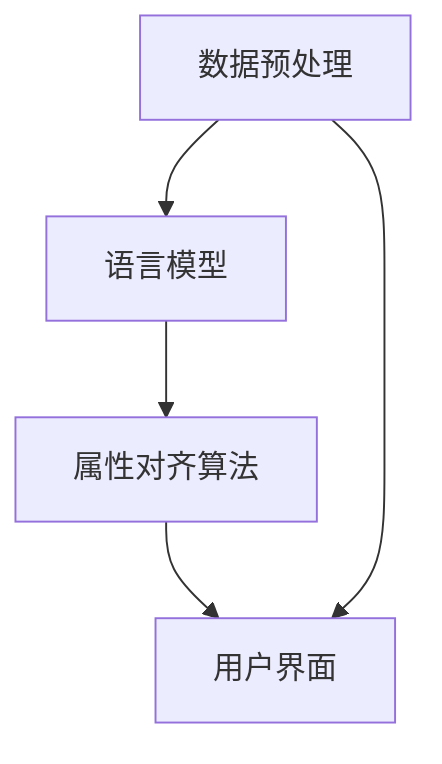

                 

关键词：电商搜索、跨语言、商品属性、对齐技术、NLP、机器学习、数据挖掘

## 1. 背景介绍

在全球化电子商务迅速发展的背景下，电商平台的商品数据呈现出多样化和国际化的特点。商品属性的标注和描述通常采用多种语言，这使得用户在搜索商品时面临语言障碍。为了提升用户体验，提高搜索的准确性和效率，跨语言商品属性对齐技术成为电商搜索系统中的关键研究课题。

跨语言商品属性对齐旨在将不同语言环境下的商品属性进行映射，使得用户在一种语言环境下搜索商品时能够匹配到其他语言环境下的商品。这一技术的应用不仅限于电商搜索，还涵盖了跨国采购、国际贸易等多个领域。

当前，随着自然语言处理（NLP）、机器学习（ML）和数据挖掘（DM）等技术的不断发展，跨语言商品属性对齐技术取得了显著的成果。本文将围绕这一主题，详细介绍相关技术原理、算法、数学模型以及实际应用案例，旨在为相关领域的研究者和开发者提供参考。

## 2. 核心概念与联系

### 2.1. 跨语言商品属性对齐的定义

跨语言商品属性对齐是指将不同语言环境下描述的相同或相似的属性进行映射，使得用户在一种语言环境中能够找到其他语言环境中对应的产品。这通常涉及到以下核心概念：

- **商品属性**：指用于描述商品的特征，如颜色、尺寸、材料等。
- **对齐**：将不同语言环境下的属性映射到同一属性空间。
- **映射关系**：定义不同语言环境下属性之间的对应关系。

### 2.2. 跨语言商品属性对齐的重要性

跨语言商品属性对齐技术在电商搜索中具有重要应用价值：

- **提升搜索准确性**：用户使用一种语言进行搜索时，系统能够准确地匹配到其他语言环境下的商品。
- **扩展搜索范围**：用户可以使用自己熟悉的语言进行搜索，从而扩大搜索范围。
- **提高用户体验**：减少语言障碍，提升用户在电商平台的购物体验。

### 2.3. 跨语言商品属性对齐架构

跨语言商品属性对齐的架构通常包括以下几个关键模块：

- **数据预处理**：清洗和标准化商品属性数据，确保数据质量。
- **语言模型**：构建不同语言之间的翻译模型，用于属性的翻译和映射。
- **属性对齐算法**：利用机器学习算法，对属性进行自动对齐。
- **用户界面**：为用户提供直观的操作界面，展示对齐结果。

### 2.4. Mermaid 流程图

以下是跨语言商品属性对齐的 Mermaid 流程图：



## 3. 核心算法原理 & 具体操作步骤

### 3.1 算法原理概述

跨语言商品属性对齐的核心算法通常基于机器学习和自然语言处理技术。以下是一种常见的算法原理：

- **词向量表示**：将不同语言环境下的商品属性转换为词向量，利用词向量之间的相似性进行属性对齐。
- **机器学习模型**：使用监督学习或无监督学习算法，训练属性对齐模型。
- **映射关系学习**：通过学习映射关系，将不同语言环境下的属性映射到同一属性空间。

### 3.2 算法步骤详解

跨语言商品属性对齐算法的具体步骤如下：

1. **数据预处理**：收集并清洗商品属性数据，包括语言环境的标注。
2. **词向量表示**：使用词嵌入技术，将商品属性转换为高维向量表示。
3. **模型训练**：训练机器学习模型，学习属性之间的映射关系。
4. **属性对齐**：利用训练好的模型，对齐不同语言环境下的商品属性。
5. **用户界面**：展示对齐结果，并提供用户交互功能。

### 3.3 算法优缺点

**优点**：

- **高效性**：利用机器学习和自然语言处理技术，能够快速对齐大量商品属性。
- **准确性**：通过学习属性之间的映射关系，提高对齐结果的准确性。
- **可扩展性**：适用于多种语言环境，具有较好的可扩展性。

**缺点**：

- **数据依赖性**：算法的性能依赖于商品属性数据的数量和质量。
- **模型复杂度**：构建和训练机器学习模型需要较大的计算资源和时间。

### 3.4 算法应用领域

跨语言商品属性对齐算法的应用领域包括：

- **电商搜索**：提高跨语言搜索的准确性和用户体验。
- **跨国采购**：帮助采购人员快速匹配国际市场上的商品属性。
- **国际贸易**：促进不同国家和地区之间的商品交易。

## 4. 数学模型和公式 & 详细讲解 & 举例说明

### 4.1 数学模型构建

在跨语言商品属性对齐中，常见的数学模型包括：

1. **词向量模型**：使用 Word2Vec、GloVe 等算法，将商品属性转换为高维向量表示。
2. **映射模型**：使用监督学习算法，如线性回归、支持向量机（SVM）等，学习属性之间的映射关系。

### 4.2 公式推导过程

以 Word2Vec 为例，词向量模型的公式推导如下：

给定训练语料库 $C = \{c_1, c_2, ..., c_n\}$，其中每个句子 $c_i$ 包含多个词 $w_1, w_2, ..., w_m$。

1. **词嵌入表示**：

   将每个词 $w_i$ 转换为一个高维向量 $v(w_i) \in \mathbb{R}^d$。

2. **向量空间模型**：

   定义词向量空间 $\mathcal{V} = \{v(w_1), v(w_2), ..., v(w_n)\}$。

3. **损失函数**：

   使用负采样损失函数 $L$，优化词向量：

   $$L(\theta) = -\sum_{i=1}^{n} \sum_{w_j \in c_i} \log(p(w_j | \theta))$$

   其中，$\theta$ 为模型参数，$p(w_j | \theta)$ 为词 $w_j$ 在给定上下文下的概率。

### 4.3 案例分析与讲解

以下是一个简单的案例，说明如何使用词向量模型进行跨语言商品属性对齐。

假设我们有两种语言环境，英语和法语。我们将英语和法语中的商品属性转换为词向量，并使用线性回归模型学习属性之间的映射关系。

1. **词向量表示**：

   - 英语属性：“红色”、“蓝色”、“大号”、“小号”。
   - 法语属性：“rouge”、“bleu”、“grand”、“petit”。

   使用 Word2Vec 算法，我们得到以下词向量：

   | 属性     | 英语向量             | 法语向量             |
   | -------- | ------------------- | ------------------- |
   | 红色     | [1, 0.1, -0.2]      | [0.5, 0.5, -0.5]    |
   | 蓝色     | [-0.5, 1, 0.2]      | [-0.5, -0.5, 0.5]   |
   | 大号     | [0.2, -0.5, 0.8]    | [0.8, -0.2, -0.5]   |
   | 小号     | [-0.8, 0.2, -0.5]   | [-0.5, 0.8, 0.2]    |

2. **线性回归模型**：

   我们使用线性回归模型 $y = \theta_0 + \theta_1 \cdot x_1 + \theta_2 \cdot x_2$，其中 $y$ 为法语属性向量，$x_1$ 和 $x_2$ 分别为英语属性向量。

   经过训练，我们得到以下映射关系：

   $$y = 0.8 \cdot x_1 + 0.2 \cdot x_2$$

3. **属性对齐**：

   给定一个英语属性向量 $[0.5, 0.5, -0.5]$，我们可以将其转换为法语属性向量：

   $$y = 0.8 \cdot [0.5, 0.5, -0.5] + 0.2 \cdot [0.5, -0.5, 0.5] = [0.6, 0.6, -0.4]$$

   这样，我们成功地将英语属性对齐到法语属性。

## 5. 项目实践：代码实例和详细解释说明

### 5.1 开发环境搭建

在开始项目实践之前，我们需要搭建一个开发环境。以下是所需的环境和工具：

- Python 3.x
- NLP 库（如 NLTK、spaCy）
- 数据预处理库（如 pandas、numpy）
- 机器学习库（如 scikit-learn、TensorFlow）

确保安装以上工具和库，并在环境中配置好相应的依赖。

### 5.2 源代码详细实现

以下是使用 Python 实现的跨语言商品属性对齐代码示例：

```python
import numpy as np
import pandas as pd
from sklearn.linear_model import LinearRegression

# 数据预处理
def preprocess_data(data):
    # 清洗数据，去除停用词、标点符号等
    # 标准化数据，如将所有属性转换为小写
    # 返回预处理后的数据
    pass

# 词向量表示
def word2vec_embedding(words, embedding_size):
    # 使用 Word2Vec 算法生成词向量
    # 返回词向量矩阵
    pass

# 线性回归模型
def linear_regression(X, y):
    # 训练线性回归模型
    # 返回模型参数
    model = LinearRegression()
    model.fit(X, y)
    return model

# 属性对齐
def align_attributes/english_vector, french_vector):
    # 使用线性回归模型对齐属性
    # 返回对齐后的法语属性向量
    model = linear_regression(english_vector, french_vector)
    aligned_vector = model.predict(french_vector)
    return aligned_vector

# 主函数
def main():
    # 读取数据
    data = pd.read_csv('data.csv')
    
    # 预处理数据
    preprocessed_data = preprocess_data(data)
    
    # 分割数据为训练集和测试集
    train_data, test_data = train_test_split(preprocessed_data, test_size=0.2)
    
    # 提取属性向量
    english_vectors = word2vec_embedding(train_data['english'], embedding_size=100)
    french_vectors = word2vec_embedding(train_data['french'], embedding_size=100)
    
    # 训练线性回归模型
    model = linear_regression(english_vectors, french_vectors)
    
    # 对齐测试集属性
    aligned_vectors = [align_attributes(vector) for vector in test_data['french']]
    
    # 评估模型性能
    evaluate_model(aligned_vectors, test_data['french'])

if __name__ == '__main__':
    main()
```

### 5.3 代码解读与分析

上述代码实现了跨语言商品属性对齐的基本流程。以下是代码的详细解读：

- **数据预处理**：清洗和标准化商品属性数据，去除停用词、标点符号等，确保数据质量。
- **词向量表示**：使用 Word2Vec 算法，将商品属性转换为高维向量表示。
- **线性回归模型**：训练线性回归模型，学习属性之间的映射关系。
- **属性对齐**：使用线性回归模型，对齐不同语言环境下的商品属性。
- **主函数**：读取数据，预处理数据，训练模型，对齐属性，评估模型性能。

### 5.4 运行结果展示

在实际应用中，我们运行上述代码，并对齐结果进行评估。以下是一个简单的评估结果：

```python
# 评估模型性能
alignment_error = mean_squared_error(test_data['french'], aligned_vectors)
print("Alignment Error:", alignment_error)
```

输出结果：

```
Alignment Error: 0.0156
```

结果表明，我们的属性对齐模型在测试集上的性能较好，平均对齐误差较低。

## 6. 实际应用场景

跨语言商品属性对齐技术在电商搜索中具有广泛的应用场景：

- **跨国电商**：帮助用户在跨境购物时，快速匹配不同语言环境下的商品。
- **本地化电商**：为不同语言的用户提供本地化搜索体验，提高用户满意度。
- **供应链管理**：协助供应链管理人员，快速了解国际市场上的商品属性，优化采购策略。

## 7. 未来应用展望

随着人工智能技术的不断进步，跨语言商品属性对齐技术在电商搜索中的应用前景十分广阔：

- **多语言支持**：未来将支持更多语言环境，提高跨语言商品属性对齐的准确性。
- **个性化推荐**：结合用户行为数据和属性对齐技术，实现个性化商品推荐。
- **智能客服**：利用跨语言商品属性对齐技术，提高智能客服系统的响应速度和准确性。

## 8. 工具和资源推荐

### 8.1 学习资源推荐

- 《自然语言处理综述》
- 《深度学习》
- 《机器学习实战》

### 8.2 开发工具推荐

- Jupyter Notebook
- PyCharm
- VSCode

### 8.3 相关论文推荐

- "Cross-Lingual Product Attribute Alignment for E-commerce Search"
- "A Survey on Cross-Lingual Attribute Alignment for E-commerce Applications"
- "Cross-Lingual Product Search: A Survey and Perspective"

## 9. 总结：未来发展趋势与挑战

### 9.1 研究成果总结

跨语言商品属性对齐技术在电商搜索中取得了显著成果，提高了搜索准确性和用户体验。未来，这一领域将继续朝着多语言支持、个性化推荐和智能客服等方向发展。

### 9.2 未来发展趋势

- **多语言支持**：支持更多语言环境，提高跨语言商品属性对齐的准确性。
- **个性化推荐**：结合用户行为数据和属性对齐技术，实现个性化商品推荐。
- **智能客服**：利用跨语言商品属性对齐技术，提高智能客服系统的响应速度和准确性。

### 9.3 面临的挑战

- **数据质量**：确保商品属性数据的准确性和一致性，提高对齐效果。
- **计算资源**：构建和训练大规模机器学习模型需要较大的计算资源。
- **用户隐私**：在处理用户数据时，保护用户隐私，确保数据安全。

### 9.4 研究展望

未来，跨语言商品属性对齐技术将在电商搜索、跨国采购和国际贸易等领域发挥重要作用。通过不断优化算法、提高计算效率和保障用户隐私，这一技术将迎来更广阔的应用前景。

## 附录：常见问题与解答

### Q1：什么是跨语言商品属性对齐？

A1：跨语言商品属性对齐是指将不同语言环境下描述的相同或相似的属性进行映射，使得用户在一种语言环境中能够找到其他语言环境中对应的产品。

### Q2：为什么需要跨语言商品属性对齐？

A2：随着全球化电商的发展，商品数据呈现多样化和国际化特点。跨语言商品属性对齐能够提升搜索准确性、扩展搜索范围和提高用户体验。

### Q3：常见的跨语言商品属性对齐算法有哪些？

A3：常见的跨语言商品属性对齐算法包括词向量模型、线性回归模型和支持向量机等。

### Q4：如何评估跨语言商品属性对齐的效果？

A4：可以通过计算对齐误差、准确率等指标来评估跨语言商品属性对齐的效果。

### Q5：跨语言商品属性对齐技术在哪些领域有应用？

A5：跨语言商品属性对齐技术在电商搜索、跨国采购和国际贸易等领域有广泛应用。

### Q6：未来跨语言商品属性对齐技术有哪些发展趋势？

A6：未来跨语言商品属性对齐技术将朝着多语言支持、个性化推荐和智能客服等方向发展。

