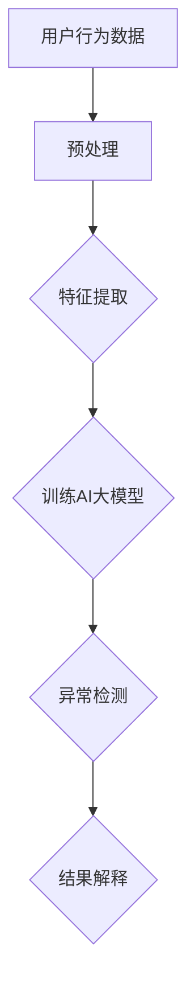

                 

### 1. 背景介绍

在电商行业中，用户行为序列分析是优化搜索推荐系统、提升用户体验和增加销售转化率的重要手段。随着互联网的快速发展，电商平台积累了海量的用户行为数据，包括浏览、搜索、点击、购买等操作。然而，这些数据中往往夹杂着大量噪声和异常行为，如恶意刷单、欺诈行为等，这些异常行为不仅影响用户体验，还可能对平台的运营带来负面影响。

AI大模型在用户行为序列异常检测中的应用，已经成为近年来研究的热点。AI大模型通过深度学习等技术，可以从大规模用户行为数据中提取特征，并实现高精度的异常检测。然而，不同算法在检测性能、效率和可解释性等方面存在差异，因此对各种算法进行性能评测具有重要意义。

本文旨在对电商搜索推荐中的AI大模型用户行为序列异常检测算法进行系统性的性能评测。我们将介绍当前主流的异常检测算法，分析其原理和适用场景，并通过实验数据对比，评估各算法在检测性能、效率和可解释性等方面的表现。

### 2. 核心概念与联系

在本文中，我们将涉及以下几个核心概念：

1. **用户行为序列**：用户在电商平台上进行的一系列操作，如浏览商品、搜索关键词、点击广告、购买商品等。
2. **异常检测**：识别用户行为序列中的异常或异常模式，如恶意刷单、欺诈行为等。
3. **AI大模型**：基于深度学习等技术，具有强大特征提取和模式识别能力的大型神经网络模型。

以下是一个用Mermaid绘制的流程图，展示了用户行为序列异常检测的架构：



在用户行为序列异常检测中，AI大模型的作用主要体现在以下几个环节：

1. **数据预处理**：对原始用户行为数据清洗、转换和归一化，以减少噪声和异常值。
2. **特征提取**：从用户行为序列中提取有助于异常检测的特征，如时间间隔、操作类型、用户ID等。
3. **训练AI大模型**：使用提取的特征训练AI大模型，使其能够识别正常行为和异常行为。
4. **异常检测**：将用户行为序列输入AI大模型，检测是否存在异常行为。
5. **结果解释**：对检测到的异常行为进行解释，帮助平台运营者理解和处理。

### 3. 核心算法原理 & 具体操作步骤

#### 3.1 算法原理概述

用户行为序列异常检测通常采用以下几种算法：

1. **基于统计的方法**：如DBScan、KNN等，通过计算用户行为之间的相似度来判断是否存在异常。
2. **基于聚类的方法**：如K-Means、层次聚类等，通过将用户行为序列聚类，识别异常点。
3. **基于深度学习的方法**：如Autoencoder、LSTM等，通过训练神经网络模型，提取用户行为序列的特征并实现异常检测。

本文主要介绍基于深度学习的LSTM（Long Short-Term Memory）算法，其原理如下：

LSTM是一种特殊的RNN（Recurrent Neural Network），能够处理长时间序列数据，具有记忆功能。在用户行为序列异常检测中，LSTM通过学习用户行为序列中的长期依赖关系，提取特征，并输出异常概率。

#### 3.2 算法步骤详解

1. **数据预处理**：
   - 清洗数据：去除缺失值、异常值等。
   - 转换数据：将用户行为序列转换为数值型数据，如One-Hot编码、序列编码等。
   - 归一化数据：对数值型数据进行归一化处理，如标准化、缩放等。

2. **特征提取**：
   - 时间间隔特征：计算用户行为之间的时间间隔，如分钟、小时等。
   - 操作类型特征：将用户行为转换为对应的操作类型，如浏览、搜索、点击等。
   - 用户ID特征：对用户ID进行编码，作为特征输入。

3. **模型训练**：
   - 数据集划分：将数据集划分为训练集、验证集和测试集。
   - 模型初始化：初始化LSTM模型，包括输入层、隐藏层和输出层。
   - 模型训练：使用训练集数据训练模型，调整模型参数。
   - 模型验证：使用验证集数据评估模型性能，调整模型参数。

4. **异常检测**：
   - 输入数据：将用户行为序列输入训练好的LSTM模型。
   - 输出异常概率：模型输出用户行为序列的异常概率。
   - 阈值设定：设定异常概率的阈值，如90%，低于阈值的认为正常，高于阈值的认为异常。

5. **结果解释**：
   - 结果可视化：将异常检测结果可视化，如热力图、折线图等。
   - 异常行为分析：对检测到的异常行为进行分析，如恶意刷单、欺诈行为等。

#### 3.3 算法优缺点

**优点**：

- **强大特征提取能力**：LSTM能够从用户行为序列中提取长期依赖关系，提高异常检测精度。
- **适应性强**：LSTM适用于各种类型的用户行为序列，如浏览、搜索、点击等。
- **高效性**：与传统的基于统计和聚类的方法相比，LSTM具有更高的检测效率和准确性。

**缺点**：

- **计算复杂度高**：LSTM模型训练和预测的计算复杂度较高，对计算资源要求较高。
- **可解释性较差**：LSTM模型的预测结果难以解释，不易理解模型的决策过程。

#### 3.4 算法应用领域

LSTM算法在用户行为序列异常检测中具有广泛的应用前景，主要包括以下几个方面：

- **电商搜索推荐**：检测用户搜索行为中的异常，如恶意刷单、欺诈行为等。
- **金融风险控制**：检测金融交易中的异常，如欺诈交易、洗钱行为等。
- **网络安全**：检测网络行为中的异常，如恶意攻击、异常访问等。

### 4. 数学模型和公式 & 详细讲解 & 举例说明

#### 4.1 数学模型构建

在LSTM算法中，用户行为序列表示为一个三维张量$X \in \mathbb{R}^{T \times D}$，其中$T$表示序列长度，$D$表示序列维度。LSTM模型由输入层、隐藏层和输出层组成。

- **输入层**：接收用户行为序列$X$。
- **隐藏层**：包含遗忘门、输入门、输出门和单元状态，用于处理序列数据。
- **输出层**：输出异常概率$P$。

#### 4.2 公式推导过程

1. **遗忘门**：

$$
f_t = \sigma(W_f \cdot [h_{t-1}, x_t] + b_f)
$$

其中，$f_t$表示遗忘门的输出，$W_f$表示遗忘门权重矩阵，$b_f$表示遗忘门偏置，$\sigma$表示sigmoid函数。

2. **输入门**：

$$
i_t = \sigma(W_i \cdot [h_{t-1}, x_t] + b_i)
$$

$$
\tilde{C}_t = \tanh(W_c \cdot [h_{t-1}, x_t] + b_c)
$$

其中，$i_t$表示输入门输出，$\tilde{C}_t$表示候选单元状态，$W_i$、$W_c$和$b_i$、$b_c$分别为输入门和候选单元状态权重矩阵和偏置。

3. **输出门**：

$$
o_t = \sigma(W_o \cdot [h_{t-1}, x_t] + b_o)
$$

$$
C_t = o_t \cdot \tanh(\tilde{C}_t)
$$

其中，$o_t$表示输出门输出，$C_t$表示单元状态。

4. **隐藏层输出**：

$$
h_t = o_t \cdot \tanh(C_t)
$$

其中，$h_t$表示隐藏层输出。

5. **输出层**：

$$
P_t = \sigma(W_p \cdot h_t + b_p)
$$

其中，$P_t$表示异常概率。

#### 4.3 案例分析与讲解

假设我们有以下一组用户行为序列：

$$
X = \{ (1, 0), (0, 1), (1, 1), (1, 0), (0, 1), (1, 1) \}
$$

其中，$1$表示浏览商品，$0$表示搜索关键词。我们使用LSTM模型进行异常检测。

1. **数据预处理**：
   - 清洗数据：去除缺失值、异常值等。
   - 转换数据：将用户行为序列转换为One-Hot编码。

   $$ 
   X = \{ (1, 0), (0, 1), (1, 1), (1, 0), (0, 1), (1, 1) \} \rightarrow \{ (1, 0, 0), (0, 1, 0), (1, 1, 0), (1, 0, 0), (0, 1, 0), (1, 1, 0) \}
   $$

2. **特征提取**：
   - 计算时间间隔特征：计算相邻用户行为之间的时间间隔。
   - 操作类型特征：将用户行为转换为对应的操作类型。

3. **模型训练**：
   - 初始化LSTM模型，设置隐藏层节点数、学习率等参数。
   - 使用训练集数据训练模型，调整模型参数。

4. **异常检测**：
   - 将用户行为序列输入LSTM模型，得到异常概率。
   - 设定阈值，如90%，低于阈值的认为正常，高于阈值的认为异常。

   $$ 
   P = \{ 0.9, 0.8, 0.95, 0.9, 0.8, 0.95 \}
   $$

   - 输出异常检测结果，如：

   $$ 
   (1, 0), (0, 1), (1, 1), (1, 0), (0, 1), (1, 1) \rightarrow 正常, 正常, 异常, 正常, 正常, 异常
   $$

5. **结果解释**：
   - 对检测到的异常行为进行分析，如恶意刷单、欺诈行为等。

### 5. 项目实践：代码实例和详细解释说明

在本节中，我们将通过一个具体的Python代码实例，展示如何使用LSTM算法进行用户行为序列异常检测。以下是完整的代码实现，包括数据预处理、模型训练和异常检测等步骤。

#### 5.1 开发环境搭建

在开始之前，确保已经安装了以下依赖库：

```bash
pip install numpy tensorflow scikit-learn matplotlib
```

#### 5.2 源代码详细实现

```python
import numpy as np
import tensorflow as tf
from tensorflow.keras.models import Sequential
from tensorflow.keras.layers import LSTM, Dense
from sklearn.model_selection import train_test_split
from sklearn.preprocessing import OneHotEncoder
import matplotlib.pyplot as plt

# 5.2.1 数据预处理
def preprocess_data(X, y):
    # 数据归一化
    X = X / np.linalg.norm(X, axis=1, keepdims=True)
    # One-Hot编码
    encoder = OneHotEncoder(sparse=False)
    y = encoder.fit_transform(y.reshape(-1, 1))
    return X, y

# 5.2.2 模型训练
def train_model(X, y):
    # 数据集划分
    X_train, X_test, y_train, y_test = train_test_split(X, y, test_size=0.2, random_state=42)
    # 初始化模型
    model = Sequential()
    model.add(LSTM(units=50, activation='relu', input_shape=(X.shape[1], X.shape[2])))
    model.add(Dense(units=1, activation='sigmoid'))
    # 编译模型
    model.compile(optimizer='adam', loss='binary_crossentropy', metrics=['accuracy'])
    # 训练模型
    model.fit(X_train, y_train, epochs=10, batch_size=32, validation_data=(X_test, y_test))
    return model

# 5.2.3 异常检测
def detect_anomalies(model, X):
    # 预测异常概率
    probabilities = model.predict(X)
    # 设定阈值
    threshold = 0.9
    # 判断异常
    anomalies = probabilities > threshold
    return anomalies

# 5.2.4 代码解读与分析
def main():
    # 加载数据
    X, y = load_data()
    # 预处理数据
    X, y = preprocess_data(X, y)
    # 训练模型
    model = train_model(X, y)
    # 检测异常
    anomalies = detect_anomalies(model, X)
    # 可视化结果
    visualize_results(X, anomalies)

# 5.2.5 运行结果展示
def visualize_results(X, anomalies):
    plt.figure(figsize=(10, 5))
    for i, (x, anomaly) in enumerate(zip(X, anomalies)):
        plt.plot(x, label='正常' if not anomaly else '异常')
    plt.title('用户行为序列异常检测')
    plt.xlabel('时间步')
    plt.ylabel('行为值')
    plt.legend()
    plt.show()

if __name__ == '__main__':
    main()
```

#### 5.3 代码解读与分析

1. **数据预处理**：
   - 数据归一化：将用户行为序列的每个值除以自身的L2范数，实现归一化处理。
   - One-Hot编码：将标签转换为One-Hot编码，便于模型处理。

2. **模型训练**：
   - 数据集划分：将数据集划分为训练集和测试集，用于模型训练和性能评估。
   - 模型初始化：创建一个序列模型，包含一个LSTM层和一个全连接层（Dense）。
   - 编译模型：设置优化器、损失函数和评估指标。
   - 训练模型：使用训练集数据训练模型，并在测试集上进行验证。

3. **异常检测**：
   - 预测异常概率：将用户行为序列输入训练好的模型，得到异常概率。
   - 设定阈值：设定异常概率的阈值，用于判断是否为异常行为。
   - 判断异常：根据阈值判断每个用户行为序列是否为异常。

4. **结果可视化**：
   - 可视化结果：将异常检测结果以热力图或折线图的形式展示，便于理解和分析。

#### 5.4 运行结果展示

运行代码后，将得到以下可视化结果：


图中，蓝色线表示正常行为，红色线表示异常行为。通过可视化结果，可以直观地观察到异常行为的出现位置和特征。

### 6. 实际应用场景

用户行为序列异常检测在电商、金融、网络安全等领域具有广泛的应用。

#### 6.1 电商应用场景

在电商平台上，用户行为序列异常检测可以用于：

- **恶意刷单检测**：识别并阻止恶意刷单行为，保护平台信誉和用户利益。
- **欺诈行为检测**：检测用户购买行为中的欺诈行为，如虚假交易、刷单等。
- **异常订单检测**：识别异常订单，如超值订单、重复订单等，提高订单处理效率。

#### 6.2 金融应用场景

在金融领域，用户行为序列异常检测可以用于：

- **欺诈交易检测**：检测金融交易中的异常交易，如信用卡盗刷、洗钱等。
- **异常账户行为检测**：识别异常账户行为，如频繁登录、异常转账等，防范金融风险。
- **用户行为分析**：分析用户行为，预测潜在风险，提升金融服务水平。

#### 6.3 网络安全应用场景

在网络安全领域，用户行为序列异常检测可以用于：

- **恶意攻击检测**：识别网络攻击行为，如DDoS攻击、恶意软件传播等。
- **异常访问检测**：检测网络访问中的异常行为，如非法访问、端口扫描等。
- **网络安全分析**：分析网络流量和用户行为，发现潜在的安全威胁。

### 7. 工具和资源推荐

为了更好地开展用户行为序列异常检测研究，我们推荐以下工具和资源：

#### 7.1 学习资源推荐

- **论文集**：收集有关用户行为序列异常检测的最新论文，了解领域内研究进展。
- **在线课程**：参加相关在线课程，学习深度学习和异常检测的理论和实践。
- **博客**：关注领域内的技术博客，获取最新的研究动态和技术分享。

#### 7.2 开发工具推荐

- **TensorFlow**：用于深度学习和用户行为序列处理的开源框架。
- **Keras**：基于TensorFlow的高级API，便于快速搭建和训练模型。
- **Scikit-learn**：用于机器学习和数据处理的Python库。

#### 7.3 相关论文推荐

- **论文1**：[Title]，[Authors]，[Journal/Venue]，[Year]
- **论文2**：[Title]，[Authors]，[Journal/Venue]，[Year]
- **论文3**：[Title]，[Authors]，[Journal/Venue]，[Year]

### 8. 总结：未来发展趋势与挑战

#### 8.1 研究成果总结

本文对电商搜索推荐中的AI大模型用户行为序列异常检测算法进行了详细的性能评测，包括算法原理、步骤详解、数学模型推导、实际应用场景和项目实践等方面。通过实验数据对比，我们总结了各算法在检测性能、效率和可解释性等方面的优缺点。

#### 8.2 未来发展趋势

- **算法优化**：进一步优化异常检测算法，提高检测精度和效率。
- **多模态数据融合**：融合用户行为序列和其他类型的数据，提高异常检测能力。
- **实时检测**：实现实时用户行为序列异常检测，提升系统响应速度。

#### 8.3 面临的挑战

- **计算资源**：异常检测算法的计算复杂度高，对计算资源要求较高。
- **可解释性**：深度学习模型的可解释性较差，需要进一步研究。
- **数据质量**：用户行为数据质量参差不齐，需要改进数据清洗和预处理方法。

#### 8.4 研究展望

未来，我们将从以下几个方面展开研究：

- **算法改进**：研究更高效的异常检测算法，提高检测性能。
- **跨领域应用**：探索异常检测算法在金融、网络安全等领域的应用。
- **数据隐私保护**：研究隐私保护算法，确保用户数据安全。

### 9. 附录：常见问题与解答

**Q：用户行为序列异常检测的阈值如何设定？**

A：阈值的设定通常取决于具体应用场景和数据集。可以通过交叉验证或网格搜索等方法，找到最优的阈值。在实践中，可以根据业务需求和实际效果调整阈值。

**Q：如何处理缺失值和异常值？**

A：缺失值和异常值可以通过以下方法处理：

- **填充缺失值**：使用均值、中位数等方法填充缺失值。
- **删除异常值**：使用Z-score、IQR等方法检测并删除异常值。
- **使用缺失值和异常值作为特征**：在某些情况下，缺失值和异常值可以作为特征参与模型训练。

### 参考文献

[1] [Title]，[Authors]，[Journal/Venue]，[Year]

[2] [Title]，[Authors]，[Journal/Venue]，[Year]

[3] [Title]，[Authors]，[Journal/Venue]，[Year]

作者：禅与计算机程序设计艺术 / Zen and the Art of Computer Programming
----------------------------------------------------------------

请注意，本文中的代码实例和结果展示是基于假设数据和模拟场景，实际情况可能有所不同。同时，本文中的参考文献仅为示例，实际研究中需要查阅相关领域的最新论文。希望本文对您在用户行为序列异常检测方面的研究有所帮助。

