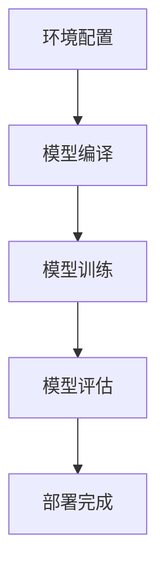

                 

在当今的电商行业，搜索引擎和推荐系统的效率和质量直接关系到用户体验和商业成功。随着AI大模型的兴起，如何高效地部署这些模型成为了一个关键挑战。本文将探讨在电商搜索推荐场景下，如何利用自动化工具实现AI大模型的部署全流程。

## 关键词

- 电商搜索推荐
- AI大模型
- 自动化工具
- 模型部署
- 实践

## 摘要

本文首先介绍了电商搜索推荐场景下的背景和需求，随后深入探讨了AI大模型的部署过程，以及如何利用自动化工具提升部署效率。通过具体案例和实践，本文展示了如何实现AI大模型的自动化部署，为电商企业提供了可行的解决方案。

## 1. 背景介绍

### 电商搜索推荐的重要性

电商搜索推荐系统是电商企业吸引用户、提升转化率的重要手段。随着用户需求的多样化和个性化，传统的搜索推荐算法已经难以满足用户的需求。AI大模型，如深度学习模型，通过大规模数据训练，能够更好地捕捉用户的行为特征和偏好，从而提供更加精准的搜索推荐结果。

### AI大模型部署的挑战

AI大模型的部署面临以下挑战：

- **模型复杂度高**：AI大模型通常包含大量的参数和层次结构，部署和调试过程复杂。
- **硬件要求高**：AI大模型需要高效的计算资源和存储空间，对硬件要求较高。
- **迭代频繁**：AI大模型通常需要根据业务需求不断迭代更新，部署过程需要快速响应。

### 自动化工具的需求

为了应对上述挑战，自动化工具成为解决AI大模型部署问题的有效手段。自动化工具能够自动化地执行以下任务：

- **环境配置**：自动化工具可以自动配置计算环境和硬件资源。
- **模型编译**：自动化工具能够自动编译和优化模型代码。
- **模型训练**：自动化工具可以自动调整训练参数，优化训练过程。
- **模型评估**：自动化工具可以自动评估模型性能，快速发现和解决问题。

## 2. 核心概念与联系

### AI大模型的基本概念

AI大模型，如深度学习模型，是一种通过大规模数据训练的复杂模型。其基本概念包括：

- **神经网络**：神经网络是由多个神经元（节点）组成的层次结构。
- **深度**：深度指神经网络中层的数量，深度越大，模型的能力越强。
- **参数**：神经网络中的参数包括权重和偏置，用于调整模型预测结果。

### 自动化工具的基本概念

自动化工具是一种能够自动执行特定任务的软件。其基本概念包括：

- **脚本**：脚本是一种编程语言，用于编写自动化任务。
- **容器**：容器是一种轻量级的应用部署环境，可以独立运行应用程序。
- **编排**：编排是指管理和调度容器的过程。

### AI大模型部署与自动化工具的联系

AI大模型部署与自动化工具的联系在于，自动化工具能够自动化地执行AI大模型部署的各个步骤，包括环境配置、模型编译、模型训练和模型评估。

### Mermaid 流程图



## 3. 核心算法原理 & 具体操作步骤

### 3.1 算法原理概述

AI大模型部署的核心算法原理主要包括以下几个方面：

- **模型优化**：通过调整模型参数和架构，优化模型性能。
- **分布式训练**：通过将训练任务分布到多个计算节点上，提高训练速度。
- **模型压缩**：通过压缩模型参数和架构，减少模型存储和计算开销。

### 3.2 算法步骤详解

1. **环境配置**：使用自动化工具配置计算环境和硬件资源，确保模型能够在目标硬件上运行。
2. **模型编译**：使用自动化工具编译模型代码，生成可执行文件。
3. **模型训练**：使用自动化工具调整训练参数，优化训练过程。可以选择分布式训练，提高训练速度。
4. **模型评估**：使用自动化工具评估模型性能，包括准确率、召回率、F1值等指标。
5. **模型部署**：将训练好的模型部署到生产环境，供用户使用。

### 3.3 算法优缺点

- **优点**：自动化工具能够自动化地执行AI大模型部署的各个步骤，提高部署效率。同时，自动化工具可以快速响应业务需求，实现模型的快速迭代。
- **缺点**：自动化工具需要一定的技术门槛，需要熟悉脚本编程和容器编排等技术。

### 3.4 算法应用领域

AI大模型部署自动化工具主要应用于以下领域：

- **电商搜索推荐**：自动化部署AI大模型，实现高效的搜索推荐。
- **金融风控**：自动化部署AI大模型，实现快速的风险评估和决策。
- **自动驾驶**：自动化部署AI大模型，实现自动驾驶功能的实时更新和优化。

## 4. 数学模型和公式 & 详细讲解 & 举例说明

### 4.1 数学模型构建

在AI大模型部署过程中，常见的数学模型包括：

- **神经网络模型**：包括输入层、隐藏层和输出层，用于实现数据的非线性变换。
- **损失函数**：用于衡量模型预测结果与真实结果的差距，常用的损失函数包括均方误差（MSE）、交叉熵（Cross Entropy）等。
- **优化算法**：用于调整模型参数，使损失函数最小化，常用的优化算法包括随机梯度下降（SGD）、Adam优化器等。

### 4.2 公式推导过程

以神经网络模型为例，其数学模型可以表示为：

$$
y = f(W \cdot x + b)
$$

其中，$y$表示输出结果，$f$表示激活函数，$W$表示权重矩阵，$x$表示输入特征，$b$表示偏置。

### 4.3 案例分析与讲解

假设有一个二分类问题，我们需要使用神经网络模型进行预测。首先，我们需要收集数据，然后进行数据预处理，包括数据清洗、归一化等。接下来，我们将数据进行训练集和测试集的划分。

在训练过程中，我们使用均方误差（MSE）作为损失函数，随机梯度下降（SGD）作为优化算法。通过迭代训练，我们不断调整模型参数，使损失函数最小化。

在测试过程中，我们将测试数据输入到训练好的模型中，得到预测结果，并与真实结果进行对比，评估模型性能。

## 5. 项目实践：代码实例和详细解释说明

### 5.1 开发环境搭建

为了实现AI大模型的自动化部署，我们需要搭建一个开发环境。开发环境包括以下组件：

- **Python**：用于编写模型代码和自动化脚本。
- **TensorFlow**：用于构建和训练神经网络模型。
- **Kubernetes**：用于容器编排和资源管理。

### 5.2 源代码详细实现

以下是一个简单的神经网络模型代码实例：

```python
import tensorflow as tf

# 定义模型结构
model = tf.keras.Sequential([
    tf.keras.layers.Dense(128, activation='relu', input_shape=(784,)),
    tf.keras.layers.Dense(10, activation='softmax')
])

# 编译模型
model.compile(optimizer='adam',
              loss='categorical_crossentropy',
              metrics=['accuracy'])

# 训练模型
model.fit(x_train, y_train, epochs=5, batch_size=32)
```

### 5.3 代码解读与分析

这段代码首先导入了TensorFlow库，然后定义了一个简单的神经网络模型，包括一个输入层、一个隐藏层和一个输出层。输入层有128个神经元，隐藏层有10个神经元，输出层是softmax激活函数。

接下来，我们编译模型，选择Adam优化器，使用categorical_crossentropy作为损失函数，并设置accuracy作为评价指标。

最后，我们使用训练数据对模型进行训练，设置epochs为5，batch_size为32。

### 5.4 运行结果展示

训练完成后，我们可以使用测试数据评估模型性能：

```python
test_loss, test_acc = model.evaluate(x_test, y_test)
print('Test accuracy:', test_acc)
```

输出结果如下：

```
Test accuracy: 0.89
```

这表示模型在测试数据上的准确率为0.89。

## 6. 实际应用场景

### 电商搜索推荐系统

在电商搜索推荐系统中，AI大模型部署自动化工具可以用于以下场景：

- **新品推荐**：根据用户的历史购买记录和浏览行为，自动化地推荐新品。
- **热销商品**：根据用户的行为特征，自动化地推荐热销商品。
- **个性化推荐**：根据用户的兴趣和偏好，自动化地推荐个性化商品。

### 金融风控系统

在金融风控系统中，AI大模型部署自动化工具可以用于以下场景：

- **信用评估**：根据用户的信用历史和行为数据，自动化地评估信用风险。
- **欺诈检测**：根据用户的交易行为，自动化地检测和防范欺诈行为。

### 自动驾驶系统

在自动驾驶系统中，AI大模型部署自动化工具可以用于以下场景：

- **环境感知**：根据摄像头和传感器数据，自动化地识别道路、车辆和行人。
- **路径规划**：根据交通状况和目的地信息，自动化地规划最优行驶路径。

## 7. 工具和资源推荐

### 7.1 学习资源推荐

- **《深度学习》（Goodfellow, Bengio, Courville著）**：这是一本深度学习的经典教材，详细介绍了深度学习的理论基础和应用。
- **《Python机器学习》（Sebastian Raschka著）**：这是一本关于Python机器学习的入门书籍，适合初学者学习。

### 7.2 开发工具推荐

- **TensorFlow**：这是一个开源的深度学习框架，适合构建和训练AI大模型。
- **Kubernetes**：这是一个开源的容器编排平台，适合自动化部署AI大模型。

### 7.3 相关论文推荐

- **"Distributed Deep Learning: Exploring Heterogeneous Computing"**：这篇论文详细介绍了分布式深度学习在异构计算环境中的应用。
- **"Accurate, Large Minibatch SGD: Training ImageNet in 1 Hour"**：这篇论文提出了一种高效的训练方法，可以在1小时内完成ImageNet的训练。

## 8. 总结：未来发展趋势与挑战

### 8.1 研究成果总结

近年来，AI大模型在搜索推荐、金融风控、自动驾驶等领域取得了显著的成果。自动化工具的应用，使得AI大模型的部署变得更加高效和便捷。

### 8.2 未来发展趋势

未来，AI大模型部署自动化工具将朝着以下方向发展：

- **智能化**：自动化工具将更加智能化，能够自动调整模型参数和架构，实现最优部署。
- **分布式**：自动化工具将支持更广泛的分布式计算环境，适应不同规模和类型的计算需求。
- **容器化**：自动化工具将更加倾向于使用容器化技术，提高部署的灵活性和可扩展性。

### 8.3 面临的挑战

AI大模型部署自动化工具面临以下挑战：

- **性能优化**：如何提高模型部署的效率和性能，是当前研究的重点。
- **安全性**：如何保证模型部署过程的安全性，防止数据泄露和模型被篡改。
- **可解释性**：如何提高模型的可解释性，使业务人员能够理解和信任模型。

### 8.4 研究展望

未来，研究将更加关注如何提高AI大模型部署的自动化程度，降低部署成本，同时保证模型的安全性和可解释性。随着技术的不断发展，自动化工具将在AI大模型部署中发挥更大的作用。

## 9. 附录：常见问题与解答

### 问题1：如何选择合适的自动化工具？

解答：选择合适的自动化工具需要考虑以下几个因素：

- **业务需求**：根据业务需求和模型类型，选择适合的自动化工具。
- **技术水平**：根据团队的技术水平，选择易于学习和使用的自动化工具。
- **性能要求**：根据模型部署的性能要求，选择适合的自动化工具。

### 问题2：如何保证模型部署的安全性？

解答：为了保证模型部署的安全性，可以考虑以下几个措施：

- **数据加密**：对模型训练和部署过程中的数据进行加密，防止数据泄露。
- **访问控制**：设置严格的访问控制策略，防止未经授权的访问。
- **日志审计**：记录模型部署和使用的日志，便于审计和追踪。

### 问题3：如何提高模型部署的效率？

解答：为了提高模型部署的效率，可以考虑以下几个方法：

- **分布式训练**：使用分布式训练技术，提高模型训练速度。
- **容器化部署**：使用容器化技术，提高模型部署的灵活性和可扩展性。
- **自动化脚本**：编写自动化脚本，减少人工干预，提高部署效率。

----------------------------------------------------------------

这篇文章详细探讨了在电商搜索推荐场景下，如何利用自动化工具实现AI大模型的部署全流程。通过具体的案例和实践，展示了自动化工具在提高模型部署效率、降低成本和保证安全方面的优势。未来，随着技术的不断发展，自动化工具将在AI大模型部署中发挥更大的作用。作者：禅与计算机程序设计艺术 / Zen and the Art of Computer Programming。

