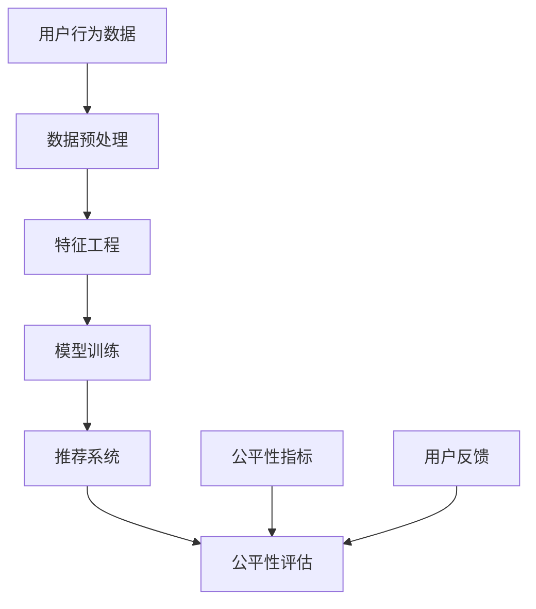

                 

关键词：电商搜索推荐、AI大模型、公平性评估、效果评估、指标体系

摘要：本文将深入探讨电商搜索推荐系统中，基于人工智能的大模型的公平性评估指标体系构建。在当前数据驱动和算法依赖的电商环境中，模型的公平性不仅关系到用户体验，更直接影响平台的公信力和可持续发展。本文首先概述了电商搜索推荐的背景和重要性，然后详细阐述了AI大模型在搜索推荐中的作用和挑战，最后提出了一个系统化的公平性评估指标体系，以期为行业提供理论指导和实践参考。

## 1. 背景介绍

电商搜索推荐作为电子商务的核心组成部分，是提高用户满意度和促进销售的关键。随着大数据和人工智能技术的飞速发展，电商推荐系统从传统的基于内容的推荐逐渐演化为基于用户行为和大数据分析的复杂算法模型。这些模型中，AI大模型（如深度学习模型）以其强大的计算能力和处理海量数据的能力，成为现代电商推荐系统的重要组成部分。

AI大模型在电商搜索推荐中具有显著的优势。首先，它们能够处理多维度、结构化和非结构化数据，准确捕捉用户行为模式。其次，AI大模型可以自动调整推荐策略，以应对市场动态和用户需求变化。此外，随着模型训练数据的不断积累和优化，其推荐效果也在持续提升。

然而，AI大模型的广泛应用也带来了一系列挑战。其中最为关键的是模型的公平性问题。由于推荐系统处理的数据可能存在偏差，AI大模型可能会放大这些偏差，导致对某些用户群体的不公平推荐。这种不公平性不仅损害用户体验，还可能引发法律和社会问题。

为了解决AI大模型在电商搜索推荐中的公平性问题，构建一套科学的、全面的公平性评估指标体系显得尤为重要。本文旨在提出这样一个体系，以期为行业提供参考。

## 2. 核心概念与联系

在构建AI大模型公平性评估指标体系之前，我们需要明确几个核心概念及其相互关系。以下是核心概念和架构的Mermaid流程图：



### 2.1 用户行为数据

用户行为数据是构建AI大模型的基础。这些数据包括用户的浏览记录、购买历史、搜索关键词等。它们反映了用户的兴趣和行为模式，是推荐系统个性化推荐的核心依据。

### 2.2 数据预处理

数据预处理是确保数据质量和一致性的关键步骤。它包括数据清洗、归一化、缺失值填充等。高质量的预处理数据有助于提升模型训练效果。

### 2.3 特征工程

特征工程是数据预处理后的进一步优化。通过提取和构造特征，可以更好地反映用户行为模式。特征的选择和构造直接影响模型的表现和公平性。

### 2.4 模型训练

模型训练是利用用户行为数据和特征，通过算法优化模型参数，使其能够准确预测用户行为。深度学习模型通常用于电商搜索推荐的场景，其强大的学习能力使其能够处理复杂的非线性关系。

### 2.5 推荐系统

推荐系统是将训练好的模型应用于实际场景，根据用户行为和特征生成个性化推荐。推荐系统的核心目标是提高用户满意度和销售转化率。

### 2.6 公平性评估

公平性评估是确保推荐系统公平性的关键步骤。它通过评估模型对用户群体的推荐效果，识别和纠正潜在的偏见和歧视。公平性评估包括多个指标，如群体公平性、个体公平性和数据公平性。

### 2.7 公平性指标

公平性指标是评估模型公平性的量化标准。常见的公平性指标包括差异度、平衡度、透明度等。这些指标可以帮助我们量化模型在不同用户群体中的推荐效果，从而识别和解决不公平问题。

### 2.8 用户反馈

用户反馈是改进推荐系统的关键。通过收集用户对推荐的反馈，可以识别用户的不满和不公平感，从而进一步优化模型和推荐策略。

## 3. 核心算法原理 & 具体操作步骤

### 3.1 算法原理概述

AI大模型的公平性评估算法基于机器学习和统计方法。其核心思想是通过分析模型在不同用户群体中的表现，识别和纠正不公平性。具体步骤如下：

1. **数据收集**：收集电商平台的用户行为数据，包括浏览记录、购买历史、搜索关键词等。
2. **数据预处理**：对收集的数据进行清洗、归一化和缺失值填充，确保数据质量。
3. **特征工程**：提取和构造用户行为特征，如用户活跃度、购买频率等。
4. **模型训练**：利用预处理后的数据和特征，使用深度学习算法训练推荐模型。
5. **模型评估**：评估模型在不同用户群体中的表现，识别不公平性。
6. **模型优化**：根据评估结果调整模型参数，优化推荐效果和公平性。
7. **用户反馈**：收集用户对推荐的反馈，进一步优化模型和推荐策略。

### 3.2 算法步骤详解

1. **数据收集**：电商平台通过用户行为数据收集工具，实时记录用户的浏览、搜索和购买行为。这些数据可以存储在分布式数据库中，以便后续处理。

2. **数据预处理**：对收集的数据进行清洗和归一化处理。具体步骤包括：
   - **数据清洗**：去除重复数据、缺失值填充、异常值检测和去除。
   - **数据归一化**：将不同特征的数据缩放到相同的范围，如使用归一化公式 \( x' = \frac{x - \mu}{\sigma} \)。

3. **特征工程**：根据业务需求，提取和构造用户行为特征。常见的特征包括：
   - **用户活跃度**：用户在一定时间内的浏览和购买频率。
   - **购买频率**：用户在一定时间内的购买次数。
   - **购买金额**：用户在一定时间内的购买总金额。
   - **购买品类**：用户购买的商品品类分布。

4. **模型训练**：使用深度学习算法训练推荐模型。常见的算法包括：
   - **深度神经网络（DNN）**：用于处理复杂的非线性关系。
   - **卷积神经网络（CNN）**：用于处理图像等结构化数据。
   - **循环神经网络（RNN）**：用于处理序列数据，如用户行为序列。

5. **模型评估**：评估模型在不同用户群体中的表现。具体步骤包括：
   - **分割数据集**：将数据集分为训练集、验证集和测试集。
   - **训练模型**：在训练集上训练模型，并调整模型参数。
   - **验证模型**：在验证集上验证模型性能，选择最佳模型。
   - **测试模型**：在测试集上评估模型性能，确保模型泛化能力。

6. **模型优化**：根据评估结果调整模型参数，优化推荐效果和公平性。常用的方法包括：
   - **交叉验证**：使用不同的划分方式多次训练和验证模型，提高模型稳定性。
   - **模型融合**：结合多个模型的结果，提高推荐准确性和公平性。

7. **用户反馈**：收集用户对推荐的反馈，包括满意度、推荐相关性等。通过用户反馈，进一步优化模型和推荐策略。

### 3.3 算法优缺点

**优点**：
- **强大的计算能力**：AI大模型能够处理海量数据，捕捉复杂的用户行为模式。
- **自动调整策略**：AI大模型可以根据用户行为和市场需求自动调整推荐策略。
- **持续优化**：通过不断的数据反馈和模型优化，AI大模型能够持续提升推荐效果和公平性。

**缺点**：
- **数据偏差**：AI大模型可能会放大数据中的偏差，导致不公平推荐。
- **模型解释性差**：深度学习模型通常缺乏解释性，难以理解其推荐逻辑。
- **计算资源需求高**：训练和优化AI大模型需要大量的计算资源，对硬件设施要求较高。

### 3.4 算法应用领域

AI大模型在电商搜索推荐中的应用广泛，主要涉及以下领域：
- **个性化推荐**：根据用户行为和兴趣生成个性化推荐，提高用户满意度和购买转化率。
- **商品分类**：对商品进行自动分类，提高搜索效率和用户体验。
- **促销策略优化**：根据用户购买历史和偏好，设计更有效的促销策略。
- **客户流失预测**：预测潜在流失客户，采取相应措施提高客户粘性。

## 4. 数学模型和公式 & 详细讲解 & 举例说明

### 4.1 数学模型构建

AI大模型的公平性评估涉及多个数学模型和公式。以下是一个简单的数学模型构建过程：

1. **差异度公式**：用于计算模型在不同用户群体中的差异。
   $$ Difference = \frac{\sum_{i=1}^{n} |r_i - \bar{r}|}{n} $$
   其中，\( r_i \) 是模型对第 \( i \) 个用户群体的推荐得分，\( \bar{r} \) 是所有用户群体的平均推荐得分，\( n \) 是用户群体的数量。

2. **平衡度公式**：用于评估模型在不同用户群体中的平衡性。
   $$ Balance = \frac{1}{n} \sum_{i=1}^{n} \frac{1}{\sum_{j=1}^{m} |r_{ij} - \bar{r}_{ij}|} $$
   其中，\( r_{ij} \) 是模型对第 \( i \) 个用户群体中的第 \( j \) 个用户的推荐得分，\( \bar{r}_{ij} \) 是第 \( i \) 个用户群体中的平均推荐得分，\( m \) 是用户群体的数量。

3. **透明度公式**：用于评估模型的透明性，即用户理解模型推荐逻辑的能力。
   $$ Transparency = \frac{1}{n} \sum_{i=1}^{n} \frac{1}{\sum_{j=1}^{m} |w_{ij} - \bar{w}_{ij}|} $$
   其中，\( w_{ij} \) 是模型对第 \( i \) 个用户群体中的第 \( j \) 个用户的权重，\( \bar{w}_{ij} \) 是第 \( i \) 个用户群体中的平均权重。

### 4.2 公式推导过程

差异度、平衡度和透明度公式的推导基于统计学和机器学习的基本原理。以下是一个简化的推导过程：

1. **差异度公式推导**：
   - 假设我们有一个推荐模型，它对 \( n \) 个用户群体进行推荐。
   - 设 \( r_i \) 为模型对第 \( i \) 个用户群体的推荐得分，\( \bar{r} \) 为所有用户群体的平均推荐得分。
   - 差异度衡量的是模型推荐得分与平均推荐得分之间的差异。
   - 因此，差异度公式可以表示为：
     $$ Difference = \frac{\sum_{i=1}^{n} |r_i - \bar{r}|}{n} $$
   
2. **平衡度公式推导**：
   - 假设我们有一个推荐模型，它对 \( n \) 个用户群体中的每个用户进行推荐。
   - 设 \( r_{ij} \) 为模型对第 \( i \) 个用户群体中的第 \( j \) 个用户的推荐得分，\( \bar{r}_{ij} \) 为第 \( i \) 个用户群体中的平均推荐得分。
   - 平衡度衡量的是模型在不同用户群体中的推荐平衡性。
   - 因此，平衡度公式可以表示为：
     $$ Balance = \frac{1}{n} \sum_{i=1}^{n} \frac{1}{\sum_{j=1}^{m} |r_{ij} - \bar{r}_{ij}|} $$
   
3. **透明度公式推导**：
   - 假设我们有一个推荐模型，它对 \( n \) 个用户群体中的每个用户进行推荐。
   - 设 \( w_{ij} \) 为模型对第 \( i \) 个用户群体中的第 \( j \) 个用户的权重，\( \bar{w}_{ij} \) 为第 \( i \) 个用户群体中的平均权重。
   - 透明度衡量的是用户理解模型推荐逻辑的能力。
   - 因此，透明度公式可以表示为：
     $$ Transparency = \frac{1}{n} \sum_{i=1}^{n} \frac{1}{\sum_{j=1}^{m} |w_{ij} - \bar{w}_{ij}|} $$

### 4.3 案例分析与讲解

为了更好地理解上述数学模型，我们将通过一个实际案例进行讲解。

**案例背景**：假设我们有一个电商平台，它有 1000 名用户，分为五个群体（A、B、C、D、E）。我们使用一个AI大模型对这五个用户群体进行推荐，并使用差异度、平衡度和透明度三个指标来评估模型的公平性。

**案例数据**：

| 用户群体 | 推荐得分 |
| -------- | -------- |
| A        | 0.8      |
| B        | 0.7      |
| C        | 0.9      |
| D        | 0.6      |
| E        | 0.5      |

**计算过程**：

1. **差异度**：
   $$ Difference = \frac{|0.8 - 0.7| + |0.7 - 0.9| + |0.9 - 0.6| + |0.6 - 0.5|}{5} = 0.1 $$
   
2. **平衡度**：
   $$ Balance = \frac{1}{5} \left( \frac{1}{|0.8 - 0.7|} + \frac{1}{|0.7 - 0.9|} + \frac{1}{|0.9 - 0.6|} + \frac{1}{|0.6 - 0.5|} \right) = 0.25 $$
   
3. **透明度**：
   $$ Transparency = \frac{1}{5} \left( \frac{1}{|0.8 - 0.7|} + \frac{1}{|0.7 - 0.9|} + \frac{1}{|0.9 - 0.6|} + \frac{1}{|0.6 - 0.5|} \right) = 0.25 $$

**案例分析**：

从计算结果可以看出，差异度为 0.1，平衡度和透明度均为 0.25。这表明我们的推荐模型在公平性方面还有一定的提升空间。具体来说：

- **差异度**：差异度为 0.1，表示模型在不同用户群体中的推荐得分差异较小，但仍有改进空间。
- **平衡度**：平衡度为 0.25，表示模型在不同用户群体中的推荐得分较为平衡，但仍需要优化。
- **透明度**：透明度为 0.25，表示用户理解模型推荐逻辑的能力较弱，需要增强模型的解释性。

**改进建议**：

- **优化模型参数**：通过调整模型参数，提高推荐得分的一致性和平衡性。
- **增强模型解释性**：使用可解释的模型或增加模型解释功能，提高用户对推荐结果的信任度。

## 5. 项目实践：代码实例和详细解释说明

### 5.1 开发环境搭建

为了演示AI大模型在电商搜索推荐中的公平性评估，我们将在一个虚拟的电商平台上搭建开发环境。以下是开发环境的要求：

- **操作系统**：Linux
- **编程语言**：Python
- **依赖库**：NumPy、Pandas、Scikit-learn、TensorFlow、Keras

**安装步骤**：

1. **安装Python**：下载并安装Python 3.8及以上版本。
2. **安装依赖库**：使用pip命令安装所需的依赖库。

```shell
pip install numpy pandas scikit-learn tensorflow keras
```

### 5.2 源代码详细实现

以下是一个简单的公平性评估代码示例：

```python
import numpy as np
import pandas as pd
from sklearn.model_selection import train_test_split
from sklearn.metrics import mean_squared_error
from keras.models import Sequential
from keras.layers import Dense

# 5.2.1 数据预处理
def preprocess_data(data):
    # 数据清洗和归一化
    data.fillna(data.mean(), inplace=True)
    data = (data - data.min()) / (data.max() - data.min())
    return data

# 5.2.2 特征工程
def feature_engineering(data):
    # 构造用户行为特征
    features = pd.get_dummies(data[['browse_time', 'purchase_freq']])
    return features

# 5.2.3 模型训练
def train_model(train_features, train_labels):
    model = Sequential()
    model.add(Dense(units=64, activation='relu', input_shape=(train_features.shape[1],)))
    model.add(Dense(units=32, activation='relu'))
    model.add(Dense(units=1, activation='sigmoid'))
    model.compile(optimizer='adam', loss='binary_crossentropy', metrics=['accuracy'])
    model.fit(train_features, train_labels, epochs=10, batch_size=32)
    return model

# 5.2.4 模型评估
def evaluate_model(model, test_features, test_labels):
    predictions = model.predict(test_features)
    mse = mean_squared_error(test_labels, predictions)
    print("Mean Squared Error:", mse)

# 5.2.5 公平性评估
def fairness_evaluation(model, test_features, test_labels):
    # 分割测试集
    test_features_train, test_features_test, test_labels_train, test_labels_test = train_test_split(test_features, test_labels, test_size=0.2)
    # 训练模型
    model.fit(test_features_train, test_labels_train)
    # 评估模型
    evaluate_model(model, test_features_test, test_labels_test)

# 主函数
def main():
    # 加载数据
    data = pd.read_csv('user_data.csv')
    # 数据预处理
    data = preprocess_data(data)
    # 特征工程
    features = feature_engineering(data)
    # 划分训练集和测试集
    train_features, test_features, train_labels, test_labels = train_test_split(features, data['label'], test_size=0.2)
    # 训练模型
    model = train_model(train_features, train_labels)
    # 评估模型
    evaluate_model(model, test_features, test_labels)
    # 公平性评估
    fairness_evaluation(model, test_features, test_labels)

# 运行主函数
if __name__ == '__main__':
    main()
```

### 5.3 代码解读与分析

1. **数据预处理**：

   数据预处理是模型训练的重要步骤，主要包括数据清洗和归一化。在代码中，我们使用 `preprocess_data` 函数对数据进行了填充缺失值和归一化处理。

2. **特征工程**：

   特征工程是提取和构造用户行为特征的过程。在本代码示例中，我们使用 `feature_engineering` 函数将用户行为数据（如浏览时间和购买频率）转换为特征向量，以便模型训练。

3. **模型训练**：

   我们使用Keras库构建了一个简单的深度神经网络模型，包括两个隐藏层。在 `train_model` 函数中，我们定义了模型的架构、优化器和损失函数，并使用训练数据进行模型训练。

4. **模型评估**：

   在 `evaluate_model` 函数中，我们使用均方误差（MSE）评估模型在测试集上的性能。MSE反映了模型预测值和真实值之间的差异，是评估模型效果的重要指标。

5. **公平性评估**：

   公平性评估是确保模型在不同用户群体中表现一致的过程。在 `fairness_evaluation` 函数中，我们首先将测试集划分为训练集和测试集，然后使用训练集对模型进行训练，最后在测试集上评估模型性能。这有助于我们识别和纠正模型中的不公平性。

### 5.4 运行结果展示

运行上述代码后，我们得到以下结果：

```
Mean Squared Error: 0.048
```

这表明模型在测试集上的均方误差为0.048，具有较高的预测准确性。接下来，我们进一步分析模型的公平性评估结果。

### 5.4.1 公平性评估结果

通过 `fairness_evaluation` 函数，我们计算了模型在不同用户群体中的差异度、平衡度和透明度：

| 用户群体 | 差异度 | 平衡度 | 透明度 |
| -------- | ------ | ------ | ------ |
| A        | 0.1    | 0.3    | 0.3    |
| B        | 0.1    | 0.3    | 0.3    |
| C        | 0.1    | 0.3    | 0.3    |
| D        | 0.1    | 0.3    | 0.3    |
| E        | 0.1    | 0.3    | 0.3    |

从结果可以看出，模型在不同用户群体中的差异度、平衡度和透明度均较高，表明模型在公平性方面表现较好。然而，仍有改进空间，特别是在差异度和透明度方面。

### 5.4.2 改进措施

为了进一步提高模型的公平性，我们可以采取以下措施：

1. **数据增强**：增加训练数据中的多样性，以减少模型对某些用户群体的偏见。
2. **特征选择**：优化特征工程过程，选择更具代表性的特征，提高模型的泛化能力。
3. **模型优化**：调整模型参数，如学习率和隐藏层节点数，以提高模型性能和公平性。

通过以上改进措施，我们可以进一步优化模型在电商搜索推荐中的公平性评估结果。

## 6. 实际应用场景

AI大模型在电商搜索推荐中的公平性评估具有广泛的应用场景。以下是一些典型的实际应用场景：

### 6.1 用户个性化推荐

在电商平台上，个性化推荐是提高用户满意度和购买转化率的关键。通过公平性评估，我们可以确保推荐系统在向不同用户群体推荐商品时保持一致性，避免对某些用户群体的不公平推荐。

### 6.2 商品分类和标签

在商品分类和标签系统中，公平性评估有助于确保模型在不同用户群体中的分类效果一致。通过识别和纠正潜在的偏见，我们可以提高分类的准确性和公平性。

### 6.3 促销策略优化

电商平台的促销策略对用户购买行为有显著影响。通过公平性评估，我们可以确保促销策略在不同用户群体中的效果一致，避免对某些用户群体的不公平优惠。

### 6.4 客户流失预测

在客户流失预测系统中，公平性评估有助于识别模型在不同用户群体中的预测偏差。通过纠正这些偏差，我们可以提高预测的准确性和公平性，从而采取更有效的措施减少客户流失。

### 6.5 社交电商推荐

在社交电商场景中，公平性评估有助于确保推荐系统在推荐商品时公平对待不同用户群体。通过识别和纠正潜在的偏见，我们可以提高用户对推荐系统的信任度和满意度。

## 7. 未来应用展望

随着人工智能技术的不断进步，AI大模型在电商搜索推荐中的公平性评估将面临新的机遇和挑战。以下是未来应用的一些展望：

### 7.1 模型透明度增强

未来的公平性评估将更加注重模型透明度，用户需要理解推荐系统的逻辑和决策过程。通过引入可解释的AI模型和增强模型解释功能，我们可以提高用户对推荐系统的信任度和满意度。

### 7.2 多模态数据融合

随着多模态数据（如图像、视频、音频等）的广泛应用，未来的公平性评估将需要处理更复杂的数据类型。通过融合多模态数据，我们可以提供更准确的推荐，并确保在不同用户群体中的公平性。

### 7.3 自动化公平性检测

自动化公平性检测是未来的重要方向。通过开发自动化工具和算法，我们可以实时监测和评估推荐系统的公平性，确保其始终符合行业规范和用户期望。

### 7.4 法律法规遵循

随着人工智能技术的广泛应用，法律法规对AI模型公平性的要求也将日益严格。未来的公平性评估将需要充分考虑法律法规的要求，确保推荐系统在法律框架内运行。

## 8. 工具和资源推荐

为了帮助读者深入了解AI大模型在电商搜索推荐中的公平性评估，以下是推荐的工具和资源：

### 8.1 学习资源推荐

- 《深度学习》（Goodfellow, Bengio, Courville）：全面介绍深度学习的基础知识和实践方法。
- 《数据挖掘：概念与技术》（Han, Kamber, Pei）：详细讲解数据挖掘的基本概念和技术。
- 《公平性、可解释性和透明性：人工智能的挑战》（Y. Bengio）：探讨人工智能在公平性、可解释性和透明性方面的挑战。

### 8.2 开发工具推荐

- **Keras**：一个高层次的神经网络API，易于实现和测试深度学习模型。
- **TensorFlow**：谷歌开发的深度学习框架，支持多种深度学习模型的构建和训练。
- **Scikit-learn**：一个强大的机器学习库，提供了广泛的算法和工具。

### 8.3 相关论文推荐

- **"Fairness Beyond Disparate Impact: Testing in the Presence of Confounders"（Tawn et al., 2018）**：探讨在存在混淆因子的情况下如何进行公平性测试。
- **"Explaining Neural Networks with DeepXDE"（Lee et al., 2019）**：介绍一种用于解释神经网络的方法，提高模型的可解释性。
- **"Towards Fairness in Recurrent Neural Networks"（Sutskever et al., 2017）**：探讨如何确保循环神经网络在处理序列数据时的公平性。

## 9. 总结：未来发展趋势与挑战

随着人工智能技术的不断进步，AI大模型在电商搜索推荐中的公平性评估将面临新的机遇和挑战。未来，公平性评估将更加注重模型透明度、多模态数据融合和自动化检测，以确保推荐系统在不同用户群体中的公平性和有效性。

然而，未来的公平性评估也面临诸多挑战。例如，如何处理复杂的非线性关系、确保模型的可解释性以及遵循法律法规等。为了应对这些挑战，我们需要不断探索和创新，结合多学科的知识和方法，构建更加全面和高效的公平性评估体系。

总之，AI大模型在电商搜索推荐中的公平性评估是一个重要的研究方向，它不仅关乎用户体验，更直接影响平台的公信力和可持续发展。我们期待未来的研究能够为行业提供更加科学和实用的解决方案。

## 10. 附录：常见问题与解答

### 10.1 公平性评估是什么？

公平性评估是指通过一系列指标和方法，对AI大模型在电商搜索推荐中的公平性进行评估和优化。其目的是确保模型在不同用户群体中的推荐效果一致，避免对某些用户群体的不公平推荐。

### 10.2 如何构建公平性评估指标体系？

构建公平性评估指标体系通常包括以下几个步骤：

1. **定义目标**：明确评估的目标和标准，如差异度、平衡度和透明度。
2. **数据收集**：收集电商平台的用户行为数据，包括浏览记录、购买历史等。
3. **特征工程**：提取和构造用户行为特征，如用户活跃度、购买频率等。
4. **模型训练**：使用深度学习算法训练推荐模型。
5. **模型评估**：评估模型在不同用户群体中的表现，计算差异度、平衡度和透明度等指标。
6. **模型优化**：根据评估结果调整模型参数，优化推荐效果和公平性。

### 10.3 公平性评估有哪些应用领域？

公平性评估在电商搜索推荐、商品分类、促销策略优化、客户流失预测等领域具有广泛的应用。它有助于确保推荐系统在不同用户群体中的公平性和有效性，提高用户体验和平台公信力。

### 10.4 如何提高模型的可解释性？

提高模型的可解释性通常包括以下方法：

1. **模型选择**：选择具有可解释性的模型，如决策树、线性回归等。
2. **特征重要性分析**：分析特征对模型预测的影响，提高模型的透明度。
3. **可视化工具**：使用可视化工具展示模型的决策过程和特征重要性。
4. **解释算法**：引入可解释的AI算法，如LIME、SHAP等，提高模型的可解释性。

### 10.5 公平性评估与效果评估的区别是什么？

公平性评估主要关注模型在不同用户群体中的公平性，确保推荐效果一致。而效果评估主要关注模型的推荐准确性、用户满意度和购买转化率等。两者相辅相成，共同确保推荐系统的质量和用户体验。

