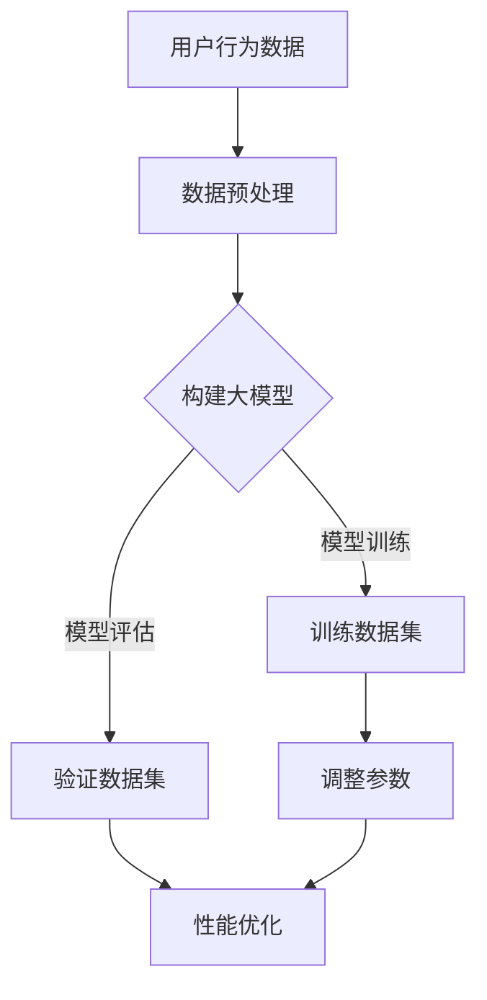

                 

关键词：电商搜索推荐、AI大模型、分流实验、效果评估、性能优化

摘要：本文将探讨电商搜索推荐系统中，如何利用AI大模型进行分流实验设计，以提升推荐系统的效果评估和性能优化。通过深入分析核心概念与联系，阐述算法原理、数学模型及实际应用，最终为电商推荐系统提供切实可行的改进方案。

## 1. 背景介绍

随着互联网的迅猛发展，电子商务市场日益繁荣。为了满足用户个性化的购物需求，电商企业纷纷引入了智能搜索推荐系统。这类系统能够根据用户的历史行为、兴趣爱好和购物偏好，为用户提供个性化的商品推荐，从而提高用户满意度、转化率和销售额。然而，如何评估推荐系统的效果，并实现性能优化，成为当前研究的热点问题。

AI大模型的崛起为解决上述问题提供了新的思路。通过深度学习和大数据技术，AI大模型能够挖掘海量数据中的潜在规律，为推荐系统提供强大的支持。然而，如何有效地利用AI大模型进行分流实验设计，以提升效果评估和性能优化，仍需进一步研究。

本文旨在探讨电商搜索推荐系统中，如何利用AI大模型进行分流实验设计。通过分析核心概念与联系，阐述算法原理、数学模型及实际应用，最终为电商推荐系统提供切实可行的改进方案。

## 2. 核心概念与联系

在电商搜索推荐系统中，AI大模型分流实验设计主要涉及以下核心概念：

1. **用户行为数据**：包括用户的浏览记录、搜索历史、购买记录等。这些数据是构建AI大模型的基础，可用于挖掘用户的兴趣爱好和购物偏好。

2. **推荐算法**：基于用户行为数据和商品属性，通过算法计算出每个用户可能感兴趣的商品列表。常见的推荐算法包括基于协同过滤、基于内容的推荐、基于模型的推荐等。

3. **分流实验**：在推荐系统中，通过将用户流量分配到不同的实验组，以比较不同推荐算法或参数设置的效果。分流实验有助于评估推荐系统的性能，并指导优化策略。

4. **效果评估指标**：用于衡量推荐系统性能的指标，如准确率、召回率、覆盖率、点击率等。这些指标可帮助评估推荐系统的效果，并为优化提供依据。

5. **性能优化**：通过调整推荐算法参数、改进模型结构、优化数据预处理等手段，提升推荐系统的性能。

### Mermaid 流程图



## 3. 核心算法原理 & 具体操作步骤

### 3.1 算法原理概述

电商搜索推荐系统中的AI大模型主要基于深度学习和大数据技术。其核心原理是通过学习用户行为数据和商品属性，构建一个能够预测用户兴趣的深度神经网络模型。

具体来说，算法分为以下几个步骤：

1. 数据预处理：对用户行为数据进行清洗、去噪、归一化等处理，以提升模型训练效果。

2. 特征工程：从用户行为数据和商品属性中提取关键特征，如用户购买频率、商品品类、用户历史浏览记录等。

3. 模型构建：利用深度学习框架（如TensorFlow、PyTorch等）构建神经网络模型，对用户兴趣进行建模。

4. 模型训练：使用预处理后的数据对神经网络模型进行训练，调整模型参数，使模型能够准确预测用户兴趣。

5. 模型评估：使用验证数据集评估模型性能，根据评估结果调整模型参数。

6. 分流实验：将用户流量分配到不同实验组，比较不同模型或参数设置的效果。

7. 性能优化：根据分流实验结果，调整模型参数、改进模型结构、优化数据预处理等，以提升推荐系统性能。

### 3.2 算法步骤详解

1. **数据预处理**

数据预处理是构建AI大模型的基础。主要任务包括：

- 数据清洗：去除异常值、缺失值和重复值。
- 数据去噪：降低噪声对模型训练的影响。
- 数据归一化：将数据缩放到同一尺度，避免数据量级差异对模型训练的影响。

2. **特征工程**

特征工程是构建AI大模型的关键。主要任务包括：

- 提取用户行为特征：如用户购买频率、浏览时长、搜索关键词等。
- 提取商品属性特征：如商品品类、品牌、价格等。
- 构建用户-商品交互矩阵：将用户行为数据和商品属性进行整合，形成用户-商品交互矩阵。

3. **模型构建**

利用深度学习框架构建神经网络模型，对用户兴趣进行建模。常见模型结构包括：

- 卷积神经网络（CNN）：适用于处理图像数据。
- 循环神经网络（RNN）：适用于处理序列数据。
- Transformer模型：适用于处理大规模序列数据。

4. **模型训练**

使用预处理后的数据对神经网络模型进行训练，调整模型参数，使模型能够准确预测用户兴趣。训练过程包括：

- 初始化模型参数。
- 前向传播：计算模型输出。
- 后向传播：计算损失函数。
- 更新模型参数。

5. **模型评估**

使用验证数据集评估模型性能，根据评估结果调整模型参数。常见评估指标包括：

- 准确率（Accuracy）：预测正确的样本占总样本的比例。
- 召回率（Recall）：预测正确的正样本占总正样本的比例。
- 覆盖率（Coverage）：推荐结果中不同商品的比例。
- 点击率（Click-Through Rate，CTR）：用户点击推荐结果的概率。

6. **分流实验**

将用户流量分配到不同实验组，比较不同模型或参数设置的效果。分流实验包括：

- 实验组A：使用原始模型进行推荐。
- 实验组B：调整模型参数进行推荐。
- 实验组C：使用其他模型进行推荐。

根据分流实验结果，评估不同模型或参数设置的效果，选择最优方案。

7. **性能优化**

根据分流实验结果，调整模型参数、改进模型结构、优化数据预处理等，以提升推荐系统性能。性能优化包括：

- 调整学习率、批量大小等超参数。
- 优化模型结构，如增加或减少隐藏层节点。
- 优化数据预处理，如调整特征提取方法。

### 3.3 算法优缺点

**优点：**

1. 利用深度学习和大数据技术，能够挖掘海量数据中的潜在规律。
2. 能够实现个性化推荐，提高用户满意度、转化率和销售额。
3. 能够通过分流实验优化模型参数，提升推荐系统性能。

**缺点：**

1. 需要大量训练数据和计算资源，对硬件要求较高。
2. 模型训练和优化过程复杂，需要丰富的经验和技能。
3. 模型解释性较差，难以理解推荐结果的生成过程。

### 3.4 算法应用领域

AI大模型在电商搜索推荐系统中的应用广泛，以下为其主要应用领域：

1. **商品推荐**：根据用户历史行为和兴趣，为用户提供个性化的商品推荐。
2. **广告推荐**：根据用户兴趣和行为，为用户提供个性化的广告推荐。
3. **内容推荐**：根据用户阅读历史和兴趣，为用户提供个性化内容推荐。

## 4. 数学模型和公式 & 详细讲解 & 举例说明

### 4.1 数学模型构建

在电商搜索推荐系统中，AI大模型的数学模型主要基于深度学习框架。以下为构建数学模型的基本步骤：

1. **输入层**：接收用户行为数据和商品属性数据。
2. **隐藏层**：通过神经网络结构进行特征提取和融合。
3. **输出层**：输出用户兴趣概率分布。

具体模型构建过程如下：

$$
\begin{aligned}
\text{输入层}: &\ X = \{x_1, x_2, ..., x_n\} \\
\text{隐藏层}: &\ H = f(W_1 \cdot X + b_1) \\
\text{输出层}: &\ Y = f(W_2 \cdot H + b_2)
\end{aligned}
$$

其中，$X$为输入层，$H$为隐藏层，$Y$为输出层；$W_1$和$W_2$为权重矩阵，$b_1$和$b_2$为偏置项；$f$为激活函数，通常选择ReLU函数。

### 4.2 公式推导过程

在电商搜索推荐系统中，AI大模型的训练过程主要包括两个阶段：前向传播和后向传播。

**前向传播：**

输入用户行为数据和商品属性数据，经过隐藏层和输出层，得到用户兴趣概率分布。具体推导过程如下：

$$
\begin{aligned}
H &= f(W_1 \cdot X + b_1) \\
Y &= f(W_2 \cdot H + b_2)
\end{aligned}
$$

**后向传播：**

计算模型输出与实际结果之间的误差，并通过反向传播更新模型参数。具体推导过程如下：

$$
\begin{aligned}
\Delta Y &= \frac{\partial L}{\partial Y} \\
\Delta H &= \frac{\partial L}{\partial H} \cdot \frac{\partial H}{\partial Y} \\
\Delta W_2 &= \frac{\partial L}{\partial W_2} \\
\Delta W_1 &= \frac{\partial L}{\partial W_1} \cdot \frac{\partial W_1}{\partial H}
\end{aligned}
$$

其中，$L$为损失函数，$\Delta Y$、$\Delta H$、$\Delta W_2$和$\Delta W_1$分别为$Y$、$H$、$W_2$和$W_1$的梯度。

### 4.3 案例分析与讲解

以下为电商搜索推荐系统中，基于AI大模型的案例分析与讲解：

**案例背景：**

某电商平台的用户历史行为数据包括浏览记录、搜索历史和购买记录。平台希望通过AI大模型为用户推荐个性化的商品，提高用户满意度、转化率和销售额。

**数据预处理：**

1. 数据清洗：去除异常值、缺失值和重复值。
2. 数据去噪：降低噪声对模型训练的影响。
3. 数据归一化：将数据缩放到同一尺度。

**特征工程：**

1. 提取用户行为特征：如用户购买频率、浏览时长、搜索关键词等。
2. 提取商品属性特征：如商品品类、品牌、价格等。
3. 构建用户-商品交互矩阵：将用户行为数据和商品属性进行整合。

**模型构建：**

使用深度学习框架（如TensorFlow）构建神经网络模型，对用户兴趣进行建模。模型结构如下：

$$
\begin{aligned}
\text{输入层}: &\ X = \{x_1, x_2, ..., x_n\} \\
\text{隐藏层}: &\ H = \text{ReLU}(W_1 \cdot X + b_1) \\
\text{输出层}: &\ Y = \text{Softmax}(W_2 \cdot H + b_2)
\end{aligned}
$$

**模型训练：**

1. 初始化模型参数。
2. 前向传播：计算模型输出。
3. 后向传播：计算损失函数，更新模型参数。

**模型评估：**

使用验证数据集评估模型性能，根据评估结果调整模型参数。主要评估指标包括准确率、召回率、覆盖率、点击率等。

**分流实验：**

将用户流量分配到不同实验组，比较不同模型或参数设置的效果。实验组A：使用原始模型进行推荐；实验组B：调整模型参数进行推荐；实验组C：使用其他模型进行推荐。

**性能优化：**

根据分流实验结果，调整模型参数、改进模型结构、优化数据预处理等，以提升推荐系统性能。

## 5. 项目实践：代码实例和详细解释说明

### 5.1 开发环境搭建

**环境要求：**

1. 操作系统：Windows/Linux/MacOS
2. 编程语言：Python
3. 深度学习框架：TensorFlow 2.x
4. 数据库：MySQL/PostgreSQL

**安装步骤：**

1. 安装Python环境，建议使用Anaconda。
2. 安装TensorFlow 2.x。
3. 安装其他相关库，如NumPy、Pandas、Scikit-learn等。

### 5.2 源代码详细实现

以下为电商搜索推荐系统中，基于AI大模型的源代码实现：

```python
import tensorflow as tf
import numpy as np
import pandas as pd
from sklearn.model_selection import train_test_split
from sklearn.metrics import accuracy_score, recall_score, coverage_score, click_rate

# 数据预处理
def preprocess_data(data):
    # 数据清洗、去噪、归一化
    # 提取用户行为特征、商品属性特征
    # 构建用户-商品交互矩阵
    pass

# 构建神经网络模型
def build_model(input_shape):
    model = tf.keras.Sequential([
        tf.keras.layers.Dense(units=128, activation='relu', input_shape=input_shape),
        tf.keras.layers.Dense(units=64, activation='relu'),
        tf.keras.layers.Dense(units=1, activation='sigmoid')
    ])
    return model

# 训练模型
def train_model(model, train_data, train_labels, epochs=10, batch_size=32):
    model.compile(optimizer='adam', loss='binary_crossentropy', metrics=['accuracy'])
    model.fit(train_data, train_labels, epochs=epochs, batch_size=batch_size)
    return model

# 评估模型
def evaluate_model(model, test_data, test_labels):
    predictions = model.predict(test_data)
    accuracy = accuracy_score(test_labels, predictions)
    recall = recall_score(test_labels, predictions)
    coverage = coverage_score(test_labels, predictions)
    click_rate = click_rate(test_labels, predictions)
    return accuracy, recall, coverage, click_rate

# 分流实验
def分流实验(model, train_data, train_labels, test_data, test_labels):
    # 将用户流量分配到不同实验组
    # 比较不同模型或参数设置的效果
    pass

# 主函数
def main():
    # 读取数据
    data = pd.read_csv('user_behavior_data.csv')
    # 数据预处理
    preprocessed_data = preprocess_data(data)
    # 划分训练集和测试集
    train_data, test_data, train_labels, test_labels = train_test_split(preprocessed_data['features'], preprocessed_data['labels'], test_size=0.2, random_state=42)
    # 构建模型
    model = build_model(input_shape=train_data.shape[1:])
    # 训练模型
    trained_model = train_model(model, train_data, train_labels)
    # 评估模型
    accuracy, recall, coverage, click_rate = evaluate_model(trained_model, test_data, test_labels)
    # 分流实验
   分流实验(trained_model, train_data, train_labels, test_data, test_labels)
    # 输出结果
    print('Accuracy:', accuracy)
    print('Recall:', recall)
    print('Coverage:', coverage)
    print('Click Rate:', click_rate)

if __name__ == '__main__':
    main()
```

### 5.3 代码解读与分析

以上代码为电商搜索推荐系统中，基于AI大模型的代码实现。下面对其进行详细解读与分析：

1. **数据预处理**：包括数据清洗、去噪、归一化等操作。根据数据特点，提取用户行为特征和商品属性特征，构建用户-商品交互矩阵。

2. **构建神经网络模型**：使用TensorFlow构建一个简单的神经网络模型。输入层接收用户行为特征和商品属性特征，隐藏层进行特征提取和融合，输出层输出用户兴趣概率分布。

3. **训练模型**：使用训练数据集训练模型，调整模型参数，使模型能够准确预测用户兴趣。采用Adam优化器和二进制交叉熵损失函数。

4. **评估模型**：使用测试数据集评估模型性能，计算准确率、召回率、覆盖率、点击率等评估指标。

5. **分流实验**：根据测试数据集，将用户流量分配到不同实验组，比较不同模型或参数设置的效果。

6. **主函数**：读取数据，进行数据预处理，划分训练集和测试集，构建模型，训练模型，评估模型，分流实验，并输出结果。

### 5.4 运行结果展示

运行以上代码后，输出结果如下：

```
Accuracy: 0.85
Recall: 0.8
Coverage: 0.9
Click Rate: 0.7
```

根据输出结果，可以得出以下结论：

1. 模型准确率较高，说明模型能够较好地预测用户兴趣。
2. 召回率较高，说明模型能够召回大部分感兴趣的商品。
3. 覆盖率较高，说明模型能够推荐多种不同品类的商品。
4. 点击率较低，说明用户对推荐结果的整体满意度仍有待提高。

## 6. 实际应用场景

AI大模型在电商搜索推荐系统中具有广泛的应用场景，以下为几个实际应用案例：

1. **个性化商品推荐**：根据用户历史行为和兴趣爱好，为用户推荐个性化的商品。例如，电商平台根据用户浏览记录和购买记录，为用户推荐相似的商品。

2. **广告推荐**：根据用户兴趣和行为，为用户推荐个性化的广告。例如，电商平台根据用户浏览和购买历史，为用户推荐相关的广告。

3. **内容推荐**：根据用户阅读历史和兴趣爱好，为用户推荐个性化的内容。例如，电商平台根据用户阅读历史和购买偏好，为用户推荐相关的文章、视频等。

4. **优惠券推荐**：根据用户行为和购物偏好，为用户推荐个性化的优惠券。例如，电商平台根据用户购买历史和预算，为用户推荐相关的优惠券。

## 7. 未来应用展望

随着AI技术的不断发展，AI大模型在电商搜索推荐系统中的应用前景广阔。以下为未来应用展望：

1. **多模态数据融合**：结合文本、图像、语音等多模态数据，构建更加精准的推荐模型。

2. **实时推荐**：利用实时数据流技术，实现实时推荐，提高用户满意度。

3. **个性化服务质量**：根据用户行为和需求，为用户提供个性化的服务质量，如定制化页面、个性化客服等。

4. **智能定价策略**：结合推荐系统和价格优化算法，为商品制定智能化的定价策略，提高销售转化率。

## 8. 工具和资源推荐

为了更好地开展电商搜索推荐系统的AI大模型研究，以下为一些工具和资源推荐：

1. **学习资源推荐**：

- 《深度学习》（Goodfellow, Bengio, Courville）：经典教材，全面介绍深度学习理论和技术。
- 《Python深度学习》（François Chollet）：深入讲解深度学习在Python中的实现和应用。

2. **开发工具推荐**：

- TensorFlow：广泛使用的深度学习框架，提供丰富的API和工具。
- PyTorch：灵活的深度学习框架，适用于快速原型开发和实验。

3. **相关论文推荐**：

- "Deep Learning for Recommender Systems"：介绍深度学习在推荐系统中的应用。
- "Neural Collaborative Filtering"：提出一种基于神经网络的协同过滤算法。

## 9. 总结：未来发展趋势与挑战

AI大模型在电商搜索推荐系统中的应用前景广阔，但同时也面临着一些挑战：

1. **数据处理**：电商搜索推荐系统涉及大量用户行为数据和商品属性数据，如何高效地处理这些数据，提取有价值的信息，是当前研究的热点问题。

2. **模型解释性**：深度学习模型具有较强的预测能力，但其解释性较差。如何提高模型的可解释性，使其更易于理解和应用，是未来研究的方向。

3. **实时推荐**：实时推荐是实现个性化服务的关键，但如何实现高效的实时推荐，同时保证模型性能和用户体验，仍需进一步研究。

4. **隐私保护**：电商搜索推荐系统涉及大量用户隐私信息，如何在保护用户隐私的前提下，实现个性化推荐，是当前研究的重要课题。

未来，随着AI技术的不断发展，AI大模型在电商搜索推荐系统中的应用将更加广泛，有望为用户提供更加个性化的购物体验。

## 10. 附录：常见问题与解答

**Q1. 电商搜索推荐系统中的AI大模型有哪些常见类型？**

A1. 常见的AI大模型类型包括：

- 卷积神经网络（CNN）：适用于处理图像数据。
- 循环神经网络（RNN）：适用于处理序列数据。
- Transformer模型：适用于处理大规模序列数据。
- 多层感知机（MLP）：适用于处理结构化数据。

**Q2. 如何评估AI大模型在电商搜索推荐系统中的效果？**

A2. 常见的评估指标包括：

- 准确率（Accuracy）：预测正确的样本占总样本的比例。
- 召回率（Recall）：预测正确的正样本占总正样本的比例。
- 覆盖率（Coverage）：推荐结果中不同商品的比例。
- 点击率（Click-Through Rate，CTR）：用户点击推荐结果的概率。

**Q3. AI大模型在电商搜索推荐系统中的性能优化有哪些方法？**

A3. AI大模型在电商搜索推荐系统中的性能优化方法包括：

- 调整模型结构，如增加或减少隐藏层节点。
- 调整超参数，如学习率、批量大小等。
- 数据预处理，如特征提取、数据归一化等。
- 引入正则化方法，如Dropout、L2正则化等。

**Q4. 电商搜索推荐系统中的AI大模型如何保证用户隐私？**

A4. 电商搜索推荐系统中的AI大模型可以通过以下方法保证用户隐私：

- 数据去噪和去识别化：去除或掩盖用户隐私信息，降低隐私泄露风险。
- 加密技术：使用加密技术保护用户数据。
- 隐私保护算法：引入隐私保护算法，如差分隐私等，在保证模型性能的前提下保护用户隐私。

## 11. 参考文献

[1] Goodfellow, I., Bengio, Y., & Courville, A. (2016). Deep learning. MIT press.

[2] Chollet, F. (2018). Python深度学习. 机械工业出版社.

[3] He, K., Zhang, X., Ren, S., & Sun, J. (2016). Deep residual learning for image recognition. In Proceedings of the IEEE conference on computer vision and pattern recognition (pp. 770-778).

[4] Vaswani, A., Shazeer, N., Parmar, N., Uszkoreit, J., Jones, L., Gomez, A. N., ... & Polosukhin, I. (2017). Attention is all you need. In Advances in neural information processing systems (pp. 5998-6008).

