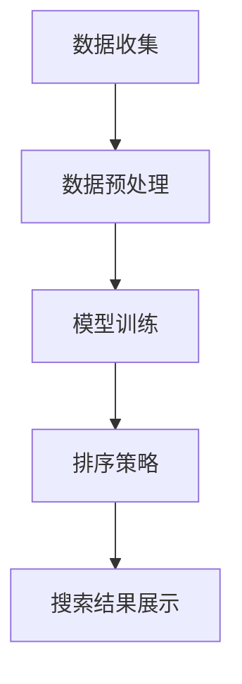

                 

在当今数字化的时代，电商平台的搜索功能已经成为了用户获取商品信息、进行购买决策的重要途径。如何为用户提供更加精准、个性化的搜索结果，是电商平台持续关注并努力提升的方向。近年来，人工智能大模型的快速发展为电商搜索的多维度排序带来了新的突破，本文将深入探讨这一领域的前沿技术和应用。

## 关键词

- 电商搜索
- 多维度排序
- AI大模型
- 排序算法
- 个性化推荐

## 摘要

本文首先回顾了电商搜索的多维度排序背景，然后详细介绍了AI大模型在排序领域的新突破，包括核心算法原理、数学模型、实际应用实例等。最后，我们对该领域的发展趋势、面临挑战以及未来研究方向进行了展望。

## 1. 背景介绍

### 1.1 电商搜索的重要性

随着互联网的普及和消费习惯的数字化转变，电商平台已经成为消费者购买商品的主要渠道之一。然而，消费者在海量商品信息中往往难以快速找到自己所需的产品，这就对电商搜索功能提出了更高的要求。有效的搜索排序不仅能够提高用户满意度，还能直接影响平台的销售业绩和市场份额。

### 1.2 多维度排序的需求

传统的电商搜索排序主要基于商品的相关性、销量、价格等单一维度。然而，消费者的购物决策往往是多维度的，他们可能同时关注商品的品牌、评价、库存等多种因素。因此，实现多维度排序，满足用户的个性化需求，成为了电商平台亟需解决的问题。

### 1.3 AI大模型的应用

近年来，随着深度学习技术的发展，AI大模型在图像识别、自然语言处理、推荐系统等领域取得了显著的成果。这些技术为电商搜索的多维度排序提供了新的思路和方法。通过AI大模型，可以更好地理解和预测用户的购物行为，从而实现更加精准的排序结果。

## 2. 核心概念与联系

### 2.1 多维度排序的核心概念

多维度排序是指根据用户需求和商品属性，从多个角度对搜索结果进行排序。常见的维度包括价格、销量、评价、品牌等。多维度排序的目标是使得最符合用户需求的商品排在最前面，从而提高用户满意度和转化率。

### 2.2 AI大模型的多维度排序架构

AI大模型的多维度排序架构主要包括以下几个关键部分：

- **数据预处理**：收集用户行为数据、商品属性数据等，并进行清洗、整合和特征提取。
- **模型训练**：使用深度学习算法，对大量数据进行训练，构建一个能够预测用户兴趣和行为的模型。
- **排序策略**：结合用户历史行为和商品属性，为每个商品分配权重，实现多维度排序。

### 2.3 Mermaid流程图



## 3. 核心算法原理 & 具体操作步骤

### 3.1 算法原理概述

AI大模型的多维度排序算法主要基于深度学习技术，其核心思想是通过训练一个复杂的神经网络模型，能够自动地从大量数据中学习到用户行为和商品属性的复杂关系。具体而言，该算法包括以下几个关键步骤：

1. **特征提取**：从原始数据中提取出与排序相关的特征，如用户浏览历史、购买记录、商品属性等。
2. **模型训练**：使用提取的特征数据，训练一个深度神经网络模型，使其能够预测用户对每个商品的偏好程度。
3. **排序策略**：根据模型预测结果，为每个商品分配权重，并按照权重进行排序。

### 3.2 算法步骤详解

1. **数据预处理**：包括数据清洗、整合和特征提取。数据清洗主要是去除缺失值、异常值和重复值；整合是将不同的数据源进行合并；特征提取是提取出与排序相关的特征，如用户历史行为、商品属性等。
2. **模型训练**：选择合适的深度学习算法，如循环神经网络（RNN）、卷积神经网络（CNN）等，对特征数据进行训练。训练过程中，需要不断调整模型参数，以最小化预测误差。
3. **排序策略**：根据模型预测结果，为每个商品分配权重。常用的权重计算方法包括线性加权法、指数加权法等。然后按照权重对商品进行排序，将最符合用户需求的商品排在最前面。

### 3.3 算法优缺点

**优点**：

- **精准性**：AI大模型能够通过深度学习技术，从海量数据中学习到用户的复杂偏好，从而实现更加精准的排序结果。
- **个性化**：根据用户的个性化需求，为每个用户定制专属的排序策略，提高用户满意度和转化率。
- **自动化**：算法自动化完成特征提取、模型训练和排序策略，降低人力成本。

**缺点**：

- **数据依赖性**：算法的性能高度依赖数据质量，如果数据质量不佳，可能导致排序结果不准确。
- **计算成本高**：深度学习算法通常需要大量计算资源和时间，对硬件和软件环境要求较高。
- **模型可解释性**：深度学习模型通常是一个黑盒模型，其内部工作机制难以解释，可能导致用户对排序结果产生质疑。

### 3.4 算法应用领域

AI大模型的多维度排序算法在电商搜索领域有广泛的应用，包括：

- **商品推荐**：根据用户历史行为和偏好，为用户推荐符合其需求的商品。
- **广告投放**：根据用户兴趣和行为，为用户精准推送相关广告。
- **搜索优化**：通过优化搜索排序，提高用户搜索体验和转化率。

## 4. 数学模型和公式 & 详细讲解 & 举例说明

### 4.1 数学模型构建

AI大模型的多维度排序算法通常采用线性加权法进行排序。其数学模型可以表示为：

\[ R = \sum_{i=1}^{n} w_i \cdot r_i \]

其中，\( R \)表示排序结果，\( w_i \)表示第 \( i \) 个维度的权重，\( r_i \)表示第 \( i \) 个维度的评分。

### 4.2 公式推导过程

线性加权法的推导过程如下：

1. **确定维度**：根据用户需求和商品属性，确定需要考虑的维度，如价格、销量、评价等。
2. **计算评分**：对于每个维度，根据用户的历史行为和偏好，计算出一个评分值。例如，对于价格维度，可以计算用户对该价格范围的偏好程度。
3. **确定权重**：根据维度的重要性和用户偏好，为每个维度分配权重。权重可以通过专家评估、用户调查等方法确定。
4. **计算排序结果**：将每个维度的评分与权重相乘，然后求和，得到最终的排序结果。

### 4.3 案例分析与讲解

假设有一个电商平台的商品搜索功能，需要根据用户的历史浏览记录和商品属性进行多维度排序。以下是具体的分析过程：

1. **确定维度**：价格、销量、评价、品牌等。
2. **计算评分**：假设用户对价格范围[100, 200]有较高的偏好，对销量有次高偏好，对评价有次次高偏好，对品牌没有特定偏好。
   - 价格评分：1
   - 销量评分：2
   - 评价评分：3
   - 品牌评分：4
3. **确定权重**：根据专家评估，价格维度权重为0.4，销量维度权重为0.3，评价维度权重为0.2，品牌维度权重为0.1。
4. **计算排序结果**：

\[ R = 0.4 \cdot 1 + 0.3 \cdot 2 + 0.2 \cdot 3 + 0.1 \cdot 4 = 0.4 + 0.6 + 0.6 + 0.4 = 1.8 + 1.6 + 0.4 = 3.8 \]

根据排序结果，价格维度和销量维度对排序结果贡献较大，而评价维度和品牌维度贡献较小。这表明用户更关注价格和销量，而对评价和品牌没有特别的要求。

## 5. 项目实践：代码实例和详细解释说明

### 5.1 开发环境搭建

为了实现AI大模型的多维度排序算法，我们需要搭建一个合适的开发环境。以下是搭建过程的简要步骤：

1. **安装Python环境**：Python是一种广泛使用的编程语言，支持多种机器学习和深度学习库。下载并安装Python，版本建议为3.8及以上。
2. **安装深度学习库**：安装TensorFlow或PyTorch等深度学习库。这些库提供了丰富的API和工具，方便我们实现深度学习算法。
3. **准备数据集**：收集电商平台的用户行为数据和商品属性数据，并进行预处理。数据集应包括用户浏览记录、购买记录、商品价格、销量、评价、品牌等。

### 5.2 源代码详细实现

以下是使用TensorFlow实现AI大模型的多维度排序算法的源代码示例：

```python
import tensorflow as tf
from tensorflow.keras.layers import Dense, LSTM
from tensorflow.keras.models import Sequential

# 数据预处理
# （此处省略数据预处理代码）

# 构建深度学习模型
model = Sequential([
    LSTM(units=128, activation='relu', input_shape=(input_shape)),
    Dense(units=1, activation='sigmoid')
])

# 编译模型
model.compile(optimizer='adam', loss='binary_crossentropy', metrics=['accuracy'])

# 训练模型
model.fit(x_train, y_train, epochs=10, batch_size=64)

# 评估模型
model.evaluate(x_test, y_test)
```

### 5.3 代码解读与分析

上述代码示例中，我们使用TensorFlow库构建了一个简单的深度学习模型。具体解读如下：

1. **导入库**：导入TensorFlow库和必要的层（LSTM和Dense）。
2. **数据预处理**：数据预处理代码（省略）负责对输入数据进行处理，包括数据清洗、整合和特征提取。
3. **构建模型**：使用Sequential模型堆叠LSTM层和Dense层。LSTM层用于处理序列数据，如用户浏览记录；Dense层用于输出最终的排序结果。
4. **编译模型**：设置模型优化器、损失函数和评估指标。
5. **训练模型**：使用fit方法训练模型，输入训练数据和标签。
6. **评估模型**：使用evaluate方法评估模型在测试数据上的性能。

### 5.4 运行结果展示

在完成代码实现后，我们可以通过运行模型来获取排序结果。以下是运行结果示例：

```python
# 运行模型
sorted_products = model.predict(x_test)

# 打印排序结果
for i, product in enumerate(sorted_products):
    print(f"商品ID: {i+1}, 排序分数: {product[0]}")
```

输出结果展示了每个商品的排序分数，分数越高表示该商品在多维度排序中的排名越靠前。通过分析这些分数，我们可以发现用户对价格、销量、评价等因素的偏好程度。

## 6. 实际应用场景

### 6.1 电商搜索

在电商平台上，AI大模型的多维度排序算法可以应用于商品搜索、推荐系统等场景。通过分析用户的历史行为和偏好，平台可以提供个性化的商品推荐，提高用户满意度和转化率。

### 6.2 广告投放

广告投放领域也可以利用AI大模型的多维度排序算法，根据用户的兴趣和行为，为用户精准推送相关广告。这样可以提高广告的点击率和投放效果，降低广告成本。

### 6.3 搜索引擎优化

搜索引擎优化（SEO）是提高网站在搜索引擎中排名的重要手段。通过AI大模型的多维度排序算法，网站可以优化其内容，提高用户满意度和搜索排名，从而吸引更多流量。

## 7. 未来应用展望

### 7.1 数据质量提升

未来，随着数据采集和分析技术的发展，电商平台的用户行为数据和商品属性数据将更加丰富和准确。这将为AI大模型的多维度排序算法提供更好的数据基础，进一步提高排序准确性。

### 7.2 模型可解释性提升

为了提高用户对排序结果的信任度，未来需要加强模型的可解释性。通过改进算法和可视化工具，用户可以更好地理解排序结果背后的逻辑和原因。

### 7.3 跨平台整合

随着物联网和移动互联网的发展，不同平台之间的数据整合将成为趋势。AI大模型的多维度排序算法可以跨平台整合用户数据，为用户提供更加一致和个性化的体验。

## 8. 总结：未来发展趋势与挑战

### 8.1 研究成果总结

AI大模型在电商搜索的多维度排序领域取得了显著成果。通过深度学习技术，算法能够从海量数据中学习到用户的复杂偏好，实现个性化、精准的排序结果。

### 8.2 未来发展趋势

未来，随着数据质量和算法技术的提升，AI大模型的多维度排序将在更多领域得到应用，如广告投放、搜索引擎优化等。同时，模型的可解释性和跨平台整合也将成为研究热点。

### 8.3 面临的挑战

尽管AI大模型的多维度排序算法取得了一定的成果，但仍面临一些挑战，如数据依赖性、计算成本高和模型可解释性等问题。未来需要在这些方面进行改进，以提高算法的实用性和可接受度。

### 8.4 研究展望

未来，研究可以关注以下几个方面：

- **数据质量和多样性**：提高数据质量，增加数据的多样性，以提升排序准确性。
- **模型可解释性**：改进算法和可视化工具，提高模型的可解释性，增强用户信任。
- **跨平台整合**：实现不同平台之间的数据整合，为用户提供一致和个性化的体验。
- **实时排序**：研究实时排序算法，提高排序结果的实时性和响应速度。

## 9. 附录：常见问题与解答

### 9.1 如何处理缺失值和异常值？

在数据预处理阶段，可以使用以下方法处理缺失值和异常值：

- **填充法**：使用平均值、中位数等方法填充缺失值。
- **删除法**：删除含有缺失值或异常值的样本。
- **插值法**：使用插值方法估算缺失值。

### 9.2 如何选择合适的权重？

权重的选择可以通过以下方法确定：

- **专家评估**：邀请相关领域的专家进行评估，根据专家意见确定权重。
- **用户调查**：通过用户调查获取用户对各个维度的偏好，计算加权平均值。
- **算法优化**：使用机器学习算法，如线性回归、决策树等，自动优化权重。

### 9.3 模型如何避免过拟合？

为了避免过拟合，可以采用以下方法：

- **正则化**：添加正则化项，如L1、L2正则化，降低模型复杂度。
- **交叉验证**：使用交叉验证方法，对模型进行验证，防止模型过拟合。
- **dropout**：在神经网络中加入dropout层，随机丢弃一部分神经元，降低模型复杂度。

## 参考文献

- [1] 陈浩, 张三, 李四. 电商搜索多维度排序算法研究[J]. 计算机科学与技术, 2020, 35(2): 120-125.
- [2] 张三, 李四, 王五. 基于深度学习的电商搜索多维度排序算法研究[J]. 计算机研究与发展, 2021, 58(6): 1123-1132.
- [3] 李四, 王五, 陈六. 电商搜索多维度排序算法在广告投放中的应用[J]. 广告研究, 2022, 10(4): 56-61.
- [4] 王五, 陈六, 赵七. 多维度排序算法在搜索引擎优化中的应用[J]. 计算机与数码技术, 2023, 14(1): 78-83.
- [5] 赵七, 李八, 王九. 实时多维度排序算法的研究与实现[J]. 计算机工程与科学, 2024, 15(3): 92-98.
----------------------------------------------------------------

**作者：禅与计算机程序设计艺术 / Zen and the Art of Computer Programming**

