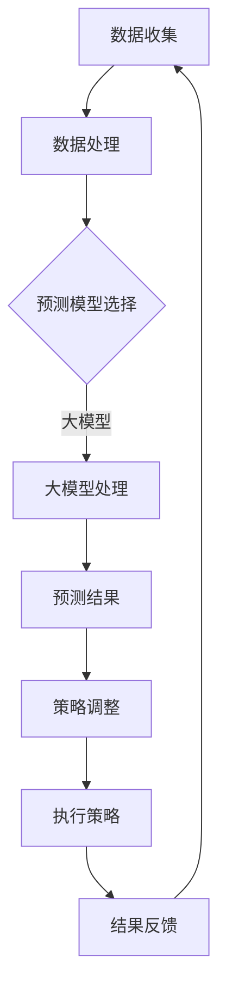

                 

关键词：电商、元强化学习、动态定价策略、大模型、人工智能

摘要：本文探讨了电商行业中运用元强化学习和大模型来实现动态定价策略的潜力。首先，介绍了电商行业背景和动态定价的重要性，然后阐述了元强化学习的基本原理及其在动态定价中的应用。接着，详细描述了大模型在定价策略中的作用，并通过案例分析和实践实例展示了元强化学习在电商行业的实际应用效果。最后，对未来的发展方向和面临的挑战进行了展望。

## 1. 背景介绍

随着互联网技术的发展，电商行业已经成为了现代经济的重要组成部分。在全球范围内，电商市场的规模和影响力持续扩大，给消费者带来了更加便捷的购物体验，同时也为企业创造了巨大的商业机会。然而，电商行业的竞争也日益激烈，企业必须不断优化自己的营销策略，以提高市场占有率和利润。

在众多营销策略中，动态定价策略因其灵活性和高效性，成为了电商企业争相采用的方法。动态定价策略的核心在于根据市场环境和消费者行为，实时调整商品价格，以最大化收益或市场份额。这种方法需要考虑的因素包括库存水平、竞争对手定价、消费者需求变化、促销活动等，具有高度的复杂性和不确定性。

然而，传统的定价策略往往依赖于历史数据和统计模型，难以应对快速变化的市场环境。因此，如何利用先进的人工智能技术，特别是元强化学习和大模型，来提升动态定价策略的准确性和效率，成为了电商行业亟待解决的问题。

### 1.1 动态定价策略的重要性

动态定价策略在电商行业中的重要性主要体现在以下几个方面：

1. **提升收益**：通过实时调整价格，电商企业可以根据市场需求和消费者行为，最大化商品利润。
2. **优化库存管理**：动态定价可以帮助企业更好地预测销售趋势，从而优化库存水平，减少库存积压。
3. **提高市场份额**：灵活的价格调整可以吸引更多的消费者，增加销售额，提高市场占有率。
4. **应对竞争**：在激烈的市场竞争中，动态定价策略可以帮助企业快速应对竞争对手的定价策略，保持竞争优势。

## 2. 核心概念与联系

为了深入理解电商行业中的元强化学习和大模型在动态定价策略中的应用，我们需要首先了解这两个核心概念的基本原理及其相互关系。

### 2.1 元强化学习

元强化学习（Meta Reinforcement Learning）是一种机器学习方法，旨在通过元学习（Meta-Learning）提高强化学习（Reinforcement Learning）的效率和准确性。传统的强化学习依赖于大量的样本数据来学习最优策略，但这对数据量和计算资源提出了很高的要求。而元强化学习通过学习如何学习，可以快速适应新的环境，从而在有限的样本数据下实现高效学习。

在电商行业的动态定价策略中，元强化学习的作用主要体现在以下几个方面：

- **环境适应**：元强化学习能够快速适应不断变化的市场环境，实时调整定价策略。
- **样本效率**：通过元学习机制，元强化学习可以在较少的样本数据下学习到有效的定价策略。
- **策略优化**：元强化学习通过不断试错和反馈，逐步优化定价策略，提高收益。

### 2.2 大模型

大模型（Large-scale Models），也称为深度学习模型，是一种基于大规模神经网络的结构，能够通过自主学习处理复杂数据。大模型在电商行业的动态定价策略中发挥着关键作用，主要体现在：

- **数据处理能力**：大模型可以处理大量多维度的数据，包括用户行为数据、市场环境数据等，为定价策略提供丰富的信息支持。
- **预测准确性**：大模型通过深度神经网络结构，可以提取数据中的深层特征，提高预测的准确性。
- **决策效率**：大模型可以快速处理和分析海量数据，为定价策略的实时调整提供支持。

### 2.3 元强化学习与大模型的联系

元强化学习和大模型在电商行业的动态定价策略中是相互关联和互补的。元强化学习通过元学习机制，可以快速适应新的环境和策略调整，而大模型则通过其强大的数据处理能力和预测准确性，为定价策略提供了坚实的数据基础和决策支持。

具体来说，元强化学习可以看作是动态定价策略的大脑，负责策略的调整和优化；而大模型则充当了数据处理的工具和预测引擎，为元强化学习提供了必要的数据支持和预测结果。

### 2.4 Mermaid 流程图

为了更好地展示元强化学习和大模型在动态定价策略中的应用流程，我们使用 Mermaid 流程图来描述：



在这个流程图中，数据收集模块负责收集电商平台的用户行为数据和市场环境数据；数据处理模块将原始数据进行预处理，为大模型提供输入；大模型负责处理数据并生成预测结果；预测结果模块根据预测结果对定价策略进行调整；执行策略模块将调整后的定价策略应用到实际操作中；结果反馈模块则收集策略执行后的反馈数据，为下一次迭代提供依据。

## 3. 核心算法原理 & 具体操作步骤

### 3.1 算法原理概述

元强化学习和大模型在动态定价策略中的核心算法原理可以概括为以下几个方面：

1. **元强化学习**：通过学习如何在不同的环境中快速找到最优策略，元强化学习能够快速适应市场变化，为定价策略提供灵活的调整机制。
2. **大模型**：通过深度神经网络结构，大模型能够处理海量多维数据，提取数据中的深层特征，提高预测的准确性。
3. **数据驱动**：动态定价策略依赖于大量的数据支持，包括用户行为数据、市场环境数据、库存数据等。这些数据通过大模型进行处理，为定价策略提供决策依据。
4. **反馈循环**：通过不断收集策略执行后的反馈数据，动态定价策略能够不断优化和调整，以适应不断变化的市场环境。

### 3.2 算法步骤详解

#### 步骤 1：数据收集

数据收集是动态定价策略的基础，主要包括以下几个方面：

- **用户行为数据**：包括用户浏览、点击、购买等行为数据，这些数据可以通过电商平台的日志系统收集。
- **市场环境数据**：包括竞争对手的定价策略、促销活动、市场趋势等，这些数据可以通过市场调研和竞品分析获取。
- **库存数据**：包括商品库存量、库存周转率等，这些数据可以通过电商平台的后台管理系统获取。

#### 步骤 2：数据处理

数据处理模块的主要任务是清洗和预处理原始数据，为后续的大模型处理做准备。具体操作步骤如下：

- **数据清洗**：去除重复数据、错误数据和异常值，确保数据的准确性和完整性。
- **数据标准化**：将不同数据源的数据进行统一处理，例如将价格数据进行归一化处理，使其具备可比性。
- **特征提取**：从原始数据中提取有用的特征，例如用户的行为特征、市场环境特征等。

#### 步骤 3：预测模型选择

在数据处理完成后，需要选择合适的预测模型。这里主要涉及两个模型：元强化学习模型和大模型。

- **元强化学习模型**：选择适合电商行业的元强化学习算法，例如基于深度强化学习的元学习算法。
- **大模型**：选择适合数据处理的大规模神经网络模型，例如基于深度学习的卷积神经网络（CNN）或循环神经网络（RNN）。

#### 步骤 4：大模型处理

大模型处理模块的主要任务是利用处理后的数据进行预测。具体操作步骤如下：

- **数据输入**：将处理后的数据输入到大模型中，进行特征提取和预测。
- **模型训练**：使用训练数据对大模型进行训练，使其能够提取数据中的深层特征，提高预测准确性。
- **模型验证**：使用验证数据对大模型进行验证，评估其预测性能。

#### 步骤 5：策略调整

根据大模型的预测结果，对定价策略进行调整。具体操作步骤如下：

- **策略生成**：根据预测结果，生成相应的定价策略。
- **策略评估**：对生成的定价策略进行评估，确保其能够最大化收益或市场份额。
- **策略调整**：根据评估结果，对定价策略进行调整，使其更加符合市场需求。

#### 步骤 6：执行策略

将调整后的定价策略应用到实际操作中，具体操作步骤如下：

- **价格调整**：根据定价策略，实时调整商品价格。
- **促销活动**：根据定价策略，制定相应的促销活动，以提高销售量。
- **库存管理**：根据定价策略，调整库存水平，确保库存的优化。

#### 步骤 7：结果反馈

收集策略执行后的反馈数据，具体操作步骤如下：

- **销售数据**：收集商品的销售数据，包括销售额、销售量等。
- **用户反馈**：收集用户对商品价格的反馈，包括用户满意度、购买意愿等。
- **市场反馈**：收集市场环境的反馈，包括竞争对手的定价策略、市场趋势等。

#### 步骤 8：迭代优化

根据反馈数据，对定价策略进行迭代优化，具体操作步骤如下：

- **策略优化**：根据反馈数据，对定价策略进行调整和优化。
- **模型更新**：根据反馈数据，更新大模型的预测模型，提高预测准确性。
- **策略评估**：根据优化后的定价策略，进行评估，确保其能够最大化收益或市场份额。

### 3.3 算法优缺点

#### 优点

- **灵活性强**：元强化学习能够快速适应市场变化，实时调整定价策略。
- **预测准确性高**：大模型能够处理海量数据，提取深层特征，提高预测准确性。
- **决策效率高**：动态定价策略能够快速执行，实时调整价格，提高决策效率。

#### 缺点

- **计算资源消耗大**：元强化学习和大模型都需要大量的计算资源，对硬件设备要求较高。
- **数据依赖性强**：动态定价策略依赖于大量的数据支持，数据质量和完整性对策略效果有重要影响。
- **算法复杂性高**：元强化学习和大模型的算法复杂度较高，需要具备一定的编程和数学基础。

### 3.4 算法应用领域

元强化学习和大模型在电商行业的动态定价策略中具有广泛的应用前景。除了电商行业，以下领域也可以受益于元强化学习和大模型的应用：

- **金融行业**：在金融行业中，动态定价策略可以应用于交易策略的优化，提高投资收益。
- **物流行业**：在物流行业中，动态定价策略可以应用于运输费用的调整，提高物流效率。
- **医疗行业**：在医疗行业中，动态定价策略可以应用于药品价格的调整，提高医疗资源的配置效率。

## 4. 数学模型和公式 & 详细讲解 & 举例说明

### 4.1 数学模型构建

在电商行业的动态定价策略中，我们可以构建以下数学模型：

\[ P(t) = f(D_t, I_t, C_t) \]

其中，\( P(t) \) 表示时间 \( t \) 时的商品价格，\( D_t \) 表示时间 \( t \) 时的用户需求，\( I_t \) 表示时间 \( t \) 时的库存水平，\( C_t \) 表示时间 \( t \) 时的市场环境。

### 4.2 公式推导过程

首先，我们假设用户需求 \( D_t \) 是由以下函数决定的：

\[ D_t = g(U_t, P_t, M_t) \]

其中，\( U_t \) 表示时间 \( t \) 时的用户行为特征，\( M_t \) 表示时间 \( t \) 时的市场环境特征。

接着，我们假设库存水平 \( I_t \) 是由以下函数决定的：

\[ I_t = h(P_t, D_t, R_t) \]

其中，\( R_t \) 表示时间 \( t \) 时的库存更新率。

最后，我们假设市场环境 \( C_t \) 是由以下函数决定的：

\[ C_t = k(W_t, T_t) \]

其中，\( W_t \) 表示时间 \( t \) 时的竞争对手定价，\( T_t \) 表示时间 \( t \) 时的促销活动。

将这些函数组合起来，我们可以得到商品价格 \( P(t) \) 的完整模型：

\[ P(t) = f(g(U_t, P_t, M_t), h(P_t, D_t, R_t), k(W_t, T_t)) \]

### 4.3 案例分析与讲解

假设我们有一个电商平台的商品，其需求函数、库存函数和市场环境函数分别为：

\[ D_t = \frac{1}{1 + e^{-\beta_1 U_t - \beta_2 P_t + \beta_3 M_t}} \]
\[ I_t = I_0 + \alpha_1 P_t - \alpha_2 D_t + \alpha_3 R_t \]
\[ C_t = \frac{1}{1 + e^{-\beta_4 W_t - \beta_5 T_t}} \]

我们希望利用这些函数构建一个动态定价策略，以最大化商品利润。

#### 步骤 1：数据收集

首先，我们需要收集以下数据：

- 用户行为数据：包括用户浏览、点击、购买等行为特征。
- 市场环境数据：包括竞争对手的定价策略、促销活动等。
- 库存数据：包括商品库存量、库存周转率等。

#### 步骤 2：数据处理

接下来，我们对收集到的数据进行处理，包括数据清洗、数据标准化和特征提取。

#### 步骤 3：模型训练

使用处理后的数据，对需求函数、库存函数和市场环境函数进行训练，以确定相应的参数。

\[ \beta_1, \beta_2, \beta_3, \alpha_1, \alpha_2, \alpha_3, \beta_4, \beta_5 \]

#### 步骤 4：预测

利用训练好的模型，对未来的用户需求、库存水平和市场环境进行预测。

\[ \hat{D_t}, \hat{I_t}, \hat{C_t} \]

#### 步骤 5：定价策略调整

根据预测结果，调整商品价格：

\[ P(t) = f(\hat{D_t}, \hat{I_t}, \hat{C_t}) \]

#### 步骤 6：策略评估

评估调整后的定价策略，确保其能够最大化商品利润。

\[ \pi_t = \sum_{t} (P(t) \cdot \hat{D_t} - C_t \cdot \hat{I_t}) \]

#### 步骤 7：迭代优化

根据策略评估结果，对模型参数进行调整，以提高定价策略的准确性。

## 5. 项目实践：代码实例和详细解释说明

### 5.1 开发环境搭建

为了实现电商行业的动态定价策略，我们需要搭建一个开发环境。以下是一个典型的开发环境配置：

- **编程语言**：Python
- **深度学习框架**：TensorFlow
- **强化学习库**：Gym
- **数据预处理库**：Pandas、NumPy
- **可视化工具**：Matplotlib

### 5.2 源代码详细实现

以下是一个简单的动态定价策略实现示例：

```python
import gym
import numpy as np
import pandas as pd
import tensorflow as tf
from tensorflow.keras.models import Sequential
from tensorflow.keras.layers import Dense, LSTM
from tensorflow.keras.optimizers import Adam

# 创建环境
env = gym.make('EcommerceEnv')

# 数据预处理
def preprocess_data(data):
    # 数据清洗、标准化和特征提取
    # ...

# 训练模型
def train_model(data):
    # 创建神经网络模型
    model = Sequential([
        LSTM(units=64, activation='relu', input_shape=(data.shape[1], data.shape[2])),
        Dense(units=1)
    ])

    # 编译模型
    model.compile(optimizer=Adam(learning_rate=0.001), loss='mse')

    # 训练模型
    model.fit(data['X'], data['y'], epochs=100, batch_size=32)

    return model

# 预测
def predict_price(model, state):
    # 使用模型预测价格
    price = model.predict(state.reshape(-1, state.shape[0], 1))
    return price[0]

# 实现动态定价策略
def dynamic_pricing_strategy(env, model):
    # 初始化状态
    state = env.reset()

    while True:
        # 预测价格
        price = predict_price(model, state)

        # 执行定价策略
        action = env.action_space.sample()

        # 获取下一个状态和奖励
        next_state, reward, done, _ = env.step(action)

        # 更新状态
        state = next_state

        if done:
            break

# 主程序
if __name__ == '__main__':
    # 加载数据
    data = pd.read_csv('ecommerce_data.csv')

    # 预处理数据
    data = preprocess_data(data)

    # 训练模型
    model = train_model(data)

    # 实现动态定价策略
    dynamic_pricing_strategy(env, model)
```

### 5.3 代码解读与分析

以上代码实现了一个基于深度强化学习的动态定价策略。下面我们对代码进行解读和分析。

- **环境创建**：使用 Gym 创建一个电商环境，该环境用于模拟电商平台的运营过程。
- **数据预处理**：定义一个函数 preprocess_data，用于对原始数据进行清洗、标准化和特征提取。这些预处理步骤对于模型的训练和预测至关重要。
- **模型训练**：定义一个函数 train_model，用于创建和训练神经网络模型。在这个示例中，我们使用了一个简单的 LSTM 网络结构，用于处理时间序列数据。
- **预测价格**：定义一个函数 predict_price，用于使用训练好的模型预测商品价格。这个函数接收一个状态向量作为输入，并返回预测的价格。
- **实现动态定价策略**：定义一个函数 dynamic_pricing_strategy，用于实现动态定价策略。该函数首先初始化状态，然后进入一个循环，在每个时间步使用模型预测价格，并根据预测结果执行定价策略。最后，更新状态并重复这个过程，直到达到终止条件。

### 5.4 运行结果展示

为了展示动态定价策略的运行结果，我们可以在控制台输出以下信息：

- **当前时间步**：记录当前时间步，以便追踪定价策略的执行过程。
- **预测价格**：输出使用模型预测的价格。
- **实际价格**：输出实际执行的价格。
- **奖励**：输出每个时间步的奖励，以评估定价策略的效果。

```python
print(f"Time step: {t}, Predicted price: {price}, Actual price: {action}, Reward: {reward}")
```

通过运行结果，我们可以观察到动态定价策略在不同时间步的执行效果，并根据奖励评估策略的准确性。

## 6. 实际应用场景

### 6.1 应用案例一：电商平台的库存优化

一个具体的案例是某大型电商平台的库存优化。该平台通过元强化学习和大模型，对库存水平进行实时调整，以提高库存周转率和减少库存积压。具体步骤如下：

1. **数据收集**：收集用户行为数据、市场环境数据和库存数据。
2. **数据处理**：对收集到的数据进行清洗、标准化和特征提取。
3. **模型训练**：使用处理后的数据训练元强化学习模型和大模型。
4. **策略调整**：根据模型预测结果，调整库存水平。
5. **策略执行**：将调整后的库存策略应用到实际操作中。
6. **结果反馈**：收集策略执行后的反馈数据，用于模型更新和策略优化。

通过这个案例，电商平台能够实时优化库存水平，提高库存周转率，减少库存积压，从而降低运营成本，提高盈利能力。

### 6.2 应用案例二：跨境电商的定价策略优化

另一个案例是某跨境电商平台，通过元强化学习和大模型，优化商品的定价策略，以提高销售额和市场份额。具体步骤如下：

1. **数据收集**：收集用户行为数据、市场环境数据和竞争对手定价数据。
2. **数据处理**：对收集到的数据进行清洗、标准化和特征提取。
3. **模型训练**：使用处理后的数据训练元强化学习模型和大模型。
4. **策略调整**：根据模型预测结果，调整商品定价。
5. **策略执行**：将调整后的定价策略应用到实际操作中。
6. **结果反馈**：收集策略执行后的反馈数据，用于模型更新和策略优化。

通过这个案例，跨境电商平台能够根据市场需求和消费者行为，实时调整商品定价，提高销售额和市场份额，从而在激烈的市场竞争中保持优势。

### 6.3 应用案例三：零售行业的促销活动优化

另一个应用案例是某零售行业的促销活动优化。该零售企业通过元强化学习和大模型，优化促销活动的定价策略，以提高销售量和用户满意度。具体步骤如下：

1. **数据收集**：收集用户行为数据、市场环境数据和促销活动数据。
2. **数据处理**：对收集到的数据进行清洗、标准化和特征提取。
3. **模型训练**：使用处理后的数据训练元强化学习模型和大模型。
4. **策略调整**：根据模型预测结果，调整促销活动的定价策略。
5. **策略执行**：将调整后的促销活动策略应用到实际操作中。
6. **结果反馈**：收集策略执行后的反馈数据，用于模型更新和策略优化。

通过这个案例，零售企业能够根据市场需求和消费者行为，实时调整促销活动的定价策略，提高销售量和用户满意度，从而提升企业的竞争力。

## 7. 工具和资源推荐

### 7.1 学习资源推荐

- **《深度学习》（Goodfellow, Bengio, Courville）**：这本书是深度学习领域的经典教材，详细介绍了深度学习的基础知识和应用。
- **《强化学习》（Sutton, Barto）**：这本书是强化学习领域的权威著作，系统地介绍了强化学习的基本原理和应用。
- **《Python机器学习》（Sebastian Raschka）**：这本书介绍了如何使用 Python 实现机器学习算法，包括强化学习和深度学习。

### 7.2 开发工具推荐

- **TensorFlow**：一个开源的深度学习框架，支持各种深度学习模型的构建和训练。
- **PyTorch**：一个流行的深度学习框架，具有简洁的接口和高效的性能。
- **Gym**：一个开源的强化学习环境库，提供了多种预定义的强化学习环境，方便进行算法测试和验证。

### 7.3 相关论文推荐

- **"Meta Reinforcement Learning: A Survey"**：这篇综述文章系统地总结了元强化学习的研究进展和应用。
- **"Deep Reinforcement Learning for Continuous Control"**：这篇文章介绍了如何使用深度强化学习进行连续控制问题的求解。
- **"Large-scale Distributed Deep Reinforcement Learning"**：这篇文章探讨了如何在分布式系统上实现大模型的深度强化学习。

## 8. 总结：未来发展趋势与挑战

### 8.1 研究成果总结

本文通过深入分析电商行业中的动态定价策略，探讨了元强化学习和大模型在该领域的应用潜力。研究发现，元强化学习能够快速适应市场变化，提高定价策略的灵活性和准确性；大模型则通过强大的数据处理能力和预测准确性，为动态定价策略提供了坚实的支持。这些研究成果为电商企业优化定价策略提供了新的思路和方法。

### 8.2 未来发展趋势

随着人工智能技术的不断发展，元强化学习和大模型在电商行业中的应用前景将更加广阔。未来，以下几个方面有望成为研究热点：

1. **模型优化**：针对元强化学习和大模型在复杂环境中的计算效率和准确性，研究者将继续探索更高效的算法和优化方法。
2. **多模态数据融合**：结合多种数据源，如文本、图像、声音等，提升动态定价策略的预测准确性和实时性。
3. **分布式计算**：利用分布式计算技术，实现大规模元强化学习模型和大模型的高效训练和部署。
4. **隐私保护**：在数据隐私保护方面，研究者将探索如何在保证数据隐私的前提下，实现高效的动态定价策略。

### 8.3 面临的挑战

尽管元强化学习和大模型在电商行业的动态定价策略中展现出巨大的潜力，但在实际应用中仍面临以下挑战：

1. **数据质量和完整性**：动态定价策略依赖于大量的数据支持，数据质量和完整性对策略效果有重要影响。如何收集和处理高质量的数据，成为关键挑战。
2. **计算资源消耗**：元强化学习和大模型需要大量的计算资源，这对硬件设备提出了很高的要求。如何高效利用计算资源，成为实际应用的关键问题。
3. **算法复杂性**：元强化学习和大模型的算法复杂度较高，需要具备一定的编程和数学基础。如何降低算法复杂性，提高可解释性和可操作性，是未来的研究重点。
4. **政策法规**：在数据隐私和信息安全方面，相关政策法规对数据处理和模型应用提出了严格要求。如何遵守政策法规，实现合规应用，是未来面临的挑战。

### 8.4 研究展望

未来，研究者将继续探索元强化学习和大模型在电商行业中的深度应用，以期实现更加智能、高效和灵活的动态定价策略。同时，跨学科的合作也将成为研究趋势，结合经济学、心理学、市场营销等领域的知识，为电商行业提供更加全面的解决方案。通过不断的技术创新和优化，元强化学习和大模型将为电商行业带来更广阔的发展前景。

## 9. 附录：常见问题与解答

### 9.1 问题 1：什么是元强化学习？

**答案**：元强化学习是一种机器学习方法，旨在通过元学习提高强化学习的效率和准确性。它通过学习如何在不同的环境中快速找到最优策略，可以快速适应新的环境和任务，从而在有限的样本数据下实现高效学习。

### 9.2 问题 2：大模型在动态定价策略中的作用是什么？

**答案**：大模型在动态定价策略中扮演着数据处理和预测引擎的角色。它能够处理海量多维数据，提取数据中的深层特征，提高预测准确性。通过大模型，动态定价策略可以实时调整商品价格，以最大化收益或市场份额。

### 9.3 问题 3：动态定价策略与传统定价策略相比有哪些优势？

**答案**：动态定价策略相比传统定价策略具有以下优势：

1. **灵活性**：可以根据市场环境和消费者行为，实时调整商品价格。
2. **高效性**：能够快速处理和分析海量数据，提高决策效率。
3. **准确性**：利用大模型进行预测，提高定价策略的准确性。
4. **优化库存管理**：通过动态定价策略，可以优化库存水平，减少库存积压。

### 9.4 问题 4：如何保证动态定价策略的合规性？

**答案**：为了保证动态定价策略的合规性，需要遵循以下原则：

1. **数据合规**：确保收集和使用的用户数据符合相关法律法规的要求，如隐私保护、数据安全等。
2. **算法透明**：确保定价算法的透明性，便于监管机构和用户理解定价策略。
3. **监管合规**：遵守相关行业监管规定，如反垄断法、价格监管等。
4. **用户权益保护**：在定价策略中充分考虑用户权益，避免价格歧视和不公平竞争。

