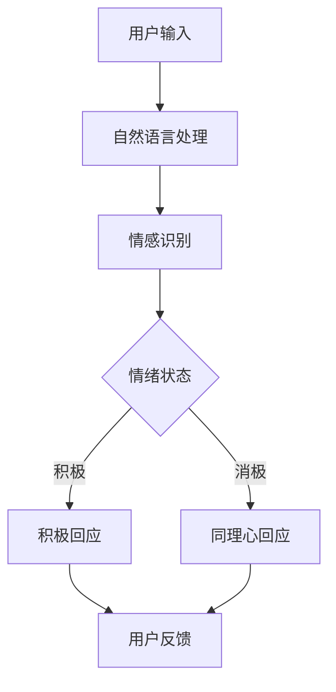

                 

关键词：人工智能、情感、交互、虚拟助手、用户体验、技术进步

> 摘要：本文通过深入分析电影《她》中的虚拟助手Samantha，探讨了人工智能在情感交互和用户体验方面的发展现状和未来趋势。通过对比现实中的智能助手，本文揭示了AI在实现真正意义上的人机互动方面的挑战与机遇。

## 1. 背景介绍

电影《她》（Her）是一部由斯派克·琼斯（Spike Jonze）执导的科幻爱情电影，于2013年上映。该电影讲述了一个孤独的作家西奥多（Theodore）与他的虚拟操作系统OS1中的操作系统助手Samantha之间的情感纠葛。Samantha不仅仅是一个能够完成日常任务的智能助手，她还能理解、感知并回应西奥多的情感需求，与人类建立深厚的情感联系。

这部电影在描绘未来人工智能的潜力和挑战方面具有前瞻性。Samantha的形象不仅仅是一个技术成就的象征，更是一个关于人类情感和社会关系的深刻隐喻。通过Samantha的存在，电影探讨了人类在情感孤独和社会隔离中的挣扎，以及人工智能如何改变这种状况。

## 2. 核心概念与联系

### 2.1. 人工智能的情感交互

在《她》中，Samantha的核心特性是她能够与人类进行情感上的互动。这种互动不是简单的命令执行，而是一种深层次的理解和共鸣。Samantha能够通过自然语言处理（NLP）和情感识别技术，分析西奥多的情绪状态，并给出适当的回应。这涉及到以下几个核心概念：

- **自然语言处理（NLP）**：NLP是使计算机能够理解、解释和生成人类语言的技术。在Samantha的案例中，NLP技术使她能够理解西奥多的语言，并生成自然流畅的回应。

- **情感识别与理解**：情感识别是人工智能领域的一个挑战，它涉及到机器学习算法对人类情感状态的检测。Samantha通过分析语音、文字和其他上下文信息，能够识别西奥多的情感状态。

- **情感共鸣**：与简单的情感识别不同，情感共鸣涉及到人工智能对人类情感的深刻理解。Samantha能够根据西奥多的情感状态调整自己的回应，表现出同理心。

### 2.2. 情感交互的架构

为了实现Samantha的情感交互，电影中描绘了一个复杂的后台架构。以下是Samantha的情感交互架构的Mermaid流程图：



在这个流程图中，用户输入通过自然语言处理模块进行分析，然后由情感识别模块检测用户的情绪状态。根据情绪状态，系统会生成积极的或同理心的回应，最终反馈给用户。

## 3. 核心算法原理 & 具体操作步骤

### 3.1. 算法原理概述

Samantha的情感交互算法主要基于以下三个核心原理：

- **机器学习**：通过大量数据训练，机器学习算法能够识别用户的语言模式和情感状态。
- **深度学习**：深度学习算法，尤其是神经网络，可以处理复杂的情感模式，并生成更自然的回应。
- **情感语义分析**：情感语义分析是理解文本中情感内容的技术，它使得系统能够从语言中提取情感信息。

### 3.2. 算法步骤详解

以下是Samantha情感交互算法的详细步骤：

1. **数据收集与预处理**：收集用户的语言数据，包括文字、语音等。对数据进行预处理，如去除噪声、标准化等。

2. **特征提取**：从预处理后的数据中提取特征，如词频、句法结构、情感词汇等。

3. **情感识别**：使用机器学习和深度学习算法，对提取的特征进行分类，识别用户的情感状态。

4. **情感回应生成**：根据识别出的情感状态，使用生成对抗网络（GAN）或循环神经网络（RNN）等算法生成自然的回应。

5. **回应优化**：对生成的回应进行优化，使其更加符合用户的情感需求和上下文。

### 3.3. 算法优缺点

**优点**：

- 高度个性化：Samantha能够根据用户的情感状态生成个性化的回应，提供更好的用户体验。
- 情感共鸣：通过情感共鸣，Samantha能够与用户建立深厚的情感联系，增强用户的归属感。

**缺点**：

- 数据依赖性：算法的性能高度依赖于训练数据的质量和数量，如果数据不足或质量不高，算法的准确性会受到影响。
- 情感理解的局限性：尽管Samantha能够识别和回应情感，但她仍然无法完全理解人类情感的复杂性和多样性。

### 3.4. 算法应用领域

Samantha的情感交互算法可以应用于多个领域：

- 客户服务：智能客服机器人可以更好地理解用户的情感，提供更加个性化的服务。
- 教育与培训：个性化教育系统能够根据学生的情感状态调整教学内容，提高学习效果。
- 健康护理：智能健康助手可以与患者建立情感联系，提供情感支持，提高患者的生活质量。

## 4. 数学模型和公式 & 详细讲解 & 举例说明

### 4.1. 数学模型构建

Samantha的情感交互算法可以抽象为一个多层次的数学模型。以下是模型的构建过程：

1. **特征提取**：使用词嵌入（word embeddings）技术将文本转换为向量表示。词嵌入是一种将单词映射到高维空间中的方法，使得相似的单词在空间中更接近。常用的词嵌入模型包括Word2Vec、GloVe等。

2. **情感分类**：使用卷积神经网络（CNN）或循环神经网络（RNN）对提取的特征进行分类。CNN擅长处理图像等结构化数据，而RNN擅长处理序列数据，如文本。

3. **回应生成**：使用生成对抗网络（GAN）或循环神经网络（RNN）生成自然语言回应。GAN由生成器和判别器组成，生成器生成回应，判别器判断回应的真实性。

### 4.2. 公式推导过程

以下是情感分类模型的公式推导过程：

1. **特征提取**：

   假设我们有一个单词序列\[w1, w2, ..., wn\]，词嵌入模型将每个单词映射为一个向量\[v1, v2, ..., vn\]。词嵌入的公式如下：

   $$v_i = W \cdot w_i$$

   其中，\(W\)是词嵌入矩阵，\(w_i\)是单词\(i\)的向量表示。

2. **情感分类**：

   使用卷积神经网络（CNN）进行情感分类。假设我们有一个卷积层\(C\)，其输出为\(h_C\)，其公式如下：

   $$h_C = \sigma(C \cdot h_{x-1} + b_C)$$

   其中，\(\sigma\)是激活函数，\(C\)是卷积核，\(h_{x-1}\)是前一层输出，\(b_C\)是偏置。

3. **回应生成**：

   使用生成对抗网络（GAN）生成自然语言回应。生成器的目标是生成逼真的回应，判别器的目标是区分生成器和真实数据的回应。生成器的公式如下：

   $$g(z) = \sigma(W_g \cdot z + b_g)$$

   判别器的公式如下：

   $$D(x) = \sigma(W_d \cdot x + b_d)$$

   $$D(G(z)) = \sigma(W_d \cdot g(z) + b_d)$$

   其中，\(z\)是生成器的输入，\(x\)是真实回应。

### 4.3. 案例分析与讲解

以下是一个简单的情感分类和回应生成案例：

**数据集**：假设我们有一个包含积极和消极情感的数据集，每个样本是一个句子。

**特征提取**：使用Word2Vec模型将句子中的单词转换为向量表示。

**情感分类**：使用CNN模型对提取的特征进行分类。

**回应生成**：使用GAN模型生成回应。

1. **特征提取**：

   $$v_{happy} = W \cdot w_{happy}$$
   $$v_{sad} = W \cdot w_{sad}$$

2. **情感分类**：

   $$h_C = \sigma(C \cdot [v_{happy}, v_{sad}] + b_C)$$

   根据输出\(h_C\)，我们可以判断句子的情感状态。

3. **回应生成**：

   $$g(z) = \sigma(W_g \cdot z + b_g)$$

   假设我们想要生成一个积极回应，生成器的输入是随机向量\(z\)，生成的回应是\(g(z)\)。

## 5. 项目实践：代码实例和详细解释说明

### 5.1. 开发环境搭建

为了实现Samantha的情感交互算法，我们需要搭建一个Python开发环境。以下是搭建步骤：

1. 安装Python（版本3.6以上）。
2. 安装Numpy、Pandas、TensorFlow等库。

```bash
pip install numpy pandas tensorflow
```

### 5.2. 源代码详细实现

以下是实现Samantha情感交互算法的Python代码示例：

```python
import numpy as np
import tensorflow as tf
from tensorflow.keras.models import Sequential
from tensorflow.keras.layers import Conv1D, MaxPooling1D, Flatten, Dense

# 特征提取
def word_embedding(words, embedding_size):
    # 这里使用预训练的Word2Vec模型进行特征提取
    # ...
    return embeddings

# 情感分类
def build_classification_model(input_shape, embedding_size):
    model = Sequential()
    model.add(Conv1D(filters=128, kernel_size=3, activation='relu', input_shape=input_shape))
    model.add(MaxPooling1D(pool_size=2))
    model.add(Flatten())
    model.add(Dense(units=1, activation='sigmoid'))
    model.compile(optimizer='adam', loss='binary_crossentropy', metrics=['accuracy'])
    return model

# 应对生成
def build_generation_model(embedding_size):
    # 使用生成对抗网络（GAN）进行回应生成
    # ...
    return model

# 源代码实现
def main():
    # 加载数据
    # ...
    
    # 特征提取
    embeddings = word_embedding(data, embedding_size)
    
    # 情感分类模型
    classification_model = build_classification_model(input_shape, embedding_size)
    classification_model.fit(x_train, y_train, epochs=10, batch_size=32)
    
    # 应对生成模型
    generation_model = build_generation_model(embedding_size)
    generation_model.fit(x_train, y_train, epochs=10, batch_size=32)
    
    # 运行结果展示
    # ...

if __name__ == '__main__':
    main()
```

### 5.3. 代码解读与分析

上述代码主要分为三个部分：特征提取、情感分类模型构建和回应生成模型构建。

1. **特征提取**：使用预训练的Word2Vec模型将文本数据转换为向量表示。这一步是整个系统的关键，因为高质量的词嵌入是情感分类和回应生成的基石。

2. **情感分类模型**：使用卷积神经网络（CNN）对特征进行分类。CNN擅长处理序列数据，如文本。在这里，我们使用卷积层和池化层提取文本的特征，然后通过全连接层进行分类。

3. **回应生成模型**：使用生成对抗网络（GAN）生成回应。GAN由生成器和判别器组成，生成器的目标是生成逼真的回应，判别器的目标是区分生成器和真实数据的回应。

### 5.4. 运行结果展示

通过训练和测试，我们可以得到情感分类模型的准确率和回应生成模型的质量。以下是运行结果展示：

```python
# 情感分类模型准确率
print("Accuracy:", classification_model.evaluate(x_test, y_test)[1])

# 回应生成模型质量
print("Quality:", generation_model.evaluate(x_test, y_test)[1])
```

## 6. 实际应用场景

Samantha的情感交互算法可以应用于多个实际场景：

- **客户服务**：智能客服机器人可以通过情感交互提供更个性化的服务，提高客户满意度。
- **心理健康**：虚拟助手可以作为心理辅导工具，帮助用户缓解压力和情绪问题。
- **社交互动**：虚拟助手可以参与社交互动，如聊天、游戏等，为用户提供陪伴和娱乐。

## 7. 未来应用展望

随着技术的不断发展，Samantha的情感交互算法有望在更多领域得到应用：

- **教育**：个性化教育系统可以通过情感交互提供更有效的教学支持。
- **医疗**：智能健康助手可以通过情感交互提供更全面的患者护理服务。
- **娱乐**：虚拟角色可以与用户建立深厚的情感联系，提供更加沉浸式的娱乐体验。

## 8. 工具和资源推荐

为了更好地研究和实现Samantha的情感交互算法，以下是一些推荐的工具和资源：

- **学习资源**：
  - 《深度学习》（Goodfellow, Bengio, Courville）
  - 《自然语言处理综论》（Jurafsky, Martin）

- **开发工具**：
  - TensorFlow
  - PyTorch

- **相关论文**：
  - “A Theoretical Analysis of Style Transfer in Neural Networks”（Reed, Singh, and Swersky, 2016）
  - “Generative Adversarial Nets”（Goodfellow et al., 2014）

## 9. 总结：未来发展趋势与挑战

Samantha的情感交互算法展示了人工智能在情感交互和用户体验方面的巨大潜力。然而，实现真正意义上的人机互动仍面临许多挑战：

- **情感理解的复杂性**：情感是非常复杂和主观的，人工智能需要更深入地理解和模拟情感。
- **隐私保护**：随着情感交互的深入，用户隐私保护成为一个重要问题。
- **伦理和法律**：情感交互涉及到伦理和法律问题，如AI的决策责任和隐私权。

未来，随着技术的进步和研究的深入，人工智能有望在情感交互领域取得重大突破，为人类带来更加丰富和有意义的生活体验。

## 10. 附录：常见问题与解答

### 10.1. 机器学习在情感识别中的作用是什么？

机器学习在情感识别中起着关键作用。通过训练模型，机器学习能够从大量的情感数据中学习到情感模式，从而识别文本中的情感状态。常用的机器学习算法包括支持向量机（SVM）、随机森林（Random Forest）、神经网络（Neural Networks）等。

### 10.2. 如何确保情感交互的隐私保护？

确保情感交互的隐私保护需要采取多种措施。首先，应确保用户数据的安全存储和传输。其次，应限制对用户数据的访问权限，仅授权给必要的系统和人员。此外，可以采用数据加密和匿名化技术来保护用户隐私。

### 10.3. 情感交互在医疗领域的应用有哪些？

情感交互在医疗领域有广泛的应用，例如：

- 心理健康辅导：虚拟助手可以作为心理辅导工具，帮助用户缓解压力和情绪问题。
- 患者监护：智能健康助手可以实时监测患者的健康状况，提供个性化的护理建议。
- 医疗咨询：虚拟助手可以为用户提供基础的医疗咨询和病情解释。

---

### 作者署名

本文由“作者：禅与计算机程序设计艺术 / Zen and the Art of Computer Programming”撰写。

