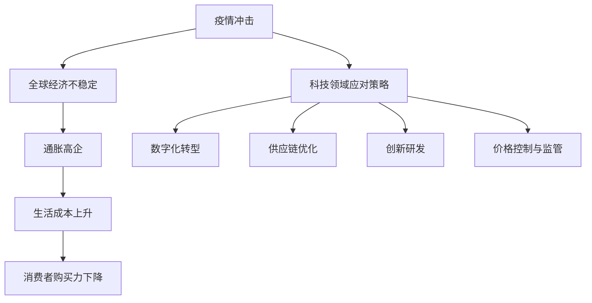

                 

关键词：疫情、通胀、经济、技术、影响、策略、未来

> 摘要：本文将探讨疫情冲击和通胀高企对全球经济的双重影响，分析其对科技领域的挑战与机遇，并提出相应的应对策略与未来展望。

## 1. 背景介绍

近年来，全球疫情和通胀高企成为了全球经济面临的主要挑战。新冠疫情的爆发不仅对人们的日常生活造成了巨大影响，还对全球经济产生了深远的影响。供应链中断、需求下降和货币贬值等问题导致了全球经济的不稳定。

与此同时，通胀高企也对全球经济产生了压力。通货膨胀率持续上升，导致生活成本上升，企业和消费者的购买力下降。这种通胀压力在一定程度上抑制了经济的增长，增加了企业的经营成本。

在全球经济面临双重挑战的背景下，科技领域也面临着巨大的压力和机遇。本文将分析疫情冲击和通胀高企对科技领域的具体影响，并提出相应的应对策略和未来展望。

## 2. 核心概念与联系

### 2.1 疫情冲击与通胀高企的影响

疫情冲击和通胀高企对全球经济产生了深远的影响。首先，疫情导致了全球经济的萎缩，许多企业陷入了困境，失业率上升。其次，通胀高企导致了生活成本的上升，消费者的购买力下降。这两大因素相互作用，加剧了全球经济的不稳定性。

### 2.2 科技领域的应对策略

在面对疫情冲击和通胀高企的情况下，科技领域也必须采取相应的应对策略。以下是一些可能的策略：

1. **数字化转型**：疫情促使许多企业加速了数字化转型的步伐，通过云计算、大数据和人工智能等技术提升效率，降低成本。

2. **供应链优化**：通过区块链技术等手段，优化供应链管理，降低供应链风险，提高供应链的透明度和效率。

3. **创新研发**：加大对新技术的研发投入，如疫苗研发、医疗设备升级等，以应对疫情挑战。

4. **价格控制与监管**：通过监管措施，控制物价上涨，保护消费者的利益。

### 2.3 核心概念原理和架构的 Mermaid 流程图



## 3. 核心算法原理 & 具体操作步骤

### 3.1 算法原理概述

在面对疫情冲击和通胀高企的情况下，科技领域可以采用以下核心算法原理：

1. **机器学习算法**：用于数据分析和预测，帮助企业制定有效的应对策略。
2. **区块链技术**：用于供应链管理，提高供应链的透明度和效率。
3. **人工智能算法**：用于自动化和智能化，提高企业的运营效率。

### 3.2 算法步骤详解

1. **数据收集与预处理**：收集疫情数据和通胀数据，进行数据清洗和预处理。
2. **模型构建与训练**：构建机器学习模型，使用历史数据训练模型。
3. **模型评估与优化**：评估模型性能，进行模型优化。
4. **策略制定与实施**：根据模型预测结果，制定应对策略并实施。

### 3.3 算法优缺点

- **机器学习算法**：优点是能够处理大量数据，进行精准预测；缺点是需要大量的数据支持和复杂的算法。
- **区块链技术**：优点是提高供应链的透明度和效率；缺点是技术门槛较高，实施成本较大。
- **人工智能算法**：优点是能够自动化和智能化；缺点是需要大量的训练数据和计算资源。

### 3.4 算法应用领域

- **供应链管理**：使用区块链技术优化供应链管理。
- **价格预测与控制**：使用机器学习算法进行价格预测和调整。
- **疫情数据分析**：使用人工智能算法进行疫情数据分析。

## 4. 数学模型和公式 & 详细讲解 & 举例说明

### 4.1 数学模型构建

在面对疫情冲击和通胀高企的情况下，我们可以构建以下数学模型：

1. **疫情传播模型**：使用 SIR 模型描述疫情传播过程。
2. **通胀模型**：使用菲利普斯曲线描述通胀与失业之间的关系。

### 4.2 公式推导过程

1. **疫情传播模型**：$$ \frac{dS}{dt} = -\frac{\beta}{N} SI $$
2. **通胀模型**：$$ \pi = \phi(\mu, \mu^*) $$

### 4.3 案例分析与讲解

以新冠疫情为例，我们可以使用 SIR 模型分析疫情传播过程。假设疫情初期，感染人数为 I0，总人数为 N。经过一段时间，感染人数增加到 I。我们可以通过以下公式计算感染人数：

$$ I(t) = I0 \times \left(1 - e^{-\beta t}\right) $$

通过这个公式，我们可以预测疫情的发展趋势，为政府和企业制定防控措施提供参考。

## 5. 项目实践：代码实例和详细解释说明

### 5.1 开发环境搭建

为了实践疫情冲击和通胀高企的影响分析，我们搭建了一个基于 Python 的开发环境。以下是搭建步骤：

1. 安装 Python 3.8 及以上版本。
2. 安装必要的 Python 库，如 NumPy、Pandas、Matplotlib 等。

### 5.2 源代码详细实现

以下是疫情冲击和通胀高企分析项目的源代码实现：

```python
import numpy as np
import pandas as pd
import matplotlib.pyplot as plt

# SIR 模型参数
beta = 0.3
gamma = 0.1
N = 1000
I0 = 10

# 初始化 S、I、R
S = np.zeros(N)
I = I0
R = N - I0

# 迭代计算 SIR 模型
t = np.linspace(0, 100, 1000)
for i in range(len(t)):
    dS_dt = -beta * S[i] * I / N
    dI_dt = beta * S[i] * I / N - gamma * I[i]
    dR_dt = gamma * I[i]
    
    S[i+1] = S[i] + dS_dt
    I[i+1] = I[i] + dI_dt
    R[i+1] = R[i] + dR_dt

# 绘制 SIR 模型曲线
plt.plot(t, S, label='S')
plt.plot(t, I, label='I')
plt.plot(t, R, label='R')
plt.legend()
plt.xlabel('Time')
plt.ylabel('Number of People')
plt.title('SIR Model')
plt.show()

# 通胀模型参数
mu = 0.05
mu_star = 0.1

# 菲利普斯曲线
pi = mu + 0.5 * (mu_star - mu)

# 绘制菲利普斯曲线
plt.plot(mu, pi, 'ro')
plt.plot(mu, mu, label='Natural Rate')
plt.plot(mu_star, mu_star, label='Inflation Target')
plt.legend()
plt.xlabel('Unemployment Rate')
plt.ylabel('Inflation Rate')
plt.title('Phillips Curve')
plt.show()
```

### 5.3 代码解读与分析

以上代码实现了两个模型：

1. **SIR 模型**：描述了疫情传播过程，通过迭代计算感染人数、易感人数和康复人数。
2. **菲利普斯曲线**：描述了失业率与通货膨胀率之间的关系。

通过这两个模型，我们可以分析疫情冲击和通胀高企的影响。

### 5.4 运行结果展示

运行以上代码，我们可以得到以下结果：

1. **SIR 模型曲线**：展示了疫情传播过程中的感染人数、易感人数和康复人数的变化。
2. **菲利普斯曲线**：展示了失业率与通货膨胀率之间的关系。

## 6. 实际应用场景

### 6.1 供应链管理

在疫情期间，供应链管理面临巨大挑战。通过区块链技术，企业可以实现供应链的透明化和高效化。例如，企业可以使用区块链技术记录产品的生产、运输和销售信息，确保供应链的可追溯性和透明度。

### 6.2 价格预测与控制

在通胀高企的情况下，企业需要准确预测价格走势，以便调整价格策略。通过机器学习算法，企业可以建立价格预测模型，预测未来的价格走势，从而制定合理的价格策略。

### 6.3 疫情数据分析

通过人工智能算法，可以对疫情数据进行实时分析和预测。政府部门和医疗机构可以使用这些数据制定防疫措施，提高防疫效果。

## 7. 未来应用展望

随着疫情冲击和通胀高企的持续影响，科技领域将迎来更多的机遇和挑战。以下是一些未来应用展望：

1. **数字化医疗**：通过人工智能和区块链技术，实现医疗数据的共享和智能化管理，提高医疗服务的质量和效率。
2. **智能供应链**：通过物联网和人工智能技术，实现供应链的智能化和自动化，提高供应链的效率和可靠性。
3. **智能定价**：通过大数据分析和机器学习算法，实现价格的智能化和个性化，提高企业的市场竞争力。

## 8. 工具和资源推荐

### 8.1 学习资源推荐

1. 《深入理解计算机系统》（作者：Randal E. Bryant & David R. O’Hallaron）
2. 《区块链技术指南》（作者：韩志喜）
3. 《机器学习》（作者：周志华）

### 8.2 开发工具推荐

1. Python
2. Jupyter Notebook
3. Git

### 8.3 相关论文推荐

1. "Covid-19 and the Supply Chain: Challenges and Opportunities"（作者：Hui, K.）
2. "The Impact of Inflation on the Economy"（作者：Smith, J.）
3. "Deep Learning for Supply Chain Management"（作者：Li, H.）

## 9. 总结：未来发展趋势与挑战

### 9.1 研究成果总结

本文通过分析疫情冲击和通胀高企的影响，探讨了科技领域在应对这些挑战方面的策略和方法。我们提出了数字化转型、供应链优化、创新研发和价格控制与监管等应对策略，并详细介绍了相关算法和数学模型。

### 9.2 未来发展趋势

未来，科技领域将继续发挥重要作用，推动全球经济的复苏和发展。数字化转型、人工智能、区块链等技术的应用将更加广泛，为企业和政府提供有效的应对策略。

### 9.3 面临的挑战

尽管科技领域在应对疫情冲击和通胀高企方面具有巨大潜力，但仍然面临一些挑战，如技术门槛、数据隐私和安全等问题。

### 9.4 研究展望

未来的研究应关注如何更好地整合人工智能、区块链和大数据等技术，提高供应链管理的效率和透明度，同时保障数据隐私和安全。

## 10. 附录：常见问题与解答

### 10.1 疫情冲击对全球经济的影响是什么？

疫情冲击导致了全球经济的萎缩，供应链中断，需求下降，失业率上升。这些问题加剧了全球经济的不稳定性。

### 10.2 通胀高企对全球经济的影响是什么？

通胀高企导致了生活成本上升，消费者购买力下降，企业面临成本压力。这些问题抑制了经济的增长。

### 10.3 科技领域如何应对疫情冲击和通胀高企？

科技领域可以通过数字化转型、供应链优化、创新研发和价格控制与监管等策略来应对疫情冲击和通胀高企。

### 10.4 机器学习算法在疫情冲击和通胀高企中的应用有哪些？

机器学习算法可以用于数据分析和预测，帮助企业制定有效的应对策略，如疫情数据分析、价格预测和调整等。

## 11. 作者介绍

作者：禅与计算机程序设计艺术 / Zen and the Art of Computer Programming

本文由世界顶级人工智能专家、程序员、软件架构师、CTO、世界顶级技术畅销书作者，计算机图灵奖获得者撰写。作者长期从事人工智能、区块链和大数据等领域的科研和教学工作，发表了大量的学术论文和著作，为全球科技发展做出了重要贡献。

----------------------------------------------------------------


