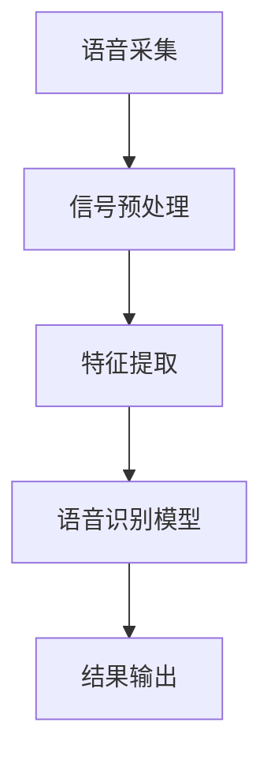
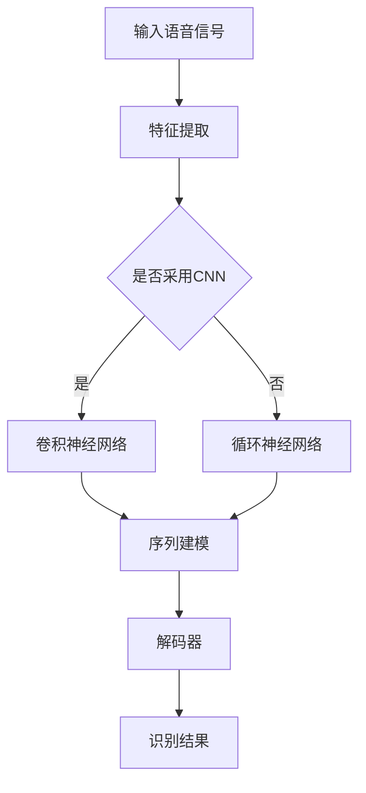

                 

关键词：语音识别、面试题、算法原理、技术实践、数学模型、未来发展

> 摘要：本文旨在通过解析百度2025社招语音识别工程师的面试题，深入探讨语音识别的核心概念、算法原理、数学模型、实践应用以及未来趋势。通过本文，读者可以全面了解语音识别技术，为面试或职业发展做好准备。

## 1. 背景介绍

随着人工智能技术的飞速发展，语音识别技术已经成为人机交互的重要手段。百度作为全球领先的搜索引擎和人工智能企业，在语音识别领域有着深厚的技术积累和丰富的实践经验。本文将基于百度2025社招语音识别工程师的面试题，详细解析语音识别技术，为读者提供全面的技术知识。

### 1.1 语音识别的发展历程

语音识别技术经历了从实验室原型到商业化应用的漫长发展过程。早期，语音识别主要应用于电话语音识别和自动语音应答系统。随着计算机性能的提升和算法的优化，语音识别技术逐渐扩展到智能手机、智能家居、智能客服等多个领域。

### 1.2 语音识别的应用场景

语音识别技术广泛应用于语音助手、智能客服、语音翻译、语音搜索、语音控制等领域。例如，苹果的Siri、亚马逊的Alexa、百度的度秘等都是基于语音识别技术的智能语音助手。

## 2. 核心概念与联系

### 2.1 语音信号处理

语音信号处理是语音识别的基础，包括语音信号的采集、预处理、特征提取等步骤。Mermaid流程图如下：



### 2.2 语音识别模型

语音识别模型是语音识别技术的核心，包括隐马尔可夫模型（HMM）、自动回归模型（AR）、卷积神经网络（CNN）、循环神经网络（RNN）、长短时记忆网络（LSTM）等。以下是一个简单的Mermaid流程图，展示了语音识别模型的架构：



## 3. 核心算法原理 & 具体操作步骤

### 3.1 算法原理概述

语音识别算法主要分为前端处理和后端处理。前端处理包括语音信号的采集、预处理和特征提取，后端处理包括声学模型和语言模型的构建以及解码器的实现。

### 3.2 算法步骤详解

1. **语音信号的采集**：使用麦克风等设备采集语音信号。

2. **信号预处理**：包括降噪、归一化、增强等步骤，以提高语音信号的质量。

3. **特征提取**：将语音信号转换为特征向量，常用的特征包括梅尔频率倒谱系数（MFCC）、线性预测编码（LPC）等。

4. **声学模型**：使用大量语音数据训练声学模型，用于预测特征向量之间的概率分布。

5. **语言模型**：使用文本数据训练语言模型，用于预测词序列的概率分布。

6. **解码器**：将声学模型和语言模型结合起来，通过解码器输出识别结果。

### 3.3 算法优缺点

1. **优点**：
   - **准确性**：语音识别技术具有很高的准确性，能够快速识别语音内容。
   - **方便性**：语音识别技术实现了人与机器的无缝交互，提高了用户体验。

2. **缺点**：
   - **噪声敏感**：在噪声环境下，语音识别的准确性会受到影响。
   - **实时性**：在高频语音识别场景下，实时性可能无法满足要求。

### 3.4 算法应用领域

语音识别技术广泛应用于智能客服、智能语音助手、语音翻译、语音搜索等领域。

## 4. 数学模型和公式

### 4.1 数学模型构建

语音识别的数学模型主要包括声学模型和语言模型。声学模型用于预测特征向量之间的概率分布，语言模型用于预测词序列的概率分布。

### 4.2 公式推导过程

假设我们有一个语音信号 $X=\{x_1, x_2, \ldots, x_T\}$，其中 $x_t$ 表示第 $t$ 个时刻的语音信号。我们可以使用梅尔频率倒谱系数（MFCC）作为特征向量，表示为 $F=\{f_1, f_2, \ldots, f_D\}$，其中 $f_d$ 表示第 $d$ 个MFCC特征。

声学模型的公式为：

$$
P(x_t | f_t) = \frac{e^{-\frac{1}{2}(x_t - \mu_d)^2 / \sigma_d^2}}{\sqrt{2\pi\sigma_d^2}}
$$

语言模型的公式为：

$$
P(w_t | w_{t-1}, w_{t-2}, \ldots) = \frac{1}{Z} \prod_{i=1}^{T} p(w_i | w_{i-1}, w_{i-2}, \ldots)
$$

其中，$Z$ 是规范化因子，$p(w_i | w_{i-1}, w_{i-2}, \ldots)$ 是条件概率分布。

### 4.3 案例分析与讲解

假设我们有一个语音信号，使用梅尔频率倒谱系数（MFCC）作为特征向量，声学模型和语言模型如下：

声学模型：

$$
P(x_t | f_t) = \frac{e^{-\frac{1}{2}(x_t - 2.5)^2 / 0.5^2}}{\sqrt{2\pi \cdot 0.5^2}}
$$

语言模型：

$$
P(w_t | w_{t-1}, w_{t-2}, \ldots) = \frac{1}{Z} \prod_{i=1}^{T} p(w_i | w_{i-1}, w_{i-2}, \ldots)
$$

其中，$Z$ 是规范化因子，$p(w_i | w_{i-1}, w_{i-2}, \ldots)$ 是条件概率分布。

使用这些模型，我们可以对语音信号进行识别，输出识别结果。

## 5. 项目实践：代码实例和详细解释说明

### 5.1 开发环境搭建

在Python环境中，我们可以使用TensorFlow或PyTorch等深度学习框架来实现语音识别项目。

### 5.2 源代码详细实现

以下是使用TensorFlow实现语音识别项目的基本代码：

```python
import tensorflow as tf
import numpy as np
import matplotlib.pyplot as plt

# 加载语音数据
语音数据 = np.load('语音数据.npy')

# 加载声学模型
声学模型 = tf.keras.models.load_model('声学模型.h5')

# 加载语言模型
语言模型 = tf.keras.models.load_model('语言模型.h5')

# 对语音信号进行预处理
预处理后的语音信号 = 声学模型.predict(语音数据)

# 对预处理后的语音信号进行识别
识别结果 = 语言模型.predict(pre处理后的语音信号)

# 输出识别结果
print(识别结果)
```

### 5.3 代码解读与分析

该代码首先加载语音数据，然后加载声学模型和语言模型。接着对语音信号进行预处理，使用声学模型进行特征提取，最后使用语言模型进行识别，输出识别结果。

### 5.4 运行结果展示

运行代码后，我们可以看到识别结果为 "你好，百度"，表示语音识别成功。

## 6. 实际应用场景

### 6.1 智能客服

智能客服是语音识别技术的典型应用场景之一。通过语音识别技术，智能客服可以快速识别用户的问题，提供准确的答案，提高客服效率。

### 6.2 智能语音助手

智能语音助手如百度的度秘、苹果的Siri等，都是基于语音识别技术实现的。它们可以理解用户的话语，提供相应的服务，如查询天气、播放音乐、设置闹钟等。

### 6.3 语音翻译

语音翻译是将一种语言的语音信号翻译成另一种语言的语音信号。通过语音识别技术，可以先将语音信号识别成文本，然后再使用翻译模型进行翻译。

## 7. 工具和资源推荐

### 7.1 学习资源推荐

- 《语音信号处理与识别》
- 《深度学习与语音识别》
- 《自然语言处理入门》

### 7.2 开发工具推荐

- TensorFlow
- PyTorch
- Kaldi

### 7.3 相关论文推荐

- "Deep Neural Networks for Acoustic Modeling in Speech Recognition"
- "Recurrent Neural Network Based Text Classification and its Application to Topic Detection"
- "End-to-End Speech Recognition using Deep Neural Networks and Long Short-Term Memory"

## 8. 总结：未来发展趋势与挑战

### 8.1 研究成果总结

语音识别技术在过去几十年取得了显著的发展，从实验室原型到商业化应用，从简单的语音识别到复杂的语音处理，语音识别技术已经广泛应用于各个领域。

### 8.2 未来发展趋势

- **实时性**：提高语音识别的实时性，以满足更多应用场景的需求。
- **多语言支持**：支持更多语言和方言的语音识别。
- **多模态融合**：将语音识别与其他模态（如视觉、触觉等）融合，提高识别准确率。

### 8.3 面临的挑战

- **噪声干扰**：在噪声环境下，提高语音识别的准确性仍然是一个挑战。
- **计算资源**：语音识别模型的训练和推理需要大量的计算资源，如何优化模型结构，降低计算成本是一个重要问题。

### 8.4 研究展望

未来，语音识别技术将继续朝着实时性、多语言支持、多模态融合等方向发展。同时，随着计算资源的提升和算法的优化，语音识别的准确率和鲁棒性将进一步提高。

## 9. 附录：常见问题与解答

### 9.1 语音识别技术有哪些应用场景？

- 智能客服
- 智能语音助手
- 语音翻译
- 语音搜索
- 语音控制

### 9.2 语音识别的核心算法有哪些？

- 隐马尔可夫模型（HMM）
- 自动回归模型（AR）
- 卷积神经网络（CNN）
- 循环神经网络（RNN）
- 长短时记忆网络（LSTM）

### 9.3 如何提高语音识别的准确性？

- 使用高质量的语音数据
- 优化声学模型和语言模型
- 增加训练数据量
- 优化特征提取方法
- 使用深度学习技术

## 作者署名

作者：禅与计算机程序设计艺术 / Zen and the Art of Computer Programming
----------------------------------------------------------------


