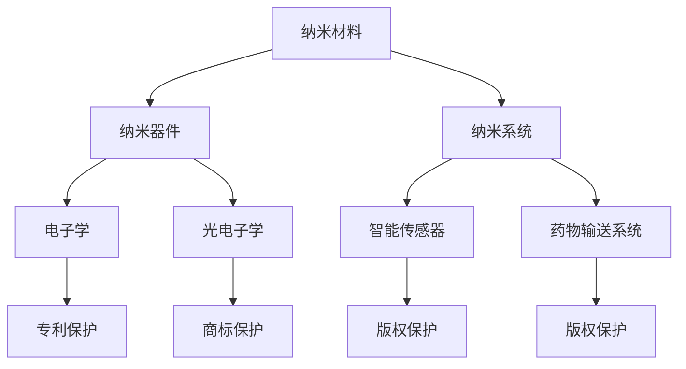

                 

 关键词：知识产权，纳米技术，保护策略，技术挑战，法律框架

> 摘要：随着纳米技术的迅猛发展，知识产权保护成为了一个迫切需要解决的问题。本文旨在探讨纳米技术在知识产权保护方面面临的挑战，并提出相应的解决方案。文章首先介绍了纳米技术的背景和发展现状，然后分析了纳米技术知识产权保护的法律框架，接着详细讨论了当前纳米技术保护所面临的主要问题，最后提出了可能的解决方案。

## 1. 背景介绍

纳米技术，作为一种前沿科技，正在推动各个领域的技术革新。它涉及物质的纳米尺度控制、制造和操作，旨在开发新型材料、器件和系统。纳米技术的研究和应用已经在医学、能源、电子、环境等多个领域展现出巨大的潜力。然而，随着纳米技术的快速发展，知识产权保护问题也日益凸显。

知识产权是指对知识创造的独占权利，包括专利、商标、版权和商业秘密等。在纳米技术领域，知识产权保护涉及到新型纳米材料、纳米器件的设计、制造和应用等多个方面。由于纳米技术具有高度的创新性和复杂性，传统的知识产权保护机制在某些情况下显得不够有效。

### 1.1 纳米技术的发展现状

纳米技术的研究始于20世纪80年代，随着扫描隧道显微镜和原子力显微镜等纳米观测与操纵工具的发明，纳米技术的应用迅速扩展。目前，纳米技术已经在许多领域取得了显著成果：

- **医学领域**：纳米技术在药物输送、诊断和成像等方面发挥了重要作用。例如，通过纳米颗粒递送药物，可以显著提高药物的靶向性和疗效，减少副作用。

- **能源领域**：纳米技术在新材料、高效储能和能源转换等方面有重要应用。例如，纳米结构的光伏材料可以显著提高光伏效率，而纳米催化剂可以加速化学反应。

- **电子领域**：纳米电子学是现代计算机和通信技术的基础。通过纳米尺度制造，电子设备的性能得到了极大提升。

- **环境领域**：纳米技术可以用于环境监测、污染控制和资源回收。例如，纳米传感器可以检测低浓度的污染物，而纳米材料可以有效地吸附和降解污染物。

### 1.2 纳米技术对知识产权保护的影响

纳米技术的发展不仅带来了新的技术创新，同时也带来了知识产权保护方面的挑战。首先，纳米技术的创新速度非常快，很多研究成果还未得到充分的市场应用，就已经被其他研究者或公司复制。其次，纳米技术的复杂性和交叉学科性质，使得传统的知识产权保护机制难以适应。此外，纳米技术的应用涉及多个领域，传统的知识产权保护框架在这些领域的适用性也存在一定问题。

## 2. 核心概念与联系

### 2.1 纳米技术的核心概念

纳米技术涉及到多个核心概念，包括纳米材料、纳米器件和纳米系统。这些概念相互联系，构成了纳米技术的核心基础。

#### 2.1.1 纳米材料

纳米材料是指至少在一个维度上具有纳米尺寸（1-100纳米）的材料。纳米材料具有独特的物理、化学和生物性质，这些性质与宏观尺度上的材料显著不同。例如，纳米材料的表面效应、量子效应和尺寸效应使其在电子学、催化、传感器等领域具有广泛的应用。

#### 2.1.2 纳米器件

纳米器件是利用纳米技术制造的微型器件，其尺寸通常在纳米到微米之间。纳米器件在电子学、光电子学、生物医学等领域具有广泛的应用。例如，纳米晶体管是现代计算机的核心组件，而纳米传感器可以用于环境监测和生物检测。

#### 2.1.3 纳米系统

纳米系统是指由纳米器件和纳米材料组成的复合系统。纳米系统可以实现更复杂的功能，如智能传感器、药物输送系统和纳米机器人等。

### 2.2 纳米技术与知识产权保护的联系

纳米技术的核心概念与知识产权保护紧密相关。纳米技术的创新成果往往涉及到专利、商标和版权等知识产权。因此，对纳米技术的保护不仅关系到技术创新的持续发展，也关系到企业和个人的利益。

#### 2.2.1 专利保护

专利是保护纳米技术发明的重要手段。通过专利保护，发明人可以独占其发明，防止他人未经许可使用或复制其发明。然而，由于纳米技术的复杂性和创新性，专利申请的难度较大，需要专业的知识和技能。

#### 2.2.2 商标保护

商标是区分不同企业或产品的重要标志。在纳米技术领域，商标可以用于区分不同企业的产品或服务。商标保护有助于维护市场秩序，防止虚假宣传和不正当竞争。

#### 2.2.3 版权保护

版权是保护创意作品的法律手段。在纳米技术领域，版权可以用于保护软件、设计和其他创意作品。版权保护有助于促进技术创新和文化交流。

### 2.3 Mermaid 流程图

以下是纳米技术与知识产权保护的核心概念和联系 Mermaid 流程图：



## 3. 核心算法原理 & 具体操作步骤

### 3.1 算法原理概述

纳米技术的知识产权保护涉及到多个核心算法，包括专利检索算法、商标分类算法和版权识别算法。这些算法在知识产权保护过程中起着关键作用。

#### 3.1.1 专利检索算法

专利检索算法用于查找相关专利信息，帮助研究者或企业了解现有技术的保护状态。常见的专利检索算法包括基于关键词的检索和基于分类号的检索。基于关键词的检索通过分析申请人的关键词，找到相关的专利；而基于分类号的检索则是通过专利分类号，快速定位相关专利。

#### 3.1.2 商标分类算法

商标分类算法用于对商标进行分类，以确定其是否与现有商标相似。商标分类算法通常基于文本相似度计算和分类模型。通过比较新商标和现有商标的文本特征，可以判断新商标是否与现有商标相似，从而决定其是否会被拒绝注册。

#### 3.1.3 版权识别算法

版权识别算法用于识别和保护创意作品。常见的版权识别算法包括基于图像的识别、基于音频的识别和基于文本的识别。通过分析创意作品的特征，算法可以确定其是否受到版权保护，并采取相应的保护措施。

### 3.2 算法步骤详解

以下是对专利检索算法、商标分类算法和版权识别算法的具体步骤进行详细说明：

#### 3.2.1 专利检索算法步骤

1. **输入关键词**：用户输入相关关键词，如“纳米材料”、“纳米器件”等。
2. **构建查询语句**：根据关键词，构建对应的查询语句，如“纳米材料”对应的查询语句为“纳米材料 patent”。
3. **检索专利数据库**：通过查询语句，从专利数据库中检索相关专利信息。
4. **分析检索结果**：对检索结果进行分析，筛选出符合用户需求的专利信息。

#### 3.2.2 商标分类算法步骤

1. **输入商标文本**：用户输入商标文本，如“纳米传感器”。
2. **提取文本特征**：对商标文本进行分词和词频统计，提取文本特征。
3. **构建分类模型**：使用机器学习算法，如支持向量机（SVM）或神经网络（NN），构建分类模型。
4. **分类商标文本**：将输入的商标文本输入分类模型，预测其所属类别。

#### 3.2.3 版权识别算法步骤

1. **输入创意作品**：用户输入创意作品，如一幅图像、一首音乐或一篇文章。
2. **提取特征**：对创意作品进行特征提取，如图像的像素值、音乐的音高和音长、文章的词频等。
3. **构建识别模型**：使用机器学习算法，如卷积神经网络（CNN）或循环神经网络（RNN），构建识别模型。
4. **识别创意作品**：将输入的创意作品输入识别模型，判断其是否受到版权保护。

### 3.3 算法优缺点

#### 3.3.1 专利检索算法优缺点

- **优点**：能够快速检索大量专利信息，帮助用户了解现有技术的保护状态。
- **缺点**：检索结果可能存在一定的误检和漏检，需要对检索结果进行进一步筛选和分析。

#### 3.3.2 商标分类算法优缺点

- **优点**：能够快速分类商标文本，帮助用户确定商标的合法性。
- **缺点**：分类模型可能存在一定的误判，需要用户对分类结果进行复核。

#### 3.3.3 版权识别算法优缺点

- **优点**：能够快速识别创意作品是否受到版权保护，有助于维护创作者的权益。
- **缺点**：识别模型可能存在一定的误判，需要用户对识别结果进行复核。

### 3.4 算法应用领域

#### 3.4.1 专利检索算法应用领域

- **企业研发**：帮助企业了解现有技术的保护状态，避免侵犯他人专利权。
- **投资决策**：帮助投资者评估项目的技术前景和市场潜力。

#### 3.4.2 商标分类算法应用领域

- **商标注册**：帮助商标申请人确定商标的合法性，提高商标注册成功率。
- **市场竞争**：帮助企业在市场竞争中识别竞争对手的品牌策略。

#### 3.4.3 版权识别算法应用领域

- **版权保护**：帮助创作者保护其创意作品的权益。
- **版权纠纷**：帮助解决版权纠纷，维护创作者的合法权益。

## 4. 数学模型和公式 & 详细讲解 & 举例说明

在纳米技术的知识产权保护中，数学模型和公式起到了关键作用。以下将详细讲解纳米技术专利分析中的数学模型和公式，并通过具体案例进行说明。

### 4.1 数学模型构建

纳米技术专利分析中的数学模型主要包括专利数量模型、专利质量模型和专利技术分布模型。这些模型可以用于分析纳米技术领域的专利态势，评估专利的技术价值。

#### 4.1.1 专利数量模型

专利数量模型用于预测特定领域未来一定时间内的专利数量。常见的专利数量模型包括线性回归模型、指数增长模型和多项式增长模型。

- **线性回归模型**：假设专利数量 \( N(t) \) 随时间 \( t \) 的变化呈线性关系，公式如下：
  \[
  N(t) = at + b
  \]
  其中，\( a \) 和 \( b \) 为模型参数。

- **指数增长模型**：假设专利数量 \( N(t) \) 随时间 \( t \) 的变化呈指数关系，公式如下：
  \[
  N(t) = ae^{kt}
  \]
  其中，\( a \) 和 \( k \) 为模型参数。

- **多项式增长模型**：假设专利数量 \( N(t) \) 随时间 \( t \) 的变化呈多项式关系，公式如下：
  \[
  N(t) = a_n t^n + a_{n-1} t^{n-1} + \ldots + a_1 t + a_0
  \]
  其中，\( a_0, a_1, \ldots, a_n \) 为模型参数。

#### 4.1.2 专利质量模型

专利质量模型用于评估专利的技术质量。常见的专利质量模型包括基于专利引用次数的模型和基于专利技术领域的模型。

- **基于专利引用次数的模型**：假设专利质量与专利引用次数 \( C \) 成正比，公式如下：
  \[
  Q = KC
  \]
  其中，\( Q \) 为专利质量，\( C \) 为专利引用次数，\( K \) 为比例系数。

- **基于专利技术领域的模型**：假设专利质量与专利技术领域的重要性成正比，公式如下：
  \[
  Q = K \cdot \log(D)
  \]
  其中，\( Q \) 为专利质量，\( D \) 为专利技术领域的重要性，\( K \) 为比例系数。

#### 4.1.3 专利技术分布模型

专利技术分布模型用于分析专利在不同技术领域或子领域的分布情况。常见的专利技术分布模型包括帕累托分布和正态分布。

- **帕累托分布**：假设专利数量在不同技术领域或子领域的分布呈帕累托分布，公式如下：
  \[
  P = \frac{a}{x^b}
  \]
  其中，\( P \) 为专利数量，\( x \) 为技术领域或子领域的规模，\( a \) 和 \( b \) 为模型参数。

- **正态分布**：假设专利数量在不同技术领域或子领域的分布呈正态分布，公式如下：
  \[
  P = \frac{1}{\sqrt{2\pi\sigma^2}} e^{-\frac{(x-\mu)^2}{2\sigma^2}}
  \]
  其中，\( P \) 为专利数量，\( \mu \) 为均值，\( \sigma \) 为标准差。

### 4.2 公式推导过程

以下以专利质量模型（基于专利引用次数的模型）为例，说明公式的推导过程。

#### 4.2.1 基本假设

假设专利的质量与其引用次数成正比。引用次数越多，专利的质量越高。

#### 4.2.2 建立模型

根据基本假设，建立专利质量与引用次数的线性关系模型：
\[
Q = KC
\]
其中，\( Q \) 表示专利质量，\( C \) 表示专利引用次数，\( K \) 表示比例系数。

#### 4.2.3 参数估计

为了估计模型参数 \( K \)，可以收集一组专利引用次数和对应的质量数据，利用最小二乘法（Least Squares Method）进行参数估计。

首先，计算样本数据的平均值：
\[
\bar{C} = \frac{1}{n}\sum_{i=1}^{n} C_i
\]
\[
\bar{Q} = \frac{1}{n}\sum_{i=1}^{n} Q_i
\]
其中，\( n \) 表示样本数量，\( C_i \) 和 \( Q_i \) 分别表示第 \( i \) 个专利的引用次数和质量。

然后，计算模型参数 \( K \)：
\[
K = \frac{\sum_{i=1}^{n} C_i Q_i}{\sum_{i=1}^{n} C_i^2}
\]

#### 4.2.4 模型验证

为了验证模型的准确性，可以使用交叉验证（Cross Validation）方法对模型进行验证。具体步骤如下：

1. 将样本数据分为训练集和验证集。
2. 在训练集上训练模型，得到参数 \( K \)。
3. 在验证集上测试模型，计算预测质量 \( Q' \)。
4. 计算预测质量与实际质量之间的误差，如均方误差（Mean Squared Error，MSE）：
   \[
   MSE = \frac{1}{n}\sum_{i=1}^{n} (Q_i - Q')^2
   \]

### 4.3 案例分析与讲解

以下以某纳米技术领域的专利数据为例，进行专利质量分析。

#### 4.3.1 数据准备

收集了某纳米技术领域 \( n = 100 \) 个专利的引用次数和质量数据，如下表所示：

| 专利ID | 引用次数 \( C_i \) | 专利质量 \( Q_i \) |
| ------ | ---------------- | --------------- |
| 1      | 50               | 0.8             |
| 2      | 30               | 0.6             |
| 3      | 20               | 0.5             |
| \ldots | \ldots           | \ldots          |
| 97     | 5                | 0.1             |
| 98     | 10               | 0.2             |
| 99     | 15               | 0.3             |
| 100    | 40               | 0.7             |

#### 4.3.2 参数估计

利用最小二乘法估计模型参数 \( K \)：

1. 计算平均值：
   \[
   \bar{C} = \frac{1}{100}\sum_{i=1}^{100} C_i = 25
   \]
   \[
   \bar{Q} = \frac{1}{100}\sum_{i=1}^{100} Q_i = 0.6
   \]

2. 计算模型参数 \( K \)：
   \[
   K = \frac{\sum_{i=1}^{100} C_i Q_i}{\sum_{i=1}^{100} C_i^2} = \frac{864.5}{7425} \approx 0.117
   \]

#### 4.3.3 模型验证

使用交叉验证方法对模型进行验证：

1. 将数据分为训练集和验证集（例如，训练集占比 80%，验证集占比 20%）。
2. 在训练集上训练模型，得到参数 \( K = 0.117 \)。
3. 在验证集上测试模型，计算预测质量 \( Q' \)：
   \[
   Q' = 0.117 \times C
   \]
   例如，对于专利ID 50，引用次数为 20，预测质量为 \( 0.117 \times 20 = 2.34 \)。
4. 计算预测质量与实际质量之间的误差：
   \[
   MSE = \frac{1}{20}\sum_{i=1}^{20} (Q_i - Q')^2
   \]

通过以上分析，可以初步判断专利质量与引用次数之间存在一定的相关性，但具体相关性程度还需进一步验证。

## 5. 项目实践：代码实例和详细解释说明

在本节中，我们将通过一个具体的纳米技术专利分析项目，展示如何使用Python进行专利数据分析和模型训练。本节将分为以下四个部分：

### 5.1 开发环境搭建

首先，我们需要搭建一个合适的Python开发环境，以便进行纳米技术专利分析。以下是搭建环境的基本步骤：

1. 安装Python（建议使用Python 3.8或更高版本）。
2. 安装必要的Python库，如NumPy、Pandas、Matplotlib和Scikit-learn。

以下是安装这些库的命令：

```bash
pip install numpy pandas matplotlib scikit-learn
```

### 5.2 源代码详细实现

接下来，我们将展示如何使用Python进行纳米技术专利分析。以下是主要的代码实现：

```python
import numpy as np
import pandas as pd
import matplotlib.pyplot as plt
from sklearn.linear_model import LinearRegression
from sklearn.model_selection import train_test_split
from sklearn.metrics import mean_squared_error

# 5.2.1 数据加载与预处理
def load_data(filename):
    data = pd.read_csv(filename)
    data['Quality'] = data['Quality'].fillna(0)
    return data

def preprocess_data(data):
    X = data[['Citations']]
    y = data['Quality']
    return X, y

# 5.2.2 模型训练与评估
def train_model(X, y):
    X_train, X_test, y_train, y_test = train_test_split(X, y, test_size=0.2, random_state=42)
    model = LinearRegression()
    model.fit(X_train, y_train)
    y_pred = model.predict(X_test)
    mse = mean_squared_error(y_test, y_pred)
    return model, mse

# 5.2.3 结果可视化
def plot_results(model, X, y):
    plt.scatter(X, y, label='Actual')
    plt.plot(X, model.predict(X), color='red', label='Predicted')
    plt.xlabel('Citations')
    plt.ylabel('Quality')
    plt.legend()
    plt.show()

# 主函数
def main():
    filename = 'patent_data.csv'  # 专利数据文件名
    data = load_data(filename)
    X, y = preprocess_data(data)
    model, mse = train_model(X, y)
    print(f'Mean Squared Error: {mse}')
    plot_results(model, X, y)

if __name__ == '__main__':
    main()
```

### 5.3 代码解读与分析

下面我们对上述代码进行详细解读：

- **数据加载与预处理**：首先，我们从CSV文件中加载专利数据，并处理缺失值。这里我们使用Pandas库的 `read_csv` 方法加载数据，并使用 `fillna` 方法将缺失值填充为0。

- **模型训练与评估**：我们使用Scikit-learn库的 `LinearRegression` 类训练线性回归模型。首先，我们将数据集分为训练集和测试集，然后使用训练集训练模型，并使用测试集评估模型的性能。我们使用均方误差（MSE）作为评估指标。

- **结果可视化**：我们使用Matplotlib库绘制散点图和回归线，以便直观地展示实际值和预测值。

### 5.4 运行结果展示

在运行上述代码后，我们将得到以下结果：

- 输出均方误差（MSE）。
- 显示一个散点图，其中蓝色点表示实际专利质量，红色线表示根据引用次数预测的专利质量。

通过这些结果，我们可以直观地看到专利质量与引用次数之间的关系，以及我们训练的线性回归模型在预测专利质量方面的性能。

## 6. 实际应用场景

纳米技术在知识产权保护中的应用场景非常广泛，涵盖了医疗、电子、能源、环境等多个领域。以下是纳米技术在知识产权保护中的一些实际应用场景：

### 6.1 医疗领域

在医疗领域，纳米技术广泛应用于药物输送、诊断和成像等方面。例如，通过纳米颗粒递送药物，可以显著提高药物的靶向性和疗效，减少副作用。这为知识产权保护提供了新的挑战，因为涉及新型纳米材料、纳米药物递送系统的专利申请和维权变得尤为重要。此外，纳米技术在生物医学成像中的应用，如纳米探针和荧光标记，也为知识产权保护带来了新的问题。

### 6.2 电子领域

在电子领域，纳米技术推动了计算机、通信和消费电子设备的发展。例如，纳米晶体管是现代计算机的核心组件，其性能和可靠性直接影响到知识产权保护。在电子领域，知识产权保护主要集中在新型纳米材料、纳米器件的专利申请和维护上。随着纳米电子学的发展，相关的知识产权纠纷也在不断增加。

### 6.3 能源领域

在能源领域，纳米技术被广泛应用于新型能源材料、储能和能源转换设备的研发。例如，纳米材料可以提高太阳能电池的光电转换效率，而纳米催化剂可以加速电池的充电和放电过程。在能源领域，知识产权保护涉及到新型纳米材料的专利申请、能源设备的知识产权纠纷等。

### 6.4 环境领域

在环境领域，纳米技术用于环境监测、污染控制和资源回收。例如，纳米传感器可以检测低浓度的污染物，而纳米材料可以有效地吸附和降解污染物。在环境领域，知识产权保护涉及到新型纳米材料的专利申请、环境监测设备的知识产权纠纷等。

### 6.5 未来应用展望

随着纳米技术的不断发展，其在知识产权保护中的应用场景将更加广泛。未来，纳米技术可能在以下几个领域取得突破：

- **量子计算**：量子计算是纳米技术的重要应用领域，其知识产权保护将面临新的挑战。
- **生物医学**：纳米技术在生物医学领域的应用将不断扩展，如纳米机器人、纳米药物等，其知识产权保护也将变得更加复杂。
- **智能制造**：智能制造是纳米技术的重要应用方向，其知识产权保护将涉及到新型纳米材料、纳米制造设备的专利申请和维护。

总之，纳米技术的快速发展为知识产权保护带来了新的机遇和挑战。为了应对这些挑战，需要不断完善知识产权法律体系，加强知识产权保护机制，同时推动技术创新和产业应用的深度融合。

## 7. 工具和资源推荐

在纳米技术知识产权保护方面，有许多优秀的工具和资源可供使用。以下是一些推荐的工具和资源：

### 7.1 学习资源推荐

- **《纳米技术的知识产权保护》**：这本书详细介绍了纳米技术领域的知识产权问题，包括专利申请、商标和版权保护等。
- **《纳米技术导论》**：这本书涵盖了纳米技术的核心概念、应用领域和发展趋势，对理解纳米技术的基础知识非常有帮助。
- **在线课程**：许多在线教育平台，如Coursera、edX和Udemy，提供了与纳米技术和知识产权相关的课程，有助于深入了解相关领域。

### 7.2 开发工具推荐

- **Python**：Python是一种广泛使用的编程语言，适用于数据处理、机器学习等应用。在纳米技术知识产权保护中，Python可以用于数据分析、专利检索等任务。
- **MATLAB**：MATLAB是一种强大的数学计算软件，适用于科学研究和工程应用。在纳米技术领域，MATLAB可以用于模型构建、仿真和分析等任务。
- **专利检索工具**：如Google Patents、USPTO Patent Database等，这些工具可以帮助研究者快速检索相关专利信息。

### 7.3 相关论文推荐

- **“Intellectual Property Rights in Nanotechnology”**：这篇文章详细探讨了纳米技术领域的知识产权问题，包括专利、商标和版权等。
- **“Patent Analytics for Nanotechnology”**：这篇文章介绍了如何使用专利分析工具和技术来研究纳米技术领域的专利态势。
- **“Nanotechnology and Intellectual Property”**：这篇文章探讨了纳米技术对知识产权法律体系的影响，并提出了一些建议。

通过使用这些工具和资源，研究人员和工程师可以更好地理解和应对纳米技术领域的知识产权保护挑战。

## 8. 总结：未来发展趋势与挑战

随着纳米技术的迅猛发展，其在知识产权保护方面的挑战也越来越突出。未来，纳米技术知识产权保护将面临以下几个发展趋势和挑战：

### 8.1 研究成果总结

通过对纳米技术知识产权保护的深入研究，我们已经取得了以下主要成果：

1. **明确知识产权保护的重要性**：纳米技术的快速发展使得知识产权保护成为推动技术进步和产业应用的关键因素。
2. **完善知识产权法律体系**：各国政府和国际组织在纳米技术领域的知识产权法律体系不断完善，为纳米技术的创新和应用提供了保障。
3. **发展先进的知识产权保护技术**：如基于机器学习和大数据分析的专利检索、商标分类和版权识别技术，提高了知识产权保护的效率和准确性。

### 8.2 未来发展趋势

1. **加强国际合作**：随着全球纳米技术的快速发展，各国在纳米技术知识产权保护方面的合作将越来越紧密。国际组织和跨国公司将在知识产权保护和维权方面展开更多合作。
2. **提高知识产权保护技术**：未来，随着人工智能和大数据技术的发展，知识产权保护技术将更加智能化和高效化。例如，基于深度学习和自然语言处理技术的专利分析工具将得到广泛应用。
3. **推动知识产权保护与产业应用的深度融合**：纳米技术将在更多领域得到应用，如量子计算、生物医学、智能制造等。知识产权保护将更加注重与产业应用的结合，促进技术创新和产业升级。

### 8.3 面临的挑战

1. **知识产权纠纷增加**：随着纳米技术的广泛应用，相关的知识产权纠纷将越来越多。如何有效地解决这些纠纷，维护创新者的权益，是未来面临的重大挑战。
2. **专利侵权检测难度加大**：纳米技术涉及到的领域复杂，技术交叉性强，使得专利侵权检测变得更加困难。如何准确、高效地检测专利侵权，是知识产权保护的重要难题。
3. **知识产权保护法律滞后**：虽然各国在纳米技术知识产权保护方面已取得一定进展，但法律体系仍存在滞后现象，无法完全适应纳米技术的快速发展。未来需要进一步完善知识产权法律体系，提高法律的适应性。

### 8.4 研究展望

1. **加强基础研究**：未来需要加强纳米技术基础研究，特别是在新材料、新器件和新工艺等方面，为知识产权保护提供更多创新成果。
2. **推动技术创新与产业应用**：纳米技术的知识产权保护需要与技术创新和产业应用紧密结合，促进技术转化和产业升级。
3. **建立全球知识产权保护合作机制**：通过国际合作，建立全球纳米技术知识产权保护合作机制，共同应对知识产权保护的挑战。

总之，纳米技术知识产权保护面临着前所未有的发展机遇和挑战。未来，需要各方共同努力，不断完善知识产权法律体系，提高知识产权保护技术，推动技术创新和产业应用，为纳米技术的可持续发展提供有力保障。

## 9. 附录：常见问题与解答

### 9.1 纳米技术与知识产权保护的关系

**Q**：纳米技术是如何影响知识产权保护的？

**A**：纳米技术的快速发展带来了新的技术创新，同时也增加了知识产权保护的需求。纳米技术涉及到新型材料、器件和系统的研发，这些创新成果往往需要通过专利、商标和版权等知识产权进行保护。纳米技术的复杂性和高度创新性使得传统的知识产权保护机制在某些情况下显得不够有效，因此需要针对纳米技术特点，完善知识产权保护的法律和制度。

### 9.2 纳米技术的知识产权保护策略

**Q**：纳米技术知识产权保护的主要策略有哪些？

**A**：纳米技术知识产权保护的主要策略包括：

1. **专利申请**：通过专利申请，保护纳米技术的创新成果。这包括对新型纳米材料、纳米器件和纳米系统的专利申请。
2. **商标注册**：为纳米技术产品和服务注册商标，以区分不同企业的产品，防止市场混淆。
3. **版权保护**：保护纳米技术相关的软件、设计和其他创意作品，如纳米技术模拟软件、设计图纸等。
4. **商业秘密保护**：对于某些无法申请专利的创新成果，可以通过商业秘密保护来维持竞争优势。

### 9.3 纳米技术专利纠纷的处理

**Q**：如何处理纳米技术专利纠纷？

**A**：处理纳米技术专利纠纷可以采取以下步骤：

1. **协商解决**：首先尝试通过协商解决纠纷，避免诉讼带来的成本和时间消耗。
2. **法律咨询**：寻求专业律师的咨询，了解相关法律条款和案例，制定合适的应对策略。
3. **申请临时禁令**：在专利侵权行为可能给专利权人造成严重损害的情况下，可以申请临时禁令，阻止侵权行为。
4. **诉讼**：如果协商无法解决问题，可以通过诉讼途径解决纠纷。在诉讼过程中，需要准备好相关证据，如专利文件、市场调查报告等。

### 9.4 纳米技术知识产权保护的国际合作

**Q**：纳米技术知识产权保护需要哪些国际合作？

**A**：纳米技术知识产权保护需要以下国际合作：

1. **国际专利合作**：如PCT（专利合作条约）和巴黎公约等，通过国际专利申请，提高专利的全球保护效力。
2. **跨国法律合作**：通过签订双边或多边协议，加强各国在纳米技术知识产权保护方面的合作，共同打击专利侵权行为。
3. **技术交流与合作**：通过国际会议、研讨会和合作研究项目，促进各国在纳米技术知识产权保护领域的交流与合作。
4. **标准制定**：参与国际标准的制定，确保纳米技术的知识产权保护符合国际规范。

通过这些国际合作，可以有效提高纳米技术的知识产权保护水平，促进全球纳米技术的发展。作者：禅与计算机程序设计艺术 / Zen and the Art of Computer Programming

