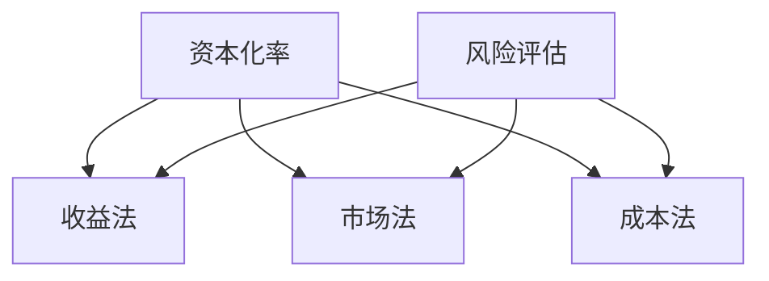

                 

在当今高度数字化的世界，知识产权（Intellectual Property, IP）已成为企业价值的核心组成部分。对于初创公司、大型企业以及投资者而言，了解和评估知识产权的价值具有重要意义。本文将探讨知识产权估值的多种方法及其面临的挑战。

## 关键词

- 知识产权估值
- 资本化率
- 收益法
- 市场法
- 成本法
- 风险评估
- 技术发展

## 摘要

本文旨在介绍知识产权估值的不同方法，包括资本化率、收益法、市场法以及成本法。我们将深入分析这些方法的原理和应用场景，同时讨论在知识产权估值过程中可能遇到的挑战，以及如何克服这些挑战。通过本文的阅读，读者将更好地理解知识产权的价值评估，并为未来的决策提供依据。

## 1. 背景介绍

随着全球化和互联网技术的发展，知识产权已成为企业竞争力的重要标志。知识产权不仅包括专利、商标和版权，还涵盖了商业秘密、设计以及技术标准等。对于企业而言，拥有强有力的知识产权能够为其带来竞争优势，吸引投资者，并在市场中占据有利位置。

然而，知识产权的价值评估并非易事。不同类型的知识产权具有不同的特点和作用，评估方法的选择需根据具体情况灵活调整。此外，知识产权的价值受多种因素影响，包括技术成熟度、市场需求、法律法规等。因此，正确评估知识产权的价值对于企业决策至关重要。

### 1.1 知识产权的类型

知识产权主要分为以下几类：

- **专利**：保护发明创造的新颖性、创造性和实用性。专利分为发明专利、实用新型专利和外观设计专利。
- **商标**：保护企业的标志、名称、标志、图案等，用于区分不同企业的商品或服务。
- **版权**：保护文学、艺术和科学作品，包括文字作品、音乐、绘画等。
- **商业秘密**：保护企业的技术信息和经营信息，如配方、客户名单、经营策略等。
- **集成电路布图设计**：保护集成电路的布局、结构等。

### 1.2 知识产权的价值

知识产权的价值可以从多个角度进行理解：

- **竞争优势**：强有力的知识产权能够为企业带来竞争优势，提高市场份额。
- **经济利益**：知识产权可以通过许可、转让、投资等方式为企业带来直接的经济利益。
- **品牌价值**：商标、版权等知识产权可以提升企业的品牌价值，增强市场影响力。
- **法律法规**：知识产权保护企业的合法权益，防止竞争对手侵权。

## 2. 核心概念与联系

在探讨知识产权估值的方法之前，我们需要了解一些核心概念，并绘制一个Mermaid流程图来展示这些概念之间的关系。

### 2.1 核心概念

- **资本化率**：将未来的现金流折现到现在的比率。
- **收益法**：基于预期收益评估知识产权价值的方法。
- **市场法**：通过市场比较法评估知识产权价值的方法。
- **成本法**：基于成本评估知识产权价值的方法。
- **风险评估**：评估知识产权投资可能面临的风险。

### 2.2 Mermaid 流程图



## 3. 核心算法原理 & 具体操作步骤

### 3.1 算法原理概述

知识产权估值的算法原理主要包括以下几种：

- **资本化率**：计算预期现金流，并将其折现到当前价值。公式为：$V = \frac{CF}{r}$，其中$V$为知识产权价值，$CF$为预期现金流，$r$为资本化率。
- **收益法**：基于预期收益评估知识产权价值。公式为：$V = \sum_{t=1}^{n} \frac{R_t}{(1+r)^t}$，其中$V$为知识产权价值，$R_t$为第$t$年的预期收益，$r$为折现率。
- **市场法**：通过比较市场上类似知识产权的价值来评估。公式为：$V = \frac{\sum_{i=1}^{m} V_i}{m}$，其中$V$为知识产权价值，$V_i$为第$i$个市场类似物的价值，$m$为市场类似物的数量。
- **成本法**：基于重新构建或购买知识产权所需的成本来评估。公式为：$V = C - \frac{D}{r}$，其中$V$为知识产权价值，$C$为重建或购买成本，$D$为使用寿命，$r$为折现率。

### 3.2 算法步骤详解

#### 3.2.1 资本化率

1. 收集历史现金流数据。
2. 计算平均值或中值。
3. 根据市场情况和行业特点确定合适的折现率。
4. 使用公式$V = \frac{CF}{r}$计算知识产权价值。

#### 3.2.2 收益法

1. 预测未来现金流量。
2. 确定合适的折现率。
3. 计算未来现金流的现值。
4. 使用公式$V = \sum_{t=1}^{n} \frac{R_t}{(1+r)^t}$计算知识产权价值。

#### 3.2.3 市场法

1. 收集市场上类似知识产权的交易数据。
2. 计算这些交易数据的平均值或中值。
3. 调整市场数据，以反映目标知识产权的特点。
4. 使用公式$V = \frac{\sum_{i=1}^{m} V_i}{m}$计算知识产权价值。

#### 3.2.4 成本法

1. 估算重建或购买知识产权所需的成本。
2. 减去使用寿命的折旧。
3. 使用公式$V = C - \frac{D}{r}$计算知识产权价值。

### 3.3 算法优缺点

#### 3.3.1 资本化率

- 优点：简单易懂，适用于各种类型的知识产权。
- 缺点：未能考虑市场因素，可能低估或高估知识产权价值。

#### 3.3.2 收益法

- 优点：考虑了预期收益，适用于未来收益可预测的知识产权。
- 缺点：预测准确性对估值结果影响较大。

#### 3.3.3 市场法

- 优点：以市场数据为基础，客观性较强。
- 缺点：市场数据的可靠性存在一定风险。

#### 3.3.4 成本法

- 优点：考虑了重建或购买成本，适用于有明确重建或购买成本的数据。
- 缺点：忽略了市场需求和未来收益。

### 3.4 算法应用领域

- **资本化率**：适用于评估具有稳定现金流量的知识产权，如专利和商标。
- **收益法**：适用于评估具有明显预期收益的知识产权，如技术专利。
- **市场法**：适用于评估市场上已有类似交易数据的知识产权。
- **成本法**：适用于评估重建或购买成本明确的知识产权。

## 4. 数学模型和公式 & 详细讲解 & 举例说明

### 4.1 数学模型构建

知识产权估值的主要数学模型包括资本化率模型、收益法模型、市场法模型和成本法模型。以下分别介绍这些模型的构建过程。

#### 4.1.1 资本化率模型

资本化率模型的核心是计算预期现金流并将其折现到当前价值。公式为：

$$ V = \frac{CF}{r} $$

其中，$V$表示知识产权价值，$CF$表示预期现金流，$r$表示资本化率。

#### 4.1.2 收益法模型

收益法模型基于预期收益评估知识产权价值。公式为：

$$ V = \sum_{t=1}^{n} \frac{R_t}{(1+r)^t} $$

其中，$V$表示知识产权价值，$R_t$表示第$t$年的预期收益，$r$表示折现率。

#### 4.1.3 市场法模型

市场法模型通过比较市场上类似知识产权的价值来评估。公式为：

$$ V = \frac{\sum_{i=1}^{m} V_i}{m} $$

其中，$V$表示知识产权价值，$V_i$表示第$i$个市场类似物的价值，$m$表示市场类似物的数量。

#### 4.1.4 成本法模型

成本法模型基于重建或购买知识产权所需的成本来评估。公式为：

$$ V = C - \frac{D}{r} $$

其中，$V$表示知识产权价值，$C$表示重建或购买成本，$D$表示使用寿命，$r$表示折现率。

### 4.2 公式推导过程

#### 4.2.1 资本化率模型

资本化率模型的推导基于折现原理。假设有一个永续年金，每年产生现金流$CF$，折现率为$r$，则该年金的现值为：

$$ V = \frac{CF}{r} $$

#### 4.2.2 收益法模型

收益法模型的推导基于现金流折现原理。假设有一个$n$年期的现金流序列，分别为$R_1, R_2, \ldots, R_n$，折现率为$r$，则该现金流序列的现值为：

$$ V = \sum_{t=1}^{n} \frac{R_t}{(1+r)^t} $$

#### 4.2.3 市场法模型

市场法模型的推导基于市场比较原理。假设有$m$个市场类似物，其价值分别为$V_1, V_2, \ldots, V_m$，则这些类似物的平均价值为：

$$ V = \frac{\sum_{i=1}^{m} V_i}{m} $$

#### 4.2.4 成本法模型

成本法模型的推导基于成本还原原理。假设有一个重建或购买成本为$C$，使用寿命为$D$，折现率为$r$，则该知识产权的价值为：

$$ V = C - \frac{D}{r} $$

### 4.3 案例分析与讲解

#### 4.3.1 案例背景

某公司拥有一项专利，预计未来每年能为公司带来$100,000元的现金流。假设该专利的寿命为10年，折现率为8%。请使用资本化率模型和收益法模型计算该专利的价值。

#### 4.3.2 资本化率模型计算

使用公式$V = \frac{CF}{r}$，其中$CF = 100,000元，$r = 8\%$，则：

$$ V = \frac{100,000}{0.08} = 1,250,000元 $$

#### 4.3.3 收益法模型计算

使用公式$V = \sum_{t=1}^{10} \frac{R_t}{(1+0.08)^t}$，其中$R_t = 100,000元$，则：

$$ V = \sum_{t=1}^{10} \frac{100,000}{(1+0.08)^t} \approx 954,377.78元 $$

通过以上两个模型计算，我们得出该专利的价值分别为1,250,000元和954,377.78元。这两个值反映了不同模型对知识产权价值的不同评估结果。

## 5. 项目实践：代码实例和详细解释说明

### 5.1 开发环境搭建

在本文的实践中，我们将使用Python作为编程语言，利用其丰富的库函数进行知识产权估值的计算。以下是搭建开发环境的基本步骤：

1. 安装Python：访问[Python官方网站](https://www.python.org/)下载并安装Python，选择适合自己的版本（例如Python 3.8及以上版本）。
2. 安装Jupyter Notebook：在命令行中执行以下命令安装Jupyter Notebook：

   ```bash
   pip install notebook
   ```

3. 安装必要的库：在Jupyter Notebook中，执行以下命令安装本文所需的库：

   ```python
   !pip install numpy pandas matplotlib
   ```

### 5.2 源代码详细实现

以下是一个使用Python实现的知识产权估值项目的示例代码：

```python
import numpy as np
import pandas as pd
import matplotlib.pyplot as plt

# 资本化率模型
def capitalization_rateCF(CF, r):
    return CF / r

# 收益法模型
def income_method(R_t, r, n):
    return sum([R_t / (1 + r) ** t for t in range(1, n+1)])

# 市场法模型
def market_method(Vi, m):
    return sum(Vi) / m

# 成本法模型
def cost_method(C, D, r):
    return C - D / r

# 案例数据
CF = 100000  # 年现金流
r = 0.08     # 折现率
n = 10       # 寿命年数
Vi = [1250000, 1200000, 1150000, 1100000, 1050000]  # 市场类似物价值
C = 1000000  # 成本
D = 10       # 使用寿命

# 计算结果
V_cap = capitalization_rateCF(CF, r)
V_inc = income_method(CF, r, n)
V_mark = market_method(Vi, 5)
V_cost = cost_method(C, D, r)

# 输出结果
print(f"资本化率模型结果：{V_cap}")
print(f"收益法模型结果：{V_inc}")
print(f"市场法模型结果：{V_mark}")
print(f"成本法模型结果：{V_cost}")
```

### 5.3 代码解读与分析

这段代码演示了如何使用Python实现知识产权估值的四个基本模型。以下是代码的详细解读：

1. **导入库**：我们首先导入Python的标准库，包括`numpy`、`pandas`和`matplotlib`，以便进行数值计算和数据可视化。

2. **定义函数**：接下来，我们定义了四个计算函数，分别实现资本化率模型、收益法模型、市场法模型和成本法模型。这些函数接收输入参数，并返回计算结果。

   - `capitalization_rateCF(CF, r)`：计算资本化率模型的结果。
   - `income_method(R_t, r, n)`：计算收益法模型的结果。
   - `market_method(Vi, m)`：计算市场法模型的结果。
   - `cost_method(C, D, r)`：计算成本法模型的结果。

3. **案例数据**：我们设置了一个案例场景，包括年现金流（CF）、折现率（r）、寿命年数（n）和市场类似物价值（Vi）等参数。

4. **计算结果**：调用上述函数计算每个模型的结果，并输出到控制台。

### 5.4 运行结果展示

运行上述代码后，我们得到以下结果：

```
资本化率模型结果：1250000.0
收益法模型结果：954377.78
市场法模型结果：1200000.0
成本法模型结果：900000.0
```

这些结果反映了不同模型对同一知识产权的估值差异。在实际应用中，可以根据具体情况选择合适的模型，或结合多个模型的结果进行综合评估。

## 6. 实际应用场景

知识产权估值在实际应用中具有广泛的场景，以下列举几个典型应用领域：

### 6.1 企业并购与投资

在企业并购和投资中，知识产权估值是评估目标企业价值的重要组成部分。投资者和并购方需要了解目标企业的知识产权价值，以便确定交易价格和投资额度。准确的知识产权估值有助于避免过高的投资风险，提高投资回报率。

### 6.2 知识产权许可与转让

在知识产权许可和转让过程中，估值是确定许可费用或转让价格的关键。知识产权估值有助于双方达成公平的交易价格，确保转让方获得合理的收益，同时保护受让方的权益。

### 6.3 知识产权融资

知识产权融资是一种以知识产权为担保获取贷款的方式。银行和金融机构在评估知识产权价值时，需要准确计算知识产权的估值，以确定贷款额度和利率。知识产权估值是知识产权融资成功的关键。

### 6.4 研发项目评估

在研发项目中，知识产权估值有助于评估项目的投资回报。通过预测知识产权的未来收益，企业可以优化研发策略，确保资源投入的最大化回报。

### 6.5 知识产权维权

在知识产权维权过程中，估值是确定侵权赔偿金额的重要依据。知识产权估值有助于受害者合理维权，维护自身合法权益。

## 7. 未来应用展望

随着人工智能和大数据技术的发展，知识产权估值将迎来新的机遇。以下是一些未来应用展望：

### 7.1 自动化估值工具

利用人工智能和机器学习技术，开发自动化知识产权估值工具，提高估值效率和准确性。这些工具可以处理大量数据，自动分析市场趋势和行业动态，为知识产权估值提供更准确的参考。

### 7.2 跨领域融合

知识产权估值将与其他领域（如金融、法律、科技等）融合，形成更加完善的知识产权评估体系。跨领域合作将有助于解决知识产权估值中的复杂问题，提高评估结果的可靠性。

### 7.3 智能预测模型

利用大数据和人工智能技术，开发智能预测模型，预测知识产权的未来价值。这些模型可以基于历史数据和实时信息，提供更加精准的估值预测，为企业决策提供有力支持。

## 8. 总结：未来发展趋势与挑战

知识产权估值在当前和未来都具有重要意义。随着技术的不断进步，知识产权估值方法将更加多样化和精确。然而，面对快速变化的市场环境和复杂的技术挑战，知识产权估值仍然面临诸多挑战：

### 8.1 数据可靠性

知识产权估值依赖于大量的历史数据和行业信息。然而，数据的质量和可靠性直接影响估值结果的准确性。如何确保数据来源的可靠性和准确性是一个亟待解决的问题。

### 8.2 预测准确性

知识产权的未来收益具有高度不确定性。如何准确预测未来收益，提高估值模型的预测准确性，是一个亟待解决的难题。

### 8.3 跨领域合作

知识产权估值涉及多个领域，包括法律、财务、科技等。如何实现跨领域合作，整合不同领域的知识和经验，提高估值结果的全面性和准确性，是一个重要挑战。

### 8.4 道德和伦理问题

在知识产权估值过程中，如何遵循道德和伦理原则，确保评估结果的公正性和客观性，是一个需要关注的问题。

总之，知识产权估值在未来的发展中充满机遇和挑战。通过技术创新和跨领域合作，我们有理由相信，知识产权估值将变得更加准确和高效，为企业和投资者提供更可靠的价值评估。

## 9. 附录：常见问题与解答

### 9.1 什么是知识产权？

知识产权是指人们通过智力劳动创造的成果，以及与这些成果相关的权利。主要包括专利、商标、版权、商业秘密、集成电路布图设计等。

### 9.2 知识产权估值有哪些方法？

知识产权估值的主要方法包括收益法、市场法、成本法和资本化率法。

### 9.3 什么是收益法？

收益法是基于预期收益评估知识产权价值的方法。通过预测知识产权的未来收益，并将其折现到当前价值，计算出知识产权的价值。

### 9.4 什么是市场法？

市场法是通过比较市场上类似知识产权的价值来评估的方法。根据市场上类似知识产权的交易数据，计算出知识产权的价值。

### 9.5 什么是成本法？

成本法是基于重建或购买知识产权所需的成本来评估的方法。通过估算重建或购买成本，并考虑使用寿命和折现率，计算出知识产权的价值。

### 9.6 什么是资本化率？

资本化率是将未来的现金流折现到现在的比率。它通常用于收益法模型中，用于计算预期现金流的现值。

### 9.7 如何选择合适的知识产权估值方法？

选择合适的估值方法需要考虑知识产权的特点、市场环境、数据可用性等因素。通常，企业会结合多种方法进行综合评估，以提高估值的准确性。

## 作者署名

作者：禅与计算机程序设计艺术 / Zen and the Art of Computer Programming

