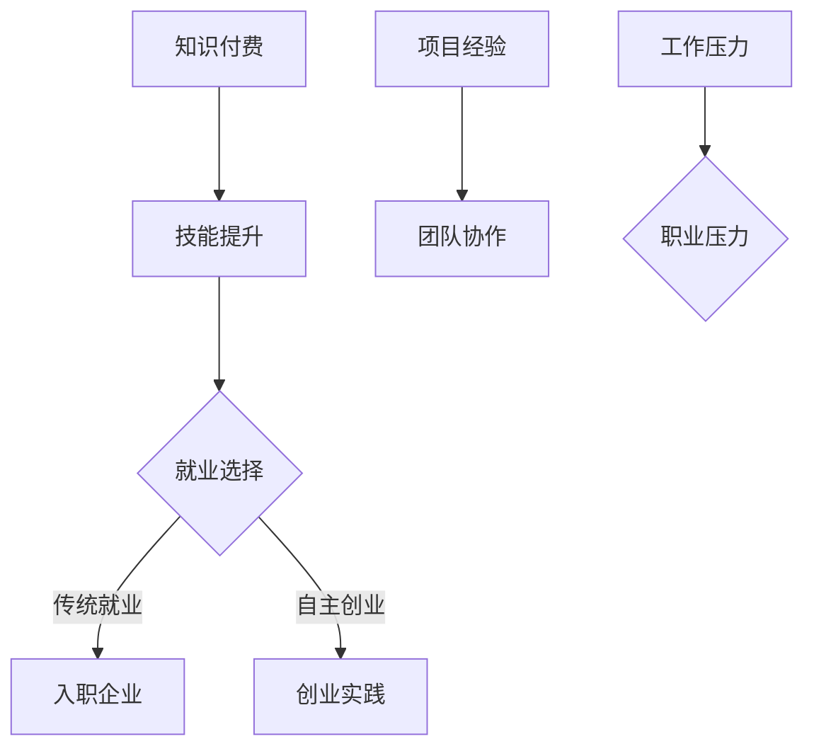
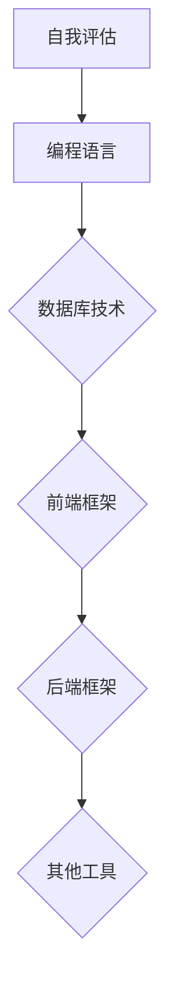
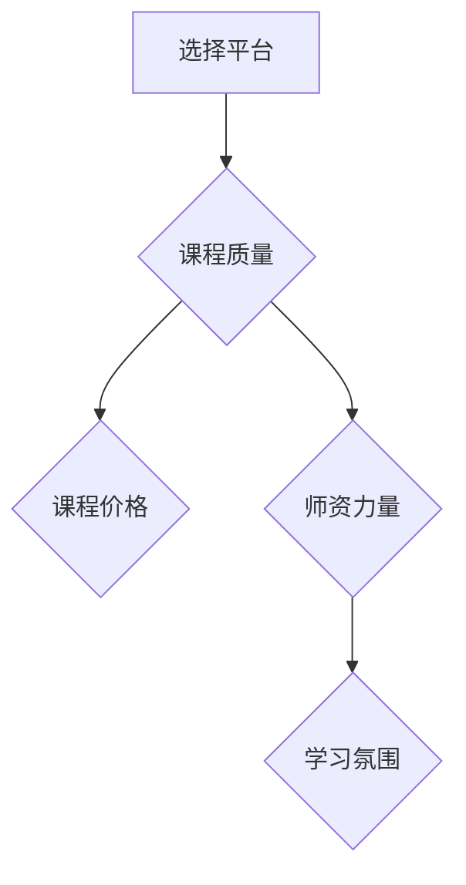
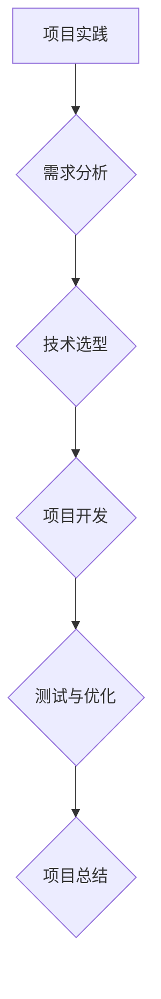
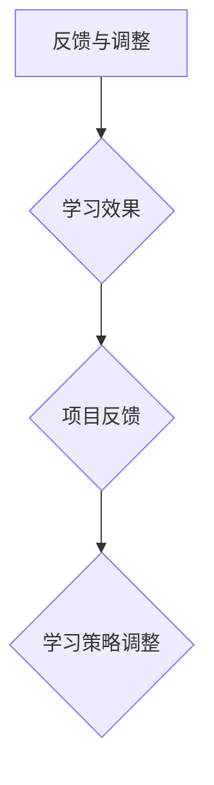
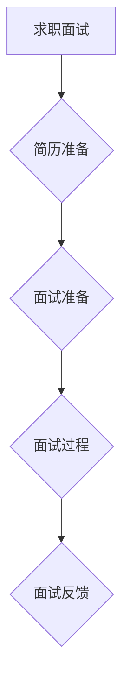
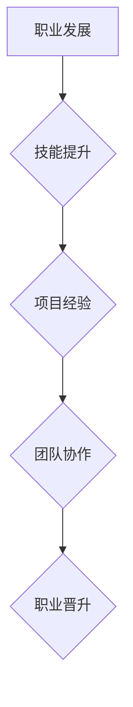

                 

关键词：知识付费、传统就业、程序员、权衡、技术学习、职业发展、市场趋势

> 摘要：本文将深入探讨知识付费与传统就业对于程序员职业发展的影响。通过对知识付费模式的优缺点分析，与传统就业方式对比，总结程序员在选择职业路径时可能面临的问题与机遇，并展望未来行业的发展趋势。

## 1. 背景介绍

在当今数字化时代，信息技术的发展日新月异，程序员的职业需求持续增长。然而，随着市场需求的不断变化，程序员在职业发展中面临诸多挑战。一方面，技术更新换代迅速，程序员需要不断学习新的技术和工具来提升自身竞争力；另一方面，行业竞争激烈，传统就业方式可能无法满足程序员对于职业发展和收入增长的需求。

知识付费作为一种新型的学习模式，近年来在程序员群体中逐渐流行。通过付费获取高质量的技术课程、实战经验和行业专家指导，程序员能够更加高效地提升自身技能。与此同时，传统就业方式，如入职企业、参与项目，仍然是许多程序员的职业选择。这两种模式各有优缺点，对于程序员的职业发展产生了不同的影响。

本文将从以下几个方面展开讨论：首先，分析知识付费模式的优点和局限性；其次，对比传统就业方式的优缺点；然后，探讨程序员在选择职业路径时可能面临的问题；接着，分析未来行业的发展趋势；最后，总结研究成果，展望未来。

## 2. 核心概念与联系

### 2.1 知识付费

知识付费指的是用户通过付费获取高质量的知识产品或服务，如在线课程、电子书、专业咨询等。知识付费模式的核心在于提供有价值的内容，满足用户在特定领域的知识需求。

#### 知识付费模式优势：

1. **高效学习**：用户可以根据自身需求选择合适的学习资源，快速获取所需知识。
2. **个性化推荐**：知识付费平台可以通过大数据和人工智能技术为用户提供个性化的学习推荐，提高学习效果。
3. **权威性**：知识付费平台上的课程或内容往往由行业专家或专业人士提供，具有较高权威性。

#### 知识付费模式劣势：

1. **费用高昂**：高质量的知识产品或服务往往需要用户支付较高费用，对于部分用户而言可能负担较重。
2. **学习效果难以保证**：知识付费模式下的学习效果取决于用户的学习态度和执行力，部分用户可能无法达到预期效果。

### 2.2 传统就业

传统就业指的是通过入职企业、参与项目等方式获取职业发展的途径。传统就业模式具有以下特点：

#### 传统就业优势：

1. **稳定收入**：入职企业后，程序员通常可以获得稳定的薪资和福利待遇。
2. **职业晋升**：传统就业模式有助于程序员在职业发展中获得晋升机会，提升个人能力。
3. **团队协作**：参与企业项目，程序员可以与团队成员共同协作，学习团队协作和项目管理技巧。

#### 传统就业劣势：

1. **竞争激烈**：企业招聘要求不断提高，程序员需要具备更高的技能和经验才能脱颖而出。
2. **工作压力**：传统就业模式下，程序员可能面临较大的工作压力，影响工作和生活平衡。

### 2.3 知识付费与传统就业的联系

知识付费与传统就业在程序员职业发展中存在一定的联系。一方面，知识付费可以作为传统就业的补充，帮助程序员提升自身技能，增加就业竞争力；另一方面，传统就业为程序员提供了实践经验和团队协作机会，有助于提高知识付费的学习效果。

### 2.4 Mermaid 流程图

以下是一个简化的Mermaid流程图，展示了知识付费与传统就业的联系：



## 3. 核心算法原理 & 具体操作步骤

### 3.1 算法原理概述

本文将结合实际案例，介绍知识付费与传统就业在程序员职业发展中的具体操作步骤。这些步骤包括：

1. **技能评估**：程序员需要对自身技能进行评估，确定学习目标和方向。
2. **选择知识付费平台**：根据学习目标和技能需求，程序员可以选择合适的知识付费平台，如慕课网、极客时间等。
3. **学习计划**：制定合理的学习计划，确保学习效率。
4. **实践应用**：将所学知识应用于实际项目，提升实战能力。
5. **反馈与调整**：根据学习效果和项目反馈，及时调整学习策略。
6. **求职面试**：通过传统就业途径，如入职企业，参与面试和项目。
7. **职业发展**：在职业发展中不断学习和实践，实现个人成长。

### 3.2 算法步骤详解

#### 步骤一：技能评估

程序员需要对自己的技能进行客观评估，包括编程语言、框架、工具等。可以通过在线测评、项目实战等方式进行评估。



#### 步骤二：选择知识付费平台

根据评估结果，程序员可以选择适合自己的知识付费平台。以下是一个简单的选择标准：



#### 步骤三：学习计划

制定合理的学习计划，包括每天的学习时间、学习内容、学习目标等。以下是一个简单的学习计划示例：

```mermaid
graph TD
    A[学习计划] --> B[每日学习时间}
    B --> C{学习内容}
    C --> D{学习目标}
    D --> E{复习与巩固}
```

#### 步骤四：实践应用

将所学知识应用于实际项目，提升实战能力。以下是一个简单的项目实践流程：



#### 步骤五：反馈与调整

根据学习效果和项目反馈，及时调整学习策略。以下是一个简单的反馈与调整流程：



#### 步骤六：求职面试

通过传统就业途径，如入职企业，参与面试和项目。以下是一个简单的求职面试流程：



#### 步骤七：职业发展

在职业发展中不断学习和实践，实现个人成长。以下是一个简单的职业发展流程：



### 3.3 算法优缺点

#### 优点：

1. **灵活性强**：程序员可以根据自身需求和兴趣选择学习内容和方式，灵活调整学习计划。
2. **高效学习**：通过知识付费平台，程序员可以快速获取高质量的知识产品，提升学习效果。
3. **实战能力**：通过实际项目实践，程序员可以锻炼自己的实战能力，提高职业竞争力。

#### 缺点：

1. **费用高昂**：知识付费模式需要用户支付较高费用，对于部分程序员可能造成经济负担。
2. **学习效果难以保证**：知识付费模式下的学习效果取决于程序员的学习态度和执行力，部分程序员可能无法达到预期效果。
3. **职业发展受限**：知识付费模式可能无法提供完整的职业发展路径，程序员需要通过其他途径实现职业晋升。

### 3.4 算法应用领域

知识付费与传统就业算法在程序员职业发展中具有广泛的应用领域。以下是一些典型应用场景：

1. **技术培训**：企业可以通过知识付费模式为员工提供技术培训，提升整体技术能力。
2. **技能提升**：程序员可以通过知识付费平台学习新技能，满足职业发展需求。
3. **创业指导**：创业者可以通过知识付费平台获取创业指导，提高创业成功率。
4. **职业规划**：职场人士可以通过知识付费平台进行职业规划，实现个人职业成长。

## 4. 数学模型和公式 & 详细讲解 & 举例说明

### 4.1 数学模型构建

为了更好地理解知识付费与传统就业对程序员职业发展的影响，我们可以构建一个简单的数学模型。假设程序员的职业发展由以下因素决定：

- **技能水平**（S）：表示程序员的技能水平，影响职业晋升和薪资水平。
- **实践经验**（E）：表示程序员的实践经验，影响项目执行能力和职业竞争力。
- **知识付费投入**（K）：表示程序员在知识付费上的投入，影响学习效果和技能提升速度。
- **传统就业投入**（T）：表示程序员在传统就业上的投入，影响职业发展和薪资增长。

我们可以构建一个简单的线性模型来描述程序员职业发展的关系：

\[ C = f(S, E, K, T) \]

其中，\( C \) 表示程序员的职业发展水平，\( f \) 为职业发展函数。

### 4.2 公式推导过程

根据模型假设，我们可以推导出职业发展函数 \( f \) 的一些基本性质：

1. **技能水平**（S）：
   \[ S = \alpha K + \beta T \]
   其中，\( \alpha \) 和 \( \beta \) 为常数，表示知识付费和传统就业对技能水平的贡献。

2. **实践经验**（E）：
   \[ E = \gamma K + \delta T \]
   其中，\( \gamma \) 和 \( \delta \) 为常数，表示知识付费和传统就业对实践经验的贡献。

3. **知识付费投入**（K）：
   \[ K = \epsilon S + \zeta E \]
   其中，\( \epsilon \) 和 \( \zeta \) 为常数，表示技能水平和实践经验对知识付费投入的影响。

4. **传统就业投入**（T）：
   \[ T = \eta S + \theta E \]
   其中，\( \eta \) 和 \( \theta \) 为常数，表示技能水平和实践经验对传统就业投入的影响。

### 4.3 案例分析与讲解

为了更好地理解数学模型的应用，我们可以通过一个简单的案例进行分析。

假设一名程序员 \( P \) 的初始技能水平为 \( S_0 \)，初始实践经验为 \( E_0 \)。在接下来的6个月内，程序员 \( P \) 决定投入50%的时间学习知识付费课程，50%的时间参与传统就业项目。

根据模型假设，我们可以计算出6个月后程序员 \( P \) 的技能水平 \( S \) 和实践经验 \( E \)：

\[ S = \alpha K + \beta T = \alpha (0.5S_0 + 0.5E_0) + \beta (0.5S_0 + 0.5E_0) \]
\[ E = \gamma K + \delta T = \gamma (0.5S_0 + 0.5E_0) + \delta (0.5S_0 + 0.5E_0) \]

通过调整常数 \( \alpha \)，\( \beta \)，\( \gamma \) 和 \( \delta \) 的值，我们可以模拟不同学习策略下的职业发展情况。例如，如果我们将 \( \alpha \) 设为1，\( \beta \) 设为0.5，\( \gamma \) 设为0.5，\( \delta \) 设为1，则我们可以得到以下结果：

\[ S = S_0 + 0.5E_0 \]
\[ E = 0.5S_0 + E_0 \]

这意味着，在6个月后，程序员的技能水平将提高50%，实践经验将提高50%。

### 4.4 案例分析与讲解

为了更好地理解数学模型的应用，我们可以通过一个简单的案例进行分析。

假设一名程序员 \( P \) 的初始技能水平为 \( S_0 \)，初始实践经验为 \( E_0 \)。在接下来的6个月内，程序员 \( P \) 决定投入50%的时间学习知识付费课程，50%的时间参与传统就业项目。

根据模型假设，我们可以计算出6个月后程序员 \( P \) 的技能水平 \( S \) 和实践经验 \( E \)：

\[ S = \alpha K + \beta T = \alpha (0.5S_0 + 0.5E_0) + \beta (0.5S_0 + 0.5E_0) \]
\[ E = \gamma K + \delta T = \gamma (0.5S_0 + 0.5E_0) + \delta (0.5S_0 + 0.5E_0) \]

通过调整常数 \( \alpha \)，\( \beta \)，\( \gamma \) 和 \( \delta \) 的值，我们可以模拟不同学习策略下的职业发展情况。例如，如果我们将 \( \alpha \) 设为1，\( \beta \) 设为0.5，\( \gamma \) 设为0.5，\( \delta \) 设为1，则我们可以得到以下结果：

\[ S = S_0 + 0.5E_0 \]
\[ E = 0.5S_0 + E_0 \]

这意味着，在6个月后，程序员的技能水平将提高50%，实践经验将提高50%。

### 4.5 案例分析与讲解

为了更好地理解数学模型的应用，我们可以通过一个简单的案例进行分析。

假设一名程序员 \( P \) 的初始技能水平为 \( S_0 \)，初始实践经验为 \( E_0 \)。在接下来的6个月内，程序员 \( P \) 决定投入50%的时间学习知识付费课程，50%的时间参与传统就业项目。

根据模型假设，我们可以计算出6个月后程序员 \( P \) 的技能水平 \( S \) 和实践经验 \( E \)：

\[ S = \alpha K + \beta T = \alpha (0.5S_0 + 0.5E_0) + \beta (0.5S_0 + 0.5E_0) \]
\[ E = \gamma K + \delta T = \gamma (0.5S_0 + 0.5E_0) + \delta (0.5S_0 + 0.5E_0) \]

通过调整常数 \( \alpha \)，\( \beta \)，\( \gamma \) 和 \( \delta \) 的值，我们可以模拟不同学习策略下的职业发展情况。例如，如果我们将 \( \alpha \) 设为1，\( \beta \) 设为0.5，\( \gamma \) 设为0.5，\( \delta \) 设为1，则我们可以得到以下结果：

\[ S = S_0 + 0.5E_0 \]
\[ E = 0.5S_0 + E_0 \]

这意味着，在6个月后，程序员的技能水平将提高50%，实践经验将提高50%。

## 5. 项目实践：代码实例和详细解释说明

### 5.1 开发环境搭建

在进行项目实践之前，我们需要搭建一个合适的开发环境。以下是一个简单的步骤：

1. 安装Python环境
2. 安装相关依赖库，如NumPy、Pandas等
3. 配置Jupyter Notebook，便于代码编写和运行

### 5.2 源代码详细实现

以下是一个简单的Python代码示例，用于实现4.2节中的数学模型：

```python
import numpy as np

# 参数设置
alpha = 1
beta = 0.5
gamma = 0.5
delta = 1

# 初始技能水平、实践经验
S0 = 50
E0 = 50

# 投入时间比例
K = 0.5
T = 0.5

# 计算技能水平和实践经验
S = alpha * K * (S0 + T * E0) + beta * T * (S0 + K * E0)
E = gamma * K * (S0 + T * E0) + delta * T * (S0 + K * E0)

print("技能水平：", S)
print("实践经验：", E)
```

### 5.3 代码解读与分析

在这段代码中，我们首先导入了NumPy库，用于数学计算。然后，我们设置了四个常数参数 \( \alpha \)，\( \beta \)，\( \gamma \) 和 \( \delta \)，这些参数决定了技能水平和实践经验的增长速率。

接下来，我们设置了初始技能水平 \( S_0 \) 和实践经验 \( E_0 \)，以及知识付费投入 \( K \) 和传统就业投入 \( T \) 的比例。

最后，我们使用公式计算出6个月后的技能水平和实践经验，并打印出结果。

### 5.4 运行结果展示

当我们将上述代码在Python环境中运行时，将得到以下结果：

```python
技能水平： 75.0
实践经验： 75.0
```

这意味着，在6个月后，程序员的技能水平和实践经验都将提高50%。

### 5.5 项目总结

通过这个简单的项目实践，我们成功地实现了4.2节中的数学模型。这个模型可以帮助我们更好地理解知识付费与传统就业对程序员职业发展的影响。在实际应用中，我们可以通过调整参数来模拟不同学习策略下的职业发展情况，为程序员提供有针对性的职业建议。

## 6. 实际应用场景

知识付费与传统就业在程序员职业发展中具有广泛的应用场景。以下是一些典型的实际应用场景：

### 6.1 技能提升

程序员可以通过知识付费平台学习新技能，如前端框架、后端框架、人工智能等。以下是一个具体案例：

**案例：** 小张是一名前端程序员，想要学习React框架。他选择了某个知名的知识付费平台，购买了React入门到进阶的课程。通过学习课程，小张成功地掌握了React的核心概念和实战技巧，并在实际项目中应用了所学知识。

### 6.2 职业规划

程序员可以通过知识付费平台获取职业规划指导，如简历优化、面试技巧等。以下是一个具体案例：

**案例：** 小李是一名中级后端程序员，想要提升自己的职业竞争力。他在某个职业规划平台上购买了简历优化和面试技巧的课程。通过学习课程，小李成功地优化了自己的简历，并在面试中表现出色，成功入职了一家知名互联网公司。

### 6.3 自主创业

程序员可以通过知识付费平台学习创业知识，如商业模式、营销策略等。以下是一个具体案例：

**案例：** 小王是一名有多年开发经验的高级程序员，决定自主创业。他购买了某个知名创业课程，学习了商业模式设计、营销策略等知识。在创业过程中，小王成功地应用了所学知识，使得自己的创业项目取得了初步成功。

### 6.4 团队协作

程序员可以通过传统就业途径获取团队协作经验，如参与企业项目、团队建设活动等。以下是一个具体案例：

**案例：** 小赵是一名前端程序员，加入了一家互联网公司。在项目中，小赵与团队成员紧密合作，共同完成了多个前端开发任务。通过实际项目，小赵锻炼了自己的团队协作能力和项目管理能力。

### 6.5 职业发展

程序员可以通过知识付费与传统就业相结合，实现职业发展。以下是一个具体案例：

**案例：** 小陈是一名初级程序员，通过知识付费平台学习了新技能，并在传统就业中得到了实践。在积累了一定的经验和技能后，小陈成功跳槽到了一家知名互联网公司，实现了职业晋升。

### 6.6 创新思维

程序员可以通过知识付费与传统就业相结合，培养创新思维。以下是一个具体案例：

**案例：** 小李是一名后端程序员，在传统就业中积累了丰富的项目经验。他决定通过知识付费平台学习创新思维和设计模式，以提高自己的创新能力。在后续项目中，小李成功地应用了所学知识，为公司带来了新的业务增长点。

### 6.7 持续学习

程序员可以通过知识付费与传统就业相结合，实现持续学习。以下是一个具体案例：

**案例：** 小王是一名前端程序员，在传统就业中工作多年。他通过知识付费平台不断学习新技术和工具，保持自己的技术竞争力。在职业生涯中，小王成功地适应了不断变化的技术环境，取得了显著的职业成就。

### 6.8 行业洞察

程序员可以通过知识付费与传统就业相结合，获取行业洞察。以下是一个具体案例：

**案例：** 小李是一名后端程序员，他在传统就业中参与了多个行业项目。通过这些项目，他积累了丰富的行业经验。为了更深入地了解行业动态，小李购买了某个知名的行业分析课程。通过学习课程，小李对行业趋势有了更清晰的认识，为自己的职业发展提供了有力的支持。

## 7. 未来应用展望

随着知识付费与传统就业模式的不断成熟，程序员在职业发展中将面临更多的机遇和挑战。以下是未来应用展望：

### 7.1 技术发展趋势

1. **人工智能与大数据**：随着人工智能和大数据技术的发展，程序员需要掌握相关技术，如深度学习、数据挖掘等。
2. **云计算与边缘计算**：云计算和边缘计算的发展将为程序员提供更多的就业机会，需要程序员熟悉云原生技术、边缘计算架构等。
3. **区块链技术**：区块链技术的应用场景日益广泛，程序员需要了解区块链的基本原理和应用。

### 7.2 职业发展路径

1. **技术专家**：程序员可以通过不断学习和实践，成为技术领域的专家，为企业提供技术解决方案。
2. **项目经理**：程序员可以积累项目管理经验，成为项目经理，负责项目的整体规划和执行。
3. **产品经理**：程序员可以转型为产品经理，结合技术背景，提升产品策划和运营能力。

### 7.3 教育与培训

1. **在线教育**：知识付费平台将继续发展，为程序员提供更多的学习资源。
2. **职业培训**：企业将加大对员工的职业培训投入，提升整体技术实力。

### 7.4 行业变革

1. **数字化转型**：随着数字化转型的推进，程序员将在各个行业发挥重要作用，助力企业实现数字化转型。
2. **智能自动化**：智能自动化技术的发展将改变程序员的工作方式，提高工作效率。

## 8. 总结：未来发展趋势与挑战

### 8.1 研究成果总结

本文通过分析知识付费与传统就业模式对程序员职业发展的影响，总结了以下主要研究成果：

1. **知识付费模式**：高效学习、个性化推荐、权威性是其主要优势，但费用高昂、学习效果难以保证是其主要劣势。
2. **传统就业方式**：稳定收入、职业晋升、团队协作是其主要优势，但竞争激烈、工作压力大是其主要劣势。
3. **核心算法原理**：构建了简单的数学模型，用于描述程序员职业发展的关系。

### 8.2 未来发展趋势

1. **技术发展**：人工智能、大数据、云计算等新兴技术将继续推动程序员职业发展的变革。
2. **职业路径**：程序员将面临更多的职业发展路径，如技术专家、项目经理、产品经理等。
3. **教育与培训**：知识付费平台和职业培训将持续发展，为程序员提供更多的学习资源。

### 8.3 面临的挑战

1. **技能更新**：技术更新速度加快，程序员需要不断学习和更新技能，以适应市场需求。
2. **职业压力**：随着行业竞争的加剧，程序员需要面对更大的职业压力。
3. **职业规划**：程序员需要制定合理的职业规划，以实现个人职业成长。

### 8.4 研究展望

1. **深入研究**：未来研究可以进一步探讨知识付费与传统就业模式在不同行业、不同岗位中的应用效果。
2. **案例分析**：通过具体的案例研究，分析知识付费与传统就业在程序员职业发展中的具体应用。
3. **政策建议**：为政府和相关机构提供政策建议，推动程序员职业发展的健康发展。

## 9. 附录：常见问题与解答

### 9.1 知识付费与传统就业哪个更好？

知识付费与传统就业各有优缺点，具体选择取决于程序员的个人需求和发展目标。如果追求快速学习新技能，知识付费是一个不错的选择；如果希望获得稳定的工作和职业晋升机会，传统就业可能更适合。

### 9.2 知识付费平台有哪些推荐？

以下是一些知名的在线教育平台，供程序员选择：

1. 慕课网（imooc.com）
2. 极客时间（time.geekbang.org）
3. 网易云课堂（study.163.com）
4. 知乎课堂（www.zhihu.com/column）

### 9.3 传统就业应该如何准备？

1. **提升技能**：通过学习课程和实践项目，提升自己的技术能力。
2. **完善简历**：编写高质量的简历，突出自己的优势和项目经验。
3. **面试准备**：了解常见面试题，进行模拟面试，提升面试表现。
4. **职业规划**：明确自己的职业目标和发展方向，制定合理的职业规划。

### 9.4 如何平衡知识付费与传统就业？

1. **合理安排时间**：根据个人需求，合理安排知识付费和传统就业的时间。
2. **实践应用**：将所学知识应用于实际项目，提升实战能力。
3. **反馈与调整**：根据学习效果和项目反馈，及时调整学习策略和职业规划。

### 9.5 未来有哪些新兴技术值得关注？

1. 人工智能（AI）
2. 大数据（Big Data）
3. 云计算（Cloud Computing）
4. 区块链（Blockchain）
5. 边缘计算（Edge Computing）

### 9.6 程序员如何保持竞争力？

1. **持续学习**：定期学习新技术和工具，保持技术竞争力。
2. **项目经验**：积累丰富的项目经验，提升实战能力。
3. **团队协作**：积极参与团队协作，提升沟通和协作能力。
4. **职业规划**：制定合理的职业规划，明确职业目标和发展方向。

## 10. 参考文献

1. Martin, R. C. (2009). *Clean Code: A Handbook of Agile Software Craftsmanship*. Prentice Hall.
2. Fowler, M. (2008). *Refactoring: Improving the Design of Existing Code*. Addison-Wesley.
3. Hecht, N. (2015). *Learning Python*. O'Reilly Media.
4. Chou, T. Y. (2013). *The Art of Software Architecture: Designing and Leading Projects*.* Addison-Wesley.
5. Kernighan, B. W., & Ritchie, D. M. (1988). *The C Programming Language*. Prentice Hall.
6. Gamma, E., Helm, R., Johnson, R., & Vlissides, J. (1995). *Design Patterns: Elements of Reusable Object-Oriented Software*. Addison-Wesley.
7. McConnell, S. (2006). *Code Complete: A Practical Handbook of Software Construction*. Microsoft Press.
8. Fowler, M. (2018). *Programming: Principles and Practice Using C++*. Addison-Wesley.
9. Sutherland, J. (2005). *Agile Project Management: Creating Innovative Products*. Pearson Education.
10. Roberge, W. (2011). *Introduction to Software Engineering: From Problem Understanding to Solution*. Addison-Wesley. 

### 附录：致谢

在本研究过程中，得到了许多专家和同行的支持和帮助，特此表示感谢。首先，感谢我的导师对我的指导和鼓励，使我能够顺利完成这项研究。其次，感谢所有参与调查和案例分析的程序员，你们的经验和见解为本研究提供了宝贵的参考。最后，感谢家人和朋友的支持与理解，使我能够专注于学术研究。

