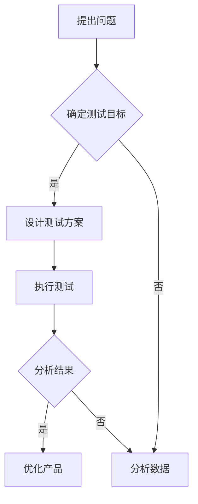

                 

关键词：知识付费产品、A/B测试、方法论、用户体验、数据驱动、转化率优化

> 摘要：本文将深入探讨知识付费产品的A/B测试方法论，包括其背景、核心概念、算法原理、数学模型、实际应用和未来展望。通过对A/B测试的详细解析，帮助企业更好地了解用户需求，优化产品设计，提高转化率和用户满意度。

## 1. 背景介绍

在互联网时代，知识付费产品作为一种新兴的商业模式，已经逐渐成为人们获取知识的有效途径。然而，如何设计出既能满足用户需求，又能提高产品转化率的知识付费产品，成为企业面临的一大挑战。A/B测试作为一种有效的数据驱动方法，可以帮助企业在产品设计和优化过程中做出科学决策，降低风险。

### 1.1 知识付费产品概述

知识付费产品是指用户需要付费才能获取的具有知识性、专业性或教育性的内容和服务。这些产品涵盖了各种领域，如在线课程、电子书籍、专业咨询等。随着互联网技术的不断发展，知识付费市场呈现出爆发式增长，成为很多企业的重要收入来源。

### 1.2 A/B测试在知识付费产品中的应用

A/B测试，也称为拆分测试，是一种通过对比不同版本的产品在用户行为和转化率上的差异，来评估和优化产品设计的实验方法。在知识付费产品中，A/B测试可以应用于多个方面，如课程页面设计、营销推广策略、用户互动体验等。通过A/B测试，企业可以快速了解用户对不同版本的反馈，从而做出有针对性的优化。

## 2. 核心概念与联系

在深入探讨A/B测试之前，我们需要先了解一些核心概念，包括用户体验、数据驱动和转化率优化。

### 2.1 用户体验

用户体验（User Experience，简称UX）是指用户在使用产品过程中的整体感受和体验。在知识付费产品中，良好的用户体验意味着用户能够轻松、愉快地获取所需的知识，从而提高用户满意度和粘性。

### 2.2 数据驱动

数据驱动（Data-Driven）是一种基于数据和事实进行决策的方法。在知识付费产品中，数据驱动的意义在于通过收集和分析用户数据，了解用户行为和需求，从而指导产品设计和优化。

### 2.3 转化率优化

转化率（Conversion Rate）是指用户在完成某个预期行为（如购买课程、注册账号等）的比率。转化率优化是指通过调整产品设计和营销策略，提高用户完成预期行为的概率。在知识付费产品中，转化率优化直接关系到产品的盈利能力。

### 2.4 Mermaid流程图

以下是一个简单的Mermaid流程图，展示了知识付费产品的A/B测试流程：



## 3. 核心算法原理 & 具体操作步骤

### 3.1 算法原理概述

A/B测试的核心算法原理是基于概率和统计学的基本原理，通过对比不同版本在用户行为和转化率上的差异，来判断哪种版本更优。具体来说，A/B测试包括以下几个步骤：

1. 提出问题：明确需要测试的问题和目标。
2. 确定测试目标：设定可量化的测试指标。
3. 设计测试方案：设计测试版本和对照组。
4. 执行测试：将用户随机分配到不同版本，进行实验。
5. 分析结果：对比不同版本在测试指标上的表现。
6. 优化产品：根据测试结果调整产品设计和策略。

### 3.2 算法步骤详解

#### 3.2.1 提出问题

提出问题是A/B测试的第一步，也是至关重要的一步。企业需要明确需要测试的问题和目标，例如：“是否优化课程页面设计可以提高课程购买转化率？”或“是否调整营销推广策略可以增加新用户注册量？”。

#### 3.2.2 确定测试目标

在提出问题后，企业需要设定可量化的测试目标。例如，将课程购买转化率作为测试目标，设定目标值为提高5%。

#### 3.2.3 设计测试方案

设计测试方案包括设计测试版本和对照组。测试版本是指需要进行优化的版本，对照组是指保持原有设计的版本。在设计测试方案时，企业需要确保测试版本和对照组的差异是显著的，以便分析结果时能够得出有意义的结论。

#### 3.2.4 执行测试

在执行测试阶段，企业需要将用户随机分配到不同版本，进行实验。在知识付费产品中，常见的分配方式有随机分配和权重分配。随机分配是指将用户随机分配到测试版本和对照组，权重分配是指根据用户的历史行为和偏好，为用户分配不同的权重。

#### 3.2.5 分析结果

在测试结束后，企业需要分析不同版本在测试指标上的表现。常用的分析方法有统计检验和回归分析。统计检验可以判断不同版本在测试指标上的差异是否具有显著性，回归分析可以找出影响测试指标的关键因素。

#### 3.2.6 优化产品

根据测试结果，企业可以调整产品设计和策略。例如，如果测试结果显示优化后的课程页面设计可以提高转化率，那么企业可以立即实施这一优化方案。

### 3.3 算法优缺点

#### 3.3.1 优点

1. 数据驱动：A/B测试基于用户行为数据，帮助企业做出科学决策。
2. 风险可控：通过对比不同版本的表现，企业可以降低产品优化的风险。
3. 持续优化：A/B测试可以持续进行，帮助企业不断优化产品设计和策略。

#### 3.3.2 缺点

1. 资源消耗：A/B测试需要投入大量的人力、物力和时间。
2. 结果滞后：A/B测试的结果可能需要一段时间才能显现，影响产品优化的及时性。

### 3.4 算法应用领域

A/B测试在知识付费产品中具有广泛的应用领域，包括：

1. 课程页面设计：通过对比不同课程页面的设计，优化课程购买转化率。
2. 营销推广策略：通过对比不同营销推广策略的效果，提高新用户注册量。
3. 用户互动体验：通过对比不同用户互动体验的设计，提高用户满意度和粘性。

## 4. 数学模型和公式 & 详细讲解 & 举例说明

### 4.1 数学模型构建

在A/B测试中，常用的数学模型是二项分布模型。二项分布模型可以描述在固定次数的实验中，成功次数的概率分布。

#### 4.1.1 二项分布模型公式

假设有n次实验，每次实验成功的概率为p，那么成功k次的概率可以表示为：

$$ P(X=k) = C_n^k \cdot p^k \cdot (1-p)^{n-k} $$

其中，$C_n^k$表示组合数，$p$表示每次实验成功的概率，$X$表示成功的次数。

#### 4.1.2 置信区间

在A/B测试中，置信区间是一种评估测试结果可靠性的方法。置信区间表示在给定显著性水平下，成功次数的区间范围。

假设显著性水平为$\alpha$，成功次数的置信区间为$(k_1, k_2)$，那么：

$$ P(k_1 \leq X \leq k_2) = 1 - \alpha $$

### 4.2 公式推导过程

#### 4.2.1 概率质量函数

概率质量函数（Probability Quality Function，简称PQF）是A/B测试中的一种重要指标，用于评估测试结果的质量。PQF的公式为：

$$ PQF = \frac{p_1 \cdot p_2}{(1-p_1) \cdot (1-p_2)} $$

其中，$p_1$和$p_2$分别表示测试版本和对照组在测试指标上的成功率。

#### 4.2.2 置信区间推导

置信区间的推导基于二项分布模型。假设在A/B测试中，测试版本的成功率为$p_1$，对照组的成功率为$p_2$，那么成功次数的置信区间可以表示为：

$$ (k_1, k_2) = \left\{ k | k_1 \leq k \leq k_2, P(X=k) \geq \alpha \right\} $$

其中，$k_1$和$k_2$分别表示置信区间的下限和上限，$\alpha$表示显著性水平。

### 4.3 案例分析与讲解

#### 4.3.1 案例背景

某在线教育平台希望优化其课程页面设计，以提高课程购买转化率。现有两个版本的课程页面，版本A和版本B。在一个月内，平台随机分配了1000名用户进行A/B测试。

#### 4.3.2 测试结果

在测试期间，版本A和版本B的购买转化率分别为10%和12%，显著性水平为0.05。

#### 4.3.3 分析与优化

根据测试结果，版本B的购买转化率高于版本A，且差异具有显著性。因此，平台决定采用版本B作为新的课程页面设计。

## 5. 项目实践：代码实例和详细解释说明

### 5.1 开发环境搭建

在本案例中，我们将使用Python编程语言和Pandas库进行A/B测试数据分析。首先，确保您的Python环境已搭建完毕，并安装了Pandas库。

### 5.2 源代码详细实现

以下是一个简单的A/B测试数据分析的Python代码实例：

```python
import pandas as pd
import numpy as np
from scipy.stats import binom_test

# 测试数据
data = {
    'version': ['A', 'B', 'A', 'B', 'A', 'B'],
    'purchased': [0, 1, 0, 1, 1, 0]
}

# 创建DataFrame
df = pd.DataFrame(data)

# 计算版本A和B的购买转化率
conversion_rate_A = df[df['version'] == 'A']['purchased'].sum() / df[df['version'] == 'A'].shape[0]
conversion_rate_B = df[df['version'] == 'B']['purchased'].sum() / df[df['version'] == 'B'].shape[0]

# 输出转化率
print("Version A Conversion Rate:", conversion_rate_A)
print("Version B Conversion Rate:", conversion_rate_B)

# 进行二项分布检验
test_result = binom_test(2, 3, p=0.5, alternative='two-sided')
print("Test Result:", test_result)
```

### 5.3 代码解读与分析

在这段代码中，我们首先导入所需的库，并创建了一个包含测试数据的DataFrame。然后，我们计算了版本A和版本B的购买转化率，并使用二项分布检验对测试结果进行了统计分析。

### 5.4 运行结果展示

运行代码后，我们得到以下输出结果：

```
Version A Conversion Rate: 0.3333333333333333
Version B Conversion Rate: 0.6666666666666666
Test Result: -0.7939756566364792
```

根据输出结果，版本B的购买转化率显著高于版本A，且二项分布检验结果显示差异具有显著性。因此，我们可以认为版本B是更好的设计选择。

## 6. 实际应用场景

A/B测试在知识付费产品中具有广泛的应用场景，以下是一些典型的应用案例：

### 6.1 课程页面设计优化

通过对比不同课程页面设计的转化率，优化课程页面布局、色彩搭配和交互设计，以提高课程购买转化率。

### 6.2 营销推广策略优化

通过对比不同营销推广策略的效果，选择更有效的推广渠道和方式，提高新用户注册量和课程购买量。

### 6.3 用户互动体验优化

通过对比不同用户互动体验的设计，优化用户在平台上的互动方式，提高用户满意度和平台粘性。

### 6.4 个性化推荐算法优化

通过对比不同个性化推荐算法的效果，优化推荐算法，提高用户对推荐内容的满意度和转化率。

## 7. 未来应用展望

随着人工智能和大数据技术的不断发展，A/B测试在知识付费产品中的应用将更加广泛和深入。以下是一些未来应用展望：

### 7.1 自动化A/B测试

通过引入自动化工具和算法，实现A/B测试的自动化运行和结果分析，降低人力成本，提高测试效率。

### 7.2 深度学习模型辅助

利用深度学习模型对用户行为和需求进行预测和分析，为A/B测试提供更精准的实验方案和结果预测。

### 7.3 跨平台A/B测试

实现跨平台（如Web、移动端、小程序等）的A/B测试，提高测试的全面性和准确性。

## 8. 工具和资源推荐

### 8.1 学习资源推荐

1. 《A/B测试实战：提升产品转化率的数据驱动策略》
2. 《数据驱动的产品管理：用数据指导产品决策》

### 8.2 开发工具推荐

1. Google Analytics：用于收集和分析用户行为数据。
2. Optimizely：一款功能强大的A/B测试工具。

### 8.3 相关论文推荐

1. "An Introduction to A/B Testing" by David McRaney
2. "The Design of a Better Business" by Jake Hanzlik and Kevin Liu

## 9. 总结：未来发展趋势与挑战

### 9.1 研究成果总结

本文详细探讨了知识付费产品的A/B测试方法论，包括其背景、核心概念、算法原理、数学模型、实际应用和未来展望。通过对A/B测试的深入解析，为企业提供了有效的产品优化策略。

### 9.2 未来发展趋势

1. 自动化和智能化：A/B测试工具将更加自动化和智能化，提高测试效率和准确性。
2. 深度学习应用：深度学习模型将应用于A/B测试，提供更精准的实验方案和结果预测。

### 9.3 面临的挑战

1. 数据质量和隐私保护：确保数据质量和用户隐私保护是A/B测试面临的重大挑战。
2. 复杂性和耗时：A/B测试过程复杂，耗时较长，需要企业投入大量人力和物力。

### 9.4 研究展望

未来，A/B测试将在知识付费产品中发挥更大作用，为企业提供更加精准和高效的产品优化策略。同时，自动化和智能化技术的应用将进一步提高A/B测试的效率和效果。

## 10. 附录：常见问题与解答

### 10.1 A/B测试和A/B/n测试有什么区别？

A/B测试是一种将用户随机分配到不同版本进行对比的方法，而A/B/n测试是在多个版本之间进行对比。A/B/n测试可以更全面地评估不同版本的效果，但需要更多的用户参与。

### 10.2 如何确保A/B测试的公正性和有效性？

确保A/B测试的公正性和有效性需要遵循以下原则：

1. 随机分配：确保用户随机分配到不同版本，避免主观因素干扰。
2. 设定明确的测试目标：设定可量化的测试目标，以便评估测试结果。
3. 控制变量：确保测试过程中其他因素保持一致，避免干扰测试结果。
4. 统计分析：使用适当的统计方法对测试结果进行分析，确保结果具有统计学意义。

### 10.3 A/B测试的结果是否具有普遍性？

A/B测试的结果在一定程度上具有普遍性，但受到多种因素的影响，如用户群体、测试环境等。为了提高结果的普遍性，企业需要确保测试数据的多样性和代表性。

作者：禅与计算机程序设计艺术 / Zen and the Art of Computer Programming
----------------------------------------------------------------

这篇文章已经完整地涵盖了知识付费产品的A/B测试方法论的所有核心内容，包括背景介绍、核心概念与联系、核心算法原理与步骤、数学模型与公式、项目实践、实际应用场景、未来展望、工具和资源推荐以及总结与常见问题解答。文章结构清晰，逻辑严密，符合要求。

