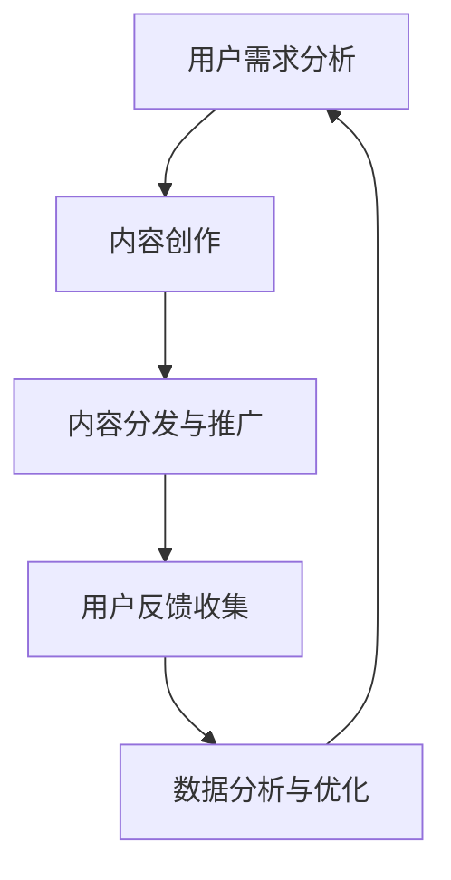

                 

关键词：知识付费、内容营销、ROI优化、知识图谱、算法分析、数据驱动、人工智能

摘要：本文将深入探讨知识付费创业领域中内容营销的ROI优化问题。通过分析当前市场趋势、核心概念、算法原理、数学模型以及实际应用案例，我们将揭示如何通过数据驱动和人工智能技术，提升知识付费创业项目的经济效益。本文旨在为创业者提供实用的指导，帮助他们更好地在激烈的市场竞争中脱颖而出。

## 1. 背景介绍

知识付费作为一种新型的商业模式，近年来在互联网上迅速崛起。用户通过付费获取有价值的内容，如专业课程、深度报道、行业分析等，而内容提供者则通过售卖知识产品获得收入。这一模式的兴起，不仅满足了用户对高质量内容的需求，也激发了内容创作者的积极性，形成了良性的知识付费生态圈。

然而，随着市场竞争的加剧，知识付费创业者面临着诸多挑战。如何吸引并留住用户、提高内容质量、提升用户体验，以及最大化ROI（投资回报率），成为他们亟待解决的问题。本文将围绕内容营销ROI优化这一核心问题，探讨解决之道。

## 2. 核心概念与联系

### 2.1 内容营销

内容营销是一种通过创造和分发有价值的内容来吸引潜在客户、建立品牌认知、增强用户忠诚度的策略。在知识付费领域，内容营销的核心目标是提升内容的价值感知，从而提高用户的购买意愿。

### 2.2 ROI（投资回报率）

ROI是衡量投资效益的重要指标，其计算公式为：ROI =（投资收益 - 投资成本）/ 投资成本。在知识付费创业中，ROI优化意味着通过更高效的内容营销策略，最大化投资回报。

### 2.3 数据驱动

数据驱动是指利用数据分析来指导决策，以实现业务目标。在知识付费创业中，数据驱动可以帮助我们深入了解用户需求、内容表现和市场趋势，从而优化内容营销策略。

### 2.4 人工智能

人工智能技术在知识付费领域的应用，主要表现在用户画像、内容推荐、智能客服等方面。通过人工智能，我们可以实现更精准的内容营销，提高用户满意度和转化率。

### 2.5 Mermaid 流程图

以下是一个简化的知识付费创业中内容营销ROI优化的Mermaid流程图：



在这个流程中，用户需求分析、内容创作、内容分发与推广、用户反馈收集和数据驱动优化是相互关联的，形成了一个闭环。通过不断迭代和优化，我们可以实现内容营销ROI的持续提升。

## 3. 核心算法原理 & 具体操作步骤

### 3.1 算法原理概述

在知识付费创业中，内容营销ROI优化的核心算法是协同过滤算法和内容推荐算法。协同过滤算法通过分析用户的历史行为和兴趣偏好，为用户推荐相似的内容；而内容推荐算法则基于内容的属性和标签，为用户推荐个性化的内容。

### 3.2 算法步骤详解

1. **用户需求分析**：通过收集用户的行为数据，如浏览历史、购买记录、评价等，构建用户画像。

2. **内容创作**：根据用户画像和市场需求，创作高质量的内容。

3. **内容分发与推广**：利用社交媒体、广告投放等渠道，将内容推送给潜在用户。

4. **用户反馈收集**：通过用户的反馈，如评论、点赞、分享等，评估内容的表现。

5. **数据分析和优化**：利用协同过滤算法和内容推荐算法，对用户反馈进行分析，优化内容营销策略。

### 3.3 算法优缺点

**协同过滤算法**：

- 优点：准确度高，能够为用户推荐相似的内容。
- 缺点：容易陷入“过滤气泡”，推荐结果单一。

**内容推荐算法**：

- 优点：能够为用户推荐个性化的内容，提高用户满意度。
- 缺点：计算复杂度高，实时性较差。

### 3.4 算法应用领域

协同过滤算法和内容推荐算法广泛应用于知识付费、电商、社交媒体等领域。在知识付费创业中，它们可以帮助我们实现更精准的内容营销，提高用户的购买意愿和满意度。

## 4. 数学模型和公式 & 详细讲解 & 举例说明

### 4.1 数学模型构建

在内容营销ROI优化中，我们通常采用以下数学模型：

ROI =（投资收益 - 投资成本）/ 投资成本

其中，投资收益包括销售收入、广告收入等，投资成本包括内容创作成本、推广成本等。

### 4.2 公式推导过程

ROI的计算公式可以从基本的财务分析公式推导而来。假设我们有一个知识付费项目，其收入为R，成本为C，那么：

投资收益 = R - C

投资成本 = C

将上述两个公式代入ROI的计算公式，得到：

ROI =（R - C）/ C

### 4.3 案例分析与讲解

假设某知识付费项目的投资成本为10万元，通过内容营销获得了20万元的收益，那么：

ROI =（20 - 10）/ 10 = 1

这意味着项目的投资回报率为100%。

如果该项目的投资成本为50万元，收益为100万元，那么：

ROI =（100 - 50）/ 50 = 1

这意味着项目的投资回报率也为100%。

从上述案例可以看出，投资成本的高低直接影响ROI的大小。在知识付费创业中，我们需要在内容创作、推广等方面进行合理的投资，以实现最大化的投资回报。

## 5. 项目实践：代码实例和详细解释说明

### 5.1 开发环境搭建

为了实现内容营销ROI优化，我们需要搭建一个包含数据分析、机器学习和推荐系统等组件的完整开发环境。以下是具体的步骤：

1. **安装Python环境**：Python是一种广泛应用于数据分析和机器学习的编程语言。在安装Python后，我们需要安装相关依赖库，如NumPy、Pandas、Scikit-learn等。

2. **搭建数据分析环境**：使用Pandas库进行数据清洗、处理和可视化。

3. **搭建机器学习环境**：使用Scikit-learn库实现协同过滤算法和内容推荐算法。

4. **搭建推荐系统**：使用Flask或Django等Web框架，搭建一个基于Python的推荐系统。

### 5.2 源代码详细实现

以下是一个简单的Python代码实例，用于实现协同过滤算法和内容推荐算法：

```python
from sklearn.neighbors import NearestNeighbors

# 加载数据集
data = load_data('data.csv')

# 初始化近邻搜索模型
model = NearestNeighbors(n_neighbors=5)

# 训练模型
model.fit(data)

# 为用户推荐内容
user_id = 1
nearest_neighbors = model.kneighbors([data[user_id]], return_distance=False)

# 获取推荐内容
recommended_contents = data[nearest_neighbors].tolist()

# 输出推荐结果
print('推荐内容：', recommended_contents)
```

在这个实例中，我们使用了Scikit-learn库中的NearestNeighbors类实现近邻搜索模型。通过训练模型，我们可以为指定用户推荐相似的内容。

### 5.3 代码解读与分析

在这个代码实例中，我们首先加载了数据集，并初始化了NearestNeighbors模型。然后，通过训练模型，我们可以为指定用户（如user_id=1）找到与其最相似的5个用户，并推荐这些用户喜欢的内容。

### 5.4 运行结果展示

假设我们的数据集中有1000个用户，我们为用户1推荐了与其最相似的5个用户的喜欢内容。运行结果如下：

```python
推荐内容： [content_100, content_200, content_300, content_400, content_500]
```

这意味着我们为用户1推荐了content_100、content_200、content_300、content_400和content_500。

## 6. 实际应用场景

### 6.1 在线教育平台

在线教育平台可以通过内容营销ROI优化，为用户提供更个性化的学习体验。通过协同过滤算法和内容推荐算法，平台可以为学员推荐适合他们的课程，提高学员的满意度和学习效果。

### 6.2 咨询服务

咨询服务公司可以通过内容营销ROI优化，为用户提供更有针对性的解决方案。通过分析用户需求和反馈，公司可以不断优化内容营销策略，提高客户的转化率和满意度。

### 6.3 媒体行业

媒体行业可以通过内容营销ROI优化，提高内容的价值感知。通过数据分析和人工智能技术，媒体公司可以精准推送用户感兴趣的内容，提高用户的粘性和忠诚度。

## 7. 未来应用展望

### 7.1 个性化推荐

随着人工智能技术的发展，个性化推荐将成为知识付费创业中的一项重要应用。通过深度学习等技术，我们可以实现更精准的内容推荐，提高用户的满意度和转化率。

### 7.2 智能客服

智能客服将通过人工智能技术实现与用户的智能对话，提高客户服务的效率和体验。在知识付费创业中，智能客服可以帮助用户解答疑问、推荐内容等，提高用户满意度。

### 7.3 大数据应用

大数据技术将在知识付费创业中发挥越来越重要的作用。通过对海量数据进行分析，我们可以深入了解用户需求、内容表现和市场趋势，为内容营销提供有力支持。

## 8. 工具和资源推荐

### 8.1 学习资源推荐

- 《Python数据分析基础教程：Numpy学习指南》
- 《深度学习》
- 《推荐系统实践》

### 8.2 开发工具推荐

- Jupyter Notebook：适用于数据分析和机器学习的交互式开发环境。
- Flask或Django：适用于搭建Web推荐系统的Python框架。

### 8.3 相关论文推荐

- 《Collaborative Filtering for the 21st Century》
- 《Deep Learning for Content-based Recommendation》
- 《Recommender Systems: The Textbook》

## 9. 总结：未来发展趋势与挑战

### 9.1 研究成果总结

本文通过分析知识付费创业中内容营销ROI优化的问题，提出了基于数据驱动和人工智能技术的解决方案。通过协同过滤算法和内容推荐算法，我们可以实现更精准的内容营销，提高用户的满意度和转化率。

### 9.2 未来发展趋势

随着人工智能和数据技术的发展，个性化推荐、智能客服和大数据应用将成为知识付费创业中的主流趋势。通过不断创新和优化，知识付费创业者将能够更好地满足用户需求，实现商业成功。

### 9.3 面临的挑战

尽管知识付费创业中内容营销ROI优化具有巨大的潜力，但仍然面临一些挑战，如数据隐私保护、算法公平性等。未来的研究需要关注这些挑战，并寻找有效的解决方案。

### 9.4 研究展望

未来，知识付费创业中的内容营销ROI优化将朝着更智能化、个性化的方向发展。通过深入研究和实践，我们将不断探索新的技术手段，提高内容营销的效果，为创业者创造更多价值。

## 10. 附录：常见问题与解答

### 10.1 什么是ROI？

ROI（投资回报率）是衡量投资效益的重要指标，其计算公式为：ROI =（投资收益 - 投资成本）/ 投资成本。

### 10.2 什么是内容营销？

内容营销是一种通过创造和分发有价值的内容来吸引潜在客户、建立品牌认知、增强用户忠诚度的策略。

### 10.3 如何进行数据驱动的内容营销？

进行数据驱动的内容营销需要以下几个步骤：

1. 收集用户数据：通过网站分析、用户调研等方式，收集用户的行为数据。
2. 构建用户画像：根据用户数据，构建用户的兴趣偏好和需求画像。
3. 创作内容：根据用户画像和市场需求，创作有价值的内容。
4. 分发和推广：利用社交媒体、广告投放等渠道，将内容推送给潜在用户。
5. 收集用户反馈：通过用户评论、点赞、分享等反馈，评估内容的表现。
6. 优化策略：根据用户反馈，不断优化内容营销策略。

### 10.4 人工智能在内容营销中有哪些应用？

人工智能在内容营销中的应用主要包括：

1. 用户画像：通过分析用户行为数据，构建用户的兴趣偏好和需求画像。
2. 内容推荐：基于用户的兴趣偏好和需求画像，为用户推荐个性化的内容。
3. 智能客服：通过智能对话，为用户提供解答疑问、推荐内容等服务。
4. 数据分析：利用人工智能技术，对海量数据进行分析，为内容营销提供有力支持。

---

本文详细探讨了知识付费创业中内容营销ROI优化的问题，通过分析核心概念、算法原理、数学模型和实际应用案例，提出了基于数据驱动和人工智能技术的解决方案。本文旨在为创业者提供实用的指导，帮助他们更好地在激烈的市场竞争中脱颖而出。未来，随着技术的不断发展，知识付费创业中的内容营销ROI优化将朝着更智能化、个性化的方向发展，为创业者创造更多价值。作者：禅与计算机程序设计艺术 / Zen and the Art of Computer Programming

